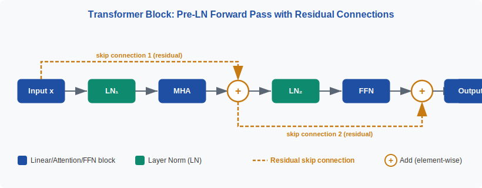
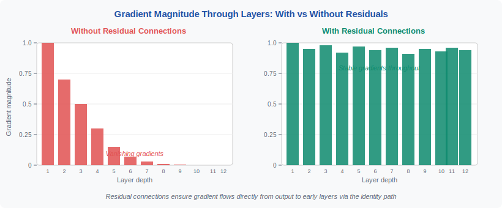
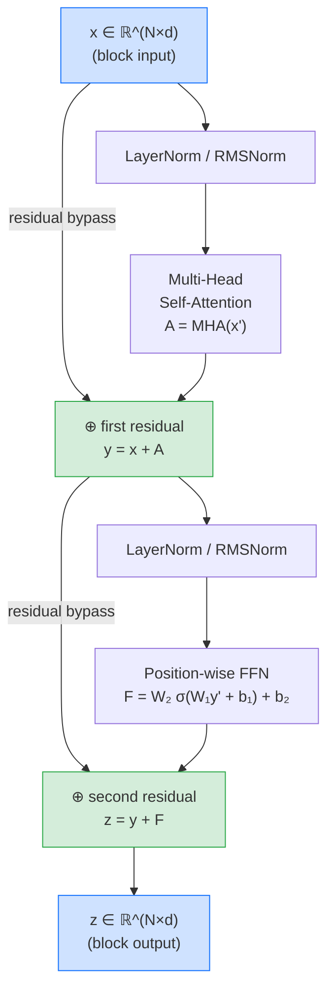
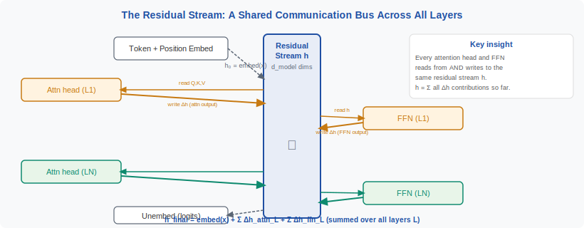

<div align="center">
[🏠 Home](../../README.md) &nbsp;•&nbsp; [📚 Section 1 — Transformer Architecture](./README.md) &nbsp;•&nbsp; [Q2 — Scaled Attention ➡️](./q02-scaled-attention.md)
</div>

---

# Q1 · Walk through the forward pass of a vanilla Transformer block. What are the residual connections protecting against, and what would happen if you removed them?

<div align="center">


</div>

> [!IMPORTANT]
> **The 20-second answer.** A Transformer block normalizes its input, runs multi-head self-attention, adds the result back to the original input (first residual), normalizes again, runs a position-wise FFN, and adds back again (second residual). Residual connections solve the vanishing-gradient problem by injecting an identity term $I$ into every backward-pass Jacobian — so gradient can flow straight through even if the learned $F(x)$ is tiny — and they prevent token representations from collapsing to a rank-1 mean under repeated attention-smoothing. Remove them and training either stalls immediately, diverges to NaN, or the effective depth collapses to a handful of layers regardless of how many you stack.

---

## Table of contents

1. [First principles — what a Transformer block IS](#1-first-principles--what-a-transformer-block-is)
2. [The problem, told as a story — why residuals are needed](#2-the-problem-told-as-a-story--why-residuals-are-needed)
3. [The mechanism, precisely — forward pass math and flowchart](#3-the-mechanism-precisely--forward-pass-math-and-flowchart)
4. [The fix — residual connections explained with equations](#4-the-fix--residual-connections-explained-with-equations)
5. [Intuition and figures — geometric view of the residual stream](#5-intuition-and-figures--geometric-view-of-the-residual-stream)
6. [Variants and comparison — pre-norm vs post-norm](#6-variants-and-comparison--pre-norm-vs-post-norm)
7. [Algorithm and pseudocode](#7-algorithm-and-pseudocode)
8. [Reference implementation — PyTorch](#8-reference-implementation--pytorch)
9. [Worked numerical example](#9-worked-numerical-example)
10. [Where it is used and where it breaks](#10-where-it-is-used-and-where-it-breaks)
11. [Cousins and alternatives](#11-cousins-and-alternatives)
12. [Interview drill](#12-interview-drill)
13. [Common misconceptions](#13-common-misconceptions)
14. [One-screen summary](#14-one-screen-summary)
15. [References](#15-references)

---

## 1. First principles — what a Transformer block IS

A Transformer block is the atomic computation unit of every modern large language model. Its job is deceptively simple: take a matrix of token vectors, let the tokens communicate with each other, then let each token independently digest what it learned. Do this enough times in sequence and you get a model that can reason about syntax, coreference, semantics, and eventually code, mathematics, and language.

Formally, a block maps a tensor $X \in \mathbb{R}^{B \times N \times d}$ to a tensor of the same shape. Here $B$ is batch size, $N$ is sequence length, and $d$ is the model dimension (also called $d_{\text{model}}$). The shape-preserving property is not cosmetic — it is the algebraic precondition for stacking. Because every block has the same input shape as its output shape, you can compose $L$ blocks into a depth-$L$ network by simply wiring them in series, exactly like LEGO bricks.

Typical values of $d$: 768 (BERT-Base, 12 heads), 4096 (LLaMA-2 7B, 32 heads), 8192 (LLaMA-2 70B, 64 heads), 12288 (GPT-3 175B, 96 heads). The FFN hidden dimension is nearly always $4d$. These are not magic numbers — they emerge from empirical scaling and the need to keep the attention head dimension $d_k = d/h$ large enough to be expressive.

Why do we need to stack many blocks? A single block can only capture shallow, first-order co-occurrences between tokens. Stacking creates a hierarchy: early layers tend to learn surface patterns (punctuation, word-boundary cues), middle layers capture syntactic structure (agreement, constituent boundaries), and late layers encode semantic and task-specific representations (entity identity, argument structure). This emergent specialization is an empirical finding from probing experiments, not a design constraint — but it is consistent enough across architectures that it has become a reliable mental model.



*Figure 1 — High-level anatomy of a pre-norm Transformer block. The two residual highways (grey arrows bypassing each sublayer) are the architectural feature this question is fundamentally about.*

---

## 2. The problem, told as a story — why residuals are needed

### The gradient highway problem

Imagine you have hired 50 editors to revise a document in sequence: editor 1 reads the draft and sends notes to editor 2, who edits and passes to editor 3, and so on. You, the author, want feedback on whether your original word choices were good. By the time the 50th editor's opinion travels back to you through 49 layers of relaying, it has been diluted beyond recognition. Every relay loses a bit of the signal. That is exactly what happens to gradients in a deep network without residual connections.

Backpropagation computes the gradient of the loss $\mathcal{L}$ with respect to a parameter at layer $\ell$ by multiplying together one Jacobian matrix per layer above $\ell$:

$$\frac{\partial \mathcal{L}}{\partial \theta_\ell} = \frac{\partial \mathcal{L}}{\partial x_L} \cdot J_L \cdot J_{L-1} \cdots J_{\ell+1}$$

where $J_k = \partial x_k / \partial x_{k-1}$ is the Jacobian of layer $k$. If the spectral norm of each $J_k$ is $\sigma < 1$ — which happens easily when weights are small or activations are in the saturating regime — then the product shrinks as $\sigma^{L-\ell}$. For $L = 50$, $\sigma = 0.9$, the gradient at layer 1 is $0.9^{49} \approx 0.005$ times the gradient at layer 50. Layer 1 barely updates. This is **vanishing gradients**.

Symmetrically, if $\sigma > 1$, the product explodes as $\sigma^{L-\ell}$. The gradient at early layers is astronomically large, the update step overshoots the loss basin, and training diverges to NaN. This is **exploding gradients**.

### Why the obvious fix doesn't work

You might think: just initialize weights more carefully, or clip gradients. Both help at the margins but neither solves the fundamental problem. Careful initialization (e.g. Xavier/Glorot) tries to set $\sigma \approx 1$ at the start, but as training progresses the weights move, $\sigma$ drifts, and the problem returns. Gradient clipping prevents explosion but not vanishing — you cannot clip a gradient that is already zero.

The real fix has to change the structure of the computation, not just the hyperparameters. That fix is the residual connection.

### The ResNet insight (2015)

He et al. asked a clean question: if extra layers could learn the identity function, a deeper network should never be worse than a shallower one on training data. Yet empirically, 56-layer plain networks had higher training error than 20-layer ones. Something about the optimization landscape was actively resisting the identity. Their fix: reformulate what each layer is asked to learn. Instead of asking the layer to learn $\mathcal{H}(x)$, restructure it so the layer learns the **residual** $F(x) = \mathcal{H}(x) - x$, and add $x$ back by definition:

$$\text{output} = x + F(x)$$

If the layer should be the identity, $F(x) = 0$, which is trivially easy to learn by driving weights toward zero. This single reformulation transformed 20-layer networks into 152-layer ones — and won ImageNet 2015. The Transformer paper adopted it directly two years later.



*Figure 2 — Gradient flow with and without residual connections. In the plain stack (left), gradients multiply through every Jacobian; small eigenvalues compound and the signal vanishes. In the residual stack (right), each backward step includes an identity term, creating a gradient highway that cannot fully vanish.*

---

## 3. The mechanism, precisely — forward pass math and flowchart

### The five steps

Modern Transformers (LLaMA, Mistral, PaLM, GPT-NeoX, Gemini) use the **pre-norm** variant. The 2017 original used post-norm; we address the difference in Section 6. Let $x \in \mathbb{R}^{N \times d}$ be the input to one block (dropping the batch dimension for clarity).

**Step 1 — Normalize before attention**

$$x' = \text{LayerNorm}(x)$$

In LLaMA-style models this is $\text{RMSNorm}(x) = x / \text{rms}(x) \cdot \gamma$ where $\text{rms}(x) = \sqrt{\frac{1}{d}\sum_i x_i^2}$.

**Step 2 — Multi-head self-attention**

Project $x'$ into queries, keys, and values for each head $h$:

$$Q_h = x' W_Q^h, \quad K_h = x' W_K^h, \quad V_h = x' W_V^h$$

Compute scaled dot-product attention per head:

$$\text{head}_h = \text{softmax}\!\left(\frac{Q_h K_h^\top}{\sqrt{d_k}}\right) V_h$$

Concatenate and project:

$$A = \text{Concat}(\text{head}_1, \ldots, \text{head}_H) W_O$$

**Step 3 — First residual connection**

$$y = x + A$$

The key point: $x$ here is the **raw, pre-norm input**, not $x'$. The residual bypasses LayerNorm, keeping the clean highway.

**Step 4 — Normalize, then FFN**

$$y' = \text{LayerNorm}(y)$$

$$F = W_2 \cdot \sigma(W_1 y' + b_1) + b_2$$

where $\sigma$ is GELU (BERT, GPT-2) or SwiGLU (LLaMA, PaLM). The hidden dimension of $W_1$ is $4d$; the output dimension of $W_2$ is $d$.

**Step 5 — Second residual connection**

$$z = y + F$$

$z \in \mathbb{R}^{N \times d}$ — same shape as $x$, ready for the next block.

### Flowchart



> [!NOTE]
> The two green nodes (⊕) are the residual additions. Everything else — normalization, attention, FFN — is a sublayer that computes a **correction** $F(x)$ to be added to the input, never a wholesale replacement of it. This framing is not just intuition; Anthropic's mechanistic interpretability work formalizes it as the **residual stream**.

---

## 4. The fix — residual connections explained with equations

### The backward pass through a residual block

Let $y = x + F(x)$ where $F$ is any differentiable function (attention or FFN). The chain rule gives:

$$\frac{\partial \mathcal{L}}{\partial x} = \frac{\partial \mathcal{L}}{\partial y} \cdot \frac{\partial y}{\partial x} = \frac{\partial \mathcal{L}}{\partial y} \cdot \left(I + \frac{\partial F}{\partial x}\right)$$

The term $I + \frac{\partial F}{\partial x}$ is the key. Even if $\frac{\partial F}{\partial x} \approx 0$ — because the sublayer is saturated, poorly initialized, or just trained into a near-zero regime — the identity matrix $I$ ensures the gradient is at least $\frac{\partial \mathcal{L}}{\partial y}$ itself. The gradient cannot vanish through a residual block.

Stacking $L$ blocks, the gradient back to the input of block 1 is:

$$\frac{\partial \mathcal{L}}{\partial x_0} = \frac{\partial \mathcal{L}}{\partial x_L} \cdot \prod_{\ell=1}^{L} \left(I + \frac{\partial F_\ell}{\partial x_{\ell-1}}\right)$$

Expanding the product algebraically, you get a sum over all $2^L$ subsets of layers — each subset corresponding to a "path" through the network that takes either the residual shortcut or the learned sublayer at each block. This is the "ensemble of shallow networks" interpretation (Veit et al., 2016): the effective network is an exponentially large ensemble of paths of varying depth, dominated by the shorter paths that have more stable gradients. Removing residuals collapses this rich ensemble to a single fixed-depth path.

### Four things residuals protect against simultaneously

**Protection 1 — Vanishing gradients.** The identity term $I$ in every backward-pass factor prevents the eigenvalue-compounding collapse. This is the classical argument (He et al., 2015).

**Protection 2 — Exploding gradients.** Less obvious, but when $F(x)$ is initialized to near-zero (as it is with standard initialization), $I + \partial F/\partial x \approx I$, whose eigenvalues are all 1. The product of $L$ identity matrices is the identity — neither vanishing nor exploding. This is why identity-preserving initialization works only in residual networks.

**Protection 3 — Representation rank collapse.** Dong, Cordonnier, and Loukas (2021) proved that pure self-attention without skip connections drives token representations to a rank-1 matrix at a doubly exponential rate in depth. Attention is a smoothing operation — it replaces each token with a weighted average of others. Without residuals, repeated averaging drives all tokens to the global mean. The residual connection injects the original token identity back at each layer, preventing this collapse. The FFN further prevents it by applying a non-linear per-token transformation.

**Protection 4 — Loss of the residual stream.** Elhage et al. (2021) introduced the **residual stream** as the central object in Transformer mechanistic interpretability. Each attention head and MLP reads from the stream (via linear projection), computes a correction, and writes back to the stream (via linear projection into $d$-dimensional space). The residual is the shared communication bus. Induction heads — the circuit responsible for in-context learning — form across two layers by one head writing a pattern that a downstream head reads. Without residuals, the stream ceases to exist and these circuits cannot form.

> [!WARNING]
> A common interview mistake is to treat residuals as a minor engineering detail. They are not. They are a structural requirement for depth: without them, the optimizer has no gradient signal, the representations collapse, and the mechanistic circuits that give Transformers their power cannot form. Every modern LLM — GPT-4, LLaMA-3, Gemini, Claude — uses residual connections, with no serious architectural proposal to remove them.

---

## 5. Intuition and figures — geometric view of the residual stream

### The "refinement, not replacement" intuition

Without residuals, each layer must map a token's current representation to an entirely new representation. If layer 3 decides the token "bank" might be financial (not riverine), that conclusion is baked into a new vector, and layers 4–12 must respect it without any access to the original embedding. The original information is gone — overwritten.

With residuals, each layer adds a delta — a small correction vector — to the running representation. Layer 3 might add a small vector in the direction of "financial institution". Layer 5 might add a vector in the direction of "formal register". The original embedding persists beneath all these corrections, and any layer can attend to it implicitly because the residual stream carries it forward unchanged. This is why early layers in large Transformers behave roughly like identity transformations — the learned corrections are small, and the bulk of the representational content is the original embedding augmented by positional information.

Geometrically, think of the residual stream as a trajectory through $\mathbb{R}^d$. Each block nudges the trajectory by adding a small displacement vector $F(x)$. The trajectory starts at the token embedding and ends at a representation that has accumulated context from all layers. The gradient flows backwards along this trajectory, with the identity shortcut ensuring that the gradient vector never loses its coherent direction.

### The shattered-gradient phenomenon

Balduzzi et al. (2017) showed that in deep networks without residuals, the gradient field at nearby input positions becomes decorrelated — it looks like white noise. This happens because each layer applies a nonlinearity that flips the sign of some gradient components unpredictably, and without the identity term to preserve coherence, these sign flips accumulate. The optimizer cannot find a consistent descent direction because the gradient is pointing in a different random direction at every slightly-perturbed input.

Residuals preserve gradient correlation across depth, because the identity shortcut carries the coherent component of the gradient through without distortion. This is an independent, more subtle argument for residuals that goes beyond the simple eigenvalue story.



*Figure 3 — The residual stream as a shared communication channel (Elhage et al., 2021). Attention heads and MLPs do not transform the stream — they each add a vector to it. The stream is the sum of all these contributions plus the original embedding. This additive structure is only possible because of residual connections.*

---

## 6. Variants and comparison — pre-norm vs post-norm

The placement of LayerNorm relative to the residual addition has significant practical consequences. The 2017 paper used **post-norm**; every modern LLM uses **pre-norm**.

| Property | Post-Norm (Vaswani et al. 2017) | Pre-Norm (Xiong et al. 2020) |
|---|---|---|
| **LayerNorm position** | Wraps the residual: $\text{LN}(x + F(x))$ | Inside the sublayer: $x + F(\text{LN}(x))$ |
| **Residual highway clean?** | ❌ No — LN re-scales the summed signal | ✅ Yes — raw $x$ passes through unchanged |
| **Learning-rate warmup required?** | ✅ Yes — unstable without warmup | ❌ No — stable from step 1 |
| **Scale to 100+ layers?** | ❌ Hard — requires DeepNorm tricks | ✅ Yes — standard pre-norm works to ~100L |
| **Used in** | Original Transformer, some BERT variants | LLaMA, GPT-NeoX, PaLM, Mistral, Gemini |
| **Init behaviour** | Block ≠ identity (LN normalizes residual) | Block ≈ identity (F(x) ≈ 0 at init) |
| **Gradient flow at init** | Moderate — LN provides some stabilization | Clean — identity term fully preserved |

**Why post-norm needs warmup.** In post-norm, LayerNorm is applied after $x + F(x)$. At initialization, $F(x) \approx 0$, so the input to LN is approximately $x$, which is fine. But the output of LN is $x / \text{std}(x)$ — the residual is normalized away. The block is not an identity; it is a normalizer. Gradient flow back through LN is well-conditioned only if the variance of the activations is stable, and in the very first steps of training it is not. Warmup buys time for the activations to stabilize. Pre-norm avoids this entirely because LN is applied before the residual addition, not after, so the highway is untouched.

**DeepNorm: extending post-norm to extreme depth.** Wang et al. (2022) showed that with a modified residual scaling $y = \alpha x + F(x)$ (where $\alpha$ is a depth-dependent constant $> 1$) and a careful initialization that scales down $W_Q, W_K, W_V, W_1, W_2$ by a factor $\beta < 1$, post-norm Transformers can be trained stably to over 1000 layers. The key insight is that $\alpha > 1$ makes the residual contribution dominant at initialization, which stabilizes the gradient norm. This demonstrates that residual scaling — not just presence — matters at extreme depth.

**RMSNorm.** LLaMA, Gemma, and Mistral replace LayerNorm with RMSNorm (Zhang & Sennrich, 2019):

$$\text{RMSNorm}(x) = \frac{x}{\sqrt{\frac{1}{d}\sum_i x_i^2 + \epsilon}} \cdot \gamma$$

RMSNorm omits the mean-centering step, saving computation and slightly simplifying the gradient. Empirically it performs on par with LayerNorm in pre-norm settings.

> [!TIP]
> If an interviewer asks "why didn't the original paper use pre-norm?", the honest answer is that at 6–12 layers, the difference is small, and the original team made a reasonable choice that worked. The pre-norm advantage only becomes decisive at much greater depth. This is the kind of historical nuance that signals genuine understanding.

---

## 7. Algorithm and pseudocode

The following pseudocode is architecture-agnostic and makes the two residual additions explicit. This is what you would write on a whiteboard.

```
Algorithm: PreNorm Transformer Block Forward Pass
Input:  x ∈ ℝ^(N × d)          — sequence of N token vectors, each dimension d
Output: z ∈ ℝ^(N × d)          — enriched token vectors, same shape

Parameters:
  norm1, norm2  — LayerNorm (or RMSNorm) modules, each with d learnable scales
  W_Q, W_K, W_V ∈ ℝ^(d × d)   — QKV projection weights (concatenated over heads)
  W_O ∈ ℝ^(d × d)              — output projection
  W_1 ∈ ℝ^(4d × d), b_1 ∈ ℝ^(4d)  — FFN first layer
  W_2 ∈ ℝ^(d × 4d), b_2 ∈ ℝ^d     — FFN second layer

─── Attention sublayer ───────────────────────────────────────────────────────
1.  x_norm ← norm1(x)                     # normalize, but keep x intact

2.  Q ← x_norm · W_Q                      # (N × d)
    K ← x_norm · W_K
    V ← x_norm · W_V

3.  Reshape Q, K, V into H heads:
      Q_h, K_h, V_h ∈ ℝ^(N × d_k)  for h = 1 … H   [d_k = d/H]

4.  For each head h:
      scores_h ← Q_h · K_hᵀ / √d_k        # (N × N) — raw attention logits
      attn_h   ← softmax(scores_h, dim=-1) # (N × N) — attention weights
      ctx_h    ← attn_h · V_h              # (N × d_k) — attended context

5.  A ← Concat(ctx_1, …, ctx_H) · W_O     # (N × d) — multi-head output

6.  y ← x + A                             # ← FIRST RESIDUAL ADD

─── FFN sublayer ─────────────────────────────────────────────────────────────
7.  y_norm ← norm2(y)                     # normalize, but keep y intact

8.  hidden ← σ(y_norm · W_1ᵀ + b_1)      # (N × 4d);  σ = GELU or SwiGLU

9.  F ← hidden · W_2ᵀ + b_2              # (N × d)

10. z ← y + F                             # ← SECOND RESIDUAL ADD

Return z
```

> [!NOTE]
> Lines 6 and 10 are the only two places residuals appear, yet they are what make lines 1–5 and 7–9 trainable at depth. Delete lines 6 and 10, replace `y` with `A` on line 7 and `z` with `F` on line 10, and you have a plain deep stack with all the failure modes described in Section 4.

---

## 8. Reference implementation — PyTorch

The following is a faithful pre-norm Transformer block in approximately 60 lines of PyTorch. It is self-contained, numerically correct, and matches the pseudocode above exactly. The two residual additions are marked with inline comments.

```python
import math
import torch
import torch.nn as nn
import torch.nn.functional as F


class MultiHeadSelfAttention(nn.Module):
    """Scaled dot-product multi-head self-attention."""

    def __init__(self, d_model: int, n_heads: int, dropout: float = 0.0):
        super().__init__()
        assert d_model % n_heads == 0, "d_model must be divisible by n_heads"
        self.n_heads = n_heads
        self.d_k = d_model // n_heads

        # Fused QKV projection — one matrix multiply instead of three
        self.qkv_proj = nn.Linear(d_model, 3 * d_model, bias=False)
        self.out_proj = nn.Linear(d_model, d_model, bias=False)
        self.dropout = nn.Dropout(dropout)

    def forward(self, x: torch.Tensor, mask: torch.Tensor | None = None) -> torch.Tensor:
        B, N, d = x.shape
        H, d_k = self.n_heads, self.d_k

        # Project to Q, K, V and reshape to (B, H, N, d_k)
        qkv = self.qkv_proj(x)                        # (B, N, 3d)
        Q, K, V = qkv.split(d, dim=-1)                # each (B, N, d)
        Q = Q.view(B, N, H, d_k).transpose(1, 2)      # (B, H, N, d_k)
        K = K.view(B, N, H, d_k).transpose(1, 2)
        V = V.view(B, N, H, d_k).transpose(1, 2)

        # Scaled dot-product attention
        scale = math.sqrt(d_k)
        scores = torch.matmul(Q, K.transpose(-2, -1)) / scale  # (B, H, N, N)
        if mask is not None:
            scores = scores.masked_fill(mask == 0, float("-inf"))
        attn = F.softmax(scores, dim=-1)               # (B, H, N, N)
        attn = self.dropout(attn)

        # Weighted sum of values, then reshape and project
        ctx = torch.matmul(attn, V)                    # (B, H, N, d_k)
        ctx = ctx.transpose(1, 2).contiguous().view(B, N, d)  # (B, N, d)
        return self.out_proj(ctx)                      # (B, N, d)


class FeedForward(nn.Module):
    """Position-wise feed-forward network with GELU activation."""

    def __init__(self, d_model: int, d_ff: int | None = None, dropout: float = 0.0):
        super().__init__()
        d_ff = d_ff or 4 * d_model
        self.w1 = nn.Linear(d_model, d_ff, bias=True)
        self.w2 = nn.Linear(d_ff, d_model, bias=True)
        self.dropout = nn.Dropout(dropout)

    def forward(self, x: torch.Tensor) -> torch.Tensor:
        return self.w2(self.dropout(F.gelu(self.w1(x))))


class TransformerBlock(nn.Module):
    """
    Pre-norm Transformer block.

    Forward pass:
        y = x + Attention(LayerNorm(x))    ← first residual
        z = y + FFN(LayerNorm(y))          ← second residual
    """

    def __init__(
        self,
        d_model: int,
        n_heads: int,
        d_ff: int | None = None,
        dropout: float = 0.0,
        norm_eps: float = 1e-5,
    ):
        super().__init__()
        self.norm1 = nn.LayerNorm(d_model, eps=norm_eps)
        self.norm2 = nn.LayerNorm(d_model, eps=norm_eps)
        self.attn = MultiHeadSelfAttention(d_model, n_heads, dropout)
        self.ffn = FeedForward(d_model, d_ff, dropout)
        self.dropout = nn.Dropout(dropout)

    def forward(self, x: torch.Tensor, mask: torch.Tensor | None = None) -> torch.Tensor:
        # ── Attention sublayer ───────────────────────────────────────────────
        x_norm = self.norm1(x)
        attn_out = self.attn(x_norm, mask)
        y = x + self.dropout(attn_out)        # ← FIRST RESIDUAL ADD

        # ── FFN sublayer ─────────────────────────────────────────────────────
        y_norm = self.norm2(y)
        ffn_out = self.ffn(y_norm)
        z = y + self.dropout(ffn_out)         # ← SECOND RESIDUAL ADD

        return z


# ── Sanity check ──────────────────────────────────────────────────────────────
if __name__ == "__main__":
    torch.manual_seed(42)
    block = TransformerBlock(d_model=512, n_heads=8)
    x = torch.randn(2, 16, 512)              # (B=2, N=16, d=512)
    z = block(x)
    assert z.shape == x.shape, "Output shape must match input shape"
    print(f"Input  shape: {x.shape}")
    print(f"Output shape: {z.shape}")
    print(f"Max abs delta (z - x): {(z - x).abs().max().item():.4f}")
    # At initialization, F(x) ≈ 0, so z ≈ x — the block is near-identity.
```

**What the last line demonstrates.** At random initialization, `z ≈ x`. The max absolute delta between input and output is small because $W_1$ and $W_2$ are initialized with standard Kaiming/Xavier scaling, giving $F(x) \approx 0$. The block starts as approximately the identity — exactly the property that makes deep training stable. If you deleted the two residual adds and ran the same check, `z` would be a nonlinear scrambling of `x` with no identity relationship whatsoever.

---

## 9. Worked numerical example

Let us trace a minimal concrete example: $d = 4$, $H = 2$ heads ($d_k = 2$), $N = 3$ tokens. We use simple numbers to keep the arithmetic tractable on paper.

### Setup

```
Token embeddings (input x):
  token 0: [1.0,  0.0,  0.5,  0.0]
  token 1: [0.0,  1.0,  0.0,  0.5]
  token 2: [0.5,  0.5,  1.0,  1.0]

x = [[1.0, 0.0, 0.5, 0.0],
     [0.0, 1.0, 0.0, 0.5],
     [0.5, 0.5, 1.0, 1.0]]   shape (3, 4)
```

### Step 1 — LayerNorm

LayerNorm normalizes each token vector to zero mean and unit variance, then scales by learned $\gamma$ (initialize $\gamma = \mathbf{1}$, $\beta = \mathbf{0}$).

For token 0: $\mu = (1.0 + 0.0 + 0.5 + 0.0)/4 = 0.375$, $\sigma^2 = [(0.625)^2 + (0.375)^2 + (0.125)^2 + (0.375)^2]/4 = [0.390 + 0.140 + 0.015 + 0.140]/4 \approx 0.171$, $\sigma \approx 0.414$.

$$x'_0 = \frac{[1.0, 0.0, 0.5, 0.0] - 0.375}{0.414} \approx [1.51, -0.91, 0.30, -0.91]$$

(In practice a small $\epsilon$ is added to $\sigma$ for numerical stability; we omit it here.)

### Step 2 — Attention (illustrative)

Using toy weight matrices initialized so $W_Q = W_K = I/\sqrt{2}$ and $W_V = I$ for head 1 (for tractability):

$$Q_0 = K_0 = x'_0 / \sqrt{2} \approx [1.07, -0.64, 0.21, -0.64]$$

The attention score between token 0 and itself:

$$\text{score}_{00} = Q_0 \cdot K_0^\top / \sqrt{d_k} = \frac{\|Q_0\|^2}{\sqrt{2}} \approx \frac{1.07^2 + 0.64^2 + 0.21^2 + 0.64^2}{\sqrt{2}} \approx \frac{1.925}{1.414} \approx 1.36$$

After softmax over all three tokens, token 0 would have the highest self-attention weight (it has the highest norm), pulling the output toward its own value vector. The key point is that the output $A$ is a weighted average of value vectors — a **smoothed** version of $x'$.

### Step 3 — First residual add

Suppose the attention output for token 0 is $A_0 \approx [0.8, -0.3, 0.4, -0.2]$ (plausible after projection back to $d = 4$):

$$y_0 = x_0 + A_0 = [1.0, 0.0, 0.5, 0.0] + [0.8, -0.3, 0.4, -0.2] = [1.8, -0.3, 0.9, -0.2]$$

**Critical observation.** $y_0$ is not a normalized output of attention — it is the original embedding $[1.0, 0.0, 0.5, 0.0]$ **plus** a correction from attention. The original embedding is preserved with coefficient 1 exactly. Without the residual, $y_0 = A_0 = [0.8, -0.3, 0.4, -0.2]$, and the original embedding is gone.

### Step 4 — FFN (illustrative)

After the second LayerNorm and FFN, suppose $F_0 \approx [0.1, -0.05, 0.2, 0.05]$ (a small correction):

$$z_0 = y_0 + F_0 = [1.8, -0.3, 0.9, -0.2] + [0.1, -0.05, 0.2, 0.05] = [1.9, -0.35, 1.1, -0.15]$$

### What the numbers show

| Quantity | Token 0 values | Interpretation |
|---|---|---|
| $x_0$ (input) | $[1.0, 0.0, 0.5, 0.0]$ | Original embedding |
| $A_0$ (attention output) | $[0.8, -0.3, 0.4, -0.2]$ | Context-derived correction |
| $y_0 = x_0 + A_0$ | $[1.8, -0.3, 0.9, -0.2]$ | Embedding + context (1st residual) |
| $F_0$ (FFN output) | $[0.1, -0.05, 0.2, 0.05]$ | Non-linear refinement |
| $z_0 = y_0 + F_0$ | $[1.9, -0.35, 1.1, -0.15]$ | Final enriched representation |

The original token 0 vector $[1.0, 0.0, 0.5, 0.0]$ is visible in $z_0$ — it contributed with coefficient 1 through both residuals. In a 96-layer network, the input embedding would have been added 96 times (once per block), so its influence persists all the way through training and inference. This is the "residual stream carries the original signal" property in concrete arithmetic.

### Gradient backward check

For the first residual: $z_0 = y_0 + F_0$, so $\partial z_0 / \partial y_0 = I + \partial F_0 / \partial y_0$. Even if $\partial F_0 / \partial y_0 = 0$ (FFN output is constant), the gradient passes back as the full identity. For the second block above this one, $\partial y_0 / \partial x_0 = I + \partial A_0 / \partial x_0$. Again, even if attention Jacobian is zero, gradient flows. Across two blocks: $\partial z_0 / \partial x_0 = (I + \partial F/\partial y)(I + \partial A/\partial x) = I + \partial F/\partial y + \partial A/\partial x + \text{higher order}$. The identity term dominates at initialization.

---

## 10. Where it is used and where it breaks

### Universal adoption in production LLMs

Every serious production LLM uses residual connections without exception:

| Model | Layers | $d_{\text{model}}$ | Norm type | Notes |
|---|---|---|---|---|
| BERT-Base | 12 | 768 | Post-norm LayerNorm | Original Transformer post-norm style |
| GPT-3 175B | 96 | 12288 | Pre-norm LayerNorm | Demonstrated ~100L stability |
| LLaMA-3 8B | 32 | 4096 | Pre-norm RMSNorm | SwiGLU FFN |
| LLaMA-3 70B | 80 | 8192 | Pre-norm RMSNorm | GQA for KV efficiency |
| PaLM 540B | 118 | 18432 | Pre-norm LayerNorm | Parallel attention+FFN variant |
| Gemini Ultra | ~120 (est.) | ~16384 (est.) | Pre-norm | Details not fully disclosed |
| Mistral 7B | 32 | 4096 | Pre-norm RMSNorm | Sliding window attention |

### Where residuals cause unexpected behaviour

**The rank-collapse boundary.** Dong et al. (2021) showed that even with residuals, if the FFN is removed (attention-only Transformer), token representations collapse to a rank-1 mean exponentially fast. Residuals slow the collapse but the FFN is needed to eliminate it entirely. This is why attention-only variants (e.g. some linear-attention proposals) frequently underperform.

**Post-norm at great depth.** As shown in Section 6, post-norm with residuals requires warmup and careful tuning. At $L > 100$, even careful warmup is not enough, and the DeepNorm initialization scheme (Wang et al., 2022) is needed. The residual is still present, but the scaling matters.

**Mixture-of-Experts (MoE) interactions.** In MoE models (Switch Transformer, Mixtral), the FFN is replaced by a gated mixture of expert FFNs. The residual structure is unchanged — each expert computes a correction to the residual stream, and the gate selects which experts contribute. The residual connection is unaffected by the expert routing; gradient flows back through the residual highway regardless of which expert was selected for a given token.

**Gradient checkpointing.** In very deep models trained under memory constraints, gradient checkpointing recomputes activations during the backward pass instead of storing them. Because residuals preserve the input $x$ exactly, checkpointing at each block boundary (storing only the $x$ values) is natural and efficient. Without residuals, checkpointing at block boundaries would not work as cleanly because the block inputs cannot be directly reused.

---

## 11. Cousins and alternatives

Residual connections in Transformers are part of a broader family of identity-shortcut architectures. Understanding the family shows that residuals are not arbitrary — they are one instance of a design principle.

### DenseNet (Huang et al., 2017)

Where ResNet adds a shortcut from one block to the next, DenseNet adds shortcuts from every layer to every subsequent layer. This creates an exponentially richer set of gradient paths and improves parameter efficiency. The cost is memory: you must store all intermediate activations for the dense connections. DenseNets are rarely used in language modeling but are popular in image segmentation where feature reuse across scales is important. The key lesson: more shortcut paths = better gradient flow, at the cost of memory.

### Highway Networks (Srivastava et al., 2015)

Highway Networks introduced a gated shortcut: $y = T(x) \cdot F(x) + (1 - T(x)) \cdot x$, where $T$ is a learned "transform gate" in $[0, 1]$. When $T(x) = 0$, the block is the identity; when $T(x) = 1$, the block is a plain layer. This is more expressive than a fixed residual but has more parameters and the gate can learn to suppress gradient flow if the gate saturates. Modern architectures prefer the fixed residual because it is simpler and always preserves the identity term.

### ReZero (Bachlechner et al., 2020)

ReZero replaces the fixed residual with a learnable scalar: $y = x + \alpha \cdot F(x)$, where $\alpha$ is initialized to 0. At initialization, every block is exactly the identity, the network is trivially the identity end-to-end, and gradient flow is perfect. As training progresses, $\alpha$ grows and the learned corrections become meaningful. ReZero can train Transformers without LayerNorm and at extreme depth. It is less widely adopted than pre-norm Transformers but empirically strong.

### Mixture-of-Depths (Raposo et al., 2024)

A recent variant where a routing mechanism can decide to skip the sublayers of a block entirely for some tokens, routing them straight through the residual. This makes explicit the fact that residual connections enable "optional computation": the model can choose to leave some token representations unchanged by a given block. This is only possible because the residual provides a meaningful default (the identity) when the sublayer is bypassed.

### Pre-norm without LayerNorm (QK-Norm, etc.)

Some architectures experiment with moving normalization out of the residual block entirely. QK-Norm (Section 18 of this repo) normalizes the query and key vectors inside attention rather than normalizing the full residual stream. This preserves the residual highway even more cleanly but requires other mechanisms to prevent scale drift in the attention logits.

---

## 12. Interview drill

<details>
<summary><strong>Q: Draw the gradient flow through one residual block on the whiteboard.</strong></summary>

For $y = x + F(x)$:

$$\frac{\partial \mathcal{L}}{\partial x} = \frac{\partial \mathcal{L}}{\partial y} \cdot \left(I + \frac{\partial F}{\partial x}\right)$$

Draw a box for $F$, an arrow for $x$ bypassing it, and a circle for the addition. The backward arrows: one through $F$ (Jacobian $\partial F / \partial x$), one through the bypass (identity $I$). Even if the $F$ path has zero gradient, the bypass carries the full upstream gradient. Extend to $L$ blocks: the product $\prod_\ell (I + J_\ell)$ expands to a sum over $2^L$ paths, dominated by short paths with stable gradients.

</details>

<details>
<summary><strong>Q: What is the difference between pre-norm and post-norm, and why does it matter?</strong></summary>

**Pre-norm**: $y = x + F(\text{LN}(x))$. LayerNorm is inside the sublayer. The residual highway carries raw $x$ forward unchanged. At initialization, $F(\text{LN}(x)) \approx 0$, so each block is approximately the identity. Training is stable without warmup. This is what LLaMA, PaLM, GPT-NeoX use.

**Post-norm**: $y = \text{LN}(x + F(x))$. LayerNorm wraps the residual sum. At initialization, the residual is immediately normalized, so the identity-preserving property is weakened. Training requires learning-rate warmup to stabilize. This is what the original 2017 paper used, and it works at 6–12 layers but becomes unreliable at much greater depth.

The practical consequence: pre-norm is the default choice for any new architecture above ~20 layers. Post-norm is a historical artifact for most use cases, except in DeepNorm where careful initialization rescues it at 1000+ layers.

</details>

<details>
<summary><strong>Q: You said attention is a smoothing operation. What does that mean precisely, and why does it cause rank collapse?</strong></summary>

Attention computes a weighted average of value vectors: $\text{output}_i = \sum_j \alpha_{ij} V_j$ where $\alpha_{ij} \geq 0$ and $\sum_j \alpha_{ij} = 1$. This is a convex combination — the output lies inside the convex hull of the value vectors. Applying this repeatedly pushes all tokens toward the centroid of the value vectors (the mean). The rank of the token matrix (viewed as $N$ vectors in $\mathbb{R}^d$) decreases because all tokens converge.

Dong et al. (2021) made this quantitative: in a depth-$L$ attention-only network without skip connections, the rank of the token representation matrix decays doubly exponentially — as $O(\lambda^{2^L})$ for some $\lambda < 1$. After even 10 layers, rank is essentially 1 — all tokens are the same vector. Residual connections inject $x$ (full rank at initialization) at every layer, counteracting the smoothing. The FFN further prevents collapse by applying a per-token nonlinear transformation that is not a convex combination.

</details>

<details>
<summary><strong>Q: What is the residual stream, and why does Anthropic care about it?</strong></summary>

The residual stream is the running vector $x$ that accumulates corrections from every attention head and MLP across all layers (Elhage et al., 2021). Formally, $x_L = x_0 + \sum_{\ell=1}^{L} (A_\ell + F_\ell)$, where each $A_\ell$ and $F_\ell$ is a correction written to the stream by layer $\ell$'s attention and FFN respectively.

This additive structure means attention heads and MLPs are best understood as read-write operations on a shared bus, not as sequential transformations. One head writes the result "this token is a subject" as a vector in $\mathbb{R}^d$; a downstream head reads that vector and uses it to route information. This is the foundation of **circuits** in mechanistic interpretability — multi-layer computational motifs like induction heads that form by one component writing information that another reads. Without residuals, there is no shared bus, no persistent stream, and no way to form such circuits.

</details>

<details>
<summary><strong>Q: How does DeepNet train a 1000-layer Transformer?</strong></summary>

Wang et al. (2022) modify the residual to $y = \alpha x + F(x)$ where $\alpha > 1$ is a depth-dependent constant. They also initialize the weights of $W_Q, W_K, W_V, W_1, W_2$ with a factor $\beta < 1$ scaling, making $F(x)$ very small at initialization. The combination means the residual term dominates at init ($\alpha x \gg F(x)$), the block is close to a scalar multiple of the identity, and gradients flow stably even through 1000 layers.

The key theoretical result is that with the right $(\alpha, \beta)$ chosen as functions of $L$, the expected gradient norm at any layer is bounded by a constant independent of depth. Without this careful scaling, even pre-norm Transformers become unstable beyond ~100 layers. This shows that residuals are necessary but not sufficient at extreme depth — the scaling matters.

</details>

<details>
<summary><strong>Q: Why is the FFN dimension 4d? What happens if you change it?</strong></summary>

The $4\times$ expansion is an empirical heuristic that originated in the original Transformer paper and has been replicated consistently across architectures. The intuition is that the FFN acts as a key-value memory (Geva et al., 2021): the first layer $W_1$ identifies "patterns" (keys) and the second layer $W_2$ retrieves "memories" (values). More hidden units = more patterns the FFN can store. The $4\times$ ratio balances FFN capacity against attention capacity and total parameter count.

In LLaMA models using SwiGLU, the hidden dimension is $\approx 2.67d$ per gate (effectively $\approx 8d/3$ for the fused SwiGLU projection), achieving similar total FLOPS to a $4d$ GELU FFN. Scaling experiments (Kaplan et al., 2020) suggest the ratio is robust across a wide range — changing it from $4\times$ to $3\times$ or $5\times$ rarely hurts more than a few percent, but going below $2\times$ degrades quality noticeably.

</details>

---

## 13. Common misconceptions

| Misconception | What is actually true | Evidence |
|---|---|---|
| ❌ "Residuals just prevent vanishing gradients — that's all." | ✅ They also prevent rank collapse (Dong 2021), preserve the residual stream as a communication channel (Elhage 2021), enable identity initialization, and preserve gradient correlation (Balduzzi 2017). | Four distinct mechanisms, not one. |
| ❌ "Removing residuals would hurt performance a bit." | ✅ Removing them makes training fail entirely at standard depths. Bachlechner et al. (2020) showed Transformers without residuals cannot be trained beyond a few layers. | Ablation in ReZero paper. |
| ❌ "Pre-norm and post-norm are equivalent in practice." | ✅ They are equivalent at small depth (6–12 layers). At 50+ layers, post-norm requires warmup and is harder to tune; at 100+ layers it requires DeepNorm. | Xiong 2020, Wang 2022. |
| ❌ "Attention replaces each token's representation with context." | ✅ Attention computes a correction $A$ that is added to the original embedding. The original is always preserved via the residual. | The forward pass equation $y = x + A$. |
| ❌ "Residuals are just a training trick that can be removed after training." | ✅ Residuals are part of the forward pass computation during both training and inference. They cannot be removed without changing the model's computational graph and retraining. | Structural property. |
| ❌ "LayerNorm stabilizes training — residuals are less important." | ✅ LayerNorm and residuals address different problems. LN stabilizes activation scale within a layer; residuals stabilize gradient flow across layers. Both are needed; LLMs use both. | Removing either independently hurts. |
| ❌ "The FFN is the 'memory' and attention is the 'communication' — they are independent." | ✅ They interact through the residual stream. Attention writes vectors that the FFN later processes, and vice versa across layers. Their joint action on the residual stream is what produces emergent behaviour. | Elhage 2021 circuits analysis. |
| ❌ "More residual connections are always better (DenseNet-style)." | ✅ DenseNet-style all-to-all connections improve gradient flow but at significant memory cost. For LLMs, block-to-block residuals are the right tradeoff at scale. Dense connectivity is not used in production LLMs. | Engineering tradeoff. |

---

## 14. One-screen summary

```
THE TRANSFORMER BLOCK — WHAT YOU NEED TO KNOW

 ╔══════════════════════════════════════════════════════════════╗
 ║  Pre-Norm Forward Pass                                       ║
 ║                                                              ║
 ║  1. x' = LayerNorm(x)                                        ║
 ║  2. A  = MultiHeadAttention(x')          ← tokens talk       ║
 ║  3. y  = x + A                           ← FIRST  RESIDUAL  ║
 ║  4. y' = LayerNorm(y)                                        ║
 ║  5. F  = FFN(y')                         ← tokens digest     ║
 ║  6. z  = y + F                           ← SECOND RESIDUAL  ║
 ╚══════════════════════════════════════════════════════════════╝

 WHY RESIDUALS EXIST
 ┌─────────────────────────────────────────────────────────────┐
 │ Problem          │ What residuals do                        │
 ├─────────────────────────────────────────────────────────────┤
 │ Vanishing grad   │ I in (I + ∂F/∂x) keeps gradient alive   │
 │ Exploding grad   │ F(x)≈0 at init → product ≈ I^L = I      │
 │ Rank collapse    │ Injects full-rank x at each layer        │
 │ Bad init         │ Block ≈ identity → optimizer has foothold│
 │ No circuits      │ Residual stream = shared communication   │
 └─────────────────────────────────────────────────────────────┘

 WHAT BREAKS WITHOUT THEM (in order of severity)
   1. Training fails to start or diverges to NaN
   2. Effective depth collapses — only top layers learn
   3. Token representations → rank-1 mean
   4. No residual stream → no induction heads → no ICL

 PRE-NORM vs POST-NORM
   Pre-norm:  y = x + F(LN(x))   — clean highway, no warmup needed
   Post-norm: y = LN(x + F(x))   — highway polluted by LN, warmup required

 KEY NUMBERS
   ∂L/∂x = ∂L/∂y · (I + ∂F/∂x)   ← the equation that explains everything
   Rank collapse rate: O(λ^{2^L}) without residuals (Dong 2021)

 THE ONE SENTENCE
   Residuals keep gradient alive across depth by injecting an identity
   term into every backward-pass Jacobian — and they keep token
   representations distinct by preserving the original signal through
   every layer of attention-smoothing.
```

> [!TIP]
> The one equation to commit to memory before any interview: $\frac{\partial \mathcal{L}}{\partial x} = \frac{\partial \mathcal{L}}{\partial y} \cdot \left(I + \frac{\partial F}{\partial x}\right)$. Everything else — the vanishing gradient fix, the identity initialization, the gradient correlation — follows from this.

---

## 15. References

Papers are listed in order of relevance to this question. Memorize the first author and year — naming papers in an interview signals genuine reading.

| Paper | Authors | Venue | Why it matters here |
|---|---|---|---|
| **Attention Is All You Need** | Vaswani et al. | NeurIPS 2017 | Original Transformer; introduced post-norm block, multi-head attention, scaled dot-product, position-wise FFN |
| **Deep Residual Learning for Image Recognition** | He et al. | CVPR 2016 | Invented residual connections in ResNets; conceptual ancestor of all Transformer residuals |
| **On Layer Normalization in the Transformer Architecture** | Xiong et al. | ICML 2020 | Formalized pre-norm vs post-norm; proved pre-norm trains without warmup |
| **A Mathematical Framework for Transformer Circuits** | Elhage et al. | Anthropic / transformer-circuits.pub 2021 | Introduced residual stream framing; showed attention heads and MLPs read/write to a shared bus |
| **Attention is Not All You Need: Pure Attention Loses Rank Doubly Exponentially** | Dong, Cordonnier, Loukas | ICML 2021 | Proved rank collapse in attention-only networks without skip connections |
| **ReZero is All You Need: Fast Convergence at Large Depth** | Bachlechner et al. | UAI 2021 | Ran the ablation showing Transformers without residuals cannot be trained beyond a few layers |
| **Residual Networks Behave Like Ensembles of Relatively Shallow Networks** | Veit et al. | NeurIPS 2016 | Showed residual networks are effectively an exponential ensemble of shallow paths |
| **The Shattered Gradients Problem** | Balduzzi et al. | ICML 2017 | Showed residuals preserve gradient correlation; without them gradients look like white noise |
| **DeepNet: Scaling Transformers to 1,000 Layers** | Wang et al. | arXiv:2203.00555, 2022 | Showed careful residual scaling enables extreme depth in post-norm Transformers |
| **Layer Normalization** | Ba, Kiros, Hinton | arXiv:1607.06450, 2016 | Introduced LayerNorm used in Transformers |
| **Root Mean Square Layer Normalization** | Zhang & Sennrich | NeurIPS 2019 | RMSNorm — used in LLaMA, Gemma, Mistral instead of LayerNorm |
| **GLU Variants Improve Transformer** | Shazeer | arXiv:2002.05202, 2020 | SwiGLU activation used in LLaMA and PaLM FFNs |
| **Transformer Feed-Forward Layers Are Key-Value Memories** | Geva et al. | EMNLP 2021 | Interpretation of FFN as a key-value memory; motivates the 4× hidden dimension |
| **Scaling Laws for Neural Language Models** | Kaplan et al. | arXiv:2001.08361, 2020 | Empirical evidence that FFN ratio and depth tradeoffs are robust |

---

<div align="center">

[📚 Back to Section 1](./README.md) &nbsp;|&nbsp; [🏠 Home](../../README.md) &nbsp;|&nbsp; [Q2 — Scaled Attention ➡️](./q02-scaled-attention.md)

---

*Found an error or imprecision? Please open an issue or submit a PR — the goal is the highest-quality ML interview resource possible.*

</div>
