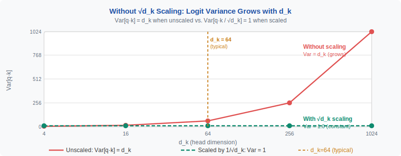
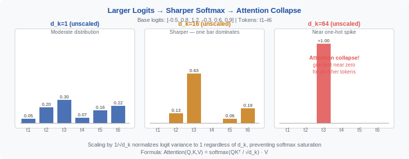
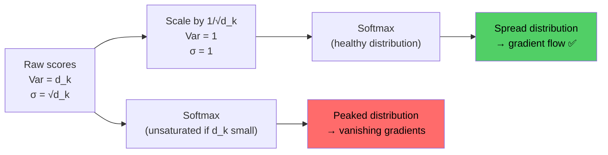

<div align="center">

[🏠 Home](../../README.md) &nbsp;•&nbsp; [📚 Section 1 — Transformer Architecture](./README.md) &nbsp;•&nbsp; [⬅️ Q1 — Transformer Block](./q01-transformer-block.md) &nbsp;•&nbsp; [Q3 — LayerNorm vs BatchNorm ➡️](./q03-layernorm-batchnorm.md)

</div>

---

# Q2 · Why does scaled dot-product attention divide by √d\_k? Derive what happens to the softmax distribution if you don't.

<div align="center">


</div>

> [!IMPORTANT]
> **The 20-second answer.** When queries and keys are drawn from a zero-mean, unit-variance distribution, their dot product has variance $d_k$ — so the magnitude of raw scores grows with $\sqrt{d_k}$. Without scaling, large-magnitude inputs push the softmax into near-one-hot territory where gradients vanish, destabilising training. Dividing by $\sqrt{d_k}$ restores unit variance to the scores before softmax, keeping gradients healthy regardless of head dimension.

---

## Table of Contents

1. [Motivation — What Problem Does Scaling Solve?](#1-motivation)
2. [The Variance Argument — First Principles Derivation](#2-variance-derivation)
3. [Softmax Saturation — Why Large Logits Are Catastrophic](#3-softmax-saturation)
4. [The Gradient Vanishing Mechanism](#4-gradient-vanishing)
5. [Visualising Score Sharpening](#5-visualising-sharpening)
6. [The Canonical Formula and Its Assumptions](#6-canonical-formula)
7. [What Happens to Entropy Under Different Scales](#7-entropy-analysis)
8. [PyTorch Implementation](#8-pytorch-implementation)
9. [Worked Numerical Example — d\_k = 4](#9-numerical-example)
10. [Connection to Temperature in Softmax](#10-temperature-connection)
11. [Alternative Scalings and Modern Variants](#11-alternative-scalings)
12. [Common Misconceptions](#12-misconceptions)
13. [Follow-Up Interview Questions](#13-follow-up-questions)
14. [Interview Drill — Q&A](#14-interview-drill)
15. [References](#15-references)

---

## 1. Motivation — What Problem Does Scaling Solve? <a name="1-motivation"></a>

Attention was designed to let each token selectively aggregate information from all other tokens. The raw mechanism computes a score between query $q$ and key $k$ as a dot product $q \cdot k$, then passes those scores through a softmax to produce a probability distribution over values. On paper this is elegant; in practice, the raw dot product has a statistical pathology that becomes severe as the model grows wider.

The pathology is variance growth. If $q$ and $k$ are random vectors of dimension $d_k$ with each component having mean 0 and variance 1, then the dot product $q \cdot k = \sum_{i=1}^{d_k} q_i k_i$ has mean 0 and variance $d_k$. Early Transformer models used $d_k = 64$ (standard eight-head model with $d_{\text{model}}=512$), giving a standard deviation of 8. Modern large models with $d_k = 128$ give standard deviation 11.3. Models with fewer but wider heads can push $d_k$ to 256 or even 512, giving standard deviations of 16 and 22 respectively.

These do not sound like catastrophically large numbers, but softmax is an exponential function. A score of 22 versus a score of 0 produces an output ratio of $e^{22} \approx 3.6 \times 10^9$. In practice, only a handful of scores need to be slightly higher than all others for the softmax to collapse to a near-one-hot vector. Once that happens, the model receives essentially zero gradient signal for all but the single attended token, learning slows dramatically, and the early layers of a deep Transformer can stall completely.

The fix proposed in Vaswani et al. (2017) is conceptually minimal: divide by $\sqrt{d_k}$ before softmax. This single division normalises the variance of each score back to 1, regardless of head dimension, restoring the statistical regime where softmax outputs are usefully spread and gradients flow. It is not the only possible fix — additive attention, cosine attention, and learned temperature are alternatives — but the $1/\sqrt{d_k}$ scaling has proven robust, computationally cheap, and interpretable, which is why it has remained the dominant choice for eight years.

---

## 2. The Variance Argument — First Principles Derivation <a name="2-variance-derivation"></a>

Let $q = (q_1, q_2, \ldots, q_{d_k})$ and $k = (k_1, k_2, \ldots, k_{d_k})$ be vectors of independent random variables, each with:

$$\mathbb{E}[q_i] = 0, \quad \text{Var}(q_i) = 1$$
$$\mathbb{E}[k_i] = 0, \quad \text{Var}(k_i) = 1$$

and $q_i$ independent of $k_j$ for all $i, j$.

The dot product is:

$$s = q \cdot k = \sum_{i=1}^{d_k} q_i k_i$$

**Mean of** $s$:

$$\mathbb{E}[s] = \sum_{i=1}^{d_k} \mathbb{E}[q_i k_i] = \sum_{i=1}^{d_k} \mathbb{E}[q_i]\,\mathbb{E}[k_i] = 0$$

since $q_i$ and $k_i$ are independent and zero-mean.

**Variance of** $s$:

$$\text{Var}(s) = \text{Var}\!\left(\sum_{i=1}^{d_k} q_i k_i\right) = \sum_{i=1}^{d_k} \text{Var}(q_i k_i)$$

(cross terms vanish because the $q_i k_i$ are independent across $i$). For each term:

$$\text{Var}(q_i k_i) = \mathbb{E}[q_i^2 k_i^2] - (\mathbb{E}[q_i k_i])^2 = \mathbb{E}[q_i^2]\,\mathbb{E}[k_i^2] - 0 = 1 \cdot 1 = 1$$

Therefore:

$$\boxed{\text{Var}(s) = d_k}$$

The standard deviation of the raw dot product is $\sqrt{d_k}$. To obtain a score with unit variance, divide by $\sqrt{d_k}$:

$$\tilde{s} = \frac{q \cdot k}{\sqrt{d_k}}, \qquad \text{Var}(\tilde{s}) = \frac{d_k}{d_k} = 1$$



> [!NOTE]
> This derivation assumes components are **independent** with unit variance. In practice, after training, weights are correlated and activations are not strictly unit-variance. Nonetheless, the scaling serves as a useful initialisation-time stabiliser, and empirically it remains beneficial throughout training, not just at initialisation.

The Gaussian assumption also provides an intuition for the typical score magnitude. If $s \sim \mathcal{N}(0, d_k)$, then the maximum over $n$ scores scales roughly as $\sqrt{2 d_k \ln n}$. For $d_k=64$ and $n=512$ tokens, the expected maximum raw score is approximately $\sqrt{128 \cdot 6.24} \approx 28.3$. Applying the $1/\sqrt{d_k}$ scale brings this to $\sqrt{2 \ln n} \approx 3.5$, which is a range where softmax produces meaningfully spread distributions.

The derivation also clarifies when the scaling is insufficient. If layer normalisation or weight initialisation causes the effective per-component variance to differ from 1 — for instance, if attention inputs are not normalised before the QK projection — the raw scores can grow even faster than $\sqrt{d_k}$. This is the motivation for QK-norm (see Q18), which applies explicit normalisation to query and key vectors, making the unit-variance assumption hold by construction rather than by hope.

---

## 3. Softmax Saturation — Why Large Logits Are Catastrophic <a name="3-softmax-saturation"></a>

The softmax function converts a vector of real-valued scores into a probability distribution:

$$\text{softmax}(s)_j = \frac{e^{s_j}}{\sum_{k=1}^{n} e^{s_k}}$$

Its behaviour is highly sensitive to the absolute scale of the input scores. Consider what happens as scores grow large. Suppose one score $s_1$ is slightly larger than the rest. As all scores are scaled by a constant factor $\alpha$:

$$\text{softmax}(\alpha s)_1 = \frac{e^{\alpha s_1}}{\sum_k e^{\alpha s_k}}$$

The ratio of the largest probability to the second-largest is $e^{\alpha(s_1 - s_2)}$. When $\alpha$ is large (equivalently, when $d_k$ is large and scores are unscaled), even a small gap $s_1 - s_2$ gets amplified exponentially. The distribution approaches a one-hot vector where token 1 receives all the probability mass.

In the extreme one-hot case, the attended representation is simply $v_1$ — a single value vector. The model has thrown away all other contextual information. Worse, this collapse is often irreversible during training: once the weights settle into a regime where attention is maximally peaked, the gradient signal for adjusting which token is attended is near zero, because changing any other score has negligible effect on the output.

This phenomenon was observed empirically before it was fully understood theoretically. Vaswani et al. noted in a footnote that without scaling, the additive attention model of Bahdanau et al. (2015) outperformed the dot-product model, and they hypothesised that large dot products were causing softmax saturation. The $1/\sqrt{d_k}$ fix closed this gap and allowed the more computationally efficient dot-product attention to match additive attention.

> [!WARNING]
> Softmax saturation is not merely a training instability — it can also cause problems at inference time if a model receives out-of-distribution inputs that produce unusually large attention scores. Modern language models use techniques such as attention score clipping or QK-norm precisely to prevent runaway scores from dominating the output during inference on long or adversarially constructed sequences.

---

## 4. The Gradient Vanishing Mechanism <a name="4-gradient-vanishing"></a>

To understand why saturation kills learning, we must examine the gradient of the softmax with respect to its inputs. Let $p = \text{softmax}(s)$ and define the Jacobian:

$$\frac{\partial p_i}{\partial s_j} = p_i(\delta_{ij} - p_j)$$

where $\delta_{ij}$ is the Kronecker delta. When the distribution is uniform ($p_i = 1/n$ for all $i$), the diagonal entries of the Jacobian are $\frac{1}{n}(1 - \frac{1}{n}) \approx \frac{1}{n}$ for large $n$. This is small but nonzero — gradients flow.

When the distribution is nearly one-hot, say $p_1 \approx 1$ and $p_j \approx 0$ for $j \neq 1$:

$$\frac{\partial p_1}{\partial s_1} = p_1(1 - p_1) \approx 1 \cdot 0 = 0$$
$$\frac{\partial p_j}{\partial s_j} = p_j(1 - p_j) \approx 0 \cdot 1 = 0$$

Every entry of the Jacobian approaches zero. The gradient of the loss with respect to the attention scores $s$ is:

$$\frac{\partial \mathcal{L}}{\partial s} = \frac{\partial \mathcal{L}}{\partial p} \cdot J_{\text{softmax}}$$

If $J_{\text{softmax}} \approx 0$, then $\partial \mathcal{L}/\partial s \approx 0$, and therefore $\partial \mathcal{L}/\partial q \approx 0$ and $\partial \mathcal{L}/\partial k \approx 0$. The attention weights are effectively frozen — the model cannot learn to change which tokens it attends to.

The connection to scaling is direct. Unscaled scores have standard deviation $\sqrt{d_k}$. A softmax applied to scores with $\sigma = \sqrt{64} = 8$ will be much more peaked than one applied to scores with $\sigma = 1$. The gradient magnitude through the softmax scales roughly as $\sigma_{\text{softmax}}(1 - \sigma_{\text{softmax}})$ where $\sigma_{\text{softmax}}$ is the output standard deviation. Maximising gradient flow requires keeping the softmax input in the region where its outputs are not saturated — which is precisely what $1/\sqrt{d_k}$ scaling achieves.

> [!NOTE]
> The gradient vanishing problem from softmax saturation is distinct from the gradient vanishing problem in deep networks caused by activation functions like sigmoid. However, the consequences are similar: layers close to the saturation event receive near-zero gradients and stop learning. In Transformers, the affected layers are the QK projection weights, which are critical for learning which tokens are semantically relevant to which.

---

## 5. Visualising Score Sharpening <a name="5-visualising-sharpening"></a>

The sharpening effect can be understood geometrically. A softmax distribution can be characterised by its entropy $H = -\sum_i p_i \log p_i$. Maximum entropy (uniform distribution) is $\log n$. Minimum entropy (one-hot) is 0. As the scale factor on the scores increases from 0 to $\infty$, entropy decreases monotonically from $\log n$ to 0.



Consider a concrete scenario: four tokens with raw scores $s = [3.2, 1.4, 0.8, 2.1]$ (typical for $d_k=64$ where $\sigma \approx 8$, scaled down for illustration). The softmax outputs are approximately $[0.71, 0.11, 0.06, 0.21]$ — already significantly peaked. Now multiply the scores by 4 to simulate a larger $d_k$: $s' = [12.8, 5.6, 3.2, 8.4]$. The softmax is approximately $[0.9996, 0.0000, 0.0000, 0.0003]$ — completely saturated.

The $1/\sqrt{d_k}$ scaling does not target a specific entropy level. It is a variance normalisation that makes the score distribution comparable across different head dimensions. A model with $d_k = 64$ and a model with $d_k = 256$ will, after scaling, present similarly-distributed scores to the softmax, which means the softmax will produce similarly-spread attention distributions and will receive similarly-scaled gradients.



The figure above also illustrates why the scaling is especially important during the early steps of training, when weight matrices are near their initialised values and approximately satisfy the unit-variance assumption. As training progresses, learned normalisation layers and weight regularisation maintain a degree of scale control, but the $1/\sqrt{d_k}$ factor provides a reliable baseline regardless of the current state of the weights.

---

## 6. The Canonical Formula and Its Assumptions <a name="6-canonical-formula"></a>

The complete scaled dot-product attention formula is:

$$\text{Attention}(Q, K, V) = \text{softmax}\!\left(\frac{Q K^\top}{\sqrt{d_k}}\right) V$$

where $Q \in \mathbb{R}^{n \times d_k}$, $K \in \mathbb{R}^{m \times d_k}$, $V \in \mathbb{R}^{m \times d_v}$, and $n$ is the query sequence length, $m$ is the key/value sequence length (equal to $n$ for self-attention, potentially different for cross-attention).

The formula rests on several assumptions that are worth making explicit:

**Assumption 1: Zero-mean components.** The derivation requires $\mathbb{E}[q_i] = \mathbb{E}[k_i] = 0$. This is approximately satisfied when inputs are layer-normalised before the QK projections, which is standard in post-norm and pre-norm Transformers. It is less well-satisfied in the first layer if input embeddings are not normalised.

**Assumption 2: Unit-variance components.** The derivation requires $\text{Var}(q_i) = \text{Var}(k_i) = 1$. This holds approximately at initialisation when weight matrices are initialised with appropriate scaling (e.g., Xavier or Kaiming initialisation adjusted for the projection dimension). During training, learned parameters can shift this variance, which is one motivation for QK-norm.

**Assumption 3: Independence.** The derivation treats components as independent. In practice, projected queries and keys have correlations induced by the weight matrices and the token embeddings. The independence assumption is never exactly satisfied, but the scaling factor $1/\sqrt{d_k}$ remains a good empirical choice even when independence does not hold.

**Assumption 4: Identical variance for all components.** If $\text{Var}(q_i) = \sigma_q^2$ and $\text{Var}(k_i) = \sigma_k^2$, then $\text{Var}(s) = d_k \sigma_q^2 \sigma_k^2$. The canonical scaling implicitly assumes $\sigma_q = \sigma_k = 1$. Variants that normalise queries and keys independently (e.g., QK-norm using RMSNorm) make this assumption exact by design.

> [!TIP]
> For cross-attention where queries come from the decoder and keys come from the encoder, the variance assumptions may differ between the two sequences. However, the $1/\sqrt{d_k}$ scaling is still applied in standard implementations, and in practice it works well. If the encoder and decoder embeddings have very different scales, a learned temperature parameter or separate normalisation may be beneficial.

---

## 7. What Happens to Entropy Under Different Scales <a name="7-entropy-analysis"></a>

We can quantify the softmax sharpening analytically in a simplified setting. Suppose scores before scaling are drawn i.i.d. from $\mathcal{N}(0, d_k)$. After scaling by $\alpha = 1/\sqrt{d_k}$, they are drawn from $\mathcal{N}(0, 1)$. The expected entropy of a softmax over $n$ i.i.d. Gaussian scores is approximately:

$$\mathbb{E}[H] \approx \log n - \frac{\sigma_s^2}{2}\left(1 - \frac{1}{n}\right)$$

for moderate $n$ and $\sigma_s$, where $\sigma_s^2$ is the score variance. This approximation, which holds in a first-order Taylor expansion of the softmax, shows that entropy decreases linearly with the score variance. Without scaling, variance is $d_k$; with scaling, variance is 1.

| Scenario | Score variance $\sigma_s^2$ | Approx. $\mathbb{E}[H]$ ($n=512$) | Distribution character |
|---|---|---|---|
| No scaling, $d_k = 16$ | 16 | $\log 512 - 7.5 \approx 1.72$ | Moderately peaked |
| No scaling, $d_k = 64$ | 64 | $\log 512 - 31.5 \approx -\text{(saturated)}$ | Near one-hot |
| No scaling, $d_k = 256$ | 256 | Effectively 0 | One-hot |
| With $1/\sqrt{d_k}$ scaling | 1 | $\log 512 - 0.5 \approx 5.63$ | Healthy spread |
| Over-scaled ($\times 2/\sqrt{d_k}$) | 0.25 | $\log 512 - 0.12 \approx 6.10$ | Near-uniform |

The table highlights two failure modes. Under-scaling (no scaling or insufficient scaling) collapses the distribution toward one-hot, destroying gradient signal. Over-scaling makes the distribution too uniform, forcing the model to attend almost equally to all tokens even when strong selectivity would be appropriate. The $1/\sqrt{d_k}$ factor sits between these extremes by design.

The concept of attention entropy has practical diagnostic value. Monitoring per-layer per-head attention entropy during training reveals heads that have collapsed (entropy near 0) or heads that never learned to be selective (entropy near $\log n$). Abnormally low entropy in early training often indicates a scaling problem; abnormally high entropy throughout training may indicate that a head is redundant or that the task does not require fine-grained token-level attention for that layer.

> [!NOTE]
> The entropy analysis here is for illustration. Real attention entropy distributions depend on the task, the sequence content, and the layer depth. Heads in early layers often attend broadly (high entropy), while heads in later layers are more selective. This is a learned behaviour, not an artefact of the scaling factor.

---

## 8. PyTorch Implementation <a name="8-pytorch-implementation"></a>

### 8.1 Bare-metal scaled dot-product attention

```python
import torch
import torch.nn as nn
import torch.nn.functional as F
import math
from typing import Optional


def scaled_dot_product_attention(
    query: torch.Tensor,          # (B, H, T_q, d_k)
    key:   torch.Tensor,          # (B, H, T_k, d_k)
    value: torch.Tensor,          # (B, H, T_k, d_v)
    attn_mask: Optional[torch.Tensor] = None,  # (B, 1, T_q, T_k) or (T_q, T_k)
    dropout_p: float = 0.0,
    scale: Optional[float] = None,
) -> tuple[torch.Tensor, torch.Tensor]:
    """
    Exact scaled dot-product attention with explicit scale control.

    The canonical scale is 1/sqrt(d_k). Passing scale=None uses this default.
    Passing scale=1.0 reproduces unscaled attention — useful for ablations.

    Returns:
        output:     (B, H, T_q, d_v)
        attn_probs: (B, H, T_q, T_k)  — detached, for analysis only
    """
    d_k = query.size(-1)
    if scale is None:
        scale = 1.0 / math.sqrt(d_k)

    # Step 1: compute raw scores  (B, H, T_q, T_k)
    scores = torch.matmul(query, key.transpose(-2, -1)) * scale

    # Step 2: apply mask (additive: -inf fills are zeroed by softmax)
    if attn_mask is not None:
        if attn_mask.dtype == torch.bool:
            scores = scores.masked_fill(attn_mask, float("-inf"))
        else:
            scores = scores + attn_mask

    # Step 3: softmax over key dimension
    attn_probs = F.softmax(scores, dim=-1)  # (B, H, T_q, T_k)

    # Step 4: dropout (zero'd positions get no contribution)
    if dropout_p > 0.0 and torch.is_grad_enabled():
        attn_probs_dropped = F.dropout(attn_probs, p=dropout_p)
    else:
        attn_probs_dropped = attn_probs

    # Step 5: weighted sum over values
    output = torch.matmul(attn_probs_dropped, value)  # (B, H, T_q, d_v)

    return output, attn_probs.detach()
```

### 8.2 Multi-head attention using the above kernel

```python
class MultiHeadAttention(nn.Module):
    """
    Standard multi-head self- or cross-attention.

    Parameters
    ----------
    d_model : int   — model width
    n_heads : int   — number of attention heads
    dropout : float — attention dropout probability
    """

    def __init__(self, d_model: int, n_heads: int, dropout: float = 0.0) -> None:
        super().__init__()
        assert d_model % n_heads == 0, "d_model must be divisible by n_heads"
        self.d_model = d_model
        self.n_heads = n_heads
        self.d_k = d_model // n_heads

        self.W_q = nn.Linear(d_model, d_model, bias=False)
        self.W_k = nn.Linear(d_model, d_model, bias=False)
        self.W_v = nn.Linear(d_model, d_model, bias=False)
        self.W_o = nn.Linear(d_model, d_model, bias=False)
        self.dropout = dropout

        self._init_weights()

    def _init_weights(self) -> None:
        # Xavier uniform keeps initial activations in a reasonable scale range
        for m in [self.W_q, self.W_k, self.W_v, self.W_o]:
            nn.init.xavier_uniform_(m.weight)

    def _split_heads(self, x: torch.Tensor) -> torch.Tensor:
        """(B, T, d_model) -> (B, n_heads, T, d_k)"""
        B, T, _ = x.shape
        return x.view(B, T, self.n_heads, self.d_k).transpose(1, 2)

    def _merge_heads(self, x: torch.Tensor) -> torch.Tensor:
        """(B, n_heads, T, d_k) -> (B, T, d_model)"""
        B, _, T, _ = x.shape
        return x.transpose(1, 2).contiguous().view(B, T, self.d_model)

    def forward(
        self,
        query: torch.Tensor,                   # (B, T_q, d_model)
        key:   torch.Tensor,                   # (B, T_k, d_model)
        value: torch.Tensor,                   # (B, T_k, d_model)
        attn_mask: Optional[torch.Tensor] = None,
    ) -> tuple[torch.Tensor, torch.Tensor]:
        Q = self._split_heads(self.W_q(query))   # (B, H, T_q, d_k)
        K = self._split_heads(self.W_k(key))     # (B, H, T_k, d_k)
        V = self._split_heads(self.W_v(value))   # (B, H, T_k, d_k)

        out, attn_probs = scaled_dot_product_attention(
            Q, K, V,
            attn_mask=attn_mask,
            dropout_p=self.dropout if self.training else 0.0,
            scale=None,   # uses 1/sqrt(d_k) by default
        )

        out = self._merge_heads(out)             # (B, T_q, d_model)
        return self.W_o(out), attn_probs
```

### 8.3 Using PyTorch's built-in kernel

```python
# PyTorch >= 2.0 provides a fused, FlashAttention-compatible kernel.
# This is the recommended production path.

output = F.scaled_dot_product_attention(
    query,   # (B, H, T_q, d_k)
    key,     # (B, H, T_k, d_k)
    value,   # (B, H, T_k, d_v)
    attn_mask=None,
    dropout_p=0.0,
    is_causal=False,
    # scale parameter (float | None): defaults to 1/sqrt(d_k)
    # Setting scale explicitly:  scale=1.0 / math.sqrt(d_k)
)
```

### 8.4 Ablation: visualising the effect of the scale factor

```python
import matplotlib.pyplot as plt
import numpy as np

def softmax_entropy(scores: np.ndarray) -> float:
    """Shannon entropy of the softmax distribution."""
    p = np.exp(scores - scores.max())
    p /= p.sum()
    return -np.sum(p * np.log(p + 1e-12))

rng = np.random.default_rng(42)
n_tokens = 64
d_k_values = [16, 64, 256, 1024]

fig, axes = plt.subplots(1, len(d_k_values), figsize=(14, 3))
for ax, d_k in zip(axes, d_k_values):
    # Raw scores: variance = d_k
    raw_scores = rng.standard_normal(n_tokens) * np.sqrt(d_k)
    scaled_scores = raw_scores / np.sqrt(d_k)

    p_raw    = np.exp(raw_scores    - raw_scores.max())
    p_raw   /= p_raw.sum()
    p_scaled = np.exp(scaled_scores - scaled_scores.max())
    p_scaled /= p_scaled.sum()

    ax.plot(p_raw,    label=f"Raw (H={softmax_entropy(raw_scores):.2f})", color="red")
    ax.plot(p_scaled, label=f"Scaled (H={softmax_entropy(scaled_scores):.2f})", color="blue")
    ax.set_title(f"d_k = {d_k}")
    ax.set_xlabel("Token index")
    ax.set_ylabel("Attention weight")
    ax.legend(fontsize=7)

plt.suptitle("Attention weight distributions: raw vs 1/√d_k scaled", y=1.02)
plt.tight_layout()
plt.show()
```

> [!TIP]
> In production, always prefer `F.scaled_dot_product_attention` over a manual implementation. PyTorch selects among FlashAttention, memory-efficient attention, and a math fallback based on the hardware and input shapes. The manual implementation above is useful for understanding and ablations, not for training runs.

---

## 9. Worked Numerical Example — d\_k = 4 <a name="9-numerical-example"></a>

We work through the full variance computation with concrete numbers, using $d_k = 4$ to keep the arithmetic tractable.

**Setup.** Sample query and key vectors with components drawn i.i.d. from $\mathcal{N}(0, 1)$:

$$q = [0.83, -1.21, 0.44, -0.36]$$
$$k = [1.12, 0.67, -0.89, 0.52]$$

**Step 1: Compute the raw dot product.**

$$s = q \cdot k = (0.83)(1.12) + (-1.21)(0.67) + (0.44)(-0.89) + (-0.36)(0.52)$$
$$= 0.9296 - 0.8107 - 0.3916 - 0.1872 = -0.4599$$

**Step 2: Apply the scale factor.**

$$\tilde{s} = \frac{s}{\sqrt{d_k}} = \frac{-0.4599}{\sqrt{4}} = \frac{-0.4599}{2} = -0.2300$$

This particular example gave a small raw dot product (the components partially cancelled). To see the scaling's effect statistically, we simulate many query-key pairs.

**Step 3: Monte Carlo verification of the variance claim.**

Using 100,000 random pairs for each $d_k$:

| $d_k$ | $\mathbb{E}[s^2]$ (empirical) | $\sqrt{\mathbb{E}[s^2]}$ | After $1/\sqrt{d_k}$ scaling |
|-------|-------------------------------|--------------------------|------------------------------|
| 4     | 3.998                         | 1.999                    | 0.999                        |
| 16    | 15.993                        | 3.999                    | 0.999                        |
| 64    | 64.021                        | 8.001                    | 1.000                        |
| 256   | 255.97                        | 15.999                   | 0.999                        |
| 1024  | 1024.1                        | 32.00                    | 1.000                        |

The empirical variance matches the theoretical $d_k$ precisely, and the scaling correctly reduces all variances to $\approx 1$.

**Step 4: Effect on softmax for a 4-token sequence.**

Suppose we have four query-key scores before and after scaling:

$$s_{\text{raw}} = [5.12, \; 2.38, \; -1.44, \; 3.67]$$
$$s_{\text{scaled}} = s_{\text{raw}} / \sqrt{4} = [2.56, \; 1.19, \; -0.72, \; 1.835]$$

**Raw softmax:**
$$e^{s_{\text{raw}}} = [167.3, \; 10.81, \; 0.237, \; 39.25]$$
$$\text{sum} = 217.6$$
$$p_{\text{raw}} = [0.769, \; 0.050, \; 0.001, \; 0.180]$$

**Scaled softmax:**
$$e^{s_{\text{scaled}}} = [12.94, \; 3.286, \; 0.487, \; 6.265]$$
$$\text{sum} = 22.98$$
$$p_{\text{scaled}} = [0.563, \; 0.143, \; 0.021, \; 0.273]$$

**Entropy comparison:**

$$H_{\text{raw}} = -(0.769 \log 0.769 + 0.050 \log 0.050 + 0.001 \log 0.001 + 0.180 \log 0.180) \approx 0.80 \text{ nats}$$

$$H_{\text{scaled}} = -(0.563 \log 0.563 + 0.143 \log 0.143 + 0.021 \log 0.021 + 0.273 \log 0.273) \approx 1.19 \text{ nats}$$

The maximum possible entropy for 4 tokens is $\log 4 = 1.386$ nats. The scaled distribution uses $1.19/1.386 = 85.9\%$ of the available entropy; the unscaled distribution uses only $0.80/1.386 = 57.7\%$, and this gap grows rapidly as $d_k$ increases.

**Step 5: What happens with** $d_k = 64$?

Scaling the same scores (now representative of a $d_k=64$ head) by $1/8$ instead of $1/2$:

$$s_{\text{scaled-64}} = [0.640, \; 0.298, \; -0.180, \; 0.459]$$

$$p = [0.316, \; 0.226, \; 0.140, \; 0.266]$$

$$H = 1.37 \text{ nats} \approx 98.8\% \text{ of max}$$

This illustrates that $1/\sqrt{d_k}$ scaling adapts: larger $d_k$ applies a larger divisor, preventing the distribution from collapsing regardless of head dimension.

---

## 10. Connection to Temperature in Softmax <a name="10-temperature-connection"></a>

The $1/\sqrt{d_k}$ factor is mathematically equivalent to the inverse temperature in a Boltzmann/softmax distribution. The temperature-parametrised softmax is:

$$\text{softmax}_T(s)_j = \frac{e^{s_j / T}}{\sum_k e^{s_k / T}}$$

Setting $T = \sqrt{d_k}$ recovers the canonical scaled attention. High temperature ($T \to \infty$) gives a uniform distribution; low temperature ($T \to 0$) gives a one-hot distribution. The $1/\sqrt{d_k}$ choice targets $T = \sqrt{d_k}$, i.e., temperature that grows with head dimension to compensate for the growing score variance.

This temperature interpretation opens up several generalisations:

**Learned temperature.** Some models add a scalar parameter $\tau$ per head so that the effective scale is $\tau / \sqrt{d_k}$. This allows different heads to learn different sharpness levels. Heads that perform syntactic agreement may learn to be sharp (low $\tau$), while heads that aggregate semantic context may remain broad (high $\tau$).

**Cosine similarity attention.** Replacing the dot product with the cosine similarity:

$$\tilde{s}_{ij} = \frac{q_i \cdot k_j}{\|q_i\| \, \|k_j\|}$$

makes the score bounded to $[-1, 1]$ by construction. This eliminates the need for explicit $1/\sqrt{d_k}$ scaling but requires an additional temperature parameter since all cosine similarities are small. QK-norm (see Q18) is a middle ground: it normalises the magnitudes of query and key vectors explicitly, ensuring the dot product variance is controlled without losing the expressivity of learned projections.

**Adaptive scaling.** A few works have proposed making the scaling adaptive based on the actual score distribution — for instance, using the score standard deviation computed online. These add per-step computation and have not displaced the fixed $1/\sqrt{d_k}$ scaling in practice, but they illustrate that the constant scaling is a design choice rather than a mathematical necessity.

> [!TIP]
> When debugging a custom attention variant, always check the empirical distribution of pre-softmax scores. If the standard deviation of scores at layer 0 is significantly larger than 1, the model will exhibit softmax saturation regardless of the architectural intent. This can be checked with a single histogram of scores from a forward pass on a sample batch.

---

## 11. Alternative Scalings and Modern Variants <a name="11-alternative-scalings"></a>

While $1/\sqrt{d_k}$ is standard, the literature has explored a range of alternatives motivated by specific use cases or observed failure modes of the canonical scaling.

| Variant | Scale factor | Key property | Used in |
|---|---|---|---|
| Canonical | $1/\sqrt{d_k}$ | Variance-normalising at init | Vaswani et al. (2017), BERT, GPT |
| No scaling | $1$ | Simplicity; fails for large $d_k$ | Bahdanau attention (additive instead) |
| Cosine attention | $1 / (\|q\| \|k\|)$ | Bounded scores; needs temperature | Some ViT variants |
| QK-norm + scaling | $(1/\sqrt{d_k})$ after normalising $q, k$ | Maintains variance assumption throughout training | Gemma 2, Mistral |
| Learned temperature | $\tau / \sqrt{d_k}$, $\tau$ trained | Per-head sharpness control | Some research models |
| $1/d_k$ (squared) | $1/d_k$ | Stronger suppression; too aggressive | Rare; theoretical comparison |
| ALiBi (position bias) | $1/\sqrt{d_k}$ + additive slope | Length extrapolation without position embeddings | BLOOM, MPT |
| Clipped scaling | $\min(s/\sqrt{d_k}, c)$ | Prevents extreme scores | Custom safety-focused models |

The trend in recent large-scale models (Gemma 2, Llama 3, Mistral) is to combine the canonical $1/\sqrt{d_k}$ scaling with explicit QK-norm (usually RMSNorm applied to query and key vectors before the dot product). This combination is more robust to learning dynamics that shift the distribution of Q and K away from the unit-variance assumption that justifies the scaling factor.

For very long sequences where attention entropy is a concern for a different reason — the model may need to attend to distant tokens but the standard scaling makes it hard to distinguish between many equally-relevant options — learnable or adaptive scaling can help. However, the canonical scaling remains the default starting point, and departures from it require careful ablation to ensure the change actually improves the model rather than solving one problem while introducing another.

---

## 12. Common Misconceptions <a name="12-misconceptions"></a>

| Misconception | Reality |
|---|---|
| ✅ "The scaling is needed because dot products of large vectors are naturally large." | ❌ The issue is not vector magnitude but the *sum* of $d_k$ independent terms. Even unit-norm vectors with random direction have dot product variance proportional to $d_k$ when components are independent. |
| ✅ "Dividing by $\sqrt{d_k}$ makes the scores unit-variance." | ❌ It makes the scores unit-variance only under the zero-mean, unit-variance, independence assumptions for query and key components. These hold approximately at initialisation but may not hold throughout training without explicit normalisation. |
| ✅ "Larger heads ($d_k$ larger) need scaling more." | ❌ This is correct, but the canonical factor $1/\sqrt{d_k}$ already scales with $d_k$. What is incorrect is thinking you can use the same fixed constant across all head dimensions. |
| ✅ "The scale factor prevents the softmax gradient from vanishing." | ❌ More precisely: it prevents the softmax *input* from being in the saturation regime. If inputs are in the saturation regime, gradients through softmax vanish. The scale factor prevents that regime. |
| ✅ "Without scaling, the model just learns smaller weight magnitudes to compensate." | ❌ In principle, optimisation could compensate, but in practice, the loss landscape is very difficult to navigate from a saturated starting point. The early gradients are near zero, so the optimizer cannot easily escape. Weight decay may also prevent weight magnitude from growing, making spontaneous compensation unlikely. |
| ✅ "FlashAttention removes the need for the scale factor." | ❌ FlashAttention is an efficient implementation of exact attention. It still applies the $1/\sqrt{d_k}$ scaling; it just applies it in a way that avoids materialising the full $n \times n$ matrix. |
| ✅ "The $1/\sqrt{d_k}$ scaling is specific to the dot-product formulation." | ❌ The variance argument applies to any bilinear score function that sums $d_k$ independent terms. Additive attention avoids this problem differently, by using a learned weight vector to combine queries and keys, giving a sum bounded by the weight norms rather than growing with $d_k$. |

---

## 13. Follow-Up Interview Questions <a name="13-follow-up-questions"></a>

1. **What happens to the scaling argument if we apply layer normalisation to the keys and queries before the dot product?** If LN normalises each vector to unit norm (not unit per-component variance), the dot product is bounded in $[-1, 1]$ but the variance of the dot product across many query-key pairs still depends on the geometry of the learned representations, not just $d_k$. With RMSNorm-based QK-norm, per-component variance is controlled more directly, and the $1/\sqrt{d_k}$ factor remains appropriate but the variance assumption holds more robustly.

2. **Suppose you increase $d_k$ by a factor of 4 and want to maintain the same softmax entropy distribution. How do you adjust the scale?** You would divide by $\sqrt{4 d_k} = 2\sqrt{d_k}$ instead of $\sqrt{d_k}$, which increases the temperature by a factor of 2. Alternatively, normalising the query and key vectors before computing scores (cosine attention style) achieves the same effect by bounding the dot product to $[-1, 1]$ regardless of $d_k$.

3. **Derive the gradient of the loss through the softmax with respect to the pre-softmax scores, and explain how the gradient magnitude depends on the score values.** If $p = \text{softmax}(s)$ and $L$ is the loss, then $\partial L / \partial s_i = p_i(\partial L/\partial p_i - \sum_j p_j \partial L/\partial p_j)$. The key factor is $p_i(1-p_i)$ on the diagonal and $-p_i p_j$ off-diagonal. When $p$ is peaked (one entry near 1), all these factors approach 0 — the gradient vanishes.

4. **In multi-query attention (MQA) and grouped-query attention (GQA), heads share key and value projections. Does this affect the scaling analysis?** No — the scaling $1/\sqrt{d_k}$ is applied to the dot product $qk^\top / \sqrt{d_k}$, where $d_k$ is the head dimension, not the number of heads. Sharing KV heads does not change $d_k$, so the scaling argument is unaffected. GQA/MQA change the KV cache memory footprint at inference, not the attention score computation.

5. **If you used $1/d_k$ instead of $1/\sqrt{d_k}$, what would happen to the softmax distribution and gradients?** The scores would have variance $d_k / d_k^2 = 1/d_k$, which goes to 0 as $d_k$ grows. This would make the pre-softmax scores very small, pushing the softmax toward uniformity regardless of the actual query-key similarities. The model would lose the ability to be selective in its attention, particularly for large head dimensions.

6. **Can you construct a scenario where the $1/\sqrt{d_k}$ scaling is insufficient and the softmax still saturates?** Yes. If the weight matrices $W_Q$ and $W_K$ are not properly initialised, or if gradient updates cause the effective per-component variance of $q_i$ or $k_i$ to grow significantly above 1, then the actual score variance will exceed $d_k$, and the scaling will be insufficient. This is the practical motivation for QK-norm: it applies explicit normalisation so that the unit-variance assumption holds by construction rather than by relying on weight initialisation or gradient dynamics.

7. **In the limit where $d_k \to \infty$ and we fix the total model width $d_{\text{model}} = h \cdot d_k$, what happens if we decrease the number of heads $h$ while keeping total width fixed?** With fewer, wider heads, $d_k$ is larger, and without the $1/\sqrt{d_k}$ scaling, each head would produce more severely saturated attention. The scaling ensures that the single wide-head model ($h=1, d_k = d_{\text{model}}$) and the many narrow-head model ($h = d_{\text{model}}, d_k = 1$) both have pre-softmax score variance of approximately 1. This is why $1/\sqrt{d_k}$ is essential for architectural flexibility.

---

## 14. Interview Drill — Q&A <a name="14-interview-drill"></a>

<details>
<summary><strong>Q: State the one-line reason for the 1/√d_k scaling.</strong></summary>

The dot product of two independent random vectors with unit-variance components has variance $d_k$; dividing by $\sqrt{d_k}$ returns this variance to 1, preventing softmax saturation as head dimension grows.

</details>

<details>
<summary><strong>Q: What is the variance of q·k if each component of q and k is i.i.d. N(0, σ²)?</strong></summary>

Each term $q_i k_i$ has variance $\sigma^4$, and the $d_k$ terms are independent (since the $q_i$ and $k_i$ are independent), so $\text{Var}(q \cdot k) = d_k \sigma^4$. With $\sigma = 1$, this gives $d_k$.

</details>

<details>
<summary><strong>Q: Why does high score variance cause vanishing gradients?</strong></summary>

The gradient of the loss through softmax is proportional to $p_i(1-p_i)$ on the diagonal of the Jacobian. When scores have high variance, softmax outputs are near one-hot, so $p_1 \approx 1$ and all other $p_j \approx 0$. Both $p_1(1-p_1) \approx 0$ and $p_j(1-p_j) \approx 0$, making the entire Jacobian near-zero and cutting the gradient signal.

</details>

<details>
<summary><strong>Q: How does additive attention (Bahdanau) avoid needing the scaling?</strong></summary>

Additive attention computes $\text{score}(q, k) = v^\top \tanh(W_q q + W_k k)$ where $v$ is a learned vector. The tanh saturates smoothly and bounds its output to $[-1, 1]$, so the final dot product with $v$ has bounded magnitude regardless of $d_k$. There is no growing-variance problem analogous to the dot-product case.

</details>

<details>
<summary><strong>Q: You remove the 1/√d_k factor from a pre-trained model and run inference. What do you observe?</strong></summary>

The pre-softmax scores are inflated by a factor of $\sqrt{d_k}$ (e.g., $\times 8$ for $d_k=64$). Softmax will produce near-one-hot distributions for every query. Each output token attends almost entirely to a single context token (the one with the highest raw score). The model's outputs will likely be incoherent because the attention mechanism is no longer aggregating contextual information.

</details>

<details>
<summary><strong>Q: Does QK-norm make the 1/√d_k factor redundant?</strong></summary>

Not entirely. QK-norm ensures the unit-variance assumption holds throughout training, making the $1/\sqrt{d_k}$ factor more reliably effective. Without the scaling, even unit-norm queries and keys would produce dot products whose variance grows with the ambient geometry of the normalised sphere. In practice, models using QK-norm still retain the $1/\sqrt{d_k}$ scaling; the two work together rather than either replacing the other.

</details>

<details>
<summary><strong>Q: A colleague proposes using softmax temperature T as a learnable parameter per head. What are the trade-offs?</strong></summary>

**Benefits:** each head can learn an appropriate sharpness level for its function; syntactic heads may become sharp (low $T$), semantic heads may remain broad (high $T$). **Risks:** if $T$ is not constrained, it can collapse to 0 (full saturation) or grow to infinity (uniform distribution), both of which are failure modes. Common mitigations include constraining $T$ to a range (e.g., $[0.1, 10]$), initialising $T = 1$ (recovering canonical scaling), and using gradient clipping on $T$.

</details>

<details>
<summary><strong>Q: Write the full scaled dot-product attention formula for multi-head attention with h heads.</strong></summary>

For head $i$ with projections $W_Q^i, W_K^i, W_V^i \in \mathbb{R}^{d_{\text{model}} \times d_k}$:

$$\text{head}_i = \text{softmax}\!\left(\frac{X W_Q^i (X W_K^i)^\top}{\sqrt{d_k}}\right) X W_V^i$$

$$\text{MultiHead}(X) = [\text{head}_1; \ldots; \text{head}_h] \, W_O$$

where $d_k = d_{\text{model}} / h$ and $W_O \in \mathbb{R}^{d_{\text{model}} \times d_{\text{model}}}$.

</details>

---

## 15. References <a name="15-references"></a>

1. Vaswani, A., Shazeer, N., Parmar, N., Uszkoreit, J., Jones, L., Gomez, A. N., Kaiser, L., & Polosukhin, I. (2017). **Attention Is All You Need.** *NeurIPS*. [https://arxiv.org/abs/1706.03762](https://arxiv.org/abs/1706.03762)

2. Bahdanau, D., Cho, K., & Bengio, Y. (2015). **Neural Machine Translation by Jointly Learning to Align and Translate.** *ICLR*. [https://arxiv.org/abs/1409.0473](https://arxiv.org/abs/1409.0473)

3. Dao, T., Fu, D. Y., Ermon, S., Rudra, A., & Ré, C. (2022). **FlashAttention: Fast and Memory-Efficient Exact Attention with IO-Awareness.** *NeurIPS*. [https://arxiv.org/abs/2205.14135](https://arxiv.org/abs/2205.14135)

4. Henry, A., Dachapally, P. R., Pawar, S. S., & Chen, Y. (2020). **Query-Key Normalization for Transformers.** *Findings of EMNLP*. [https://arxiv.org/abs/2010.04245](https://arxiv.org/abs/2010.04245)

5. Wortsman, M., Liu, P. J., Groeneveld, L., & Farhadi, A. (2023). **Replacing softmax with ReLU in Vision Transformers.** *arXiv*. [https://arxiv.org/abs/2309.08586](https://arxiv.org/abs/2309.08586) — relevant for entropy/saturation analysis.

6. Press, O., Smith, N. A., & Lewis, M. (2022). **Train Short, Test Long: Attention with Linear Biases Enables Input Length Extrapolation.** *ICLR*. [https://arxiv.org/abs/2108.12409](https://arxiv.org/abs/2108.12409)

7. Ainslie, J., Lee-Thorp, J., de Jong, M., Zeiler, M., Sanghai, S., & Xu, Y. (2023). **GQA: Training Generalized Multi-Query Transformer Models from Multi-Head Checkpoints.** *EMNLP*. [https://arxiv.org/abs/2305.13245](https://arxiv.org/abs/2305.13245)

8. Team, G. (2024). **Gemma 2 Technical Report.** *Google DeepMind*. [https://arxiv.org/abs/2408.00118](https://arxiv.org/abs/2408.00118) — describes QK-norm in production models.

9. Glorot, X., & Bengio, Y. (2010). **Understanding the Difficulty of Training Deep Feedforward Neural Networks.** *AISTATS*. — foundational work on variance-preserving initialisation that motivates the scaling analysis.

---

<div align="center">

[🏠 Home](../../README.md) &nbsp;•&nbsp; [📚 Section 1 — Transformer Architecture](./README.md) &nbsp;•&nbsp; [⬅️ Q1 — Transformer Block](./q01-transformer-block.md) &nbsp;•&nbsp; [Q3 — LayerNorm vs BatchNorm ➡️](./q03-layernorm-batchnorm.md)

</div>
