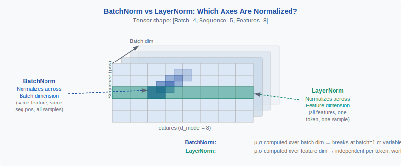
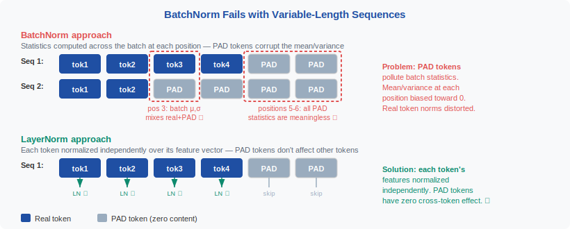
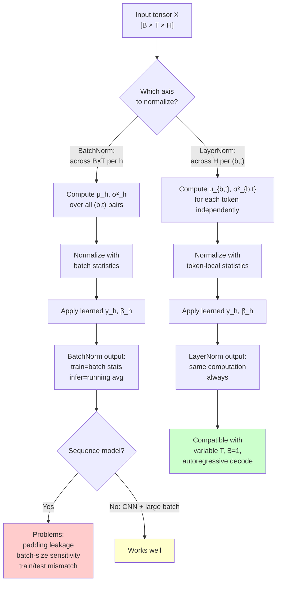
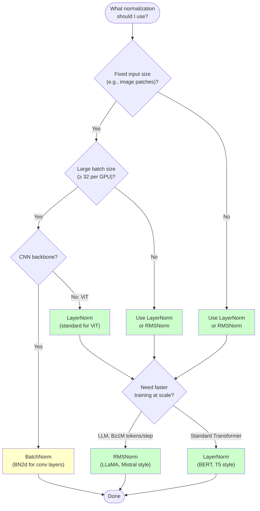

<div align="center">

[🏠 Home](../../README.md) &nbsp;•&nbsp; [📚 Section 1 — Transformer Architecture](./README.md) &nbsp;•&nbsp; [⬅️ Q2 — Scaled Attention](./q02-scaled-attention.md) &nbsp;•&nbsp; [Q4 — Pre-norm vs Post-norm ➡️](./q04-prenorm-postnorm.md)

</div>

---

# Q3 · Explain the role of LayerNorm vs BatchNorm in Transformers. Why is LayerNorm preferred for sequence models?

 &nbsp;
 &nbsp;
 &nbsp;
 &nbsp;


---

## Table of Contents

1. [Executive Answer](#1-executive-answer)
2. [Why Normalize at All?](#2-why-normalize-at-all)
3. [Tensor Shapes in Transformers](#3-tensor-shapes-in-transformers)
4. [BatchNorm: What It Does](#4-batchnorm-what-it-does)
5. [LayerNorm: What It Does](#5-layernorm-what-it-does)
6. [Side-by-Side Comparison](#6-side-by-side-comparison)
7. [Why LayerNorm Is Preferred for Sequence Models](#7-why-layernorm-is-preferred-for-sequence-models)
8. [Where LayerNorm Appears in Transformers (with Code)](#8-where-layernorm-appears-in-transformers-with-code)
9. [Worked Numerical Example](#9-worked-numerical-example)
10. [RMSNorm: The Modern Simplification](#10-rmsnorm-the-modern-simplification)
11. [Senior-Researcher Details](#11-senior-researcher-details)
12. [Decision Template](#12-decision-template)
13. [Misconceptions Table](#13-misconceptions-table)
14. [Interview Answer Templates](#14-interview-answer-templates)
15. [References](#15-references)

---

## 1. Executive Answer

> [!IMPORTANT]
> **20-second answer:** BatchNorm normalizes each feature *across the batch dimension* — it asks "how unusual is this feature value compared with the same feature in all other examples right now?" LayerNorm normalizes each token *across its own feature dimension* — it asks "how unusual is this feature compared with all other features inside this one token?" Transformers process variable-length sequences, run inference one token at a time, and require batch-size-1 stability. All three conditions break BatchNorm and are trivially satisfied by LayerNorm.

The fundamental intuition is about *what constitutes a natural peer group* for a given activation. In a convolutional network processing fixed-size images with large batches, comparing feature values across many different examples of the same spatial position is sensible — there are hundreds of peers and they are all structurally comparable. In a Transformer, the natural peer group for any single activation is the rest of the hidden state vector at that token position: all $H$ features that together encode the meaning of that one token.

This distinction has cascading practical consequences. A model running autoregressive text generation with batch size 1 and dynamically growing sequence lengths cannot use BatchNorm at all without special engineering. LayerNorm requires nothing more than the current token vector, making it the only practical choice for production LLM deployment.

The original "Attention Is All You Need" paper used Post-LayerNorm (apply after the residual add) [3]. Almost all large LLMs since GPT-2 use Pre-LayerNorm (apply before the sublayer, inside the residual branch). The normalization *axis* — across hidden features per token — is the same in both variants.

---

## 2. Why Normalize at All?

A deep network is a long chain of nonlinear transformations. Without any form of scale control, two failure modes are common:

1. **Exploding activations.** The magnitude of hidden states grows geometrically with depth. Large inputs to a softmax collapse it to a one-hot distribution; large inputs to a sigmoid saturate it. Gradients either explode or vanish.
2. **Covariate shift.** The distribution seen by layer $l+1$ changes every time the weights of layer $l$ change, which happens every gradient step. Layer $l+1$ must continuously re-adapt to a moving target.

Normalization is a feedback control system applied inside the forward pass. The formula is:

$$\hat{x} = \frac{x - \mu}{\sqrt{\sigma^2 + \varepsilon}}$$

where $\mu$ and $\sigma^2$ are computed from some designated group of numbers, and $\varepsilon$ is a small constant for numerical stability (typically $10^{-5}$). After standardization, learned affine parameters $\gamma$ (scale) and $\beta$ (bias) allow the network to restore any representational scale that is useful:

$$\text{Norm}(x) = \gamma \cdot \hat{x} + \beta$$

The key design choice — which determines the normalization scheme — is: **which set of numbers defines** $\mu$ **and** $\sigma^2$? BatchNorm and LayerNorm give different answers to this question. They agree completely on the formula; they disagree completely on the axis.



*Figure 1: The three-dimensional tensor $X \in \mathbb{R}^{B \times T \times H}$ shown as a cube. BatchNorm collapses the **batch axis** (blue slices) to compute per-feature statistics. LayerNorm collapses the **hidden axis** (red slices) to compute per-token statistics. Sequence length T is untouched by both.*

> [!NOTE]
> Normalization does **not** decorrelate features or whiten the representation. It controls only the first moment (mean) and second moment (variance) of the chosen group. Full whitening would require computing and inverting the full covariance matrix, which is prohibitively expensive for large hidden sizes.

The $\varepsilon$ term serves two purposes: it prevents division by zero when a token's hidden vector is constant across features, and it slightly shrinks the effective normalization toward a simpler form when variance is very small. In practice, $\varepsilon = 10^{-5}$ is standard for LayerNorm and $10^{-3}$ to $10^{-5}$ for BatchNorm.

Normalization also interacts with the optimization landscape. By removing scale from the pre-normalization activations, the effective loss surface becomes less sensitive to the learning rate and initialization scale. This is a significant practical benefit in training deep Transformers with hundreds of layers.

---

## 3. Tensor Shapes in Transformers

Before comparing normalization schemes it is essential to be precise about tensor shapes. The core Transformer activation after the embedding or any sublayer has shape:

$$X \in \mathbb{R}^{B \times T \times H}$$

| Dimension | Symbol | Typical values | Meaning |
|-----------|--------|---------------|---------|
| Batch | $B$ | 1 – 2048 | Number of independent sequences packed together |
| Sequence length | $T$ | 128 – 128 000 | Number of tokens (or patches, or frames) |
| Hidden size | $H$ | 512 – 32 768 | Feature vector dimension per token |

A single scalar activation is indexed $x_{b,t,h}$: batch index $b$, position $t$, feature $h$.

The distinction between $B$, $T$, and $H$ is not cosmetic — it determines what counts as a "peer" for any given scalar activation, and therefore what normalization is meaningful. BatchNorm treats all $(b, t)$ pairs as peers for the same $h$. LayerNorm treats all $h$ within the same $(b, t)$ as peers.

> [!NOTE]
> In CNNs the analogous shape is $\mathbb{R}^{B \times C \times H \times W}$ where $C$ is channels and $H, W$ are spatial axes. BatchNorm for CNNs typically pools over $B$, $H$, and $W$ (all non-channel axes), giving one mean and variance per channel — this "Batch Norm for 2D inputs" in PyTorch is `nn.BatchNorm2d`. The corresponding Transformer version `nn.BatchNorm1d` pools over $B$ only, not $T$.

---

## 4. BatchNorm: What It Does

Batch Normalization was introduced by Ioffe and Szegedy (ICML 2015) [1]. The central idea is that for each feature dimension $h$, statistics are pooled across all examples in the current mini-batch (and, for CNNs, across spatial positions). For a Transformer-shaped tensor, "across the batch" for feature $h$ means averaging over all $(b, t)$ pairs:

$$\mu_h = \frac{1}{B \cdot T} \sum_{b=1}^{B} \sum_{t=1}^{T} x_{b,t,h}$$

$$\sigma_h^2 = \frac{1}{B \cdot T} \sum_{b=1}^{B} \sum_{t=1}^{T} \left(x_{b,t,h} - \mu_h\right)^2$$

$$\text{BN}(x_{b,t,h}) = \gamma_h \cdot \frac{x_{b,t,h} - \mu_h}{\sqrt{\sigma_h^2 + \varepsilon}} + \beta_h$$

The learned parameters $\gamma_h$ and $\beta_h$ are one scalar per feature dimension, giving $2H$ parameters total. During training, $\mu_h$ and $\sigma_h^2$ are computed fresh from the current mini-batch. During inference, BatchNorm uses *running estimates* $\hat{\mu}_h$ and $\hat{\sigma}_h^2$ accumulated via exponential moving average during training:

$$\hat{\mu}_h \leftarrow (1 - \alpha)\,\hat{\mu}_h + \alpha\,\mu_h^{\text{batch}}$$

This train/test asymmetry is a fundamental property of BatchNorm — not a bug, but an inherent design choice that introduces a coupling between training-time batch composition and inference-time behavior.

BatchNorm works extremely well in convolutional networks over images because: (a) batch sizes are typically large (64–1024), giving reliable statistics; (b) all spatial positions share the same filter weights, so pooling across positions is semantically meaningful; (c) images in a batch have fixed size, so there is no padding ambiguity. None of these conditions hold in typical Transformer workloads.

One genuine benefit of BatchNorm is mild regularization through the noise introduced by batch-level statistics — each example's normalization depends on the random composition of the batch. This can reduce overfitting slightly. However, this benefit does not outweigh the structural incompatibilities with sequence modeling.

---

## 5. LayerNorm: What It Does

Layer Normalization was introduced by Ba, Kiros, and Hinton (arXiv 2016) [2] specifically to address BatchNorm's incompatibility with recurrent networks and variable-length inputs. The key insight is to make the normalization computation entirely self-contained within each training case.

For a token at position $t$ in sequence $b$, LayerNorm computes statistics across all $H$ hidden features of that single token:

$$\mu_{b,t} = \frac{1}{H} \sum_{h=1}^{H} x_{b,t,h}$$

$$\sigma_{b,t}^2 = \frac{1}{H} \sum_{h=1}^{H} \left(x_{b,t,h} - \mu_{b,t}\right)^2$$

$$\text{LN}(x_{b,t,h}) = \gamma_h \cdot \frac{x_{b,t,h} - \mu_{b,t}}{\sqrt{\sigma_{b,t}^2 + \varepsilon}} + \beta_h$$

The same learned $\gamma_h$ and $\beta_h$ ($2H$ parameters total) are shared across all token positions and all batch elements — but the *statistics* $\mu_{b,t}$ and $\sigma_{b,t}^2$ are computed independently for each token. This means the normalization of token $(b=0, t=7)$ is completely independent of the normalization of token $(b=1, t=3)$ or any other token.



*Figure 2: LayerNorm projects each token's hidden vector onto a standardized distribution (zero mean, unit variance across features). The learned $\gamma$ and $\beta$ then rescale and shift this onto a task-appropriate subspace. The result is that every token enters the attention mechanism with a controlled magnitude regardless of the depth of the network.*

> [!IMPORTANT]
> LayerNorm uses **exactly the same computation at training time and at inference time**. There are no running averages to maintain and no train/test mismatch. This is the property that makes it compatible with autoregressive generation, batch-size-1 inference, and dynamic sequence lengths.

The gradient flow through LayerNorm is also favorable. The backward pass through the normalization formula involves dividing by $\sigma_{b,t}$, which prevents gradient magnitudes from becoming tied to activation scale. This contributes to more stable training in very deep networks.

LayerNorm's $\gamma$ and $\beta$ parameters are initialized to $\gamma = \mathbf{1}$ and $\beta = \mathbf{0}$ by default, making LayerNorm an identity transformation at initialization (apart from the centering and scaling). This is a mild inductive bias toward interpretable early training dynamics.

---

## 6. Side-by-Side Comparison

| Property | BatchNorm | LayerNorm |
|----------|-----------|-----------|
| **Normalization axis** | Across batch $B$ (and positions $T$) per feature $h$ | Across features $H$ per token $(b,t)$ |
| **Statistics depend on** | All examples in mini-batch | Single token's own hidden vector |
| **Learned parameters** | $\gamma_h, \beta_h \in \mathbb{R}^H$ | $\gamma_h, \beta_h \in \mathbb{R}^H$ |
| **Parameter count** | $2H$ | $2H$ |
| **Train vs. inference** | Different (batch stats vs. running avg) | Identical |
| **Batch size 1** | Variance = 0, undefined | Works perfectly |
| **Variable-length sequences** | Padding contaminates statistics | No contamination (per-token) |
| **Autoregressive decode** | Requires full batch context | Works with single token |
| **Multi-GPU training** | Statistics must be synchronized | No cross-device sync needed |
| **Introduced in** | Ioffe & Szegedy, ICML 2015 [1] | Ba, Kiros & Hinton, arXiv 2016 [2] |
| **Primary use case** | CNNs, image models | Transformers, RNNs, sequence models |
| **Regularization noise** | Yes (batch composition noise) | Minimal |
| **Computational cost** | Similar | Similar |

> [!TIP]
> Both schemes have $2H$ learned parameters and nearly identical FLOP counts per forward pass. The performance difference between them in Transformer training is not about computation — it is entirely about the *statistical validity* of the normalization statistics.



---

## 7. Why LayerNorm Is Preferred for Sequence Models

### Reason 1: Variable-Length Sequences and Padding

NLP batches routinely contain sequences of different lengths. Standard practice is to pad shorter sequences to the maximum length in the batch and apply an attention mask. With BatchNorm, the padding tokens — which carry no linguistic content and are masked out in attention — still contribute to the batch statistics $\mu_h$ and $\sigma_h^2$. Even if padding values are zero, their presence shifts the estimated mean and compresses the estimated variance. The degree of contamination depends on the padding ratio, which changes from batch to batch.

LayerNorm computes statistics independently for each token position. A padding token's normalization uses only its own (zeroed or learned) features. A real token's normalization is completely unaffected by how much padding surrounds it, regardless of padding ratio or pattern.

### Reason 2: Small and Dynamic Batch Sizes

Large-scale LLM pretraining uses large batches — but fine-tuning, RLHF, and inference do not. BatchNorm's estimated variance $\sigma_h^2$ has variance proportional to $1/(BT)$; when $B=1$ and $T$ is short, the estimates are highly noisy. In the degenerate case of a single example ($B=1$, $T=1$), $\sigma_h^2 = 0$ exactly and normalization is undefined.

LayerNorm requires only $H \geq 2$ for non-degenerate normalization, where $H$ is the hidden size — always hundreds or thousands in practice. The quality of LayerNorm statistics improves with $H$, not with $B$, so it is equally stable at batch size 1 and batch size 1024.

### Reason 3: Autoregressive Token-by-Token Generation

During autoregressive decoding, a Transformer generates one token per forward pass. The key-value cache holds precomputed representations, and the new query vector is a single $[1 \times H]$ vector. At this step, $B = 1$ and the "sequence" seen by each layer at this forward pass is a single token. BatchNorm would need to compute statistics over a batch of size one at every decoding step, which is meaningless. LayerNorm computes its statistics over the $H$ features of that one vector — fully defined and stable.

### Reason 4: Train-Test Consistency

BatchNorm's running averages are estimated on the training distribution. If the test distribution (prompt style, domain, vocabulary distribution) differs from training, the running averages are mismatched, and every normalized activation shifts accordingly. This is a silent correctness issue — the model produces outputs, but they correspond to activations that were normalized differently during training.

LayerNorm has no running averages. The normalization at test time is computed from the test-time input itself, guaranteeing consistency between training and deployment regardless of distribution shift.

### Reason 5: Sentence Independence

In language modeling, the representation of a token in one sentence should not change because a semantically unrelated sentence happens to appear in the same mini-batch. BatchNorm violates this principle: adding a sentence with unusually large or small feature magnitudes to the batch shifts $\mu_h$ and $\sigma_h^2$, which changes the normalized representation of every other sentence in that batch. This is not merely a theoretical concern — it makes model behavior non-deterministic across batches even for the same input sequence.

LayerNorm preserves strict per-sequence independence. Given the same input sequence, LayerNorm always produces the same output regardless of what else is in the batch. This is a fundamental semantic requirement for a language model.

### Reason 6: Residual Stack Scale Control

Transformers use residual connections throughout:

$$\mathbf{h}^{(\ell+1)} = \mathbf{h}^{(\ell)} + \text{Sublayer}(\text{Norm}(\mathbf{h}^{(\ell)}))$$

Without normalization, residual additions accumulate scale: if each sublayer adds a vector of magnitude $\sigma$, after $L$ layers the hidden state magnitude grows as $O(\sigma\sqrt{L})$. In a 96-layer GPT-style model this can become enormous. LayerNorm applied before each sublayer ensures that the input to every attention or MLP block has mean $\approx 0$ and standard deviation $\approx 1$ (modulated by learned $\gamma$), regardless of depth. This keeps attention logits ($QK^T / \sqrt{d_k}$) in a stable range and prevents MLP nonlinearities from saturating.

> [!WARNING]
> Even with LayerNorm, residual paths can cause representational collapse or representation rank loss in very deep networks. LayerNorm controls scale but does not prevent dimensional collapse. Additional techniques like attention output scaling or value residual learning may be needed at extreme depths.

---

## 8. Where LayerNorm Appears in Transformers (with Code)

The original Transformer [3] used **Post-LN** (apply LayerNorm after the residual addition):

$$\mathbf{h} = \text{LayerNorm}\bigl(\mathbf{x} + \text{MultiHeadAttn}(\mathbf{x})\bigr)$$
$$\mathbf{out} = \text{LayerNorm}\bigl(\mathbf{h} + \text{FFN}(\mathbf{h})\bigr)$$

Modern LLMs (GPT-2 onward) use **Pre-LN** (apply LayerNorm inside the residual branch before the sublayer):

$$\mathbf{h} = \mathbf{x} + \text{MultiHeadAttn}\bigl(\text{LayerNorm}(\mathbf{x})\bigr)$$
$$\mathbf{out} = \mathbf{h} + \text{FFN}\bigl(\text{LayerNorm}(\mathbf{h})\bigr)$$

Pre-LN preserves the residual path as a cleaner identity connection and is easier to train at depth. Post-LN can achieve better final quality but requires careful warmup [4].

```python
import torch
import torch.nn as nn
import torch.nn.functional as F

# -------------------------------------------------------
# 1. Basic LayerNorm usage — the standard Transformer pattern
# -------------------------------------------------------
B, T, H = 2, 12, 768      # batch=2, seq_len=12, hidden=768

x = torch.randn(B, T, H)
ln = nn.LayerNorm(H)       # normalize over last dim (H), learn gamma+beta in R^H
out = ln(x)                # shape: [B, T, H], same as input

print(f"LayerNorm output shape: {out.shape}")
print(f"Per-token mean (should be ~0): {out[0, 0].mean().item():.4f}")
print(f"Per-token std  (should be ~1): {out[0, 0].std().item():.4f}")

# -------------------------------------------------------
# 2. Manual LayerNorm — shows exactly what nn.LayerNorm does
# -------------------------------------------------------
def manual_layer_norm(x: torch.Tensor, gamma: torch.Tensor, beta: torch.Tensor,
                      eps: float = 1e-5) -> torch.Tensor:
    """LayerNorm over the last dimension."""
    mu = x.mean(dim=-1, keepdim=True)          # [B, T, 1]
    sigma2 = x.var(dim=-1, keepdim=True, unbiased=False)  # [B, T, 1]
    x_hat = (x - mu) / (sigma2 + eps).sqrt()   # [B, T, H]
    return gamma * x_hat + beta                  # broadcast gamma/beta over B,T

gamma = torch.ones(H)
beta  = torch.zeros(H)
out_manual = manual_layer_norm(x, gamma, beta)
# Numerically equivalent to nn.LayerNorm(H)(x) at initialization

# -------------------------------------------------------
# 3. Pre-LN Transformer block (modern style)
# -------------------------------------------------------
class PreNormTransformerBlock(nn.Module):
    def __init__(self, hidden: int, heads: int, ff_mult: int = 4):
        super().__init__()
        self.norm1 = nn.LayerNorm(hidden)
        self.norm2 = nn.LayerNorm(hidden)
        self.attn  = nn.MultiheadAttention(hidden, heads, batch_first=True)
        self.ff    = nn.Sequential(
            nn.Linear(hidden, ff_mult * hidden),
            nn.GELU(),
            nn.Linear(ff_mult * hidden, hidden),
        )

    def forward(self, x: torch.Tensor,
                attn_mask: torch.Tensor | None = None) -> torch.Tensor:
        # Residual branch 1: attention on pre-normed input
        normed = self.norm1(x)
        attn_out, _ = self.attn(normed, normed, normed, attn_mask=attn_mask)
        x = x + attn_out                 # residual: bypass path unchanged

        # Residual branch 2: FFN on pre-normed hidden state
        x = x + self.ff(self.norm2(x))  # residual: bypass path unchanged
        return x

block = PreNormTransformerBlock(hidden=768, heads=12)
y = block(x)
print(f"Block output shape: {y.shape}")  # [2, 12, 768]

# -------------------------------------------------------
# 4. BatchNorm for sequences — note the awkward transposing
# -------------------------------------------------------
# BatchNorm1d expects [B, C, L] (channels second), so we must transpose
bn = nn.BatchNorm1d(H)
# x is [B, T, H]; transpose to [B, H, T] for BatchNorm1d, then back
out_bn = bn(x.transpose(1, 2)).transpose(1, 2)   # [B, T, H]
# This pools statistics across B AND T for each feature h — mixes tokens

# -------------------------------------------------------
# 5. RMSNorm — used in LLaMA, Mistral, Gemma
# -------------------------------------------------------
class RMSNorm(nn.Module):
    def __init__(self, hidden: int, eps: float = 1e-6):
        super().__init__()
        self.gamma = nn.Parameter(torch.ones(hidden))
        self.eps   = eps

    def forward(self, x: torch.Tensor) -> torch.Tensor:
        # No mean subtraction — just divide by RMS
        rms = x.pow(2).mean(dim=-1, keepdim=True).add(self.eps).sqrt()
        return self.gamma * (x / rms)

rms_norm = RMSNorm(H)
out_rms  = rms_norm(x)
print(f"RMSNorm output shape: {out_rms.shape}")  # [2, 12, 768]
```

> [!TIP]
> `nn.LayerNorm(H)` normalizes over the **last** dimension by default. When your tensor is `[B, T, H]`, this is exactly what you want: normalize over $H$ per $(b,t)$ position. You do not need to transpose.

---

## 9. Worked Numerical Example

### Setup

Consider a batch with two sequences, padded to length $T = 4$, with hidden size $H = 4$.

```
Sequence 0 (real tokens at t=0,1; padding at t=2,3):
  t=0: x = [1.0,  2.0,  3.0, 100.0]  ← one very large feature
  t=1: x = [0.5,  0.5,  0.5,  0.5 ]
  t=2: x = [0.0,  0.0,  0.0,  0.0 ]  ← padding
  t=3: x = [0.0,  0.0,  0.0,  0.0 ]  ← padding

Sequence 1 (all real tokens):
  t=0: x = [2.0,  2.0,  2.0,  2.0 ]
  t=1: x = [1.0,  1.0,  1.0,  1.0 ]
  t=2: x = [3.0,  3.0,  3.0,  3.0 ]
  t=3: x = [0.1,  0.2,  0.3,  0.4 ]
```

### LayerNorm Applied to Sequence 0, Token 0

$$\mu_{0,0} = \frac{1 + 2 + 3 + 100}{4} = \frac{106}{4} = 26.5$$

$$\sigma_{0,0}^2 = \frac{(1-26.5)^2 + (2-26.5)^2 + (3-26.5)^2 + (100-26.5)^2}{4}$$
$$= \frac{650.25 + 600.25 + 552.25 + 5402.25}{4} = \frac{7205}{4} = 1801.25$$

$$\sigma_{0,0} = \sqrt{1801.25} \approx 42.44$$

$$\text{LN}(x_{0,0}) = \frac{[1, 2, 3, 100] - 26.5}{42.44} \approx [-0.601,\; -0.578,\; -0.555,\; 1.734]$$

Result: the outlier feature $x_h = 100$ is brought back to $+1.73$ standard deviations — large but controlled. The small features cluster around $-0.58$.

### BatchNorm on the Same Data: Padding Contamination

For BatchNorm, feature $h=3$ (the column with values $100, 0.5, 0, 0, 2, 1, 3, 0.4$) has statistics:

$$\mu_3^{\text{batch}} = \frac{100 + 0.5 + 0 + 0 + 2 + 1 + 3 + 0.4}{8} = \frac{106.9}{8} = 13.36$$

$$\sigma_3^2 = \frac{(100-13.36)^2 + (0.5-13.36)^2 + \ldots}{8} \approx \frac{7505 + 165 + 178 + 178 + 151 + 152 + 36 + 166}{8} \approx 1066$$

Now apply BatchNorm to the **real token** at Sequence 1, $t=2$, $h=3$ (value = 3.0):

$$\text{BN}(x_{1,2,3}) = \frac{3.0 - 13.36}{\sqrt{1066}} = \frac{-10.36}{32.65} \approx -0.317$$

Compare to LayerNorm on the same token ($x = [3,3,3,3]$, mean=3, std=0):

> $\sigma_{1,2} = 0$ exactly (all features equal) — LayerNorm falls back to near-zero with $\varepsilon$ regularization, producing a vector close to $\mathbf{0}$ (before $\gamma, \beta$).

The critical observation is that the BatchNorm result of $-0.317$ for Sequence 1's token is **contaminated by the $100.0$ outlier in Sequence 0**. Remove Sequence 0 from the batch and the same Sequence 1 token normalizes to:

$$\mu_3^{\text{batch'}} = \frac{2 + 1 + 3 + 0.4}{4} = 1.6, \quad \sigma_3 \approx 0.97$$

$$\text{BN}'(x_{1,2,3}) = \frac{3.0 - 1.6}{0.97} \approx +1.44$$

**The same input token gets $-0.317$ with one batch and $+1.44$ with another.** LayerNorm would give the same result regardless of batch composition.

```python
import torch
import torch.nn as nn

# Reproduce the worked example
x = torch.tensor([
    [[1.0,  2.0,  3.0, 100.0],   # seq0, t=0 (real)
     [0.5,  0.5,  0.5,   0.5],   # seq0, t=1 (real)
     [0.0,  0.0,  0.0,   0.0],   # seq0, t=2 (padding)
     [0.0,  0.0,  0.0,   0.0]],  # seq0, t=3 (padding)
    [[2.0,  2.0,  2.0,   2.0],   # seq1, t=0
     [1.0,  1.0,  1.0,   1.0],   # seq1, t=1
     [3.0,  3.0,  3.0,   3.0],   # seq1, t=2 (target token)
     [0.1,  0.2,  0.3,   0.4]]   # seq1, t=3
])  # shape [2, 4, 4]

H = 4
ln = nn.LayerNorm(H, elementwise_affine=False)

# LayerNorm: seq0 t=0
print("LN(seq0, t=0):", ln(x)[0, 0].tolist())   # [-0.601, -0.578, -0.555, 1.734]

# LayerNorm: seq1 t=2 (unaffected by seq0's outlier)
print("LN(seq1, t=2):", ln(x)[1, 2].tolist())   # all near 0 (constant features)

# BatchNorm: note contamination
bn = nn.BatchNorm1d(H, affine=False, track_running_stats=False)
x_bn = bn(x.transpose(1, 2)).transpose(1, 2)
print("BN(seq1, t=2, full batch):", x_bn[1, 2].tolist())

# Same sequence alone — different result!
x_seq1_only = x[1:2]   # [1, 4, 4]
x_bn_alone  = bn(x_seq1_only.transpose(1, 2)).transpose(1, 2)
print("BN(seq1, t=2, seq1 only):", x_bn_alone[1-1, 2].tolist())  # different!
```

> [!WARNING]
> The BatchNorm contamination example above is not an edge case — it occurs in every NLP batch that mixes sequences of different domains or lengths. The effect grows with the variance of sequence content across batch elements, which is high whenever you mix documents from different topics, languages, or styles.

---

## 10. RMSNorm: The Modern Simplification

Many modern LLMs — including LLaMA, Mistral, Gemma, and Qwen — replace LayerNorm with **Root Mean Square Normalization (RMSNorm)**, introduced by Zhang and Sennrich (NeurIPS 2019).

RMSNorm removes the mean-centering step entirely and normalizes only by the root mean square of the feature vector:

$$\text{RMS}(x_{b,t}) = \sqrt{\frac{1}{H} \sum_{h=1}^{H} x_{b,t,h}^2}$$

$$\text{RMSNorm}(x_{b,t,h}) = \gamma_h \cdot \frac{x_{b,t,h}}{\text{RMS}(x_{b,t}) + \varepsilon}$$

This removes $\beta$ (the bias term) entirely and simplifies the mean-subtraction of LayerNorm. The motivation is twofold: (1) the $\beta$ parameters and mean-centering add cost without consistently improving performance; (2) RMSNorm is simpler to fuse with preceding operations in CUDA kernels, giving real throughput gains.

| Property | LayerNorm | RMSNorm |
|----------|-----------|---------|
| Mean subtraction | Yes ($\mu_{b,t}$) | No |
| Variance normalization | Yes ($\sigma_{b,t}^2$) | By RMS (no centering) |
| Learned scale $\gamma$ | Yes, $\mathbb{R}^H$ | Yes, $\mathbb{R}^H$ |
| Learned bias $\beta$ | Yes, $\mathbb{R}^H$ | No |
| Total parameters | $2H$ | $H$ |
| Per-token, batch-independent | Yes | Yes |
| Used in | BERT, GPT-2, T5 | LLaMA, Mistral, Gemma |

For the purposes of answering "why LayerNorm over BatchNorm," all the arguments in Section 7 apply equally to RMSNorm — both are per-token, batch-independent normalizations that work identically at train and inference time.

---

## 11. Senior-Researcher Details

**LayerNorm is not decorrelation.** A common misunderstanding is that LayerNorm whitens the feature representation. It does not. Whitening requires computing and inverting the full $H \times H$ covariance matrix. LayerNorm only matches first and second moments — mean and per-scalar variance — leaving all covariance structure intact. The features remain correlated after LayerNorm.

**LayerNorm reshapes the optimization landscape.** By removing scale from the pre-norm activations, LayerNorm makes the effective loss surface invariant to multiplicative rescalings of the weights feeding into the normalized layer. This means the effective learning rate is less sensitive to weight magnitude, which is a significant practical benefit in deep networks where manual tuning of learning-rate schedules is expensive.

**Activation scale still matters for attention.** LayerNorm controls the scale entering the Query and Key projections, but the dot product $QK^\top / \sqrt{d_k}$ still depends on the scale of $Q$ and $K$ after projection. In very deep networks or with certain initializations, the attention logits can still grow. This is one motivation for QK-norm (applying LayerNorm to $Q$ and $K$ before the dot product), as discussed in Q18.

**Pre-LN vs. Post-LN gradient dynamics.** In Post-LN, the normalization is placed after the residual addition. This means the residual path passes through LayerNorm, which clips gradient magnitude. In very deep Post-LN Transformers this can cause very small gradients for early layers and requires careful warmup [4]. In Pre-LN, the residual bypass path is a pure identity connection, so gradients flow without normalization clipping. Pre-LN is generally preferred for stability in models with $L > 24$ layers.

**LayerNorm can hurt if hidden size is small.** The quality of LayerNorm statistics depends on $H$. For $H = 64$ (e.g., a small research model), the variance estimate from 64 samples is noisy. In such cases, Group Normalization or Instance Normalization might be considered, though this is rare in Transformer practice.

**BatchNorm leaks batch composition.** In a distributed training setup with data parallelism, each GPU computes BatchNorm statistics over its local shard of the batch. If the shards have different content distributions (which is common with domain-mixed pretraining), different GPUs will normalize the same sequence differently. SyncBatchNorm addresses this by all-reducing statistics, but this adds communication overhead. LayerNorm requires no inter-GPU communication for normalization.

> [!NOTE]
> Some vision Transformers (ViT variants) have experimented with BatchNorm, often in early patch-embedding layers, because patch embeddings from images have more homogeneous distributions than token embeddings from text. This is a domain-specific exception, not a refutation of the general principle.

---

## 12. Decision Template



| Setting | Recommended normalization | Reason |
|---------|--------------------------|--------|
| Transformer encoder (BERT-style) | LayerNorm (Post-LN or Pre-LN) | Standard; widely validated |
| Transformer decoder (GPT-style) | LayerNorm Pre-LN or RMSNorm | Pre-LN for training stability |
| Large LLM ($>$ 7B params) | RMSNorm | Efficiency; used by LLaMA/Mistral |
| Vision Transformer (ViT) | LayerNorm | Standard; patches are sequence tokens |
| CNN backbone | BatchNorm2d | Large spatial batches; well validated |
| CNN + small batch ($B < 8$) | GroupNorm | BatchNorm statistics unreliable |
| Diffusion Transformer (DiT) | LayerNorm with adaptive scale | Conditioning via adaLN |
| Speech/audio Transformer | LayerNorm | Variable-length audio; B=1 common |
| Multimodal (text + image tokens) | LayerNorm or RMSNorm | Unified per-token normalization |

---

## 13. Misconceptions Table

| Misconception | Correct understanding |
|--------------|----------------------|
| "LayerNorm normalizes across the batch" ❌ | LayerNorm normalizes across **features within each individual token**. The batch axis is never touched. ✅ |
| "BatchNorm is always stronger because it regularizes" ❌ | BatchNorm's regularization comes from batch-composition noise, which also causes train/test mismatch and breaks autoregressive inference. ✅ |
| "LayerNorm is only an NLP trick" ❌ | LayerNorm is standard in vision Transformers (ViT), diffusion Transformers (DiT), multimodal models, and graph Transformers. ✅ |
| "Pre-LN and Post-LN are equivalent" ❌ | They compute different functions. Pre-LN preserves the residual identity path and is easier to train deep; Post-LN can achieve better final quality but requires warmup. ✅ |
| "Normalization alone solves training instability" ❌ | Normalization helps scale control, but initialization, optimizer, learning rate schedule, attention logit scale, and numerical precision all contribute. ✅ |
| "RMSNorm is strictly inferior to LayerNorm" ❌ | RMSNorm performs comparably to LayerNorm while being faster to compute. It is the norm of choice in state-of-the-art LLMs. ✅ |
| "BatchNorm is fine if you mask padding" ❌ | Masking attention does not remove padding tokens from BatchNorm's statistics. You would need custom BatchNorm that explicitly excludes masked positions — defeating the simplicity. ✅ |
| "LayerNorm has more parameters than BatchNorm" ❌ | Both have $2H$ learned parameters ($\gamma$ and $\beta$, each of dimension $H$). RMSNorm has $H$. ✅ |
| "LayerNorm eliminates the need for residual connections" ❌ | Normalization and residual connections solve different problems. LayerNorm controls scale; residuals enable gradient flow and identity shortcuts. Both are necessary. ✅ |

---

## 14. Interview Answer Templates

<details>
<summary><strong>20-second answer (elevator pitch)</strong></summary>

> BatchNorm normalizes each feature across the batch — the representation of one token changes depending on what other sequences are in the batch. LayerNorm normalizes each token across its own feature vector, making every token fully self-contained. For sequence models with variable lengths, batch-size-1 inference, and autoregressive decoding, LayerNorm is the only option that works correctly in all these settings.

</details>

<details>
<summary><strong>90-second answer (standard interview)</strong></summary>

> The question is really about which axis to normalize over. A Transformer activation has three axes: batch, sequence position, and hidden features. BatchNorm averages across the batch axis — it asks how a feature compares across different examples. LayerNorm averages across the hidden axis — it asks how a feature compares to the other features in the same token vector.
>
> LayerNorm is preferred for four concrete reasons. First, variable-length sequences with padding: padding tokens contaminate batch statistics in BatchNorm, but LayerNorm computes per-token statistics so padding never touches real tokens. Second, small batch sizes: at batch size 1 — common in LLM fine-tuning and inference — BatchNorm variance is zero and the formula breaks. LayerNorm works fine as long as the hidden size is large, which it always is. Third, autoregressive generation: during decoding we generate one token at a time, so there is no batch. LayerNorm works on a single vector. Fourth, train-test consistency: BatchNorm uses batch statistics during training and running averages during inference. If the deployment distribution differs from training, these averages are stale. LayerNorm uses the same formula always.
>
> Modern LLMs have largely moved from LayerNorm to RMSNorm, which removes the mean-centering step, saving some computation while preserving the per-token, batch-independent property that matters for sequences.

</details>

<details>
<summary><strong>3-minute answer (deep technical discussion)</strong></summary>

> Let me start from first principles. A Transformer activation is a tensor of shape $[B \times T \times H]$. The key design question for normalization is: which subset of these numbers should define the mean and variance used to standardize a given scalar activation $x_{b,t,h}$?
>
> BatchNorm answers: all $(b,t)$ pairs for the same feature $h$. It computes $\mu_h$ by averaging across the batch and sequence dimensions. This produces reliable statistics when batches are large and homogeneous — exactly the conditions that hold in large-batch CNN training over fixed-size images. But for NLP, three things go wrong. Batches contain variable-length sequences with padding, so BatchNorm mixes real content with zero-padded positions. Batches at inference time may be size 1. And during autoregressive generation, we feed one token at a time with no batch context at all.
>
> LayerNorm answers: all $H$ features for the same $(b,t)$ token. It computes $\mu_{b,t}$ by averaging across the hidden dimension of one token. This is fully self-contained: the normalization of token $(0, 7)$ is independent of token $(1, 3)$, independent of batch size, independent of sequence length, and identical at train and inference time. These are exactly the properties needed for sequence modeling.
>
> The tradeoff is what defines a good peer group. For LayerNorm to work well, the $H$ features of a single token need sufficient diversity — which they do in practice since $H$ is typically 768 to 32768. For BatchNorm to work well, the batch needs sufficient size and homogeneity — conditions that sequence modeling cannot guarantee.
>
> From a gradient perspective, Pre-LayerNorm keeps the residual bypass path as a pure identity, so gradients flow directly from output to input without passing through any normalizing denominator. This makes deep Transformers — 48, 96, even 200+ layers — trainable without the careful warmup that deep Post-LayerNorm Transformers require.
>
> Modern LLMs like LLaMA use RMSNorm, which removes mean-centering and normalizes by root mean square. The mean-centering of LayerNorm is computationally redundant when the subsequent learned $\beta$ can shift the distribution anyway, and removing it simplifies kernel fusion. But the fundamental axis — per-token, across features — is identical to LayerNorm, so all the sequence-modeling arguments apply equally.
>
> If I had to state the single core insight: LayerNorm treats each token as an independently normalizable unit, which matches the semantics of token-based sequence processing. BatchNorm treats each feature as something to be calibrated against the current batch, which is fundamentally at odds with variable-length, low-batch-size, autoregressive sequence modeling.

</details>

<details>
<summary><strong>Interview drill: "What if I run BatchNorm with a very large batch?"</strong></summary>

> Even with a large batch, BatchNorm still breaks during autoregressive inference (batch size 1, one token at a time) and still mixes padding into real-token statistics unless you explicitly exclude padding. Large batch size helps BatchNorm's statistics be accurate, but it does not solve the structural incompatibilities with sequence modeling. You would need a custom, masking-aware BatchNorm that excludes padding positions, maintains per-sequence statistics at inference time, and somehow handles one-token-at-a-time decoding — at which point you have reinvented something closer to LayerNorm.

</details>

<details>
<summary><strong>Interview drill: "Does LayerNorm slow down training?"</strong></summary>

> LayerNorm and BatchNorm have nearly identical FLOP counts for the normalization formula itself. In practice, BatchNorm requires batch statistics to be synchronized across GPUs in data-parallel training (SyncBatchNorm), which adds all-reduce communication. LayerNorm requires no cross-device communication. For very large distributed training runs, LayerNorm is actually faster in wall-clock time. RMSNorm reduces the computation further by removing mean-centering, which is why it is preferred in production LLMs.

</details>

<details>
<summary><strong>Interview drill: "When would you use BatchNorm in a Transformer?"</strong></summary>

> Almost never in the Transformer backbone itself, but there are two niche scenarios. First, if you have a CNN stem feeding into a Transformer (as in some vision models), you would use BatchNorm in the CNN portion and switch to LayerNorm for the Transformer blocks. Second, some research architectures for fixed-size vision tasks have experimented with BatchNorm inside Transformers when batch sizes are large and sequence lengths are fixed (e.g., ViT trained on ImageNet with batch 4096). These are exceptions, not the rule, and even then LayerNorm is the default.

</details>

---

## 15. References

[1] Sergey Ioffe and Christian Szegedy. **"Batch Normalization: Accelerating Deep Network Training by Reducing Internal Covariate Shift."** *ICML*, 2015. [arXiv:1502.03167](https://arxiv.org/abs/1502.03167)

[2] Jimmy Lei Ba, Jamie Ryan Kiros, Geoffrey E. Hinton. **"Layer Normalization."** *arXiv*, 2016. [arXiv:1607.06450](https://arxiv.org/abs/1607.06450)

[3] Ashish Vaswani, Noam Shazeer, Niki Parmar, Jakob Uszkoreit, Llion Jones, Aidan N. Gomez, Lukasz Kaiser, Illia Polosukhin. **"Attention Is All You Need."** *NeurIPS*, 2017. [arXiv:1706.03762](https://arxiv.org/abs/1706.03762)

[4] Ruibin Xiong, Yunchang Yang, Di He, Kai Zheng, Shuxin Zheng, Chen Xing, Huishuai Zhang, Yanyan Lan, Liwei Wang, Tie-Yan Liu. **"On Layer Normalization in the Transformer Architecture."** *ICML*, 2020. [arXiv:2002.04745](https://arxiv.org/abs/2002.04745)

[5] Biao Zhang and Rico Sennrich. **"Root Mean Square Layer Normalization."** *NeurIPS*, 2019. [arXiv:1910.07467](https://arxiv.org/abs/1910.07467)

[6] Yann N. Dauphin, Angela Fan, Michael Auli, David Grangier. **"Language Modeling with Gated Convolutional Networks."** *ICML*, 2017. [arXiv:1612.08083](https://arxiv.org/abs/1612.08083) *(context on normalization in language models)*

[7] Hugo Touvron et al. **"LLaMA 2: Open Foundation and Fine-Tuned Chat Models."** *arXiv*, 2023. [arXiv:2307.09288](https://arxiv.org/abs/2307.09288) *(RMSNorm in production LLMs)*

---

<div align="center">

[🏠 Home](../../README.md) &nbsp;•&nbsp; [📚 Section 1 — Transformer Architecture](./README.md) &nbsp;•&nbsp; [⬅️ Q2 — Scaled Attention](./q02-scaled-attention.md) &nbsp;•&nbsp; [Q4 — Pre-norm vs Post-norm ➡️](./q04-prenorm-postnorm.md)

</div>
