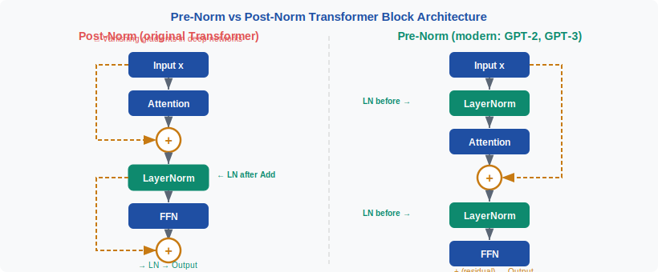
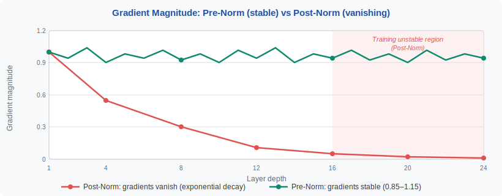
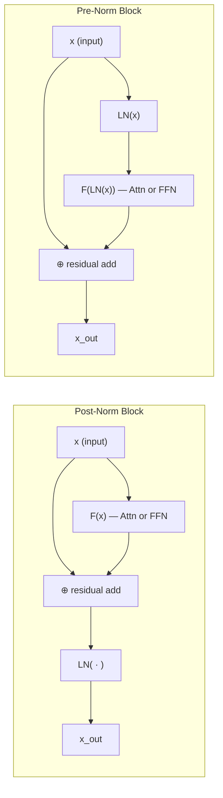
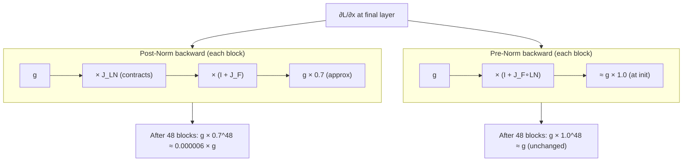
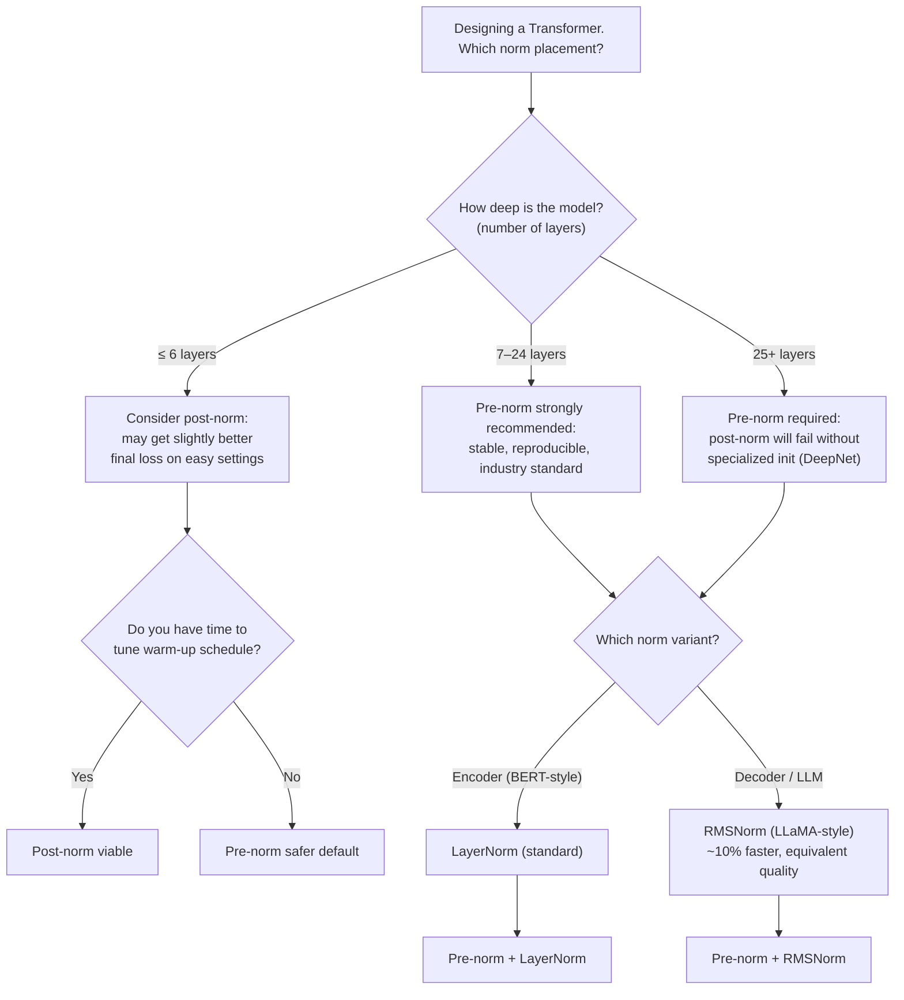

<div align="center">

[🏠 Home](../../README.md) &nbsp;•&nbsp; [📚 Section 1 — Transformer Architecture](./README.md) &nbsp;•&nbsp; [⬅️ Q3 — LayerNorm vs BatchNorm](./q03-layernorm-batchnorm.md) &nbsp;•&nbsp; [Q5 — Positional Encodings ➡️](./q05-positional-encodings.md)

</div>

# Q4 · What's the difference between pre-norm and post-norm Transformer variants? Why did the field shift toward pre-norm?

<div align="center">


</div>

---

> [!IMPORTANT]
> **20-second answer:** Post-norm (original Transformer) applies LayerNorm *after* the residual addition: $x \leftarrow \text{LN}(x + F(x))$. Pre-norm applies it *before* the sublayer: $x \leftarrow x + F(\text{LN}(x))$. The critical difference is that pre-norm keeps the residual highway clean — gradients flow back through an unobstructed additive path. Post-norm forces every gradient to pass through LayerNorm at each block, causing vanishing gradients in deep stacks and requiring careful warm-up schedules. The field shifted to pre-norm because it trains stably without warm-up, scales to hundreds of layers, and is used in virtually every modern LLM (GPT, LLaMA, PaLM, Mistral).

---

## Table of Contents

1. [The Residual Stream: What a Transformer Block Is Trying to Do](#1-the-residual-stream-what-a-transformer-block-is-trying-to-do)
2. [LayerNorm from First Principles](#2-layernorm-from-first-principles)
3. [Post-Norm: The Original Formulation](#3-post-norm-the-original-formulation)
4. [Pre-Norm: The Modern Formulation](#4-pre-norm-the-modern-formulation)
5. [Side-by-Side Architectural Comparison](#5-side-by-side-architectural-comparison)
6. [Gradient Flow: Why Placement Matters](#6-gradient-flow-why-placement-matters)
7. [Why the Field Shifted to Pre-Norm](#7-why-the-field-shifted-to-pre-norm)
8. [PyTorch Implementation Templates](#8-pytorch-implementation-templates)
9. [Worked Numerical Example](#9-worked-numerical-example)
10. [Important Nuances: Pre-Norm Is Not Unconditionally Better](#10-important-nuances-pre-norm-is-not-unconditionally-better)
11. [What to Monitor During Training](#11-what-to-monitor-during-training)
12. [Interview Decision Framework](#12-interview-decision-framework)
13. [Common Mistakes to Avoid](#13-common-mistakes-to-avoid)
14. [Senior-Researcher Synthesis](#14-senior-researcher-synthesis)
15. [References](#15-references)

---

## 1. The Residual Stream: What a Transformer Block Is Trying to Do

A Transformer is a stack of $L$ repeated blocks. Each block receives a tensor $X \in \mathbb{R}^{T \times d}$ where $T$ is the sequence length and $d$ is the hidden dimension. Every token vector $x_t \in \mathbb{R}^d$ carries the model's current representation of token $t$. The goal of each block is to update these representations by (a) mixing information across tokens via attention and (b) transforming each token's vector nonlinearly via the feed-forward network (FFN).

The residual connection is the load-bearing architectural element. Instead of replacing the current representation, each sublayer computes an *additive correction*:

$$x \leftarrow x + \Delta x$$

This is not merely a training trick. It defines the **residual stream**: a single vector that carries cumulative information across all layers. Every block reads from this stream and writes back to it. The identity component ($x$) is always preserved; $\Delta x$ is what each sublayer contributes. Think of it as a shared scratchpad that every layer can annotate without erasing prior annotations.

The school-notebook analogy is instructive: a student passes one notebook through $L$ teachers in sequence. The notebook starts with an initial draft. Each teacher writes a correction in the margin — they do not rewrite the original answer from scratch. The student's final answer is the original draft plus every teacher's marginal corrections. The residual stream is exactly this notebook. What changes across post-norm and pre-norm architectures is *where LayerNorm intervenes in this accumulation process* — and that placement has deep consequences for optimization geometry.

Formally, a single Transformer block applies two sublayers. Let $F_\text{attn}$ denote multi-head self-attention and $F_\text{ffn}$ denote the feed-forward network:

$$x \leftarrow \text{Block}(x) = \text{Sublayer}_2\bigl(\text{Sublayer}_1(x)\bigr)$$

The difference between post-norm and pre-norm is entirely contained in how each `Sublayer` combines $x$, $F$, and $\text{LN}$.

---

## 2. LayerNorm from First Principles

LayerNorm normalizes each token vector *across its hidden dimensions*, independently of other tokens or batch elements. For a single token vector $x = [x_1, \ldots, x_d] \in \mathbb{R}^d$:

$$\mu = \frac{1}{d}\sum_{i=1}^d x_i, \qquad \sigma^2 = \frac{1}{d}\sum_{i=1}^d (x_i - \mu)^2$$

$$\hat{x}_i = \frac{x_i - \mu}{\sqrt{\sigma^2 + \epsilon}}, \qquad \text{LN}(x)_i = \gamma_i \hat{x}_i + \beta_i$$

The learnable parameters $\gamma, \beta \in \mathbb{R}^d$ allow the network to rescale and shift each dimension after normalization. This is critical: without $\gamma$ and $\beta$, LayerNorm would destroy the model's ability to represent different scales in different dimensions.

The key property for understanding pre-norm vs post-norm is **what LayerNorm does to gradient magnitudes**. LayerNorm is a contractive map on scale: it forces the output to have unit variance (before $\gamma$ rescaling). When applied to the output of a residual sum $x + F(x)$, it clamps the magnitude of the combined vector. This clamping sits directly in the backward pass gradient path in post-norm, which is why gradients shrink.

In pre-norm, LayerNorm is applied only to the input $x$ before it enters the sublayer — the residual addition $x + F(\text{LN}(x))$ happens *after* LayerNorm. The gradient of the loss with respect to $x$ sees a clean additive path back through the identity, bypassing LayerNorm entirely in the main gradient highway.

> [!NOTE]
> RMSNorm — used in LLaMA, Mistral, and many recent models — is a simplified variant that omits the mean subtraction: $\text{RMSNorm}(x)_i = \frac{x_i}{\sqrt{\frac{1}{d}\sum_j x_j^2 + \epsilon}} \cdot \gamma_i$. It is almost always used in the pre-norm position and has become the de facto standard in open-source LLMs.

---

## 3. Post-Norm: The Original Formulation

Post-norm is the architecture introduced in "Attention Is All You Need" (Vaswani et al., 2017). Each sublayer applies the transformation first, adds it to the input via the residual connection, and then normalizes the sum:

$$x \leftarrow \text{LN}\bigl(x + F(x)\bigr)$$

Applied twice per block (once for attention, once for FFN):

$$x' = \text{LN}\bigl(x + \text{Attn}(x)\bigr)$$
$$x'' = \text{LN}\bigl(x' + \text{FFN}(x')\bigr)$$

The output of every sublayer is normalized before being passed to the next sublayer. This has an appealing property at initialization: each block's output is well-conditioned regardless of what $F$ produces, because LayerNorm enforces unit variance. In shallow networks (6–12 layers, as in the original Transformer), this works well.

The problem emerges at scale. In the backward pass, the gradient of the loss $\mathcal{L}$ with respect to the block input $x$ must pass through $\frac{\partial}{\partial x}\text{LN}(x + F(x))$. The Jacobian of LayerNorm is not identity — it is a rank-$(d-1)$ projection that removes the mean direction. Every block multiplies the gradient by this contracted Jacobian. With $L = 48$ or $L = 96$ layers (as in large LLMs), the product of these Jacobians causes the gradient magnitude to collapse in the early layers, making them effectively untrained.

<div align="center">

<br><em>Figure 1. Post-norm gradient magnitudes: the gradient norm (y-axis, log scale) through layer index (x-axis) decays exponentially toward the input. Early layers receive gradients orders of magnitude smaller than the final layer, causing slow or failed training without careful warm-up.</em>
</div>

The standard mitigation for post-norm was a **learning-rate warm-up schedule**: start with an extremely small learning rate and gradually increase it over thousands of steps. This allows the model to initialize in a reasonable basin before the optimizer takes large steps. Without warm-up, post-norm models diverge immediately. This fragility is a signal that the optimization landscape is pathological at initialization.

---

## 4. Pre-Norm: The Modern Formulation

Pre-norm moves LayerNorm *inside* the residual branch, before the sublayer computation. The residual addition happens outside, in the clean stream:

$$x \leftarrow x + F\bigl(\text{LN}(x)\bigr)$$

Applied twice per block:

$$x' = x + \text{Attn}\bigl(\text{LN}(x)\bigr)$$
$$x'' = x' + \text{FFN}\bigl(\text{LN}(x')\bigr)$$

The sublayer $F$ always sees a normalized input (mean-zero, unit-variance before $\gamma$ rescaling), which stabilizes the internal computations of attention and FFN. But crucially, the *residual stream* $x$ is never passed through LayerNorm in the main path. It accumulates raw, unnormalized updates from every block.

The backward-pass consequence is immediate. The gradient of $\mathcal{L}$ with respect to $x$ at block $\ell$:

$$\frac{\partial \mathcal{L}}{\partial x^{(\ell)}} = \frac{\partial \mathcal{L}}{\partial x^{(\ell+1)}} \cdot \frac{\partial x^{(\ell+1)}}{\partial x^{(\ell)}} = \frac{\partial \mathcal{L}}{\partial x^{(\ell+1)}} \cdot \left(I + \frac{\partial F(\text{LN}(x^{(\ell)}))}{\partial x^{(\ell)}}\right)$$

The identity matrix $I$ is always present. Even if the Jacobian of $F \circ \text{LN}$ is small, the gradient is never multiplied by zero — it always receives the upstream gradient in full. This is the **gradient highway**: an additive identity path that lets signals propagate from the loss to layer 1 without attenuation from LayerNorm contractions.

<div align="center">

<br><em>Figure 2. Architectural comparison. Left: post-norm block — LayerNorm wraps the residual sum, sitting in the main gradient path. Right: pre-norm block — LayerNorm normalizes only the sublayer input; the residual addition bypasses it entirely.</em>
</div>

---

## 5. Side-by-Side Architectural Comparison



| Property | Post-Norm | Pre-Norm |
|---|---|---|
| **Formula** | $x \leftarrow \text{LN}(x + F(x))$ | $x \leftarrow x + F(\text{LN}(x))$ |
| **LN position** | After residual addition | Before sublayer input |
| **Residual stream** | Normalized at every block | Raw, unnormalized |
| **Gradient path** | LN Jacobian on main path | Identity always present |
| **Training stability** | Requires LR warm-up | Stable without warm-up |
| **Initialization sensitivity** | High | Low |
| **Max practical depth** | ~12–24 layers unmodified | 100+ layers routinely |
| **Output scale at depth** | Bounded by LN at each block | Can grow with depth |
| **Used in** | Original Transformer, BERT | GPT-3, LLaMA, PaLM, Mistral, Falcon |
| **Theoretical expressivity** | Slightly higher in theory | Slightly lower in theory |

> [!NOTE]
> The "slightly lower expressivity" of pre-norm is a theoretical concern that has not materialized in practice at scale. The optimization benefits of pre-norm overwhelmingly dominate any expressivity difference across all practical training regimes studied so far.

---

## 6. Gradient Flow: Why Placement Matters

The core issue is the **backward pass through a stack of $L$ blocks**. Let $g^{(L)} = \frac{\partial \mathcal{L}}{\partial x^{(L)}}$ be the gradient at the final block. To reach the first block, this gradient must be multiplied by the Jacobian of each block's forward pass.

**Post-norm gradient flow:**

$$g^{(\ell)} = g^{(\ell+1)} \cdot J_{\text{LN}} \cdot (I + J_F)$$

where $J_{\text{LN}}$ is the Jacobian of LayerNorm (a rank-$(d-1)$ projection with spectral norm $\leq 1$). The product of $L$ such terms:

$$g^{(0)} = g^{(L)} \cdot \prod_{\ell=1}^{L} J_{\text{LN}}^{(\ell)} \cdot (I + J_F^{(\ell)})$$

Because $J_{\text{LN}}$ contracts the gradient at every step (removes the mean direction and can scale down variance), this product can collapse to near-zero for deep $L$.

**Pre-norm gradient flow:**

$$g^{(\ell)} = g^{(\ell+1)} \cdot \left(I + J_{F \circ \text{LN}}^{(\ell)}\right)$$

The $I$ term is always present. Even if $J_{F \circ \text{LN}}$ is arbitrarily small (which it is early in training when weights are near zero), the gradient is:

$$g^{(0)} = g^{(L)} \cdot \prod_{\ell=1}^{L} \left(I + J_{F \circ \text{LN}}^{(\ell)}\right) \approx g^{(L)} \cdot I^L = g^{(L)}$$

At initialization, the product is close to identity, so gradients at every layer have the *same magnitude* as the gradient at the final layer. This is the deep-network training ideal — every layer receives an informative gradient signal from the start.



> [!WARNING]
> The $0.7^{48} \approx 10^{-5}$ figure is illustrative, not exact. The actual contraction depends on the norm of the LayerNorm Jacobian, which varies during training. The point is qualitative: multiplicative contraction through many layers can reduce gradient magnitude by many orders of magnitude.

---

## 7. Why the Field Shifted to Pre-Norm

The shift was not a single discovery but a convergence of empirical and theoretical evidence between 2019 and 2021. Four forces drove the adoption:

**1. Training stability at scale.** As researchers pushed Transformer depth beyond 12 layers for machine translation, post-norm models required increasingly aggressive warm-up schedules — sometimes 10,000–40,000 steps of near-zero learning rate. Any deviation caused divergence. Wang et al. (2019) showed that pre-norm models trained stably *without* warm-up across 20–60 layer models for machine translation. For large-scale distributed training where hyperparameter sweeps are expensive, this removed a major source of failure.

**2. Theoretical understanding (Xiong et al., 2020).** The ICML 2020 paper "On Layer Normalization in the Transformer Architecture" provided the first formal analysis explaining why pre-norm enables learning-rate-independent training stability. They showed that the gradient norm in pre-norm architectures is bounded by a constant times the gradient norm at the last layer, independent of $L$, while post-norm gradient norms shrink exponentially with depth at initialization.

**3. Adoption by GPT-2/GPT-3 (OpenAI, 2019–2020).** GPT-2 used pre-norm. When GPT-3 scaled this to 175 billion parameters across 96 layers, pre-norm was the only viable option — no warm-up schedule engineering could have made 96-layer post-norm tractable at that scale. The success of GPT-3 effectively ratified pre-norm as the standard for autoregressive LLMs.

**4. Open-source cascade.** LLaMA (Touvron et al., 2023) used pre-norm with RMSNorm, as did Mistral, Falcon, Phi, and Qwen. The open-source community standardized on these architectures, making pre-norm the default in HuggingFace Transformers, nanoGPT, and every major LLM framework. Once it is the default, the burden of proof shifts to justify *not* using it.

| Year | Event | Impact on norm adoption |
|---|---|---|
| 2017 | Vaswani et al. — original Transformer | Post-norm established as default |
| 2018 | BERT (Devlin et al.) | Post-norm confirmed for encoders |
| 2019 | GPT-2 (Radford et al.) | Pre-norm adopted for autoregressive LMs |
| 2019 | Wang et al. — deep MT Transformers | Pre-norm shown stable at 20–60 layers |
| 2020 | Xiong et al. — theoretical analysis | Formal justification for pre-norm stability |
| 2020 | GPT-3 (Brown et al., 96 layers) | Pre-norm validated at unprecedented scale |
| 2022 | DeepNet (Wang et al.) | Post-norm scaled via init tricks, but niche |
| 2023 | LLaMA (Touvron et al.) | Pre-norm + RMSNorm becomes open-source default |

---

## 8. PyTorch Implementation Templates

The implementation difference is exactly two lines of code, but those two lines encode the entire architectural distinction.

```python
import torch
import torch.nn as nn
import torch.nn.functional as F
import math


class MultiHeadSelfAttention(nn.Module):
    """Minimal MHA for illustration — not optimized for production."""

    def __init__(self, d_model: int, n_heads: int):
        super().__init__()
        assert d_model % n_heads == 0
        self.n_heads = n_heads
        self.head_dim = d_model // n_heads
        self.qkv = nn.Linear(d_model, 3 * d_model, bias=False)
        self.out = nn.Linear(d_model, d_model, bias=False)

    def forward(self, x: torch.Tensor) -> torch.Tensor:
        B, T, D = x.shape
        qkv = self.qkv(x).reshape(B, T, 3, self.n_heads, self.head_dim)
        qkv = qkv.permute(2, 0, 3, 1, 4)
        q, k, v = qkv.unbind(0)
        scale = math.sqrt(self.head_dim)
        attn = (q @ k.transpose(-2, -1)) / scale
        attn = F.softmax(attn, dim=-1)
        out = (attn @ v).transpose(1, 2).reshape(B, T, D)
        return self.out(out)


class FeedForward(nn.Module):
    def __init__(self, d_model: int, d_ff: int):
        super().__init__()
        self.fc1 = nn.Linear(d_model, d_ff, bias=False)
        self.fc2 = nn.Linear(d_ff, d_model, bias=False)

    def forward(self, x: torch.Tensor) -> torch.Tensor:
        return self.fc2(F.gelu(self.fc1(x)))


# ── POST-NORM BLOCK ────────────────────────────────────────────────────────────
class PostNormBlock(nn.Module):
    """
    Post-norm (original Transformer): LN(x + F(x))
    LayerNorm is applied AFTER the residual addition.
    The residual stream passes through LN at every block.
    """

    def __init__(self, d_model: int, n_heads: int, d_ff: int):
        super().__init__()
        self.attn = MultiHeadSelfAttention(d_model, n_heads)
        self.ffn = FeedForward(d_model, d_ff)
        self.ln1 = nn.LayerNorm(d_model)
        self.ln2 = nn.LayerNorm(d_model)

    def forward(self, x: torch.Tensor) -> torch.Tensor:
        # Residual + normalize AFTER: LN(x + Attn(x))
        x = self.ln1(x + self.attn(x))   # <-- LN wraps the sum
        x = self.ln2(x + self.ffn(x))    # <-- LN wraps the sum
        return x


# ── PRE-NORM BLOCK ─────────────────────────────────────────────────────────────
class PreNormBlock(nn.Module):
    """
    Pre-norm (modern LLMs): x + F(LN(x))
    LayerNorm is applied BEFORE the sublayer.
    The residual stream is never passed through LN — identity path is clean.
    """

    def __init__(self, d_model: int, n_heads: int, d_ff: int):
        super().__init__()
        self.attn = MultiHeadSelfAttention(d_model, n_heads)
        self.ffn = FeedForward(d_model, d_ff)
        self.ln1 = nn.LayerNorm(d_model)
        self.ln2 = nn.LayerNorm(d_model)

    def forward(self, x: torch.Tensor) -> torch.Tensor:
        # Normalize BEFORE sublayer, add to raw residual
        x = x + self.attn(self.ln1(x))   # <-- LN inside the branch
        x = x + self.ffn(self.ln2(x))    # <-- LN inside the branch
        return x


# ── PRE-NORM WITH RMSNORM (LLaMA-style) ───────────────────────────────────────
class RMSNorm(nn.Module):
    """RMSNorm: like LayerNorm but without mean subtraction. Faster and equally effective."""

    def __init__(self, d_model: int, eps: float = 1e-6):
        super().__init__()
        self.gamma = nn.Parameter(torch.ones(d_model))
        self.eps = eps

    def forward(self, x: torch.Tensor) -> torch.Tensor:
        rms = x.pow(2).mean(dim=-1, keepdim=True).add(self.eps).sqrt()
        return self.gamma * (x / rms)


class LlamaStyleBlock(nn.Module):
    """
    Pre-norm + RMSNorm as used in LLaMA, Mistral, and most open-source LLMs.
    Identical gradient-flow properties to PreNormBlock; RMSNorm is faster.
    """

    def __init__(self, d_model: int, n_heads: int, d_ff: int):
        super().__init__()
        self.attn = MultiHeadSelfAttention(d_model, n_heads)
        self.ffn = FeedForward(d_model, d_ff)
        self.norm1 = RMSNorm(d_model)
        self.norm2 = RMSNorm(d_model)

    def forward(self, x: torch.Tensor) -> torch.Tensor:
        x = x + self.attn(self.norm1(x))
        x = x + self.ffn(self.norm2(x))
        return x


# ── GRADIENT FLOW DIAGNOSTIC ───────────────────────────────────────────────────
def measure_gradient_norms(
    block_class,
    n_layers: int = 12,
    d_model: int = 64,
    n_heads: int = 4,
    d_ff: int = 256,
    batch_size: int = 2,
    seq_len: int = 16,
) -> dict[int, float]:
    """
    Build a stack of blocks and measure gradient norm at each layer's output.
    Returns {layer_index: gradient_norm}.
    Useful for comparing post-norm vs pre-norm empirically.
    """
    layers = nn.ModuleList(
        [block_class(d_model, n_heads, d_ff) for _ in range(n_layers)]
    )

    x = torch.randn(batch_size, seq_len, d_model, requires_grad=True)
    activations = [x]

    h = x
    for layer in layers:
        h = layer(h)
        h.retain_grad()
        activations.append(h)

    # Scalar loss
    loss = h.sum()
    loss.backward()

    grad_norms = {}
    for i, act in enumerate(activations[1:], start=1):  # skip input
        if act.grad is not None:
            grad_norms[i] = act.grad.norm().item()

    return grad_norms


if __name__ == "__main__":
    print("Post-norm gradient norms (layer 1 → 12):")
    post_norms = measure_gradient_norms(PostNormBlock)
    for layer, norm in post_norms.items():
        print(f"  Layer {layer:2d}: {norm:.6f}")

    print("\nPre-norm gradient norms (layer 1 → 12):")
    pre_norms = measure_gradient_norms(PreNormBlock)
    for layer, norm in pre_norms.items():
        print(f"  Layer {layer:2d}: {norm:.6f}")
```

> [!TIP]
> Run the `__main__` block with randomly initialized weights. You will observe that post-norm gradient norms at layer 1 are typically 10–100x smaller than at layer 12. Pre-norm gradient norms will be approximately equal across all layers at initialization — this is the empirical signature of a clean gradient highway.

---

## 9. Worked Numerical Example

This toy example uses $d = 4$, a 3-layer model, and traces gradient magnitudes to make the contrast concrete. The numbers are simplified but mechanistically accurate.

**Setup.** Let the loss gradient at the final layer be $g = 1.0$ (scalar norm). Each block has a Jacobian contribution. We model:
- LayerNorm Jacobian spectral norm: $\|J_{\text{LN}}\| = 0.70$ (contraction, realistic at init)
- Sublayer Jacobian spectral norm: $\|J_F\| = 0.05$ (small at init, weights near zero)

**Post-norm backward pass:**

At each block, the gradient is multiplied by $J_{\text{LN}} \cdot (I + J_F)$. The combined norm per block is approximately $0.70 \times (1 + 0.05) = 0.735$.

$$g^{(L)} = 1.000$$

$$g^{(L-1)} = 1.000 \times 0.735 = 0.735$$

$$g^{(L-2)} = 0.735 \times 0.735 = 0.540$$

$$g^{(L-3)} = 0.540 \times 0.735 = 0.397$$

After just 3 blocks, the gradient has lost 60% of its magnitude. With 48 blocks: $0.735^{48} \approx 4 \times 10^{-4}$. The first layer receives a gradient 2,500 times smaller than the last layer.

**Pre-norm backward pass:**

At each block, the gradient is multiplied by $(I + J_{F \circ \text{LN}})$. The combined norm per block is approximately $1 + 0.05 \times 0.70 = 1.035$ (LN is only inside the branch, not on the main path).

$$g^{(L)} = 1.000$$

$$g^{(L-1)} = 1.000 \times 1.035 = 1.035$$

$$g^{(L-2)} = 1.035 \times 1.035 = 1.071$$

$$g^{(L-3)} = 1.071 \times 1.035 = 1.109$$

The gradient is *slightly increasing* (gradient amplification is possible in pre-norm, which is a different problem — addressed by initialization). After 48 blocks: $1.035^{48} \approx 5.2$. The first layer receives roughly the same magnitude as the last layer, or slightly more.

| Layer (from output) | Post-norm $\|g\|$ | Pre-norm $\|g\|$ | Ratio (post/pre) |
|---|---|---|---|
| Layer $L$ (final) | 1.000 | 1.000 | 1.0× |
| Layer $L-1$ | 0.735 | 1.035 | 0.71× |
| Layer $L-2$ | 0.540 | 1.071 | 0.50× |
| Layer $L-3$ | 0.397 | 1.109 | 0.36× |
| Layer $L-6$ | 0.158 | 1.229 | 0.13× |
| Layer $L-12$ | 0.025 | 1.511 | 0.017× |
| Layer $L-24$ | $6.4 \times 10^{-4}$ | 2.284 | $2.8 \times 10^{-4}$× |
| Layer $L-48$ | $4.1 \times 10^{-7}$ | 5.213 | $7.8 \times 10^{-8}$× |

> [!WARNING]
> Pre-norm can cause **gradient explosion** in deep networks if the sublayer contributions are not kept small. This is addressed by careful weight initialization — specifically, scaling down the output projection of each sublayer by $1/\sqrt{2L}$ (as in GPT-2: `c_proj` initialized with std $0.02/\sqrt{2 \times n\_\text{layers}}$). Without this, the $1.035^{48}$ amplification from the example becomes a real explosion.

**Concrete 4-dimensional vector trace:**

Consider a token vector $x = [2.0,\; -1.0,\; 0.5,\; -0.5]$ with $d=4$.

*Post-norm* with a toy $F(x) = 0.1x$ (small linear sublayer at init):

$$x + F(x) = [2.2,\; -1.1,\; 0.55,\; -0.55]$$

$$\mu = \frac{2.2 + (-1.1) + 0.55 + (-0.55)}{4} = \frac{1.1}{4} = 0.275$$

$$\sigma^2 = \frac{(1.925)^2 + (-1.375)^2 + (0.275)^2 + (-0.825)^2}{4} = \frac{3.706 + 1.891 + 0.076 + 0.681}{4} = 1.588$$

$$\text{LN}(x + F(x)) \approx [1.528,\; -1.091,\; 0.218,\; -0.655] \quad \text{(norm }\approx 1.93\text{)}$$

*Pre-norm* with the same $F$:

$$\text{LN}(x): \quad \mu_x = \frac{2.0 + (-1.0) + 0.5 + (-0.5)}{4} = 0.25$$

$$\sigma^2_x = \frac{(1.75)^2 + (-1.25)^2 + (0.25)^2 + (-0.75)^2}{4} = 1.313$$

$$\hat{x} \approx [1.528,\; -1.091,\; 0.000,\; -0.873] \quad (\gamma=1, \beta=0)$$

$$F(\hat{x}) = 0.1 \times \hat{x} \approx [0.153,\; -0.109,\; 0.000,\; -0.087]$$

$$x + F(\hat{x}) = [2.153,\; -1.109,\; 0.500,\; -0.587] \quad \text{(norm }\approx 2.46\text{)}$$

The pre-norm residual stream output has norm $\approx 2.46$, close to the input norm of $2.29$. The post-norm output is re-normalized to norm $\approx 1.93$. Over 48 layers, post-norm keeps the stream bounded but at the cost of destroying the gradient path; pre-norm lets the stream grow slightly but preserves gradients.

---

## 10. Important Nuances: Pre-Norm Is Not Unconditionally Better

> [!IMPORTANT]
> Pre-norm is the practical standard, but it has genuine failure modes and theoretical limitations that a research-level answer must acknowledge.

| Claim | Verdict | Explanation |
|---|---|---|
| "Pre-norm always trains faster" | ❌ Oversimplification | At shallow depth (≤6 layers), post-norm can converge to lower loss with equivalent hyperparameters |
| "Post-norm can never scale deep" | ❌ False | DeepNet (Wang et al., 2022) scales post-norm to 1,000 layers via modified initialization ($\alpha$-scaling) |
| "Pre-norm is more expressive" | ❌ Backwards | Post-norm has slightly more theoretical expressivity; pre-norm sacrifices this for trainability |
| "Pre-norm needs no warm-up" | ✅ Mostly true | Stable without warm-up, but very large LR can still cause early instability |
| "RMSNorm + pre-norm = LLaMA default" | ✅ Correct | This is the standard for virtually all open-source LLMs as of 2023–2024 |
| "Pre-norm causes representation collapse" | ⚠️ Possible | If residual updates are consistently small, layers may learn near-identity transforms (rank collapse risk at depth) |

**The identity-dominance problem.** In pre-norm, the residual stream $x$ is never normalized. If the sublayer updates $F(\text{LN}(x))$ are consistently small (due to conservative initialization or weight decay), the network may converge to a state where early layers compute near-identity transforms — they do not learn to transform representations meaningfully. This is the flip side of the gradient highway: the highway is also an easy path to *not learning*. Post-norm forces each layer's output to be normalized, which can push the model to use each layer's capacity more aggressively.

**DeepNet and post-norm at scale.** Wang et al. (2022) showed that post-norm can be scaled to 1,000 layers by using a modified initialization that scales the residual branch by a factor $\alpha$ dependent on $L$:

$$x \leftarrow \text{LN}(\alpha x + \beta F(x))$$

with $\alpha = (2L)^{1/4}$ and $\beta = (8L)^{-1/4}$ for a decoder. This makes the gradient flow in post-norm resemble pre-norm at initialization. However, it requires careful $L$-dependent tuning, while pre-norm achieves stable training without such engineering.

---

## 11. What to Monitor During Training

When training a Transformer and debugging stability issues related to normalization placement, these are the signals that distinguish the two regimes:

**Gradient norms by layer.** Log the gradient norm for each layer's parameters. In a healthy pre-norm model, gradient norms should be approximately uniform across layers (within 2–5×). In post-norm, early layers will have gradient norms 10–1000× smaller than late layers at initialization — this is expected but indicates slow early-layer learning.

```python
# Add to training loop to track gradient flow
def log_gradient_norms(model: nn.Module, step: int) -> dict[str, float]:
    norms = {}
    for name, param in model.named_parameters():
        if param.grad is not None:
            norms[name] = param.grad.norm().item()
    # Log ratio of first-block to last-block gradient norms
    # Healthy pre-norm: ratio close to 1.0
    # Post-norm: ratio << 1.0 at early training
    return norms
```

**Loss divergence pattern.** Post-norm diverges *immediately* when learning rate is too high — loss spikes to NaN in the first 10–100 steps. Pre-norm diverges more gradually or plateaus, giving more diagnostic signal.

**Residual stream norm growth.** In pre-norm, the residual stream norm can grow with depth. Monitor $\|x^{(\ell)}\|$ across layers. If it grows exponentially, your output projection initialization is too large.

**Attention entropy.** Both architectures can develop attention collapse (all attention on one token) independently of normalization placement — but in post-norm, this tends to happen later due to the regularizing effect of LN on the stream.

| Metric | Healthy pre-norm | Healthy post-norm | Pathological signal |
|---|---|---|---|
| Gradient norm ratio (layer 1 / layer $L$) | 0.5–2.0 | 0.001–0.1 | Pre-norm $> 10$ (exploding) |
| Residual stream norm at depth | Grows slowly, $< 3\times$ input norm | Approximately constant | Pre-norm: exponential growth |
| Loss at step 0–100 (no warm-up) | Decreasing smoothly | May spike | Post-norm NaN without warm-up |
| Weight norm growth | Slow and uniform | Concentrated in late layers | Either: sudden norm spike |

---

## 12. Interview Decision Framework

Use this framework when asked "which normalization placement would you use?" in a design question:



**Quick decision rules:**
- Default choice for any new LLM: **pre-norm + RMSNorm** (LLaMA pattern)
- Reproducing BERT: **post-norm + LayerNorm** (be prepared for warm-up tuning)
- Research ablation on expressivity: consider post-norm with DeepNet initialization at shallow depth
- Production system, tight timeline: **always pre-norm** — eliminates an entire class of training stability failures

---

## 13. Common Mistakes to Avoid

<details>
<summary>Misconception 1: "Pre-norm and post-norm differ only in code order, not in semantics"</summary>

**Wrong.** The mathematical objects are different. In post-norm, the output of each block is a *normalized* vector — the residual stream is bounded at every step. In pre-norm, the output is an *unnormalized* vector — the residual stream accumulates raw updates. These have different optimization landscapes, different gradient dynamics, and different representational properties. The code difference is two lines; the semantic difference is fundamental.

</details>

<details>
<summary>Misconception 2: "Post-norm is just an older, worse architecture that should never be used"</summary>

**Wrong.** Post-norm can outperform pre-norm in shallow settings or with careful initialization (DeepNet). BERT, which uses post-norm, remains competitive with many pre-norm encoders on NLU benchmarks. The correct statement is: pre-norm is the better *default* for *deep autoregressive* models because it eliminates a major source of training instability, not that it is universally superior.

</details>

<details>
<summary>Misconception 3: "Pre-norm eliminates the need for learning rate scheduling"</summary>

**Partially wrong.** Pre-norm eliminates the *need for warm-up* — you can start with your target learning rate immediately. But you still need a learning rate *decay* schedule (cosine, linear) for optimal final performance. Pre-norm makes the optimizer less sensitive to the initial LR choice, but it does not make scheduling irrelevant.

</details>

<details>
<summary>Misconception 4: "Adding a final LayerNorm before the language model head is redundant in pre-norm"</summary>

**Wrong.** Because the pre-norm residual stream is unnormalized and grows with depth, the final representation $x^{(L)}$ passed to the output projection can have large and variable norms. A final LayerNorm (sometimes called "output norm" or `ln_f` in GPT-2) after the last block but before the LM head is essential for stable output logits. LLaMA includes this as `model.norm`. Omitting it causes the output logit scale to vary across training and sequence position.

</details>

<details>
<summary>Misconception 5: "Gradient vanishing in post-norm is fixed by residual connections"</summary>

**Wrong.** Residual connections fix gradient vanishing in architectures *without* LayerNorm. The original ResNet paper established this for batch-normed vision models. But post-norm Transformers put LayerNorm *outside* the residual connection, on the main path. The residual connection passes through LayerNorm before reaching the next block's input — it is not a clean identity path. Pre-norm is specifically the fix for this: it moves LayerNorm *inside* the residual branch so the identity path is unobstructed.

</details>

| Mistake | Correct understanding |
|---|---|
| "Just a code-order difference" | ❌ Different optimization geometry entirely |
| "Post-norm is obsolete" | ❌ Still valid with proper initialization at shallow depth |
| "Pre-norm needs no schedule" | ❌ Still needs decay; just does not need warm-up |
| "Final LN redundant in pre-norm" | ❌ Essential for stable output logits |
| "Residuals fix post-norm gradient issues" | ❌ LN on main path blocks the identity gradient highway |

---

## 14. Senior-Researcher Synthesis

A top-lab answer must frame pre-norm not as a cosmetic engineering tweak, but as a fundamental choice about the **optimization geometry of the residual stream**. The residual stream is the model's long-range memory pathway — the single object that carries information from the embedding layer to the output. Every architectural decision that touches this stream is a decision about what the optimizer can and cannot easily learn.

Post-norm is geometrically clean at each layer boundary: the input to every sublayer is normalized, giving the sublayer a consistent input distribution throughout training. This is appealing from a theoretical perspective and may explain why post-norm achieves slightly better expressivity in small-scale controlled experiments. The cost is that normalization sits in the gradient highway, fragmenting the signal that propagates backward through depth.

Pre-norm is geometrically clean at the gradient level: the backward pass has a direct identity path from the loss to every layer simultaneously. This makes the loss landscape approximately separable across layers at initialization — each layer can be optimized nearly independently. The cost is that the residual stream is unbounded, requiring initialization care to prevent explosion and monitoring to detect collapse.

The research frontier is not a binary choice between pre and post. It is the full co-design problem of:

1. **Normalization placement** (pre, post, sandwich, hybrid)
2. **Normalization variant** (LayerNorm, RMSNorm, CRMSNorm, Dynamic Tanh)
3. **Residual parameterization** (standard, $\alpha$-scaled, gated residual)
4. **Initialization** (standard, scaled output projections, depth-dependent scaling)
5. **Optimizer and schedule** (Adam, Muon, warmup shape, LR-to-batch ratio)
6. **Scale** (parameter count, depth, width, sequence length)

These six axes interact. A choice that works at 7B parameters may fail at 70B. A pre-norm model with poor initialization behaves worse than a well-tuned post-norm model. The field's convergence on pre-norm + RMSNorm + scaled output projections is an empirical optimum for current training regimes — it is not a proof of theoretical optimality, and it should be questioned as training methods (e.g., Muon optimizer, spectral normalization) continue to evolve.

> [!TIP]
> **Go-to interview answer template (2 minutes):**
>
> "Post-norm applies LayerNorm after the residual addition — $\text{LN}(x + F(x))$ — so every gradient must pass through LayerNorm's contractive Jacobian at every block. In a 48-layer model, this collapses early-layer gradients by orders of magnitude, requiring aggressive warm-up. Pre-norm applies LayerNorm before the sublayer — $x + F(\text{LN}(x))$ — so the residual pathway always has an identity component in the backward pass. Gradients flow with roughly uniform magnitude to all layers at initialization. The field shifted because GPT-2 and GPT-3 adopted pre-norm, it trained stably at 96 layers without warm-up engineering, and Xiong et al. 2020 provided the formal justification. Today, LLaMA-style pre-norm with RMSNorm is the open-source default. The nuance is that pre-norm is a pragmatic optimization solution: it sacrifices some theoretical expressivity and requires careful output-projection initialization to avoid gradient explosion, but those costs are negligible compared to the training stability benefits at scale."

---

## 15. References

1. Vaswani, A. et al. (2017). **Attention Is All You Need**. *NeurIPS*. https://arxiv.org/abs/1706.03762
   — Introduces the original post-norm Transformer architecture.

2. Ba, J. L., Kiros, J. R., and Hinton, G. E. (2016). **Layer Normalization**. https://arxiv.org/abs/1607.06450
   — Defines LayerNorm and its properties; foundation for understanding both norm placements.

3. Xiong, R. et al. (2020). **On Layer Normalization in the Transformer Architecture**. *ICML*. https://proceedings.mlr.press/v119/xiong20b.html
   — **The key theoretical paper**: proves pre-norm has bounded gradient norms independent of depth; provides formal justification for why pre-norm trains without warm-up.

4. Wang, Q. et al. (2019). **Learning Deep Transformer Models for Machine Translation**. *ACL*. https://aclanthology.org/P19-1176/
   — Empirical demonstration that pre-norm enables training 20–60 layer Transformers without warm-up.

5. Wang, H. et al. (2022). **DeepNet: Scaling Transformers to 1,000 Layers**. https://arxiv.org/abs/2203.00555
   — Shows post-norm can scale to 1,000 layers with depth-dependent $\alpha$/$\beta$ initialization; demonstrates that post-norm is not inherently unscalable, just more fragile.

6. Shazeer, N. (2020). **GLU Variants Improve Transformer**. https://arxiv.org/abs/2002.05202
   — Introduces SwiGLU FFN activation used in LLaMA; always paired with pre-norm in practice.

7. Touvron, H. et al. (2023). **LLaMA: Open and Efficient Foundation Language Models**. https://arxiv.org/abs/2302.13971
   — Establishes pre-norm + RMSNorm as the open-source LLM standard; architectural reference for most subsequent open models.

8. Jiang, Z. et al. (2023). **Pre-RMSNorm and Pre-CRMSNorm Transformers: Equivalent and Efficient Pre-LN Transformers**. https://arxiv.org/abs/2305.14858
   — Theoretical analysis of RMSNorm in the pre-norm position; shows equivalence to LayerNorm pre-norm under reparameterization.

---

<div align="center">

[🏠 Home](../../README.md) &nbsp;•&nbsp; [📚 Section 1 — Transformer Architecture](./README.md) &nbsp;•&nbsp; [⬅️ Q3 — LayerNorm vs BatchNorm](./q03-layernorm-batchnorm.md) &nbsp;•&nbsp; [Q5 — Positional Encodings ➡️](./q05-positional-encodings.md)

</div>
