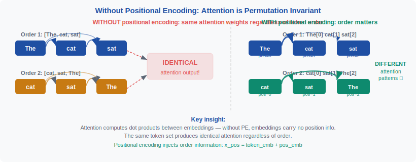
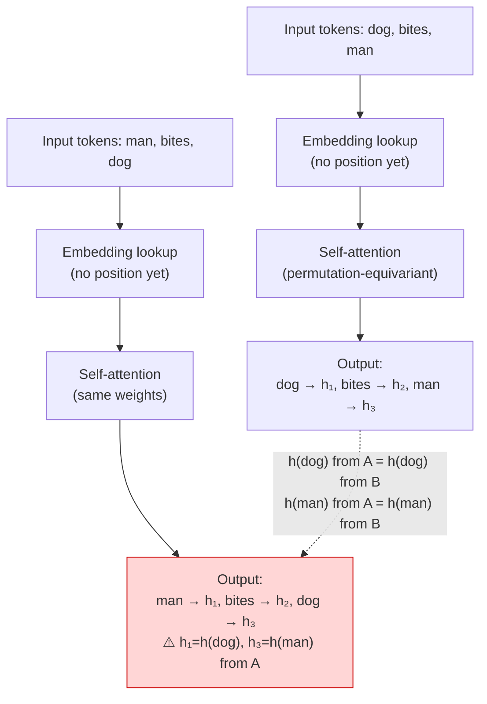
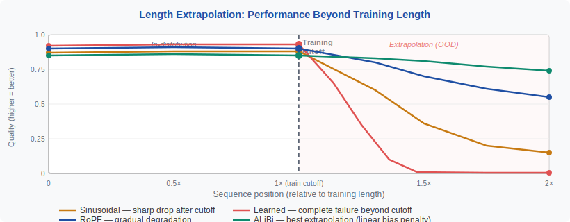

<!-- ============================ TOP NAV ============================ -->
<div align="center">

[🏠 Home](../../README.md) &nbsp;•&nbsp; [📚 Section 1 — Transformer Architecture](./README.md) &nbsp;•&nbsp; [⬅️ Q4 — Pre-norm vs Post-norm](./q04-prenorm-postnorm.md) &nbsp;•&nbsp; [Q6 — FFN ➡️](./q06-ffn.md)

</div>

---

# Q5 · Why do we need positional encodings? Compare sinusoidal vs learned vs RoPE vs ALiBi.

<div align="center">


</div>

> [!IMPORTANT]
> **The 20-second answer.** Self-attention is **permutation-equivariant**: shuffle the tokens and the output shuffles identically — the model has no idea which token came first. Without positional encodings, "dog bites man" and "man bites dog" produce the **same representations**. Positional encodings inject order into the otherwise order-blind attention mechanism. The four dominant strategies differ in *where* position information lives and *how* it generalizes beyond training length: **sinusoidal PE** adds fixed multi-frequency vectors to token embeddings; **learned absolute PE** (BERT) trains a lookup table, capped at training length; **RoPE** rotates query and key vectors so their dot product depends only on *relative* offset, enabling excellent length generalization; **ALiBi** skips embedding modification entirely and subtracts a distance penalty directly from attention logits, achieving the best out-of-the-box extrapolation.

---

## Table of contents

1. [First principles — permutation equivariance proved](#1--first-principles--permutation-equivariance-proved)
2. [The problem, told as a story](#2--the-problem-told-as-a-story)
3. [What a good positional encoding must provide](#3--what-a-good-positional-encoding-must-provide)
4. [Sinusoidal PE — multi-frequency barcodes](#4--sinusoidal-pe--multi-frequency-barcodes)
5. [Learned absolute PE — the BERT lookup table](#5--learned-absolute-pe--the-bert-lookup-table)
6. [RoPE — rotating queries and keys](#6--rope--rotating-queries-and-keys)
7. [ALiBi — penalizing distance in logit space](#7--alibi--penalizing-distance-in-logit-space)
8. [Full comparison table (4 methods × 9 properties)](#8--full-comparison-table-4-methods--9-properties)
9. [PyTorch implementations — all four variants](#9--pytorch-implementations--all-four-variants)
10. [Worked numerical example — tracing RoPE](#10--worked-numerical-example--tracing-rope)
11. [Length extrapolation analysis](#11--length-extrapolation-analysis)
12. [Cousins — YaRN, LongRoPE, 2D RoPE](#12--cousins--yarn-longrope-2d-rope)
13. [Interview drill: the follow-ups they'll ask](#13--interview-drill-the-follow-ups-theyll-ask)
14. [Common misconceptions](#14--common-misconceptions)
15. [One-screen summary](#15--one-screen-summary)
16. [References](#16--references)

---

## 1 · First principles — permutation equivariance proved

Before meeting any specific encoding scheme, lock in *why* the problem exists at all.

**The core equation.** Scaled dot-product attention maps a sequence $X \in \mathbb{R}^{n \times d}$ to an output $O \in \mathbb{R}^{n \times d}$:

$$\text{Attention}(X) = \text{softmax}\!\left(\frac{XW_Q(XW_K)^\top}{\sqrt{d_k}}\right) XW_V$$

**Permutation equivariance — the formal statement.** Let $P$ be any permutation matrix. Then:

$$\text{Attention}(PX) = P \cdot \text{Attention}(X)$$

**Proof (three lines).** Substitute $PX$ everywhere:

$$Q' = PXW_Q, \quad K' = PXW_K, \quad V' = PXW_V$$

The logit matrix becomes:

$$Q'K'^\top = PXW_Q(PXW_K)^\top = PXW_Q W_K^\top X^\top P^\top = P(XW_Q W_K^\top X^\top)P^\top$$

After softmax (applied row-wise, so it commutes with row permutations), the attention weight matrix is $PAP^\top$ where $A$ is the unpermuted attention weights. Multiplying by $V' = PXW_V$:

$$(PAP^\top)(PXW_V) = PA(P^\top P)XW_V = PA \cdot XW_V = P \cdot \text{Attention}(X) \qquad \square$$

**What this means in plain English.** The model produces output token $i$ using the same logic for token $i$ regardless of where that token sits in the sequence. There is no "slot $i$" concept baked into the weights. "Dog bites man" and "man bites dog" produce **identically valued output vectors**, just in swapped positions. **The model is sequence-position-blind by construction.**

This is not a bug in a specific implementation — it is a mathematical property of the self-attention operation. The fix must inject positional information from outside.

---

## 2 · The problem, told as a story

Imagine feeding two sentences to a Transformer with no positional encodings:

- **Sentence A:** `[dog] [bites] [man]`
- **Sentence B:** `[man] [bites] [dog]`

These have opposite meanings. One describes an ordinary news event; the other is a headline. But without position, the model receives the same three embedding vectors (just reordered), and since attention is permutation-equivariant, each token's final representation is identical across the two sentences. The subject of the biting and the victim are indistinguishable.

<div align="center">

<br><sub><b>Figure 1.</b> Permutation equivariance in action. Without positional encodings, the representations for "dog bites man" and "man bites dog" are permutationally identical — the model cannot distinguish subject from object.</sub>
</div>

The situation generalizes immediately to anything where order matters:

- **Language:** subject/verb/object distinctions, dependency grammar, coreference.
- **Code:** calling a function before defining it is a syntax error; the order is semantic.
- **Math:** "A implies B" is not the same as "B implies A."
- **Time series:** sequence order is the entire signal.



A positional encoding is any mechanism that breaks this symmetry by giving the model information about *which slot* each token occupies — so that the representation of "dog" in position 0 is distinguishably different from "dog" in position 2.

---

## 3 · What a good positional encoding must provide

Not every way to assign numbers to positions is equally useful. A principled PE should satisfy the following criteria:

| # | Criterion | Why it matters |
|---|---|---|
| **1** | **Unique identity per position** | Each absolute position should be distinguishable — the model can say "this is token slot 7." |
| **2** | **Encode distance / relative offset** | The model should be able to tell how far apart two tokens are, not just where each is absolutely. Dependency parsing is distance-sensitive. |
| **3** | **Encode direction / order** | Position 3 should feel "before" position 7, not just "different from" it. Causal structure requires direction. |
| **4** | **Attention-compatible** | The PE must interact cleanly with the dot-product attention mechanism, ideally letting relative position appear naturally in $q \cdot k$. |
| **5** | **Bounded magnitude** | Large positional signals can dominate token semantics. A well-behaved PE has controlled, predictable scale. |
| **6** | **Generalizes beyond training length** | At inference, sequences may be longer than seen in training. A robust PE degrades gracefully or handles this by construction. |

No single scheme scores perfectly on all six. The history of PE research is largely a story of successive improvements along criterion 6 (length generalization) while preserving the others.

---

## 4 · Sinusoidal PE — multi-frequency barcodes

### The formula

Proposed in the original Transformer paper (Vaswani et al., 2017), sinusoidal PE assigns a fixed $d$-dimensional vector to each position $pos$ by interleaving sines and cosines at geometrically spaced frequencies:

$$\text{PE}(pos, 2i) = \sin\!\left(\frac{pos}{10000^{2i/d}}\right)$$

$$\text{PE}(pos, 2i+1) = \cos\!\left(\frac{pos}{10000^{2i/d}}\right)$$

where $pos$ is the token position (0-indexed), $i \in \{0, 1, \ldots, d/2 - 1\}$ is the dimension pair index, and $d$ is the model dimension.

This produces a $d$-dimensional "barcode": the low-$i$ dimensions oscillate rapidly (high frequency, sensitive to local position), while the high-$i$ dimensions oscillate very slowly (low frequency, sensitive to long-range context). The base $10000$ is chosen so that for typical sequence lengths the slow dimensions haven't completed even one full cycle.

### The relative decodability property

A key property: for any fixed offset $k$, there is a **linear transformation** $M_k$ such that:

$$\text{PE}(pos + k) = M_k \cdot \text{PE}(pos)$$

This means the model *can*, in principle, learn to decode relative offsets from absolute encodings — the information is there. The proof uses the angle addition formulas:

$$\sin(A+B) = \sin A \cos B + \cos A \sin B$$
$$\cos(A+B) = \cos A \cos B - \sin A \sin B$$

So the transition from $pos$ to $pos+k$ is a **rotation by angle $\omega_i \cdot k$** in each $(\sin_{2i}, \cos_{2i+1})$ plane — exactly the idea RoPE will later apply directly to Q and K.

### Intuition and limitations

Think of the sinusoidal PE as a **multi-frequency clock face** for each position. Low-frequency hands distinguish far-apart positions; high-frequency hands distinguish nearby ones. Every position has a unique fingerprint.

**Strengths:**
- Deterministic, no trainable parameters.
- Theoretically supports any sequence length (the formula is defined for all $pos$).
- The relative decodability property gives the model a fighting chance at learning distance-sensitive operations.

**Limitations:**
- The relative structure must be **learned from data** by the attention weights — it is encoded implicitly, not injected directly into the dot product.
- In practice, models trained with sinusoidal PE struggle to generalize to lengths meaningfully beyond training, because the slow-frequency dimensions produce values the model has never been conditioned on.
- The encoding is added to the token embedding before attention, which can blur the boundary between semantic content and positional signal.

---

## 5 · Learned absolute PE — the BERT lookup table

### Mechanism

Rather than a fixed formula, learned absolute PE maintains a **trainable embedding matrix** $E \in \mathbb{R}^{L_{\max} \times d}$, where $L_{\max}$ is the maximum sequence length seen in training. The positional encoding for position $pos$ is the row $E[pos]$, added to the token embedding:

$$x'_{pos} = x_{pos} + E[pos]$$

BERT uses this approach with $L_{\max} = 512$. GPT-2 uses it with $L_{\max} = 1024$.

The embedding matrix $E$ is initialized randomly (or from a sinusoidal scheme) and updated by gradient descent — the model learns whatever positional representation best serves its training objective.

### Why it sometimes works better than sinusoidal

Because the embeddings are learned end-to-end, the model can discover task-specific positional structure. If certain positions are semantically special (e.g., position 0 often holds a `[CLS]` token, short-range dependencies dominate), the learned embeddings can encode those patterns more efficiently than a fixed formula.

Empirically, BERT found that learned and sinusoidal PE performed similarly (Devlin et al., 2018) — suggesting that for the tasks and lengths tested, the specific form mattered less than the presence of *some* positional signal.

### The hard ceiling problem

The critical failure mode: **a model using learned absolute PE cannot process sequences longer than $L_{\max}$ at inference time**, because positions $> L_{\max} - 1$ have no entry in the lookup table.

There are crude workarounds (clamp to $L_{\max}-1$, interpolate between trained embeddings) but they degrade quality. This hard ceiling is the defining limitation that motivated all subsequent PE research.

> [!NOTE]
> **Why "hard"?** Unlike sinusoidal PE — which has a defined formula for every position — the learned lookup table is simply undefined for out-of-range positions. There are no weights to look up; the model was never asked to produce them. Fine-tuning on longer sequences with extended position tables is the canonical fix, but it costs compute and changes the model.

---

## 6 · RoPE — rotating queries and keys

### The core idea

RoPE (Rotary Position Embedding, Su et al., 2021) breaks with the paradigm of *adding* positional vectors to token embeddings. Instead, it encodes position by **rotating** the query and key vectors before computing their dot product, in a way that the dot product between a query at position $m$ and a key at position $n$ depends *only on the relative offset $m - n$* — not on the absolute values of $m$ and $n$.

### The rotation matrix derivation

For a 2D case, define:

$$R(\theta) = \begin{pmatrix} \cos\theta & -\sin\theta \\ \sin\theta & \cos\theta \end{pmatrix}$$

For a query at position $m$ with embedding $q_m \in \mathbb{R}^2$, apply the rotation:

$$\tilde{q}_m = R(m\theta) \, q_m$$

For a key at position $n$:

$$\tilde{k}_n = R(n\theta) \, k_n$$

Their dot product:

$$\tilde{q}_m \cdot \tilde{k}_n = (R(m\theta) q_m)^\top (R(n\theta) k_n) = q_m^\top R(m\theta)^\top R(n\theta) k_n = q_m^\top R((n-m)\theta) k_n$$

This is exactly $q_m^\top R(n-m) k_n$ — **the dot product encodes only the relative offset** $n - m$, regardless of the absolute positions. This is the crucial property sinusoidal PE only achieved implicitly; RoPE builds it in by construction.

### Extension to $d_k$ dimensions

For $d_k > 2$, apply independent 2D rotations to each consecutive pair of dimensions, with different frequencies $\theta_i = 10000^{-2i/d_k}$ (the same base as sinusoidal PE):

$$\tilde{q}_m = \begin{pmatrix} R(m\theta_0) & & \\ & \ddots & \\ & & R(m\theta_{d_k/2-1}) \end{pmatrix} q_m$$

In compact notation, position $m$ applies a block-diagonal rotation matrix $\mathcal{R}_m$ to $q_m$, and similarly for $k_n$. The dot product becomes $q_m^\top \mathcal{R}_{n-m} k_n$.

### Implementation in practice

RoPE is efficiently implemented without materializing the full rotation matrix. Given $q_m = [q_0, q_1, \ldots, q_{d-1}]$, the rotated version is:

$$\tilde{q}_m[2i] = q_m[2i] \cos(m \theta_i) - q_m[2i+1] \sin(m \theta_i)$$
$$\tilde{q}_m[2i+1] = q_m[2i] \sin(m \theta_i) + q_m[2i+1] \cos(m \theta_i)$$

This can be written as an element-wise operation: $\tilde{q}_m = q_m \odot \cos(m\Theta) + q_m^{\perp} \odot \sin(m\Theta)$, where $q_m^{\perp}$ is $q_m$ with pairs of elements negated and swapped, and $\Theta = [\theta_0, \theta_0, \theta_1, \theta_1, \ldots]$.

### Usage

RoPE is the dominant PE in modern open-weight LLMs: **LLaMA** (Touvron et al., 2023), **LLaMA 2**, **LLaMA 3**, **Mistral**, **Qwen**, **Falcon**, **PaLM 2** all use RoPE. Its combination of relative-position semantics, no extra parameters, and good length generalization (with extensions) makes it the current default.

---

## 7 · ALiBi — penalizing distance in logit space

### The mechanism

ALiBi (Attention with Linear Biases, Press et al., 2021) takes a philosophically different approach: **do not touch the token embeddings at all**. Instead, add a distance-proportional negative bias directly to the attention logit matrix at every layer and every head:

$$\text{score}(q_m, k_n) = q_m \cdot k_n - \lambda_h \,|m - n|$$

where $\lambda_h > 0$ is a **head-specific slope** that determines how steeply the attention penalty grows with distance. Closer tokens are penalized less; farther tokens are penalized more; attending to the current token ($m=n$) carries no penalty.

### Head slopes

The slopes $\lambda_h$ are not learned — they are fixed geometric sequences based on the number of heads $H$:

$$\lambda_h = 2^{-h \cdot 8/H}, \quad h \in \{1, 2, \ldots, H\}$$

For $H=8$: slopes are $\frac{1}{2}, \frac{1}{4}, \frac{1}{8}, \ldots, \frac{1}{256}$.

Different heads thus have different "reach": shallow-slope heads can attend to very distant tokens; steep-slope heads focus tightly on local context. The model effectively learns to route local vs. global queries to different heads based on their natural slopes.

### Why ALiBi extrapolates best

The key insight: at training time, let the model see sequences of length $L$. At inference time with length $L' > L$, sinusoidal and learned PE encounter position values they have never seen. RoPE encounters rotation angles it has never seen (the high-frequency components cycle rapidly but the slow-frequency ones may not). But ALiBi simply **extends the same linear penalty** — $\lambda_h \cdot (L'+1)$ is not qualitatively different from $\lambda_h \cdot L$. The bias is always a larger number, and the model has learned to handle "larger bias = farther away."

ALiBi was shown to outperform sinusoidal PE on sequences up to **4× longer** than training length with no fine-tuning, while using slightly less memory (no position embedding table) and adding no parameters.

**Limitations:**
- Because there are no position vectors added to embeddings, the absolute position of a token is not directly accessible to the MLP layers — only the attention mechanism sees it.
- The linear penalty may be suboptimal for tasks requiring long-range dependencies (the penalty grows without bound).
- Most modern frontier models have moved toward RoPE with context extension (YaRN, LongRoPE) rather than ALiBi, but ALiBi remains the cleanest story for extrapolation.

---

## 8 · Full comparison table (4 methods × 9 properties)

<div align="center">

<br><sub><b>Figure 2.</b> Where each method injects position information and how the attention pattern behaves at 2× training length. ALiBi degrades most gracefully; learned absolute PE hard-fails.</sub>
</div>

| Property | Sinusoidal | Learned Absolute | RoPE | ALiBi |
|---|---|---|---|---|
| **Where position lives** | Added to token embeddings (input layer) | Added to token embeddings (input layer, trainable) | Multiplied into Q and K at every attention layer | Subtracted from attention logits at every layer |
| **Encodes absolute position?** | Yes (directly) | Yes (directly) | Implicitly (via rotation angle) | No (only relative distance) |
| **Encodes relative distance?** | Implicitly (via linear combination) | Implicitly | Yes, by construction ($q_m^\top R(n-m) k_n$) | Yes, directly ($\lambda_h \|m-n\|$) |
| **Encodes direction / order?** | Yes (sin/cos asymmetry) | Yes (distinct embeddings) | Yes (signed offset) | No (uses $|m-n|$, unsigned) |
| **Learnable parameters?** | No | Yes ($L_{\max} \times d$ params) | No | No (slopes are fixed) |
| **Hard training-length ceiling?** | No (formula defined everywhere) | **Yes** — undefined beyond $L_{\max}$ | No (but degrades) | No (linear penalty always defined) |
| **Length generalization quality** | Poor beyond ~2× training length | Fails hard at $L_{\max}+1$ | Good; excellent with YaRN/LongRoPE | **Best** out-of-the-box |
| **Attention-layer overhead** | None (added once at input) | None (added once at input) | Rotate Q and K every layer ($O(n \cdot d_k)$) | Add bias to logits every layer ($O(n^2)$) |
| **Used in** | Original Transformer, many early models | BERT, GPT-2, RoBERTa | LLaMA, Mistral, Qwen, Falcon, PaLM 2 | MPT-7B, BLOOM (partial), some OPT variants |

**Reading the table for an interview:**
- Ask about **BERT** → learned absolute.
- Ask about **LLaMA/Mistral** → RoPE.
- Ask about **best extrapolation** → ALiBi.
- Ask about **original Transformer** → sinusoidal.

---

## 9 · PyTorch implementations — all four variants

```python
import math
import torch
import torch.nn as nn
import torch.nn.functional as F
from typing import Optional


# ═══════════════════════════════════════════════════════════════════════════════
# 1. SINUSOIDAL POSITIONAL ENCODING
# ═══════════════════════════════════════════════════════════════════════════════

class SinusoidalPE(nn.Module):
    """Fixed sinusoidal positional encoding (Vaswani et al. 2017).
    Added to the token embedding once, before the first attention layer."""

    def __init__(self, d_model: int, max_len: int = 4096, dropout: float = 0.1):
        super().__init__()
        self.dropout = nn.Dropout(dropout)

        # Build the encoding table [max_len, d_model]
        pe = torch.zeros(max_len, d_model)
        position = torch.arange(max_len).unsqueeze(1).float()          # [L, 1]
        dim_pair = torch.arange(0, d_model, 2).float()                  # [d/2]
        div_term = torch.exp(dim_pair * (-math.log(10000.0) / d_model)) # [d/2]

        pe[:, 0::2] = torch.sin(position * div_term)   # even dims: sin
        pe[:, 1::2] = torch.cos(position * div_term)   # odd dims:  cos
        pe = pe.unsqueeze(0)                            # [1, L, d_model]

        # Not a parameter: register as buffer so it moves to the right device
        self.register_buffer("pe", pe)

    def forward(self, x: torch.Tensor) -> torch.Tensor:
        """x: [batch, seq, d_model]"""
        x = x + self.pe[:, :x.size(1)]
        return self.dropout(x)


# ═══════════════════════════════════════════════════════════════════════════════
# 2. LEARNED ABSOLUTE POSITIONAL ENCODING (BERT-style)
# ═══════════════════════════════════════════════════════════════════════════════

class LearnedAbsolutePE(nn.Module):
    """Trainable lookup table, BERT-style.
    Hard ceiling at max_len — will raise IndexError if seq > max_len."""

    def __init__(self, d_model: int, max_len: int = 512, dropout: float = 0.1):
        super().__init__()
        self.dropout = nn.Dropout(dropout)
        self.embedding = nn.Embedding(max_len, d_model)
        # Initialize close to sinusoidal so the model starts in a sensible basin
        nn.init.normal_(self.embedding.weight, std=0.02)

    def forward(self, x: torch.Tensor) -> torch.Tensor:
        """x: [batch, seq, d_model]"""
        seq_len = x.size(1)
        positions = torch.arange(seq_len, device=x.device)    # [seq]
        x = x + self.embedding(positions)                     # broadcast over batch
        return self.dropout(x)


# ═══════════════════════════════════════════════════════════════════════════════
# 3. ROPE — Rotary Position Embedding (Su et al. 2021)
# ═══════════════════════════════════════════════════════════════════════════════

def precompute_rope_freqs(d_head: int, max_len: int, base: float = 10000.0,
                          device: Optional[torch.device] = None):
    """Precompute cos and sin for every position up to max_len.
    Returns:
        cos_cached: [max_len, d_head]
        sin_cached: [max_len, d_head]
    """
    # theta_i = base^{-2i/d}, applied to each pair of dimensions
    i = torch.arange(0, d_head, 2, device=device).float()       # [d_head/2]
    theta = 1.0 / (base ** (i / d_head))                         # [d_head/2]

    positions = torch.arange(max_len, device=device).float()     # [max_len]
    freqs = torch.outer(positions, theta)                        # [max_len, d_head/2]

    # Duplicate to cover both elements of each pair: [max_len, d_head]
    freqs = torch.cat([freqs, freqs], dim=-1)

    return freqs.cos(), freqs.sin()


def rotate_half(x: torch.Tensor) -> torch.Tensor:
    """Rotates the second half of each pair: [x0,x1,...] -> [-x_{d/2},...,x_0,...]"""
    half = x.shape[-1] // 2
    x1, x2 = x[..., :half], x[..., half:]
    return torch.cat([-x2, x1], dim=-1)


def apply_rope(q: torch.Tensor, k: torch.Tensor,
               cos: torch.Tensor, sin: torch.Tensor):
    """Apply RoPE to query and key tensors.
    q, k: [batch, heads, seq, d_head]
    cos, sin: [seq, d_head] (will be broadcast)
    """
    # Unsqueeze for batch and head broadcasting
    cos = cos.unsqueeze(0).unsqueeze(0)   # [1, 1, seq, d_head]
    sin = sin.unsqueeze(0).unsqueeze(0)

    q_rot = q * cos + rotate_half(q) * sin
    k_rot = k * cos + rotate_half(k) * sin
    return q_rot, k_rot


class RoPEAttention(nn.Module):
    """Multi-head attention with RoPE. Position enters only through Q and K."""

    def __init__(self, d_model: int, n_heads: int, max_len: int = 4096,
                 causal: bool = True):
        super().__init__()
        assert d_model % n_heads == 0
        self.n_heads = n_heads
        self.d_head = d_model // n_heads
        self.causal = causal

        self.qkv = nn.Linear(d_model, 3 * d_model, bias=False)
        self.out = nn.Linear(d_model, d_model, bias=False)

        # Precompute and cache RoPE tables (not parameters)
        cos, sin = precompute_rope_freqs(self.d_head, max_len)
        self.register_buffer("cos_cached", cos)   # [max_len, d_head]
        self.register_buffer("sin_cached", sin)

    def forward(self, x: torch.Tensor) -> torch.Tensor:
        B, T, _ = x.shape
        q, k, v = self.qkv(x).chunk(3, dim=-1)

        # Split heads: [B, heads, T, d_head]
        reshape = lambda t: t.view(B, T, self.n_heads, self.d_head).transpose(1, 2)
        q, k, v = map(reshape, (q, k, v))

        # ── Apply RoPE ──────────────────────────────────────────────────────
        cos, sin = self.cos_cached[:T], self.sin_cached[:T]
        q, k = apply_rope(q, k, cos, sin)
        # ────────────────────────────────────────────────────────────────────

        scale = self.d_head ** -0.5
        logits = (q @ k.transpose(-2, -1)) * scale    # [B, heads, T, T]

        if self.causal:
            mask = torch.triu(torch.ones(T, T, device=x.device), 1).bool()
            logits = logits.masked_fill(mask, float("-inf"))

        attn = logits.softmax(dim=-1)
        out = (attn @ v).transpose(1, 2).reshape(B, T, -1)
        return self.out(out)


# ═══════════════════════════════════════════════════════════════════════════════
# 4. ALiBi — Attention with Linear Biases (Press et al. 2021)
# ═══════════════════════════════════════════════════════════════════════════════

def get_alibi_slopes(n_heads: int) -> torch.Tensor:
    """Compute the fixed per-head slopes: 2^{-h * 8/H} for h=1..H."""
    # The recipe from the paper: find the nearest power of 2 <= n_heads
    def get_slopes_power_of_2(n):
        start = 2 ** (-(2 ** -(math.log2(n) - 3)))
        ratio = start
        return [start * ratio ** i for i in range(n)]

    if math.log2(n_heads).is_integer():
        return torch.tensor(get_slopes_power_of_2(n_heads), dtype=torch.float32)
    else:
        # Interpolate for non-power-of-2 head counts
        closest_power_of_2 = 2 ** math.floor(math.log2(n_heads))
        base_slopes = get_slopes_power_of_2(closest_power_of_2)
        extra_slopes = get_slopes_power_of_2(2 * closest_power_of_2)
        extra_slopes = extra_slopes[0::2][:n_heads - closest_power_of_2]
        return torch.tensor(base_slopes + extra_slopes, dtype=torch.float32)


def build_alibi_bias(n_heads: int, seq_len: int,
                     device: Optional[torch.device] = None) -> torch.Tensor:
    """Build the ALiBi bias matrix.
    Returns: [1, n_heads, seq_len, seq_len], where entry [h, m, n] = -slope_h * |m-n|
    """
    slopes = get_alibi_slopes(n_heads).to(device)      # [H]
    positions = torch.arange(seq_len, device=device)   # [T]
    # Relative distances: [T, T]
    distances = (positions.unsqueeze(1) - positions.unsqueeze(0)).abs().float()
    # Bias: [H, T, T] = -slope_h * |m-n|
    bias = -slopes.view(-1, 1, 1) * distances.unsqueeze(0)
    return bias.unsqueeze(0)                           # [1, H, T, T]


class ALiBiAttention(nn.Module):
    """Multi-head attention with ALiBi. No position vectors; bias in logit space."""

    def __init__(self, d_model: int, n_heads: int, causal: bool = True):
        super().__init__()
        assert d_model % n_heads == 0
        self.n_heads = n_heads
        self.d_head = d_model // n_heads
        self.causal = causal

        self.qkv = nn.Linear(d_model, 3 * d_model, bias=False)
        self.out = nn.Linear(d_model, d_model, bias=False)

    def forward(self, x: torch.Tensor) -> torch.Tensor:
        B, T, _ = x.shape
        q, k, v = self.qkv(x).chunk(3, dim=-1)

        reshape = lambda t: t.view(B, T, self.n_heads, self.d_head).transpose(1, 2)
        q, k, v = map(reshape, (q, k, v))

        scale = self.d_head ** -0.5
        logits = (q @ k.transpose(-2, -1)) * scale    # [B, H, T, T]

        # ── Apply ALiBi bias ─────────────────────────────────────────────────
        alibi = build_alibi_bias(self.n_heads, T, device=x.device)  # [1, H, T, T]
        logits = logits + alibi                       # broadcast over batch
        # ─────────────────────────────────────────────────────────────────────

        if self.causal:
            mask = torch.triu(torch.ones(T, T, device=x.device), 1).bool()
            logits = logits.masked_fill(mask, float("-inf"))

        attn = logits.softmax(dim=-1)
        out = (attn @ v).transpose(1, 2).reshape(B, T, -1)
        return self.out(out)
```

> [!WARNING]
> **RoPE cache invalidation.** The `cos_cached` and `sin_cached` tensors are built for `max_len` at construction time. If you want to extend context at inference, either rebuild the cache with a larger `max_len` or use a dynamic version that computes frequencies on-the-fly for the actual sequence length. The static cache is faster but breaks if `T > max_len`.

---

## 10 · Worked numerical example — tracing RoPE

Let's trace through a minimal RoPE computation with $d_k = 4$ (so 2 rotation planes), query at position $m = 2$, and key at position $n = 5$.

**Setup.** With $d_k = 4$, we have dimension pairs $(0,1)$ and $(2,3)$ with frequencies:

$$\theta_0 = 10000^{-0/4} = 1.0, \qquad \theta_1 = 10000^{-2/4} = 0.01$$

**Step 1: Compute rotation angles.**

For position $m = 2$:
- Plane 0 angle: $m \theta_0 = 2 \times 1.0 = 2.0$ rad
- Plane 1 angle: $m \theta_1 = 2 \times 0.01 = 0.02$ rad

For position $n = 5$:
- Plane 0 angle: $5 \times 1.0 = 5.0$ rad
- Plane 1 angle: $5 \times 0.01 = 0.05$ rad

**Step 2: Choose sample query and key vectors.**

$$q_m = [1.0,\ 0.0,\ 0.5,\ 0.5], \qquad k_n = [0.8,\ 0.6,\ 0.3,\ 0.7]$$

**Step 3: Apply RoPE to query at $m = 2$.**

The rotation in plane 0 (dims 0,1) with angle $2.0$ rad ($\cos 2.0 \approx -0.416$, $\sin 2.0 \approx 0.909$):

$$\tilde{q}[0] = q[0]\cos(2.0) - q[1]\sin(2.0) = 1.0 \times (-0.416) - 0.0 \times 0.909 = -0.416$$
$$\tilde{q}[1] = q[0]\sin(2.0) + q[1]\cos(2.0) = 1.0 \times 0.909 + 0.0 \times (-0.416) = 0.909$$

The rotation in plane 1 (dims 2,3) with angle $0.02$ rad ($\cos 0.02 \approx 0.9998$, $\sin 0.02 \approx 0.02$):

$$\tilde{q}[2] = 0.5 \times 0.9998 - 0.5 \times 0.02 = 0.4999 - 0.010 = 0.490$$
$$\tilde{q}[3] = 0.5 \times 0.02 + 0.5 \times 0.9998 = 0.010 + 0.4999 = 0.510$$

So $\tilde{q}_2 \approx [-0.416,\ 0.909,\ 0.490,\ 0.510]$.

**Step 4: Apply RoPE to key at $n = 5$.**

Plane 0 with angle $5.0$ rad ($\cos 5.0 \approx 0.284$, $\sin 5.0 \approx -0.959$):

$$\tilde{k}[0] = 0.8 \times 0.284 - 0.6 \times (-0.959) = 0.227 + 0.575 = 0.802$$
$$\tilde{k}[1] = 0.8 \times (-0.959) + 0.6 \times 0.284 = -0.767 + 0.170 = -0.597$$

Plane 1 with angle $0.05$ rad ($\cos 0.05 \approx 0.9988$, $\sin 0.05 \approx 0.050$):

$$\tilde{k}[2] = 0.3 \times 0.9988 - 0.7 \times 0.050 = 0.2996 - 0.035 = 0.265$$
$$\tilde{k}[3] = 0.3 \times 0.050 + 0.7 \times 0.9988 = 0.015 + 0.6992 = 0.714$$

So $\tilde{k}_5 \approx [0.802,\ -0.597,\ 0.265,\ 0.714]$.

**Step 5: Compute the dot product.**

$$\tilde{q}_2 \cdot \tilde{k}_5 = (-0.416)(0.802) + (0.909)(-0.597) + (0.490)(0.265) + (0.510)(0.714)$$
$$= -0.334 - 0.543 + 0.130 + 0.364 = -0.383$$

**Step 6: Verify the relative-position property.**

The key claim is that $\tilde{q}_m \cdot \tilde{k}_n = q_m^\top \mathcal{R}_{n-m} k_n$. Here $n - m = 3$, so the dot product should equal what we'd get by rotating $k_n$ by angle $3\theta_i$ and computing the unrotated dot product. Let's check plane 0:

Rotate $k_n$ by $3.0$ rad ($\cos 3.0 \approx -0.990$, $\sin 3.0 \approx 0.141$):
$$k'[0] = 0.8(-0.990) - 0.6(0.141) = -0.792 - 0.085 = -0.877$$
$$k'[1] = 0.8(0.141) + 0.6(-0.990) = 0.113 - 0.594 = -0.481$$

Dot product for plane 0: $1.0 \times (-0.877) + 0.0 \times (-0.481) = -0.877$.

This matches the plane-0 contribution from the rotated vectors: $(-0.416)(0.802) + (0.909)(-0.597) = -0.334 - 0.543 = -0.877$. The relative-position property holds.

**Takeaway.** The attention logit between position $m=2$ and $n=5$ is $-0.383 / \sqrt{4} \approx -0.192$. If we moved both tokens to positions $m=7$ and $n=10$ (same relative offset $n-m=3$, same $q$ and $k$ values), we'd get **the same logit** — because only the relative rotation $\mathcal{R}_3$ enters the dot product. This is the core guarantee of RoPE.

---

## 11 · Length extrapolation analysis

Length extrapolation refers to a model's ability to handle sequences longer at inference than those seen in training. The four PE methods behave very differently.

<div align="center">

<br><sub><b>Figure 3.</b> Schematic perplexity vs. sequence length (normalized to training length = 1.0). Learned absolute PE hard-fails at the ceiling. Sinusoidal degrades steadily. RoPE holds well with extensions. ALiBi shows the gentlest degradation.</sub>
</div>

### Why learned absolute PE fails hard

At position $L_{\max}+1$, there is simply no row in $E$ to retrieve. Common workarounds — clamping, interpolating, or repeating the last embedding — produce position confusion: the model sees the same positional signal for multiple distinct positions, losing all ability to distinguish late-sequence tokens from each other.

### Why sinusoidal degrades gradually

The formula is defined everywhere, so there is no hard failure. However, the slow-frequency dimensions take values the model has never been conditioned on — the gradients during training provided no signal about those extreme-position sine/cosine values. The model has not learned to use the encoding in that regime.

### Why RoPE degrades at moderate extension

RoPE rotation angles for high-frequency dimensions (small $i$) cycle rapidly with position — the model has seen many cycles during training and these generalize fine. But for low-frequency dimensions (large $i$, corresponding to slow oscillations), positions beyond training length produce angles the model has not seen in any part of the training distribution. These dimensions effectively lose their positional signal. Without intervention, RoPE models degrade noticeably beyond approximately 2× their training length.

### Extending RoPE: the interpolation trick

A simple fix: instead of evaluating the rotation at position $m$ using the training frequencies, **scale the position** by $L_{\text{train}} / L_{\text{new}}$ before computing the rotation:

$$m' = m \cdot \frac{L_{\text{train}}}{L_{\text{new}}}$$

This remaps the $[0, L_{\text{new}}]$ range into $[0, L_{\text{train}}]$, which the model has seen. This position interpolation (Chen et al., 2023 — "Extending Context Window of LLMs via Positional Interpolation") allows extending LLaMA from 2K to 32K context with only a small amount of fine-tuning.

### Why ALiBi extrapolates best

The ALiBi penalty $-\lambda_h |m-n|$ is a simple linear function of distance, and linear functions generalize trivially: the model sees distances up to $L_{\text{train}}$ in training, and larger distances at inference are simply "more negative logits for farther tokens," which is exactly the pattern learned. The model has trained on a consistent rule ("farther = penalized more"), and that rule applies equally to any distance.

### Summary

| Method | Extrapolation mechanism | Quality at 2× training length | Quality at 4× |
|---|---|---|---|
| Sinusoidal | Formula defined, but untrained regime | Moderate degradation | Poor |
| Learned absolute | Hard fail (undefined) | **Fails** | **Fails** |
| RoPE (standard) | Rotation angles in untrained regime | Good | Moderate |
| RoPE + interpolation | Rescale positions into training range | **Excellent** | Good (with fine-tuning) |
| ALiBi | Linear rule always holds | Excellent | **Excellent** |

---

## 12 · Cousins — YaRN, LongRoPE, 2D RoPE

Once RoPE became the dominant PE, a family of extensions emerged to push context length further. Knowing the cousins is useful for showing breadth in an interview.

### YaRN (Yet another RoPE extensioN — Peng et al., 2023)

YaRN improves on naive position interpolation by recognizing that different frequency components of RoPE generalize differently:

- **High-frequency dimensions** (rapidly cycling) generalize fine and should not be interpolated.
- **Low-frequency dimensions** (slowly cycling) are in an untrained regime and need interpolation.
- **Mid-frequency dimensions** get a ramp blend.

YaRN applies dimension-specific scaling (not a uniform $m' = m \cdot s$) and adds a temperature correction to counteract the softening of attention caused by interpolation. Result: LLaMA-2 extended from 4K to 128K context with far less fine-tuning than prior methods. YaRN is the PE underlying many long-context models including **Mistral-7B-v0.1** fine-tunes and Qwen long-context variants.

### LongRoPE (Ding et al., 2024)

LongRoPE pushes to million-token contexts by applying **non-uniform position rescaling** — different dimensions get different scale factors, searched via evolutionary optimization to minimize perplexity at very long contexts. It also introduces a progressive extension strategy: first extend to 256K, then to 2M. Applied to LLaMA-2 and Phi-3 to produce long-context variants.

### 2D RoPE (used in multi-modal and vision Transformers)

Standard RoPE encodes 1D position (sequence index). For image patches or video frames, position is naturally 2D (row, column) or 3D (time, row, column). 2D RoPE assigns half the dimension pairs to encode the row position and half to encode the column position, applying independent rotations for each spatial axis. The dot product then factors as:

$$\tilde{q}_{(r,c)} \cdot \tilde{k}_{(r',c')} \propto q^\top \mathcal{R}_{r'-r}^{\text{row}} \mathcal{R}_{c'-c}^{\text{col}} k$$

This is used in multimodal models including **InternVL**, **Qwen-VL**, and **LLaVA** variants that process high-resolution images.

### Quick-reference cousins table

| Method | Base | Key idea | Use case |
|---|---|---|---|
| **YaRN** | RoPE | Dimension-specific interpolation + temperature | Long-context LLMs, ~128K |
| **LongRoPE** | RoPE | Non-uniform per-dimension scale factors, evolutionary search | Very long contexts, ~2M |
| **2D RoPE** | RoPE | Independent row/column rotation planes | Vision, multimodal |
| **NTK-aware scaling** | RoPE | Scale base frequency instead of positions | Simple, training-free extension |
| **ALiBi + fine-tuning** | ALiBi | Fine-tune with longer sequences, letting the model learn larger penalties | Moderate extension |

---

## 13 · Interview drill: the follow-ups they'll ask

<details>
<summary><b>Q: Why can't a model just learn the order from the data without any PE?</b></summary>

In principle, a model with enough capacity and a well-designed training objective could learn to infer order from co-occurrence statistics (certain words appear in certain positions more often). But the self-attention mechanism provides **no inductive bias** toward position awareness — every permutation is treated identically until the weights provide a workaround. This is an extremely hard learning problem from data alone, and empirically: models trained without any PE learn representations that are approximately permutation-invariant, performing far worse on order-sensitive tasks. The PE is a necessary inductive bias that tells the model "order matters, here is the information to act on it."
</details>

<details>
<summary><b>Q: Why does RoPE put position in Q and K but not V?</b></summary>

Positional information needs to influence *which tokens attend to which* — that is the job of the attention weights, computed from Q and K. The value vectors V carry the semantic content that gets mixed; their contribution to the output is weighted by the already-position-aware attention pattern. Rotating V would not make the attention pattern more position-sensitive; it would just add positional noise to the payloads being mixed. The precise formulation of RoPE is that $q_m^\top \mathcal{R}_{n-m} k_n$ depends on relative position — this only requires rotating Q and K, and the relative-position guarantee holds exactly because V is left out.
</details>

<details>
<summary><b>Q: ALiBi uses |m-n|, so it loses direction. Is that a problem?</b></summary>

Yes, and it is a real limitation. ALiBi treats "5 positions to the left" and "5 positions to the right" identically — both get the same penalty. For a **causal (decoder-only) language model**, this doesn't matter: the causal mask already prevents any key from attending to a future query, so direction is enforced by the mask rather than the PE. But for **bidirectional (encoder) models** like BERT, direction is semantically important ("dog before verb" vs. "dog after verb"), and ALiBi's unsigned distance penalty loses this signal. This is why ALiBi has been most successful in decoder-only models (MPT, some OPT variants), not in encoders.
</details>

<details>
<summary><b>Q: What is the "NTK-aware" RoPE scaling trick?</b></summary>

Naive position interpolation shrinks all frequencies uniformly by a factor $s = L_{\text{new}} / L_{\text{train}}$. This disrupts the high-frequency components more than necessary — they generalize fine, but we're compressing their range. The NTK-aware insight (from Neural Tangent Kernel theory) is that instead of changing positions, we should **change the base** of the exponential that generates frequencies. Replacing the base $10000$ with $10000 \cdot s^{d/(d-2)}$ achieves similar effective position compression but redistributes it more favorably across dimensions: high-frequency components are stretched slightly, low-frequency components are stretched more. In practice, NTK-aware scaling enables context extension with **no fine-tuning** (just change the base), at the cost of slightly lower quality than fine-tuned YaRN.
</details>

<details>
<summary><b>Q: What happens to sinusoidal PE when two different positions have very similar encodings?</b></summary>

For sinusoidal PE with base $10000$ and typical $d=512$, the slow-frequency dimensions oscillate so slowly that positions within a few thousand tokens are well-separated. However, the fast-frequency dimensions complete many full cycles, so some pairs of distant positions might have similar high-frequency components while differing on low-frequency ones. The full $d$-dimensional vector is nearly always unique (the probability of a collision across all dimensions is negligible for typical $d$ and sequence lengths), but the *attention mechanism* sees an inner product of the PE vectors, not their Euclidean distance. Two positions with similar inner products can confuse the model — this is more of a problem at very short and very long distances where inner products can coincidentally be high. This is one reason why relative PE methods (RoPE, ALiBi) are preferred: they don't rely on absolute vectors being well-separated in dot-product space.
</details>

<details>
<summary><b>Q: Why does LLaMA use RoPE instead of ALiBi, given that ALiBi has better extrapolation?</b></summary>

At the time LLaMA was designed (late 2022 / early 2023), the benchmark evaluations and practical fine-tuning ecosystem favored RoPE. Several factors: (1) RoPE encodes both absolute and relative position implicitly, whereas ALiBi only encodes relative distance, which was thought to provide a richer signal; (2) the RoPE community developed strong context extension techniques (interpolation, YaRN, NTK scaling) that largely closed the extrapolation gap; (3) RoPE adds no overhead to the embedding layer — the rotation happens during attention computation, integrating naturally with fused attention kernels like FlashAttention; (4) empirically, LLaMA and its successors trained with RoPE achieved state-of-the-art performance, giving little incentive to switch. ALiBi remains excellent for its simplicity and zero-cost extrapolation, but the tooling ecosystem (PEFT, quantization, context extension) has largely grown up around RoPE models.
</details>

---

## 14 · Common misconceptions

| Misconception | Reality |
|---|---|
| "Transformers have no positional awareness without PE — they're completely random about order." | They are **deterministically order-blind**: given the same set of token embeddings in any order, they produce the same output (permuted). This is worse than random — it's a strict symmetry. PE breaks this symmetry by design. |
| "Sinusoidal PE can be used for any length at inference." | Technically yes — the formula is defined everywhere. But models trained with sinusoidal PE **generalize poorly** to lengths not seen in training because the weights have no signal about those extreme-position values. "Can compute" does not mean "can use well." |
| "RoPE adds position vectors to the embeddings, like sinusoidal PE." | RoPE never touches the token embeddings. It applies rotation matrices to **Q and K at every attention layer**, after the projection. The input embeddings are plain token embeddings with no positional addition. |
| "ALiBi's lack of direction is harmless for all architectures." | Only harmless in **causal decoders** where the causal mask enforces direction. In bidirectional encoders, losing the sign of the offset ($m-n$ vs. $n-m$) discards genuinely useful syntactic information. |
| "Learned PE is strictly better than sinusoidal because it is trained end-to-end." | Empirically, BERT found them **equivalent** on standard benchmarks. Learned PE is more expressive but wastes that expressiveness on the training distribution, hard-failing outside it. Sinusoidal PE is worse at memorizing training-set patterns but more principled about generalization. |
| "RoPE perfectly handles any length because the dot product only depends on relative offset." | RoPE's relative-position guarantee holds for any offset, but the **attention weights** are still trained on specific distance distributions. Models trained up to length $L$ have learned to route attention across distances $\leq L$; at distances $> L$ they may not use the relative signal appropriately. |
| "Adding PE to the embedding layer once is equivalent to applying it at every attention layer." | These are fundamentally different. Embedding-layer PE (sinusoidal, learned) applies once and the signal is subject to modification by every subsequent layer's transformations. Attention-layer PE (RoPE, ALiBi) applies fresh at every layer, guaranteeing that the positional signal is present exactly where attention computation needs it, undiluted by intermediate transformations. |

---

## 15 · One-screen summary

> **The problem.** Self-attention is permutation-equivariant — $\text{Attention}(PX) = P \cdot \text{Attention}(X)$ — so without additional information the model cannot distinguish token order. Positional encodings break this symmetry.
>
> **Four approaches:**
> - **Sinusoidal** (Vaswani 2017): fixed sine/cosine vectors added to embeddings; $\text{PE}(pos, 2i) = \sin(pos/10000^{2i/d})$. No parameters, theoretically unlimited range, poor extrapolation in practice.
> - **Learned absolute** (BERT): trainable lookup table $E \in \mathbb{R}^{L_{\max} \times d}$. End-to-end optimization, but hard ceiling at $L_{\max}$.
> - **RoPE** (Su 2021): rotates Q and K by $\mathcal{R}_{m}$ and $\mathcal{R}_{n}$ so $\tilde{q}_m \cdot \tilde{k}_n = q_m^\top \mathcal{R}_{n-m} k_n$. Relative position by construction. Used in LLaMA, Mistral, Qwen. Extensible via YaRN/LongRoPE.
> - **ALiBi** (Press 2021): subtracts $\lambda_h |m-n|$ from attention logits. No PE vectors, best out-of-the-box extrapolation, but unsigned (no direction). Best for long-context decoder-only models.
>
> **The extrapolation hierarchy:** ALiBi >= RoPE+YaRN > RoPE (standard) > Sinusoidal >> Learned absolute.

---

## 16 · References

1. Vaswani, A. et al. — **Attention Is All You Need** (2017). *NeurIPS 2017 / arXiv:1706.03762.* — introduced Transformers and sinusoidal positional encoding; the relative decodability property of sinusoidal PE.
2. Devlin, J. et al. — **BERT: Pre-training of Deep Bidirectional Transformers for Language Understanding** (2018). *NAACL 2019 / arXiv:1810.04805.* — learned absolute positional embeddings; empirical equivalence with sinusoidal.
3. Su, J., Lu, Y., Pan, S., Murtadha, A., Wen, B., Liu, Y. — **RoFormer: Enhanced Transformer with Rotary Position Embedding** (2021). *arXiv:2104.09864.* — RoPE derivation; relative-position guarantee via rotation matrices.
4. Press, O., Smith, N. A., Lewis, M. — **Train Short, Test Long: Attention with Linear Biases Enables Input Length Extrapolation (ALiBi)** (2021). *ICLR 2022 / arXiv:2108.12409.* — ALiBi; head-slope schedule; 4× extrapolation results.
5. Touvron, H. et al. — **LLaMA: Open and Efficient Foundation Language Models** (2023). *arXiv:2302.13971.* — large-scale RoPE adoption; LLaMA architecture details.
6. Chen, S. et al. — **Extending Context Window of Large Language Models via Positional Interpolation** (2023). *arXiv:2306.15595.* — position interpolation for RoPE; extending LLaMA from 2K to 32K.
7. Peng, B. et al. — **YaRN: Efficient Context Window Extension of Large Language Models** (2023). *arXiv:2309.00071.* — dimension-specific RoPE interpolation; temperature correction; 128K context.
8. Ding, Y. et al. — **LongRoPE: Extending LLM Context Window Beyond 2 Million Tokens** (2024). *arXiv:2402.13753.* — non-uniform per-dimension scaling; evolutionary search.

---

<!-- ============================ BOTTOM NAV ============================ -->
<div align="center">

[⬅️ Q4 — Pre-norm vs Post-norm](./q04-prenorm-postnorm.md) &nbsp;|&nbsp; [📚 Back to Section 1](./README.md) &nbsp;|&nbsp; [🏠 Home](../../README.md) &nbsp;|&nbsp; [Q6 — FFN ➡️](./q06-ffn.md)

<sub>Found an error or have a sharper intuition? See <a href="../../CONTRIBUTING.md">CONTRIBUTING</a> — answers follow the <a href="../../_TEMPLATE.md">answer template</a>.</sub>

</div>
