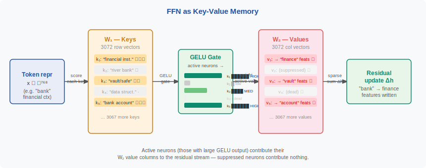
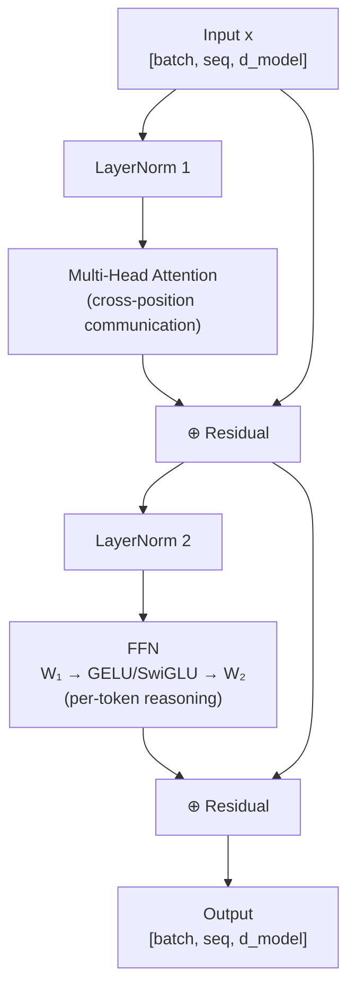

<!-- ============================ TOP NAV ============================ -->
<div align="center">

[🏠 Home](../../README.md) &nbsp;•&nbsp; [📚 Section 1 — Transformer Architecture](./README.md) &nbsp;•&nbsp; [⬅️ Q5 — Positional Encodings](./q05-positional-encodings.md) &nbsp;•&nbsp; [Q7 — Teacher Forcing ➡️](./q07-teacher-forcing.md)

</div>

---

# Q6 · What is the role of the feed-forward network (FFN) in a Transformer block? Why is it typically 4× the hidden dimension?

<div align="center">


</div>

> [!IMPORTANT]
> **The 20-second answer.** The FFN is a two-layer MLP applied **independently to every token position** after the attention sub-layer. It expands the hidden dimension by ~4×, applies a nonlinearity, then projects back — providing the per-token **nonlinear computation** that a pure attention stack (which is linear in the values) cannot. The 4× expansion is an empirical convention that creates an overcomplete feature space, keeps compute balanced relative to attention, and aligns to hardware tile sizes. A second role, established by Geva et al. (2021), is **factual key-value memory**: $W_1$ rows are pattern-matching keys, $W_2$ columns are memorised values — together they store and retrieve world knowledge.

---

## Table of contents

1. [First principles — why an FFN at all?](#1--first-principles--why-an-ffn-at-all)
2. [The problem, told as a story](#2--the-problem-told-as-a-story)
3. [Where the FFN sits in the block](#3--where-the-ffn-sits-in-the-block)
4. [Full mathematical formulation](#4--full-mathematical-formulation)
5. [Five distinct roles of the FFN](#5--five-distinct-roles-of-the-ffn)
6. [Why 4× specifically? Six reasons](#6--why-4-specifically-six-reasons)
7. [Expansion factor comparison table](#7--expansion-factor-comparison-table)
8. [Reference implementation (PyTorch)](#8--reference-implementation-pytorch)
9. [Worked numerical example](#9--worked-numerical-example)
10. [Modern variants](#10--modern-variants)
11. [FFN as key-value memory](#11--ffn-as-key-value-memory)
12. [Interview drill: the follow-ups they'll ask](#12--interview-drill-the-follow-ups-theyll-ask)
13. [Common misconceptions](#13--common-misconceptions)
14. [One-screen summary](#14--one-screen-summary)
15. [References](#15--references)

---

## 1 · First principles — why an FFN at all?

### 1.1 The expressivity gap in pure attention

Attention — even multi-head — is a **weighted sum** of value vectors:

$$\text{Attn}(Q,K,V) = \text{softmax}\!\left(\frac{QK^\top}{\sqrt{d_k}}\right) V$$

This is **linear in** $V$: once the softmax weights are fixed, the output is a linear combination of rows of $V$. Stacking linear operations collapses to a single linear map — unable to represent XOR, let alone language. Without a nonlinearity between layers, a deep Transformer is no more expressive than a single linear projection.

### 1.2 The seminar analogy

Think of one Transformer block as a seminar:

1. **Attention** = open discussion: every student (token) listens to every other and aggregates ideas.
2. **FFN** = private study: each student goes off alone, thinks deeply about what they heard, and transforms their notes nonlinearly before the next discussion round.

Attention handles *communication*; the FFN handles *per-token reasoning*.

### 1.3 The residual stream perspective

Every block writes to a shared **residual stream** $h$:

$$h \leftarrow h + \text{Attn}(h)$$
$$h \leftarrow h + \text{FFN}(h)$$

Attention decides *what* to mix in; FFN decides *how* to transform the result. The large intermediate dimension gives the FFN high bandwidth to write rich features back into the stream.

> [!NOTE]
> **Plain-English version.** Without the FFN, stacking attention layers is like having a sequence of meetings where everyone just summarises what everyone else said — no one ever synthesises, reasons, or looks something up. The FFN is the reasoning and lookup step between meetings.

---

## 2 · The problem, told as a story

Imagine training a purely attention-based Transformer (no FFNs) on language modelling. Attention layers learn to copy, route, and mix token representations perfectly — but every operation is a weighted average. The model can learn *which* earlier token to attend to, but once it attends, all it can do is pass through the value vector linearly. Nonlinear computations like "is this word a number?", "what is the past tense of this verb?", or "what city is this country's capital?" require **threshold-like and multiplicative operations** that lie outside the span of weighted sums.

The FFN closes this gap:

<div align="center">

<br><sub><b>Figure 1.</b> The FFN as learned key-value memory. $W_1$ rows are pattern-matching keys; $W_2$ columns are stored knowledge values. GELU/ReLU acts as a soft gate that selects which memories to retrieve.</sub>
</div>

This is not hypothetical. Geva et al. (2021) showed that individual FFN neurons in GPT-2 fire for specific semantic patterns (e.g. "legal proceedings", "numbers in Arabic script") and the corresponding $W_2$ columns promote specific next tokens. **The FFN is where factual knowledge lives.**

---

## 3 · Where the FFN sits in the block



**Position-wise property:** $W_1$ and $W_2$ are shared across all sequence positions but applied **independently** to each position vector. There is zero cross-token interaction inside the FFN — that is entirely attention's job. This means the FFN trivially parallelises over the sequence dimension as a batch of independent matrix multiplications.

<div align="center">

<br><sub><b>Figure 2.</b> The expand-select-compress pipeline. The 4× expansion creates an overcomplete feature space; the nonlinearity gates which features survive; the compression writes the result back to the residual stream's dimension.</sub>
</div>

---

## 4 · Full mathematical formulation

### 4.1 Classic two-layer MLP (original paper)

$$\text{FFN}(x) = \max(0,\; xW_1 + b_1)\, W_2 + b_2$$

with ReLU as $\sigma$. In the original Transformer: $d_{\text{model}} = 512$, $d_{ff} = 2048$.

### 4.2 The three phases

| Phase | Operation | Intuition |
|---|---|---|
| **Expand** | $h = xW_1 + b_1 \in \mathbb{R}^{d_{ff}}$ | Project into overcomplete feature space |
| **Select** | $h' = \sigma(h)$ | Nonlinearly gate / filter features |
| **Compress** | $\text{out} = h'W_2 + b_2 \in \mathbb{R}^{d_{\text{model}}}$ | Distil selected features back to residual dim |

### 4.3 Parameter count

$$\text{params}_{\text{FFN}} = 2 \cdot d_{\text{model}} \cdot d_{ff} + d_{ff} + d_{\text{model}}$$

For BERT-base ($d_{\text{model}}=768$, $d_{ff}=3072$):

$$2 \times 768 \times 3072 + 3072 + 768 = 4{,}722{,}432 + 3{,}840 \approx 4.73\text{M per layer}$$

This is **larger than the attention sub-layer** ($4 \times 768^2 \approx 2.36\text{M}$) — the FFN is the primary parameter sink in a standard Transformer.

---

## 5 · Five distinct roles of the FFN

### Role 1 — Nonlinear feature creation

Without $\sigma$, the FFN degenerates to a single linear projection. The nonlinearity allows the model to create features that are products, comparisons, and threshold functions of the incoming representation — things a weighted sum over values cannot produce.

### Role 2 — Per-token reasoning (position-wise processing)

Each token's representation is processed independently and identically by the same FFN weights. This is where the model performs local, single-token "reasoning": resolving part-of-speech, applying morphological transformations, recalling associated facts.

### Role 3 — Key-value memory storage (Geva et al. 2021)

Neurons in $W_1$ act as **keys** that pattern-match the token representation. The corresponding rows of $W_2$ act as **values** — distributions over the vocabulary or feature space. When a key fires (its ReLU output is large), it writes its memorised value into the residual stream. This explains why FFNs store factual associations (e.g. "Eiffel Tower → Paris").

### Role 4 — Hardware parallelism

Large matrix multiplications ($d_{\text{model}} \times d_{ff}$) are perfectly suited to GPU tensor cores. The position-wise independence means zero inter-token communication overhead — the whole sequence can be batched into a single GEMM.

### Role 5 — Capacity reservoir

The FFN provides a large, dedicated parameter budget separate from attention. This lets architects tune capacity (via $d_{ff}$) independently of the number of attention heads or $d_k$, giving fine-grained control over the compute/parameter tradeoff.

---

## 6 · Why 4× specifically? Six reasons

> [!IMPORTANT]
> The 4× ratio is an **empirical convention** established by Vaswani et al. (2017), not a theorem. However, there are strong practical reasons it has persisted across a decade of Transformer development.

### Reason 1 — Overcomplete feature space

An overcomplete dictionary (more basis functions than input dimensions) can represent sparse combinations of input features with fewer interference artefacts. 4× is large enough to be genuinely overcomplete but not so large as to be wasteful.

### Reason 2 — Bottleneck avoidance

If $d_{ff} \leq d_{\text{model}}$, the FFN becomes a bottleneck that *loses* information before the nonlinearity can create new features. 4× ensures the expansion phase has room to form combinations without compressing away information.

### Reason 3 — Sparse activations at scale

With ReLU, roughly 50% of neurons are inactive per forward pass. 4× provides enough neurons that, after sparsification, there are still sufficient active features. This was made explicit in the ReLU² and sparse MoE literature.

### Reason 4 — Compute/capacity balance

For a standard Transformer, attention costs $O(n^2 d)$ and FFN costs $O(n d^2)$ (where $n$ = sequence length). For typical $n$ and $d$, 4× keeps the FFN compute comparable to (but slightly larger than) attention, producing a roughly balanced block where neither sublayer is a trivial rounding error.

### Reason 5 — Hardware tile alignment

Early TPUs and GPUs had tile sizes of 128 or 256. For $d_{\text{model}} = 512$, $d_{ff} = 2048 = 4 \times 512$ aligns perfectly to 16 tiles of 128, maximising utilisation. The 4× convention persisted partly because it happened to be hardware-friendly.

### Reason 6 — Empirical validation at original scale

Vaswani et al. tried several ratios at $d_{\text{model}}=512$ and found 4× gave the best BLEU/perplexity tradeoff. Later work (GPT-2, BERT) adopted the same ratio and it became the default.

> [!TIP]
> When asked "what happens if you change the ratio?" — smaller ratios hurt quality more than the compute savings justify; larger ratios (8×, 16×) help quality but are often replaced by MoE layers which achieve the same parameter count with **sparse** compute.

---

## 7 · Expansion factor comparison table

| Ratio | $d_{ff}$ (for $d=768$) | Practical Outcome | Example Models |
|---|---|---|---|
| **1×** | 768 | Bottleneck; significant quality loss | Ablations only |
| **2×** | 1536 | Slight underfit; faster inference | DistilBERT variants |
| **4×** (default) | 3072 | Standard; well-calibrated | BERT, GPT-2, T5, original Transformer |
| **2.67×** (SwiGLU) | ≈2048 (gated) | Parameter-matched to 4× ReLU; better quality | LLaMA, Mistral, Gemma |
| **8×** | 6144 | Better quality; expensive; often replaced by MoE | Some GPT-3 ablations |
| **16×** | 12288 | Near-MoE territory; memory-bound | Rare; academic |

---

## 8 · Reference implementation (PyTorch)

```python
import torch
import torch.nn as nn
import math


class TransformerFFN(nn.Module):
    """Standard FFN with GELU activation (BERT/GPT-2 style)."""

    def __init__(self, d_model: int, d_ff: int | None = None, dropout: float = 0.1):
        super().__init__()
        d_ff = d_ff or 4 * d_model          # 4× default
        self.w1   = nn.Linear(d_model, d_ff)
        self.w2   = nn.Linear(d_ff, d_model)
        self.drop = nn.Dropout(dropout)
        self.act  = nn.GELU()

    def forward(self, x: torch.Tensor) -> torch.Tensor:
        # x: (batch, seq, d_model) — applied independently to every position
        return self.w2(self.drop(self.act(self.w1(x))))


class SwiGLUFFN(nn.Module):
    """Gated FFN used in LLaMA / Mistral.

    SwiGLU(x) = SiLU(x·W_gate) ⊙ (x·W_up)  →  W_down
    d_ff is scaled to ⌈8/3 × d_model⌉ (≈ 2.67×) so total parameter count
    matches a standard 4× two-matrix FFN.
    """

    def __init__(self, d_model: int, d_ff: int | None = None, dropout: float = 0.0):
        super().__init__()
        if d_ff is None:
            # 2/3 × 4 × d_model, rounded up to nearest multiple of 256
            d_ff = int(8 * d_model / 3)
            d_ff = math.ceil(d_ff / 256) * 256
        self.w_gate = nn.Linear(d_model, d_ff, bias=False)  # gating branch
        self.w_up   = nn.Linear(d_model, d_ff, bias=False)  # value branch
        self.w_down = nn.Linear(d_ff, d_model, bias=False)  # compress
        self.drop   = nn.Dropout(dropout)
        self.silu   = nn.SiLU()

    def forward(self, x: torch.Tensor) -> torch.Tensor:
        gate = self.silu(self.w_gate(x))       # element-wise gate
        up   = self.w_up(x)                    # value branch (linear)
        return self.w_down(self.drop(gate * up))


class TransformerBlock(nn.Module):
    """Pre-LN Transformer block — shows FFN in context."""

    def __init__(self, d_model: int, n_heads: int, d_ff: int | None = None,
                 dropout: float = 0.1, use_swiglu: bool = False):
        super().__init__()
        self.norm1 = nn.LayerNorm(d_model)
        self.attn  = nn.MultiheadAttention(d_model, n_heads, dropout=dropout,
                                           batch_first=True)
        self.norm2 = nn.LayerNorm(d_model)
        self.ffn   = (SwiGLUFFN(d_model, d_ff, dropout)
                      if use_swiglu
                      else TransformerFFN(d_model, d_ff, dropout))
        self.drop  = nn.Dropout(dropout)

    def forward(self, x: torch.Tensor,
                attn_mask: torch.Tensor | None = None) -> torch.Tensor:
        h = self.norm1(x)
        h, _ = self.attn(h, h, h, attn_mask=attn_mask)
        x = x + self.drop(h)          # residual after attention
        x = x + self.drop(self.ffn(self.norm2(x)))   # residual after FFN
        return x


if __name__ == "__main__":
    B, T, D = 2, 16, 768
    block = TransformerBlock(d_model=D, n_heads=12, use_swiglu=False)
    x = torch.randn(B, T, D)
    y = block(x)
    assert y.shape == (B, T, D)

    total  = sum(p.numel() for p in block.parameters())
    ffn_p  = sum(p.numel() for p in block.ffn.parameters())
    print(f"Block params: {total:,}  |  FFN: {ffn_p:,}  ({ffn_p/total*100:.1f}%)")
    # Expected: FFN ~4.72M / ~7.09M ≈ 66%
```

> [!WARNING]
> **SwiGLU init note.** The three-matrix SwiGLU (`w_gate`, `w_up`, `w_down`) uses `bias=False` (standard for modern LLMs). If you add bias terms, double-check that your $d_{ff}$ calculation still achieves parameter parity with the two-matrix ReLU FFN you're comparing against.

---

## 9 · Worked numerical example

### Setup: BERT-base FFN, token = "bank" (financial context)

Parameters: $d_{\text{model}} = 768$, $d_{ff} = 3072$, activation = GELU.

**Step 1 — Expand.** After attention, the token "bank" in "the bank approved the loan" has representation $x \in \mathbb{R}^{768}$ encoding *financial institution*.

$$h = xW_1 \in \mathbb{R}^{3072}$$

3072 candidate features are computed: some neurons fire for "financial", "river", "memory-bank", "vault", "data-structure". The neurons whose keys align with $x$ produce large pre-activations.

**Step 2 — GELU select.**

$$h' = \text{GELU}(h)$$

Neurons with large negative pre-activations are suppressed toward 0. Neurons tuned to "river bank" fire weakly (wrong context) and are gated out. Neurons tuned to "financial institution" fire strongly and pass through near-linearly. Roughly 50% of the 3072 neurons are significantly active.

**Step 3 — Compress.**

$$\text{out} = h'W_2 \in \mathbb{R}^{768}$$

Active neurons write their memorised "financial" value vectors into the residual stream. The output residual update $\Delta h$ is a sparse sum of the $W_2$ columns corresponding to fired neurons.

**BERT-base full parameter accounting:**

| Component | Parameters | % of block params |
|---|---|---|
| Attention Q,K,V,O ($4 \times 768^2$) | 2,359,296 | ~33% |
| FFN W1 + W2 + bias ($2 \times 768 \times 3072 + 3840$) | 4,726,272 | ~67% |
| 2× LayerNorm (2 × 2×768) | 3,072 | <1% |
| **One block total** | **~7.09M** | |

The FFN holds **twice as many parameters as attention** — it is the dominant parameter sink per block.

### Variance sanity check on the 4× expansion

For a random $x \sim \mathcal{N}(0,1)^{768}$ and random $W_1 \sim \mathcal{N}(0, 1/768)^{768 \times 3072}$:

$$\text{Var}[xW_1]_j = \sum_{i=1}^{768} \text{Var}[x_i] \cdot \text{Var}[W_{1,ij}] = 768 \cdot \frac{1}{768} = 1$$

Each hidden unit has unit variance before the nonlinearity — exactly the standard-init goal. Xavier/Kaiming initialisation preserves this property regardless of $d_{ff}$; the 4× ratio affects *capacity* but not *initialisation health*.

---

## 10 · Modern variants

### 10.1 Activation function evolution

| Activation | Formula | Used In | Key Property |
|---|---|---|---|
| **ReLU** | $\max(0, x)$ | Original Transformer | Simple; ~50% sparse; dead-neuron risk |
| **GELU** | $x\,\Phi(x)$ | BERT, GPT-2/3 | Smooth; better gradient flow than ReLU |
| **SiLU / Swish** | $x \cdot \sigma(x)$ | Some LLMs | Self-gated; non-monotone |
| **SwiGLU** | $\text{SiLU}(xW_g) \odot xW_u$ | LLaMA, Mistral, PaLM | Gated; consistently best empirically |
| **GeGLU** | $\text{GELU}(xW_g) \odot xW_u$ | T5 v1.1, FLAN-T5 | Gated GELU variant |

### 10.2 SwiGLU derivation

GLU (Dauphin et al. 2017): $\text{GLU}(x) = xW \odot \sigma(xV)$

SwiGLU replaces sigmoid with SiLU:

$$\text{SwiGLU}(x, W, V) = \text{SiLU}(xW) \odot (xV)$$

This introduces a **multiplicative interaction** between two linear projections, giving the model a soft, learnable gate per feature dimension. Shazeer (2020) showed consistent improvement over GELU on language modelling. The **2.67×** (= 2/3 × 4×) $d_{ff}$ compensates for the extra weight matrix so total parameters match a standard 4× ReLU FFN.

### 10.3 Mixture of Experts (MoE) FFN

Replace one dense FFN with $E$ expert FFNs and a router:

$$\text{MoE-FFN}(x) = \sum_{i \in \text{Top-}k(r(x))} g_i(x) \cdot \text{FFN}_i(x)$$

where $r(x) \in \mathbb{R}^E$ is the router logit. Only $k \ll E$ experts are active per token, so **parameters scale with $E$ but FLOPs scale with $k$**. Used in Mixtral (8 experts, top-2), Switch Transformer, and likely GPT-4.

### 10.4 Parallel Attention + FFN (PaLM / GPT-J)

$$x' = x + \text{Attn}(\text{LN}(x)) + \text{FFN}(\text{LN}(x))$$

Both sublayers run on the same LayerNorm output simultaneously. This allows fusing QKV and $W_1$ into a single GEMM, giving ~15% throughput improvement. The tradeoff: FFN no longer sees attention-refined representations, causing slight quality degradation at smaller scales.

---

## 11 · FFN as key-value memory


**Neuron-level interpretation (Geva et al. 2021):**

- Each row $k_i$ of $W_1$ is a **key** — a pattern detector that fires if $x$ is similar to $k_i$.
- The corresponding column $v_i$ of $W_2$ is a **value** — the memory content to write into the residual stream.
- The FFN output is approximately a sparse weighted sum: $\text{FFN}(x) \approx \sum_i \alpha_i v_i$ where $\alpha_i = \text{GELU}(x \cdot k_i)$.

This framing explains why FFNs store factual knowledge and why **ROME** (Meng et al. 2022) can surgically edit specific facts by modifying individual $W_1$/$W_2$ rows via a rank-one update — without catastrophic forgetting of other facts.

---

## 12 · Interview drill: the follow-ups they'll ask

<details>
<summary><b>Q: Why two linear layers rather than one?</b></summary>

A single linear layer $xW$ is still linear — no representational gain beyond a basis change. The two-layer structure with a nonlinearity in the middle creates a **universal function approximator** (by the universal approximation theorem) capable of modelling arbitrary continuous functions. The expand-then-compress structure also forces the model to learn compressed, factored representations in the hidden layer — a form of implicit regularisation.
</details>

<details>
<summary><b>Q: What happens if you remove FFN layers entirely?</b></summary>

Significant quality degradation, especially on tasks requiring factual recall or complex reasoning. The model can still do contextual mixing (attention still works) but loses per-token refinement and the key-value memory. Attempts to compensate by adding more attention heads do not fully recover the loss, confirming that FFN and attention are genuinely complementary, not redundant. A purely attentional model is also expressively limited to functions linear in the values.
</details>

<details>
<summary><b>Q: How does SwiGLU achieve better performance with fewer parameters (2.67× vs 4×)?</b></summary>

The 2.67× refers to $d_{ff}$ being smaller, but SwiGLU uses **three** weight matrices ($W_{\text{gate}}, W_{\text{up}}, W_{\text{down}}$) vs two for ReLU — so total parameter counts are matched. The quality gain comes from the multiplicative gate $\text{SiLU}(xW_g) \odot (xW_u)$, which gives the model a **data-dependent, learnable gate** per feature dimension rather than a fixed ReLU threshold. This finer-grained control of information flow consistently improves downstream performance by ~1-2 BLEU / ~0.1 perplexity (Shazeer 2020).
</details>

<details>
<summary><b>Q: What is the relationship between FFN and Mixture of Experts?</b></summary>

MoE generalises the FFN: instead of one FFN applied to all tokens, use $E$ specialist FFNs and a router that selects top-$k$ for each token. At $E=1, k=1$ you recover the standard FFN. MoE decouples parameter count from compute — 64 experts gives 64× parameters but only pays for 2 experts per token in FLOPs. This is the mechanism behind Switch Transformer, Mixtral, and likely GPT-4. In the key-value memory framing, MoE is equivalent to partitioning the key-value store into specialist sub-dictionaries.
</details>

<details>
<summary><b>Q: What does "position-wise" mean precisely?</b></summary>

Position-wise means the same function $f: \mathbb{R}^{d_{\text{model}}} \to \mathbb{R}^{d_{\text{model}}}$ is applied to each position **independently**. Concretely: if the input is $X \in \mathbb{R}^{n \times d}$, the FFN output at position $t$ depends only on $X[t, :]$, not on $X[t', :]$ for any $t' \neq t$. The weights $W_1, W_2$ are **shared** across positions — a form of parameter sharing analogous to convolution, but unlike convolution there is no local window and no cross-position interaction.
</details>

<details>
<summary><b>Q: Why do PaLM and GPT-J run attention and FFN in parallel?</b></summary>

In standard pre-LN, FFN sees the attention-refined representation. In the parallel formulation, both sublayers read the same LayerNorm output: $x' = x + \text{Attn}(\text{LN}(x)) + \text{FFN}(\text{LN}(x))$. This allows fusing the QKV projection and FFN $W_1$ into a **single large GEMM**, reducing memory bandwidth and kernel launch overhead (~15% throughput gain at scale). The cost: FFN no longer conditions on the attention output, causing slight quality degradation especially at smaller model sizes.
</details>

<details>
<summary><b>Q: How does model editing (ROME) exploit the key-value memory structure?</b></summary>

ROME treats editing "Eiffel Tower is in Paris → Rome" as a constrained least-squares problem: find a rank-one update $\Delta W_2$ such that $W_2' k^* = v^*_{\text{new}}$ (new fact) while preserving $W_2' k = W_2 k$ for all other keys $k$ (no collateral damage). This works because $W_2$ rows are sufficiently independent (low mutual coherence) that a rank-one edit can be precisely targeted. The success of ROME validates the key-value interpretation — if FFNs were truly just MLPs without interpretable structure, targeted edits of this precision wouldn't work.
</details>

<details>
<summary><b>Q: What do scaling laws say about the optimal FFN ratio?</b></summary>

Hoffmann et al. (2022) (Chinchilla) primarily optimised tokens vs parameters, not $d_{ff}$ ratio. However, architectural ablations (Tay et al. 2022) suggest: at small scale (< 1B params) 4× is near-optimal; at large scale, wider FFNs help slightly but MoE is more efficient. The **SwiGLU 2.67× ratio consistently beats 4× ReLU at matched parameter count** across all scales tested. The consensus: activation function choice matters more than the exact ratio — switch to SwiGLU/GeGLU before tuning $d_{ff}$.
</details>

---

## 13 · Common misconceptions

| ❌ Misconception | ✅ Reality |
|---|---|
| "FFN mixes information across tokens" | FFN is strictly position-wise; zero cross-token communication |
| "Attention is the main parameter sink" | FFN holds ~2× more parameters than attention in standard configs |
| "The 4× ratio is optimal by proof" | It is empirical convention; SwiGLU models use ~2.67× with better results |
| "Removing FFN layers saves compute proportionally" | FFN often dominates FLOPs; removing one block halves block compute roughly |
| "The FFN is just a pointless MLP after attention" | FFN provides essential nonlinearity and stores the model's factual knowledge |
| "All FFN neurons are active" | With ReLU ~50% are dead per pass; this sparsity is a feature, not a bug |
| "SwiGLU has more parameters for the same d_ff" | True — but $d_{ff}$ is scaled to 2.67× so **total** params match a 4× ReLU FFN |

---

## 14 · One-screen summary

> **What:** A two-layer MLP applied identically to every token position: expand by ~4×, apply nonlinearity, compress back.
>
> **Problem solved:** Pure attention is linear in V — stacking it cannot represent nonlinear functions. The FFN provides per-token nonlinear computation and serves as the model's factual key-value memory.
>
> **Why 4×:** Empirical convention from Vaswani et al. (2017): creates an overcomplete feature space, avoids bottlenecking, balances compute with attention, aligns to hardware tiles. SwiGLU-based models use 2.67× with three matrices for matched parameters and better quality.
>
> **Key insight:** FFN ≈ key-value memory. $W_1$ rows are keys (pattern detectors), $W_2$ columns are values (stored knowledge). GELU/ReLU is the retrieval gate.
>
> **Caveats:** Position-wise only — no cross-token interaction. Often replaced by MoE at scale for better parameter efficiency. SwiGLU/GeGLU consistently outperform ReLU/GELU.

---

## 15 · References

1. Vaswani, A. et al. — **Attention Is All You Need** (2017). *NeurIPS.* arXiv:1706.03762. — original FFN + 4× convention.
2. Devlin, J. et al. — **BERT** (2019). *NAACL.* arXiv:1810.04805. — BERT-base FFN parameters and GELU activation.
3. Geva, M. et al. — **Transformer Feed-Forward Layers Are Key-Value Memories** (2021). *EMNLP.* arXiv:2012.14913. — key-value memory interpretation.
4. Shazeer, N. — **GLU Variants Improve Transformer** (2020). arXiv:2002.05202. — SwiGLU, GeGLU, 2.67× ratio.
5. Touvron, H. et al. — **LLaMA 2** (2023). arXiv:2307.09288. — SwiGLU in production at 7B–70B scale.
6. Fedus, W. et al. — **Switch Transformers** (2022). *JMLR.* arXiv:2101.03961. — MoE as FFN generalisation.
7. Meng, K. et al. — **Locating and Editing Factual Associations in GPT (ROME)** (2022). *NeurIPS.* arXiv:2202.05262. — rank-one model editing via FFN key-value structure.
8. Chowdhery, A. et al. — **PaLM** (2022). arXiv:2204.02311. — parallel attention+FFN design.
9. Dauphin, Y. et al. — **Language Modeling with Gated Convolutional Networks** (2017). *ICML.* arXiv:1612.08083. — original GLU.
10. Hoffmann, J. et al. — **Training Compute-Optimal LLMs (Chinchilla)** (2022). arXiv:2203.15556. — scaling laws context.

---

<!-- ============================ BOTTOM NAV ============================ -->
<div align="center">

[⬅️ Q5 — Positional Encodings](./q05-positional-encodings.md) &nbsp;|&nbsp; [📚 Back to Section 1](./README.md) &nbsp;|&nbsp; [🏠 Home](../../README.md) &nbsp;|&nbsp; [Q7 — Teacher Forcing ➡️](./q07-teacher-forcing.md)

<sub>Found an error or have a sharper intuition? See <a href="../../CONTRIBUTING.md">CONTRIBUTING</a> — answers follow the <a href="../../_TEMPLATE.md">answer template</a>.</sub>

</div>
