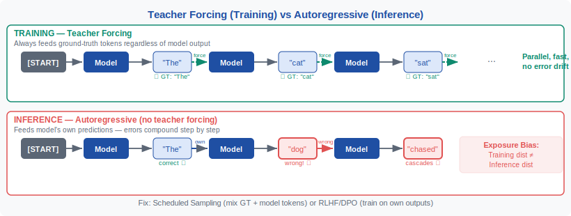
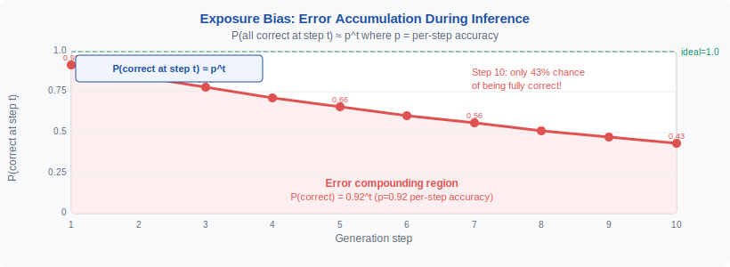
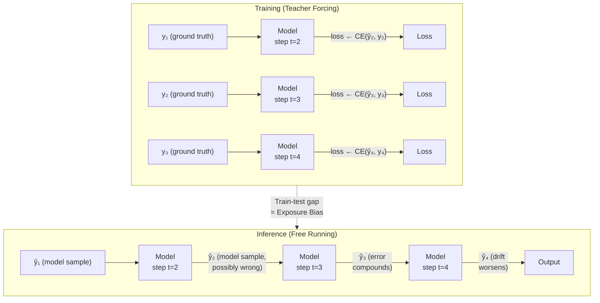
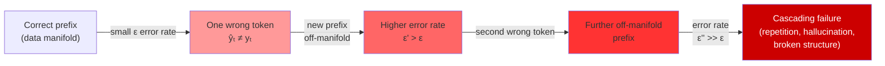

<div align="center">

[🏠 Home](../../README.md) &nbsp;•&nbsp; [📚 Section 1 — Transformer Architecture](./README.md) &nbsp;•&nbsp; [⬅️ Q6 — FFN](./q06-ffn.md) &nbsp;•&nbsp; [Q8 — Causal Masking ➡️](./q08-causal-masking.md)

</div>

# Q7 · Explain teacher forcing in autoregressive training. What is exposure bias and why does it matter?

 &nbsp;


---

> [!IMPORTANT]
> **20-second answer:** Teacher forcing trains an autoregressive model by always feeding the *true* previous token as context, not the model's own prediction. This makes training stable and parallelizable. At inference, however, the model must condition on *its own* generated tokens — if it makes a mistake, the resulting prefix was never seen during training, and errors compound. That train-test mismatch is **exposure bias**. It is most damaging in long-horizon, structured, or safety-critical generation tasks, and is mitigated through scheduled sampling, sequence-level objectives, preference optimization, and robust decoding strategies.

---

## Table of Contents

1. [First Principles: Autoregressive Modeling](#1-first-principles-autoregressive-modeling)
2. [What Is Teacher Forcing?](#2-what-is-teacher-forcing)
3. [Why Teacher Forcing Is Useful](#3-why-teacher-forcing-is-useful)
4. [Training vs Inference: The Key Mismatch](#4-training-vs-inference-the-key-mismatch)
5. [What Is Exposure Bias?](#5-what-is-exposure-bias)
6. [Why Exposure Bias Matters](#6-why-exposure-bias-matters)
7. [Mechanism Diagram](#7-mechanism-diagram)
8. [PyTorch Implementation](#8-pytorch-implementation)
9. [Worked Numerical Example](#9-worked-numerical-example)
10. [Teacher Forcing in Transformers](#10-teacher-forcing-in-transformers)
11. [Teacher Forcing Ratio](#11-teacher-forcing-ratio)
12. [Mitigation Strategies](#12-mitigation-strategies)
13. [Interview-Level Nuances](#13-interview-level-nuances)
14. [Senior-Researcher Framing](#14-senior-researcher-framing)
15. [Common Follow-up Questions](#15-common-follow-up-questions)

---

## 1. First Principles: Autoregressive Modeling

An autoregressive model generates a sequence one element at a time, where each new element is predicted conditioned on all previously generated elements. Given an output sequence $\mathbf{y} = (y_1, y_2, \ldots, y_T)$ and an optional conditioning input $\mathbf{x}$ (a source sentence, image, or prompt), the joint probability factorizes as:

$$
p(\mathbf{y} \mid \mathbf{x}) = \prod_{t=1}^{T} p_\theta(y_t \mid y_{<t}, \mathbf{x})
$$

where $y_{<t} = (y_1, \ldots, y_{t-1})$ is the prefix consumed at step $t$, and $\theta$ are the model parameters. This factorization is exact — no conditional independence approximations are made. Sampling a sequence requires $T$ sequential model evaluations; computing the likelihood of a known sequence requires only one forward pass with a causal mask.

This framework covers a broad swath of modern AI: language modeling (GPT, Llama, Gemini), neural machine translation decoders (Seq2Seq with attention), image captioning (token-by-token caption generation over image features), speech synthesis (WaveNet, VALL-E), code generation (Codex, StarCoder), and music generation (MusicLM). The autoregressive factorization is powerful precisely because it captures arbitrary sequential dependencies without limiting the model to a fixed context window of explicit conditioning.

The training objective is to maximize the log-likelihood of the observed data under this model:

$$
\mathcal{L}(\theta) = \sum_{(\mathbf{x}, \mathbf{y}) \in \mathcal{D}} \sum_{t=1}^{T} \log p_\theta(y_t \mid y_{<t}, \mathbf{x})
$$

Each term in the inner sum is a standard categorical cross-entropy loss between the model's predicted distribution over the vocabulary and a one-hot label for the true token $y_t$. This is maximized stochastically via Adam or similar optimizers over large text corpora.

> [!NOTE]
> The factorization $p(\mathbf{y}) = \prod_t p(y_t \mid y_{<t})$ follows from the chain rule of probability and holds exactly for any joint distribution. Autoregressive models are thus universal density estimators over sequences given sufficient capacity — they make no structural approximation.

---

## 2. What Is Teacher Forcing?

Teacher forcing is a specific training strategy for fitting autoregressive models. At each time step $t$, instead of feeding the model its *own* prediction $\hat{y}_{t-1}$ from the previous step, we feed it the **ground-truth token** $y_{t-1}$ from the training target. The model is then asked to predict $y_t$.



*Figure 1: Training with teacher forcing (top) feeds ground-truth tokens as context at every step. Inference (bottom) feeds the model's own predictions back as context. The boxes in red at inference show how a single wrong prediction contaminates all downstream contexts.*

The name comes from the analogy of a strict teacher who corrects a student's mistakes in real time, preventing error accumulation and ensuring the student always practices with correct examples. Introduced implicitly in early RNN training (Williams & Zipser, 1989) and formalized in the Seq2Seq literature (Sutskever et al., 2014), teacher forcing has remained the default training strategy for virtually all autoregressive models, including modern large language models.

Concretely, during teacher-forced training at step $t$:

1. The model receives the true prefix $(y_1, \ldots, y_{t-1})$ as its input context (shifted by one relative to targets).
2. It produces a distribution $p_\theta(y_t \mid y_{<t}, \mathbf{x})$ over the vocabulary.
3. The cross-entropy loss against the true label $y_t$ is computed and gradients are accumulated.
4. The optimizer updates $\theta$ to assign higher probability to $y_t$.

At no point is the model's own prediction $\hat{y}_{t-1}$ used as context during this process. The training loop is entirely supervised by ground-truth data.

> [!NOTE]
> The contrast with "free-running" or "scheduled sampling" training is important: in free-running mode, the model uses its own predictions as context, which mimics inference but introduces unstable gradients early in training. Teacher forcing is the stable baseline against which all alternatives are compared.

---

## 3. Why Teacher Forcing Is Useful

Teacher forcing has four key properties that make it the dominant training strategy for autoregressive models, especially at scale.

**Stable gradient signal.** Because the context at each step is always a clean ground-truth prefix, the loss at step $t$ is independent of prediction errors at steps $1, \ldots, t-1$. Gradients are not corrupted by compounding prediction errors — a particularly important property early in training when the model makes frequent mistakes. Without teacher forcing, a bad prediction at $t=2$ would corrupt the context at $t=3$, and the resulting high loss would produce noisy, unhelpful gradient estimates.

**Parallel training efficiency in Transformers.** Since the entire gold target sequence is known ahead of time, all positions can be trained in a single forward pass. In Transformer architectures, teacher forcing with a causal (lower-triangular) attention mask allows position $t$ to attend to positions $1, \ldots, t-1$ of the shifted ground-truth sequence simultaneously. This is why Transformer LLMs can be trained on sequences of thousands of tokens with only $O(1)$ sequential compute steps — a massive advantage over RNNs that would require $T$ sequential steps even without teacher forcing.

**Maximum likelihood objective alignment.** Teacher forcing directly optimizes the per-step conditional log-likelihood $\log p_\theta(y_t \mid y_{<t}, \mathbf{x})$ under the empirical data distribution. This is mathematically clean: we are fitting the model to exactly the distribution we want it to represent. The objective has well-understood convergence properties, and the gradient is unbiased under the data distribution.

**Scalability and empirical success.** The most capable language models in existence — GPT-4, Claude, Gemini, Llama — are all trained with teacher-forced next-token prediction. This is not a coincidence: teacher forcing is robust to scale, benefits from larger datasets and models, and is computationally feasible on modern hardware through parallelism.

| Property | Teacher Forcing | Free-Running |
|---|---|---|
| Training stability | ✅ Clean gradients | ❌ Noisy, error-compounded |
| Transformer parallelism | ✅ Full (causal mask) | ❌ Requires sequential rollout |
| MLE objective alignment | ✅ Exact | ❌ Distribution mismatch |
| Inference fidelity | ❌ Mismatch (exposure bias) | ✅ Matches inference |
| Scales to large models | ✅ Yes | ❌ Unstable at scale |

---

## 4. Training vs Inference: The Key Mismatch

The central tension in autoregressive training is that the training procedure and the inference procedure differ in a fundamental way.

**During training**, the model conditions on ground-truth prefixes drawn from the data distribution $p_{\text{data}}(y_{<t})$. These are clean, coherent, human-generated text segments that lie on the manifold of natural language (or code, or music, etc.).

**During inference**, the model conditions on its own previously generated tokens — samples from $p_\theta(y_{<t})$. Unless the model is perfect, $p_\theta(y_{<t}) \neq p_{\text{data}}(y_{<t})$. The model is being asked to continue from prefixes it was never trained on.

This is a form of **distribution shift** — one of the most well-studied failure modes in machine learning. The model is deployed in a covariate regime that differs from its training regime. Unlike standard covariate shift where the input features change, here the shift is *endogenous*: the model's own imperfection creates the distributional gap it must then operate in.



*Figure 2: At training time, the model always operates on the data manifold (green). At inference, each prediction error moves the prefix slightly off-manifold (orange). Over many steps, the prefix can drift far from any training context, dramatically increasing error rates.*

The gap between the training distribution and inference distribution grows with sequence length. For a model with per-step error rate $\epsilon$, after $T$ steps the expected number of errors is $T\epsilon$. But because errors are not independent — one error makes subsequent errors more likely — the actual degradation is superlinear. Specifically, if each error multiplies the next-step error rate by a factor $\alpha > 1$, the compounding effect grows exponentially: $\epsilon_t \approx \epsilon \cdot \alpha^{t-1}$.

---

## 5. What Is Exposure Bias?

Exposure bias (Bengio et al., 2015) is the name for the train-test discrepancy described above. The word *exposure* is key: it refers to the set of contexts the model has been *exposed to* during training. Under teacher forcing, the model is exposed almost exclusively to ground-truth prefixes. At test time, it must handle its own generated prefixes, which it has little or no training exposure to.

Formally, let $q_t^\theta$ denote the distribution of prefixes actually encountered at step $t$ during inference (a mixture of ground-truth tokens and model predictions), and let $p_{\text{data}}$ denote the training distribution of prefixes. Exposure bias exists because:

$$
q_t^\theta \neq p_{\text{data}} \quad \text{for all } t > 1
$$

The divergence $D_{\text{KL}}(q_t^\theta \| p_{\text{data}})$ grows with $t$ and with model error rate. For a perfect model, the two distributions would coincide and there would be no exposure bias; for all real models, some gap exists.

Exposure bias is not unique to teacher forcing — it is a property of any training scheme that uses ground-truth supervision for prefix conditioning. It is aggravated by teacher forcing (which uses 100% ground-truth prefixes) and reduced by scheduled sampling or REINFORCE (which use some model-generated prefixes), but not eliminated entirely by any practical training scheme short of exact policy optimization against the generation distribution.

> [!WARNING]
> Exposure bias is sometimes conflated with **hallucination**. They are related but distinct. Exposure bias refers to a distributional mismatch in the conditioning context. Hallucination refers to the model generating factually incorrect or unsupported content. Exposure bias *can contribute* to hallucination (wrong early tokens push the model into contexts where hallucination is more likely), but hallucination also arises from gaps in pretraining data, weak grounding, poor reward modeling, and decoding artifacts.

---

## 6. Why Exposure Bias Matters

Exposure bias has practical consequences across the full range of autoregressive generation tasks.

**Error accumulation.** A single wrong token changes the prefix for all subsequent steps. If the model generates "The dog" instead of "The cat" at position 2, every subsequent prediction must now make sense given "The dog ...", a prefix that may be far less frequent in training data than "The cat ...". The model is less calibrated for this context, so subsequent errors are more probable. This creates a cascade: errors breed more errors.

**Distribution shift at inference time.** As the model generates longer sequences, the accumulated prefix drifts further from the training distribution. Concretely, the model may encounter token combinations at inference that appeared rarely or never in training. Its predictions for such out-of-distribution contexts are unreliable — it has not learned a robust response to those states because it was never trained on them.

**Long-horizon degradation.** For short sequences (3–5 tokens), exposure bias has minimal impact because there are few opportunities to compound errors. For long-horizon generation (paragraphs, stories, long code files, multi-turn dialogue), the degradation becomes severe. Modern LLMs trained on short context windows often generate incoherent long-form text partly due to this mechanism.

**Decoding sensitivity.** Different decoding strategies expose different facets of the problem. Greedy decoding exacerbates exposure bias because every mistake is immediately incorporated. Beam search explores multiple prefixes but the model was trained on none of them. Nucleus sampling (Holtzman et al., 2020) reduces repetitive degeneration but does not fix the fundamental distributional gap. Temperature scaling changes the error rate per step but not the compounding mechanism.

**Safety and reliability implications.** In production dialogue systems, a small early factual error can snowball into a hallucinated explanation as the model tries to make the subsequent generation consistent with the error. In code generation, a wrong variable type at line 5 can propagate through the rest of the function. In safety-critical domains (medical advice, legal text, financial planning), such cascades are especially costly.

> [!IMPORTANT]
> Exposure bias is not equally severe across all tasks. For classification-style sequence generation (short answers, single-sentence translation), it may be negligible. For interactive multi-turn dialogue, long-form story generation, mathematical proof writing, or agentic code execution, it is a first-order concern.

---

## 7. Mechanism Diagram

The following Mermaid diagram contrasts the feedback loops during teacher-forced training versus free-running inference.



The diagram makes the asymmetry explicit: training always resets the context to a ground-truth prefix before each step (no feedback of model errors), while inference chains model predictions into future context with no reset mechanism.

A second Mermaid diagram illustrates how a single early error propagates through the error-accumulation mechanism:



---

## 8. PyTorch Implementation

The following code implements both teacher-forced training and free-running inference for a simple Transformer language model, with commentary on where exposure bias is introduced.

```python
import torch
import torch.nn as nn
import torch.nn.functional as F
from torch import Tensor
from typing import Optional


class AutoregressiveLM(nn.Module):
    """Minimal causal Transformer language model demonstrating teacher forcing."""

    def __init__(
        self,
        vocab_size: int,
        d_model: int = 256,
        n_heads: int = 4,
        n_layers: int = 4,
        max_seq_len: int = 512,
        dropout: float = 0.1,
    ) -> None:
        super().__init__()
        self.d_model = d_model
        self.vocab_size = vocab_size

        self.token_emb = nn.Embedding(vocab_size, d_model)
        self.pos_emb = nn.Embedding(max_seq_len, d_model)
        self.dropout = nn.Dropout(dropout)

        decoder_layer = nn.TransformerDecoderLayer(
            d_model=d_model,
            nhead=n_heads,
            dim_feedforward=d_model * 4,
            dropout=dropout,
            batch_first=True,
        )
        self.transformer = nn.TransformerDecoder(decoder_layer, num_layers=n_layers)
        self.lm_head = nn.Linear(d_model, vocab_size)

        # Register causal mask buffer (reused across forward calls for efficiency)
        self._register_causal_mask(max_seq_len)

    def _register_causal_mask(self, max_len: int) -> None:
        # Upper-triangular mask: position i cannot attend to j > i
        mask = torch.triu(torch.ones(max_len, max_len), diagonal=1).bool()
        self.register_buffer("causal_mask", mask)

    def forward(self, input_ids: Tensor) -> Tensor:
        """
        Teacher-forced forward pass: all positions trained in parallel.

        Args:
            input_ids: (batch, seq_len) — the *input* sequence (shifted targets).
                       For LM training this is targets[:-1]; the model predicts targets[1:].

        Returns:
            logits: (batch, seq_len, vocab_size)
        """
        B, T = input_ids.shape
        positions = torch.arange(T, device=input_ids.device).unsqueeze(0)  # (1, T)

        # Embed tokens + positions
        x = self.dropout(self.token_emb(input_ids) + self.pos_emb(positions))

        # Causal self-attention: position t can only see positions <= t
        causal_mask = self.causal_mask[:T, :T]  # (T, T)

        # For a decoder-only LM we pass x as both tgt and memory with causal mask
        out = self.transformer(tgt=x, memory=x, tgt_mask=causal_mask)
        logits = self.lm_head(out)  # (B, T, vocab_size)
        return logits


def teacher_forced_loss(
    model: AutoregressiveLM,
    input_ids: Tensor,
    pad_id: int = 0,
) -> Tensor:
    """
    Compute teacher-forced cross-entropy loss over a batch of sequences.

    The input to the model is tokens[:-1] (the "teacher" context),
    and the targets are tokens[1:] (the next true tokens).
    This is the standard language modeling setup — the model never sees
    its own predictions during this computation.

    Args:
        model: AutoregressiveLM instance
        input_ids: (batch, seq_len) token IDs including BOS/EOS
        pad_id: token ID to ignore in loss computation

    Returns:
        Scalar cross-entropy loss
    """
    # ---- Teacher forcing: context = true tokens[0..T-2], labels = true tokens[1..T-1] ----
    context = input_ids[:, :-1]  # (B, T-1) — fed as input (ground truth context)
    labels = input_ids[:, 1:]    # (B, T-1) — prediction targets

    # Single parallel forward pass — NO model predictions are fed back as context
    logits = model(context)      # (B, T-1, vocab)

    # Compute per-token cross-entropy, ignoring padding
    loss = F.cross_entropy(
        logits.reshape(-1, model.vocab_size),
        labels.reshape(-1),
        ignore_index=pad_id,
    )
    return loss


@torch.no_grad()
def free_running_generate(
    model: AutoregressiveLM,
    prompt_ids: Tensor,
    max_new_tokens: int = 50,
    temperature: float = 1.0,
    top_p: float = 0.9,
    eos_id: Optional[int] = None,
) -> Tensor:
    """
    Autoregressive inference — this is where exposure bias manifests.

    At each step, the model's OWN previous prediction is fed back as context.
    If any prediction is wrong, all subsequent steps condition on an
    out-of-training-distribution prefix.

    Args:
        model: trained AutoregressiveLM
        prompt_ids: (1, prompt_len) initial context
        max_new_tokens: number of tokens to generate
        temperature: sampling temperature (1.0 = standard, <1 = sharper)
        top_p: nucleus sampling threshold
        eos_id: if provided, stop generation when sampled

    Returns:
        generated_ids: (1, prompt_len + generated_len)
    """
    model.eval()
    generated = prompt_ids.clone()  # starts as ground-truth prompt

    for step in range(max_new_tokens):
        # KEY DIFFERENCE FROM TRAINING: context is model-generated (not ground truth)
        # This is the source of exposure bias.
        logits = model(generated)          # (1, current_len, vocab)
        next_logits = logits[:, -1, :]     # (1, vocab) — last position only

        # Apply temperature scaling
        next_logits = next_logits / temperature

        # Nucleus (top-p) sampling to avoid degeneration (Holtzman et al., 2020)
        probs = F.softmax(next_logits, dim=-1)
        sorted_probs, sorted_indices = torch.sort(probs, descending=True)
        cumulative_probs = torch.cumsum(sorted_probs, dim=-1)
        # Remove tokens with cumulative probability above top_p threshold
        sorted_probs[cumulative_probs - sorted_probs > top_p] = 0.0
        sorted_probs /= sorted_probs.sum(dim=-1, keepdim=True)
        next_token_sorted = torch.multinomial(sorted_probs, num_samples=1)
        next_token = sorted_indices.gather(dim=-1, index=next_token_sorted)  # (1, 1)

        # Feed model's own prediction back — this is the exposure bias feedback loop
        generated = torch.cat([generated, next_token], dim=1)

        if eos_id is not None and next_token.item() == eos_id:
            break

    return generated


# ---- Scheduled Sampling: a partial mitigation ----

def scheduled_sampling_loss(
    model: AutoregressiveLM,
    input_ids: Tensor,
    teacher_forcing_ratio: float,
    pad_id: int = 0,
) -> Tensor:
    """
    Mixed training: at each step, feed ground-truth token with probability
    `teacher_forcing_ratio`, and model's own argmax prediction with probability
    1 - teacher_forcing_ratio.

    Annealing teacher_forcing_ratio from 1.0 -> 0.0 over training is the
    original Bengio et al. (2015) scheduled sampling recipe.

    NOTE: This breaks Transformer parallelism — requires a sequential loop.
    """
    B, T = input_ids.shape
    total_loss = torch.tensor(0.0, device=input_ids.device)
    context = input_ids[:, :1]  # start with first token (e.g. BOS)

    for t in range(1, T):
        logits = model(context)              # (B, context_len, vocab)
        next_logits = logits[:, -1, :]       # (B, vocab)

        # Compute loss against ground truth
        target = input_ids[:, t]             # (B,)
        step_loss = F.cross_entropy(next_logits, target, ignore_index=pad_id)
        total_loss = total_loss + step_loss

        # Decide whether to use ground-truth or model prediction as next context
        if torch.rand(1).item() < teacher_forcing_ratio:
            next_token = input_ids[:, t:t+1]     # ground truth (teacher forcing)
        else:
            next_token = next_logits.argmax(-1, keepdim=True)  # model prediction

        context = torch.cat([context, next_token], dim=1)

    return total_loss / (T - 1)
```

> [!TIP]
> The key architectural insight: `teacher_forced_loss` uses a single parallel forward pass because all ground-truth tokens are available simultaneously. `scheduled_sampling_loss` requires a sequential loop (one step at a time) because each step's input depends on the previous step's output. This is why scheduled sampling has not been widely adopted for large Transformer LLMs — it is orders of magnitude slower to train.

---

## 9. Worked Numerical Example

This example traces the probability mass assigned to correct continuations at each step under teacher forcing versus free-running inference, to show numerically how exposure bias causes degradation.

**Setup.** We have a 4-token vocabulary: `{cat, dog, sat, mat}` (indices 0–3). The target sentence is `"cat sat mat"`. We use a toy trained model and track conditional probabilities.

**Step 1 — Predicting "sat" given "cat"**

| Context (prefix) | Source | $p(\text{sat} \mid \cdot)$ | Correct? |
|---|---|---|---|
| "cat" (ground truth) | Training prefix | **0.82** | ✅ |
| "cat" (model sample) | Inference prefix | **0.82** | Same — step 1 is always ground truth |

No divergence at step 1 since the prompt is identical.

**Step 2 — Predicting "mat" given previous**

Assume the model assigned: $p(\text{sat} \mid \text{cat}) = 0.82$ so it samples "sat" with probability 0.82 and "dog" with probability 0.18.

| Context (prefix) | Source | $p(\text{mat} \mid \cdot)$ |
|---|---|---|
| "cat sat" (ground truth) | Teacher forcing | **0.79** |
| "cat sat" (model sampled "sat") | Inference, correct sample | **0.79** |
| "cat dog" (model sampled "dog") | Inference, incorrect sample | **0.21** |

**Expected probability under inference** at step 2:

$$
\mathbb{E}[p(\text{mat} \mid \hat{y}_{1:2})] = 0.82 \times 0.79 + 0.18 \times 0.21 = 0.648 + 0.038 = \mathbf{0.686}
$$

Under teacher forcing, the probability is always 0.79. Under free-running inference, the **expected** probability is already degraded to 0.686 — a 13% relative drop after just one step.

**Step 3 — Predicting EOS given the full prefix**

Now compound across a 3-step sequence. Let $\epsilon_t$ be the per-step error probability under inference.

| Step | TF prob (correct) | Inference expected prob | Cumulative TF | Cumulative Inference |
|---|---|---|---|---|
| $t=1$ | 0.82 | 0.82 | 0.820 | 0.820 |
| $t=2$ | 0.79 | 0.686 | 0.648 | 0.562 |
| $t=3$ | 0.75 | 0.601 | 0.486 | 0.338 |

The probability of generating the entire correct sequence under teacher forcing is $0.82 \times 0.79 \times 0.75 = 0.486$. Under free-running inference, it drops to approximately $0.820 \times 0.686 \times 0.601 = 0.338$ — a **30% relative degradation** over just 3 steps.

**Key observation:** For a 100-token sentence with per-step error rate $\epsilon = 0.10$ and error amplification factor $\alpha = 1.2$:

- Teacher-forcing perplexity per token: approximately constant at $e^{H}$ where $H$ is the true per-token entropy.
- Free-running expected per-token error rate at step $t$: $\epsilon_t \approx 0.10 \times 1.2^{t-1}$

At $t = 20$: $\epsilon_{20} \approx 0.10 \times 1.2^{19} \approx 0.10 \times 31.9 \approx 3.19$ — the expected error rate exceeds 1.0, meaning essentially random output. This illustrates why long-horizon generation degrades dramatically even with modest per-step errors.

> [!WARNING]
> These numbers are illustrative rather than empirical measurements from real models. Real compounding behavior depends on model capacity, vocabulary size, domain, and temperature. The point is the *mechanism* — compounding is multiplicative, making long sequences disproportionately affected.

---

## 10. Teacher Forcing in Transformers

The Transformer architecture (Vaswani et al., 2017) makes teacher forcing especially clean and efficient to implement. Because self-attention is permutation-equivariant without masking, causal language modeling requires adding an explicit mask to prevent position $t$ from attending to positions $> t$.

**Causal mask construction.** For a sequence of length $T$, the causal mask $M \in \{0, -\infty\}^{T \times T}$ is:

$$
M_{ij} = \begin{cases} 0 & \text{if } j \leq i \\ -\infty & \text{if } j > i \end{cases}
$$

This mask is added to the attention logits before softmax, setting future-attending weights to zero. The resulting attention pattern is strictly lower-triangular: position $t$ attends only to positions $1, \ldots, t$.

**Parallel training.** With the causal mask in place, all $T$ positions in a sequence can be trained in a single forward pass. Position $t$ sees the true tokens at positions $1, \ldots, t-1$ (teacher forcing) and is trained to predict position $t$. This is equivalent to running $T$ separate teacher-forced training steps but with shared computation — the Transformer's attention mechanism amortizes the computation across positions.

**GPT training recipe.** In GPT-style models, the training batch consists of random windows of text from the corpus. For a window $(x_1, \ldots, x_T)$:

- Input to the model: $(x_1, \ldots, x_{T-1})$ (shifted right — the "teacher context")
- Targets: $(x_2, \ldots, x_T)$ (shifted left — the "teacher labels")
- Loss: mean cross-entropy over all positions

```
Input:   [BOS]  The   cat   sat   on   the   [EOS]
          ↓     ↓     ↓     ↓     ↓    ↓
Predict:  The   cat   sat   on    the  [EOS]
```

Every position is simultaneously a student (predicting its own target) and a teacher (providing context for the position to its right). This elegant structure is why teacher forcing at Transformer scale is so efficient.

> [!NOTE]
> In encoder-decoder Transformers (T5, BART, original Seq2Seq), teacher forcing applies specifically to the decoder. The encoder processes the full source sequence bidirectionally without masking. The decoder's cross-attention to the encoder output is unrestricted; only the decoder's self-attention uses the causal mask to enforce teacher forcing.

---

## 11. Teacher Forcing Ratio

In classic RNN encoder-decoder training, practitioners introduced the concept of a **teacher forcing ratio** $p_{\text{tf}} \in [0, 1]$: the probability of feeding the ground-truth previous token rather than the model's own prediction at each step.

- $p_{\text{tf}} = 1.0$: pure teacher forcing — always feed ground truth.
- $p_{\text{tf}} = 0.0$: pure free-running — always feed model's own prediction.
- $0 < p_{\text{tf}} < 1$: mixed (the basis of scheduled sampling).

**Annealing schedules.** Bengio et al. (2015) proposed decaying $p_{\text{tf}}$ from 1.0 to a lower value over training. Common annealing schedules:

| Schedule | Formula | Behavior |
|---|---|---|
| Linear | $p_{\text{tf}}(k) = \max(0, 1 - \delta k)$ | Constant decay per step $k$ |
| Exponential | $p_{\text{tf}}(k) = \mu^k$ for $\mu \in (0,1)$ | Fast initial decay, slow tail |
| Inverse sigmoid | $p_{\text{tf}}(k) = \sigma(-k + c)$ | Slow decay near start and end, fast middle |

The intuition: early in training, the model is poor and free-running creates very noisy contexts. As the model improves, gradually introducing its own predictions bridges the gap to inference conditions.

**Why this is not widely used for LLMs.** For Transformer LLMs, the teacher forcing ratio is conceptually applicable but computationally problematic. Scheduled sampling requires a sequential decoding loop, breaking the parallel training that makes Transformer training scalable. Training a 70B parameter model sequentially is infeasible. Modern LLMs instead address exposure bias at fine-tuning time through instruction tuning and preference optimization, leaving the pretraining phase as pure teacher forcing.

---

## 12. Mitigation Strategies

Multiple strategies exist to reduce or compensate for exposure bias. They vary in computational cost, principled motivation, and empirical effectiveness.

| Strategy | Core Idea | Exposure Bias Reduction | Training Cost | Notes |
|---|---|---|---|---|
| **Teacher Forcing (baseline)** | Always feed ground truth | ❌ None — creates the bias | Low (fully parallel) | Standard for pretraining |
| **Scheduled Sampling** (Bengio et al., 2015) | Gradually replace GT with model predictions | ✅ Partial | High (sequential loop) | Breaks parallel training |
| **DAgger** (Ross et al., 2011) | Aggregate datasets from current policy | ✅ Strong (theory) | High (requires rollouts) | Imitation learning framing |
| **REINFORCE / SCST** (Ranzato et al., 2016) | Sequence-level reward, policy gradient | ✅ Strong | Very high (high variance) | Optimizes BLEU/ROUGE directly |
| **Professor Forcing** (Lamb et al., 2016) | Adversarially match training/inference hidden states | ✅ Moderate | High (adversarial) | Uses GAN-style discriminator |
| **RLHF / PPO** | Human preference reward, RL fine-tuning | ✅ Partial (side effect) | Very high | Standard for aligned LLMs |
| **DPO / IPO** | Direct preference optimization | ✅ Partial | Moderate | Simpler than PPO |
| **Minimum Risk Training** | Minimize expected sequence-level loss | ✅ Strong | High | Used in MT |
| **Noise-Robust Pretraining** | Train with corrupted input prefixes | ✅ Indirect | Low overhead | BERT-style denoising for AR |
| **Retrieval Augmentation (RAG)** | Ground generation in retrieved context | ✅ Indirect (reduces drift) | Inference-time cost | Does not fix bias, limits damage |
| **Reranking / Best-of-N** | Generate $N$ candidates, select best | ✅ Indirect | $N\times$ inference cost | Effective in practice |
| **Better decoding (nucleus, beam)** | Reduce per-step errors | ✅ Indirect | None at training | Addresses symptoms, not cause |

**DAgger in detail.** Dataset Aggregation (Ross et al., 2011) provides the strongest theoretical guarantee. The algorithm:

1. Train model $\hat{\pi}_1$ on expert data $\mathcal{D}_1 = \mathcal{D}$.
2. Roll out $\hat{\pi}_1$ to collect visited states $\mathcal{S}_1$.
3. Query the expert for the correct action at each visited state to get $\mathcal{D}_1'$.
4. Aggregate: $\mathcal{D}_2 = \mathcal{D}_1 \cup \mathcal{D}_1'$.
5. Retrain on $\mathcal{D}_2$. Repeat.

DAgger converges to a model that trains on the states it actually visits at inference time, eliminating distributional shift. For language, the "expert" would need to provide the optimal continuation from any model-generated prefix — expensive but principled.

**RLHF in detail.** Reinforcement learning from human feedback (as used in InstructGPT, Claude, Gemini) does not directly target exposure bias but substantially mitigates its practical impact. By fine-tuning with PPO against a learned reward model, the model receives gradient signal from *rollout* sequences — its own generated text — which is precisely the distribution it sees at inference. This closes the distributional gap at the fine-tuning stage even if the pretraining stage used teacher forcing.

> [!TIP]
> In practice, the most effective deployment strategy combines teacher-forced pretraining (for efficient, scalable learning) + instruction fine-tuning (for task alignment) + preference optimization (for behavioral quality and safety) + inference-time reranking or verification (to catch residual errors). No single technique is sufficient; the stack is complementary.

---

## 13. Interview-Level Nuances

These are the distinctions that separate a junior explanation from a senior-researcher answer.

**Do not say teacher forcing is bad.** Teacher forcing is the backbone of scalable autoregressive learning. Every state-of-the-art LLM is pretrained with teacher forcing. The point is that it is an approximation — powerful and efficient, but with a known limitation (exposure bias) that requires targeted mitigation.

**Exposure bias is not the only problem with autoregressive generation.** Other challenges include: repetition and degeneration (Holtzman et al., 2020), length bias in beam search, mode collapse in sampling, and reward-model gaming in RLHF. Teacher forcing creates exposure bias specifically; the others have different causes.

**Scheduled sampling does not fix the problem cleanly.** It introduces model-generated prefixes into training but also changes the training distribution in ways that break the clean MLE interpretation. Gradients through model-generated tokens are biased because the model's sampling procedure is typically non-differentiable (argmax or sampling). In practice, scheduled sampling helps empirically but does not converge to the optimal policy in theory without care.

**RLHF is not primarily a fix for exposure bias.** It is primarily a method for aligning model behavior with human preferences. The fact that it involves rollouts (model-generated sequences) is a side benefit that partially closes the distributional gap, but this is incidental to its primary purpose.

**Token-level metrics are insufficient.** Perplexity and cross-entropy measure the quality of one-step predictions from ground-truth prefixes — the teacher-forcing objective. They do not measure how well the model generates coherent sequences under its own rollout. A model can have low perplexity and still produce incoherent long-form text due to exposure bias. Always evaluate with sequence-level metrics (BLEU, ROUGE, human evaluation, reward model scores) in addition to perplexity.

**Capacity and scale matter.** Exposure bias is empirically less severe in large, well-trained models because they make fewer per-step errors, so the compounding mechanism has less to work with. GPT-4 and Claude 3 still exhibit exposure bias, but its effects are less visible on standard benchmarks than in smaller models. This creates a false impression that the problem is "solved" — it is merely masked by reduced per-step error rates.

| Misconception | Reality |
|---|---|
| ❌ Teacher forcing is a flawed training strategy | ✅ It is the best-known scalable strategy; exposure bias is a fundamental train-test mismatch |
| ❌ Beam search solves exposure bias | ✅ Beam search improves decoding but the model still never trained on beam-search prefixes |
| ❌ RLHF directly fixes exposure bias | ✅ RLHF fixes alignment and has rollout side benefits, but is not primarily an exposure bias fix |
| ❌ Large models do not have exposure bias | ✅ Larger models have lower per-step error rates, so compounding is slower, but the bias exists |
| ❌ Perplexity measures generation quality | ✅ Perplexity measures teacher-forced likelihood; generation quality requires sequence-level evaluation |
| ❌ Exposure bias = hallucination | ✅ Exposure bias can contribute to hallucination, but hallucination has multiple independent causes |

---

## 14. Senior-Researcher Framing

At the research level, teacher forcing and exposure bias connect to fundamental questions in the theory of learning and sequential decision-making.

**Autoregressive training as imitation learning.** The connection to imitation learning (specifically behavioral cloning) is precise. Teacher forcing is behavioral cloning: training a policy $\hat{\pi}$ to imitate an expert policy $\pi^*$ (the human-generated text) from expert state-action pairs. The DAgger result (Ross et al., 2011) proves that behavioral cloning incurs a compounding error of $O(T^2 \epsilon)$ after $T$ steps, while DAgger reduces this to $O(T \epsilon)$. Language models trained with teacher forcing are subject to the $O(T^2 \epsilon)$ bound in the worst case.

**Connection to distribution shift and domain adaptation.** Exposure bias is a specific, endogenous form of covariate shift — endogenous because the model creates the shift through its own prediction errors. Unlike standard domain adaptation (where source and target distributions are fixed), here the target distribution depends on the model itself, creating a moving-target problem. Improving the model reduces the distributional gap, which is a virtuous cycle if training can exploit rollout data (RLHF) but a blind spot if it cannot (teacher forcing).

**Sequence-level versus token-level objectives.** Maximum-likelihood training with teacher forcing optimizes token-level objectives: each token prediction is evaluated independently given a ground-truth prefix. But generation quality is a sequence-level property — we care about whether the full output is coherent, factual, and helpful. The gap between token-level and sequence-level objectives is not merely a matter of exposure bias; it also includes metric mismatch (cross-entropy is not BLEU, ROUGE, or human preference). Minimum Risk Training (Shen et al., 2016) and REINFORCE (Ranzato et al., 2016) target this gap directly at the cost of high training variance.

**Why teacher forcing still wins at scale.** Given the above, why does teacher forcing dominate pretraining? Three reasons: (1) Parallelism — Transformers trained with teacher forcing can exploit all tokens in a sequence simultaneously, making training $T\times$ faster than sequential alternatives. (2) Stability — at the scale of trillions of tokens, noisy gradient methods (REINFORCE, scheduled sampling) are difficult to stabilize and tune. (3) Empirical results — teacher-forced pretraining followed by preference optimization produces models that are competitive on all benchmarks, suggesting the combination is near-optimal given practical constraints.

The research frontier involves better integration of generation-quality signals into pretraining — process reward models, online DPO, speculative sampling with verification — all of which attempt to close the exposure bias gap without sacrificing the parallelism that makes large-scale training feasible.

---

## 15. Common Follow-up Questions

<details>
<summary><strong>Q: Is exposure bias the same as hallucination?</strong></summary>

No. Exposure bias is a specific distributional mismatch: the model trains on ground-truth prefixes but infers on its own generated prefixes. Hallucination is the phenomenon of the model generating factually incorrect, unsupported, or inconsistent content.

The two are related: exposure bias can *contribute* to hallucination because a wrong early token pushes the model into a prefix context that was rare during training, making subsequent predictions less reliable and more likely to be factually inconsistent. However, hallucination also arises from: gaps and errors in pretraining data, lack of retrieval/grounding, poor reward model alignment, overconfident sampling, and training on text that itself contains hallucinated content. Fixing exposure bias would not eliminate hallucination.

</details>

<details>
<summary><strong>Q: Why not train exactly as we generate (fully free-running)?</strong></summary>

Two main reasons. First, early in training the model is poor — its own predictions are near-random, so free-running produces extremely noisy, unstable contexts. Training on these noisy contexts makes credit assignment very hard: when the model generates a wrong token at step 20, is it because of a fundamental modeling failure, or just the accumulated noise from 19 previous bad predictions? Teacher forcing isolates each step's prediction as an independent problem, which is much easier to learn from.

Second, free-running training breaks Transformer parallelism. If each step's input depends on the previous step's output, we cannot process all positions in parallel — training becomes $T\times$ slower. For a 4096-token sequence, this would be a 4000x slowdown. At the scale of modern LLM pretraining (trillions of tokens), this is simply not feasible.

</details>

<details>
<summary><strong>Q: Does beam search solve exposure bias?</strong></summary>

No. Beam search is a decoding algorithm that explores multiple candidate continuations simultaneously, keeping the top-$k$ beams by cumulative log-probability. It can reduce per-step local errors by considering alternatives, but it does not address the fundamental distributional mismatch.

The model was trained with teacher forcing on ground-truth prefixes. Beam search generates prefixes that are combinations of the model's top predictions — none of which were ground-truth prefixes during training. The model is still operating in a regime it was not trained on; beam search just navigates that regime more carefully. Beam search also introduces its own artifacts: length bias (short sequences tend to have higher average log-prob), generic/repetitive outputs, and poor diversity.

</details>

<details>
<summary><strong>Q: Is teacher forcing used in GPT-style models?</strong></summary>

Yes, universally. GPT-style models are trained with causal next-token prediction on ground-truth text. The training input is the sequence shifted right relative to the labels (or equivalently, the labels are the input shifted left). A causal attention mask prevents any position from attending to future positions. This is teacher forcing: the model predicts token $t$ given the ground-truth tokens $1, \ldots, t-1$.

This applies to GPT-2, GPT-3, GPT-4, LLaMA, Mistral, Falcon, Claude's pretraining phase, Gemini, and all other major autoregressive LLMs. Teacher forcing is not a design choice being debated for these systems — it is the definitional training procedure.

</details>

<details>
<summary><strong>Q: What is the difference between exposure bias and covariate shift?</strong></summary>

Covariate shift is the general phenomenon where the distribution of input features $P(X)$ differs between training and test time, while the conditional distribution $P(Y \mid X)$ is assumed constant. Exposure bias is a specific instance of covariate shift in autoregressive generation: the "input" to each step's prediction is the prefix $y_{<t}$, and the distribution of prefixes differs between training ($P_{\text{data}}(y_{<t})$) and inference ($P_\theta(y_{<t})$).

What makes exposure bias distinctive is its *endogenous* nature: the distributional gap is caused by the model's own imperfection, not by an external shift in the deployment environment. This means the gap shrinks as the model improves, creating a feedback dynamic absent in standard covariate shift settings.

</details>

<details>
<summary><strong>Q: When is exposure bias most severe?</strong></summary>

Severity is determined by the product of: (1) per-step error rate, (2) error amplification factor, and (3) sequence length. The following conditions maximize all three:

- **Long sequences**: more compounding steps, more opportunities for errors to build.
- **Low-resource settings**: less training data means higher per-step error rates.
- **Brittle structured outputs**: code, formal proofs, structured data — where a single wrong token can make the entire output invalid.
- **Irreversible early decisions**: generating a hallucinated premise early in an explanation makes it hard to recover even with good later predictions.
- **Small model capacity**: models with limited capacity have higher base error rates.
- **Adversarial or out-of-distribution prompts**: prompts that push generation toward less common linguistic territory.
- **High-temperature or diverse sampling**: higher randomness increases per-step error rate.

</details>

<details>
<summary><strong>Q: How does RLHF interact with exposure bias?</strong></summary>

RLHF (Reinforcement Learning from Human Feedback) involves fine-tuning the model using rollouts — the model's own generated sequences are scored by a reward model trained on human preferences, and the model is updated via PPO to maximize expected reward.

Because rollouts involve the model generating from its own prefixes, RLHF training partially closes the distributional gap that teacher forcing creates: the model now receives gradient signal from the actual inference-time distribution it will encounter. This is a side benefit of RLHF beyond its primary purpose (alignment with human preferences).

However, RLHF introduces its own issues: reward hacking (optimizing the reward model rather than true quality), mode collapse toward high-reward outputs, and KL divergence regularization that limits how far the model can move from the teacher-forced pretraining baseline. It partially mitigates exposure bias but does not eliminate it.

</details>

---

## References

1. Williams, R. J., & Zipser, D. (1989). A Learning Algorithm for Continually Running Fully Recurrent Neural Networks. *Neural Computation*, 1(2).

2. Sutskever, I., Vinyals, O., & Le, Q. V. (2014). Sequence to Sequence Learning with Neural Networks. *NeurIPS*.

3. Bahdanau, D., Cho, K., & Bengio, Y. (2015). Neural Machine Translation by Jointly Learning to Align and Translate. *ICLR*.

4. Bengio, S., Vinyals, O., Jaitly, N., & Shazeer, N. (2015). Scheduled Sampling for Sequence Prediction with Recurrent Neural Networks. *NeurIPS*.

5. Ross, S., Gordon, G., & Bagnell, D. (2011). A Reduction of Imitation Learning and Structured Prediction to No-Regret Online Learning. *AISTATS*.

6. Ranzato, M., Chopra, S., Auli, M., & Zaremba, W. (2016). Sequence Level Training with Recurrent Neural Networks. *ICLR*.

7. Lamb, A. M., Goyal, A. G. A. P., Zhang, Y., Zhang, S., Courville, A., & Bengio, Y. (2016). Professor Forcing: A New Algorithm for Training Recurrent Networks. *NeurIPS*.

8. Vaswani, A., Shazeer, N., Parmar, N., Uszkoreit, J., Jones, L., Gomez, A. N., Kaiser, L., & Polosukhin, I. (2017). Attention Is All You Need. *NeurIPS*.

9. Holtzman, A., Buys, J., Du, L., Forbes, M., & Choi, Y. (2020). The Curious Case of Neural Text Degeneration. *ICLR*.

10. Stiennon, N., Ouyang, L., Wu, J., et al. (2020). Learning to Summarize from Human Feedback. *NeurIPS*.

---

<div align="center">

[🏠 Home](../../README.md) &nbsp;•&nbsp; [📚 Section 1 — Transformer Architecture](./README.md) &nbsp;•&nbsp; [⬅️ Q6 — FFN](./q06-ffn.md) &nbsp;•&nbsp; [Q8 — Causal Masking ➡️](./q08-causal-masking.md)

</div>
