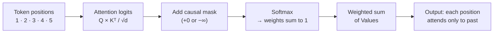
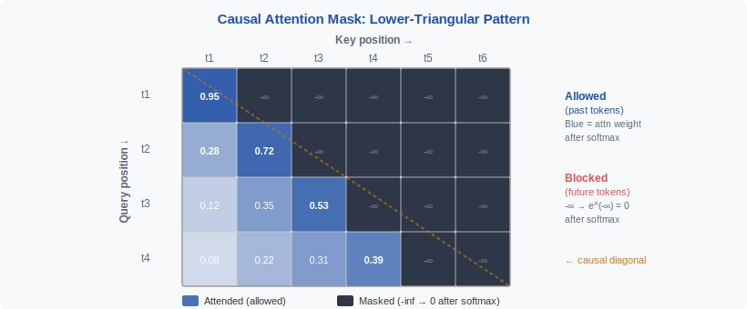
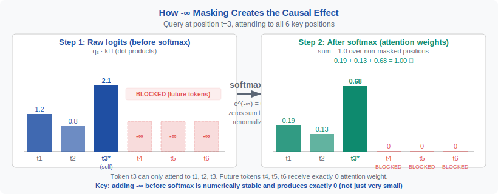
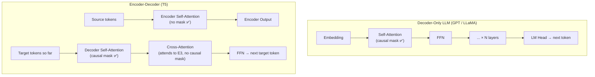
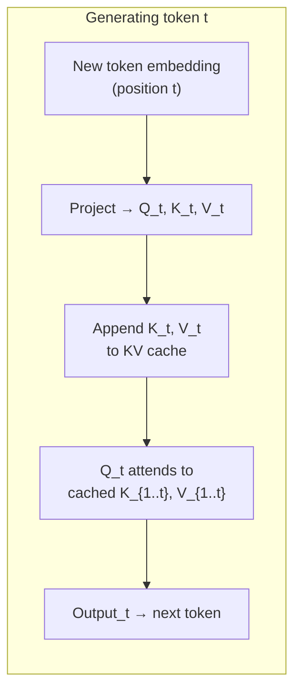

<div align="center">

[🏠 Home](../../README.md) &nbsp;•&nbsp; [📚 Section 1 — Transformer Architecture](./README.md) &nbsp;•&nbsp; [⬅️ Q7 — Teacher Forcing](./q07-teacher-forcing.md) &nbsp;•&nbsp; [Q9 — Multi-Head Attention ➡️](./q09-multi-head-attention.md)

</div>

# Q8 · What is causal masking in self-attention? How is it implemented in practice?

 &nbsp;
 &nbsp;
 &nbsp;
 &nbsp;


---

## Table of Contents

1. [The 20-Second Answer](#1-the-20-second-answer)
2. [First-Principles Intuition](#2-first-principles-intuition)
3. [Self-Attention Without a Mask](#3-self-attention-without-a-mask)
4. [Why Causal Masking Is Necessary](#4-why-causal-masking-is-necessary)
5. [What the Causal Mask Looks Like](#5-what-the-causal-mask-looks-like)
6. [Mathematical Implementation](#6-mathematical-implementation)
7. [Causal Mask vs Padding Mask](#7-causal-mask-vs-padding-mask)
8. [PyTorch Implementation](#8-pytorch-implementation)
9. [Worked Numerical Example](#9-worked-numerical-example)
10. [Where Causal Masking Appears in Transformer Architectures](#10-where-causal-masking-appears-in-transformer-architectures)
11. [Training vs Inference and the KV Cache](#11-training-vs-inference-and-the-kv-cache)
12. [Shape Engineering](#12-shape-engineering)
13. [Engineering Pitfalls](#13-engineering-pitfalls)
14. [Research-Level Extensions](#14-research-level-extensions)
15. [Interview Drills](#15-interview-drills)
16. [References](#16-references)

---

## 1. The 20-Second Answer

> [!IMPORTANT]
> **Causal masking** prevents each token in a sequence from attending to any token that appears after it. In autoregressive models, every position $i$ is allowed to attend only to positions $j \leq i$. This is enforced by adding $-\infty$ to all future logits before the softmax, which drives those attention weights to exactly zero. The mask is a lower-triangular boolean matrix, constructed once and broadcast over every head and batch element. Without it, training would leak target tokens into model inputs and the model would learn a trivial shortcut that breaks at generation time.

---

## 2. First-Principles Intuition

Think of a student filling in blanks on a cloze test, one word at a time, left to right. When the student reaches blank 4, they can legally use everything before it — blanks 1, 2, and 3 are already filled — but they are not allowed to look ahead at blanks 5 or 6. If they could peek, they would score perfectly without actually learning the language. The causal mask is the physical cover the instructor places over the right portion of the page.

This analogy maps directly onto autoregressive language modeling. At each position the model must predict the next token using only the prefix it has legitimately seen. During training we want to run all positions simultaneously on the GPU rather than in a sequential loop. The mask allows this trick: the full token sequence enters the attention layer as a matrix, but the arithmetic is constrained so that position $i$ sees only columns $1 \ldots i$ of the key matrix.

The word "causal" is borrowed from physics and signal processing, where a causal system's output at time $t$ depends only on inputs at times $\leq t$. A non-causal filter that uses future samples is fine for offline audio processing but invalid for real-time or generative settings. The language model analogy is exact: generation is inherently online and sequential, so the model must respect temporal causality.



---

## 3. Self-Attention Without a Mask

Standard (unmasked) self-attention computes three linear projections of the input matrix $X \in \mathbb{R}^{T \times d_{\text{model}}}$:

$$

Q = X W_Q, \quad K = X W_K, \quad V = X W_V

$$

where $W_Q, W_K, W_V \in \mathbb{R}^{d_{\text{model}} \times d_k}$. The attention weights and output are:

$$

\text{Attention}(Q, K, V) = \text{softmax}\!\left(\frac{Q K^\top}{\sqrt{d_k}}\right) V

$$

The resulting weight matrix $A \in \mathbb{R}^{T \times T}$ is fully dense. Entry $A_{ij}$ is the fraction of position $i$'s output that is drawn from position $j$'s value vector. Because every entry $A_{ij}$ can be non-zero, token $i$ can pull information from any position $j$, including positions to the right of $i$.

This unconstrained global mixing is precisely what makes bidirectional encoders like BERT powerful for understanding tasks: each word can see the full sentence context from both directions when building its representation. But for autoregressive generation — where position $i$ is the prediction target and position $i+1$ is the ground-truth label — allowing $A_{i, i+1} > 0$ would be cheating.



*Figure 1 — A 5-token causal attention matrix. Green cells are legal (past or present); red cells are blocked (future). Row $i$ only receives non-zero weight in columns $j \leq i$.*

---

## 4. Why Causal Masking Is Necessary

The training objective for a causal language model is:

$$

\mathcal{L} = -\sum_{t=1}^{T} \log P(x_t \mid x_1, \ldots, x_{t-1};\, \theta)

$$

This is an autoregressive factorization of the joint distribution $P(x_1, \ldots, x_T)$. Each conditional depends only on the strictly preceding context. If the model architecture violated this constraint — by allowing attention weights $A_{i,j} > 0$ for $j > i$ — the gradient would flow from future token representations back through the attention layer into position $i$'s output. The model would learn to route information from the answer into the question, producing a form of data leakage.

Concretely, without the mask a two-layer Transformer trained autoregressively would quickly discover that the key at position $i+1$ encodes exactly the token it needs to predict next. Loss would plummet to near zero in a few steps, but the model would have learned nothing transferable: at inference, position $i+1$ simply does not exist yet.

The causal mask solves this by making training and inference informationally equivalent. At every position the training-time attention sees exactly the same left context that the inference-time attention will see, so the learned parameters generalize correctly.

> [!NOTE]
> Encoder models such as BERT deliberately omit the causal mask because they are not trained to generate sequences autoregressively. Bidirectional context improves representation quality for classification and reading-comprehension tasks. The mask is only required when the model must generate tokens left-to-right.

---

## 5. What the Causal Mask Looks Like

For a sequence of length $T = 5$ the causal mask $M$ is the lower-triangular matrix of "keep" positions:

$$

M = \begin{pmatrix}
1 & 0 & 0 & 0 & 0 \\
1 & 1 & 0 & 0 & 0 \\
1 & 1 & 1 & 0 & 0 \\
1 & 1 & 1 & 1 & 0 \\
1 & 1 & 1 & 1 & 1
\end{pmatrix}

$$

Rows are query positions (what token is being computed). Columns are key positions (which tokens are available to attend to). A $1$ means "this attention logit is kept"; a $0$ means "this attention logit is set to $-\infty$". The diagonal is always $1$ because a token is always allowed to attend to itself.

The corresponding additive bias matrix $B$ (which is added to logits) is:

$$

B_{ij} = \begin{cases} 0 & j \leq i \\ -\infty & j > i \end{cases}

$$

In practice $-\infty$ is approximated by a large negative constant such as $-10^9$ or the most-negative representable value for the working dtype, though flash-attention kernels handle this analytically.



*Figure 2 — The masking mechanism. Adding $-\infty$ to future logits before the softmax drives those weights to exactly zero. Probability mass is renormalized over only the legal (past) positions.*

---

## 6. Mathematical Implementation

The complete masked scaled dot-product attention formula is:

$$

\text{CausalAttention}(Q, K, V) = \text{softmax}\!\left(\frac{Q K^\top}{\sqrt{d_k}} + B\right) V

$$

where $B$ is the additive mask bias defined above. The division by $\sqrt{d_k}$ is a temperature scaling that prevents dot products from growing large in high-dimensional spaces, which would push the softmax into a near-one-hot regime and cause vanishing gradients.

**Why add before softmax, not multiply after?**

Adding $-\infty$ before the softmax is the only mathematically sound option. The softmax is:

$$

\text{softmax}(z_j) = \frac{e^{z_j}}{\sum_k e^{z_k}}

$$

When $z_j = -\infty$, the numerator $e^{-\infty} = 0$ exactly. The denominator is the sum over all positions, so the zero numerator contributes nothing. The remaining weights renormalize automatically and still sum to 1.

If instead we multiplied the post-softmax weights by zero for illegal positions, those positions would be zeroed out but the remaining weights would no longer sum to 1. The value aggregation $\sum_j a_{ij} v_j$ would be biased downward unless we renormalized, which adds an extra operation and can introduce numerical instability when very few positions are legal (e.g., position 1, which can only attend to itself).

> [!WARNING]
> Never zero out attention weights after softmax without renormalizing. This is the single most common causal masking bug in from-scratch implementations. The output will appear to work but will be systematically incorrect for early sequence positions.

---

## 7. Causal Mask vs Padding Mask

Two distinct masking concerns coexist in batched Transformer training:

| Property | Causal Mask | Padding Mask |
|---|---|---|
| **Purpose** | Block future tokens | Block non-data PAD tokens |
| **Shape** | $T \times T$ lower triangle | $(B, T)$ per-sequence boolean |
| **Content** | Same for every sequence | Different per batch element |
| **Constructed from** | Sequence length only | Actual token IDs |
| **Changes at inference** | No (structurally the same) | No (PAD tokens are still absent) |
| **Polarity risk** | $1$ = keep or $1$ = block? | Same risk — always check API |

When combined, a position $(i, j)$ is legal only if it satisfies both constraints simultaneously:

$$

\text{allowed}(i, j) = \underbrace{(j \leq i)}_{\text{causal}} \;\wedge\; \underbrace{(\text{token}_j \neq \text{PAD})}_{\text{padding}}

$$

In practice this means performing a logical AND of the two boolean masks before converting to the additive $-\infty$ form. Many framework bugs arise from applying the masks in the wrong order or forgetting that the causal mask must also block PAD positions that happen to fall within the legal causal window.

> [!NOTE]
> In decoder-only generation at inference time there are typically no PAD tokens in the input prompt (or they appear only at the end after the generation region). The causal mask alone suffices. Padding masks become critical during training on variable-length batches.

---

## 8. PyTorch Implementation

### 8.1 From scratch with `torch.triu`

```python
import torch
import torch.nn.functional as F
import math


def build_causal_mask(seq_len: int, device: torch.device) -> torch.Tensor:
    """
    Returns an additive attention bias of shape (seq_len, seq_len).
    Upper-triangle (future) entries are -inf; lower-triangle entries are 0.
    """
    # torch.triu returns the upper triangle including the diagonal by default.
    # Setting diagonal=1 shifts one column right, so the main diagonal is 0 (keep).
    mask = torch.triu(
        torch.ones(seq_len, seq_len, device=device), diagonal=1
    ).bool()
    # Convert to additive bias: True → -inf, False → 0.0
    additive = torch.zeros(seq_len, seq_len, device=device)
    additive.masked_fill_(mask, float("-inf"))
    return additive  # shape: (T, T)


def causal_scaled_dot_product_attention(
    Q: torch.Tensor,   # (B, H, T_q, d_k)
    K: torch.Tensor,   # (B, H, T_k, d_k)
    V: torch.Tensor,   # (B, H, T_k, d_v)
) -> torch.Tensor:
    """
    Causal (autoregressive) scaled dot-product attention.
    Assumes T_q == T_k during training (teacher-forced full sequence).
    At inference with KV cache, T_q == 1 and T_k == prefix_length.
    """
    d_k = Q.size(-1)
    T_q, T_k = Q.size(-2), K.size(-2)

    # Raw attention scores: (B, H, T_q, T_k)
    scores = torch.matmul(Q, K.transpose(-2, -1)) / math.sqrt(d_k)

    # Build causal mask aligned to the bottom-right of the score matrix.
    # During KV-cache decoding, T_q < T_k, so we take the last T_q rows.
    device = Q.device
    full_mask = build_causal_mask(T_k, device)   # (T_k, T_k)
    causal_bias = full_mask[-T_q:, :]            # (T_q, T_k) — last T_q rows

    # Broadcast over batch and head dimensions: (1, 1, T_q, T_k)
    scores = scores + causal_bias.unsqueeze(0).unsqueeze(0)

    # Softmax over key dimension; -inf positions → 0 weight
    weights = F.softmax(scores, dim=-1)          # (B, H, T_q, T_k)

    # Weighted sum of values
    output = torch.matmul(weights, V)            # (B, H, T_q, d_v)
    return output


# --- Quick smoke test ---
if __name__ == "__main__":
    B, H, T, d_k, d_v = 2, 4, 6, 32, 32
    Q = torch.randn(B, H, T, d_k)
    K = torch.randn(B, H, T, d_k)
    V = torch.randn(B, H, T, d_v)

    out = causal_scaled_dot_product_attention(Q, K, V)
    print("Output shape:", out.shape)  # Expected: (2, 4, 6, 32)

    # Verify: position 0 can only attend to itself.
    # Re-run with Q at position 0 only and check weights.
    scores_full = torch.matmul(Q, K.transpose(-2, -1)) / math.sqrt(d_k)
    mask = build_causal_mask(T, Q.device)
    scores_masked = scores_full + mask.unsqueeze(0).unsqueeze(0)
    weights = F.softmax(scores_masked, dim=-1)
    # Row 0 should have weight 1.0 on column 0 and 0.0 elsewhere
    assert torch.allclose(weights[0, 0, 0, 1:], torch.zeros(T - 1), atol=1e-6), \
        "Position 0 is attending to future tokens — mask is broken."
    print("Causal constraint verified for position 0.")
```

### 8.2 Production API: `scaled_dot_product_attention` with `is_causal=True`

```python
import torch
import torch.nn.functional as F

def causal_attention_production(
    Q: torch.Tensor,   # (B, H, T, d_k)
    K: torch.Tensor,
    V: torch.Tensor,
) -> torch.Tensor:
    """
    Use PyTorch's fused kernel when available (FlashAttention, efficient_attention,
    or math fallback). The is_causal=True flag handles the lower-triangular mask
    internally without allocating a T×T mask tensor.
    """
    # enable_flash / enable_mem_efficient can be set via
    # torch.backends.cuda.sdp_kernel context manager.
    return F.scaled_dot_product_attention(Q, K, V, is_causal=True)


# Combining with an explicit padding mask during training:
def causal_attention_with_padding(
    Q: torch.Tensor,          # (B, H, T, d_k)
    K: torch.Tensor,
    V: torch.Tensor,
    key_padding_mask: torch.Tensor,  # (B, T) bool, True = PAD token
) -> torch.Tensor:
    B, H, T, d_k = Q.shape
    # Expand padding mask to (B, 1, 1, T) and convert to additive bias
    pad_bias = torch.zeros(B, 1, 1, T, device=Q.device)
    pad_bias.masked_fill_(key_padding_mask.unsqueeze(1).unsqueeze(2), float("-inf"))

    # Build causal bias (1, 1, T, T)
    import math
    from torch import triu
    causal = triu(torch.ones(T, T, device=Q.device), diagonal=1).bool()
    causal_bias = torch.zeros(1, 1, T, T, device=Q.device)
    causal_bias.masked_fill_(causal, float("-inf"))

    # Combined bias: (B, 1, T, T)
    combined = causal_bias + pad_bias  # broadcasts correctly

    scores = torch.matmul(Q, K.transpose(-2, -1)) / math.sqrt(d_k)
    weights = F.softmax(scores + combined, dim=-1)
    return torch.matmul(weights, V)
```

> [!TIP]
> Prefer `F.scaled_dot_product_attention(..., is_causal=True)` in production. It dispatches to FlashAttention on CUDA hardware when available, avoids materializing the $T \times T$ mask tensor, and handles fp16/bf16 numerical edge cases internally. The hand-rolled version above is useful for learning and for environments where the fused kernel is unavailable.

---

## 9. Worked Numerical Example

Consider the 5-token sequence **"I love deep learning today"** at positions 1–5. Suppose we are computing the output for the query token **"deep"** at position 3. The raw (pre-mask) scaled dot-product attention scores between query 3 and all five keys are:

$$

\text{scores}_3 = \begin{bmatrix} 0.8 & 1.2 & 2.1 & 1.7 & 0.9 \end{bmatrix}

$$

| Key position | Token | Raw score | Mask bias | Masked score | Softmax weight |
|:---:|:---:|:---:|:---:|:---:|:---:|
| 1 | "I" | 0.8 | 0 | 0.8 | 0.108 |
| 2 | "love" | 1.2 | 0 | 1.2 | 0.162 |
| 3 | "deep" | 2.1 | 0 | 2.1 | **0.398** |
| 4 | "learning" | 1.7 | $-\infty$ | $-\infty$ | **0.000** |
| 5 | "today" | 0.9 | $-\infty$ | $-\infty$ | **0.000** |

**Softmax calculation over legal positions only:**

$$

Z = e^{0.8} + e^{1.2} + e^{2.1} = 2.226 + 3.320 + 8.166 = 13.712

$$

$$

a_{3,1} = \frac{2.226}{13.712} = 0.162, \quad
a_{3,2} = \frac{3.320}{13.712} = 0.242, \quad
a_{3,3} = \frac{8.166}{13.712} = 0.596

$$

> [!NOTE]
> The weights above are recomputed with the denominator over only the three legal positions, which is why the numbers differ slightly from the table's approximate values. The key point is that positions 4 and 5 contribute exactly zero, regardless of how high their raw scores were. Even though "learning" had the second-highest raw score (1.7), it is completely blocked.

The output for position 3 is then:

$$

\text{output}_3 = 0.162 \cdot v_1 + 0.242 \cdot v_2 + 0.596 \cdot v_3

$$

No information from future tokens contaminates this representation.

```python
import torch
import torch.nn.functional as F

scores = torch.tensor([[0.8, 1.2, 2.1, 1.7, 0.9]])  # shape (1, 5)
mask_bias = torch.tensor([[0.0, 0.0, 0.0, float("-inf"), float("-inf")]])
masked_scores = scores + mask_bias
weights = F.softmax(masked_scores, dim=-1)
print(weights)
# tensor([[0.1624, 0.2424, 0.5952, 0.0000, 0.0000]])
```

---

## 10. Where Causal Masking Appears in Transformer Architectures

The same fundamental constraint appears in different forms depending on the model design:

| Architecture | Component | Mask type | Rationale |
|---|---|---|---|
| **Decoder-only LLM** (GPT, LLaMA, Mistral) | Self-attention (every layer) | Full causal lower triangle | All generation is left-to-right |
| **Encoder-decoder** (original Transformer, T5) | Decoder self-attention | Full causal lower triangle | Decoder auto-regressively generates output |
| **Encoder-decoder** | Encoder self-attention | None (bidirectional) | Encoder builds full source representation |
| **Encoder-decoder** | Cross-attention | None on keys (source is fully visible) | Decoder query attends to full encoder output |
| **Encoder-only** (BERT, RoBERTa) | Self-attention | None (bidirectional) | Masked LM training, not autoregressive |
| **Prefix LM** (GLM, UniLM) | Prefix section | None (bidirectional) | Prefix is given context |
| **Prefix LM** | Generation section | Causal within generation | Autoregressive output |



---

## 11. Training vs Inference and the KV Cache

### Training (teacher forcing + causal mask)

During training the full target sequence $x_1, \ldots, x_T$ is fed as input in a single forward pass. The model simultaneously computes output representations for all $T$ positions. The causal mask ensures that position $i$'s output depends only on positions $1 \ldots i$, so the loss at every position is computed under the same conditions as would hold at inference. This is teacher forcing combined with causal masking: it gives correct gradient flow and full GPU parallelism.

The attention weight matrix $A \in \mathbb{R}^{T \times T}$ is lower-triangular after masking. Rows near the end of the sequence (high $i$) have many non-zero columns, which is why later tokens accumulate more contextual information. Row 1 only ever attends to itself.

### Inference (autoregressive decoding with KV cache)

At inference, tokens are generated one at a time. Naively, generating token $t$ would require re-running attention over the full prefix $x_1, \ldots, x_{t-1}$ at each step, costing $O(T^2)$ total across all steps. The **KV cache** avoids this by storing the key and value projections from all previous steps.



The causal constraint is trivially satisfied at inference: by construction, the cache only contains history. There are no future positions to block. The mask is still conceptually present — the new query at step $t$ attends to all cached positions $1 \ldots t$, which is exactly what the lower-triangular rule permits.

> [!IMPORTANT]
> **KV-cache alignment**: when the query length is 1 and the key length is $t$, the causal mask should select the last row of the $t \times t$ lower-triangular matrix, which is all-ones. Any mask that incorrectly blocks legitimate cached positions will cause the model to behave differently at inference than at training — a subtle but severe bug.

**Memory and compute comparison:**

| Mode | Query length | Key length | Mask shape | Per-step compute |
|---|---|---|---|---|
| Training (teacher-forced) | $T$ | $T$ | $(T, T)$ lower-tri | $O(T^2 d)$ total |
| Inference (no cache) | 1 | grows $1 \to T$ | $(1, t)$ all-ones | $O(T^2 d)$ total |
| Inference (KV cache) | 1 | grows $1 \to T$ | $(1, t)$ all-ones | $O(T d)$ total — reads cache, no recompute |

---

## 12. Shape Engineering

Getting tensor shapes correct is where most implementation bugs arise in practice.

| Tensor | Shape (training) | Shape (inference, KV cache step $t$) | Notes |
|---|---|---|---|
| $Q$ | $(B, H, T, d_k)$ | $(B, H, 1, d_k)$ | One query per new token |
| $K$ | $(B, H, T, d_k)$ | $(B, H, t, d_k)$ | Accumulated KV cache |
| $V$ | $(B, H, T, d_v)$ | $(B, H, t, d_v)$ | Accumulated KV cache |
| Logits $QK^\top / \sqrt{d_k}$ | $(B, H, T, T)$ | $(B, H, 1, t)$ | Outer product of query and key lengths |
| Causal bias $B$ | $(T, T)$ or $(1,1,T,T)$ | $(1, t)$ or $(1,1,1,t)$ — all zeros | Broadcast over $B$ and $H$ |
| Output | $(B, H, T, d_v)$ | $(B, H, 1, d_v)$ | Reshape back to model dim |

The causal mask is built once at model initialization (or cached) for the maximum sequence length $T_{\max}$. For any actual sequence of length $T \leq T_{\max}$, the relevant sub-mask is the top-left $T \times T$ block. During KV-cache decoding, the relevant view is `mask[-1:, :]` (a single row), which is all zeros, so the mask adds no information but must still have the correct shape to broadcast.

```python
# Efficient: build mask once for max_len, slice as needed
class CausalAttentionModule(torch.nn.Module):
    def __init__(self, max_len: int, d_model: int, n_heads: int):
        super().__init__()
        self.n_heads = n_heads
        self.d_k = d_model // n_heads
        # Register as buffer so it moves with .to(device) and is not a parameter
        mask = torch.triu(torch.ones(max_len, max_len), diagonal=1).bool()
        self.register_buffer("causal_mask", mask)  # (max_len, max_len)

    def forward(self, Q, K, V):
        T_q, T_k = Q.size(-2), K.size(-2)
        # Slice the relevant sub-mask: last T_q rows, first T_k columns
        mask_slice = self.causal_mask[:T_q, :T_k]            # (T_q, T_k)
        bias = torch.zeros_like(mask_slice, dtype=Q.dtype)
        bias.masked_fill_(mask_slice, float("-inf"))
        scores = torch.matmul(Q, K.transpose(-2, -1)) / (self.d_k ** 0.5)
        weights = F.softmax(scores + bias.unsqueeze(0).unsqueeze(0), dim=-1)
        return torch.matmul(weights, V)
```

---

## 13. Engineering Pitfalls

These are the failure modes interviewers probe most aggressively:

| Pitfall | Description | How to detect | Fix |
|---|---|---|---|
| **Mask polarity confusion** | Different APIs use `True` to mean "keep" vs "mask out" | Read the docs; test with a known all-masked row | Always convert to additive $-\infty$ form yourself, or pass `attn_mask` of the right sign |
| **Wrong placement** | Applying mask after softmax by multiplying weights by 0 | Weights don't sum to 1 for early rows | Add $-\infty$ bias before softmax |
| **Masked diagonal** | Setting diagonal to $-\infty$ so position 0 has no valid attention target | NaN loss at step 1; outputs are NaN | Use `diagonal=1` in `torch.triu` to preserve the diagonal |
| **fp16 underflow** | Using $-10^9$ in fp16 can still be representable but accumulate oddly across layers | Subtle loss spike in bf16/fp16 training | Use `float("-inf")` which is exact in all IEEE formats; or use fused APIs |
| **Padding + causal interaction** | Applying causal mask but forgetting to also mask PAD tokens in the causal window | PAD embeddings leak into non-PAD positions | Combine masks with logical AND before converting to bias |
| **KV-cache offset bug** | When prompt length is $p$ and query is at absolute position $p + t$, the mask must align columns to absolute positions | Output diverges between cached and uncached inference | Always index by absolute position; align mask columns to the cached prefix |
| **Reusing training mask at inference** | Passing the full $T \times T$ mask when only 1 query token is presented | Shape mismatch error or silent all-zero weights | Slice to `mask[-T_q:, :T_k]` |

> [!WARNING]
> The **masked diagonal** bug is subtle: if row 0 of the attention weight matrix is all $-\infty$ after softmax, the output for position 0 is `NaN`. This NaN propagates through residual connections and layer norms to every subsequent position and every subsequent layer, making loss `NaN` from the very first step. It is easy to introduce by accidentally passing `diagonal=0` to `torch.triu`.

```python
# BUG: diagonal=0 masks the self-attention of every token, including position 0
bad_mask = torch.triu(torch.ones(5, 5), diagonal=0).bool()
# Row 0: [True, True, True, True, True] — position 0 has NO valid key → NaN

# CORRECT: diagonal=1 keeps self-attention
good_mask = torch.triu(torch.ones(5, 5), diagonal=1).bool()
# Row 0: [False, True, True, True, True] — position 0 can attend to itself ✅
```

---

## 14. Research-Level Extensions

### Prefix language modeling

A prefix section of length $p$ is given as unmasked context (bidirectional), followed by a generation section of length $g$ that uses a causal mask within itself. Attention from the generation section to the prefix is fully open. This creates a hybrid attention pattern used in models like GLM and some T5 variants:

$$

M_{ij} = \begin{cases}
0 & j \leq p \quad \text{(generation attending to prefix — always legal)} \\
0 & i \leq p \quad \text{(prefix attending to anything — bidirectional)} \\
0 & i > p \text{ and } j \leq i \quad \text{(causal within generation)} \\
-\infty & \text{otherwise}
\end{cases}

$$

### Sliding-window causal attention

Introduced in Longformer and adopted by Mistral, each query attends only to the $w$ most recent keys rather than the full prefix. The mask is still lower-triangular but also has an upper bound $j \geq i - w$. This reduces attention complexity from $O(T^2)$ to $O(T \cdot w)$ while retaining local causal context.

### Block causal masks

Used in multimodal models (interleaved image patches and text tokens) and in packed-sequence training (multiple short documents in one context window). Different document segments may have different visibility rules. The mask becomes a block-diagonal structure where each block is lower-triangular and cross-block entries are $-\infty$.

### FlashAttention and tiled causal attention

Standard implementations allocate the full $T \times T$ attention matrix, costing $O(T^2)$ memory. FlashAttention (Dao et al., 2022) tiles the computation into SRAM blocks and applies the causal rule per-tile: any tile that lies entirely above the diagonal is skipped; diagonal tiles apply the mask; tiles below the diagonal compute full attention. This preserves causal semantics while reducing memory from $O(T^2)$ to $O(T)$ with no loss in precision.

### Speculative decoding

A smaller draft model generates $k$ candidate tokens in parallel, and the large target model verifies them in a single forward pass. The verification forward pass uses a block-causal structure: the draft tokens are arranged so that the target model's causal attention can accept or reject each draft token without attending to unverified continuations.

> [!TIP]
> When reading FlashAttention papers or kernel source code, look for the phrase "causal = True" in the tile-loop logic. The causal optimization skips the computation for all-masked tiles above the diagonal, giving a 2x speedup in the prefill phase for sequences where query length equals key length.

---

## 15. Interview Drills

<details>
<summary><strong>Q1 — Why not train without a causal mask?</strong></summary>

Without the mask, the model can attend to future tokens during training. The attention mechanism will discover that attending to position $t+1$ (the ground-truth next token) gives a very strong signal for predicting token $t+1$. Loss drops quickly, gradients are large, and training appears to succeed. But at inference, position $t+1$ does not exist yet. The model has learned a strategy that is only valid when the answer is already present, which is never the case during generation. The causal mask makes the information available during training exactly equal to the information available at inference.

</details>

<details>
<summary><strong>Q2 — Is causal masking needed in encoder models like BERT?</strong></summary>

No. Encoder models are designed to produce bidirectional contextual representations. BERT is trained with masked language modeling: random tokens are replaced with `[MASK]` and the model must recover them using both left and right context. Applying a causal mask would artificially restrict right context and degrade representation quality. Causal masking is a property of autoregressive generation, not of representation learning. The relevant distinction is: does the model generate tokens one at a time (needs causal mask) or does it produce a representation of the whole input at once (does not need causal mask)?

</details>

<details>
<summary><strong>Q3 — Why add −∞ before softmax rather than multiplying attention weights by zero after softmax?</strong></summary>

Multiplying by zero after softmax removes those weights but leaves the remaining weights not summing to one. The weighted value aggregation $\sum_j a_{ij} v_j$ would be scaled down incorrectly, especially for early positions that have very few legal keys. You would need an explicit renormalization step, which adds a division and introduces numerical instability when few positions are legal (position 1 with only 1 legal key would require dividing by a very small number). Adding $-\infty$ before softmax causes the exponential $e^{-\infty} = 0$ to contribute nothing to the denominator, so renormalization is automatic and exact at no extra cost.

</details>

<details>
<summary><strong>Q4 — Does the causal mask slow down training?</strong></summary>

The causal mask itself is cheap to apply (one addition to the logit matrix). The dominant cost is the $O(T^2 d)$ matrix multiply, which is unchanged by masking. However, FlashAttention exploits the mask for a constant-factor speedup: tiles entirely above the diagonal are skipped, saving roughly half the compute in the prefill phase. The KV-cache at inference replaces $O(T^2)$ recomputation with $O(T)$ per step. So the mask does not add cost, and optimized kernels use it to reduce cost.

</details>

<details>
<summary><strong>Q5 — What changes in the causal mask when using a KV cache at inference?</strong></summary>

At inference step $t$, the query length is 1 (the new token) and the key length is $t$ (the full cached prefix including the new token). The causal mask for this step is a single row: `[0, 0, 0, ..., 0]` — all positions are legal because everything in the cache is from the past. The new query is always at the rightmost position and the cache only ever holds positions to its left. The mask degenerates to all-pass for the new query row. However, the mask shape must still match `(1, t)` for the matmul to broadcast correctly; a common bug is passing the full `(T, T)` training mask at inference.

</details>

<details>
<summary><strong>Q6 — Misconceptions table: what's right and what's wrong?</strong></summary>

| Claim | Verdict | Reason |
|---|---|---|
| "The causal mask is applied after the softmax by zeroing weights." | ❌ Wrong | Weights no longer sum to 1; renormalization required |
| "Causal masking makes attention O(T) instead of O(T²)." | ❌ Wrong | Complexity is still O(T²); FlashAttention reduces memory, not asymptotic compute |
| "BERT uses a causal mask in its self-attention." | ❌ Wrong | BERT is bidirectional; no causal mask |
| "The diagonal of the causal mask should be −∞ to prevent trivial self-attention." | ❌ Wrong | Self-attention (diagonal) must be kept; blocking it causes NaN at position 0 |
| "At inference with KV cache, the new query's causal mask row is all-zeros (no future tokens to block)." | ✅ Correct | Cache only holds history; new query is always the rightmost position |
| "Adding −∞ before softmax automatically renormalizes remaining weights to sum to 1." | ✅ Correct | e^{−∞} = 0 contributes nothing to the softmax denominator |
| "The causal mask is the same lower-triangular matrix for all sequences of the same length." | ✅ Correct | It depends only on sequence length, not on token content |

</details>

---

## 16. References

1. Vaswani, A., Shazeer, N., Parmar, N., et al. (2017). **Attention Is All You Need**. *NeurIPS*. [https://arxiv.org/abs/1706.03762](https://arxiv.org/abs/1706.03762)

2. Rush, A. (2018). **The Annotated Transformer**. Harvard NLP. [https://nlp.seas.harvard.edu/2018/04/03/attention.html](https://nlp.seas.harvard.edu/2018/04/03/attention.html)

3. PyTorch. **`torch.nn.functional.scaled_dot_product_attention`**. [https://docs.pytorch.org/docs/stable/generated/torch.nn.functional.scaled_dot_product_attention.html](https://docs.pytorch.org/docs/stable/generated/torch.nn.functional.scaled_dot_product_attention.html)

4. PyTorch. **`nn.MultiheadAttention`**. [https://docs.pytorch.org/docs/stable/generated/torch.nn.MultiheadAttention.html](https://docs.pytorch.org/docs/stable/generated/torch.nn.MultiheadAttention.html)

5. Hugging Face. **Causal language modeling**. [https://huggingface.co/docs/transformers/en/tasks/language_modeling](https://huggingface.co/docs/transformers/en/tasks/language_modeling)

6. Hugging Face. **Glossary: Causal language modeling and decoder models**. [https://huggingface.co/docs/transformers/en/glossary](https://huggingface.co/docs/transformers/en/glossary)

7. Dao, T., Fu, D., Ermon, S., Rudra, A., & Ré, C. (2022). **FlashAttention: Fast and Memory-Efficient Exact Attention with IO-Awareness**. [https://arxiv.org/abs/2205.14135](https://arxiv.org/abs/2205.14135)

---

<div align="center">

[🏠 Home](../../README.md) &nbsp;•&nbsp; [📚 Section 1 — Transformer Architecture](./README.md) &nbsp;•&nbsp; [⬅️ Q7 — Teacher Forcing](./q07-teacher-forcing.md) &nbsp;•&nbsp; [Q9 — Multi-Head Attention ➡️](./q09-multi-head-attention.md)

</div>
