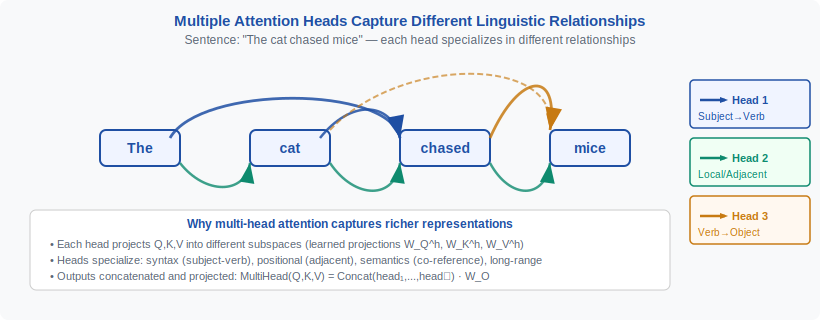
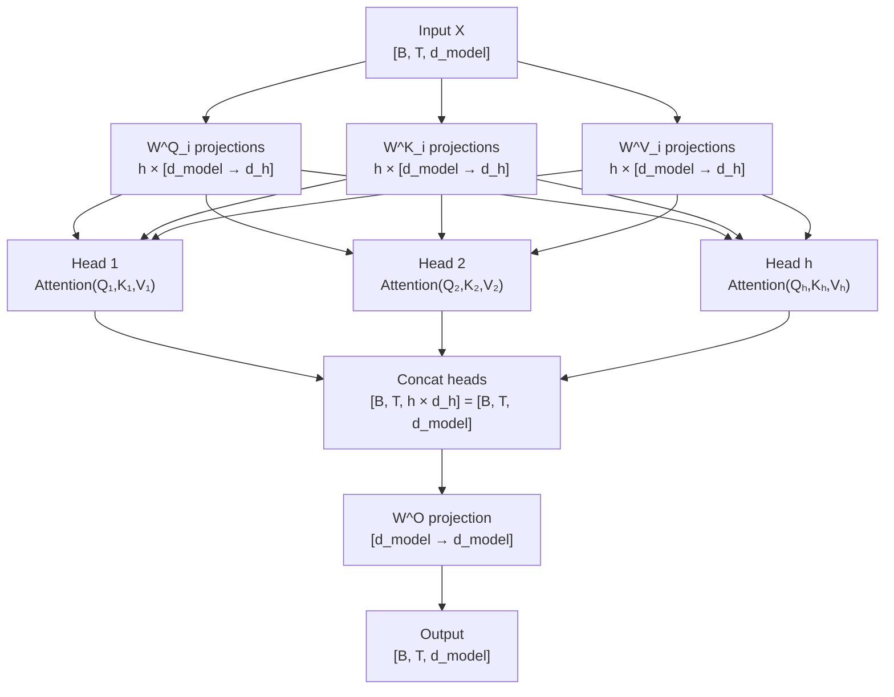
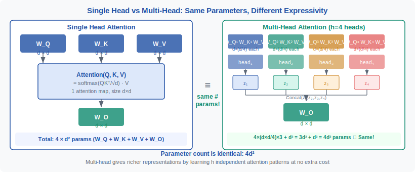
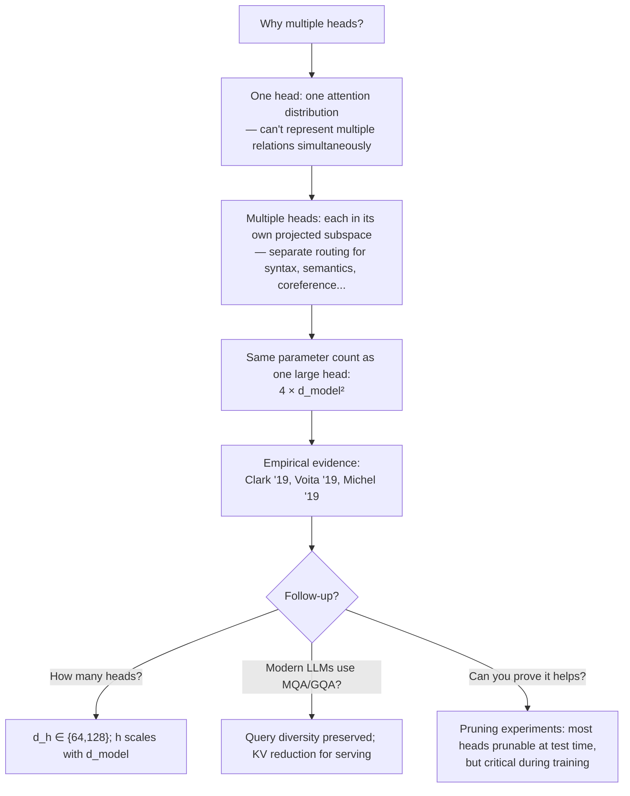

<div align="center">

[🏠 Home](../../README.md) &nbsp;•&nbsp; [📚 Section 1 — Transformer Architecture](./README.md) &nbsp;•&nbsp; [⬅️ Q8 — Causal Masking](./q08-causal-masking.md) &nbsp;•&nbsp; [Q10 — Encoder vs Decoder ➡️](./q10-encoder-decoder.md)

</div>

# Q9 · Why do Transformers use multiple attention heads instead of one large head?

<div align="center">

 &nbsp;
 &nbsp;
 &nbsp;
 &nbsp;


</div>

---

## Table of Contents

1. [The simplest intuition: one spotlight vs many specialists](#1-the-simplest-intuition-one-spotlight-vs-many-specialists)
2. [First principles: attention as differentiable retrieval](#2-first-principles-attention-as-differentiable-retrieval)
3. [What a single head can and cannot do](#3-what-a-single-head-can-and-cannot-do)
4. [Multi-head attention: equations, shapes, and data flow](#4-multi-head-attention-equations-shapes-and-data-flow)
5. [Why multi-head is not the same as one large head](#5-why-multi-head-is-not-the-same-as-one-large-head)
6. [A toy example: one sentence, two competing relationships](#6-a-toy-example-one-sentence-two-competing-relationships)
7. [Researcher-level view: expressivity, optimization, and inductive bias](#7-researcher-level-view-expressivity-optimization-and-inductive-bias)
8. [PyTorch implementation of multi-head attention](#8-pytorch-implementation-of-multi-head-attention)
9. [Worked numerical example: two heads, two relations](#9-worked-numerical-example-two-heads-two-relations)
10. [Compute and memory: why the split is efficient](#10-compute-and-memory-why-the-split-is-efficient)
11. [Empirical findings: what attention heads actually learn](#11-empirical-findings-what-attention-heads-actually-learn)
12. [Modern variants: MHA, MQA, and GQA](#12-modern-variants-mha-mqa-and-gqa)
13. [How to answer in interviews: templates and follow-ups](#13-how-to-answer-in-interviews-templates-and-follow-ups)
14. [Common traps and misconceptions](#14-common-traps-and-misconceptions)
15. [Cheat sheet and references](#15-cheat-sheet-and-references)

---

## 1. The simplest intuition: one spotlight vs many specialists

> [!IMPORTANT]
> **20-second answer:** Multi-head attention runs $h$ independent attention functions in parallel, each on a lower-dimensional projection of the input. Each head can learn to attend to different relationship types — syntax, coreference, position, semantics — simultaneously. One large head is forced to blend all signals into a single probability distribution, losing the ability to represent competing, co-occurring relationships. The outputs are concatenated and projected back, so the total parameter count is the same. The gain is representational diversity at no extra asymptotic cost.

Natural language — and every other sequence modality — contains many kinds of structure at once. In "The scientist who wrote the paper thanked the reviewer because she was helpful," the pronoun "she" requires at least three simultaneous analyses: coreference (who does "she" refer to?), syntactic agreement (what is the subject of "was helpful"?), and pragmatic focus (why is helpfulness relevant here?). A single probability distribution over the eight preceding tokens cannot represent all three simultaneously; it must compromise. Multiple heads remove that compromise by giving each relationship type its own routing channel.

Think of it as the difference between a single camera with a wide-angle lens and a camera array where one lens is telephoto, one is wide-angle, and one tracks infrared. The array captures more complete information about the same scene. The output — a combined image — is richer than any single lens could produce, and the total sensor area need not be larger.

The analogy extends to architecture: splitting $d_{\text{model}}$ into $h$ subspaces of size $d_h = d_{\text{model}} / h$ means each head operates in a compressed representation. This compression is not a limitation — it is a regularization that encourages specialization. A head with $d_h = 64$ dimensions cannot afford to spread its capacity across all relationship types; it must focus. Multi-head attention thus converts a capacity constraint into a diversity incentive.

<div align="center">
  
  <br/>
  <em>Figure 1 — Different heads learn different attention patterns. Head 1 tracks syntactic dependency, Head 2 tracks coreference, Head 3 attends to positional proximity. A single head would need to collapse all three into one distribution.</em>
</div>

---

## 2. First principles: attention as differentiable retrieval

Scaled dot-product attention is best understood as a soft, differentiable dictionary lookup. Given a query $\mathbf{q}$, a set of keys $K$, and associated values $V$, the output is a weighted blend of values where the weights are proportional to query-key similarity:

$$
\text{Attention}(\mathbf{Q}, \mathbf{K}, \mathbf{V}) = \text{softmax}\!\left(\frac{\mathbf{Q}\mathbf{K}^\top}{\sqrt{d_k}}\right)\mathbf{V}
$$

The $\sqrt{d_k}$ scaling prevents the dot products from growing large enough to push softmax into saturation, which would make gradients vanish. For each token $i$, the output is:

$$
\mathbf{z}_i = \sum_{j=1}^{T} \alpha_{ij} \mathbf{v}_j, \quad \alpha_{ij} = \frac{\exp(\mathbf{q}_i \cdot \mathbf{k}_j / \sqrt{d_k})}{\sum_{j'} \exp(\mathbf{q}_i \cdot \mathbf{k}_{j'} / \sqrt{d_k})}
$$

The weights $\alpha_{ij}$ form a probability simplex: they are non-negative and sum to 1. This is exactly a soft retrieval — token $i$ retrieves a weighted mixture of all values, where proximity in the query-key space determines the mixture weights.

The bottleneck is intrinsic to this formulation. Because $\alpha_{ij}$ must sum to 1, the output $\mathbf{z}_i$ lives on a convex hull of the value vectors. If two entirely different tokens are jointly relevant — say, a syntactic head and a semantic referent — a single softmax distribution must split probability mass between them, diluting both. There is no way to independently and fully attend to two separate tokens in one pass. Multiple heads sidestep this constraint by running separate softmax operations over separate projections.

A second, subtler point: the projection matrices $W^Q$, $W^K$, $W^V$ define the notion of similarity used in retrieval. One head learns one such notion. In a single-head model, that notion must serve all relationship types. With $h$ heads, the model can learn $h$ distinct similarity metrics, one per head, each specialized for a different relationship type.

---

## 3. What a single head can and cannot do

A single attention head with $d_k = d_{\text{model}}$ has the capacity to attend to any token, attend to distant tokens, and in principle represent any linear function of the input. Why is this insufficient?

**The simultaneity problem.** Consider a token that must simultaneously gather syntactic information from a verb four positions back and semantic information from a noun twenty positions ahead. A single head must assign probability mass to both. If it assigns 0.5 to each, it gets a blended representation that is faithful to neither. If it assigns 1.0 to the verb, it loses the noun entirely. This is not a capacity problem in the parameterization — it is a fundamental constraint of the softmax distribution.

**The projection problem.** The query-key product $\mathbf{q}^\top \mathbf{k}$ measures similarity in one linear subspace. Syntactic relatedness and semantic relatedness are not aligned in the same directions in representation space. A single $W^Q, W^K$ pair must somehow capture both — a contradiction when the relevant directions are orthogonal or even conflicting.

**The rank bottleneck.** The attention weight matrix $A \in \mathbb{R}^{T \times T}$ produced by one head has rank at most $\min(T, d_k)$. Multi-head attention produces $h$ separate attention matrices $A^{(1)}, \ldots, A^{(h)}$ and aggregates their contributions. The combined routing capacity is strictly greater than what a single matrix of the same total dimension can achieve, because each head routes through different projections of both queries and values.

| Capability | Single head | Multi-head |
|---|---|---|
| Attend to any single token | Yes | Yes |
| Attend to two unrelated tokens simultaneously | Blended — one distribution | Yes — separate heads |
| Learn multiple similarity metrics | No — one $W^Q W^K$ pair | Yes — $h$ pairs |
| Represent multiple relation types jointly | Must compromise | Parallel, then recombined |
| Independent gradient paths | One path | $h$ paths |
| Subspace specialization | None enforced | Architecturally induced |

---

## 4. Multi-head attention: equations, shapes, and data flow

Given input $X \in \mathbb{R}^{T \times d_{\text{model}}}$, multi-head attention computes $h$ attention functions in parallel:

$$
\text{head}_i = \text{Attention}(X W_i^Q,\; X W_i^K,\; X W_i^V)
$$

where $W_i^Q, W_i^K \in \mathbb{R}^{d_{\text{model}} \times d_h}$ and $W_i^V \in \mathbb{R}^{d_{\text{model}} \times d_h}$, with $d_h = d_{\text{model}} / h$.

The $h$ head outputs are concatenated and linearly projected:

$$
\text{MHA}(X) = \text{Concat}(\text{head}_1, \ldots, \text{head}_h)\, W^O
$$

where $W^O \in \mathbb{R}^{d_{\text{model}} \times d_{\text{model}}}$ mixes the information across heads.

**Shape flow for $d_{\text{model}} = 512$, $h = 8$, $T = 10$, batch size $B = 1$:**

```
Input X:            [B, T, d_model]  = [1, 10, 512]
After Wq projection:[B, T, d_model]  = [1, 10, 512]  (then reshape)
Reshaped queries:   [B, H, T, d_h]   = [1,  8, 10,  64]
Attention scores:   [B, H, T, T]     = [1,  8, 10,  10]   (per head)
Attention weights:  [B, H, T, T]     = [1,  8, 10,  10]   (after softmax)
Head outputs:       [B, H, T, d_h]   = [1,  8, 10,  64]
Concatenated:       [B, T, d_model]  = [1, 10, 512]
After W^O:          [B, T, d_model]  = [1, 10, 512]
```



> [!NOTE]
> The reshape + transpose trick is what makes multi-head attention efficient in practice. Rather than running $h$ separate matrix multiplications, modern implementations fold the heads into a batch dimension and run a single batched GEMM. This is why the PyTorch `nn.MultiheadAttention` module is fast despite conceptually running $h$ independent attention functions.

**Parameter count — MHA vs single large head:**

| Component | Single head ($d_k = d_{\text{model}}$) | Multi-head ($h$ heads, $d_h = d_{\text{model}}/h$) |
|---|---|---|
| $W^Q$ | $d_{\text{model}} \times d_{\text{model}}$ | $h \times d_{\text{model}} \times d_h = d_{\text{model}}^2$ |
| $W^K$ | $d_{\text{model}} \times d_{\text{model}}$ | $h \times d_{\text{model}} \times d_h = d_{\text{model}}^2$ |
| $W^V$ | $d_{\text{model}} \times d_{\text{model}}$ | $h \times d_{\text{model}} \times d_h = d_{\text{model}}^2$ |
| $W^O$ | $d_{\text{model}} \times d_{\text{model}}$ | $d_{\text{model}} \times d_{\text{model}}$ |
| **Total** | $4 d_{\text{model}}^2$ | $4 d_{\text{model}}^2$ |

The parameter count is identical. Multi-head attention costs the same in parameters as one large head. The difference is entirely structural: how those parameters are organized.

---

## 5. Why multi-head is not the same as one large head

This is the crux of the question and the point most candidates get wrong.

<div align="center">
  
  <br/>
  <em>Figure 2 — Single large head (left) vs multi-head attention (right). Both use 4d² parameters. The multi-head architecture produces h independent attention maps; the single head produces one. The W^O projection in MHA explicitly mixes head contributions.</em>
</div>

**Argument 1: Independent attention maps.** A single head with $d_k = d_{\text{model}}$ produces one $T \times T$ attention weight matrix. Multi-head produces $h$ such matrices. These are not equivalent: the $h$ maps are computed from $h$ different linear projections of the same input, so each map is sensitive to different directions in representation space. One large head cannot reproduce $h$ independent attention patterns simultaneously — its single softmax collapses everything into one distribution.

**Argument 2: Subspace factorization.** When each head operates in $d_h = d_{\text{model}} / h$ dimensions, it is forced to compress its representation. This compression is a regularizer. It prevents any single head from dominating by using all $d_{\text{model}}$ dimensions and crowds out other patterns. The smaller per-head subspace induces specialization in the same way that bottleneck layers in autoencoders induce compressed representations.

**Argument 3: The $W^O$ mixing layer.** After concatenation, the output projection $W^O$ learns how to combine head outputs. A head whose contribution is only meaningful when combined with another head's output can still be useful — the mixing layer handles the aggregation. A single head has no such mixing; it must produce a representation that is directly useful as-is.

**Argument 4: Optimization landscape.** Multiple heads provide multiple gradient pathways. If one head's gradients are noisy or saturated, other heads can still carry useful gradient signal. This makes the optimization more robust and allows the model to discover useful patterns more efficiently during training.

> [!WARNING]
> A common mistake is to argue that one large head with $d_k = d_{\text{model}}$ is "strictly more expressive" because it has access to the full embedding space. This is false for two reasons. First, expressivity is not the bottleneck — the single attention distribution is. Second, the multi-head $W^O$ projection over concatenated subspace outputs can represent functions that a single head cannot, because the interaction between subspaces is computed outside the attention bottleneck.

---

## 6. A toy example: one sentence, two competing relationships

**Sentence:** "The trophy did not fit in the suitcase because it was too small."

Consider resolving the pronoun "it". Two plausible referents exist — "trophy" and "suitcase" — and the correct answer depends on reasoning about physical size. Now consider what a model must compute for the token "small":

- **Coreference head:** "small" must bind to the same entity as "it", so it needs to attend to the prior pronoun and trace its binding. High attention weight on "it" and on the noun it resolves to.
- **Semantic content head:** "small" is an adjective that must anchor to a noun. The relevant semantic relation is trophy-small vs suitcase-small. The head should attend heavily to both "trophy" and "suitcase" with weights encoding which is semantically compatible with being small.
- **Positional/syntactic head:** "small" is the predicate adjective of a subordinate clause introduced by "because". A syntactic head should attend to "because" and the clause boundary markers.

These three attention patterns are mutually incompatible in a single softmax distribution. If the model assigns high weight to "it" (for coreference), it must reduce weight on "trophy" and "suitcase" (needed for semantics). If it weights "because" (for syntax), it further dilutes the semantic signal.

```
Token positions:  [The] [trophy] [did] [not] [fit] [in] [the] [suitcase] [because] [it] [was] [too] [small]
Index:              0       1      2     3     4     5    6       7          8        9    10   11     12

Head 1 (coreference), attending from "small" (pos 12):
  attention weights ≈ [0.01, 0.03, 0.01, 0.01, 0.01, 0.01, 0.01, 0.04, 0.05, 0.75, 0.04, 0.02, 0.01]
                                                                                      ^^^^   ← strong on "it"

Head 2 (semantic), attending from "small" (pos 12):
  attention weights ≈ [0.02, 0.38, 0.01, 0.01, 0.04, 0.02, 0.01, 0.40, 0.03, 0.02, 0.02, 0.01, 0.03]
                              ^^^^                                   ^^^^  ← strong on "trophy" and "suitcase"

Single head (forced compromise):
  attention weights ≈ [0.01, 0.15, 0.01, 0.01, 0.02, 0.01, 0.01, 0.18, 0.04, 0.35, 0.05, 0.02, 0.14]
                              ↑                                     ↑           ↑            ← diluted signal everywhere
```

The single head spreads probability mass across both tasks and does neither well. The multi-head model separates the tasks into independent channels, then recombines via $W^O$ into a representation that is simultaneously informed by both signals.

> [!TIP]
> This Winograd schema sentence is a classic benchmark for coreference resolution (Levesque et al., 2011). Models that score well on Winograd schemas tend to have attention heads that cleanly separate coreference from semantic content — exactly the behavior this toy example illustrates.

---

## 7. Researcher-level view: expressivity, optimization, and inductive bias

**Expressivity: the function class of MHA.**

Let $f_{\text{MHA}}(X) = \text{Concat}(\text{head}_1(X), \ldots, \text{head}_h(X)) W^O$. Each $\text{head}_i$ is a nonlinear function of $X$ (nonlinear because of softmax). The full MHA is a sum of $h$ nonlinear terms, each operating in a different projected subspace. This is richer than a single nonlinear term operating in one subspace of the same total dimension, because the interaction terms across heads — learned by $W^O$ — can represent functions that are not reachable by any single head operating alone.

More formally: single-head attention with $d_k = d_{\text{model}}$ produces an output of the form $\text{softmax}(X W^Q (X W^K)^\top / \sqrt{d_k}) \cdot X W^V$, a rank-$d_{\text{model}}$ operation. MHA produces a sum of $h$ rank-$d_h$ operations after mixing — these can represent functions with richer cross-token interaction structure than any single rank-$d_{\text{model}}$ operation.

**Independent routing and gradient flow.**

In a deep Transformer, each layer's attention module is a critical junction for information routing. Multiple heads mean multiple independent routing decisions per layer. If head 3's routing is poorly conditioned at initialization, heads 1, 2, and 4–8 still carry useful gradients. This is analogous to the benefit of having multiple experts in a mixture-of-experts layer — not all channels need to work from the start.

**Inductive bias as architectural prior.**

Every architectural choice encodes a prior over functions. The multi-head structure encodes the following prior: "sequences contain multiple simultaneous relationship types, and these types are better represented in separate lower-dimensional spaces than in one high-dimensional space." This prior is extremely well-matched to natural language, where syntax, semantics, pragmatics, and discourse structure all co-occur. It is also well-matched to code (types, control flow, data flow, naming), music (pitch, rhythm, harmony), and video (spatial, temporal, object, motion).

The Winograd schema example above demonstrates why this prior matters: the ability to simultaneously track coreference and semantics in separate channels is exactly what hard coreference resolution requires. A model with a good architectural prior for this task will learn it faster and generalize better.

**The role of $W^O$ in head interaction.**

The output projection $W^O \in \mathbb{R}^{d_{\text{model}} \times d_{\text{model}}}$ is not merely a reshape operation. It learns how to linearly combine the outputs of all heads into a single $d_{\text{model}}$-dimensional representation. Critically, it can learn that head $i$'s contribution should be amplified in some directions and suppressed in others, and that the combination of head $i$ and head $j$ is more informative than either alone. This learned mixing is a form of ensemble aggregation that is itself trainable.

---

## 8. PyTorch implementation of multi-head attention

```python
import torch
import torch.nn as nn
import torch.nn.functional as F
import math


class MultiHeadAttention(nn.Module):
    """
    Multi-head attention from scratch.

    Parameters
    ----------
    d_model : int
        Total model dimension (e.g., 512).
    num_heads : int
        Number of attention heads (e.g., 8).
    dropout : float
        Dropout probability applied to attention weights.
    """

    def __init__(self, d_model: int, num_heads: int, dropout: float = 0.0):
        super().__init__()
        assert d_model % num_heads == 0, "d_model must be divisible by num_heads"

        self.d_model = d_model
        self.h = num_heads
        self.d_h = d_model // num_heads  # per-head dimension

        # Separate projection matrices for each head are equivalent to
        # one large projection followed by a reshape — we use the efficient form.
        self.W_q = nn.Linear(d_model, d_model, bias=False)  # [d_model → d_model]
        self.W_k = nn.Linear(d_model, d_model, bias=False)
        self.W_v = nn.Linear(d_model, d_model, bias=False)
        self.W_o = nn.Linear(d_model, d_model, bias=False)  # output mixing

        self.dropout = nn.Dropout(dropout)
        self.scale = math.sqrt(self.d_h)

    def forward(
        self,
        query: torch.Tensor,          # [B, T_q, d_model]
        key: torch.Tensor,            # [B, T_k, d_model]
        value: torch.Tensor,          # [B, T_k, d_model]
        mask: torch.Tensor | None = None,  # [B, 1, T_q, T_k] or [B, H, T_q, T_k]
    ) -> tuple[torch.Tensor, torch.Tensor]:
        """
        Returns
        -------
        output : [B, T_q, d_model]
        attn_weights : [B, H, T_q, T_k]  — one map per head
        """
        B, T_q, _ = query.shape
        T_k = key.shape[1]

        # 1. Project and split into heads
        # Each linear produces [B, T, d_model]; reshape to [B, T, H, d_h]
        # then transpose to [B, H, T, d_h] so heads are in the batch dimension.
        def project_and_split(x: torch.Tensor, T: int, W: nn.Linear):
            return W(x).view(B, T, self.h, self.d_h).transpose(1, 2)

        Q = project_and_split(query, T_q, self.W_q)  # [B, H, T_q, d_h]
        K = project_and_split(key,   T_k, self.W_k)  # [B, H, T_k, d_h]
        V = project_and_split(value, T_k, self.W_v)  # [B, H, T_k, d_h]

        # 2. Scaled dot-product attention — one map per head
        scores = (Q @ K.transpose(-2, -1)) / self.scale  # [B, H, T_q, T_k]

        if mask is not None:
            # mask: True where position should be IGNORED
            scores = scores.masked_fill(mask, float("-inf"))

        attn_weights = F.softmax(scores, dim=-1)  # [B, H, T_q, T_k]
        attn_weights = self.dropout(attn_weights)

        # 3. Weighted sum of values
        heads = attn_weights @ V  # [B, H, T_q, d_h]

        # 4. Concatenate heads and project back to d_model
        # transpose → [B, T_q, H, d_h], then .contiguous().view → [B, T_q, d_model]
        concat = heads.transpose(1, 2).contiguous().view(B, T_q, self.d_model)
        output = self.W_o(concat)  # [B, T_q, d_model]

        return output, attn_weights


# --------------------------------------------------------------------------
# Quick sanity check
# --------------------------------------------------------------------------
if __name__ == "__main__":
    B, T, D, H = 2, 10, 512, 8
    mha = MultiHeadAttention(d_model=D, num_heads=H, dropout=0.1)

    x = torch.randn(B, T, D)
    out, weights = mha(x, x, x)   # self-attention: Q = K = V = x

    print(f"Output shape:  {out.shape}")       # [2, 10, 512]
    print(f"Weights shape: {weights.shape}")   # [2, 8, 10, 10]

    # Verify attention weights sum to 1 over key dimension
    assert torch.allclose(weights.sum(dim=-1), torch.ones(B, H, T), atol=1e-6)
    print("Attention weights sum to 1 over keys: OK")

    # Parameter count
    total_params = sum(p.numel() for p in mha.parameters())
    print(f"Total parameters: {total_params:,}")   # 4 * 512^2 = 1,048,576
    assert total_params == 4 * D * D
    print("Parameter count matches 4 * d_model^2: OK")
```

> [!NOTE]
> The reshape trick `view(B, T, H, d_h).transpose(1, 2)` is the key insight. It avoids $h$ separate matrix multiplications by folding heads into a batch dimension. All $h$ heads' queries, keys, and values are computed in a single call to the underlying GEMM kernel. The result is numerically identical to running $h$ separate smaller projections.

**Causal (decoder) variant** — add a causal mask before the softmax:

```python
def make_causal_mask(T: int, device: torch.device) -> torch.Tensor:
    """Upper-triangular mask: True where attention should be blocked."""
    # shape [1, 1, T, T] — broadcasts over batch and head dimensions
    return torch.triu(torch.ones(T, T, device=device, dtype=torch.bool), diagonal=1).unsqueeze(0).unsqueeze(0)
```

---

## 9. Worked numerical example: two heads, two relations

We work through a minimal example with $d_{\text{model}} = 4$, $h = 2$, $d_h = 2$, and sequence length $T = 4$.

**Setup:** Four tokens representing "Alice sees Bob waving".

```
Token embeddings (d_model = 4):
  x_0 = [1.0,  0.2,  0.0,  0.1]   # "Alice"
  x_1 = [0.1,  1.0,  0.2,  0.0]   # "sees"
  x_2 = [0.9,  0.1,  0.0,  0.2]   # "Bob"
  x_3 = [0.0,  0.1,  1.0,  0.8]   # "waving"

X = [[1.0, 0.2, 0.0, 0.1],
     [0.1, 1.0, 0.2, 0.0],
     [0.9, 0.1, 0.0, 0.2],
     [0.0, 0.1, 1.0, 0.8]]   # shape [4, 4]
```

**Head 1 projection** (designed to capture subject-object relations — first two dimensions):

$$W_1^Q = W_1^K = \begin{bmatrix} 1 & 0 \\ 0 & 1 \\ 0 & 0 \\ 0 & 0 \end{bmatrix} \in \mathbb{R}^{4 \times 2}$$

This projects each token onto its first two dimensions. For token "waving" ($x_3 = [0.0, 0.1, 1.0, 0.8]$):

$$q_3^{(1)} = k_3^{(1)} = [0.0, 0.1]$$

Head 1 dot-products from "waving" to all tokens (before scaling):

$$\mathbf{q}_3^{(1)} \cdot \mathbf{k}_j^{(1)}: \quad [0.0, 0.02, 0.0, 0.01]$$

After softmax (near-uniform because the token's first two dims are small): Head 1 attends diffusely — "waving" does not align with the subject-object subspace.

**Head 2 projection** (designed to capture action-related dimensions — last two dimensions):

$$W_2^Q = W_2^K = \begin{bmatrix} 0 & 0 \\ 0 & 0 \\ 1 & 0 \\ 0 & 1 \end{bmatrix} \in \mathbb{R}^{4 \times 2}$$

For token "waving" ($x_3 = [0.0, 0.1, 1.0, 0.8]$):

$$q_3^{(2)} = k_3^{(2)} = [1.0, 0.8]$$

Head 2 dot-products from "waving":

| Target | $k_j^{(2)}$ | Dot product |
|---|---|---|
| "Alice" | $[0.0, 0.1]$ | $1.0 \times 0.0 + 0.8 \times 0.1 = 0.08$ |
| "sees" | $[0.2, 0.0]$ | $1.0 \times 0.2 + 0.8 \times 0.0 = 0.20$ |
| "Bob" | $[0.0, 0.2]$ | $1.0 \times 0.0 + 0.8 \times 0.2 = 0.16$ |
| "waving" | $[1.0, 0.8]$ | $1.0 \times 1.0 + 0.8 \times 0.8 = 1.64$ |

Scaled by $\sqrt{d_h} = \sqrt{2} \approx 1.414$: scores $\approx [0.057, 0.141, 0.113, 1.160]$.

After softmax:

$$\alpha^{(2)}_3 = \text{softmax}([0.057, 0.141, 0.113, 1.160]) \approx [0.12, 0.13, 0.13, 0.62]$$

Head 2 attends strongly to "waving" itself (self-reference for action tokens) and distributes the rest among the other tokens. Head 1 would have a completely different distribution — focusing on entity-like tokens — because it projects onto different dimensions.

**Key observation:** If we merged both heads into one large head with $d_k = 4$ and a combined projection, the resulting single attention distribution over "waving" would be a compromise between the two patterns. The multi-head architecture instead produces two complementary distributions that are independently weighted and then mixed by $W^O$.

> [!IMPORTANT]
> The numerical example illustrates the subspace factorization principle: each head's $W^Q$, $W^K$ matrices define which directions in the input space are "relevant" for that head's notion of similarity. Different heads learn different directions, producing different attention maps. No single head can simultaneously define two conflicting notions of similarity.

---

## 10. Compute and memory: why the split is efficient

**FLOPs analysis for one layer, one token.**

For a sequence of length $T$ and model dimension $d_{\text{model}}$:

| Operation | Single head | Multi-head |
|---|---|---|
| Projection ($W^Q, W^K, W^V$) | $3 T d_{\text{model}}^2$ | $3 T d_{\text{model}}^2$ (same) |
| Attention scores | $T^2 d_{\text{model}}$ | $h \cdot T^2 d_h = T^2 d_{\text{model}}$ (same) |
| Weighted sum | $T^2 d_{\text{model}}$ | $h \cdot T^2 d_h = T^2 d_{\text{model}}$ (same) |
| Output projection ($W^O$) | $T d_{\text{model}}^2$ | $T d_{\text{model}}^2$ (same) |
| **Total FLOPs** | $O(T^2 d + T d^2)$ | **identical** |

The multi-head formulation has the same asymptotic FLOPs as a single head with $d_k = d_{\text{model}}$. The additional representational richness is free in terms of compute.

**Memory: attention weight storage.**

Single head stores one $T \times T$ attention map; multi-head stores $h$ maps of size $(T/\sqrt{h}) \times T$ (each head is smaller). Total attention weight memory is the same: $O(h T^2)$ vs $O(T^2)$ — identical because $h \cdot (T \times T) = h T^2$, but since each head has $d_h = d_{\text{model}}/h$, the softmax normalization is cheaper per head.

**KV cache at inference.**

For autoregressive decoding, the KV cache stores $K$ and $V$ tensors for all previous positions. With $h$ heads, the cache size is $2 h T d_h = 2 T d_{\text{model}}$ — again the same as a single head. However, this becomes significant at large scale: for GPT-3 scale ($d_{\text{model}} = 12{,}288$, $h = 96$, $d_h = 128$, $T = 2{,}048$), the per-layer KV cache is $2 \times 96 \times 2{,}048 \times 128 = 50{,}331{,}648$ values. This motivates MQA and GQA (see Section 12).

> [!TIP]
> In practice, the multi-head split enables better hardware utilization because smaller per-head matrices fit more cleanly into tensor cores. The $d_h = 64$ or $d_h = 128$ regime is well-optimized in cuBLAS and flash-attention kernels. This is a practical systems advantage of MHA beyond its representational benefits.

---

## 11. Empirical findings: what attention heads actually learn

Interpretability research has moved from theoretical arguments to direct inspection of what trained Transformers' attention heads actually compute.

**Clark et al. (2019) — What Does BERT Look At?**

Using probing classifiers on BERT's attention weights, Clark et al. found that certain heads specialize in direct syntactic objects, heads cluster around punctuation, and heads track sentence boundaries. Specifically:
- Head 8-10 in BERT-base attends strongly to direct objects of verbs.
- Several heads in layers 1-3 attend to previous tokens (positional heads).
- Punctuation-attending heads emerge consistently across random seeds.

These are not programmed behaviors — they emerge from training on masked language modeling. The multi-head architecture creates the conditions under which such specialization can happen.

**Voita et al. (2019) — Specialized Heads Do the Heavy Lifting**

By applying differentiable pruning to attention heads in a Transformer translation model, Voita et al. found that most heads can be pruned with negligible BLEU loss, but a small subset of heads are critical. These critical heads correspond to:
- **Positional heads:** attend to adjacent tokens (especially next or previous).
- **Syntactic heads:** track syntactic dependency arcs (subject-verb, noun-modifier).
- **Rare word heads:** attend to infrequent or unusual tokens, concentrating information about low-frequency vocabulary.

Pruning experiments showed that in a 48-head model, as few as 8 heads were needed for near-equivalent performance. The implication is that multi-head attention over-provisions capacity to allow gradient search to discover useful specializations, with redundant heads serving as a robust training scaffold.

**Michel et al. (2019) — Are Sixteen Heads Really Better than One?**

The provocative title notwithstanding, Michel et al. found that while individual heads can often be removed after training, the multi-head structure is important during training. Removing heads at test time causes smaller degradation than removing them during training. This confirms that multiple heads are beneficial for optimization dynamics even if not all heads are needed for inference.

**Rogers et al. (2020/2021) — A Primer in BERTology**

A comprehensive survey found that:
- Syntactic information is most concentrated in middle layers.
- Semantic information is most concentrated in upper layers.
- Different heads within the same layer encode different linguistic properties.
- The redundancy across heads is not waste — it provides robustness against domain shift.

| Paper | Finding | Implication |
|---|---|---|
| Clark et al. (2019) | Specific heads track syntax, punctuation, positions | Specialization emerges without supervision |
| Voita et al. (2019) | Few heads are critical; most can be pruned | Over-provisioning enables training |
| Michel et al. (2019) | Heads matter during training more than inference | Multiple heads improve optimization |
| Rogers et al. (2020) | Syntax in middle layers; semantics in upper layers | Depth and width interact |

---

## 12. Modern variants: MHA, MQA, and GQA

The original Transformer uses full multi-head attention (MHA) where $Q$, $K$, $V$ each have $h$ independent heads. At large scale, the KV cache becomes a memory bottleneck during autoregressive decoding. Two variants address this:

**Multi-Query Attention (MQA) — Shazeer (2019)**

MQA uses $h$ query heads but only 1 shared $K$ and $V$ head. All query heads attend over the same keys and values:

$$\text{head}_i = \text{Attention}(X W_i^Q, X W^K, X W^V)$$

- KV cache size: reduced by factor $h$ (from $2 h T d_h$ to $2 T d_h$).
- Query diversity: preserved — each head still has its own $W_i^Q$.
- Quality: slight degradation, typically within 1-2 BLEU points for translation.

**Grouped-Query Attention (GQA) — Ainslie et al. (2023)**

GQA interpolates between MHA and MQA. The $h$ query heads are split into $g$ groups; each group shares one $K$/$V$ head:

$$\text{head}_i = \text{Attention}(X W_i^Q, X W_{g(i)}^K, X W_{g(i)}^V)$$

where $g(i)$ maps head $i$ to its group. With $g = h$, this recovers MHA; with $g = 1$, it recovers MQA.

GQA is used in Llama 2/3, Mistral, Gemma, and most modern open LLMs. It achieves near-MHA quality at near-MQA serving speed.

```
MHA:   Q₁ K₁ V₁ | Q₂ K₂ V₂ | Q₃ K₃ V₃ | Q₄ K₄ V₄   (4 heads, 4 KV heads)
GQA:   Q₁ K₁ V₁ | Q₂ K₁ V₁ | Q₃ K₂ V₂ | Q₄ K₂ V₂   (4 Q heads, 2 KV heads)
MQA:   Q₁ K  V  | Q₂ K  V  | Q₃ K  V  | Q₄ K  V    (4 Q heads, 1 KV head)
```

**Multi-Latent Attention (MLA) — DeepSeek-V2 (2024)**

MLA compresses both K and V through a low-rank bottleneck before caching, achieving smaller KV cache size while maintaining full query diversity. The KV cache stores the compressed latent rather than the full K and V tensors.

| Variant | Query heads | KV heads | KV cache | Quality |
|---|---|---|---|---|
| MHA | $h$ | $h$ | $2 h T d_h$ | Baseline |
| GQA ($g$ groups) | $h$ | $g$ | $2 g T d_h$ | Near-baseline |
| MQA | $h$ | 1 | $2 T d_h$ | Slight drop |
| MLA | $h$ | low-rank | $\ll 2 h T d_h$ | Near-baseline |

> [!NOTE]
> The conceptual reason MHA remains the right answer to "why multiple heads" — even in MQA/GQA — is that query diversity is preserved. The queries still define $h$ distinct notions of "what am I looking for," even when all queries attend over the same keys. The benefit of multi-head attention is primarily about query-side diversity; the KV-sharing variants sacrifice K/V diversity for memory efficiency while retaining the query-side benefit.

---

## 13. How to answer in interviews: templates and follow-ups

<details>
<summary><strong>Drill 1: Give me the 30-second answer.</strong></summary>

"Multi-head attention runs $h$ independent attention functions in parallel, each on a lower-dimensional projection of the input. A single head produces one attention distribution per token — it can't simultaneously encode 'I'm looking for the syntactic subject' and 'I'm looking for the semantic referent' because both views must collapse into one probability vector. Multiple heads give each relationship type its own routing channel. The outputs are concatenated and linearly mixed, so total parameters are $4 d_{\text{model}}^2$ — identical to a single large head. The gain is representational diversity at the same parameter cost."

</details>

<details>
<summary><strong>Drill 2: Why not just use a single head with d_k = d_model?</strong></summary>

"Same parameter count, but one fundamental difference: a single head produces one attention weight matrix — one definition of 'relevant.' Multi-head produces $h$ independent weight matrices, one per head, each computed from different linear projections. These cannot be reproduced by a single head because a single softmax distribution cannot simultaneously encode multiple independent routing decisions. The $W^O$ mixing projection in MHA also enables head interactions that have no equivalent in single-head attention."

</details>

<details>
<summary><strong>Drill 3: Is there empirical evidence that heads specialize?</strong></summary>

"Yes. Clark et al. (2019) found BERT heads that specifically track direct syntactic objects, punctuation, and sentence boundaries — these patterns are consistent across random seeds. Voita et al. (2019) identified three head types via differentiable pruning: positional heads, syntactic heads, and rare-word heads. Michel et al. (2019) showed that while many heads are redundant at inference time, they contribute to optimization dynamics during training. These studies confirm that the theoretical motivation for multi-head attention matches what models actually learn."

</details>

<details>
<summary><strong>Drill 4: How many heads should you use?</strong></summary>

"The original Transformer used $h = 8$ for $d_{\text{model}} = 512$, giving $d_h = 64$. Modern large models (GPT-3, LLaMA) use $h = 96$ for $d_{\text{model}} = 12{,}288$, also giving $d_h = 128$. The key constraint is that $d_h$ should be large enough for each head to be expressive — in practice, $d_h \in \{32, 64, 128\}$ works well. More heads is generally better up to a point, but the returns diminish and the KV cache grows linearly with $h$, which is why GQA uses fewer KV heads for large-scale inference."

</details>

<details>
<summary><strong>Drill 5: What about MQA and GQA — do they undermine your argument?</strong></summary>

"No, and this is a subtle but important point. MQA and GQA reduce the number of K/V heads for memory efficiency during decoding, but they preserve the $h$ query heads. The key benefit of multi-head attention is that each head defines a different query projection — a different notion of 'what am I looking for.' MQA preserves this entirely. The K/V sharing means all heads attend over the same key-value space, which is a small capacity reduction, but the critical diversity in how tokens formulate their queries is maintained. GQA interpolates this tradeoff and empirically recovers near-MHA quality."

</details>

<details>
<summary><strong>Drill 6: Derive the parameter count for MHA vs a single large head.</strong></summary>

"For MHA with $h$ heads, $d_{\text{model}} = D$, $d_h = D/h$:

- $W_i^Q$ for head $i$: $D \times d_h$ parameters. Total for $h$ heads: $h \cdot D \cdot d_h = h \cdot D \cdot D/h = D^2$.
- Same for $W_i^K$ and $W_i^V$: $D^2$ each.
- $W^O$: $D \times D = D^2$.
- Total: $4D^2$.

For a single head with $d_k = D$: $W^Q, W^K, W^V \in \mathbb{R}^{D \times D}$ and $W^O \in \mathbb{R}^{D \times D}$, total $4D^2$. Identical."

</details>

**Interview flow chart:**



---

## 14. Common traps and misconceptions

| Misconception | Why it is wrong | Better phrasing |
|---|---|---|
| "Multi-head attention has more parameters than single-head" | ❌ Parameters are identical: $4 d_{\text{model}}^2$ either way | "Same parameters, different structure" |
| "Each head attends to different tokens" | ❌ Heads can attend to the same tokens but via different projections | "Each head uses a different notion of similarity to decide which tokens are relevant" |
| "More heads is always better" | ❌ Returns diminish; KV cache grows; $d_h$ can become too small | "More heads helps up to a point; $d_h \geq 64$ is typically needed for each head to be expressive" |
| "MQA/GQA disprove the value of multi-head" | ❌ Query diversity is the key property; both variants preserve it | "MQA/GQA sacrifice KV diversity for memory efficiency while retaining query-side multi-head benefits" |
| "Heads specialize by design" | ❌ Specialization emerges from training, not hard-coded | "The architecture creates conditions under which specialization can emerge; empirical work confirms it does" |
| "One large head is strictly more expressive because it uses the full embedding space" | ❌ The softmax bottleneck makes the single distribution a capacity constraint, not a benefit | "Higher $d_k$ does not help when the bottleneck is the number of independent attention distributions" |
| "The $W^O$ projection is just a reshape" | ❌ $W^O$ learns to mix head contributions in task-specific ways | "$W^O$ is a learned ensemble aggregation — it can amplify or suppress individual head contributions" |

> [!WARNING]
> The most common interview failure mode is to correctly explain the intuition ("different heads can attend to different things") but then be unable to explain why this cannot be reproduced by a single large head. Make sure you can articulate the softmax bottleneck argument: one distribution, one notion of similarity, one routing decision per forward pass.

---

## 15. Cheat sheet and references

**Quick-reference formulas:**

$$\text{head}_i = \text{Attention}(X W_i^Q,\; X W_i^K,\; X W_i^V)$$

$$\text{MHA}(X) = \text{Concat}(\text{head}_1, \ldots, \text{head}_h)\, W^O$$

$$d_h = d_{\text{model}} / h \qquad \text{(per-head dimension)}$$

$$\text{Total parameters} = 4 d_{\text{model}}^2 \qquad \text{(identical to single-head)}$$

$$\text{FLOPs} = O(T^2 d_{\text{model}} + T d_{\text{model}}^2) \qquad \text{(identical to single-head)}$$

**Key numbers from "Attention Is All You Need" (Vaswani et al., 2017):**

| Config | $d_{\text{model}}$ | $h$ | $d_h$ |
|---|---|---|---|
| Transformer base | 512 | 8 | 64 |
| Transformer big | 1024 | 16 | 64 |
| GPT-3 | 12,288 | 96 | 128 |
| LLaMA 3 70B | 8,192 | 64 | 128 |

**Three-word summary per section:**

| Section | Three-word summary |
|---|---|
| Intuition | Many specialized spotlights |
| First principles | Soft differentiable retrieval |
| Single head limits | One distribution bottleneck |
| MHA equations | Project split recombine |
| Not same as large | Separate attention maps |
| Toy example | Coreference vs semantics |
| Research view | Expressivity inductive bias |
| Implementation | Reshape transpose batch |
| Numerical example | Subspace factorization illustrated |
| Compute | Identical FLOPs asymptotically |
| Empirical findings | Specialization emerges consistently |
| Modern variants | Query diversity preserved |
| Interview templates | Bottleneck distribution argument |
| Common traps | Parameters are identical |

**References:**

1. Vaswani, A., Shazeer, N., Parmar, N., Uszkoreit, J., Jones, L., Gomez, A. N., Kaiser, L., & Polosukhin, I. (2017). Attention Is All You Need. *NeurIPS*. https://arxiv.org/abs/1706.03762

2. Clark, K., Khandelwal, U., Levy, O., & Manning, C. D. (2019). What Does BERT Look At? An Analysis of BERT's Attention. *ACL BlackboxNLP Workshop*. https://arxiv.org/abs/1906.04341

3. Voita, E., Talbot, D., Moiseev, F., Sennrich, R., & Titov, I. (2019). Analyzing Multi-Head Self-Attention: Specialized Heads Do the Heavy Lifting, the Rest Can Be Pruned. *ACL*. https://arxiv.org/abs/1905.09418

4. Michel, P., Levy, O., & Neubig, G. (2019). Are Sixteen Heads Really Better than One? *NeurIPS*. https://arxiv.org/abs/1905.10650

5. Shazeer, N. (2019). Fast Transformer Decoding: One Write-Head is All You Need. https://arxiv.org/abs/1911.02150

6. Ainslie, J., Lee-Thorp, J., de Jong, M., Zeiler, M., & Sanghai, S. (2023). GQA: Training Generalized Multi-Query Transformer Models from Multi-Head Checkpoints. *EMNLP*. https://arxiv.org/abs/2305.13245

7. Rogers, A., Kovaleva, O., & Rumshisky, A. (2020). A Primer in BERTology: What We Know About How BERT Works. *TACL*. https://arxiv.org/abs/2002.12327

8. Levesque, H., Davis, E., & Morgenstern, L. (2011). The Winograd Schema Challenge. *AAAI Spring Symposium on Logical Formalizations of Commonsense Reasoning*.

---

<div align="center">

[🏠 Home](../../README.md) &nbsp;•&nbsp; [📚 Section 1 — Transformer Architecture](./README.md) &nbsp;•&nbsp; [⬅️ Q8 — Causal Masking](./q08-causal-masking.md) &nbsp;•&nbsp; [Q10 — Encoder vs Decoder ➡️](./q10-encoder-decoder.md)

</div>
