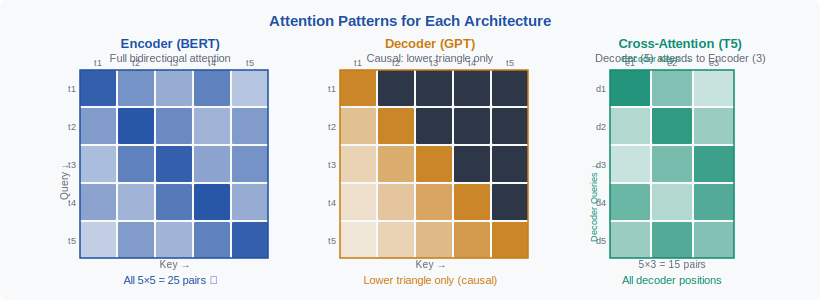
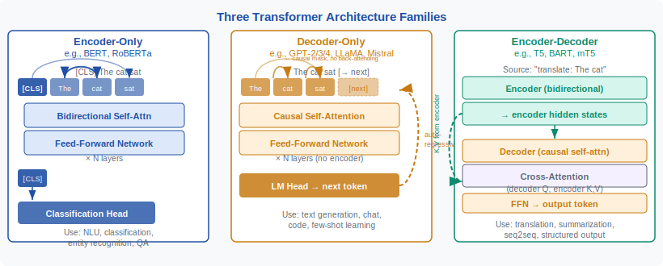
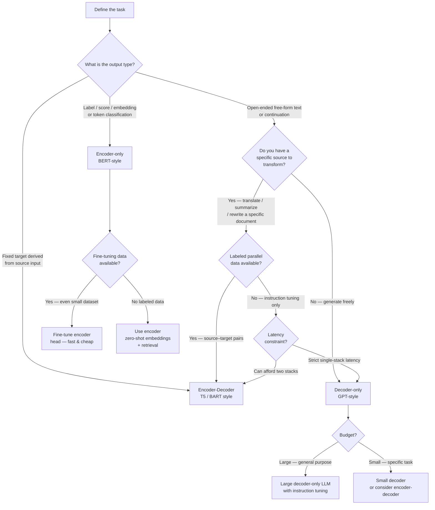

<div align="center">

[🏠 Home](../../README.md) &nbsp;•&nbsp; [📚 Section 1 — Transformer Architecture](./README.md) &nbsp;•&nbsp; [⬅️ Q9 — Multi-Head Attention](./q09-multi-head-attention.md) &nbsp;•&nbsp; [Q11 — Attention Complexity ➡️](./q11-attention-complexity.md)

</div>

---

# Q10 · What is the difference between encoder-only (BERT), decoder-only (GPT), and encoder-decoder (T5) architectures? When would you choose each?

<div align="center">


</div>

---

> [!IMPORTANT]
> **20-Second Answer:** BERT reads, GPT writes, T5 reads then writes. The single most important difference is the **attention mask**: encoder-only uses a full bidirectional mask so every token sees every other token; decoder-only uses a causal (triangular) mask so each token sees only past tokens; encoder-decoder uses a full mask in the encoder and a causal mask in the decoder, with cross-attention connecting them. Choose encoder-only for understanding tasks (classification, retrieval, extraction), decoder-only for open-ended generation and prompting, and encoder-decoder for source-conditioned sequence transformation (translation, summarization).

---

## Table of Contents

1. [Executive Interview Answer](#1-executive-interview-answer)
2. [First Principles: The Attention Mask Is the Architecture](#2-first-principles-the-attention-mask-is-the-architecture)
3. [Three Probability Views](#3-three-probability-views)
4. [Encoder-Only Transformers — BERT-style](#4-encoder-only-transformers--bert-style)
5. [Decoder-Only Transformers — GPT-style](#5-decoder-only-transformers--gpt-style)
6. [Encoder-Decoder Transformers — T5-style](#6-encoder-decoder-transformers--t5-style)
7. [Architecture Decision Framework](#7-architecture-decision-framework)
8. [Full Comparison Table](#8-full-comparison-table)
9. [PyTorch Implementation — Attention Masks](#9-pytorch-implementation--attention-masks)
10. [Worked Numerical Example](#10-worked-numerical-example)
11. [Practical System Design Trade-offs](#11-practical-system-design-trade-offs)
12. [Top-Lab Interview Answer Templates](#12-top-lab-interview-templates)
13. [Common Follow-up Questions](#13-common-follow-up-questions)
14. [Misconceptions Cheat Sheet](#14-misconceptions-cheat-sheet)
15. [Final Cheat Sheet & References](#15-final-cheat-sheet--references)

---

## 1. Executive Interview Answer

A senior AI researcher-level answer covers three axes simultaneously: **mechanism** (what the attention mask does), **objective** (what distribution the model is trained on), and **use case** (what product constraints drive the choice).

Encoder-only models like BERT are optimized for **understanding** an input using bidirectional self-attention. Every token can attend to every other token in both directions, which means the representation of any token is conditioned on the complete context. This makes them excellent feature extractors but poor native generators.

Decoder-only models like GPT are optimized for **generating** the next token using causal self-attention. Each token can only attend to the tokens that came before it, matching the left-to-right factorization of autoregressive generation. Training is massively scalable because every token position in a document is simultaneously a next-token prediction example.

Encoder-decoder models like T5 split the problem: the **encoder reads** the source sequence bidirectionally, and the **decoder writes** the target sequence autoregressively while querying the encoder's representations through cross-attention. This separation of reading and writing gives strong controllability over source-conditioned generation tasks like translation or summarization.

The deeper insight is that these are not just model names — they are distinct **information-flow policies**. The policy is encoded in the attention mask, and the mask determines what probability distribution the model can tractably represent and optimize.

---

## 2. First Principles: The Attention Mask Is the Architecture

A transformer receives a sequence of tokens $x_1, x_2, \ldots, x_n$. Each token is embedded into a vector, and self-attention lets every token query all other tokens to build a contextualized representation. The critical design choice is: **which tokens are allowed to attend to which other tokens?**

The answer is encoded in the **attention mask** $M \in \{0, -\infty\}^{n \times n}$, applied before the softmax:

$$\text{Attention}(Q, K, V) = \text{softmax}\!\left(\frac{QK^\top}{\sqrt{d_k}} + M\right)V$$

When $M_{ij} = 0$, token $i$ can attend to token $j$. When $M_{ij} = -\infty$, the softmax contribution from position $j$ becomes zero — the connection is blocked.

<div align="center">

<br/><em>Figure 2 — Left: encoder full mask (all tokens attend to all). Center: decoder causal mask (each token attends only left). Right: encoder-decoder showing both masks plus cross-attention arrows.</em>
</div>

The **three mask patterns** map directly to the three architectures:

| Architecture | Mask Shape | Information Flow |
|---|---|---|
| Encoder-only | Full square (all ones) | Every token ↔ every token |
| Decoder-only | Lower triangular | Every token → past tokens only |
| Encoder-decoder | Encoder: full square; Decoder: lower triangular + cross-attention | Encoder is bidirectional; decoder attends left + full encoder output |

> [!NOTE]
> A school analogy: encoder-only is a student who reads the entire passage before answering; decoder-only is a student who must write one word at a time without looking ahead; encoder-decoder is a student who reads a source passage fully, then writes a translation or summary step by step.

The mask is not just an implementation detail — it enforces the **probability factorization** the model can express, which is why architecture choice is fundamentally about choosing the right statistical structure for your task.

---

## 3. Three Probability Views

The cleanest research-level distinction between the three families is **what probability distribution they model**. This determines training objective, data efficiency, and task alignment.

**Encoder-only — Representation learning.** The model does not define an explicit joint distribution over sequences. Instead, it is trained with a masked language model (MLM) objective:

$$\mathcal{L}_{\text{MLM}} = -\sum_{i \in \mathcal{M}} \log p(x_i \mid x_{\setminus \mathcal{M}})$$

where $\mathcal{M}$ is the set of masked positions. The goal is to learn rich contextual embeddings $h_i = f_\theta(x)_i$ rather than to model the sequence distribution directly.

**Decoder-only — Autoregressive generation.** The model explicitly factorizes the joint sequence distribution left to right:

$$p(x) = \prod_{t=1}^{n} p(x_t \mid x_1, \ldots, x_{t-1})$$

Every token in a raw text document becomes a training example simultaneously, making data utilization extremely efficient. This factorization also directly matches the inference procedure for free-form generation.

**Encoder-decoder — Conditional generation.** The model factorizes the conditional distribution of a target sequence $y$ given a source sequence $x$:

$$p(y \mid x) = \prod_{t=1}^{m} p(y_t \mid y_1, \ldots, y_{t-1},\, \text{Enc}(x))$$

The encoder computes $\text{Enc}(x)$, a set of contextual vectors over the source, and the decoder generates $y$ autoregressively while cross-attending to those vectors at every step. The source and target vocabularies can even differ (e.g., different languages).

> [!TIP]
> In an interview, stating the probability factorization directly signals research-level depth. Most candidates describe the attention mask; fewer connect it to the statistical objective. Leading with the factorization and then explaining the mask as its implementation is a strong pattern.

---

## 4. Encoder-Only Transformers — BERT-style

<div align="center">

<br/><em>Figure 1 — Three transformer architectures side by side. Left: encoder-only (BERT) with bidirectional self-attention. Center: decoder-only (GPT) with causal self-attention. Right: encoder-decoder (T5) with separate stacks and cross-attention.</em>
</div>

**Core idea.** The encoder stack applies bidirectional self-attention repeatedly. For an input sequence like "The bank approved my loan", the representation of "bank" after several layers has been updated by attending to both "The" on its left and "approved my loan" on its right. This allows the model to resolve "bank" as a financial institution rather than a riverbank — a disambiguation that requires right context.

**Architecture details.** Each encoder layer contains a multi-head bidirectional self-attention sublayer followed by a position-wise feed-forward network. Layer normalization and residual connections wrap each sublayer. The output is one contextualized vector $h_i \in \mathbb{R}^d$ per input token, plus a pooled representation (typically the `[CLS]` token embedding) for sequence-level tasks.

**Pretraining.** BERT introduced deep bidirectional pretraining at scale via two objectives: masked language modeling (predict randomly masked tokens using surrounding context) and next sentence prediction (predict whether two segments are consecutive). The bidirectional masking pattern is what makes MLM possible — you need future tokens visible during training to predict a masked token from both sides. Subsequent models (RoBERTa, DeBERTa) refined the recipe significantly but retained the bidirectional masked pretraining core.

**Strengths and limitations.** Encoder-only models produce high-quality token and sequence embeddings, making them excellent for classification, named entity recognition, question answering (extract span from context), semantic similarity, retrieval, and reranking. Their main limitation is that they are not **naturally generative**: the training objective predicts only masked tokens, not full sequences, so adapting them to free-form generation requires non-trivial modifications. They are also not suited to tasks requiring very long target sequences.

> [!NOTE]
> BERT is not obsolete. Even in the era of large decoder-only LLMs, encoder models like `bge-large`, `e5-mistral`, and `ModernBERT` remain state-of-the-art for dense retrieval, reranking, and token classification — often at a fraction of the inference cost of a large LLM.

**Representative models:** BERT (Devlin et al., 2019), RoBERTa, ALBERT, DeBERTa, ELECTRA, ModernBERT, GTE, BGE, E5.

---

## 5. Decoder-Only Transformers — GPT-style

**Core idea.** The decoder stack applies causal self-attention so that token $t$ can attend only to tokens $1, \ldots, t$. Given a prompt like "Explain photosynthesis in simple words:", the model generates the next token by sampling from $p(x_{t+1} \mid x_1, \ldots, x_t)$, appends it, and repeats. The causal mask is enforced by setting $M_{ij} = -\infty$ for all $j > i$ before the softmax.

**Why next-token prediction is so powerful.** The autoregressive factorization turns every token in every document on the internet into a training signal. A document with $n$ tokens provides $n$ next-token prediction examples simultaneously via teacher forcing — no labeling required. At 100B+ training tokens, this creates an enormous and essentially free supervised signal, which is the core scalability advantage of the GPT paradigm.

**KV cache.** During inference, after generating token $t$, the key and value matrices $K_i, V_i$ for all previous positions $i < t$ do not need to be recomputed. The KV cache stores these tensors and appends new entries as generation proceeds. This reduces the per-step compute from $O(t \cdot d)$ to $O(d)$ — crucial for practical generation latency. The cache grows linearly with sequence length and is a significant memory concern at long contexts.

**In-context learning.** Because the causal factorization makes the model a universal next-token predictor, it learns to recognize task patterns from a few examples in the prompt without any gradient update. Few-shot prompting, chain-of-thought reasoning, and instruction following all emerge from this single training objective. This unified interface for many tasks is a major practical advantage over task-specific encoder models.

**Strengths and limitations.** Decoder-only models excel at open-ended text generation, conversational agents, code completion, chain-of-thought reasoning, and any task that can be expressed as "continue this text". Their limitation is that the causal mask means representations are not bidirectional — a position cannot directly use future context. This can make them slightly less efficient than encoders for pure understanding/scoring tasks, though very large decoder-only models compensate with sheer capacity.

**Representative models:** GPT-2, GPT-3/4, LLaMA 1/2/3, Mistral, Gemma, Phi, Falcon, Claude (Anthropic), Gemini.

---

## 6. Encoder-Decoder Transformers — T5-style

**Core idea.** Two separate transformer stacks — an encoder and a decoder — are connected by **cross-attention**. The encoder processes the full source sequence bidirectionally, producing a set of context vectors $\{h_1^{\text{enc}}, \ldots, h_n^{\text{enc}}\}$. The decoder generates the target sequence autoregressively. At each decoding step $t$, the decoder uses causal self-attention over generated target tokens, then cross-attends to all encoder outputs to incorporate source information:

$$\text{CrossAttention}(Q_t^{\text{dec}},\, K^{\text{enc}},\, V^{\text{enc}}) = \text{softmax}\!\left(\frac{Q_t^{\text{dec}} (K^{\text{enc}})^\top}{\sqrt{d_k}}\right) V^{\text{enc}}$$

The queries come from the decoder (what does the decoder want to know?), while keys and values come from the encoder (what did the source contain?). This lets the decoder soft-select the most relevant source positions at every generation step.

**T5's text-to-text framing.** Raffel et al. (2020) showed that virtually any NLP task can be expressed as a text-to-text transformation: translation, summarization, classification ("sentiment: ..." → "positive"), QA, and more. This unification allowed a single model architecture and training recipe to tackle a wide range of benchmarks, and it remains an influential design philosophy.

**BART variant.** BART (Lewis et al., 2019) uses a similar encoder-decoder structure but with a denoising pretraining objective: the encoder receives a corrupted document (token deletion, masking, shuffling) and the decoder reconstructs the original. This makes BART especially strong for generation tasks like summarization and dialogue.

**Strengths and limitations.** Encoder-decoder models are strong for **source-conditioned generation** where the output must be grounded in a specific input: machine translation, abstractive summarization, data-to-text, document question answering. The explicit separation of source reading and target writing provides strong controllability. The limitation is architectural complexity: two stacks plus cross-attention layers increase parameter count, memory, and deployment complexity relative to a single decoder-only stack. KV caching must be maintained for both the decoder's self-attention and the cross-attention.

> [!TIP]
> For a fixed parameter budget, encoder-decoder models often outperform decoder-only models on conditional generation benchmarks, particularly when labeled source-target pairs are available. The split architecture is a strong inductive bias for transformation tasks.

**Representative models:** T5, mT5, T5v1.1, FLAN-T5, BART, mBART, Pegasus, UL2, Flan-UL2.

---

## 7. Architecture Decision Framework

The choice of architecture should be driven by **product constraints**, not benchmark tables. The following flowchart encodes the key decision variables.



> [!IMPORTANT]
> The decision is never purely architectural — always weigh: (1) output format (label vs. sequence), (2) labeled data volume, (3) latency budget, (4) grounding requirements (must output stay close to source?), (5) deployment complexity tolerance.

**Heuristic summary:**
- **Understanding / scoring / retrieval** → encoder-only (fast, efficient, strong embeddings)
- **Open-ended generation / agents / chat** → decoder-only (scalable, in-context learning)
- **Source-to-target transformation** → encoder-decoder (strong grounding, data-efficient)
- **Low-resource classification** → encoder-only with fine-tuning (needs fewer labeled examples than decoder-only prompting)
- **Unified general model** → large decoder-only (versatile but expensive)

---

## 8. Full Comparison Table

| Property | Encoder-Only (BERT) | Decoder-Only (GPT) | Encoder-Decoder (T5) |
|---|---|---|---|
| **Attention type** | Bidirectional self-attention | Causal (triangular) self-attention | Encoder: bidirectional; Decoder: causal + cross-attention |
| **Information flow** | Every token ↔ every token | Every token → past tokens only | Encoder: all-to-all; Decoder: left + full source |
| **Training objective** | Masked LM (predict masked tokens) | Next-token prediction (causal LM) | Conditional LM / denoising (predict target from source) |
| **Probability model** | Representation $h_i = f(x)$ | $p(x) = \prod p(x_t \mid x_{<t})$ | $p(y \mid x) = \prod p(y_t \mid y_{<t}, \text{Enc}(x))$ |
| **Output** | Token embeddings + [CLS] pooling | Next-token logits → generated sequence | Generated target sequence |
| **Native generation** | No — not left-to-right generative | Yes — autoregressive by design | Yes — conditional autoregressive |
| **KV cache** | Not needed (single forward pass) | Yes — decoder positions cached | Yes — decoder self-attn + cross-attn cached |
| **Pretraining data** | Unlabeled text (MLM) | Raw text (next-token pred.) | Source-target pairs or unlabeled with span corruption |
| **Fine-tuning data needed** | Small labeled dataset sufficient | Prompting possible; instruction tuning for reliability | Parallel source-target pairs highly effective |
| **Latency profile** | Fast scoring (one forward pass) | Grows with output length (sequential) | Encoder fast; decoder sequential |
| **Parameter efficiency** | High for understanding tasks | High for generation; may need large model for understanding | Often data-efficient for seq2seq tasks |
| **Typical tasks** | Classification, NER, QA (span), retrieval, reranking | Chat, code gen, reasoning, in-context learning | Translation, summarization, data-to-text, rewriting |
| **Representative models** | BERT, RoBERTa, DeBERTa, ModernBERT | GPT-2/3/4, LLaMA, Mistral, Gemma, Claude | T5, FLAN-T5, BART, Pegasus, UL2 |
| **Scale trend** | Leveled off around 1B params for most tasks | Scales strongly to 100B+ | Scales well; FLAN-T5-XXL (11B) very competitive |
| **Deployment complexity** | Low — single stack, no KV cache | Medium — KV cache management | High — two stacks, two KV caches, cross-attention |
| **Cross-attention** | None | None | Yes — decoder queries encoder keys/values |

> [!NOTE]
> The table reflects architectural strengths, not absolute benchmarks. A 70B decoder-only LLM can outperform a small encoder on classification, but a well-tuned 110M BERT is often more cost-effective for high-throughput production classification.

---

## 9. PyTorch Implementation — Attention Masks

The three attention patterns reduce to three different mask matrices. The code below shows how to construct each and apply them inside a scaled dot-product attention function, making the architectural difference concrete and runnable.

```python
import torch
import torch.nn.functional as F
import math


def scaled_dot_product_attention(
    Q: torch.Tensor,
    K: torch.Tensor,
    V: torch.Tensor,
    mask: torch.Tensor | None = None,
) -> tuple[torch.Tensor, torch.Tensor]:
    """
    Args:
        Q: (batch, heads, seq_q, d_k)
        K: (batch, heads, seq_k, d_k)
        V: (batch, heads, seq_k, d_v)
        mask: (batch, 1, seq_q, seq_k) or (1, 1, seq_q, seq_k)
              Additive mask — use 0.0 to allow, -inf to block.
    Returns:
        output: (batch, heads, seq_q, d_v)
        weights: (batch, heads, seq_q, seq_k)
    """
    d_k = Q.size(-1)
    scores = torch.matmul(Q, K.transpose(-2, -1)) / math.sqrt(d_k)  # (B, H, q, k)
    if mask is not None:
        scores = scores + mask  # additive: -inf blocked, 0.0 allowed
    weights = F.softmax(scores, dim=-1)
    output = torch.matmul(weights, V)
    return output, weights


# ─── 1. Encoder-only (BERT): full bidirectional mask ──────────────────────────

def make_encoder_mask(seq_len: int) -> torch.Tensor:
    """All tokens can attend to all tokens. Returns all-zeros mask."""
    # Shape: (1, 1, seq_len, seq_len) — broadcast over batch and heads
    return torch.zeros(1, 1, seq_len, seq_len)


# ─── 2. Decoder-only (GPT): causal (lower-triangular) mask ────────────────────

def make_causal_mask(seq_len: int) -> torch.Tensor:
    """Token t can attend only to positions 0..t. Future positions blocked."""
    # tril gives lower triangle (including diagonal) = allowed positions
    mask = torch.tril(torch.ones(seq_len, seq_len))
    # Convert: 1 -> 0.0 (allowed), 0 -> -inf (blocked)
    mask = mask.masked_fill(mask == 0, float("-inf")).masked_fill(mask == 1, 0.0)
    return mask.unsqueeze(0).unsqueeze(0)  # (1, 1, seq_len, seq_len)


# ─── 3. Encoder-decoder (T5): cross-attention mask ────────────────────────────
# Encoder uses make_encoder_mask (full).
# Decoder self-attention uses make_causal_mask (lower triangular).
# Cross-attention: decoder queries (seq_tgt) attend to all encoder keys (seq_src).

def make_cross_attention_mask(seq_tgt: int, seq_src: int) -> torch.Tensor:
    """Every decoder position can attend to every encoder position."""
    return torch.zeros(1, 1, seq_tgt, seq_src)


# ─── Demonstration ────────────────────────────────────────────────────────────

if __name__ == "__main__":
    B, H, D_K, D_V = 2, 8, 64, 64

    def random_qkv(seq_q: int, seq_k: int):
        Q = torch.randn(B, H, seq_q, D_K)
        K = torch.randn(B, H, seq_k, D_K)
        V = torch.randn(B, H, seq_k, D_V)
        return Q, K, V

    SEQ = 6

    # --- Encoder-only: bidirectional -----------------------------------------
    Q, K, V = random_qkv(SEQ, SEQ)
    enc_mask = make_encoder_mask(SEQ)
    out_enc, w_enc = scaled_dot_product_attention(Q, K, V, mask=enc_mask)
    print("Encoder-only output shape:", out_enc.shape)       # (2, 8, 6, 64)
    print("Attention weight row 0:\n", w_enc[0, 0, 0])       # non-zero everywhere

    # --- Decoder-only: causal -------------------------------------------------
    Q, K, V = random_qkv(SEQ, SEQ)
    causal_mask = make_causal_mask(SEQ)
    out_dec, w_dec = scaled_dot_product_attention(Q, K, V, mask=causal_mask)
    print("\nDecoder-only output shape:", out_dec.shape)      # (2, 8, 6, 64)
    print("Causal mask (6x6):\n", causal_mask.squeeze())
    # Upper triangle should be 0 in softmax weights
    assert (w_dec[0, 0] * (1 - torch.tril(torch.ones(SEQ, SEQ)))).abs().max() < 1e-6
    print("Causal mask check passed: upper triangle weights are zero.")

    # --- Encoder-decoder: cross-attention ------------------------------------
    SEQ_SRC, SEQ_TGT = 8, 5
    Q, _, _ = random_qkv(SEQ_TGT, SEQ_SRC)   # decoder queries
    _, K, V = random_qkv(SEQ_TGT, SEQ_SRC)   # encoder keys and values
    cross_mask = make_cross_attention_mask(SEQ_TGT, SEQ_SRC)
    out_cross, w_cross = scaled_dot_product_attention(Q, K, V, mask=cross_mask)
    print("\nCross-attention output shape:", out_cross.shape)  # (2, 8, 5, 64)
    print("Cross-attn weight shape:", w_cross.shape)           # (2, 8, 5, 8)
    print("All decoder positions attend to all encoder positions:",
          (w_cross > 0).all().item())
```

> [!TIP]
> Notice that the only change between the three architectures is the **mask tensor passed to the same attention function**. The mechanism is identical — it is the information policy (mask) that defines the architecture. This is worth saying explicitly in an interview.

The code also illustrates why encoder-only models do not need a KV cache: the full input is processed in a single forward pass, so there is no incremental generation loop. Decoder-only and encoder-decoder models require a KV cache because they generate token by token.

---

## 10. Worked Numerical Example

We trace the attention computation for a tiny 4-token sequence: **"The cat sat mat"** (tokens $t_1, t_2, t_3, t_4$) using a single attention head with $d_k = 2$ for clarity.

**Setup.** Let the query and key vectors (post-projection) be:

$$Q = K = \begin{bmatrix} 1 & 0 \\ 0 & 1 \\ 1 & 1 \\ 0 & 0 \end{bmatrix}, \quad V = \begin{bmatrix} v_1 \\ v_2 \\ v_3 \\ v_4 \end{bmatrix}$$

Raw attention scores: $S = QK^\top / \sqrt{2}$

$$QK^\top = \begin{bmatrix}
1 & 0 & 1 & 0 \\
0 & 1 & 1 & 0 \\
1 & 1 & 2 & 0 \\
0 & 0 & 0 & 0
\end{bmatrix}, \quad S = \frac{1}{\sqrt{2}} \begin{bmatrix}
1 & 0 & 1 & 0 \\
0 & 1 & 1 & 0 \\
1 & 1 & 2 & 0 \\
0 & 0 & 0 & 0
\end{bmatrix} \approx \begin{bmatrix}
0.71 & 0 & 0.71 & 0 \\
0 & 0.71 & 0.71 & 0 \\
0.71 & 0.71 & 1.41 & 0 \\
0 & 0 & 0 & 0
\end{bmatrix}$$

**Case A — Encoder-only (full mask, $M = \mathbf{0}$).**

No masking is applied. Softmax row 1 (token $t_1$ = "The"):

$$\text{softmax}([0.71,\ 0,\ 0.71,\ 0]) = \frac{[e^{0.71}, e^0, e^{0.71}, e^0]}{e^{0.71}+1+e^{0.71}+1} \approx \frac{[2.03, 1.00, 2.03, 1.00]}{6.06} \approx [0.34, 0.16, 0.34, 0.16]$$

Token $t_1$ attends to all four tokens, including $t_3$ ("sat") which appears after it. This captures bidirectional context.

**Case B — Decoder-only (causal mask).**

For token $t_1$ (first position), the causal mask blocks positions $j > 1$:

$$M[1,:] = [0, -\infty, -\infty, -\infty]$$

After adding the mask: $[0.71 + 0,\ 0 - \infty,\ 0.71 - \infty,\ 0 - \infty] = [0.71, -\infty, -\infty, -\infty]$

$$\text{softmax}([0.71, -\infty, -\infty, -\infty]) = [1.0, 0, 0, 0]$$

Token $t_1$ can only attend to itself. For token $t_3$ ("sat"), the causal mask allows positions $j \leq 3$:

$$M[3,:] = [0, 0, 0, -\infty]$$

After masking: $[0.71, 0.71, 1.41, -\infty]$

$$\text{softmax}([0.71, 0.71, 1.41]) \approx [0.22, 0.22, 0.56]\ (\text{renormalized over 3 positions})$$

Token $t_3$ attends to $t_1$, $t_2$, and itself, but **not** $t_4$. This is the autoregressive information policy.

**Case C — Encoder-decoder cross-attention.**

Suppose the decoder is at step $t_1^{\text{dec}}$ generating the first target token. The decoder queries $Q^{\text{dec}}$ attend to all encoder keys $K^{\text{enc}}$:

$$M_{\text{cross}} = \mathbf{0}_{1 \times 4}$$

$$\text{softmax}([0.71, 0.71, 1.41, 0]) \approx [0.20, 0.20, 0.40, 0.15] \cdot \text{(example values)}$$

The decoder step can draw information from **any** source position. In a translation model, generating the first German word can attend to any English source word.

> [!NOTE]
> The numerical example shows concretely why encoder representations are richer for understanding (every token uses full context) and why causal models can only condition on what has been generated so far. The cross-attention case shows how the decoder continuously re-reads the source throughout generation, not just at the first step.

**Full 4-token attention weight matrices** (rows = query token, columns = key token):

| | $t_1$ | $t_2$ | $t_3$ | $t_4$ |
|---|---|---|---|---|
| **Encoder row $t_1$** | 0.34 | 0.16 | 0.34 | 0.16 |
| **Encoder row $t_3$** | 0.22 | 0.22 | 0.43 | 0.13 |
| **Decoder row $t_1$** | **1.00** | 0 | 0 | 0 |
| **Decoder row $t_3$** | 0.22 | 0.22 | **0.56** | 0 |

The zeros in the decoder rows enforce the causal constraint. The encoder weights are dense in all positions, reflecting bidirectional context.

---

## 11. Practical System Design Trade-offs

**Latency.** Encoder-only models process the entire input in a single forward pass, so latency is $O(n^2 d)$ and is fixed for a given input length. Decoder-only generation latency grows with output length $m$: total cost is $O(m \cdot n^2 d)$ if we count the encoder-equivalent cost, though KV caching reduces per-step cost to $O(n d)$. For high-throughput classification or retrieval, encoder-only models can be 5–50x faster than generating a label string with a decoder-only LLM.

**Throughput and serving.** Decoder-only LLMs benefit from several optimizations: KV caching, paged attention (vLLM), speculative decoding (a small draft model proposes tokens, the large model verifies in parallel), continuous batching. Encoder-decoder systems require maintaining two sets of KV caches and scheduling encoder and decoder computations. Encoder-only models have the simplest serving story — a standard batched forward pass, no cache management.

**Fine-tuning data requirements.** A BERT-style encoder fine-tuned on as few as 1,000 labeled examples can reach strong performance on many classification tasks. Decoder-only models can solve tasks via prompting (zero-shot or few-shot) without any gradient update, but reliable behavior often requires instruction tuning on thousands of examples, or RLHF/DPO for alignment. Encoder-decoder models like FLAN-T5 can be fine-tuned on modest labeled datasets for seq2seq tasks and often outperform larger decoder-only models on structured generation.

**Grounding and controllability.** When the output must stay tightly grounded in a specific source document (e.g., a medical record or legal clause), encoder-decoder models have an architectural advantage: the source is encoded separately, and cross-attention provides a differentiable alignment mechanism. Decoder-only models can be grounded via retrieval-augmented generation (RAG) or long-context prompting, but the source is mixed into the same token stream as the generated output, making it harder to enforce strict attribution.

**Representation quality for retrieval.** Even very large decoder-only models produce lower-quality dense embeddings than purpose-trained encoders, unless they are specifically adapted (e.g., via contrastive training as in E5-Mistral). For dense retrieval pipelines (FAISS, Annoy, ScaNN), encoder-only models remain the industry standard for the embedding component, even when a decoder-only LLM is used for generation in the same system.

> [!WARNING]
> A common mistake in system design interviews is to default to a large decoder-only LLM for every task. Presenting a principled argument for using a small encoder when latency and throughput constraints are tight — and quantifying the cost difference — demonstrates senior-level thinking.

---

## 12. Top-Lab Interview Templates

### 30-Second Answer

Encoder-only models like BERT are bidirectional readers: every input token can attend to every other token, making them ideal for understanding tasks like classification, named entity recognition, and dense retrieval. Decoder-only models like GPT are causal writers: each token attends only to previous tokens, which matches autoregressive generation of free-form text. Encoder-decoder models like T5 combine both: the encoder reads the source bidirectionally, and the decoder writes the target step by step using cross-attention to consult the encoded source. My choice depends on the task — understanding goes to encoder-only, open-ended generation to decoder-only, and source-to-target transformation to encoder-decoder.

### 2-Minute Senior Researcher Answer

The deepest distinction is the model's **information policy**, encoded in the attention mask. In BERT, the mask is full (all-to-all), so representations are optimized for understanding a complete input — the training objective is masked LM, predicting $p(x_i \mid x_{\setminus \mathcal{M}})$. In GPT, the mask is causal (lower triangular), so the factorization matches autoregressive generation: $p(x) = \prod_t p(x_t \mid x_{<t})$. In T5, the encoder and decoder separate source understanding from target generation: $p(y \mid x) = \prod_t p(y_t \mid y_{<t}, \text{Enc}(x))$.

That is why BERT is a strong feature extractor for classification and retrieval, GPT is a strong generator and in-context learner, and T5 is a strong conditional generator. In practice I would not choose by brand name but by product constraints. If the output is a label, score, or embedding, I reach for an encoder-only model — it is fast, data-efficient, and hard to beat on retrieval benchmarks. If the output is an open-ended continuation, I reach for a decoder-only LLM and exploit prompting or instruction tuning. If the task is a structured transformation from a specific source — translation, summarization, rewriting — I consider encoder-decoder, especially when parallel data is available or when I need strict grounding. I also weigh latency: encoder-only models have fixed single-pass latency; decoder-only generation scales with output length and needs KV cache management; encoder-decoder needs both encoder and decoder optimization. Modern decoder-only LLMs are very general, but specialized encoder or encoder-decoder models can still be meaningfully more efficient, controllable, or accurate for constrained tasks.

---

## 13. Common Follow-up Questions

<details>
<summary><strong>Q: Why did decoder-only models come to dominate modern large LLMs?</strong></summary>

Next-token prediction is uniquely scalable: every token in every raw text document is a training example, requiring no human labeling. A trillion-token internet corpus yields a trillion next-token prediction examples simultaneously via teacher forcing. Prompting also provides a unified interface: by framing any task as text completion, a single model can handle classification, translation, QA, code, and reasoning without task-specific heads. The causal factorization also aligns perfectly with generation inference, so there is no train-inference mismatch. Encoder-decoder models require parallel source-target data which is harder to obtain at trillion-token scale.

</details>

<details>
<summary><strong>Q: Is BERT obsolete?</strong></summary>

No. Decoder-only LLMs dominate general-purpose assistants and reasoning, but BERT-style encoders remain state-of-the-art for dense retrieval, reranking, token classification, and low-latency production classification systems. Models like ModernBERT, BGE, and E5 consistently top retrieval benchmarks and are far cheaper to serve than a large LLM for embedding use cases. The right framing is not "obsolete" but "specialized" — encoders are the best tool for understanding/retrieval, while decoder-only models dominate generation/reasoning.

</details>

<details>
<summary><strong>Q: Can GPT do classification?</strong></summary>

Yes. You can prompt a decoder-only LLM to output class labels as generated text, or fine-tune it with a linear head on the last-token representation. However, if the product requirement is high-throughput, low-latency classification, a fine-tuned encoder model is often 10–50x cheaper and equally accurate. Decoder-only classification also requires generating tokens sequentially (or running the full prompt through the model to score each class), whereas encoder classification is a single forward pass followed by a dot product.

</details>

<details>
<summary><strong>Q: Can T5 do classification?</strong></summary>

Yes. T5 converts classification into text-to-text: the input is "classify sentiment: The movie was great" and the target is the class label string "positive". This is architecturally elegant and allows multi-task learning across classification and generation. However, it is more computationally expensive than a small encoder classifier for high-volume inference, because it runs a full encoder-decoder stack and generates tokens rather than just producing a logit.

</details>

<details>
<summary><strong>Q: What exactly is cross-attention, and why does it matter?</strong></summary>

In standard self-attention, queries, keys, and values all come from the same sequence. Cross-attention breaks this symmetry: the **queries come from the decoder** (what does the decoder need to know right now?) while the **keys and values come from the encoder** (what information does the source provide?). Mathematically, $\text{CrossAttn}(Q^{\text{dec}}, K^{\text{enc}}, V^{\text{enc}})$. This lets the decoder, at every generation step, soft-select the most relevant source positions. Cross-attention is the mechanism that grounds the output in the source — without it, encoder-decoder would degenerate to a decoder-only model with a differently initialized prefix.

</details>

<details>
<summary><strong>Q: What is the most important implementation difference between the three architectures?</strong></summary>

The attention mask. Encoder-only: pass an all-zeros additive mask (or no mask at all). Decoder-only: pass a lower-triangular mask with $-\infty$ above the diagonal. Encoder-decoder: encoder uses full mask; decoder self-attention uses causal mask; cross-attention uses a full mask from decoder positions to encoder positions. Everything else — multi-head attention, feed-forward layers, layer norm, residuals — is identical across all three.

</details>

<details>
<summary><strong>Q: Can a decoder-only model be used as an encoder for embeddings?</strong></summary>

Yes, but with caveats. Because of the causal mask, the representation of token $t$ in a decoder-only model only aggregates information from positions $1, \ldots, t$ — not future tokens. To get a sequence embedding you typically take the last-token representation (as in GPT models) or average pool. This produces weaker bidirectional representations than a BERT encoder. Specialized training (E5-Mistral, GTE-Qwen) uses contrastive objectives to force decoder-only models to produce competitive embeddings, but this requires significant fine-tuning and is not "free" from pretraining.

</details>

---

## 14. Misconceptions Cheat Sheet

| Misconception | Correct View |
|---|---|
| "BERT cannot predict words at all." | BERT predicts masked tokens during training (MLM). It is not a left-to-right generator, but it does model $p(x_i \mid \text{context})$ for masked positions. |
| "GPT has no language understanding, only generation." | GPT learns rich contextual representations via next-token prediction. It can perform classification, QA, and reasoning — the interface is generative, not the capacity. |
| "Encoder-decoder is always better for summarization." | Large instruction-tuned decoder-only LLMs are excellent at summarization, especially with long contexts. Choice depends on data availability, latency, and grounding needs. |
| "Choose architecture purely by benchmark score." | Always weigh latency, memory, labeled data volume, output format, and deployment complexity alongside accuracy. |
| "BERT is obsolete because LLMs exist." | Encoder-only models remain SOTA for dense retrieval, reranking, and token classification — tasks where bidirectional representations and fast single-pass inference matter most. |
| "T5 is just BERT + GPT." | T5 is a unified text-to-text framework with a specific pretraining objective (span corruption), a shared vocabulary, and cross-attention connecting the two stacks. It is not a trivial combination. |
| "The attention mask is just a padding detail." | The attention mask is the architectural definition. It determines information flow, the probability factorization, and what tasks the model is natively suited for. |
| "Decoder-only models need no KV cache optimization." | Without KV caching, every generation step recomputes keys/values for all previous tokens — $O(t)$ per step, $O(t^2)$ total. KV caching is essential for practical inference. |

---

## 15. Final Cheat Sheet & References

```
┌─────────────────────────────────────────────────────────────────────────────┐
│  ARCHITECTURE    │ MASK         │ OBJECTIVE   │ BEST FOR                    │
├─────────────────────────────────────────────────────────────────────────────┤
│  Encoder-only    │ Full         │ Masked LM   │ Classification, retrieval,  │
│  (BERT)          │ (all ↔ all)  │ p(x_i|ctx)  │ NER, reranking, embeddings  │
├─────────────────────────────────────────────────────────────────────────────┤
│  Decoder-only    │ Causal       │ Next-token  │ Generation, chat, code,     │
│  (GPT)           │ (lower tri)  │ p(x_t|x<t)  │ reasoning, in-context learn │
├─────────────────────────────────────────────────────────────────────────────┤
│  Encoder-Decoder │ Full + Causal│ Conditional │ Translation, summarization, │
│  (T5 / BART)     │ + Cross-Attn │ p(y|x)      │ rewriting, data-to-text     │
└─────────────────────────────────────────────────────────────────────────────┘

Key formula:
  Encoder:   p(x_i | x_1...x_n, x≠i)        — bidirectional, MLM
  Decoder:   p(x_t | x_1, ..., x_{t-1})      — causal, autoregressive
  Enc-Dec:   p(y_t | y_<t, Enc(x_1...x_n))   — conditional, cross-attention

Decision rule:
  Output = label/embedding?        → Encoder-only
  Output = free-form continuation? → Decoder-only
  Output = transformation of src?  → Encoder-Decoder
```

### References

1. Vaswani, A., Shazeer, N., Parmar, N., et al. (2017). **Attention Is All You Need.** *NeurIPS 2017.* [arXiv:1706.03762](https://arxiv.org/abs/1706.03762)

2. Devlin, J., Chang, M.-W., Lee, K., & Toutanova, K. (2019). **BERT: Pre-training of Deep Bidirectional Transformers for Language Understanding.** *NAACL 2019.* [arXiv:1810.04805](https://arxiv.org/abs/1810.04805)

3. Radford, A., Narasimhan, K., Salimans, T., & Sutskever, I. (2018). **Improving Language Understanding by Generative Pre-Training.** OpenAI Blog. [PDF](https://cdn.openai.com/research-covers/language-unsupervised/language_understanding_paper.pdf)

4. Radford, A., Wu, J., Child, R., et al. (2019). **Language Models are Unsupervised Multitask Learners.** OpenAI Blog. [PDF](https://cdn.openai.com/better-language-models/language_models_are_unsupervised_multitask_learners.pdf)

5. Brown, T., Mann, B., Ryder, N., et al. (2020). **Language Models are Few-Shot Learners.** *NeurIPS 2020.* [arXiv:2005.14165](https://arxiv.org/abs/2005.14165)

6. Raffel, C., Shazeer, N., Roberts, A., et al. (2020). **Exploring the Limits of Transfer Learning with a Unified Text-to-Text Transformer.** *JMLR 2020.* [arXiv:1910.10683](https://arxiv.org/abs/1910.10683)

7. Lewis, M., Liu, Y., Goyal, N., et al. (2019). **BART: Denoising Sequence-to-Sequence Pre-training for Natural Language Generation, Translation, and Comprehension.** [arXiv:1910.13461](https://arxiv.org/abs/1910.13461)

---

<div align="center">

[🏠 Home](../../README.md) &nbsp;•&nbsp; [📚 Section 1 — Transformer Architecture](./README.md) &nbsp;•&nbsp; [⬅️ Q9 — Multi-Head Attention](./q09-multi-head-attention.md) &nbsp;•&nbsp; [Q11 — Attention Complexity ➡️](./q11-attention-complexity.md)

</div>
