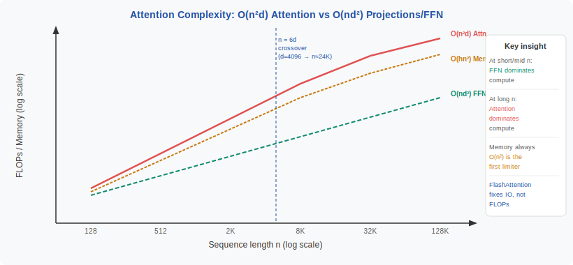
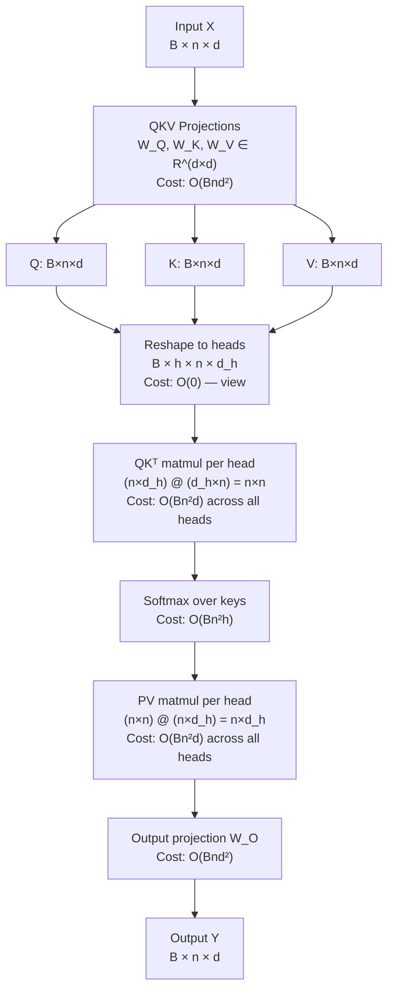
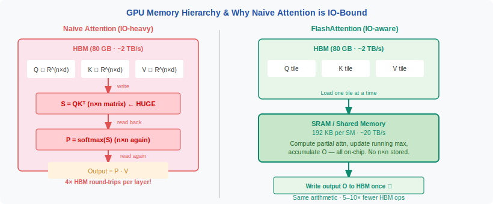

<!-- ============================ TOP NAV ============================ -->
<div align="center">

[🏠 Home](../../README.md) &nbsp;•&nbsp; [📚 Section 1 — Transformer Architecture](./README.md) &nbsp;•&nbsp; [⬅️ Q10 — Encoder vs Decoder](./q10-encoder-decoder.md) &nbsp;•&nbsp; [Q12 — MHA & Interpretability ➡️](./q12-mha-interpretability.md)

</div>

---

# Q11 · Derive the computational and memory complexity of self-attention. Where does the O(n²) bottleneck actually hurt — compute or memory bandwidth?

<div align="center">


·memory·FlashAttention·IO--awareness-0e8a6e)


</div>

> [!IMPORTANT]
> **The 20-second answer.** Self-attention is O(n²d) in **compute** and O(Bn²h) in **memory** where n is sequence length, d is model dimension, h is number of heads, B is batch size. The quadratic term comes from forming all n×n pairs of query–key dot products. But for typical sequence lengths and model sizes, the **real bottleneck is not raw compute — it is memory bandwidth**: the n×n attention score matrix must be written to and read from slow GPU HBM repeatedly (for softmax, then for the PV matmul), making attention IO-bound long before it becomes compute-bound. FlashAttention does not reduce the O(n²) FLOPs; it eliminates most of the HBM round-trips by keeping tiles in fast SRAM. Compute only overtakes FFN as the dominant cost when n > ~6d.

---

## Table of contents

1. [First principles: the all-pairs relationship](#1--first-principles-the-all-pairs-relationship)
2. [The problem, told as a story](#2--the-problem-told-as-a-story)
3. [Full complexity derivation](#3--full-complexity-derivation)
4. [Memory complexity](#4--memory-complexity)
5. [The honest answer: compute or memory bandwidth?](#5--the-honest-answer-compute-or-memory-bandwidth)
6. [Component comparison table](#6--component-comparison-table)
7. [Algorithm and pseudocode: naive vs tiled](#7--algorithm-and-pseudocode-naive-vs-tiled)
8. [PyTorch code: naive vs FlashAttention](#8--pytorch-code-naive-vs-flashattention)
9. [Worked example: n=4096, d=4096, h=32, batch=1](#9--worked-example-n4096-d4096-h32-batch1)
10. [Where it actually hurts in practice](#10--where-it-actually-hurts-in-practice)
11. [FlashAttention and sub-quadratic alternatives](#11--flashattention-and-sub-quadratic-alternatives)
12. [Interview drill: the follow-ups they'll ask](#12--interview-drill-the-follow-ups-theyll-ask)
13. [Common misconceptions](#13--common-misconceptions)
14. [One-screen summary](#14--one-screen-summary)
15. [References](#15--references)

---

## 1 · First principles: the all-pairs relationship

Before any matrix algebra, lock in the core combinatorial fact.

Self-attention answers the question: **"For each position in the sequence, how much should it attend to every other position?"** That framing already contains the complexity: if there are n positions, there are **n × n = n² pairs** to evaluate. There is no way around this in exact, full attention — it is baked into the problem statement, not an artifact of the algorithm.

Think of it as a classroom exercise. Imagine n students standing in a circle, and each student must cast a vote for every other student (including themselves). The number of votes is n² — this grows quadratically with the class size.

| Class size n | Number of pairs n² |
|---|---|
| 16 | 256 |
| 128 | 16,384 |
| 1,024 | 1,048,576 (≈1M) |
| 4,096 | 16,777,216 (≈16M) |
| 32,768 | 1,073,741,824 (≈1B) |

The matrix $QK^\top$ is exactly this voting table — entry $(i,j)$ is the raw score of how much position $i$ attends to position $j$. Forming it is the **quadratic source**.

> [!NOTE]
> **Why not just compute the top-k scores per query?** That is exactly what sparse and linear attention methods try — but exact top-k requires seeing all n scores first, and approximate methods sacrifice quality. The quadratic cost of exact attention is a fundamental price for the expressiveness of attending to any position.

---

## 2 · The problem, told as a story

A model is deployed and works great at n=128. It is extended to n=4096 and training slows dramatically. At n=32768 the run crashes with an out-of-memory (OOM) error. The engineer asks: **why?**

The answer is not that the forward pass logic changed. Nothing in the algorithm changed. What changed is that the all-pairs score matrix grew from 128×128 = 16K entries to 4096×4096 = 16M entries — a **1000× increase for a 32× increase in sequence length**. And for n=32768, the matrix per head is 32768² × 2 bytes (BF16) ≈ **2 GB per head** — for a 32-head model, that is 64 GB just for the score matrices, before any activations or parameters.

<div align="center">

<br><sub><b>Figure 1.</b> As n grows, the O(n²) attention term eventually overtakes the O(n) projection and FFN terms. The crossover point and the OOM cliff both depend on d, h, and available GPU memory.</sub>
</div>

This story has two distinct failure modes, and understanding them separately is the key interview insight:

1. **Memory OOM**: the n×n score matrix simply does not fit in GPU HBM. This hits first, at moderate n, on most hardware.
2. **Compute slowdown**: even if it fits, computing n² dot products takes quadratically more time. This matters at very long n but is usually secondary to the memory issue.

The distinction drives everything: FlashAttention solves the memory problem (and as a side effect speeds up compute) without changing the FLOP count.

---

## 3 · Full complexity derivation

Let:
- $B$ = batch size
- $n$ = sequence length
- $d$ = model dimension (d_model)
- $h$ = number of attention heads
- $d_h = d / h$ = head dimension
- $d_{ff} = 4d$ = FFN hidden dimension (standard)

### 3.1 Data flow



### 3.2 QKV projections — linear in n

Each projection $Q = XW_Q$ is a $(Bn) \times d$ times $d \times d$ matmul. Using the standard formula that an $(m \times k) \times (k \times p)$ matmul costs $2mkp$ FLOPs:

$$\text{FLOPs}_{QKV} = 3 \times 2Bnd^2 = 6Bnd^2 \quad = O(Bnd^2)$$

This is **linear in n**. Doubling sequence length doubles projection cost. The $d^2$ factor makes this expensive for large models, but it scales the same way as a feedforward pass through a fixed-size network — just wider inputs.

### 3.3 QKᵀ attention matmul — quadratic in n

For each head, the query matrix has shape $(n \times d_h)$ and the key matrix has shape $(n \times d_h)$. The attention scores are:

$$S = QK^\top \in \mathbb{R}^{n \times n}, \qquad \text{per head, per batch element}$$

The matmul is $(n \times d_h) \cdot (d_h \times n)$, costing $2n^2 d_h$ FLOPs per head. Summing over $h$ heads and $B$ batch elements:

$$\text{FLOPs}_{QK^\top} = B \cdot h \cdot 2n^2 d_h = 2Bn^2 \underbrace{(h \cdot d_h)}_{= d} = 2Bn^2d \quad = O(Bn^2d)$$

This is **quadratic in n**. Doubling sequence length quadruples this cost.

### 3.4 Softmax — quadratic in n

Computing softmax over n keys for each of the n queries: $O(Bn^2h)$. Since $h = d/d_h$ and this is a cheap elementwise operation, it is dominated by the matmul costs but contributes the same $n^2$ scaling.

### 3.5 PV matmul — quadratic in n

The output of attention is $P \cdot V$ where $P \in \mathbb{R}^{n \times n}$ (softmax'd scores) and $V \in \mathbb{R}^{n \times d_h}$. This matmul is $(n \times n) \cdot (n \times d_h)$:

$$\text{FLOPs}_{PV} = B \cdot h \cdot 2n^2 d_h = 2Bn^2d \quad = O(Bn^2d)$$

Identical cost to the $QK^\top$ step.

### 3.6 Output projection — linear in n

Same as QKV projections: $2Bnd^2 = O(Bnd^2)$.

### 3.7 FFN for comparison

The two-layer FFN with hidden dimension $d_{ff} = 4d$:

$$\text{FLOPs}_{FFN} = 2 \times 2Bnd \cdot 4d = 16Bnd^2 \quad = O(Bnd^2)$$

### 3.8 Summary and crossover point

$$\boxed{\text{Total FLOPs} = \underbrace{8Bnd^2}_{\text{projections + FFN (linear in } n\text{)}} + \underbrace{4Bn^2d}_{\text{attention (quadratic in }n\text{)}}}$$

**Crossover: when does attention dominate?**

Attention FLOPs $>$ FFN FLOPs when:

$$4Bn^2d > 16Bnd^2 \implies n > 4d$$

With the exact per-component breakdown (including the output projection):

$$4Bn^2d > (6Bnd^2 + 16Bnd^2 + 2Bnd^2) = 24Bnd^2 \implies n > 6d$$

For GPT-2 medium ($d=1024$): crossover at $n \approx 6144$. For GPT-3 ($d=12288$): crossover at $n \approx 73728$. **Most standard training runs never reach the crossover point on compute** — the FFN dominates FLOPs for typical context lengths. But memory tells a different story.

---

## 4 · Memory complexity

### 4.1 The attention matrix — the dominant term

For each batch element, each head, the $n \times n$ score matrix $S$ must be stored:

$$\text{Memory}_{S} = B \cdot h \cdot n^2 \cdot \text{dtype\_bytes}$$

In BF16 (2 bytes), for a standard 32-head model:

| n | Memory for score matrices (B=1, h=32, BF16) |
|---|---|
| 512 | 32 × 512² × 2 = **16.8 MB** |
| 2,048 | 32 × 2048² × 2 = **268 MB** |
| 4,096 | 32 × 4096² × 2 = **1.07 GB** |
| 16,384 | 32 × 16384² × 2 = **17.2 GB** |
| 32,768 | 32 × 32768² × 2 = **68.7 GB** |

This is **per layer**. A 32-layer model at n=4096 needs 32 × 1.07 GB = **34 GB** just for attention matrices. An A100 has 80 GB HBM total.

### 4.2 Gradient storage doubles it

During training, the backward pass needs the forward attention weights to compute gradients. So the stored activation memory is roughly **doubled**: $O(Bhn^2)$ for forward + $O(Bhn^2)$ for backward = $O(2Bhn^2)$.

Gradient checkpointing (rematerialization) trades compute for memory by recomputing activations instead of storing them, but this doubles the forward-pass FLOPs.

### 4.3 KV cache at inference

At autoregressive inference, for the $t$-th token, the model must attend to all $t$ previous tokens. The KV cache stores all previous K and V matrices:

$$\text{Memory}_{KV} = B \cdot 2 \cdot n \cdot d \cdot \text{dtype\_bytes} \cdot \text{num\_layers}$$

For n=4096, d=4096, 32 layers, B=1, BF16: $2 \times 4096 \times 4096 \times 2 \times 32 = 2.15$ GB. Linear in n, manageable — but the **per-step** attention still requires O(n) memory per decode step.

### 4.4 Formal summary

$$\text{Memory (training)} = O(Bhn^2) \quad \text{for attention scores}$$
$$\text{Memory (KV cache)} = O(Bnd) \quad \text{per layer (inference)}$$

The attention score memory is $O(n^2)$ — this is the primary cause of OOM at long context.

---

## 5 · The honest answer: compute or memory bandwidth?

This is the crux of the question and where most candidates give an incomplete answer.

<div align="center">

<br><sub><b>Figure 2.</b> GPU memory hierarchy. HBM (High Bandwidth Memory) is the large off-chip DRAM — fast compared to CPU RAM but ~10× slower than on-chip SRAM. Standard attention forces the n×n matrix through HBM multiple times. FlashAttention tiles the computation to stay in SRAM.</sub>
</div>

### 5.1 The naive attention IO pattern

Standard attention performs these HBM accesses per forward pass:

1. **Write $S = QK^\top$** to HBM — $O(Bn^2h)$ writes
2. **Read $S$ back** to compute softmax — $O(Bn^2h)$ reads
3. **Write softmax($S$)** back to HBM — $O(Bn^2h)$ writes
4. **Read $P = \text{softmax}(S)$** to compute $PV$ — $O(Bn^2h)$ reads
5. Store output, Q, K, V, P for backward

Each HBM round-trip for the full n×n matrix is slow. On an A100, HBM bandwidth is ~2 TB/s but the matrix-multiply units can sustain ~312 TFLOP/s (BF16). The **arithmetic intensity** of the softmax + PV step is very low — you read large tensors, do very little compute per byte, and write them back. This is the definition of **memory-bandwidth bound**.

### 5.2 Three regimes

| Regime | n relative to d | Compute bottleneck | Memory bottleneck | Primary pain |
|---|---|---|---|---|
| **Short context** (n ≪ 4d) | n < 1024 for d=1024 | FFN/projections dominate | Activations fit in cache | Neither attention cost is dominant |
| **Medium context** (n ~ d–4d) | n ≈ 1024–4096 | FFN still larger | Score matrix fills HBM | **Memory bandwidth** (reading/writing the n×n matrix) |
| **Long context** (n > 6d) | n > 6144 for d=1024 | Attention dominates FLOPs | n×n matrix OOMs | **Both**, but OOM hits before compute saturation |

> [!IMPORTANT]
> **The key insight.** For almost all practical settings today (context 2K–32K, d=1024–4096), the O(n²) attention matrix is an **IO bottleneck** — not a compute bottleneck. The matrix is large, must flow through slow HBM multiple times, and the arithmetic per byte is low. FlashAttention is fast not because it reduces FLOPs but because it **reduces HBM round-trips** by keeping tiles in fast on-chip SRAM.

### 5.3 FlashAttention: IO-aware, not FLOP-optimized

FlashAttention (Dao et al., 2022) achieves the same mathematical output as naive attention while performing far fewer HBM accesses. The key observation:

- **SRAM per streaming multiprocessor** on an A100: ~192 KB
- **Tile size** that fits two n×$d_h$ tiles in SRAM: roughly 64–128 rows
- **Strategy**: process the attention computation in tiles that stay in SRAM; accumulate the running softmax using the log-sum-exp trick; never materialize the full n×n matrix in HBM

FlashAttention HBM access: $O(n^2 d / M)$ where $M$ is SRAM size, vs. naive $O(n^2 h)$ reads/writes.

FlashAttention FLOPs: **identical** to naive attention — still $O(Bn^2d)$.

The **speedup is purely from IO reduction**, not algorithmic FLOP reduction.

---

## 6 · Component comparison table

| Component | FLOPs | Memory stored | IO-bound? | Scales with n |
|---|---|---|---|---|
| Q, K, V projections | $6Bnd^2$ | $O(Bnd)$ activations | No (matmul-bound) | Linear |
| $QK^\top$ attention scores | $2Bn^2d$ | $O(Bhn^2)$ **score matrix** | **Yes** (write to HBM) | **Quadratic** |
| Softmax | $O(Bn^2h)$ | In-place on score matrix | **Yes** (read+write n×n) | **Quadratic** |
| $PV$ matmul | $2Bn^2d$ | $O(Bnd)$ output | **Yes** (read n×n scores) | **Quadratic** |
| Output projection | $2Bnd^2$ | $O(Bnd)$ activations | No (matmul-bound) | Linear |
| FFN (two layers) | $16Bnd^2$ | $O(Bnd_{ff})$ activations | No (matmul-bound) | Linear |
| **Attention total** | $4Bn^2d$ | $O(Bhn^2)$ | **Yes** | **Quadratic** |
| **Non-attention total** | $24Bnd^2$ | $O(Bnd_{ff})$ | No | Linear |

The "IO-bound" column is the practical bottleneck for typical n. The memory column explains OOM.

---

## 7 · Algorithm and pseudocode: naive vs tiled

### 7.1 Naive self-attention (standard)

```text
INPUT : Q, K, V ∈ R^(B × h × n × d_h)
OUTPUT: O ∈ R^(B × h × n × d_h)

# All operations on the full n×n matrix — forced through HBM

1. S ← Q @ Kᵀ                          # [B,h,n,n]  WRITE to HBM  ← bottleneck
   S ← S / sqrt(d_h)                   # scale
2. S ← apply_causal_mask(S)            # mask upper triangle
3. P ← softmax(S, dim=-1)              # READ S from HBM, WRITE P to HBM  ← bottleneck
4. O ← P @ V                           # READ P from HBM  ← bottleneck

Memory: O(Bhn²) for S and P
HBM reads/writes: O(Bhn²) × 4 round-trips
```

### 7.2 FlashAttention-style tiled computation

```text
INPUT : Q, K, V ∈ R^(B × h × n × d_h)
        SRAM capacity M (e.g. 192 KB per SM on A100)
OUTPUT: O ∈ R^(B × h × n × d_h)
        L ∈ R^(B × h × n)  # log-sum-exp normalization factors

# Tile sizes: B_r = ceil(M / (4 d_h)),  B_c = min(ceil(M / (4 d_h)), d_h)
# Process in tiles that fit in SRAM — never write n×n to HBM

1. Initialize O ← 0, l ← 0, m ← -inf            # in SRAM

2. For each tile of K, V (size B_c columns):
       Load K_j, V_j from HBM into SRAM           # small tile, not full n×n

3.   For each tile of Q (size B_r rows):
         Load Q_i from HBM into SRAM

         # Compute attention scores for this (Q_i, K_j) tile
         S_ij ← Q_i @ K_jᵀ / sqrt(d_h)          # n_tile × n_tile, stays in SRAM

         # Online softmax update (Rabe & Staats 2021)
         m_new ← max(m_i, rowmax(S_ij))
         P_ij ← exp(S_ij - m_new)                 # renormalize tile
         l_new ← exp(m_i - m_new) * l_i + rowsum(P_ij)

         # Accumulate output (rescaled to account for running softmax)
         O_i ← diag(l_new)^{-1} * (
                   diag(l_i) * exp(m_i - m_new) * O_i + P_ij @ V_j
               )
         m_i ← m_new;  l_i ← l_new

4. Write O, L to HBM once per block                # one write, not four

Memory: O(n) SRAM working set per tile; never materialize full n×n
HBM reads/writes: O(nd_h) per tile — total O(n²d_h / M)
FLOPs: identical to naive — still O(Bn²d)
```

The key difference: the naive algorithm is **forced to write and read a full n×n matrix** 4 times; FlashAttention's tiling means the n×n matrix **never exists in HBM** — it is computed in tiles that stay in on-chip SRAM.

---

## 8 · PyTorch code: naive vs FlashAttention

```python
import torch
import torch.nn as nn
import torch.nn.functional as F
import math
import time


def naive_self_attention(
    Q: torch.Tensor,
    K: torch.Tensor,
    V: torch.Tensor,
    causal: bool = True,
) -> torch.Tensor:
    """
    Naive scaled dot-product attention.
    Materializes the full n×n score matrix in memory.

    Args:
        Q, K, V: [batch, heads, seq_len, head_dim]
    Returns:
        output: [batch, heads, seq_len, head_dim]
    """
    d_h = Q.shape[-1]
    scale = 1.0 / math.sqrt(d_h)

    # Step 1: QKᵀ — writes n×n matrix to HBM  (THE quadratic bottleneck)
    scores = torch.matmul(Q, K.transpose(-2, -1)) * scale  # [B, h, n, n]

    # Step 2: causal mask
    if causal:
        n = Q.shape[-2]
        mask = torch.triu(torch.ones(n, n, device=Q.device, dtype=torch.bool), diagonal=1)
        scores = scores.masked_fill(mask, float("-inf"))

    # Step 3: softmax — reads and writes n×n matrix  (IO bottleneck)
    attn_weights = F.softmax(scores, dim=-1)

    # Step 4: PV — reads n×n attn_weights  (IO bottleneck)
    output = torch.matmul(attn_weights, V)  # [B, h, n, head_dim]

    return output


def flash_self_attention(
    Q: torch.Tensor,
    K: torch.Tensor,
    V: torch.Tensor,
    causal: bool = True,
) -> torch.Tensor:
    """
    FlashAttention via torch.nn.functional.scaled_dot_product_attention.

    As of PyTorch 2.0+, this dispatches to FlashAttention or Memory-Efficient
    Attention kernels automatically when inputs are on CUDA. It produces
    *mathematically identical* results to naive_self_attention but avoids
    materializing the full n×n matrix in HBM.

    FLOPs are the same as naive; the speedup is IO reduction.

    Args:
        Q, K, V: [batch, heads, seq_len, head_dim]  — note: SDPA expects this layout
    Returns:
        output: [batch, heads, seq_len, head_dim]
    """
    return F.scaled_dot_product_attention(
        Q, K, V,
        attn_mask=None,
        dropout_p=0.0,
        is_causal=causal,
        # scale=None  # defaults to 1/sqrt(head_dim) — same as naive
    )


def benchmark_attention(seq_len: int, d_model: int = 1024, n_heads: int = 16,
                        batch: int = 1, dtype: torch.dtype = torch.bfloat16,
                        device: str = "cuda", n_warmup: int = 5, n_iters: int = 20):
    """
    Compare wall-clock time and peak memory between naive and flash attention.
    Run on a CUDA device for meaningful results.
    """
    d_head = d_model // n_heads
    shape = (batch, n_heads, seq_len, d_head)

    Q = torch.randn(shape, dtype=dtype, device=device, requires_grad=False)
    K = torch.randn(shape, dtype=dtype, device=device, requires_grad=False)
    V = torch.randn(shape, dtype=dtype, device=device, requires_grad=False)

    results = {}
    for name, fn in [("naive", naive_self_attention), ("flash", flash_self_attention)]:
        # Warmup
        for _ in range(n_warmup):
            _ = fn(Q, K, V)
        torch.cuda.synchronize()
        torch.cuda.reset_peak_memory_stats()

        start = time.perf_counter()
        for _ in range(n_iters):
            out = fn(Q, K, V)
        torch.cuda.synchronize()
        elapsed = (time.perf_counter() - start) / n_iters * 1000  # ms

        peak_mb = torch.cuda.max_memory_allocated() / 1e6
        results[name] = {"time_ms": elapsed, "peak_memory_mb": peak_mb}
        print(f"  [{name:6s}] n={seq_len:5d} | time={elapsed:.2f}ms | "
              f"peak_mem={peak_mb:.1f}MB")

    if "naive" in results and "flash" in results:
        speedup = results["naive"]["time_ms"] / results["flash"]["time_ms"]
        mem_ratio = results["naive"]["peak_memory_mb"] / results["flash"]["peak_memory_mb"]
        print(f"  Speedup: {speedup:.2f}x  |  Memory reduction: {mem_ratio:.2f}x\n")

    return results


# --- Verify mathematical equivalence ---
def verify_equivalence(seq_len: int = 512, rtol: float = 1e-2):
    """
    Confirm that flash attention produces the same output as naive attention.
    Uses float32 to avoid BF16 rounding differences masking numerical errors.
    """
    Q = torch.randn(1, 8, seq_len, 64, dtype=torch.float32)
    K = torch.randn(1, 8, seq_len, 64, dtype=torch.float32)
    V = torch.randn(1, 8, seq_len, 64, dtype=torch.float32)

    out_naive = naive_self_attention(Q, K, V, causal=True)
    out_flash = flash_self_attention(Q, K, V, causal=True)

    max_diff = (out_naive - out_flash).abs().max().item()
    print(f"Max absolute difference naive vs flash: {max_diff:.2e}")
    assert torch.allclose(out_naive, out_flash, rtol=rtol, atol=1e-3), \
        f"Outputs diverged! max_diff={max_diff}"
    print("Outputs are numerically equivalent.")


if __name__ == "__main__":
    verify_equivalence()

    if torch.cuda.is_available():
        print("\nBenchmarking on CUDA (A100/H100 recommended):")
        for n in [1024, 2048, 4096, 8192]:
            benchmark_attention(seq_len=n, d_model=1024, n_heads=16)
    else:
        print("\nNo CUDA device found — run on GPU for meaningful benchmarks.")
```

> [!TIP]
> `F.scaled_dot_product_attention` is the recommended production API. As of PyTorch 2.0+, it automatically selects FlashAttention-2, Memory-Efficient Attention (xformers), or a math fallback depending on hardware and input shape. It supports training (backward pass), dropout, and custom masks.

---

## 9 · Worked example: n=4096, d=4096, h=32, batch=1

Let us work through a concrete layer-by-layer calculation with a GPT-3-scale attention block. This size is representative of modern large model inference.

**Setup:**
- Sequence length: $n = 4096$
- Model dimension: $d = 4096$
- Heads: $h = 32$, so $d_h = 128$
- Batch size: $B = 1$
- Dtype: BF16 (2 bytes per element)

### 9.1 FLOPs

**QKV projections** (three matmuls of $n \times d$ times $d \times d$):
$$\text{FLOPs}_{QKV} = 3 \times 2 \times 4096 \times 4096^2 = 3 \times 2 \times 4096 \times 16{,}777{,}216 \approx \mathbf{412 \text{ GFLOPs}}$$

**$QK^\top$ attention scores** (per head: $n \times d_h$ times $d_h \times n$; summed over $h$ heads):
$$\text{FLOPs}_{QK^\top} = 2 \times 4096^2 \times 4096 = 2 \times 16{,}777{,}216 \times 4096 \approx \mathbf{137 \text{ GFLOPs}}$$

**$PV$ matmul** (same shape as $QK^\top$):
$$\text{FLOPs}_{PV} = 2 \times 4096^2 \times 4096 \approx \mathbf{137 \text{ GFLOPs}}$$

**Total attention FLOPs** (both matmuls):
$$\text{FLOPs}_{\text{attention}} = 137 + 137 = \mathbf{275 \text{ GFLOPs}}$$

**Output projection** ($n \times d$ times $d \times d$):
$$\text{FLOPs}_{\text{out}} = 2 \times 4096 \times 4096^2 \approx \mathbf{137 \text{ GFLOPs}}$$

**FFN** (two projections, $d \to 4d \to d$):
$$\text{FLOPs}_{FFN} = 2 \times 2 \times 4096 \times 4096 \times 16384 \approx \mathbf{2{,}199 \text{ GFLOPs}}$$

**Summary:**

| Component | GFLOPs | % of total |
|---|---|---|
| QKV projections | 412 | 14.7% |
| Attention ($QK^\top + PV$) | 275 | 9.8% |
| Output projection | 137 | 4.9% |
| FFN | 1,974 | 70.6% |
| **Total** | **2,798** | **100%** |

**Takeaway: at n=4096, d=4096, the FFN accounts for 70% of FLOPs. Attention is 10%.** Compute is not the bottleneck here.

### 9.2 Memory for attention score matrices

$$\text{Memory}_{S} = h \times n^2 \times \text{bytes} = 32 \times 4096^2 \times 2 \text{ bytes}$$
$$= 32 \times 16{,}777{,}216 \times 2 = 1{,}073{,}741{,}824 \text{ bytes} \approx \mathbf{1.07 \text{ GB per layer}}$$

For a 32-layer model: $32 \times 1.07 \approx \mathbf{34 \text{ GB}}$ for attention matrices alone.

An A100-80GB has 80 GB HBM. After model weights ($\sim$30 GB for a 7B model in BF16), this leaves $\sim$50 GB for activations and KV cache — 34 GB for attention matrices is a dominant fraction.

### 9.3 HBM bandwidth analysis

The A100 provides 2 TB/s HBM bandwidth. The naive attention algorithm reads and writes the 1.07 GB score matrix ~4 times:

$$\text{HBM transfers (naive)} \approx 4 \times 1.07 \text{ GB} = 4.28 \text{ GB per layer}$$
$$\text{Time at 2 TB/s} \approx \frac{4.28 \times 10^9}{2 \times 10^{12}} \approx \mathbf{2.1 \text{ ms}}$$

The A100 can compute the same 275 GFLOPs at 312 TFLOP/s (BF16):
$$\text{Compute time} \approx \frac{275 \times 10^9}{312 \times 10^{12}} \approx \mathbf{0.88 \text{ ms}}$$

**HBM IO takes 2.1 ms; compute takes 0.88 ms.** The IO is the bottleneck, confirming that attention at n=4096 is memory-bandwidth bound, not compute bound.

---

## 10 · Where it actually hurts in practice

### 10.1 Training

| Phase | Primary bottleneck | Why |
|---|---|---|
| Short context (n < 512) | FFN compute | Attention matrices tiny; FFN dominates FLOPs |
| Medium context (n = 1k–4k) | Attention HBM bandwidth | n×n matrix flush per layer; 4 round-trips |
| Long context (n > 8k) | Attention HBM OOM first, then compute | Score matrix alone exceeds available HBM |
| Very long context (n > 64k) | Attention compute (n > 6d) | FLOPs overtake FFN; new algorithms needed |

During training, the main practical problem is **OOM at medium-to-long context**, not slowdown. FlashAttention makes training at n=4096–32768 feasible by avoiding the n×n activation storage requirement. Gradient checkpointing helps but at the cost of recomputation.

### 10.2 Inference: prefill vs decode

Inference has two distinct phases with different bottlenecks:

**Prefill (processing the prompt, n tokens in parallel):**
- Computes attention over all n tokens simultaneously
- Same quadratic cost as training forward pass
- Bottleneck: attention HBM bandwidth for medium n; compute for very long n
- FlashAttention helps significantly here

**Decode (generating one token at a time):**
- Each new token attends to all n previous tokens (grows over time)
- Attention is $1 \times d_h$ query against $n \times d_h$ keys: cost is $O(nd_h)$ per step, **linear** in n
- The KV cache stores all previous K and V: $O(nd)$ memory per layer
- Bottleneck at decode: **KV cache memory**, not attention compute
- Each decode step must **load the entire KV cache** from HBM — this is IO-bound even for moderate n

> [!IMPORTANT]
> At **decode time**, the attention FLOPs per step are O(n) — linear, not quadratic. But you must still read the entire KV cache (O(nd) bytes) every step, which is IO-bound. The quadratic cost reappears only if you need to process multiple steps in a batch (batched decode), where KV cache memory limits batch size.

---

## 11 · FlashAttention and sub-quadratic alternatives

| Method | Reduces FLOPs? | Reduces Memory? | Reduces IO? | Approach | Quality loss? |
|---|---|---|---|---|---|
| **Naive attention** | — | — | — | Baseline | None |
| **FlashAttention 1/2** (Dao et al., 2022/2023) | No (same O(n²d)) | **Yes** (O(n) SRAM) | **Yes** | IO-aware tiling, online softmax | None (exact) |
| **Memory-Efficient Attn** (Rabe & Staats, 2021) | No | **Yes** | Partial | Sequential chunking | None (exact) |
| **Linear Attention** (Katharopoulos et al., 2020) | **Yes** (O(nd²)) | **Yes** (O(d²)) | Yes | Kernel trick replaces softmax | **Yes** (approximate) |
| **Sparse Attention** (Child et al., 2019) | **Yes** (O(n√n d)) | **Yes** | Yes | Only attend to local + strided positions | **Yes** (approximate) |
| **Sliding Window / Local** (Longformer, etc.) | **Yes** (O(nwd), w=window) | **Yes** | Yes | Attend to ±w/2 neighbors only | **Yes** (limited long-range) |
| **Mamba / SSM** (Gu & Dao, 2023) | **Yes** (O(nd)) | **Yes** (O(d) state) | Yes | Replace attention with state space model | Different (not attention) |
| **Multi-Query Attn (MQA)** (Shazeer, 2019) | Partial | **Yes** (KV cache) | Yes | Share K, V across heads | Minor |
| **Grouped-Query Attn (GQA)** (Ainslie et al., 2023) | Partial | **Yes** (KV cache) | Yes | Group heads, share K/V per group | Very minor |
| **Ring Attention** (Liu et al., 2023) | No | **Yes** (distributed) | Yes | Distribute sequence across devices | None (exact) |

**Key observation:** FlashAttention is the only method that achieves zero quality loss while dramatically reducing the practical cost. All FLOP-reducing methods either approximate the attention or change the model architecture. For most production use cases, FlashAttention is the default choice; sub-quadratic alternatives are chosen when n is so long that even FlashAttention is too slow or too memory-intensive.

---

## 12 · Interview drill: the follow-ups they'll ask

<details>
<summary><b>Q: What exactly is O(n²) — is it the compute, the memory, or both?</b></summary>

Both, but for different reasons. **Compute**: the $QK^\top$ and $PV$ matmuls each require $O(n^2 d)$ multiply-adds — you cannot compute all n² attention scores in fewer than n² operations (with exact attention). **Memory**: storing the n×n score matrix requires $O(n^2)$ space per head. Both scale quadratically. The key distinction is that **memory hits its limit first** in practice: a model OOMs (or switches to very slow out-of-core computation) at much smaller n than the compute throughput becomes the bottleneck.
</details>

<details>
<summary><b>Q: FlashAttention is described as "faster" — but it has the same FLOPs. How is that possible?</b></summary>

Speed depends on both FLOPs and memory bandwidth. FlashAttention has the same FLOPs but dramatically fewer HBM reads/writes — it keeps tiles of Q, K, V in on-chip SRAM and never writes the n×n score matrix to HBM. Because the attention computation at typical sequence lengths is **IO-bound** (reading and writing large tensors is the bottleneck, not the arithmetic), reducing HBM traffic directly reduces wall-clock time. Think of it as: the GPU's arithmetic units are waiting for data to arrive from slow memory; FlashAttention keeps the data closer so the waiting is reduced.
</details>

<details>
<summary><b>Q: At what sequence length does attention become the compute bottleneck (not just memory)?</b></summary>

When attention FLOPs exceed FFN FLOPs: $4Bn^2d > 24Bnd^2$ (including all linear layers), which simplifies to $n > 6d$. For GPT-2-scale ($d=1024$): $n > 6144$. For LLaMA-70B scale ($d=8192$): $n > 49152$. Most standard training and inference today operates below this crossover — attention is not the compute bottleneck. However, it is the **memory** bottleneck at much smaller n.
</details>

<details>
<summary><b>Q: Why does the PV matmul also cost O(n²d)? Isn't P square (n×n) and V rectangular (n×d_h)?</b></summary>

Yes. $P \in \mathbb{R}^{n \times n}$ and $V \in \mathbb{R}^{n \times d_h}$. The matmul $(n \times n) \cdot (n \times d_h)$ costs $2n^2 d_h$ FLOPs. Summed over $h$ heads: $2Bn^2 d_h h = 2Bn^2 d$. Same order as $QK^\top$. Both contribute equally to the quadratic attention cost.
</details>

<details>
<summary><b>Q: What happens to complexity during autoregressive decode (generating one token at a time)?</b></summary>

During decode, each step processes a **single new query** (1 × $d_h$) attending to n cached keys ($n \times d_h$). The matmul is $(1 \times d_h) \cdot (d_h \times n) = O(nd_h)$ — **linear in n** per step. However, the total cost of decoding an n-token sequence is $O(n^2 d)$ (summing $O(kd)$ for steps $k=1$ to $n$), so the quadratic cost reappears over the full generation. At any single decode step, memory bandwidth is the bottleneck because the entire KV cache ($O(nd)$) must be loaded from HBM even for a single-token query.
</details>

<details>
<summary><b>Q: Can you reduce the O(n²) memory without approximate attention?</b></summary>

Yes. FlashAttention does exactly this — it achieves O(n) memory for the attention computation by processing in tiles that stay in SRAM, never materializing the n×n matrix. The KV cache at inference is still O(nd) (linear in n), but the activation memory during the forward/backward pass is reduced from O(n²) to O(n). The FLOPs remain O(n²d) — you cannot avoid computing n² scores, but you can avoid storing them all at once.
</details>

---

## 13 · Common misconceptions

| ❌ Misconception | ✅ Reality |
|---|---|
| "The FFN is always cheaper than attention." | FFN FLOPs are $O(nd^2)$; attention is $O(n^2d)$. FFN dominates for small n (below the crossover $n \approx 6d$), but attention dominates at long n. For typical context lengths (n ≪ d), FFN is more expensive. |
| "FlashAttention removes the O(n²) complexity." | FlashAttention has **identical FLOPs** — still $O(n^2d)$. It reduces HBM memory access from $O(n^2)$ to $O(n)$ by tiling. It is an IO optimization, not a complexity improvement. |
| "Memory and compute are the same bottleneck." | They are distinct. Memory (n×n matrix storage) OOMs at moderate n. Compute (n² multiply-adds) becomes a throughput bottleneck only at very long n. In practice, memory hits first and is addressed by FlashAttention; compute at extreme n requires genuinely sub-quadratic algorithms. |
| "Attention is always the slowest part of a Transformer." | No — at typical training lengths (n = 512–2048) and model sizes (d = 1024+), the FFN accounts for >70% of FLOPs. Attention's quadratic cost only dominates at long context (n > 6d). |
| "KV cache at inference is O(n²)." | The KV cache is $O(n \cdot d \cdot \text{num\_layers})$ — **linear in n**. The quadratic cost is the attention score computation during prefill, not the cache storage. |
| "Sparse attention reduces FLOPs without quality loss." | Sparse attention (attending only to a subset of positions) reduces FLOPs but changes which tokens influence each output — it is an architectural approximation that can affect model quality, unlike FlashAttention which is mathematically exact. |

---

## 14 · One-screen summary

> **Complexity.**
> - QKV projections: $O(Bnd^2)$ FLOPs, $O(Bnd)$ memory — **linear in n**
> - Attention ($QK^\top + \text{softmax} + PV$): $O(Bn^2d)$ FLOPs, $O(Bhn^2)$ memory — **quadratic in n**
> - FFN: $O(Bnd^2)$ FLOPs, $O(Bnd_{ff})$ memory — **linear in n**
> - Crossover (attention > FFN): at $n > 6d$ (e.g. n > 6144 for d=1024)
>
> **The honest bottleneck answer.**
> For typical sequence lengths (n ≪ 6d), **memory bandwidth is the primary bottleneck**, not raw compute. The n×n score matrix must be written to and read from slow HBM 4 times per attention layer — this IO cost dominates wall-clock time. Compute only overtakes IO as the bottleneck when n > ~6d, which is outside most standard training regimes. Memory OOM is the first failure mode as n increases.
>
> **FlashAttention.** Does NOT reduce O(n²) FLOPs. Reduces HBM accesses from O(n²) to O(n) by tiling the computation in on-chip SRAM (192 KB per A100 SM). Result: same output, far fewer HBM round-trips, speedup of 2–4× in practice.
>
> **Concrete numbers at n=4096, d=4096, h=32:** Attention = 275 GFLOPs (10% of layer FLOPs); FFN = 1974 GFLOPs (70%). Score matrices = 1.07 GB per layer; HBM IO time ≈ 2.1 ms vs compute time ≈ 0.88 ms — IO-bound confirmed.

---

## 15 · References

1. Vaswani, A., Shazeer, N., Parmar, N., et al. — **Attention Is All You Need** (2017). *NeurIPS 2017.* [`arXiv:1706.03762`](https://arxiv.org/abs/1706.03762). — Original Transformer. Introduced scaled dot-product attention; the $1/\sqrt{d_k}$ scaling addresses the magnitude issue at initialization, not over training.

2. Dao, T., Fu, D. Y., Ermon, S., Rudra, A., Ré, C. — **FlashAttention: Fast and Memory-Efficient Exact Attention with IO-Awareness** (2022). *NeurIPS 2022.* [`arXiv:2205.14135`](https://arxiv.org/abs/2205.14135). — Defines the IO-complexity framework; proves O(n) HBM memory with tiling; demonstrates 2–4× wall-clock speedup on A100s with zero quality loss.

3. Dao, T. — **FlashAttention-2: Faster Attention with Better Parallelism and Work Partitioning** (2023). *ICLR 2024.* [`arXiv:2307.08691`](https://arxiv.org/abs/2307.08691). — Improves work partitioning and parallelism; achieves ~50–73% of A100 MFU vs ~35% for FlashAttention-1.

4. Rabe, M. N., Staats, C. — **Self-attention Does Not Need O(n²) Memory** (2021). [`arXiv:2112.05682`](https://arxiv.org/abs/2112.05682). — Independently developed memory-efficient attention using sequential chunking; introduced the online softmax trick that FlashAttention relies on.

5. Tay, Y., Dehghani, M., Bahri, D., Metzler, D. — **Efficient Transformers: A Survey** (2022). *ACM Computing Surveys.* [`arXiv:2009.06732`](https://arxiv.org/abs/2009.06732). — Comprehensive survey of sparse, linear, and low-rank attention variants; documents the quality-efficiency trade-offs across 30+ methods.

---

<!-- ============================ BOTTOM NAV ============================ -->
<div align="center">

[⬅️ Q10 — Encoder vs Decoder](./q10-encoder-decoder.md) &nbsp;|&nbsp; [📚 Back to Section 1](./README.md) &nbsp;|&nbsp; [🏠 Home](../../README.md) &nbsp;|&nbsp; [Q12 — MHA & Interpretability ➡️](./q12-mha-interpretability.md)

<sub>Found an error or have a sharper intuition? See <a href="../../CONTRIBUTING.md">CONTRIBUTING</a> — answers follow the <a href="../../_TEMPLATE.md">answer template</a>.</sub>

</div>
