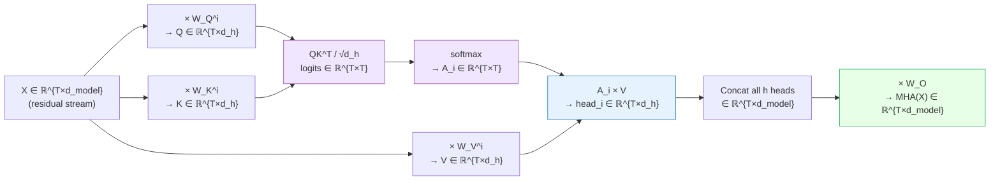
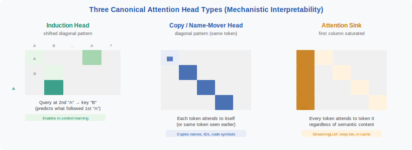
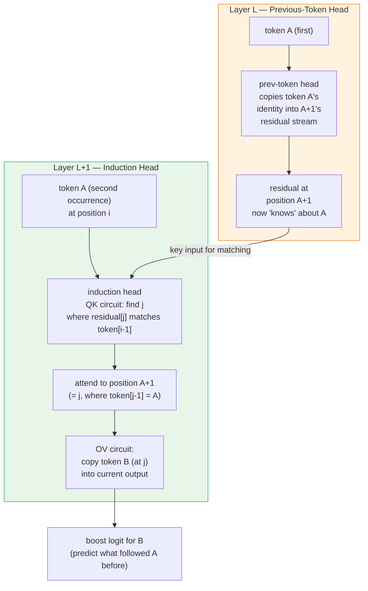

<!-- ============================ TOP NAV ============================ -->
<div align="center">

[🏠 Home](../../README.md) &nbsp;•&nbsp; [📚 Section 1 — Transformer Architecture](./README.md) &nbsp;•&nbsp; [⬅️ Q11 — Attention Complexity](./q11-attention-complexity.md) &nbsp;•&nbsp; [Q13 — GQA & MQA ➡️](./q13-gqa-mqa.md)

</div>

---

# Q12 · Explain Multi-Head Attention in detail. What does mechanistic interpretability tell us about head specialization (induction heads, copy heads, attention sinks)?

<div align="center">


</div>

> [!IMPORTANT]
> **The 20-second answer.** Multi-Head Attention runs $h$ independent scaled dot-product attention operations in parallel, each in a smaller subspace of dimension $d_h = d_\text{model}/h$. Every head learns to compare a different *kind* of relationship — and mechanistic interpretability has revealed that this specialization is not random. Distinct head archetypes emerge consistently across models: **induction heads** perform in-context learning via a two-layer "prev-token → induction" circuit; **copy heads** directly move tokens from earlier positions into the current output; **attention sinks** absorb unused probability mass onto the first token as a stability mechanism; and **copy-suppression heads** actively reduce over-repetition. The QK circuit (which determines *where* to attend) and the OV circuit (which determines *what to write* to the residual stream) are the right abstraction for understanding what each head actually does.

---

## Table of contents

1. [First principles: attention as differentiable retrieval](#1--first-principles-attention-as-differentiable-retrieval)
2. [The problem story: why one head is not enough](#2--the-problem-story-why-one-head-is-not-enough)
3. [MHA math precisely](#3--mha-math-precisely)
4. [One large head vs many heads](#4--one-large-head-vs-many-heads)
5. [Geometric intuition: subspace projection](#5--geometric-intuition-subspace-projection)
6. [Head type taxonomy: mechanistic interpretability findings](#6--head-type-taxonomy-mechanistic-interpretability-findings)
7. [The induction circuit in detail](#7--the-induction-circuit-in-detail)
8. [Reference implementation (PyTorch)](#8--reference-implementation-pytorch)
9. [Worked example: tracing "the cat sat … the cat"](#9--worked-example-tracing-the-cat-sat--the-cat)
10. [Attention sinks and StreamingLLM](#10--attention-sinks-and-streaminglm)
11. [Caveats: attention visualization is not interpretability](#11--caveats-attention-visualization-is-not-interpretability)
12. [Interview drill: the follow-ups they'll ask](#12--interview-drill-the-follow-ups-theyll-ask)
13. [Common misconceptions](#13--common-misconceptions)
14. [One-screen summary](#14--one-screen-summary)
15. [References](#15--references)

---

## 1 · First principles: attention as differentiable retrieval

Before any equations, fix a single mental model: **attention is a soft, differentiable key–value lookup**.

Imagine a dictionary where the keys are approximate and you want to retrieve a *weighted blend* of values rather than one exact match. That is precisely what attention computes:

- **Query (Q)** — "What am I looking for right now?"
- **Key (K)** — "What do I offer / what do I advertise?"
- **Value (V)** — "What information should I send if I am selected?"

The dot product $q \cdot k$ measures **compatibility** between a query and a key. Scaled and softmaxed, it becomes a distribution over positions. That distribution is then used to compute a weighted sum of the value vectors — the retrieved information.

$$\text{Attention}(Q,K,V) = \text{softmax}\!\left(\frac{QK^\top}{\sqrt{d_k}}\right)V$$

Three things to lock in from this framing:

1. **It is fully differentiable** — backprop flows through the softmax and all projections, so the model learns what to look up.
2. **The dot product measures angle AND magnitude** — which is why the $\frac{1}{\sqrt{d_k}}$ scaling is needed to keep logit variance stable at initialization (see [Q2](./q02-scaled-attention.md)).
3. **The QK product decides WHERE attention goes; the V decides WHAT is copied** — these are two separate circuits with separate responsibilities, and mechanistic interpretability exploits exactly this separation.

> [!NOTE]
> **For a 12-year-old.** Attention is like a student in a library asking a question (Q) and scanning book spines (K) to decide which books are relevant, then reading the relevant pages (V). Multi-head attention is like having *many* students with different questions all searching the same library at the same time — a history student, a maths student, a literature student — and pooling what they find.

---

## 2 · The problem story: why one head is not enough

A single attention head must output one scalar for every (query position, key position) pair — that is, a single $T \times T$ matrix of attention weights. That single matrix must simultaneously encode every relationship a language model needs:

- **Syntactic dependencies** — subject–verb agreement, modifier-noun attachment
- **Semantic associations** — co-referring noun phrases, event participants
- **Positional structure** — attending to the immediately previous token, the start of a sentence
- **Copying and repetition** — repeating a name or identifier introduced earlier
- **Garbage collection** — somewhere to dump probability mass when no position is relevant

Compressing all of this into one distribution is not just hard; it is **algebraically impossible in one projection**. A single projection maps the $d_\text{model}$-dimensional input into $d_k$-dimensional queries and keys. The resulting $d_k$-dimensional subspace cannot simultaneously be the "right" subspace for syntax, semantics, and position.

Multi-head attention solves this by running $h$ projections into $h$ different $d_h$-dimensional subspaces **in parallel**, then concatenating the outputs. Each head gets its own $W_Q^i, W_K^i, W_V^i$ — its own "question to ask of the sequence" — and the full $W_O$ projection mixes what every head found into the residual stream.

The key insight: **specialization emerges from training, not design**. Nobody told head 4 to be an induction head. The loss function discovered that it is useful for one head to solve the induction problem and rewarded it for doing so consistently.

---

## 3 · MHA math precisely

### The per-head computation

For head $i$ with head dimension $d_h = d_\text{model}/h$:

$$\text{head}_i = \text{softmax}\!\left(\frac{(XW_Q^i)(XW_K^i)^\top}{\sqrt{d_h}}\right)(XW_V^i)$$

where:
- $X \in \mathbb{R}^{T \times d_\text{model}}$ is the sequence of residual stream vectors
- $W_Q^i, W_K^i \in \mathbb{R}^{d_\text{model} \times d_h}$ are the per-head query and key projections
- $W_V^i \in \mathbb{R}^{d_\text{model} \times d_h}$ is the per-head value projection

### The full MHA output

$$\text{MHA}(X) = \text{Concat}(\text{head}_1, \ldots, \text{head}_h)\,W_O$$

where $W_O \in \mathbb{R}^{d_\text{model} \times d_\text{model}}$ mixes all head outputs back into the residual stream dimension.

### The QK circuit and OV circuit

The Elhage et al. (2021) framework decomposes each head into two independent circuits:

| Circuit | Matrices | Role |
|---|---|---|
| **QK circuit** | $W_Q^i, W_K^i$ | Determines the attention pattern — *where* to attend |
| **OV circuit** | $W_V^i, W_O^{(i)}$ | Determines what is written to the residual stream given the attention pattern |

The OV circuit for head $i$ is $W_V^i W_O^{(i)}$ (the $i$-th block of rows of $W_O$ corresponding to head $i$). The full contribution of head $i$ to the output is:

$$\text{output}_i = A_i \cdot X \cdot W_V^i W_O^{(i)}$$

where $A_i$ is the attention pattern (softmax output). This means you can analyze what a head *copies* independently from what it *attends to*.

### Pipeline diagram



> [!NOTE]
> The **QK circuit** (purple) determines the routing; the **OV circuit** (blue) determines what information flows. This separation is the key to understanding head function in mechanistic interpretability.

---

## 4 · One large head vs many heads

A common interview trap is to confuse parameter count. Let's be precise.

### Parameter count comparison

For a model with $d_\text{model} = 512$ and $h = 8$ heads ($d_h = 64$):

| Component | Single head ($h=1$, $d_k = d_\text{model}$) | Multi-head ($h=8$, $d_h = 64$) |
|---|---|---|
| $W_Q$ | $512 \times 512 = 262{,}144$ | $8 \times (512 \times 64) = 262{,}144$ |
| $W_K$ | $512 \times 512 = 262{,}144$ | $8 \times (512 \times 64) = 262{,}144$ |
| $W_V$ | $512 \times 512 = 262{,}144$ | $8 \times (512 \times 64) = 262{,}144$ |
| $W_O$ | $512 \times 512 = 262{,}144$ | $512 \times 512 = 262{,}144$ |
| **Total** | **1,048,576** | **1,048,576** |

**The parameter counts are identical.** Multi-head does not add parameters — it *reorganizes* the same number of parameters into $h$ parallel projections.

### But what actually differs?

| Property | Single head | Multi-head ($h$ heads) |
|---|---|---|
| Attention distributions | 1 per position | $h$ per position, independently computed |
| Subspace dimension | $d_\text{model}$ (full) | $d_h = d_\text{model}/h$ (each) |
| Expressivity | One weighted mix | $h$ different weighted mixes, then linearly combined |
| Pattern specialization | Must blend all patterns into one | Different heads can specialize on different patterns |
| Bottleneck | Single $T\times T$ attention matrix | $h$ independent $T\times T$ matrices |
| Rank of head output | Up to $\min(T, d_\text{model})$ | Each head up to $\min(T, d_h)$, but $h$ heads together can collectively fill $d_\text{model}$ |

> [!NOTE]
> **The tradeoff.** Smaller $d_h$ means each head works in a lower-dimensional space, which could limit expressivity per head. The bet of MHA is that *parallel diversity* (many small heads, each developing a specialty) outweighs the *depth* of a single large head — and empirically, this holds across scales and tasks.

---

## 5 · Geometric intuition: subspace projection

Think of the $d_\text{model}$-dimensional residual stream as a high-dimensional space containing *all* information about the token. Different linguistic properties live in different directions within this space.

Each head's $W_Q^i$ and $W_K^i$ project the residual stream into a **$d_h$-dimensional subspace** before computing compatibility. The dot product then measures alignment *within that subspace only*.

What does this mean?

- Head $i$ is essentially asking: "In the subspace defined by my $W_Q^i, W_K^i$, which tokens are most compatible?"
- If $W_Q^i, W_K^i$ happen to project onto the subspace that encodes syntactic subject–verb relationships, then that head will preferentially attend to the syntactic head of a sentence.
- If $W_Q^j, W_K^j$ project onto the subspace that encodes the previous token's identity (for induction), that head will specialize in induction.

The $W_O$ matrix then decides how much each head's output (written via its $W_V^i W_O^{(i)}$ OV circuit) contributes to updating the residual stream.

**The $h$ subspaces can be thought of as $h$ different "lenses"** through which the sequence is examined simultaneously — syntactic lens, semantic lens, positional lens, copying lens — and their findings are merged into a single update.

---

## 6 · Head type taxonomy: mechanistic interpretability findings



<sub><b>Figure 1.</b> Three canonical attention patterns: an induction head (off-diagonal stripe shifted one position), a copy head (near-diagonal), and an attention sink (first column saturated regardless of query position).</sub>

Mechanistic interpretability research — primarily from Anthropic (Elhage 2021, Olsson 2022) and Google/DeepMind (Voita 2019) — has identified consistent **head archetypes** that appear across models and scales:

| Head Type | Attention Pattern | What it does | Found by |
|---|---|---|---|
| **Previous-token head** | Token $i$ strongly attends to $i-1$ | Moves info from the prior position into the current residual stream; feeds induction heads in the next layer | Olsson et al., 2022 |
| **Induction head** | Token $i$ attends to position $j$ where token $j-1 =$ token $i-1$ | In-context learning; predicts "if I've seen AB before and now see A again, predict B" | Olsson et al., 2022 |
| **Copy head / name-mover head** | Token $i$ attends to the same or semantically matching token earlier | Directly copies content words — identifiers, names, repeated terms — into the output | Wang et al., 2022 (IOI task) |
| **Copy-suppression head** | Attends strongly to a high-probability candidate token | Reduces the logit of the most likely next token; prevents over-repetition | McDougall et al., 2023 |
| **Attention sink** | Token $i$ always attends heavily to token 0 (or the first token) regardless of content | Absorbs unused probability mass; a stability valve for softmax | Xiao et al., 2024 |
| **Delimiter head** | Attends to `[SEP]`, `[CLS]`, punctuation, or sentence boundaries | Detects structural boundaries; "dumps" attention on semantically inert tokens | Clark et al., 2019; Voita et al., 2019 |

> [!NOTE]
> These categories are not mutually exclusive and the taxonomy is not exhaustive. Some heads are polysemantic — they appear to play multiple roles depending on context. The categories represent the most *consistently identified and rigorously verified* archetypes as of 2024.

---

## 7 · The induction circuit in detail

The induction head is arguably the most important finding in mechanistic interpretability: a **two-layer circuit** that implements in-context learning from first principles.

### The task

Given a sequence like:

```
The cat sat on the mat . The cat [?]
```

After seeing "The cat" a second time, the model should predict "sat" (or whatever followed "The cat" the first time). This is **in-context learning** — the model is using earlier context as an implicit lookup table.

### The two-layer circuit

The induction circuit spans **two consecutive layers**:



### Detection signature

An induction head shows a characteristic **shifted diagonal** in its attention matrix: token at position $i$ attends strongly to position $j$ where $j = \text{(previous occurrence of token}_{i-1})$. If you plot the $T \times T$ attention matrix, you see a diagonal stripe shifted one position below the main diagonal and offset by the gap between repetitions.

### Why this matters

- Induction heads form **phase transitions** during training: there is a critical period where the prev-token head and induction head co-develop, accompanied by a sharp drop in loss on repeated-token tasks (Olsson et al., 2022, Figure 1).
- The same circuit appears in 1-layer models (but weakly), 2-layer models (clearly), and large models (at corresponding layer pairs) — suggesting it is a **universal primitive** of learned in-context learning.
- Ablating induction heads (zeroing their output) causes large drops in in-context learning performance, confirming causal importance.

---

## 8 · Reference implementation (PyTorch)

```python
import math
import torch
import torch.nn as nn
import torch.nn.functional as F


class MultiHeadAttention(nn.Module):
    """Canonical multi-head attention with optional causal mask.

    Follows the Vaswani et al. (2017) formulation exactly.
    QK and OV circuits are exposed as properties for interpretability
    experiments (activation patching, attention visualization, etc.).
    """

    def __init__(self, d_model: int, n_heads: int, dropout: float = 0.0, causal: bool = False):
        super().__init__()
        assert d_model % n_heads == 0, "d_model must be divisible by n_heads"

        self.d_model = d_model
        self.n_heads = n_heads
        self.d_head = d_model // n_heads   # d_h in the math
        self.causal = causal
        self.scale = math.sqrt(self.d_head)

        # Fused QKV projection — equivalent to three separate linear layers
        # but more efficient due to a single large matmul.
        self.qkv_proj = nn.Linear(d_model, 3 * d_model, bias=False)
        self.out_proj = nn.Linear(d_model, d_model, bias=False)   # W_O
        self.attn_drop = nn.Dropout(dropout)

    # ------------------------------------------------------------------
    # Helpers for mechanistic interpretability experiments
    # ------------------------------------------------------------------

    def qk_circuit(self, head: int) -> torch.Tensor:
        """Return the effective QK matrix W_Q^i^T W_K^i ∈ R^{d_model x d_model}.
        High entries (i,j) mean token-feature i in query tends to attend to
        token-feature j in key — the 'attention pattern generator'."""
        W = self.qkv_proj.weight  # [3*d_model, d_model]
        Wq = W[head * self.d_head : (head + 1) * self.d_head, :]   # [d_h, d_model]  (W_Q^i)
        Wk = W[self.d_model + head * self.d_head :
               self.d_model + (head + 1) * self.d_head, :]           # [d_h, d_model]  (W_K^i)
        return Wq.T @ Wk  # [d_model, d_model]

    def ov_circuit(self, head: int) -> torch.Tensor:
        """Return the effective OV matrix W_V^i W_O^{(i)} ∈ R^{d_model x d_model}.
        Multiplying a token's residual stream by this tells you what the head
        writes back to the residual stream when it attends to that token."""
        W = self.qkv_proj.weight
        Wv = W[2 * self.d_model + head * self.d_head :
               2 * self.d_model + (head + 1) * self.d_head, :]  # [d_h, d_model]
        # W_O is stored as [d_model, d_model]; slice the rows for this head
        Wo_head = self.out_proj.weight[:, head * self.d_head : (head + 1) * self.d_head]  # [d_model, d_h]
        return Wv.T @ Wo_head.T  # [d_model, d_model]  — maps source residual to output update

    # ------------------------------------------------------------------

    def forward(
        self,
        x: torch.Tensor,                          # [B, T, d_model]
        key_value: torch.Tensor | None = None,    # for cross-attention; if None, self-attention
        attn_mask: torch.Tensor | None = None,    # additive mask [B, 1, T_q, T_k] or [T_q, T_k]
        return_attn_weights: bool = False,
    ):
        B, T_q, _ = x.shape
        src = key_value if key_value is not None else x
        T_k = src.size(1)

        # Project queries from x; keys and values from src
        q = (self.qkv_proj.weight[:self.d_model, :] @ x.transpose(-1, -2)).transpose(-1, -2)
        k = (self.qkv_proj.weight[self.d_model:2*self.d_model, :] @ src.transpose(-1, -2)).transpose(-1, -2)
        v = (self.qkv_proj.weight[2*self.d_model:, :]          @ src.transpose(-1, -2)).transpose(-1, -2)

        def split_heads(t: torch.Tensor) -> torch.Tensor:
            """[B, T, d_model] -> [B, n_heads, T, d_head]"""
            return t.view(B, -1, self.n_heads, self.d_head).transpose(1, 2)

        q, k, v = map(split_heads, (q, k, v))  # each: [B, h, T, d_h]

        # Scaled dot-product attention
        # logits: [B, h, T_q, T_k]
        logits = torch.matmul(q, k.transpose(-2, -1)) / self.scale

        # Causal mask: upper triangle (future positions) -> -inf
        if self.causal:
            causal_mask = torch.triu(
                torch.ones(T_q, T_k, device=x.device, dtype=torch.bool), diagonal=1
            )
            logits = logits.masked_fill(causal_mask, float("-inf"))

        # Additive external mask (e.g., padding)
        if attn_mask is not None:
            logits = logits + attn_mask

        attn_weights = F.softmax(logits, dim=-1)   # [B, h, T_q, T_k]
        attn_weights = self.attn_drop(attn_weights)

        # Weighted sum of values, then merge heads and project out
        context = torch.matmul(attn_weights, v)    # [B, h, T_q, d_h]
        context = context.transpose(1, 2).reshape(B, T_q, self.d_model)
        output = self.out_proj(context)            # [B, T_q, d_model]

        if return_attn_weights:
            return output, attn_weights            # expose patterns for interpretability
        return output


# ---- Quick smoke test ----
if __name__ == "__main__":
    torch.manual_seed(42)
    mha = MultiHeadAttention(d_model=512, n_heads=8, causal=True)

    x = torch.randn(2, 16, 512)   # batch=2, seq=16
    out, weights = mha(x, return_attn_weights=True)

    print(f"Output shape:        {out.shape}")      # [2, 16, 512]
    print(f"Attn weights shape:  {weights.shape}")  # [2, 8, 16, 16]
    print(f"Attn row sums (should be 1): {weights[0, 0].sum(-1)[:4]}")

    # Inspect OV circuit of head 0
    ov = mha.ov_circuit(head=0)
    print(f"OV circuit shape:    {ov.shape}")       # [512, 512]
    print(f"OV circuit rank:     {torch.linalg.matrix_rank(ov)}")  # typically d_h = 64
```

> [!WARNING]
> The `qk_circuit()` and `ov_circuit()` helpers assume the fused QKV weight ordering `[Q_all | K_all | V_all]`. Always verify the weight layout when adapting to a different codebase — some implementations interleave Q, K, V or use a different head-stacking convention.

---

## 9 · Worked example: tracing "the cat sat on the mat the cat"

### Setup

Consider the token sequence (1-indexed, 0-indexed positions in brackets):

```
[0] The  [1] cat  [2] sat  [3] on  [4] the  [5] mat  [6] the  [7] cat
```

An induction head should, when processing position 7 ("cat"), produce high attention weight on position 2 ("sat") — because position 1 ("cat") preceded "sat" the first time it appeared.

### Attention pattern for an induction head

For the induction head at position 7 ("cat", second occurrence), the QK circuit effectively asks:
"Which earlier position $j$ has a key that matches my query?" — and the key at position $j$ has been enriched by the prev-token head with information about $\text{token}[j-1]$.

Since token[6] = "the" = token[0], and token[7] = "cat" = token[1], the induction mechanism fires:

| Query position | Attending to (top-2) | Attention weight (approx) | Mechanism |
|---|---|---|---|
| 7 ("cat", 2nd) | **2 ("sat")** | **~0.70** | Induction: token[1]="cat" preceded "sat" |
| 7 | 1 ("cat", 1st) | ~0.15 | Weak direct copy |
| 7 | 0 ("The") | ~0.10 | Attention sink |
| 7 | other positions | ~0.05 total | Distributed |

### Attention matrix slice (rows = queries, cols = keys)

Below is a schematic $8 \times 8$ attention weight matrix. Each row is a query position; each column is a key position. High values are shown with `H` (≈0.5–0.8), medium with `M` (≈0.1–0.3), low with `.` (≈0).

```
                Keys →
         [0]  [1]  [2]  [3]  [4]  [5]  [6]  [7]
Q[0]  :   H    .    .    .    .    .    .    .    ← attends to sink (itself at pos 0)
Q[1]  :   M    H    .    .    .    .    .    .    ← prev-token head fires: attends to [0]
Q[2]  :   .    M    H    .    .    .    .    .    ← prev-token: attends to [1]="cat"
Q[3]  :   .    .    M    H    .    .    .    .
Q[4]  :   .    .    .    M    H    .    .    .
Q[5]  :   .    .    .    .    M    H    .    .
Q[6]  :   M    .    .    .    .    M    H    .    ← attends to sink + local
Q[7]  :   M    M    H    .    .    .    M    .    ← INDUCTION: high on [2]="sat"!
```

The characteristic **shifted diagonal stripe** at Q[7] → K[2] is the induction head signature: it skips over the intervening tokens to retrieve what followed the first occurrence of "cat".

### What the OV circuit does

Once position 7 attends to position 2 ("sat"), the OV circuit ($W_V^i W_O^{(i)}$) reads out the residual stream at position 2 and writes an update to position 7's residual stream that boosts the logit for "sat" as the next token. This is the mechanistic explanation of why GPT-style models are good at completing repeated patterns.

---

## 10 · Attention sinks and StreamingLLM

### The phenomenon

In virtually every Transformer, one or two tokens — almost always the **first token** (position 0) and sometimes delimiter tokens — accumulate **disproportionately large attention weights** from nearly every other position, across nearly every head and layer. This is called an **attention sink**.

A concrete observation: in a sequence of length 512, the first token (often `<BOS>` or the first word) may receive average attention weight of 0.3–0.5 across all heads, even when it is semantically irrelevant to most queries.

### Why do sinks form?

The explanation follows directly from softmax's properties:

1. Softmax must produce a probability distribution that **sums to 1**. Every query must attend *somewhere*.
2. In many positions, no key is highly relevant — the query is looking for something that does not exist (or is masked away). But the attention weights must still sum to 1.
3. A "garbage collection" token emerges: one token that every query can safely dump probability mass onto without contaminating the residual stream with wrong information. Token 0 is the natural choice because it is **always present**, has been seen in every context, and is processed in the first layer with no preceding context — its key vector becomes a generic "dump here" attractor.

> [!NOTE]
> This is not something engineers designed. It **emerges from training** as an efficient solution to the "must sum to 1" constraint of softmax. The attention sink token's value vector learns to encode something semantically neutral — attending to it writes nothing harmful to the residual stream.

### Why attention sinks matter: StreamingLLM

Xiao et al. (2024) discovered that **dropping the sink tokens from the KV cache** of a running model causes catastrophic quality degradation — even though those tokens appear semantically irrelevant. The model's attention patterns break and quality collapses.

This motivated **StreamingLLM**: a technique for infinite-context inference by maintaining a **fixed-size rolling KV cache** that always retains:
1. The **sink tokens** (positions 0–3, usually) — even for sequences far beyond the original context window
2. The **recent tokens** (the last $W$ positions)

By never evicting the sink tokens, StreamingLLM allows LLMs to run over arbitrarily long sequences with fixed memory, at the cost of losing access to the non-recent non-sink tokens.

```
KV Cache in StreamingLLM:
┌─────────────────────────────────────────────────┐
│ Sink tokens (0-3) │ ... evicted ... │ Recent W  │
│   always kept     │                 │  tokens   │
└─────────────────────────────────────────────────┘
```

The existence of attention sinks is also why some models explicitly **prepend a `<sink>` token** during training — ensuring a dedicated, semantically inert sink is always available at position 0.

---

## 11 · Caveats: attention visualization is not interpretability

A critical point that separates experienced practitioners from novices:

> **High attention weight $\neq$ high causal importance.**

Just because a head strongly attends to a token does not mean that token causally determines the output. The OV circuit may write something useless (or even something that is later cancelled by another head). The attention pattern is only *half* of the story.

### The three layers of evidence

Rigorous mechanistic interpretability uses a hierarchy of evidence:

| Evidence type | Strength | Method |
|---|---|---|
| **Attention visualization** | Weak (correlation only) | Plot attention weights; observe patterns |
| **Causal ablation** | Medium | Zero out head output; measure loss increase |
| **Activation patching** | Strong | Replace activations from clean run with corrupted run at specific head; measure how much the output changes |

Voita et al. (2019) showed that **most heads can be pruned with minimal loss** — suggesting that many heads with visible attention patterns are not causally important. The heads that *are* important were the specialized ones (syntactic, positional, rare-word heads).

### The superposition problem

A single head's key, query, or value vector may be **polysemantic** — encoding multiple distinct features that happen to coexist in the same direction via superposition (Elhage et al., 2022). This means:

- One head may appear to do one thing in isolation but do something entirely different in the presence of certain combinations of inputs.
- The categories in Section 6 are idealized archetypes; real heads are messier.
- Interpretability claims require careful ablation experiments to distinguish the head's *typical* behavior from its *causally important* behavior.

> [!WARNING]
> **The attention-as-explanation anti-pattern.** Many early papers showed colored attention matrices as "explanations" of model behavior. This has been largely discredited — attention is one intermediate computation, not a faithful explanation of the output. If you use attention visualization in an interview answer, immediately caveat it with the need for causal verification (ablation / activation patching).

---

## 12 · Interview drill: the follow-ups they'll ask

<details>
<summary><b>Q: Are the h heads truly independent?</b></summary>

Not entirely. The heads share the same input $X$ (the residual stream before the layer), and their outputs are summed back into the same residual stream via $W_O$. So there is **input coupling** (every head sees the same thing) and **output coupling** (their contributions add). However, their projections are entirely separate ($W_Q^i, W_K^i, W_V^i$ are independent for each $i$), so the *attention patterns* and *value transformations* are computed independently. In practice, heads do exhibit coordinated behavior — for example, the prev-token head in layer $L$ and the induction head in layer $L+1$ form a circuit that depends on both — but this coordination is learned through the residual stream, not hard-wired.
</details>

<details>
<summary><b>Q: Does every head learn a meaningful or interpretable role?</b></summary>

No. Voita et al. (2019) pruned ~80% of BERT's heads with negligible BLEU drop, and the remaining important heads had interpretable roles. The majority of heads appear to be "redundant" or encode very weak, diffuse patterns. This makes sense: the model is over-parameterized relative to the number of distinct attention patterns it needs, so some heads end up as slack. The important heads are those whose ablation causes a large, reproducible loss in performance on specific tasks.
</details>

<details>
<summary><b>Q: Why not use 100 heads? More heads = more specialization, right?</b></summary>

More heads means smaller $d_h = d_\text{model}/h$ per head. At some point the subspace becomes too small to express meaningful patterns — with $d_h = 4$, the QK and OV circuits have extremely limited rank. Empirically, there is a sweet spot. Vaswani et al. (2017) found $h = 8$ or $h = 16$ to work well for the model sizes they tested. Modern large models often use 32–128 heads, but the $d_h$ is kept around 64–128 by scaling $d_\text{model}$ proportionally. More heads also increase the number of softmax operations (though not the total parameter count), which can add compute overhead in certain hardware configurations.
</details>

<details>
<summary><b>Q: Is attention visualization sufficient for mechanistic interpretability?</b></summary>

No — this is one of the most important caveats in the field. Attention weights show *where* the model routes information, but the OV circuit determines *what* is actually written to the residual stream. A head can attend strongly to position $j$ but write something irrelevant (if its OV circuit is near-zero or orthogonal to the direction that matters for the output). The gold standard is **activation patching**: run a clean and a corrupted forward pass, swap the activations at a specific head, and measure how much the output changes. Only then can you make causal claims about a head's importance.
</details>

<details>
<summary><b>Q: What is the difference between a copy head and an induction head?</b></summary>

A **copy head** directly attends to a token earlier in the sequence that is identical (or semantically related) to the current token and copies its representation forward. It is a one-step operation: "attend to where I saw this token before, and copy its value." An **induction head** implements a two-step lookup: "find the position $j$ where token $j-1$ equals my previous token $i-1$, and retrieve what came after it at position $j$." The induction head requires the prev-token head to have already enriched position $j$ with information about $j-1$. Copy heads appear in earlier/lower layers; induction heads are typically found in slightly later layers. Copy heads boost the logit of a token already present in context; induction heads boost the logit of a token that *followed* a previously seen pattern.
</details>

---

## 13 · Common misconceptions

| ❌ Misconception | ✅ Reality |
|---|---|
| "Multi-head attention uses more parameters than single-head." | Parameter count is identical — the same $4d_\text{model}^2$ total; MHA reorganizes them into $h$ parallel projections. |
| "High attention weight means the attended token caused the output." | Attention weight shows routing; causal importance requires ablation or activation patching. The OV circuit, not attention weight alone, determines what is written. |
| "Every head learns a distinct, interpretable role." | Most heads appear redundant or weakly specialized; only a small fraction (induction, copy, sink, delimiter) have strong, consistent roles. ~80% of BERT heads can be pruned with minimal loss (Voita et al., 2019). |
| "Attention sinks are a bug / failure mode." | They are an emergent stability mechanism — softmax's "must sum to 1" requirement needs a garbage-collection token. StreamingLLM deliberately preserves them. |
| "Induction heads only matter for repeated tokens." | Induction heads are the primary mechanistic substrate for **in-context learning** broadly — including few-shot prompting. They generalize beyond literal token repetition to abstract pattern completion. |
| "The QK and OV circuits are the same thing / both determine attention." | QK determines the attention *pattern* (where probability mass goes); OV determines what is *written* to the residual stream given that pattern. They are analytically and mechanistically separate. |

---

## 14 · One-screen summary

> **What MHA is:** $h$ parallel scaled dot-product attention operations, each in a $d_h = d_\text{model}/h$ subspace, with outputs concatenated and projected back. Total parameters identical to a single full-rank head.
>
> **The QK/OV decomposition:** Every head has a QK circuit (determines *where* attention goes) and an OV circuit (determines *what* is written to the residual stream). These are independent and should be analyzed separately.
>
> **Why multiple heads:** Each head can project into a different subspace and specialize on a different relationship type (syntax, semantics, position, copying). One head cannot simultaneously encode all relationships in one attention distribution.
>
> **Head archetypes from mechanistic interpretability:**
> - **Previous-token heads** → feed induction heads; attend to $i-1$
> - **Induction heads** → in-context learning; two-layer circuit, shifted-diagonal pattern
> - **Copy/name-mover heads** → direct content copying; near-diagonal pattern
> - **Copy-suppression heads** → anti-repetition; suppress high-probability candidates
> - **Attention sinks** → stability valve; token 0 absorbs unused probability mass
>
> **Key caveats:** High attention ≠ causal importance. Most heads are redundant. Superposition means heads can be polysemantic. Use ablation/activation patching for causal claims.

---

## 15 · References

1. Vaswani, A., Shazeer, N., Parmar, N., et al. — **Attention Is All You Need** (2017). *NeurIPS 2017. arXiv:1706.03762.* — Original MHA formulation; $h=8$ heads, $d_\text{model}=512$.

2. Elhage, N., Nanda, N., Olsson, C., et al. — **A Mathematical Framework for Transformer Circuits** (2021). *Transformer Circuits Thread.* — Introduces the QK/OV circuit decomposition; the foundation for modern mechanistic interpretability of attention.

3. Olsson, C., Elhage, N., Nanda, N., et al. — **In-context Learning and Induction Heads** (2022). *Transformer Circuits Thread. arXiv:2209.11895.* — Defines induction heads; shows the two-layer prev-token + induction circuit; links induction heads to in-context learning phase transitions.

4. Voita, E., Talbot, D., Moiseev, F., Sennrich, R., Titov, I. — **Analyzing Multi-Head Self-Attention: Specialized Heads Do the Heavy Lifting, the Rest Can Be Pruned** (2019). *ACL 2019. arXiv:1905.09418.* — Identifies syntactic, positional, and rare-word heads; shows ~80% of heads can be pruned.

5. Xiao, G., Tian, Y., Chen, B., Han, S., Lewis, M. — **Efficient Streaming Language Models with Attention Sinks** (StreamingLLM) (2024). *ICLR 2024. arXiv:2309.17453.* — Characterizes attention sinks; proposes StreamingLLM for infinite-context inference by retaining sink + recent tokens.

6. Clark, K., Khandelwal, U., Levy, O., Manning, C. D. — **What Does BERT Look at? An Analysis of BERT's Attention** (2019). *BlackBoxNLP 2019. arXiv:1906.04341.* — Empirical study of BERT attention heads; identifies delimiter heads and syntactic heads.

7. Wang, K., Variengien, A., Conmy, A., Shlegeris, B., Steinhardt, J. — **Interpretability in the Wild: a Circuit for Indirect Object Identification in GPT-2 Small** (2022). *arXiv:2211.00593.* — Identifies name-mover heads and copy-suppression heads in the IOI task.

8. McDougall, C., Conmy, A., Rushing, C., McGrath, T., Nanda, N. — **Copy Suppression: Comprehensively Understanding an Attention Head** (2023). *arXiv:2310.04625.* — Full mechanistic account of a copy-suppression head in GPT-2 Small.

---

<!-- ============================ BOTTOM NAV ============================ -->
<div align="center">

[⬅️ Q11 — Attention Complexity](./q11-attention-complexity.md) &nbsp;|&nbsp; [📚 Back to Section 1](./README.md) &nbsp;|&nbsp; [🏠 Home](../../README.md) &nbsp;|&nbsp; [Q13 — GQA & MQA ➡️](./q13-gqa-mqa.md)

<sub>Found an error or have a sharper intuition? See <a href="../../CONTRIBUTING.md">CONTRIBUTING</a> — answers follow the <a href="../../_TEMPLATE.md">answer template</a>.</sub>

</div>
