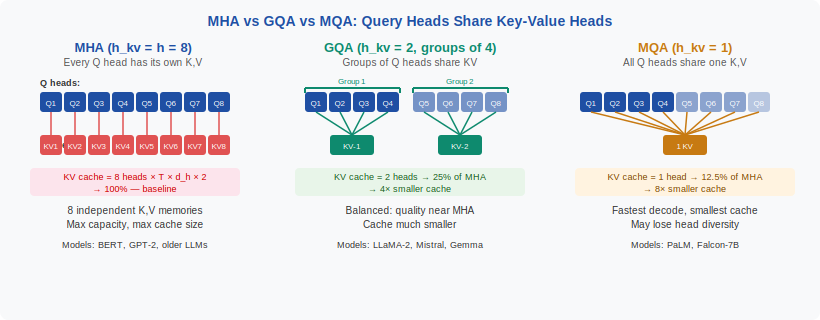
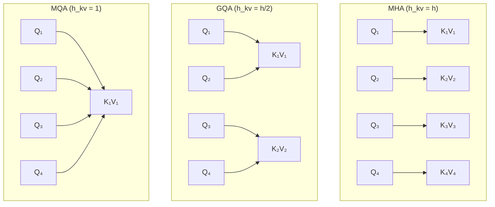
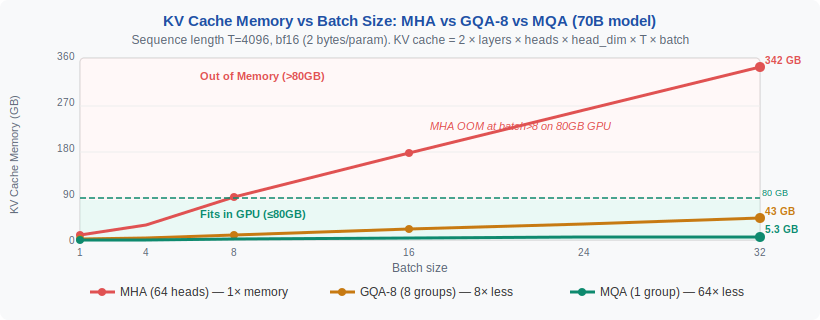
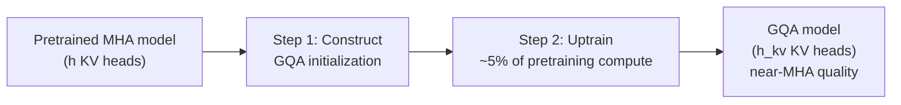
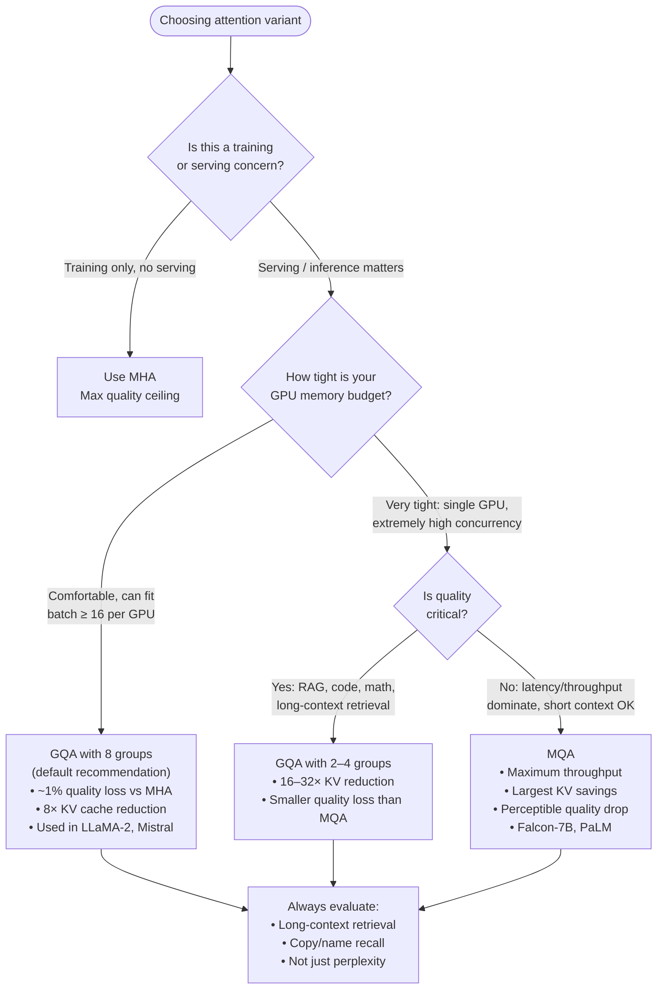

<!-- ============================ TOP NAV ============================ -->
<div align="center">

[🏠 Home](../../README.md) &nbsp;•&nbsp; [📚 Section 1 — Transformer Architecture](./README.md) &nbsp;•&nbsp; [⬅️ Q12 — MHA & Interpretability](./q12-mha-interpretability.md) &nbsp;•&nbsp; [Q14 — RMSNorm vs LayerNorm ➡️](./q14-rmsnorm-vs-layernorm.md)

</div>

---

# Q13 · What is Grouped-Query Attention (GQA) and Multi-Query Attention (MQA)? When would you choose which, and what's the quality–throughput tradeoff?

<div align="center">


</div>

> [!IMPORTANT]
> **The 20-second answer.** Both GQA and MQA reduce the number of distinct key–value heads below the number of query heads to shrink the **KV cache** — the dominant memory bottleneck during autoregressive decoding. **MQA** (Shazeer 2019) collapses all KV heads to exactly one shared head; **GQA** (Ainslie 2023) is the middle ground where small *groups* of query heads share one KV head. The quality–throughput tradeoff is well-understood: MQA gives maximum memory savings and throughput but with a perceptible quality drop on long-context tasks; GQA (typically 4–8 groups) recovers most of MHA quality while still cutting KV cache size by 4–8×. **Default recommendation for modern production LLMs: GQA with 8 groups.** MQA is the right pick only when memory is extremely constrained or latency is the sole objective.

---

## Table of contents

1. [First principles: why the KV cache is the real bottleneck](#1--first-principles-why-the-kv-cache-is-the-real-bottleneck)
2. [The problem told as a story: KV cache doesn't fit](#2--the-problem-told-as-a-story-kv-cache-doesnt-fit)
3. [The mechanism precisely: MHA, GQA, MQA unified](#3--the-mechanism-precisely-mha-gqa-mqa-unified)
4. [KV cache math: the exact memory numbers](#4--kv-cache-math-the-exact-memory-numbers)
5. [The intuition: shared notebooks in a classroom](#5--the-intuition-shared-notebooks-in-a-classroom)
6. [Comparison table: MHA vs GQA vs MQA](#6--comparison-table-mha-vs-gqa-vs-mqa)
7. [Reference implementation in PyTorch](#7--reference-implementation-in-pytorch)
8. [Worked numerical example](#8--worked-numerical-example)
9. [Uptraining MHA to GQA: the Ainslie et al. recipe](#9--uptraining-mha-to-gqa-the-ainslie-et-al-recipe)
10. [When to choose which: decision flowchart](#10--when-to-choose-which-decision-flowchart)
11. [What degrades with fewer KV heads](#11--what-degrades-with-fewer-kv-heads)
12. [Interview drill: follow-up questions](#12--interview-drill-follow-up-questions)
13. [Common misconceptions](#13--common-misconceptions)
14. [One-screen summary](#14--one-screen-summary)
15. [References](#15--references)

---

## 1 · First principles: why the KV cache is the real bottleneck

To understand why MQA and GQA exist, you need to hold two facts together.

**Fact 1: autoregressive decoding generates one token at a time.**
At step $t$, the model takes a single new token and attends over all $t$ previous tokens. The new query is a vector of shape $[d_\text{model}]$. There is **no reuse of past computation** unless we cache it.

**Fact 2: we therefore cache K and V.**
Every time we compute a key and value for position $i$, we store them so that future steps $t > i$ don't recompute them. This is the **KV cache**. Without it, decoding would be $O(T^2)$ compute; with it, decoding is $O(T)$ compute per step, but now we have a memory cost.

The critical observation: **during decoding, we load ALL past K and V from HBM (GPU high-bandwidth memory) to compute attention.** This is a *memory-bandwidth* operation, not a compute operation. GPUs have far more FLOP/s than memory bandwidth — modern H100s top out at ~3.35 TB/s memory bandwidth vs ~2000 TFLOP/s BF16. Decoding is **memory-bandwidth-bound**.

Reducing KV cache size therefore directly:
- Reduces HBM usage → larger batch sizes fit
- Reduces bytes loaded per decoding step → faster per-token latency
- Reduces inter-GPU communication if KV is replicated across tensor parallel ranks

> [!NOTE]
> **The key insight to open your answer with.** The KV cache, not the forward-pass compute, is the primary limiting factor in production LLM serving. MQA and GQA attack this bottleneck directly. Framing your answer this way tells the interviewer you understand the systems context, not just the architecture.

---

## 2 · The problem told as a story: KV cache doesn't fit

Let's make the numbers concrete with **LLaMA-2 70B** as a reference point.

- **64 attention heads**, each with head dimension $d_h = 128$
- **80 transformer layers**
- Sequence length at inference: $T = 4096$ tokens
- Data type: BF16 (2 bytes per element)

**KV cache size per layer** (MHA, one sequence):

$$\text{size}_\text{layer} = 2 \times T \times h \times d_h \times \text{bytes} = 2 \times 4096 \times 64 \times 128 \times 2 = 134\,\text{MB}$$

**Total KV cache across all layers** (one sequence):

$$80 \times 134\,\text{MB} = 10.7\,\text{GB}$$

**For a serving batch of 32 sequences:**

$$32 \times 10.7\,\text{GB} = 342\,\text{GB}$$

A single H100 has 80 GB of HBM. Even across **8 GPUs** (640 GB total), over **half the entire memory budget** is consumed just by the KV cache — before model weights (roughly 140 GB in BF16 for a 70B model) and activations.

This is not a theoretical concern. This is why the original LLaMA-2 70B paper switched to GQA: the model simply could not serve reasonable batch sizes with full MHA KV cache.

> [!IMPORTANT]
> If a candidate can quote these numbers from memory in an interview — or derive them on the spot — it signals genuine production experience. The formula `2 × B × T × h_kv × d_h × bytes` is worth memorizing cold.

---

## 3 · The mechanism precisely: MHA, GQA, MQA unified

All three variants share the same standard attention formula:

$$\text{Attention}(Q, K, V) = \text{softmax}\!\left(\frac{QK^\top}{\sqrt{d_h}}\right) V$$

They differ only in the **shape of K and V**. Let $h$ be the number of query heads and $h_{kv}$ be the number of KV heads:

| Variant | $h_{kv}$ | Shape of Q | Shape of K, V |
|---|---|---|---|
| **MHA** | $h$ | $[B, h, T, d_h]$ | $[B, h, T, d_h]$ |
| **GQA** | $1 < h_{kv} < h$ | $[B, h, T, d_h]$ | $[B, h_{kv}, T, d_h]$ |
| **MQA** | $1$ | $[B, h, T, d_h]$ | $[B, 1, T, d_h]$ |

In GQA, $h$ is divisible by $h_{kv}$, and each *group* of $G = h / h_{kv}$ query heads shares one K head and one V head. Within each group, the query heads still have **distinct $W_Q$ projection matrices**, so they can ask different questions — they simply look up those questions in a shared reference.

<div align="center">

<br><sub><b>Figure 1.</b> The three variants for 8 query heads. MHA: each Q head has its own K,V pair (8 KV heads). GQA: groups of 4 Q heads share a KV pair (2 KV heads). MQA: all Q heads share one K,V pair (1 KV head). Query projections remain independent throughout.</sub>
</div>



The mechanics at inference: to compute the attention output for query head $i$ (in group $g = \lceil i / G \rceil$), we expand (broadcast) the shared K and V for group $g$ across all $G$ query heads in that group, then run standard attention. The `repeat_kv` function in Section 7 handles this broadcast.

---

## 4 · KV cache math: the exact memory numbers

The general formula for KV cache size:

$$\boxed{\text{memory}_\text{KV} = 2 \times B \times T \times L \times h_{kv} \times d_h \times \text{bytes\_per\_element}}$$

where $B$ is batch size, $T$ is sequence length, $L$ is number of layers, $h_{kv}$ is KV heads, $d_h$ is head dimension.

**Plugging in LLaMA-2 70B numbers** ($L=80$, $h=64$, $d_h=128$, BF16):

| Variant | $h_{kv}$ | KV cache (single seq, $T$=4096) | KV cache (batch=32) |
|---|---|---|---|
| **MHA** | 64 | 10.7 GB | 342 GB |
| **GQA-8** | 8 | 1.34 GB | 42.8 GB |
| **GQA-4** | 16 | 2.68 GB | 85.7 GB |
| **MQA** | 1 | 167 MB | 5.35 GB |

<div align="center">

<br><sub><b>Figure 2.</b> KV cache memory as a function of batch size for a 70B-scale model at $T=4096$. MHA exhausts an 8×H100 node before batch=32. GQA-8 fits a single H100 at batch=32 with room for weights. MQA is nearly negligible.</sub>
</div>

> [!NOTE]
> **Why GQA-8 is a sweet spot.** LLaMA-2 70B uses $h_{kv}=8$, reducing the KV cache 8× vs MHA while losing less than 1 perplexity point. Mistral-7B uses $h_{kv}=8$ with $h=32$ (GQA-4 grouping). Gemma 2 27B uses $h_{kv}=16$ with $h=32$ (GQA-2). The pattern: researchers have found that $h_{kv} \geq 4$ is almost always sufficient to recover MHA quality.

---

## 5 · The intuition: shared notebooks in a classroom

Here is the clearest mental model for interviews:

Imagine **32 students** (query heads) in a classroom. Each student formulates their own unique question for the day's reading (different $W_Q$ projections — so queries are different). Now there are two models for the reference material:

- **MHA:** Each student has their own private copy of the entire textbook (their own K, V). Maximum fidelity — they can each highlight whatever passage they want. But storing 32 personal copies is expensive.

- **GQA:** Students sit in groups of 4 around a shared table. Each table has one shared textbook (shared K, V per group). Students within a group still ask completely different questions, but they must find their answers in the same shared material. Four tables → four copies → 8× cheaper storage.

- **MQA:** One single textbook is chained to the front podium. All 32 students must look up answers in the same text. Cheapest, but every student sees the same representation of the source material, which can limit nuance.

The key: **students' questions are never shared** (queries remain independent). Only the reference material (keys and values) is pooled.

---

## 6 · Comparison table: MHA vs GQA vs MQA

| Dimension | MHA | GQA | MQA |
|---|---|---|---|
| **$h_{kv}$** | $h$ | $1 < h_{kv} < h$ | $1$ |
| **KV cache** | Full (baseline) | $1/G$ of MHA | $1/h$ of MHA |
| **KV memory reduction** | 1× | 4–16× | 64× (for $h$=64) |
| **Quality** | Best | Near-MHA | Slightly lower |
| **Long-context quality** | Best | Near-MHA | Noticeable drop |
| **Throughput** | Baseline | High | Highest |
| **Per-token latency** | Highest | Low | Lowest |
| **W_Q sharing?** | No | No | No |
| **W_K, W_V sharing?** | No | Within groups | Across all heads |
| **Training complexity** | Standard | Standard | Standard |
| **MHA→GQA uptraining** | N/A | ~5% pretraining budget | ~5% pretraining budget |
| **Used in** | BERT, GPT-2, older models | LLaMA-2, Mistral, Gemma, Qwen | PaLM, Falcon-7B, early Mistral |

> [!TIP]
> The table row "W_Q sharing?" is a trap interviewers use. MQA does **not** share query projections — each head still has its own $W_Q^{(i)}$. Only the key and value projections are collapsed to one shared $W_K$ and $W_V$. This is what preserves most of the representational diversity.

---

## 7 · Reference implementation in PyTorch

The core utility function that makes GQA work at inference time is `repeat_kv` — it broadcasts the shared KV heads to match the number of query heads:

```python
import torch
import torch.nn as nn
import torch.nn.functional as F
import math


def repeat_kv(x: torch.Tensor, n_rep: int) -> torch.Tensor:
    """
    Expand KV heads to match the number of query heads.

    Args:
        x:     [B, n_kv_heads, T, d_head]
        n_rep: number of times to repeat each KV head (= n_heads // n_kv_heads)

    Returns:
        [B, n_kv_heads * n_rep, T, d_head]  (== [B, n_heads, T, d_head])
    """
    B, n_kv, T, D = x.shape
    if n_rep == 1:
        return x  # MHA or MQA with 1 KV head used as-is for single query head
    # Insert a new axis, expand (zero-copy broadcast), then flatten
    return (
        x[:, :, None, :, :]            # [B, n_kv, 1,     T, D]
        .expand(B, n_kv, n_rep, T, D)  # [B, n_kv, n_rep, T, D]  — broadcast
        .reshape(B, n_kv * n_rep, T, D)  # [B, n_heads,    T, D]
    )


class GroupedQueryAttention(nn.Module):
    """
    Grouped-Query Attention (GQA) with optional MHA and MQA as special cases.

    Set n_kv_heads == n_heads  for MHA.
    Set n_kv_heads == 1        for MQA.
    Set 1 < n_kv_heads < n_heads  for GQA.
    """

    def __init__(
        self,
        d_model: int,
        n_heads: int,
        n_kv_heads: int,
        causal: bool = True,
        dropout: float = 0.0,
    ):
        super().__init__()
        assert d_model % n_heads == 0, "d_model must be divisible by n_heads"
        assert n_heads % n_kv_heads == 0, "n_heads must be divisible by n_kv_heads"

        self.n_heads = n_heads
        self.n_kv_heads = n_kv_heads
        self.n_rep = n_heads // n_kv_heads   # how many Q heads share each KV head
        self.d_head = d_model // n_heads
        self.causal = causal

        # Query projection: full n_heads × d_head
        self.W_q = nn.Linear(d_model, n_heads * self.d_head, bias=False)
        # Key and Value projections: only n_kv_heads × d_head
        self.W_k = nn.Linear(d_model, n_kv_heads * self.d_head, bias=False)
        self.W_v = nn.Linear(d_model, n_kv_heads * self.d_head, bias=False)
        self.W_o = nn.Linear(d_model, d_model, bias=False)

        self.attn_dropout = nn.Dropout(dropout)
        self.scale = math.sqrt(self.d_head)

    def forward(
        self,
        x: torch.Tensor,
        kv_cache: tuple[torch.Tensor, torch.Tensor] | None = None,
    ) -> tuple[torch.Tensor, tuple[torch.Tensor, torch.Tensor]]:
        """
        Args:
            x:        [B, T, d_model]
            kv_cache: optional (k_prev, v_prev) each [B, n_kv_heads, T_prev, d_head]

        Returns:
            output [B, T, d_model], updated kv_cache
        """
        B, T, _ = x.shape

        # Project and reshape
        def split_heads(proj: torch.Tensor, n_h: int) -> torch.Tensor:
            return proj.view(B, T, n_h, self.d_head).transpose(1, 2)
            # -> [B, n_h, T, d_head]

        q = split_heads(self.W_q(x), self.n_heads)      # [B, n_heads,    T, d_head]
        k = split_heads(self.W_k(x), self.n_kv_heads)   # [B, n_kv_heads, T, d_head]
        v = split_heads(self.W_v(x), self.n_kv_heads)   # [B, n_kv_heads, T, d_head]

        # Append to KV cache (inference mode)
        if kv_cache is not None:
            k_prev, v_prev = kv_cache
            k = torch.cat([k_prev, k], dim=2)  # [B, n_kv_heads, T_total, d_head]
            v = torch.cat([v_prev, v], dim=2)
        new_cache = (k, v)

        # Expand shared KV heads to match all query heads
        # MHA: n_rep == 1  →  no-op
        # GQA: n_rep == G  →  each KV head is broadcast to G query heads
        # MQA: n_rep == n_heads  →  single KV head broadcast to all
        k_expanded = repeat_kv(k, self.n_rep)  # [B, n_heads, T_total, d_head]
        v_expanded = repeat_kv(v, self.n_rep)  # [B, n_heads, T_total, d_head]

        # Standard scaled dot-product attention
        T_total = k_expanded.shape[2]
        logits = torch.matmul(q, k_expanded.transpose(-2, -1)) / self.scale
        # logits: [B, n_heads, T, T_total]

        if self.causal:
            # Only mask the new queries against old keys
            mask = torch.triu(
                torch.ones(T, T_total, device=x.device, dtype=torch.bool),
                diagonal=T_total - T + 1,
            )
            logits = logits.masked_fill(mask, float("-inf"))

        attn = F.softmax(logits, dim=-1)
        attn = self.attn_dropout(attn)

        out = torch.matmul(attn, v_expanded)             # [B, n_heads, T, d_head]
        out = out.transpose(1, 2).reshape(B, T, -1)      # [B, T, d_model]
        return self.W_o(out), new_cache
```

> [!WARNING]
> **Memory layout matters for FlashAttention compatibility.** FlashAttention-2 and later support GQA natively — you pass `n_heads` and `n_kv_heads` separately and it handles the broadcast internally without materializing the expanded K, V tensors. Using `repeat_kv` as shown above is correct for pedagogical purposes and for non-FA kernels, but in production you want FA's native GQA path to avoid the memory overhead of expanding K and V to full head count.

---

## 8 · Worked numerical example

Let's trace through a concrete GQA example with small numbers to make the mechanics unambiguous.

**Setup:**
- $h = 32$ query heads, $h_{kv} = 8$ KV heads → group size $G = 4$
- $d_h = 64$, sequence length so far $T = 2048$, batch size $B = 1$, BF16

**Step 1: compute projections for one new token.**

```
q  shape: [1, 32,  1, 64]   ← 32 distinct query projections
k  shape: [1,  8,  1, 64]   ← 8 distinct key projections
v  shape: [1,  8,  1, 64]   ← 8 distinct value projections
```

**Step 2: append to KV cache.**

```
k_cache shape: [1, 8, 2049, 64]   ← 8 KV heads × 2049 positions × 64 dim
v_cache shape: [1, 8, 2049, 64]
```

**KV cache memory at this step:**
$$2 \times 1 \times 8 \times 2049 \times 64 \times 2\,\text{bytes} = 4.2\,\text{MB}$$

Compare to MHA with 32 heads:
$$2 \times 1 \times 32 \times 2049 \times 64 \times 2\,\text{bytes} = 16.8\,\text{MB}$$

**KV cache reduction: 4× (exactly $h / h_{kv} = 32/8$).**

**Step 3: broadcast KV to all query heads.**

```
k_expanded shape: [1, 32, 2049, 64]
  ↑ heads 0–3  all see k_cache[head 0]   ← group 0
    heads 4–7  all see k_cache[head 1]   ← group 1
    ...
    heads 28–31 all see k_cache[head 7]  ← group 7
```

**Step 4: compute attention.**

Query head 0 and query head 3 are in the same group — they see the **same** keys and values — but their $W_Q^{(0)}$ and $W_Q^{(3)}$ are different, so their query vectors are different, so the attention distributions they compute will be different. They ask different questions of the same reference text.

**Logit computation for query head 0:**
$$\ell^{(0)}_{t} = q^{(0)} \cdot k^{(0)}_{t} / \sqrt{64} \quad \forall t \in [0, 2048]$$

**Logit computation for query head 3 (same group):**
$$\ell^{(3)}_{t} = q^{(3)} \cdot k^{(0)}_{t} / \sqrt{64} \quad \forall t \in [0, 2048]$$

Same $k^{(0)}$ keys, different $q^{(0)}$ vs $q^{(3)}$ vectors → **different attention patterns**. The sharing is in what positions are *available to attend to* (the key space), not *where they attend* (the attention distribution).

---

## 9 · Uptraining MHA to GQA: the Ainslie et al. recipe

What if you have an existing MHA model (e.g., trained on 2T tokens) and want to convert it to GQA for serving efficiency? Ainslie et al. (2023) showed you don't need to retrain from scratch.

**The uptraining recipe:**



**Step 1 — Initialization (mean pooling within groups):**

For each group $g$ of $G$ consecutive MHA heads, initialize the single GQA KV head by averaging the $G$ MHA KV heads in that group:

$$W_K^{(g)}_\text{GQA} = \frac{1}{G} \sum_{i=g \cdot G}^{(g+1) \cdot G - 1} W_K^{(i)}_\text{MHA}$$

and similarly for $W_V$. This is much better than random initialization because it starts the GQA model in a region of weight space that already encodes good representations.

**Step 2 — Continued training:**

Fine-tune on the same pretraining data distribution for roughly 5% of the original pretraining token budget. This allows the model to:
- Adapt query heads to the reduced KV head count
- Recover representation diversity lost by averaging

**Results from the paper:** Uptraining T5-Large from MHA to GQA (8 groups) with 5% of pretraining budget recovered 99% of original downstream task performance, while reducing KV cache by 8×. Uptraining to MQA recovered ~97% of performance.

> [!NOTE]
> **Practical implication.** You almost never need to train a GQA model from scratch. If your org has an existing MHA model, uptraining is the standard path. LLaMA-2 70B was trained directly with GQA, which is why the quality gap vs MHA is so small — it learned GQA representations from the beginning rather than having to adapt them.

---

## 10 · When to choose which: decision flowchart



**Rule of thumb for $h_{kv}$ selection:**

| Context | Recommended $h_{kv}$ | Rationale |
|---|---|---|
| Research / quality ceiling | $h$ (MHA) | No serving pressure |
| General production LLM | $h / 8$ | GQA-8: sweet spot confirmed empirically |
| Edge / on-device | $h / 16$ or $1$ | Memory budget dominates |
| Very long context ($T \geq 32k$) | $h / 4$ to $h / 8$ | More diversity helps long-range retrieval |
| Speculative decoding draft model | $1$ (MQA) | Draft model must be fast above all |

> [!IMPORTANT]
> **Do not tune $h_{kv}$ on perplexity alone.** MQA and GQA often show negligible perplexity differences vs MHA on standard benchmarks, but show meaningful drops on **long-context retrieval tasks** (needle-in-a-haystack, multi-hop QA, passkey recall). Always benchmark the actual use case, especially for $T > 8k$.

---

## 11 · What degrades with fewer KV heads

Understanding *what specifically gets worse* is critical for a senior interview answer. Three main failure modes:

**1. Head diversity loss.**

In MHA, each KV head can develop a specialized representation of the context — one head might focus on syntactic roles, another on coreference chains, another on numerical relationships. With fewer KV heads, multiple groups of query heads must share the same K/V representation. The remaining K/V heads must generalize across what were previously specialized roles.

Empirically: attention probing studies show that KV-head specialization is preserved in GQA but reduced. The model compensates by placing more representational burden on the query projections.

**2. Long-context sensitivity.**

At long sequences, subtle positional distinctions matter: the model may need to find one specific occurrence of "John" at position 14,823 in a 32k-token document. With MHA, a single specialized head can be fine-tuned to that task. With MQA, the single KV head must support all 32 query heads' retrieval needs simultaneously, which tends to produce smoother, more averaged representations.

This is why benchmarks like Needle-in-a-Haystack and RULER show larger gaps between MHA and MQA than standard perplexity or 5-shot benchmarks.

**3. Copy precision.**

Tasks that require verbatim copying (e.g., "repeat the ISBN from the earlier paragraph", "copy the function signature from the context") are particularly sensitive to KV head reduction. Copy tasks require high-fidelity position-specific key matching, which benefits from per-head key specialization.

> [!TIP]
> **Framing this in an interview.** The right way to say it: "The degradation is not random noise — it's specifically in the dimensions of attention that require *diversity of KV representation*: long-range retrieval, entity resolution, and copy tasks. For tasks where attention serves more as a smoothed aggregation (e.g., language modeling of natural text), GQA with 8 heads is nearly lossless."

---

## 12 · Interview drill: follow-up questions

<details>
<summary><b>Q: Is GQA primarily a training or inference optimization?</b></summary>

**Inference.** GQA reduces the KV cache — which only exists at inference time (specifically, autoregressive decoding). Training runs the full forward pass over complete sequences in parallel (no sequential token generation), so training never builds a KV cache and GQA provides no memory or compute benefit during training. The sole motivation is serving efficiency. Training cost is essentially identical to MHA.

The only training-time effect is that $W_K$ and $W_V$ are smaller matrices (fewer output heads), so there are slightly fewer parameters — but this is a secondary consequence, not the motivation.
</details>

<details>
<summary><b>Q: Why not always use MQA if it's the most memory-efficient?</b></summary>

Because **quality has diminishing returns from memory savings at extreme reduction**. Going from MHA (64 heads) to GQA-8 (8 heads) saves 8× memory with ~1% quality loss. Going from GQA-8 to MQA (1 head) saves another 8× but causes disproportionately more quality degradation — especially on long-context tasks. The quality-memory Pareto curve is concave: GQA-8 is on the efficient frontier; MQA is past the knee of the curve for most production use cases.

Additionally, MQA causes training instability in some regimes — researchers have noted that the single KV head is a bottleneck that can lead to attention pattern collapse, requiring more careful hyperparameter tuning.
</details>

<details>
<summary><b>Q: Does GQA or MQA reduce the O(T²) attention complexity?</b></summary>

**No.** GQA and MQA reduce the *KV cache memory* (a constant in the $O(T^2)$ analysis) and the *memory bandwidth* of loading the KV cache per step. They do not change the fundamental quadratic scaling of attention with sequence length during prefill. The prefill still computes $QK^\top$ with the full $T \times T$ logit matrix (albeit with smaller K). For the quadratic scaling problem, you need sparse attention, linear attention, or state-space models — not GQA/MQA.

What GQA/MQA *do* reduce is the per-token **decode step** latency: at step $t$, you load $h_{kv}$ heads × $t$ positions from cache rather than $h$ heads × $t$ positions. This is linear in $t$ but with a smaller constant.
</details>

<details>
<summary><b>Q: What is the most important formula to memorize?</b></summary>

$$\text{KV cache} = 2 \times B \times T \times L \times h_{kv} \times d_h \times \text{bytes}$$

This formula is the central object. With it you can: derive the memory pressure for any model configuration, justify the choice of $h_{kv}$, compute the batch size headroom on a given GPU, and reason about the quality-memory tradeoff. The factor of 2 is for K and V; $L$ is layers. The only variable GQA/MQA touch is $h_{kv}$.
</details>

<details>
<summary><b>Q: How do you pick n_kv_heads in practice?</b></summary>

Three constraints interact:

1. **Divisibility:** $h_{kv}$ must divide $h$. For $h=32$: valid options are 1, 2, 4, 8, 16, 32.

2. **Memory budget:** compute the KV cache size with the formula above for your target batch size and sequence length. Pick the largest $h_{kv}$ that fits.

3. **Quality requirement:** if long-context retrieval matters, prefer $h_{kv} \geq h/8$. If only short-context generation matters, $h_{kv} = 1$ may be acceptable.

A practical heuristic: **start at $h_{kv} = h/8$**, run your long-context eval suite, and increase if you see degradation. LLaMA-2 70B ($h=64$, $h_{kv}=8$) and Mistral-7B ($h=32$, $h_{kv}=8$) both landed at $h_{kv}=8$ after this kind of sweep, which is not a coincidence.
</details>

<details>
<summary><b>Q: How does GQA interact with FlashAttention?</b></summary>

FlashAttention-2 and FlashAttention-3 have **native GQA support**. You pass `num_heads` and `num_kv_heads` separately; the kernel handles the broadcast internally in SRAM without ever materializing the expanded K, V tensors in HBM. This means:

- No memory overhead from expanding K/V to full head count
- The bandwidth savings of GQA are preserved end-to-end
- The kernel fuses the repeat + matmul into a single pass

If you use the `repeat_kv` + standard matmul approach (as in Section 7), the expand creates a full-size K/V tensor `[B, n_heads, T, d_h]` in HBM, which partially defeats the memory savings. **Always use FlashAttention's native GQA path in production.**

In PyTorch >= 2.0, `F.scaled_dot_product_attention` with `enable_flash=True` also supports GQA natively when K and V have fewer heads than Q.
</details>

---

## 13 · Common misconceptions

| ❌ Misconception | ✅ Reality |
|---|---|
| "GQA shares the query projections ($W_Q$) within groups." | GQA only shares $W_K$ and $W_V$. Every query head has its own $W_Q^{(i)}$, so queries remain fully diverse. |
| "MQA and GQA reduce the $O(T^2)$ complexity of attention." | They reduce **KV cache memory** and **decode-step memory bandwidth**. The quadratic scaling during prefill is unchanged. |
| "GQA requires training from scratch." | Uptraining an existing MHA model with ~5% of pretraining compute (mean-pooled KV init) recovers near-MHA quality. |
| "Perplexity is sufficient to evaluate MQA vs GQA quality." | Long-context retrieval, copy tasks, and entity recall show the real differences. Perplexity often barely changes even when GQA hurts downstream tasks. |
| "GQA is just a minor implementation detail." | It is a primary architectural choice in every major 2023+ LLM. Choosing wrong costs you either 8× more memory or a measurable quality drop. |
| "MQA removes the need for KV caching entirely." | MQA still requires a KV cache — it just has only one K head and one V head to cache, not $h$ of each. The cache is still needed for efficient decoding. |
| "GQA always uses exactly 8 groups." | 8 is a common choice (LLaMA-2 70B, Mistral-7B), but the right number depends on the model's $h$, memory budget, and quality requirements. Gemma 2 uses 2 groups; some models use 4 or 16. |

---

## 14 · One-screen summary

> **What:** GQA and MQA reduce the number of K,V heads ($h_{kv}$) below the number of Q heads ($h$) to shrink the KV cache.
> - **MHA:** $h_{kv} = h$ — every Q head has its own K,V
> - **GQA:** $1 < h_{kv} < h$ — groups of $G = h/h_{kv}$ Q heads share one K,V pair
> - **MQA:** $h_{kv} = 1$ — all Q heads share one K,V pair
>
> **Why it matters:** KV cache is the dominant memory bottleneck at inference. A 70B model serving a batch of 32 at $T=4096$ needs **342 GB** of KV cache under MHA — doesn't fit anywhere. GQA-8 cuts this to **43 GB**; MQA to **5 GB**.
>
> **The tradeoff:** $\text{memory} \propto h_{kv}$, quality degrades as $h_{kv} \downarrow$, most severely on long-context retrieval. The knee of the Pareto curve is at $h_{kv} \approx h/8$ (GQA-8).
>
> **Key formula:** $\text{KV cache} = 2 \times B \times T \times L \times h_{kv} \times d_h \times \text{bytes}$
>
> **Decision rule:** Default to GQA-8 for production. Use MQA only if memory is the sole constraint and long-context quality is not needed. Use MHA for research/quality ceiling.
>
> **Implementation note:** Use FlashAttention's native GQA path — don't materialize the repeated K,V.

---

## 15 · References

1. Vaswani, A. et al. — **Attention Is All You Need** (2017). *NeurIPS 2017.* — introduced Multi-Head Attention (MHA), the baseline against which GQA and MQA are measured.
2. Shazeer, N. — **Fast Transformer Decoding: One Write-Head is All You Need** (MQA) (2019). *arXiv:1911.02150.* — introduced Multi-Query Attention; motivates the memory-bandwidth bottleneck framing.
3. Ainslie, J. et al. — **GQA: Training Generalized Multi-Query Transformer Models from Multi-Head Checkpoints** (2023). *EMNLP 2023 / arXiv:2305.13245.* — introduced GQA; described the mean-pooling uptraining recipe; showed GQA recovers ~99% of MHA quality at 8 groups.
4. Jiang, A. Q. et al. — **Mistral 7B** (2023). *arXiv:2310.06825.* — first widely-used open model trained natively with GQA ($h=32$, $h_{kv}=8$); demonstrated GQA quality in practice at 7B scale.
5. Touvron, H. et al. — **LLaMA 2: Open Foundation and Fine-Tuned Chat Models** (2023). *arXiv:2307.09288.* — LLaMA-2 70B uses GQA ($h=64$, $h_{kv}=8$); the paper analyzes the quality–efficiency tradeoff explicitly.
6. Dao, T. — **FlashAttention-2: Faster Attention with Better Parallelism and Work Partitioning** (2023). *arXiv:2307.08691.* — describes native GQA support in the FA2 kernel; explains why materializing expanded K,V should be avoided.
7. Henighan, T. et al. — **RULER: What's the Real Context Window Size of Your LLM?** (2024). *arXiv:2404.06654.* — benchmark showing GQA vs MHA quality differences are most pronounced on long-context retrieval, not perplexity.

---

<!-- ============================ BOTTOM NAV ============================ -->
<div align="center">

[⬅️ Q12 — MHA & Interpretability](./q12-mha-interpretability.md) &nbsp;|&nbsp; [📚 Back to Section 1](./README.md) &nbsp;|&nbsp; [🏠 Home](../../README.md) &nbsp;|&nbsp; [Q14 — RMSNorm vs LayerNorm ➡️](./q14-rmsnorm-vs-layernorm.md)

<sub>Found an error or have a sharper intuition? See <a href="../../CONTRIBUTING.md">CONTRIBUTING</a> — answers follow the <a href="../../_TEMPLATE.md">answer template</a>.</sub>

</div>
