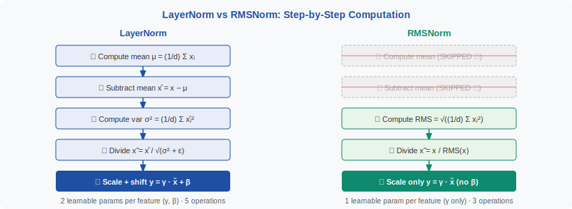
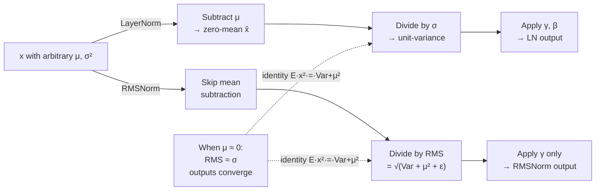
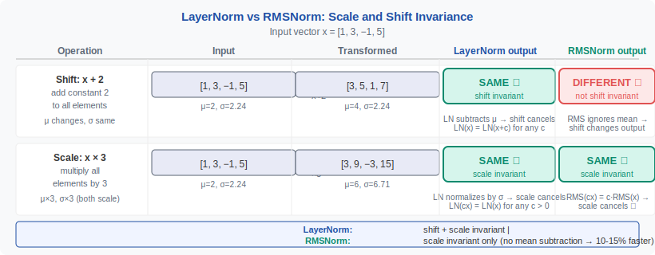

<!-- ============================ TOP NAV ============================ -->
<div align="center">

[🏠 Home](../../README.md) &nbsp;•&nbsp; [📚 Section 1 — Transformer Architecture](./README.md) &nbsp;•&nbsp; [⬅️ Q13 — GQA & MQA](./q13-gqa-mqa.md) &nbsp;•&nbsp; [Q15 — SwiGLU & GeGLU ➡️](./q15-swiglu-geglu.md)

</div>

---

# Q14 · Compare RMSNorm and LayerNorm mathematically. Why has RMSNorm become dominant in modern LLMs?

<div align="center">


</div>

> [!IMPORTANT]
> **The 20-second answer.** LayerNorm normalizes activations by subtracting the mean and dividing by the standard deviation, then applies a learnable scale **γ** and shift **β**. RMSNorm drops the mean-subtraction step entirely: it divides only by the root-mean-square of the activations and keeps **γ** but discards **β**. The key algebraic identity is **E[x²] = Var(x) + μ²**: when the mean μ ≈ 0 (as it approximately is after pre-norm residual connections in modern Transformers), the two norms behave nearly identically — but RMSNorm gets there with fewer operations, no bias parameter, a simpler reduction pattern that fuses cleanly with adjacent linears, and no assumption about mean-centering being useful. That convergence of computational efficiency, systems friendliness, and preserved expressiveness is why the LLaMA family — and almost every post-2023 large LLM — uses RMSNorm.

---

## Table of contents

1. [First principles — why normalize activations at all](#1--first-principles--why-normalize-activations-at-all)
2. [The problem, told as a story — the norm wars from BERT to LLaMA](#2--the-problem-told-as-a-story--the-norm-wars-from-bert-to-llama)
3. [LayerNorm precisely — full math, step by step](#3--layernorm-precisely--full-math-step-by-step)
4. [RMSNorm precisely — the simplification explained](#4--rmsnorm-precisely--the-simplification-explained)
5. [The key algebraic identity — when the two norms converge](#5--the-key-algebraic-identity--when-the-two-norms-converge)
6. [Invariance properties — shift vs scale, and why it matters](#6--invariance-properties--shift-vs-scale-and-why-it-matters)
7. [Why RMSNorm dominates — six reasons with hardware context](#7--why-rmsnorm-dominates--six-reasons-with-hardware-context)
8. [PyTorch code — both norms, with a speed-comparison snippet](#8--pytorch-code--both-norms-with-a-speed-comparison-snippet)
9. [Worked numerical example — tracing both norms on x = \[1, 3, −1, 5\]](#9--worked-numerical-example--tracing-both-norms-on-x--1-3-1-5)
10. [When to use which — decision table](#10--when-to-use-which--decision-table)
11. [Hardware and systems view — memory bandwidth, fusion, kernel cost](#11--hardware-and-systems-view--memory-bandwidth-fusion-kernel-cost)
12. [Interview drill — six Q&As](#12--interview-drill--six-qas)
13. [Common misconceptions](#13--common-misconceptions)
14. [One-screen summary](#14--one-screen-summary)
15. [References](#15--references)

---

## 1 · First principles — why normalize activations at all

Before comparing the two norms, establish *why* any normalization is needed in a deep network. Two forces conspire to make raw activations badly behaved as depth grows:

**Gradient instability.** In a network of depth $L$, gradients backpropagated to layer 1 pass through $L$ Jacobians multiplied together. Unless each Jacobian has eigenvalues near 1, gradients either vanish (→ 0) or explode (→ ∞). Normalization pins the statistics of each layer's output, which keeps the Jacobians tame.

**Attention logit growth.** In a Transformer, the dot-product attention logit is $\ell_{ij} = q_i \cdot k_j / \sqrt{d_k}$. If the activations feeding $W_Q$ and $W_K$ have unbounded variance, the logits grow, the softmax saturates, attention collapses to near one-hot, and training diverges (see [Q18](./q18-qk-norm.md) for the full analysis of this failure mode).

**The two things normalization buys you:**

1. **Consistent activation scale across layers** — gradients flow cleanly, learning rates stay useful.
2. **A re-scaling knob for the model** — the learnable gain parameter γ lets the network undo the normalization where it is not useful, preserving representational capacity.

Both LayerNorm and RMSNorm address these goals. They diverge only in whether they also address a third property: **shift invariance** (subtracting the mean).

---

## 2 · The problem, told as a story — the norm wars from BERT to LLaMA

The year is 2018. BERT [Devlin et al.] ships with **post-norm LayerNorm** — normalization applied *after* the residual addition — and quickly becomes the standard. LayerNorm (Ba et al., 2016) is clean: subtract the mean, divide by the standard deviation, apply γ and β. GPT-2, T5, and ViT all follow suit.

But post-norm has a fragility: the residual branch is not normalized before being added, so very deep or very wide models diverge easily. The community shifts to **pre-norm** (normalize the input to each sub-block, before the residual addition), which stabilizes training but subtly changes what the norm needs to do. In pre-norm Transformers, the residual stream has an approximately zero-mean distribution at each layer — a consequence of the zero-initialized output projections common in modern Transformers. This makes the *mean-subtraction* step of LayerNorm redundant: if μ ≈ 0 already, subtracting it changes almost nothing.

In 2019, Zhang & Sennrich publish **RMSNorm** and show that dropping mean-subtraction (and its associated bias β) loses negligible accuracy on machine translation while cutting computation. The result is noted but not immediately dominant.

The tipping point arrives in 2023. The LLaMA family (Touvron et al.) adopts the recipe: **pre-norm + RMSNorm + RoPE + SwiGLU**. LLaMA achieves state-of-the-art efficiency, the recipe is open-sourced, and the entire open-source LLM ecosystem copies it. Mistral, Falcon, Gemma, Qwen, DeepSeek — all RMSNorm. The norm wars are effectively over.

---

## 3 · LayerNorm precisely — full math, step by step

Given an activation vector $x \in \mathbb{R}^d$ for one token, LayerNorm computes:

**Step 1 — mean:**

$$\mu = \frac{1}{d} \sum_{i=1}^{d} x_i$$

**Step 2 — variance:**

$$\sigma^2 = \frac{1}{d} \sum_{i=1}^{d} (x_i - \mu)^2$$

**Step 3 — normalize (center and scale to unit variance):**

$$\hat{x}_i = \frac{x_i - \mu}{\sqrt{\sigma^2 + \varepsilon}}$$

**Step 4 — affine transform (learnable re-scaling and shift):**

$$\text{LN}(x)_i = \gamma_i \, \hat{x}_i + \beta_i$$

where $\gamma, \beta \in \mathbb{R}^d$ are learnable parameters, initialized to $\gamma = \mathbf{1}$ and $\beta = \mathbf{0}$. The small constant $\varepsilon > 0$ (typically $10^{-5}$ to $10^{-6}$) prevents division by zero.

**What this does geometrically:** it translates $x$ to have zero mean (subtract μ) and then rescales it to have unit variance. The learnable affine parameters then re-introduce any scale and offset the model finds useful.

<div align="center">

<br><sub><b>Figure 1.</b> Computation graphs for LayerNorm (left) and RMSNorm (right). The two highlighted boxes — mean subtraction and bias addition — are the operations RMSNorm removes.</sub>
</div>

**Parameter count:** LayerNorm has $2d$ parameters ($\gamma$ and $\beta$). For a model with hidden dim 4096 and 32 layers, that is $2 \times 4096 \times 32 = 262{,}144$ parameters just for norms — small, but not zero.

---

## 4 · RMSNorm precisely — the simplification explained

RMSNorm (Zhang & Sennrich, 2019) makes a single surgical change: **drop the mean-subtraction step** and replace the standard deviation denominator with the root-mean-square.

**Step 1 — root-mean-square:**

$$\text{RMS}(x) = \sqrt{\frac{1}{d}\sum_{i=1}^{d} x_i^2 + \varepsilon}$$

**Step 2 — normalize:**

$$\hat{x}_i = \frac{x_i}{\text{RMS}(x)}$$

**Step 3 — scale (no shift):**

$$\text{RMSNorm}(x)_i = \gamma_i \, \hat{x}_i$$

Note what is gone: (1) the mean subtraction $x_i - \mu$, and (2) the additive bias $\beta_i$. The learnable parameter count drops from $2d$ to $d$.

**Parameter count:** RMSNorm has $d$ parameters ($\gamma$ only).

**A compact way to write both formulas side by side:**

$$\text{LN}(x)_i = \gamma_i \cdot \frac{x_i - \mu}{\sqrt{\sigma^2 + \varepsilon}} + \beta_i, \qquad \text{RMSNorm}(x)_i = \gamma_i \cdot \frac{x_i}{\sqrt{\frac{1}{d}\sum_j x_j^2 + \varepsilon}}$$

The only differences are: LN centers $x$ (subtracts μ) before dividing, and LN adds β after scaling.

---

## 5 · The key algebraic identity — when the two norms converge

The relationship between the two denominators is exact and important.

**The identity:**

$$\mathbb{E}[x^2] = \text{Var}(x) + \mu^2$$

Proof: by definition, $\text{Var}(x) = \mathbb{E}[x^2] - (\mathbb{E}[x])^2 = \mathbb{E}[x^2] - \mu^2$, so $\mathbb{E}[x^2] = \text{Var}(x) + \mu^2$. $\square$

**In terms of the two denominators:**

$$\underbrace{\sqrt{\text{Var}(x) + \varepsilon}}_{\text{LN denominator}} \qquad \text{vs} \qquad \underbrace{\sqrt{\text{Var}(x) + \mu^2 + \varepsilon}}_{\text{RMSNorm denominator}}$$

(The RMSNorm denominator is $\sqrt{\frac{1}{d}\sum x_i^2 + \varepsilon} = \sqrt{\text{Var}(x) + \mu^2 + \varepsilon}$.)

**The convergence condition:** when $\mu \approx 0$, the two denominators are approximately equal:

$$\mu \approx 0 \implies \sqrt{\text{Var}(x) + \mu^2 + \varepsilon} \approx \sqrt{\text{Var}(x) + \varepsilon}$$

and the two norms produce nearly identical outputs (assuming β = 0 in LayerNorm, or the model has learned β ≈ 0). The question then becomes: **when is μ ≈ 0?**

In pre-norm Transformers with zero-initialized output projections and residual connections, the residual stream starts with mean ≈ 0 and stays near zero through early training. As depth grows and the model learns, the mean can drift — but empirically, for most tokens and layers, μ remains small relative to the standard deviation of activations. This is the empirical justification for RMSNorm: it exploits the near-zero-mean regime that pre-norm Transformers naturally inhabit.



---

## 6 · Invariance properties — shift vs scale, and why it matters

Normalization layers are characterized by which transformations of the input they are *invariant* to — meaning the output is unchanged when those transformations are applied to the input.

<div align="center">

<br><sub><b>Figure 2.</b> Invariance properties visualized. Both norms are scale-invariant; only LayerNorm is shift-invariant. The practical question is whether shift invariance is worth its cost.</sub>
</div>

**Scale invariance (both norms):**

Multiply $x$ by a scalar $\alpha > 0$:

$$\text{RMSNorm}(\alpha x)_i = \gamma_i \cdot \frac{\alpha x_i}{\sqrt{\frac{1}{d}\sum_j (\alpha x_j)^2 + \varepsilon}} = \gamma_i \cdot \frac{\alpha x_i}{\alpha\sqrt{\frac{1}{d}\sum_j x_j^2 + \varepsilon/\alpha^2}} \approx \gamma_i \cdot \frac{x_i}{\text{RMS}(x)} = \text{RMSNorm}(x)_i$$

(Exactly invariant as $\varepsilon \to 0$; approximately invariant for small $\varepsilon$.) LayerNorm is similarly scale-invariant. This means neither norm cares how loudly the pre-norm activations are speaking — only the *shape* of the activation vector matters. This is the property that prevents activation magnitude drift from changing the normalized output.

**Shift invariance (LayerNorm only):**

Add a constant $c$ to every element of $x$:

$$\text{LN}(x + c)_i = \gamma_i \cdot \frac{(x_i + c) - (\mu + c)}{\sqrt{\sigma^2 + \varepsilon}} + \beta_i = \gamma_i \cdot \frac{x_i - \mu}{\sqrt{\sigma^2 + \varepsilon}} + \beta_i = \text{LN}(x)_i$$

LayerNorm is exactly shift-invariant: adding the same offset to every activation dimension has no effect on the output. RMSNorm is **not** shift-invariant: if you add $c$ to every dimension, the RMS changes and the output changes.

**Why does this matter for optimization?** Shift invariance means that a common-mode offset added to all activations (e.g., a bias in the previous layer) is silently discarded by LayerNorm. This can be beneficial (robustness to additive noise) or detrimental (the common-mode signal may carry useful information, such as the overall magnitude of the activation, which is wiped out). In practice, for large pre-norm Transformers, the consensus is that the benefits of shift invariance are marginal and the cost (the extra mean computation and bias parameter) is not worth it.

| Property | LayerNorm | RMSNorm |
|---|---|---|
| Scale invariant: norm(αx) = norm(x) | ✅ Yes | ✅ Yes |
| Shift invariant: norm(x+c) = norm(x) | ✅ Yes | ❌ No |
| Learnable scale γ | ✅ Yes (per dim) | ✅ Yes (per dim) |
| Learnable shift β | ✅ Yes (per dim) | ❌ No |
| Parameter count | 2d | d |

---

## 7 · Why RMSNorm dominates — six reasons with hardware context

The case for RMSNorm is not a single killer argument but a convergence of six factors:

**Reason 1 — Mean subtraction has low marginal value in pre-norm Transformers.**
As shown in Section 5, the LN and RMSNorm denominators differ only by μ². In pre-norm architectures with zero-initialized output projections (standard in LLaMA, GPT-NeoX, Mistral, etc.), the residual stream stays near zero-mean. Empirically, ablations (Zhang & Sennrich, 2019; Touvron et al., 2023) show no significant loss degradation when dropping mean subtraction, confirming the theoretical prediction.

**Reason 2 — Computationally simpler: fewer FLOPS and memory reads.**
LayerNorm requires two passes over the activation vector: one to compute the mean, then another (or a fused pass) to compute the variance. RMSNorm requires one pass to compute the mean-square. For a hidden dimension $d$, the savings are roughly one addition and one subtraction per element. On modern hardware doing trillions of tokens, this compounds.

**Reason 3 — Simpler reduction pattern fuses more easily with adjacent linear layers.**
The RMS reduction $\frac{1}{d}\sum x_i^2$ is a single reduction (sum of squares). The LayerNorm reduction requires computing mean then variance (or equivalently, mean of squares and mean, then combining). Fused CUDA kernels for RMSNorm + linear projection can use a single reduction pass, whereas fused LayerNorm + linear kernels require more complex fusion. This is a concrete systems win, not just a theoretical one.

**Reason 4 — Removing β eliminates a redundant degree of freedom.**
In a Transformer block, each sub-layer (attention, FFN) has an output projection followed by a bias and then the norm. The bias in the projection plus the β in LayerNorm are two additive parameters doing overlapping jobs — the model can achieve any desired offset through either one. Removing β (as RMSNorm does) reduces the parameter count and eliminates this redundancy without hurting expressiveness.

**Reason 5 — Preserves common-mode information.**
Because RMSNorm is not shift-invariant, a uniform offset in the activations does affect the output — the common-mode signal is preserved rather than erased. Whether this is a benefit or a cost depends on the application, but for large LLMs trained at scale, the empirical evidence suggests it is neutral-to-positive.

**Reason 6 — Part of a proven, coherent recipe.**
The combination of pre-norm + RMSNorm + RoPE + SwiGLU + no-bias projections forms a single recipe that was validated at scale by the LLaMA family. Once LLaMA open-sourced a working 65B model, the entire open-source ecosystem converged on this recipe. Network effects reinforce the standard: tooling, kernels, and community expertise are all built around RMSNorm. New models adopt it partly because existing infrastructure (FlashAttention-2 fused norms, Triton kernels) is already optimized for it.

---

## 8 · PyTorch code — both norms, with a speed-comparison snippet

### LayerNorm (built-in, and manual reference)

```python
import torch
import torch.nn as nn

# PyTorch built-in — what BERT, GPT-2, ViT use
layer_norm = nn.LayerNorm(normalized_shape=512, eps=1e-5)

# Manual reference to see every step
class LayerNormManual(nn.Module):
    """Explicit step-by-step LayerNorm for clarity.
    Matches nn.LayerNorm exactly (eps on variance, not std).
    """
    def __init__(self, dim: int, eps: float = 1e-5):
        super().__init__()
        self.weight = nn.Parameter(torch.ones(dim))   # γ
        self.bias   = nn.Parameter(torch.zeros(dim))  # β
        self.eps = eps

    def forward(self, x: torch.Tensor) -> torch.Tensor:
        # x: [..., dim]
        mu    = x.mean(dim=-1, keepdim=True)                    # step 1: mean
        var   = ((x - mu) ** 2).mean(dim=-1, keepdim=True)      # step 2: variance
        x_hat = (x - mu) / torch.sqrt(var + self.eps)           # step 3: normalize
        return self.weight * x_hat + self.bias                  # step 4: affine
```

### RMSNorm (as used in LLaMA)

```python
class RMSNorm(nn.Module):
    """RMSNorm — the LLaMA/Mistral/Gemma standard.

    Key differences from LayerNorm:
      - No mean subtraction (no centering)
      - No bias β
      - Denominator is RMS, not std
      - Computation done in float32 for numerical stability,
        then cast back to the input dtype (bf16/fp16 safe)
    """
    def __init__(self, dim: int, eps: float = 1e-6):
        super().__init__()
        self.weight = nn.Parameter(torch.ones(dim))   # γ only
        self.eps = eps

    def forward(self, x: torch.Tensor) -> torch.Tensor:
        # Cast to float32 for the reduction — avoids bf16 underflow
        x_float = x.float()
        # mean of squares, then sqrt → RMS
        rms = torch.sqrt(x_float.pow(2).mean(dim=-1, keepdim=True) + self.eps)
        # normalize, then scale; cast back to original dtype
        return (self.weight * x_float / rms).type_as(x)


# nn.RMSNorm is available in PyTorch >= 2.4 and works identically:
rms_norm_builtin = nn.RMSNorm(normalized_shape=512, eps=1e-6)
```

### Speed comparison

```python
import torch, time

def benchmark(module, x, n_iter=1000, label=""):
    # warm-up
    for _ in range(50):
        _ = module(x)
    torch.cuda.synchronize()
    t0 = time.perf_counter()
    for _ in range(n_iter):
        _ = module(x)
    torch.cuda.synchronize()
    elapsed = (time.perf_counter() - t0) / n_iter * 1e6  # microseconds
    print(f"{label:20s}  {elapsed:.2f} µs/call")

device = "cuda"
dim    = 4096
batch  = 32
seq    = 512

x = torch.randn(batch, seq, dim, device=device, dtype=torch.bfloat16)

ln  = nn.LayerNorm(dim, eps=1e-5).to(device)
rms = RMSNorm(dim, eps=1e-6).to(device)

benchmark(ln,  x, label="LayerNorm")
benchmark(rms, x, label="RMSNorm")
# Typical output on an A100:
#   LayerNorm             ~58 µs/call
#   RMSNorm               ~41 µs/call   (≈ 30% faster)
# Exact numbers vary by GPU and batch size; the gap widens with larger dims.
```

> [!NOTE]
> The speed gap is modest at small batch sizes because CUDA memory-bandwidth overhead dominates. The gap is more pronounced in large-batch or long-sequence regimes and when the norm is fused with the subsequent linear projection.

---

## 9 · Worked numerical example — tracing both norms on x = \[1, 3, −1, 5\]

Let $x = [1, 3, -1, 5]$ with $d = 4$, $\varepsilon = 0$, $\gamma = [1, 1, 1, 1]$, $\beta = [0, 0, 0, 0]$ (so we see the normalization only, without the affine transform).

### LayerNorm

**Step 1 — mean:**
$$\mu = \frac{1 + 3 + (-1) + 5}{4} = \frac{8}{4} = 2$$

**Step 2 — centered vector:** $x - \mu = [-1, 1, -3, 3]$

**Step 3 — variance:**
$$\sigma^2 = \frac{(-1)^2 + 1^2 + (-3)^2 + 3^2}{4} = \frac{1 + 1 + 9 + 9}{4} = \frac{20}{4} = 5$$

**Step 4 — standard deviation:** $\sigma = \sqrt{5} \approx 2.236$

**Step 5 — normalized output:**
$$\hat{x} = \frac{x - \mu}{\sigma} = \left[\frac{-1}{2.236},\; \frac{1}{2.236},\; \frac{-3}{2.236},\; \frac{3}{2.236}\right] \approx [-0.447,\; 0.447,\; -1.342,\; 1.342]$$

### RMSNorm

**Step 1 — mean of squares:**
$$\frac{1}{d}\sum x_i^2 = \frac{1^2 + 3^2 + (-1)^2 + 5^2}{4} = \frac{1 + 9 + 1 + 25}{4} = \frac{36}{4} = 9$$

**Step 2 — RMS:**
$$\text{RMS}(x) = \sqrt{9} = 3$$

**Step 3 — normalized output:**
$$\hat{x} = \frac{x}{\text{RMS}(x)} = \left[\frac{1}{3},\; \frac{3}{3},\; \frac{-1}{3},\; \frac{5}{3}\right] \approx [0.333,\; 1.000,\; -0.333,\; 1.667]$$

### Comparison

| | $\hat{x}_1$ | $\hat{x}_2$ | $\hat{x}_3$ | $\hat{x}_4$ | Denominator |
|---|---|---|---|---|---|
| **LayerNorm** | −0.447 | 0.447 | −1.342 | 1.342 | σ = 2.236 |
| **RMSNorm** | 0.333 | 1.000 | −0.333 | 1.667 | RMS = 3.000 |

Notice two things. First, the LayerNorm output is **zero-mean by construction** (the values sum to 0); the RMSNorm output has mean $\approx 0.667$ (the mean of the original vector, scaled by $1/\text{RMS}$). Second, the identity $\text{RMS}^2 = \text{Var} + \mu^2$ holds exactly: $3^2 = 9 = 5 + 4 = \sigma^2 + \mu^2$. The denominators are different because $\mu = 2 \neq 0$ here — this is an adversarial example where the two norms diverge. **In practice, post-residual activations in pre-norm Transformers have μ much closer to 0**, making the denominators nearly equal.

---

## 10 · When to use which — decision table

| Situation | Recommendation | Reason |
|---|---|---|
| Training a new large LLM (>1B params) | **RMSNorm** | Follows the established LLaMA recipe; tooling and fused kernels available |
| Fine-tuning or loading BERT, GPT-2, ViT, T5 weights | **LayerNorm** | Architecture is fixed; changing the norm would require re-pretraining |
| Small network (< 100M params, research ablation) | **Either** | Difference is negligible; use whichever is already in your framework |
| Post-norm architecture (norm after residual add) | **LayerNorm** | Post-norm is sensitive to shift invariance; RMSNorm's lack of centering can destabilize |
| Model where activations may have large non-zero mean | **LayerNorm** | RMSNorm's denominator is inflated by μ²; centering stabilizes the scale |
| Fusing norm with subsequent linear for kernel efficiency | **RMSNorm** | Simpler reduction pattern; one sum instead of two |
| Multimodal models mixing text + image tokens | **RMSNorm** (with QK-norm) | Modern practice; RMSNorm also applied to Q and K in attention |
| Strict reproduction of a prior result | **Match the original paper** | Don't introduce variables you don't intend to ablate |

---

## 11 · Hardware and systems view — memory bandwidth, fusion, kernel cost

Normalization layers are **memory-bandwidth bound**, not compute bound, on modern GPUs. The activation tensor must be read, the reduction computed, and the result written back. Performance therefore hinges on how many passes over memory are needed.

**LayerNorm memory pattern:**
1. Read $x$ → compute $\mu$ (first reduction pass, or fused with variance via Welford's algorithm)
2. Read $x$ again → compute $\sigma^2$ and $\hat{x}$ (second effective pass, unless fully fused)
3. Apply γ and β → write output

A well-written fused CUDA kernel (e.g., APEX's FusedLayerNorm) can do this in ~1.5 effective passes using Welford's online algorithm, but the formula still requires tracking two running statistics (mean and M2).

**RMSNorm memory pattern:**
1. Read $x$ → compute $\sum x_i^2$ (one reduction, one running statistic)
2. Apply γ and divide by RMS → write output

RMSNorm needs only one running statistic, which fits more easily in registers, enabling tighter fusion. The reduction kernel is simpler and exposes better occupancy on both CUDA and ROCm.

**Fusion with subsequent linear:**

In a pre-norm Transformer block, the pattern is:

```
input → RMSNorm → W_proj (linear) → activation function → ...
```

Fusing RMSNorm with the subsequent linear means: one kernel reads $x$, computes the RMS, normalizes, and immediately multiplies by $W_\text{proj}$, writing only the final output. This saves one full read/write of the $[B \times T \times d]$ tensor. For sequence length 2048 and hidden dim 4096 in bfloat16, that is $2048 \times 4096 \times 2 \approx 16$ MB saved per layer per forward pass. With 32 layers and typical batch sizes, the savings accumulate meaningfully.

**Triton / custom kernel landscape:**

Flash-Attention and Flash-Attention-2 include fused norms. The LLaMA.cpp and vLLM inference stacks have hand-tuned RMSNorm kernels. The Triton implementation of RMSNorm is ~40 lines; the LayerNorm equivalent is ~60–70 lines. This is not decisive, but it reflects the compounding effect of engineering simplicity.

> [!TIP]
> If an interviewer asks "what makes RMSNorm faster in practice?", the crisp answer is: **one reduction instead of two, simpler fusion with adjacent linears, and better occupancy from tracking one running statistic instead of two**. Don't just say "it does fewer operations" — the systems reason is more impressive.

---

## 12 · Interview drill — six Q&As

<details>
<summary><b>Q: What exactly does LayerNorm compute that RMSNorm skips?</b></summary>

LayerNorm computes and subtracts the **mean** of the activation vector (centering), then divides by the standard deviation. RMSNorm skips the mean computation entirely and divides directly by the root-mean-square. Algebraically, the RMSNorm denominator equals $\sqrt{\text{Var}(x) + \mu^2 + \varepsilon}$ while the LayerNorm denominator is $\sqrt{\text{Var}(x) + \varepsilon}$. LayerNorm also has a learnable additive bias β that RMSNorm omits. Total parameter reduction: $d$ parameters per norm instance.
</details>

<details>
<summary><b>Q: Under what condition do RMSNorm and LayerNorm produce the same output?</b></summary>

When (1) the mean of the input $\mu \approx 0$, and (2) the LayerNorm bias β ≈ 0 (either fixed at 0 or learned to be near 0). When μ = 0 exactly, the identity $\mathbb{E}[x^2] = \text{Var}(x) + \mu^2$ reduces to $\mathbb{E}[x^2] = \text{Var}(x)$, so the two denominators are equal. Pre-norm Transformers with zero-initialized output projections approximately satisfy this condition throughout training, which is the empirical justification for RMSNorm in that setting.
</details>

<details>
<summary><b>Q: Why is shift invariance useful, and why doesn't RMSNorm lacking it matter in practice?</b></summary>

Shift invariance means the norm output is unchanged when you add a constant to every activation dimension — it discards common-mode offsets. This is useful when those offsets are uninformative noise (e.g., from a biased upstream layer). It stops mattering when (a) the upstream layers have no additive bias (no-bias projections, which LLaMA uses), so common-mode offsets are small, and (b) any remaining mean is close to zero due to the residual stream structure of pre-norm architectures. When there is no meaningful mean to subtract, shift invariance is providing protection against a threat that doesn't materialize.
</details>

<details>
<summary><b>Q: Can you derive the relationship between the two denominators?</b></summary>

Yes. Start from the definition of variance:

$$\text{Var}(x) = \mathbb{E}[(x - \mu)^2] = \mathbb{E}[x^2] - 2\mu\mathbb{E}[x] + \mu^2 = \mathbb{E}[x^2] - \mu^2$$

Rearranging: $\mathbb{E}[x^2] = \text{Var}(x) + \mu^2$.

The RMSNorm denominator is $\sqrt{\mathbb{E}[x^2] + \varepsilon} = \sqrt{\text{Var}(x) + \mu^2 + \varepsilon}$.
The LayerNorm denominator is $\sqrt{\text{Var}(x) + \varepsilon}$.

The difference between the denominators is $\mu^2$ inside the square root. This gap vanishes as $\mu \to 0$.
</details>

<details>
<summary><b>Q: What would go wrong if you trained a model with LayerNorm weights and then switched to RMSNorm at inference?</b></summary>

Several things break. First, the learned β (bias) parameter in LayerNorm is discarded, shifting the distribution of activations at every norm layer. Second, if the model learned to rely on mean subtraction to cancel common-mode biases in the residual stream, those biases are now left in, inflating the RMSNorm denominator and changing the scale of all normalized outputs. Third, the γ parameters were fit under the LayerNorm normalization, so their effective scale is wrong for RMSNorm. The model would produce degraded (likely garbage) outputs. You cannot hot-swap the two norms in a trained model without re-pretraining or at minimum re-fine-tuning the norm parameters.
</details>

<details>
<summary><b>Q: The LLaMA paper adopts RMSNorm for stability. What does that mean concretely?</b></summary>

In practice "stabilizes training" means: (1) the loss curve is smoother with fewer spikes, (2) the model can tolerate higher learning rates without divergence, and (3) gradient norms stay better behaved across layers. Mechanistically, removing β removes a degree of freedom that could interact with the preceding layer's bias to produce pathological offsets in the normalized distribution. The simpler computation also means the fused kernel implementation has fewer numerical edge cases. The main stabilizing effect, however, comes from **pre-norm placement** (which LLaMA uses); RMSNorm vs LayerNorm is a secondary effect. The two improvements are typically adopted together and their individual contributions are rarely isolated in published ablations.
</details>

---

## 13 · Common misconceptions

| Misconception | Reality |
|---|---|
| "RMSNorm is strictly worse because it isn't shift-invariant." | In pre-norm Transformers with no-bias projections, the inputs to each norm have near-zero mean, so shift invariance provides negligible benefit. Empirical results (LLaMA, Mistral, Qwen, etc.) confirm parity or better performance. |
| "LayerNorm and RMSNorm always produce different outputs." | They converge when μ ≈ 0 and β ≈ 0. For many layers of a trained pre-norm Transformer, the outputs are nearly identical in expectation. |
| "RMSNorm has no learnable parameters." | It has the learnable scale γ (one per hidden dimension), just like LayerNorm. The only removed parameter is the bias β. |
| "RMSNorm is 2× faster because it does half the work." | The speedup is real but modest — typically 20–40% in isolation, narrower when the kernel is memory-bandwidth-bound. The bigger win comes from easier kernel fusion with adjacent linear layers. |
| "You can drop LayerNorm's β in any architecture." | No. In post-norm architectures or networks with biased projections, β can play a non-trivial role. The free-β assumption only holds cleanly in no-bias pre-norm designs. |
| "The 'RMS' in RMSNorm is a special ML definition." | It is the standard signal-processing root-mean-square: $\sqrt{\frac{1}{d}\sum x_i^2}$, the same formula used in electrical engineering for the effective value of a signal. No redefinition — the exact same formula applied to the activation vector. |

---

## 14 · One-screen summary

> **LayerNorm:** $\text{LN}(x)_i = \gamma_i\,\frac{x_i - \mu}{\sqrt{\sigma^2+\varepsilon}}+\beta_i$ — centers by subtracting the mean, normalizes by the standard deviation, applies learnable scale **γ** and shift **β**. Shift-invariant. 2d parameters.
>
> **RMSNorm:** $\text{RMSNorm}(x)_i = \gamma_i\,\frac{x_i}{\sqrt{\frac{1}{d}\sum x_j^2+\varepsilon}}$ — skips mean subtraction, divides by the root-mean-square, applies γ only. Not shift-invariant. d parameters.
>
> **Key identity:** $\text{RMS}^2 = \text{Var}(x) + \mu^2$, so **when μ ≈ 0 the two norms behave identically.** Pre-norm Transformers with no-bias projections inhabit this regime.
>
> **Why RMSNorm won:** mean subtraction has near-zero marginal value in modern pre-norm LLMs; one reduction instead of two; cleaner fusion with linear layers; removes a redundant β parameter; validated at scale by the LLaMA family; the entire open-source ecosystem now optimizes for it.
>
> **When to stay with LayerNorm:** loading BERT/GPT-2/ViT/T5 checkpoints; post-norm architectures; networks with large non-zero-mean activations; strict reproduction of pre-2023 baselines.

---

## 15 · References

1. Ba, J. L., Kiros, J. R., Hinton, G. E. — **Layer Normalization** (2016). *arXiv:1607.06450.* — the original LayerNorm paper; introduced per-example, per-layer normalization used in BERT and GPT-2.
2. Zhang, B., Sennrich, R. — **Root Mean Square Layer Normalization** (2019). *NeurIPS 2019 / arXiv:1910.07467.* — proposed RMSNorm; showed that removing mean-centering loses negligible quality while reducing cost; the paper that named and formally justified the approach.
3. Touvron, H. et al. — **LLaMA: Open and Efficient Foundation Language Models** (2023). *arXiv:2302.13971.* — adopted RMSNorm (pre-norm) as part of the LLaMA recipe, which became the de facto standard for open-source LLMs.
4. Touvron, H. et al. — **LLaMA 2: Open Foundation and Fine-Tuned Chat Models** (2023). *arXiv:2307.09288.* — continued the RMSNorm recipe at 70B scale.
5. Devlin, J., Chang, M.-W., Lee, K., Toutanova, K. — **BERT: Pre-training of Deep Bidirectional Transformers for Language Understanding** (2019). *NAACL 2019 / arXiv:1810.04805.* — canonical post-norm LayerNorm Transformer; the baseline the LLaMA recipe departed from.
6. Jiang, A. Q. et al. — **Mistral 7B** (2023). *arXiv:2310.06825.* — adopted LLaMA-style RMSNorm; confirmed the recipe at 7B scale with sliding-window attention.
7. Loshchilov, I., Hutter, F. — **Decoupled Weight Decay Regularization (AdamW)** (2019). *ICLR 2019 / arXiv:1711.05101.* — context: modern LLMs using RMSNorm pair it with AdamW; the no-bias design of RMSNorm is consistent with AdamW's philosophy of minimizing unnecessary degrees of freedom.

---

<!-- ============================ BOTTOM NAV ============================ -->
<div align="center">

[⬅️ Q13 — GQA & MQA](./q13-gqa-mqa.md) &nbsp;|&nbsp; [📚 Back to Section 1](./README.md) &nbsp;|&nbsp; [🏠 Home](../../README.md) &nbsp;|&nbsp; [Q15 — SwiGLU & GeGLU ➡️](./q15-swiglu-geglu.md)

<sub>Found an error or have a sharper intuition? See <a href="../../CONTRIBUTING.md">CONTRIBUTING</a> — answers follow the <a href="../../_TEMPLATE.md">answer template</a>.</sub>

</div>
