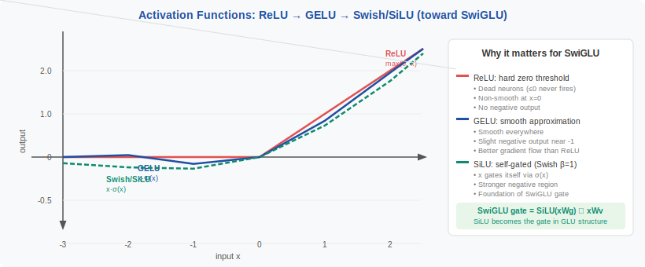
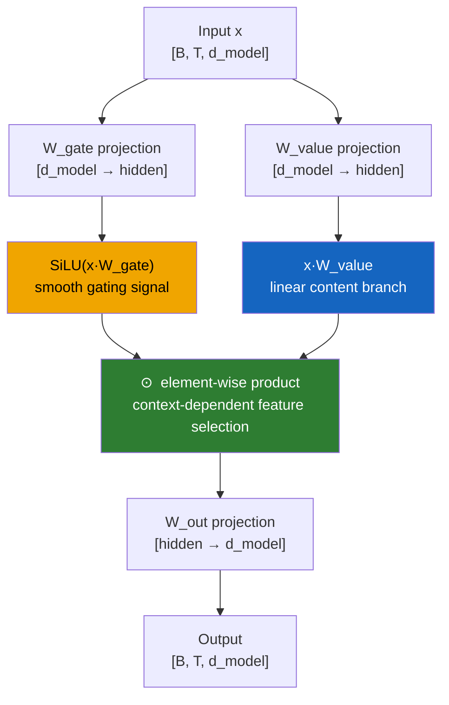
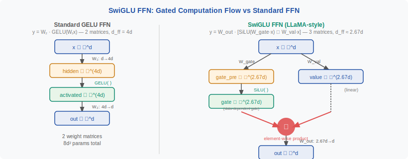

<!-- ============================ TOP NAV ============================ -->
<div align="center">

[🏠 Home](../../README.md) &nbsp;•&nbsp; [📚 Section 1 — Transformer Architecture](./README.md) &nbsp;•&nbsp; [⬅️ Q14 — RMSNorm vs LayerNorm](./q14-rmsnorm-vs-layernorm.md) &nbsp;•&nbsp; [Q17 — Dropout ➡️](./q17-dropout.md)

</div>

---

# Q15 · Explain SwiGLU and GeGLU activations. Why have they replaced ReLU/GELU in FFN blocks?

<div align="center">


</div>

> [!IMPORTANT]
> **The 20-second answer.** SwiGLU and GeGLU are **gated** feed-forward activations that replace the single-branch nonlinearity of ReLU/GELU with a **product of two learned projections**: one branch applies a smooth nonlinearity (SiLU for SwiGLU, GELU for GeGLU) and the other is a linear "value" branch — the two are multiplied element-wise. This product creates **second-order, context-dependent features**: each output dimension is gated by the full input vector, not just its own pre-activation value. The result is ~1–2 points better on language benchmarks at equal parameter count (Shazeer 2020), which is why LLaMA, Mistral, Gemma, and PaLM all ship SwiGLU by default. The price is a third weight matrix, managed by shrinking the hidden dimension from 4d to 8d/3 ≈ 2.67d to keep parameter parity.

---

## Table of contents

1. [First principles — why activations exist](#1--first-principles--why-activations-exist)
2. [The problem: context-blind selection in standard FFNs](#2--the-problem-context-blind-selection-in-standard-ffns)
3. [The mechanism precisely — derivation chain](#3--the-mechanism-precisely--derivation-chain)
4. [Why SwiGLU/GeGLU outperform ReLU/GELU](#4--why-swiglugeglU-outperform-relugelu)
5. [The parameter parity trick](#5--the-parameter-parity-trick)
6. [Comparison table: ReLU vs GELU vs Swish/SiLU vs GeGLU vs SwiGLU](#6--comparison-table-relu-vs-gelu-vs-swishsilu-vs-geglu-vs-swiglu)
7. [Algorithm & pseudocode](#7--algorithm--pseudocode)
8. [PyTorch implementation](#8--pytorch-implementation)
9. [Worked numerical example](#9--worked-numerical-example)
10. [Where it is used — and where it is not](#10--where-it-is-used--and-where-it-is-not)
11. [Hardware and systems view](#11--hardware-and-systems-view)
12. [Interview drill: the follow-ups they'll ask](#12--interview-drill-the-follow-ups-theyll-ask)
13. [Common misconceptions](#13--common-misconceptions)
14. [One-screen summary](#14--one-screen-summary)
15. [References](#15--references)

---

## 1 · First principles — why activations exist

Stack two linear layers with no activation between them:

$$y = W_2 \,(W_1 x) = (W_2 W_1)\, x = W_{\text{eff}}\, x$$

$W_2 W_1$ is just another linear map. No matter how many layers you add, the composition is still linear — you could collapse the whole stack to a single matrix multiplication. A neural network **needs nonlinearity** to break this degeneracy and represent functions that are not flat hyperplanes.

Three generations of nonlinearity, each with a different philosophy:

| Generation | Question asked | Mechanism |
|---|---|---|
| **ReLU** | *Is this feature active at all?* | Hard threshold at zero: positive = pass, negative = zero |
| **GELU** | *How active, smoothly?* | Soft probabilistic threshold; the feature is weighted by the CDF of its own value |
| **GLU family** | *What feature do I have AND how much does this context want it?* | **Multiplicative gating**: two branches, one for content, one for selection |

The key insight: ReLU and GELU perform **context-blind, scalar thresholding** — each output dimension is decided by its own pre-activation value alone. GLU-family activations perform **context-sensitive, conditional feature selection** — each output dimension is gated by a function of the entire input vector. This is a fundamentally different and more powerful computational primitive.

---

## 2 · The problem: context-blind selection in standard FFNs

A standard Transformer FFN with GELU looks like this:

$$\text{FFN}(x) = W_2 \cdot \text{GELU}(W_1 x)$$

where $W_1 \in \mathbb{R}^{d \times 4d}$ expands to a hidden dimension of $4d$ and $W_2 \in \mathbb{R}^{4d \times d}$ projects back.

Consider what happens to a single hidden neuron $h_i = (W_1 x)_i$:

- It is activated or suppressed **only** based on its own value: $\text{GELU}(h_i)$.
- The question it answers: "Is this particular projection large enough?"
- It has **no knowledge** of which token position we're at, what comes before or after, or what the rest of the hidden state looks like.

This is **context-blind selection**. The FFN learns useful linear projections, but the binary activation decision is local. It is as if a gatekeeper decided whether to let a message through by reading only that one message — not knowing who sent it, where it is going, or what else is in the mailbox.

A gated FFN changes this: the gate branch $\sigma(xW_g)$ has access to the same input $x$ as the value branch, so it can decide **based on the full context** which features to amplify and which to suppress.

<div align="center">

<br><sub><b>Figure 1.</b> ReLU (hard threshold), GELU (smooth CDF-weighted threshold), and SiLU/Swish (smooth, allows small negative values). All three are scalar: each output depends only on that scalar input. SwiGLU escapes this constraint by multiplying a SiLU branch with a separate linear projection.</sub>
</div>

---

## 3 · The mechanism precisely — derivation chain

Follow the progression from ReLU FFN to SwiGLU step by step.

**Step 1 — Standard ReLU FFN:**

$$\text{FFN}_{\text{ReLU}}(x) = W_2 \cdot \max(0,\; W_1 x)$$

One weight matrix up ($W_1$), one threshold (ReLU), one weight matrix down ($W_2$). The activation is hard, non-smooth.

**Step 2 — GELU FFN (BERT, GPT-2):**

$$\text{FFN}_{\text{GELU}}(x) = W_2 \cdot \text{GELU}(W_1 x)$$

$$\text{GELU}(x) = x \cdot \Phi(x), \quad \Phi = \text{standard normal CDF}$$

Smoother gradients, better empirical results than ReLU across NLP tasks (Hendrycks & Gimpel 2016). But still context-blind — the gate is $\Phi(h_i)$, a function of $h_i$ alone.

**Step 3 — GLU: the original gated idea (Dauphin et al. 2017):**

$$\text{GLU}(x, W, V) = (xW) \odot \sigma(xV)$$

$\odot$ denotes element-wise multiplication. Two learned projections: $xW$ provides the **content** and $\sigma(xV)$ is a **sigmoid gate**. The gate fires or suppresses each content dimension. Crucially, both branches read the same $x$, so the gate depends on the **full input context**, not just the content dimension's own value.

**Step 4 — GeGLU (Shazeer 2020):**

Replace the sigmoid gate with GELU:

$$\text{GeGLU}(x, W_g, W_v) = \text{GELU}(x W_g) \odot (x W_v)$$

$$\text{FFN}_{\text{GeGLU}}(x) = W_2 \cdot \text{GeGLU}(x, W_g, W_v)$$

GELU is smoother than sigmoid and allows negative gate values near zero (soft suppression rather than hard binary). The Shazeer (2020) paper showed GeGLU outperforming GLU on T5-style masked language modelling.

**Step 5 — SwiGLU (Shazeer 2020):**

Replace GELU with Swish / SiLU:

$$\text{SiLU}(x) = x \cdot \sigma(x) = \frac{x}{1 + e^{-x}} \qquad \text{(Swish with } \beta = 1\text{)}$$

$$\text{SwiGLU}(x, W_g, W_v) = \text{SiLU}(x W_g) \odot (x W_v)$$

$$\text{FFN}_{\text{SwiGLU}}(x) = W_2 \cdot \text{SwiGLU}(x, W_g, W_v)$$

SiLU is smooth everywhere, is unbounded above (unlike sigmoid), has a slight negative lobe (which provides a form of implicit regularization), and is computationally cheap. Shazeer (2020) found SwiGLU to be the top performer across variants, and it became the default for the next generation of LLMs.



<div align="center">

<br><sub><b>Figure 2.</b> The SwiGLU FFN. The input x fans out to two parallel projections. The gate branch applies SiLU; the value branch stays linear. Their element-wise product is the gated representation, projected back by W_out. The key property: both branches read the full x, making the gate context-aware.</sub>
</div>

---

## 4 · Why SwiGLU/GeGLU outperform ReLU/GELU

Four mutually reinforcing reasons, each distinct:

### a) Multiplicative interaction — second-order features

Standard activations are **additive**: $y_i = f(h_i)$, a one-dimensional function. A product of two projections is **multiplicative**:

$$y_i = \text{SiLU}(w_{g,i}^\top x) \cdot (w_{v,i}^\top x)$$

This is a **bilinear form in x** — a second-order feature. The output depends not just on $w_{g,i}^\top x$ and $w_{v,i}^\top x$ individually, but on their **product**, which can represent interactions between input dimensions that no linear function captures. More expressive per parameter.

### b) Context-dependent gating — conditional feature selection

In a standard GELU FFN, whether hidden unit $i$ fires depends only on $(W_1 x)_i$. In SwiGLU, the gate for unit $i$ is:

$$g_i = \text{SiLU}(w_{g,i}^\top x)$$

This gate is a function of the **full input vector** $x$, not just a single projection. The same "date-like" feature in the value branch gets amplified when the current context calls for date processing and suppressed otherwise — something a scalar threshold cannot achieve.

### c) Smooth gradients everywhere — no dead neurons

ReLU has a **zero gradient for negative inputs**: any neuron whose pre-activation is consistently negative receives no gradient signal and stops learning ("dead neuron"). GELU and SiLU are smooth and their gradients are everywhere non-zero (SiLU even has a small negative regime around $x \approx -1.3$). This improves gradient flow in deep FFN stacks and reduces the dead-neuron problem that plagues ReLU at scale.

### d) Empirical performance

Shazeer (2020) conducted a careful sweep of GLU variants on T5-style language modeling. SwiGLU and GeGLU consistently achieved **~0.5–1 perplexity point improvement** over GELU at equal parameter count (using the 8d/3 hidden-dim adjustment described in Section 5), corresponding to ~1–2 downstream task points. This is an unusually large gain for an architectural change this small, which explains the rapid adoption.

---

## 5 · The parameter parity trick

SwiGLU introduces a **third weight matrix** ($W_g$, $W_v$, $W_{\text{out}}$ instead of $W_1$, $W_2$). A naive substitution would balloon the parameter count. The fix is to reduce the hidden dimension so the total stays constant.

**Standard GELU FFN** with hidden dimension $4d$:

$$\text{params} = \underbrace{d \times 4d}_{W_1} + \underbrace{4d \times d}_{W_2} = 8d^2$$

**SwiGLU FFN** with hidden dimension $m$ (to be determined):

$$\text{params} = \underbrace{d \times m}_{W_g} + \underbrace{d \times m}_{W_v} + \underbrace{m \times d}_{W_{\text{out}}} = 3dm$$

Set them equal and solve for $m$:

$$3dm = 8d^2 \implies m = \frac{8d}{3} \approx 2.67d$$

**Round to a hardware-friendly multiple of 256** (GEMM kernels run fastest when matrix dimensions are multiples of powers of 2):

$$m = 256 \cdot \left\lfloor \frac{8d/3 + 255}{256} \right\rfloor$$

For $d = 4096$ (LLaMA-7B): $m = 8 \times 4096 / 3 \approx 10922$, rounded to $m = 11008$ (a multiple of 256 in LLaMA's implementation).

> [!IMPORTANT]
> The hidden dimension of a SwiGLU FFN is **not** $4d$. It is approximately $2.67d$. When you see $d_{\text{ff}} = 11008$ for $d_{\text{model}} = 4096$ in LLaMA, that is the $8d/3$ rule in practice. If you measure the hidden dimension and find it smaller than $4d$, **this is not a bug** — it is the parameter parity adjustment.

---

## 6 · Comparison table: ReLU vs GELU vs Swish/SiLU vs GeGLU vs SwiGLU

| Activation | Formula | Gated? | Second-order? | Smooth? | Dead neurons? | Models using it | Relative quality |
|---|---|---|---|---|---|---|---|
| **ReLU** | $\max(0, x)$ | No | No | No (kink at 0) | Yes | GPT-1, early Transformers | Baseline |
| **GELU** | $x\,\Phi(x)$ | No | No | Yes | No | BERT, GPT-2, original T5 | +baseline |
| **Swish / SiLU** | $x\,\sigma(x)$ | No | No | Yes | No | EfficientNet, some BERT variants | ≈ GELU |
| **GeGLU** | $W_2[\text{GELU}(xW_g)\odot xW_v]$ | Yes | Yes | Yes | No | Flan-T5, some PaLM variants | ++ |
| **SwiGLU** | $W_2[\text{SiLU}(xW_g)\odot xW_v]$ | Yes | Yes | Yes | No | LLaMA 1/2/3, Mistral, Gemma, PaLM, Falcon | +++ (best overall) |

> [!NOTE]
> "Second-order" means the output is a **product of two linear projections** of the input — a bilinear form. This is strictly more expressive than any composition of a single linear map with a scalar nonlinearity.

---

## 7 · Algorithm & pseudocode

**Standard GELU FFN:**

```text
INPUT : x               # [batch, seq, d_model]
        W_1             # [d_model, 4·d_model]
        W_2             # [4·d_model, d_model]
OUTPUT: y               # [batch, seq, d_model]

1.  h    ← x @ W_1                     # [B, T, 4d] — expand
2.  h    ← GELU(h)                     # scalar threshold, element-wise
3.  y    ← h @ W_2                     # [B, T, d] — contract
```

**SwiGLU FFN:**

```text
INPUT : x               # [batch, seq, d_model]
        W_gate          # [d_model, m]   where m ≈ 8d/3, rounded to multiple of 256
        W_value         # [d_model, m]
        W_out           # [m, d_model]
OUTPUT: y               # [batch, seq, d_model]

1.  gate  ← x @ W_gate                 # [B, T, m] — gate projection
2.  val   ← x @ W_value                # [B, T, m] — value projection
3.  gate  ← SiLU(gate)                 # SiLU(z) = z * sigmoid(z), smooth
    # ----- context-sensitive feature selection -----
4.  h     ← gate * val                 # [B, T, m] — element-wise product (gating)
    # -----------------------------------------------
5.  y     ← h @ W_out                  # [B, T, d] — project back
```

The only new line is **line 4**: the element-wise product of the activated gate and the linear value. Everything else is standard linear algebra plus a cheap point-wise nonlinearity.

---

## 8 · PyTorch implementation

```python
import torch
import torch.nn as nn
import torch.nn.functional as F


class SwiGLUFFN(nn.Module):
    """SwiGLU feed-forward network as used in LLaMA / Mistral.

    Hidden dimension is set to the nearest multiple of `multiple_of`
    that is >= 8 * d_model / 3 (parameter-parity with a 4d GELU FFN).
    Bias is omitted — standard in modern LLMs.
    """

    def __init__(self, d_model: int, multiple_of: int = 256):
        super().__init__()
        hidden = int(8 * d_model / 3)
        # Round up to the nearest multiple_of for hardware efficiency
        hidden = multiple_of * ((hidden + multiple_of - 1) // multiple_of)
        self.w_gate  = nn.Linear(d_model, hidden, bias=False)
        self.w_value = nn.Linear(d_model, hidden, bias=False)
        self.w_out   = nn.Linear(hidden,  d_model, bias=False)

    def forward(self, x: torch.Tensor) -> torch.Tensor:
        # x: [batch, seq_len, d_model]
        gate  = F.silu(self.w_gate(x))   # SiLU-gated branch
        value = self.w_value(x)           # linear value branch
        return self.w_out(gate * value)   # gated feature → project back


class GeGLUFFN(nn.Module):
    """GeGLU feed-forward network (GELU gate instead of SiLU).

    Performance is very close to SwiGLU; preference between them is
    typically determined by ablation on the target task.
    """

    def __init__(self, d_model: int, multiple_of: int = 256):
        super().__init__()
        hidden = int(8 * d_model / 3)
        hidden = multiple_of * ((hidden + multiple_of - 1) // multiple_of)
        self.w_gate  = nn.Linear(d_model, hidden, bias=False)
        self.w_value = nn.Linear(d_model, hidden, bias=False)
        self.w_out   = nn.Linear(hidden,  d_model, bias=False)

    def forward(self, x: torch.Tensor) -> torch.Tensor:
        gate  = F.gelu(self.w_gate(x))   # GELU-gated branch
        value = self.w_value(x)
        return self.w_out(gate * value)


# ---- Quick sanity check ----
if __name__ == "__main__":
    d_model = 512
    batch, seq = 2, 16

    swiglu = SwiGLUFFN(d_model)
    geglu  = GeGLUFFN(d_model)

    x = torch.randn(batch, seq, d_model)

    out_swiglu = swiglu(x)
    out_geglu  = geglu(x)

    assert out_swiglu.shape == (batch, seq, d_model), "SwiGLU shape mismatch"
    assert out_geglu.shape  == (batch, seq, d_model), "GeGLU shape mismatch"

    # Verify the hidden dim is 8d/3 rounded to multiple of 256
    expected_hidden = 256 * ((int(8 * d_model / 3) + 255) // 256)
    assert swiglu.w_gate.out_features == expected_hidden, (
        f"Expected hidden={expected_hidden}, got {swiglu.w_gate.out_features}"
    )

    # Parameter count: should be ≈ 8 * d_model^2 (parity with 4d GELU FFN)
    std_ffn_params = 2 * d_model * 4 * d_model            # W1 + W2 for 4d GELU FFN
    swiglu_params  = sum(p.numel() for p in swiglu.parameters())
    print(f"d_model={d_model}  |  hidden={expected_hidden}")
    print(f"Standard 4d GELU FFN params : {std_ffn_params:,}")
    print(f"SwiGLU FFN params            : {swiglu_params:,}")
    print(f"Ratio                        : {swiglu_params / std_ffn_params:.4f}")
    # Expected: ratio ≈ 1.0 (within rounding)
```

> [!WARNING]
> **Avoid bias in SwiGLU.** LLaMA, Mistral, and most modern LLMs use `bias=False` for all three linear layers in the FFN. Adding bias breaks the clean parameter-parity calculation and provides no measurable benefit at large scale. If you're porting from a GELU FFN that had biases, remove them when switching to SwiGLU.

---

## 9 · Worked numerical example

Let's trace a single hidden dimension $i$ through both a GELU FFN and a SwiGLU FFN, for the same token in two different contexts, to make the "context-dependent gating" concrete.

**Setup:** $d_{\text{model}} = 4$, looking at hidden neuron $i = 0$.

The token's embedding is $x = [0.6,\; 0.4,\; -0.2,\; 0.8]$.

Pretend $W_1$ (GELU FFN) and $W_v$ (SwiGLU value branch) project $x$ to a scalar content feature $c = w_v^\top x = 0.9$. This represents "this token looks strongly like a DATE".

**GELU FFN — context-blind:**

The GELU gate is purely a function of $c$:

$$h_0^{\text{GELU}} = \text{GELU}(0.9) = 0.9 \times \Phi(0.9) \approx 0.9 \times 0.816 = 0.734$$

Now imagine the **same token** appearing in a different document where dates are irrelevant. The feature value is still $c = 0.9$ — the input embedding is the same token, after all. The GELU output is **still 0.734**. The FFN cannot suppress this feature even though the context does not need it.

**SwiGLU FFN — context-sensitive:**

The gate branch reads the full input $x$ and produces:

$$g_0 = \text{SiLU}(w_g^\top x)$$

**Context A ("dates matter here"):** $w_g^\top x = 0.8$

$$g_0 = \text{SiLU}(0.8) = 0.8 \times \sigma(0.8) = 0.8 \times 0.690 \approx 0.552$$

$$h_0^{\text{SwiGLU}} = g_0 \times c = 0.552 \times 0.9 \approx 0.497 \quad \text{— feature passed through}$$

**Context B ("dates irrelevant here"):** The gate projection for this context gives $w_g^\top x = -1.2$

$$g_0 = \text{SiLU}(-1.2) = -1.2 \times \sigma(-1.2) = -1.2 \times 0.231 \approx -0.277$$

$$h_0^{\text{SwiGLU}} = -0.277 \times 0.9 \approx -0.249 \quad \text{— feature near-zero suppressed}$$

**The critical difference:** The GELU FFN produces 0.734 regardless of context. The SwiGLU FFN produces +0.497 in context A (feature amplified) and -0.249 in context B (feature suppressed). The gate branch — reading the same $x$ — has learned to discriminate between contexts and conditionally pass or block the DATE feature. ReLU and GELU fundamentally cannot do this because their activation depends on only a single scalar, not on the full input.

---

## 10 · Where it is used — and where it is not

**Adopted (SwiGLU or GeGLU):**

| Model | Activation | Notes |
|---|---|---|
| **LLaMA 1, 2, 3** | SwiGLU | $d_{\text{ff}} = 11008$ for $d_{\text{model}} = 4096$ (8d/3 rule) |
| **Mistral 7B / Mixtral** | SwiGLU | Follows LLaMA architecture closely |
| **Gemma (1 & 2)** | GeGLU | Google's open model; GeGLU preferred over SwiGLU |
| **PaLM / PaLM-2** | SwiGLU | Shazeer's own architecture |
| **Falcon** | SwiGLU | Technology Innovation Institute |
| **Phi-2, Phi-3** | SwiGLU | Microsoft Research |

**Not adopted (GELU or ReLU still):**

| Model | Activation | Reason |
|---|---|---|
| **BERT / RoBERTa** | GELU | Pre-dates Shazeer 2020; no re-training planned |
| **GPT-2** | GELU | Older architecture; checkpoint compatibility matters |
| **Original T5** | ReLU | Paper used ReLU; later Flan-T5 uses GeGLU |
| **GPT-3** | GELU | OpenAI hasn't published the architecture update path |
| **Vision Transformers (ViT)** | GELU | Dominated by GELU; image tasks show less benefit |

> [!NOTE]
> The choice between SwiGLU and GeGLU is empirical. Both outperform GELU by similar margins (Shazeer 2020 found SwiGLU marginally better on average). In practice: run a sweep on your target task's perplexity, check downstream eval scores, and measure throughput. Do not assume SwiGLU is universally better without validation.

---

## 11 · Hardware and systems view

Three matrix multiplications vs two introduces a subtle set of trade-offs that matter at scale.

**GEMM count and sizes:**

| | Standard GELU FFN | SwiGLU FFN |
|---|---|---|
| Matrix multiplications | 2 | 3 |
| Hidden dimension | 4d | 8d/3 ≈ 2.67d |
| Largest GEMM size (d×hidden) | d × 4d | d × 2.67d |
| Parameter parity | ✓ | ✓ (by design) |

The third GEMM ($W_g$) runs in parallel with $W_v$ in the forward pass — two independent projections of the same input. On GPUs, these can be batched into a single wider projection: project $x$ with a matrix of shape $[d, 2m]$ and split the output. Modern implementations (e.g. vLLM, Hugging Face's `transformers` with flash attention) use this batched trick to avoid two separate kernel launches.

**Elementwise cost:**

`SiLU(gate) * value` is pure elementwise arithmetic over tensors of shape $[B, T, m]$. With $m \approx 2.67d$ instead of $4d$, this is **cheaper** than the equivalent step in a 4d GELU FFN. The elementwise cost is negligible compared to the GEMMs at any practical batch size.

**Kernel fusion:**

The hottest optimization: **fuse gate + SiLU + element-wise multiply into a single CUDA kernel**. Without fusion, three separate kernel launches and two intermediate tensors (shape $[B, T, m]$ each) are materialized. With fusion, only one kernel reads `w_gate` and `w_value` outputs and writes the gated result, saving memory bandwidth. Triton/CUDA implementations (e.g. in `xformers`, FlashAttention-2 auxiliary kernels) provide this.

**Hardware-friendly width:**

Always round $m$ to a multiple of 256 (and ideally 512 for A100/H100). Matrix multiplications on tensor cores require tiles of 16×16 or larger; misaligned dimensions cause tail effects that reduce utilization. The `multiple_of=256` parameter in the implementation above handles this.

> [!TIP]
> At inference, the **weight matrices dominate memory bandwidth**. Switching from a 4d GELU FFN to an 8d/3 SwiGLU FFN **reduces the total size of FFN weights** (3 × d × 2.67d vs 2 × d × 4d = 8d² in both cases, but the 8d/3 value fits more cleanly on fewer cache lines). The real memory win comes from having **fewer dead neurons**: SwiGLU produces denser, more informative activations, which means you may reach the same quality at smaller $d_{\text{model}}$.

---

## 12 · Interview drill: the follow-ups they'll ask

<details>
<summary><b>Q: Why not just make the GELU FFN wider instead of switching to SwiGLU?</b></summary>

You could make a GELU FFN with hidden dimension $4d$ wider to match a hypothetical larger model — but the comparison is always at **equal parameter count**. At equal parameter count, SwiGLU consistently beats GELU (Shazeer 2020). The improvement is **not** explained by having more parameters; it is explained by the qualitative change in the computation: multiplicative gating enables second-order features and context-dependent selection that no scalar threshold can replicate, regardless of width. Making GELU FFNs wider just increases the number of context-blind comparisons.
</details>

<details>
<summary><b>Q: Is SwiGLU a form of attention?</b></summary>

No — the confusion is understandable but the mechanisms are distinct. Both attention and SwiGLU use **multiplication**, but:

- **Attention** multiplies a query against keys to produce a soft weight over **positions**, then uses those weights to aggregate **different tokens' value vectors**. The multiplication is across the sequence dimension.
- **SwiGLU** multiplies two projections of the **same token** together, within the FFN. There is no cross-position interaction; no sequence-dimension mixing; no key-value lookup. The gating is entirely **local to one token's representation**.

SwiGLU is better understood as "learned conditional feature selection within one position" vs. "learned weighted average across positions" (attention). They are complementary, not redundant.
</details>

<details>
<summary><b>Q: Why does multiplication (gating) matter mathematically?</b></summary>

A linear map $y = Wx$ can represent any linear function. A scalar nonlinearity $y = f(Wx)$ applied element-wise is still a function of **one projected dimension at a time** — it cannot represent interactions between dimensions except through downstream linear layers. A product of two projections $y = (W_g x) \odot (W_v x)$ is a **bilinear map**, which is quadratic in $x$:

$$y_i = (w_{g,i}^\top x)(w_{v,i}^\top x) = x^\top (w_{g,i} w_{v,i}^\top) x$$

This is a rank-1 quadratic form — richer than any linear+scalar-nonlinear combination. By learning $W_g$ and $W_v$ jointly, the model can represent interactions between **pairs of input dimensions**, not just linear projections. This is why gating is said to capture "second-order features."
</details>

<details>
<summary><b>Q: Why reduce hidden dim to 8d/3 and not keep it at 4d?</b></summary>

Because SwiGLU uses **three** weight matrices ($W_g$, $W_v$, $W_{\text{out}}$) instead of two ($W_1$, $W_2$). If you keep the hidden dim at 4d, the FFN now has $3 \times d \times 4d = 12d^2$ parameters vs. $8d^2$ for a GELU FFN — a 50% parameter increase. Setting $m = 8d/3$ gives $3dm = 8d^2$, exact parity. This matters for controlled comparisons: you want to know if SwiGLU is genuinely better at equal cost, not just because it has more parameters.
</details>

<details>
<summary><b>Q: SwiGLU vs GeGLU — which to choose?</b></summary>

In Shazeer (2020), SwiGLU had a marginally better average perplexity across T5 benchmarks, but the gap was small (within noise for many tasks). The practical decision criteria are:

1. **Ecosystem compatibility.** If you're building on LLaMA-family code, SwiGLU is already the default. If starting from a T5/Flan base, GeGLU fits naturally.
2. **Hardware.** SiLU is a single fused operation (`x * sigmoid(x)`); GELU requires a CDF approximation (usually a tanh polynomial). On modern hardware the speed difference is negligible, but SiLU is slightly simpler.
3. **Ablation on your task.** Always validate with perplexity + downstream evals on a small proxy run before committing at scale.

Default recommendation: **SwiGLU** for decoder-only LLMs (established precedent), **GeGLU** for encoder or encoder-decoder models (Flan-T5 precedent).
</details>

<details>
<summary><b>Q: How does SwiGLU interact with quantization?</b></summary>

SwiGLU has one more weight matrix than GELU FFN, so quantizing it requires calibrating three matrices instead of two — slightly more overhead but not qualitatively harder. The interesting interaction is with **activation quantization** (e.g., INT8 or INT4 activations):

- The **gate activations** (after SiLU) have a bounded, smooth distribution — SiLU's output is roughly in $[-0.28, \infty)$ with most mass near $[0, \sim 2]$. This is well-behaved for quantization.
- The **product** $\text{SiLU}(\cdot) \times (\cdot)$ can produce **outlier activations** if the value branch has large values. Some quantization schemes (e.g., SmoothQuant) need per-channel scale adjustments on the product tensor.
- **LLM.int8()** and **GPTQ** both handle SwiGLU FFNs without special treatment — the gating does not introduce fundamentally different outlier statistics compared to standard FFNs.

Empirically, SwiGLU quantizes at least as well as GELU at 8-bit precision; 4-bit requires the same calibration care as any other FFN.
</details>

---

## 13 · Common misconceptions

| ❌ Misconception | ✅ Reality |
|---|---|
| "SwiGLU is always better than GELU." | It's consistently better on language modeling tasks at equal parameter count, but the gap can vanish on small models, vision tasks, or highly task-specific fine-tuning. Always validate empirically. |
| "The hidden dim is smaller so SwiGLU is weaker." | The hidden dim is smaller (8d/3 vs 4d) to maintain **parameter parity** with a 4d GELU FFN. At equal parameter count, SwiGLU is stronger — it has the same number of parameters, just arranged more expressively via the third matrix. |
| "SwiGLU selects across tokens like attention." | SwiGLU operates entirely **within a single token's representation**. There is no cross-position mixing. The gate and value branches both read the same single-token embedding. |
| "The gate is a sigmoid (like the original GLU)." | The original Dauphin 2017 GLU used a sigmoid gate. SwiGLU uses **SiLU** ($x \cdot \sigma(x)$), which is unbounded above and allows negative gate values — qualitatively different from a sigmoid that clamps to $[0, 1]$. |
| "You need to tune the hidden dim manually." | No. The formula $m = 8d/3$ rounded to the nearest multiple of 256 gives the correct parameter-parity hidden dim automatically. It is derived, not a hyperparameter. |
| "The three matrices are slow because there are more of them." | The two parallel projections ($W_g$, $W_v$) can be **batched into one wide GEMM** $[d, 2m]$, matching the cost of a single $W_1$ projection in a standard FFN. The extra GEMM is $W_{\text{out}}$, which is the same size as $W_2$ in the baseline. |
| "GeGLU and SwiGLU are completely different architectures." | They differ only in the **gate function**: GELU vs SiLU. Structure, parameter count formula, implementation pattern, and where they are used in the Transformer block are identical. Switching between them is a one-line change. |

---

## 14 · One-screen summary

> **What:** SwiGLU and GeGLU are gated FFN activations that replace the scalar threshold of ReLU/GELU with an **element-wise product of two learned projections**: $\text{FFN}(x) = W_{\text{out}} \cdot [f(xW_g) \odot xW_v]$, where $f$ is SiLU (SwiGLU) or GELU (GeGLU).
>
> **Why better:** (1) The product is a **second-order (bilinear) feature** — strictly more expressive than any linear + scalar-nonlinearity. (2) The gate branch reads the **full input context**, enabling conditional feature selection that context-blind thresholds cannot achieve. (3) SiLU is smooth with no dead-neuron problem.
>
> **Cost management:** A third weight matrix would increase params by 50%. Fix: shrink hidden dim to $m = 8d/3 \approx 2.67d$ (rounded to multiple of 256) so total params = $3dm = 8d^2$ — **identical** to a 4d GELU FFN.
>
> **Hardware:** Two parallel GEMMs ($W_g$, $W_v$) can be batched; gate/SiLU/multiply should be kernel-fused. Dimensions must be multiples of 256 for tensor-core alignment.
>
> **Where:** LLaMA (all versions), Mistral, Gemma, PaLM, Falcon use SwiGLU. Flan-T5 uses GeGLU. BERT/GPT-2/original T5 predate this and use GELU/ReLU.

---

## 15 · References

1. Dauphin, Y. N., Fan, A., Auli, M., Grangier, D. — **Language Modeling with Gated Convolutional Networks** (2017). *ICML 2017 / arXiv:1612.08083.* — introduces the GLU (sigmoid gate); the original gated FFN.
2. Hendrycks, D., Gimpel, K. — **Gaussian Error Linear Units (GELUs)** (2016). *arXiv:1606.08415.* — the GELU activation; dominant in BERT/GPT-2.
3. Ramachandran, P., Zoph, B., Le, Q. V. — **Searching for Activation Functions (Swish)** (2017). *arXiv:1710.05941.* — introduces Swish / SiLU; later adopted as the gate function in SwiGLU.
4. Shazeer, N. — **GLU Variants Improve Transformer** (2020). *arXiv:2002.05202.* — the key paper: defines GeGLU and SwiGLU, derives the 8d/3 parameter-parity trick, reports consistent ~1-2 point improvements over GELU FFNs.
5. Chowdhery, A. et al. — **PaLM: Scaling Language Modeling with Pathways** (2022). *arXiv:2204.02311.* — first at-scale adoption of SwiGLU in a major production LLM.
6. Touvron, H. et al. — **LLaMA: Open and Efficient Foundation Language Models** (2023). *arXiv:2302.13971.* — open-weights model standardizing SwiGLU with $d_{\text{ff}} = 11008$ for $d_{\text{model}} = 4096$.

---

<!-- ============================ BOTTOM NAV ============================ -->
<div align="center">

[⬅️ Q14 — RMSNorm vs LayerNorm](./q14-rmsnorm-vs-layernorm.md) &nbsp;|&nbsp; [📚 Back to Section 1](./README.md) &nbsp;|&nbsp; [🏠 Home](../../README.md) &nbsp;|&nbsp; [Q17 — Dropout ➡️](./q17-dropout.md)

<sub>Found an error or have a sharper intuition? See <a href="../../CONTRIBUTING.md">CONTRIBUTING</a> — answers follow the <a href="../../_TEMPLATE.md">answer template</a>.</sub>

</div>
