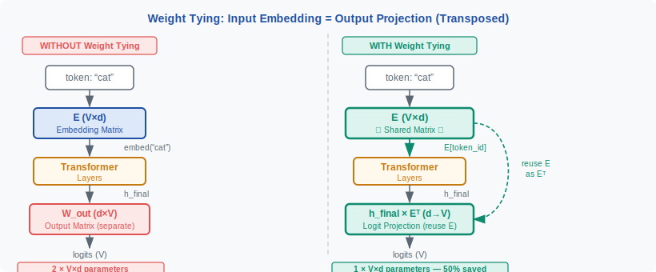
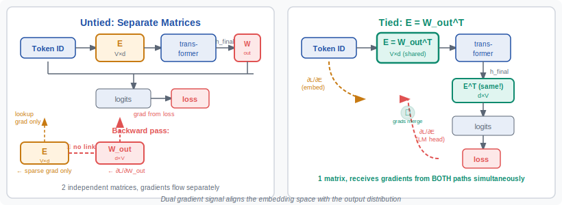

<!-- ============================ TOP NAV ============================ -->
<div align="center">

[🏠 Home](../../README.md) &nbsp;•&nbsp; [📚 Section 1 — Transformer Architecture](./README.md) &nbsp;•&nbsp; [⬅️ Q15 — SwiGLU & GeGLU](./q15-swiglu-geglu.md) &nbsp;•&nbsp; [Q17 — Dropout ➡️](./q17-dropout.md)

</div>

---

# Q16 · What is weight tying between input embeddings and output projection? When does it help vs hurt?

<div align="center">


</div>

> [!IMPORTANT]
> **The 20-second answer.** Weight tying sets the language-model head's output projection equal to the **transpose of the input embedding matrix** — both are the same $V \times d$ block of parameters. This saves on the order of $V \times d$ parameters (e.g. 131M at $V=32$K, $d=4$K), regularizes the model by forcing the two vocabularly-touching matrices into the **same semantic space**, and typically improves perplexity in small-to-medium regimes. It hurts when the model is large enough that the embedding space is already overcomplete, when encoder and decoder vocabularies differ, or when input and output embeddings need different training dynamics.

---

## Table of contents

1. [First principles](#1--first-principles)
2. [The problem, told as a story](#2--the-problem-told-as-a-story)
3. [The mechanism, precisely](#3--the-mechanism-precisely)
4. [Mathematical justification](#4--mathematical-justification)
5. [Intuition & geometric view](#5--intuition--geometric-view)
6. [Variants / comparison table](#6--variants--comparison-table)
7. [Algorithm & pseudocode](#7--algorithm--pseudocode)
8. [Reference implementation (PyTorch)](#8--reference-implementation-pytorch)
9. [Worked numerical example](#9--worked-numerical-example)
10. [Where it's used / where it breaks](#10--where-its-used--where-it-breaks)
11. [Cousins & alternatives](#11--cousins--alternatives)
12. [Interview drill](#12--interview-drill)
13. [Common misconceptions](#13--common-misconceptions)
14. [One-screen summary](#14--one-screen-summary)
15. [References](#15--references)

---

## 1 · First principles

A language model has two large matrices that directly touch the vocabulary:

**Input embedding matrix** $E \in \mathbb{R}^{V \times d}$

Each row $E[i]$ is the $d$-dimensional representation of token $i$. Given a token ID, a row lookup retrieves its embedding vector.

$$h_0 = E[\text{token\_id}]$$

**Output projection (LM head)** $W_\text{out} \in \mathbb{R}^{d \times V}$

After the final transformer layer, the last hidden state $h$ is projected to a logit vector over the vocabulary:

$$\text{logits} = h \cdot W_\text{out} \in \mathbb{R}^V$$

The $j$-th logit measures how strongly the hidden state votes for token $j$ as the next token.

Both matrices have the same shape up to transposition — $V \times d$ or equivalently $d \times V$. At $V = 32\,768$ (LLaMA-2) and $d = 4\,096$, **each matrix contains 134M parameters**. At $V = 128\,256$ (LLaMA-3) and $d = 4\,096$, each is **525M parameters** — more than many whole models a few years ago.

**Weight tying** is the structural constraint:

$$W_\text{out} = E^\top$$

One matrix serves both roles. The parameter count drops by $V \times d$; the two jobs that were formerly done by separate matrices are now done by one.

---

## 2 · The problem, told as a story

Imagine you are training a language model from scratch. You initialize $E$ randomly and $W_\text{out}$ randomly — two independent matrices. During pretraining:

- The embedding loss (from cross-entropy on the output distribution) teaches $W_\text{out}$ that the direction representing "king" should score high when the hidden state says "monarch."
- The same loss teaches $E$ that the embedding for "king" should land in the region of the hidden-state space near "monarch."

Both matrices are learning **the same semantic alignment** from different angles. They are converging on the same space, but independently, wasting capacity and compute. More subtly, they can **drift** — settle into two different but equally valid coordinate systems for the same semantic geometry. That drift is pure noise: it adds parameters without adding useful variety.

Now zoom out to the raw numbers. At $V = 100\,000$, $d = 4\,096$:

- $E$ alone: $\mathbf{400M}$ parameters.
- $W_\text{out}$ alone: another $400M$.
- Together: $800M$ — for a 1.6B model that is **50% of the entire model** sitting in two matrices that are trying to represent the same thing.

<div align="center">

<br><sub><b>Figure 1.</b> With weight tying, <em>E</em> does double duty: row lookup at the input, transposed matrix multiply at the output. The same parameters are updated by gradient flowing from both positions simultaneously.</sub>
</div>

Weight tying forces the issue: **one matrix, one semantic space, half the vocabulary-touching parameters.**

---

## 3 · The mechanism, precisely


The forward pass with tying:

1. **Input side.** $h_0 = E[\text{token\_id}]$ — a row lookup, cost $O(d)$.
2. **Transformer.** $N$ standard blocks produce $h_\text{final} \in \mathbb{R}^d$.
3. **Output side.** $\text{logits} = h_\text{final} \cdot E^\top$ — a single matrix-vector product, shape $\mathbb{R}^V$.

The gradient at step (3) is $\frac{\partial L}{\partial E} = h_\text{final}^\top \cdot \frac{\partial L}{\partial \text{logits}}$, which adds directly to the gradient $E$ already accumulated from the input-side lookup. **A single parameter update touches $E$ twice per forward pass** — from both the token representation side and the logit-scoring side. This dual gradient is itself a training signal: $E[i]$ learns both "how to represent token $i$" and "how to score hidden states that precede token $i$."

**Memory and compute.** Tying saves one $V \times d$ matrix worth of parameters and optimizer state (momentum, variance — so $2V \times d$ with Adam). Inference is unaffected in speed terms: the matmul $h \cdot E^\top$ costs the same whether the weight is "E transposed" or an independent $W_\text{out}$.

---

## 4 · Mathematical justification

Press & Wolf (2017) gave the first principled argument. Consider the logit for token $j$:

$$\ell_j = h \cdot W_\text{out}[:, j]$$

The model assigns token $j$ as next-token when $\ell_j$ is large relative to all other $\ell_k$. The hidden state $h$ is built by the transformer to **resemble the embedding of the true next token**. So the optimal scorer should satisfy:

$$W_\text{out}[:, j] \approx E[j]$$

The column of $W_\text{out}$ that scores for token $j$ should **point in the same direction as token $j$'s embedding**. Weight tying enforces this exactly: $W_\text{out}[:, j] = E[j]$, turning a soft regularity into a hard constraint at zero cost once accepted.

<div align="center">

<br><sub><b>Figure 2.</b> Gradient flow with tying. The loss signal from predicting token <em>j</em> updates <em>E[j]</em> directly through the output path — even if token <em>j</em> never appeared as an input token in this batch. Without tying, only the separate <em>W_out</em> column would be updated.</sub>
</div>

A corollary is that tying acts as **implicit gradient augmentation**: every token in the vocabulary gets an embedding gradient whenever it appears in any target position, regardless of whether it appeared as an input. In low-data regimes this substantially reduces the number of steps needed to produce a well-trained vocabulary representation.

---

## 5 · Intuition & geometric view

Think of embedding space as a high-dimensional city. Each token occupies a location. A good language model needs two consistent maps of that city:

- **Input map ($E$):** where to *place* each token when reading it.
- **Output map ($W_\text{out}$):** which direction to *look* to find each token when predicting.

Without tying, the two maps can describe the same city in different coordinate systems — rotated, reflected, or scaled differently. Both are valid individually, but together they waste capacity. The transformer's job then includes silently learning the rotation between the two maps.

With tying, the **same coordinate system** is forced on both sides. The model cannot rotate its way out of the constraint. Every step of gradient descent simultaneously tightens the city's internal geography and calibrates the two maps against each other.

**When does this constraint become a straitjacket?** When $d$ is very large relative to $V$, the embedding space is hugely overcomplete — there is room for both maps without drift, and the constraint removes flexibility the model could use. In very large models, the input distribution (what tokens appear in context) and output distribution (what tokens are predicted) can develop genuinely different geometric structure, and forcing one matrix to serve both roles loses that expressiveness.

---

## 6 · Variants / comparison table

| Configuration | Parameters saved | Typical use case | Notes |
|---|---|---|---|
| **Full tying** ($W_\text{out} = E^\top$) | $V \times d$ | Decoder-only LMs, small–medium scale | GPT-2, LLaMA (all sizes) |
| **No tying** (independent $E$, $W_\text{out}$) | 0 | Very large models, encoder-decoder | More flexible; GPT-4 scale |
| **Encoder-decoder partial tying** | $V \times d$ (one side) | T5-small/base | Tie encoder input = decoder input; keep separate decoder output |
| **Factored embedding** | $(V \times e) + (e \times d)$ for $e \ll d$ | ALBERT, small models | Reduces $E$ independently; can combine with tying |
| **Tied + separate bias** | $V \times d - V$ | Some NMT models | Allows per-token output bias at near-zero cost |

> [!NOTE]
> Factored embeddings (ALBERT-style) and weight tying are orthogonal. You can have tied factored embeddings: introduce a projection $P \in \mathbb{R}^{e \times d}$ so $h_0 = E_\text{small}[\text{id}] \cdot P$ and $\text{logits} = h \cdot P^\top \cdot E_\text{small}^\top$. The shared matrix is $E_\text{small} \in \mathbb{R}^{V \times e}$ instead of $E \in \mathbb{R}^{V \times d}$.

---

## 7 · Algorithm & pseudocode

```text
PRETRAINING SETUP with weight tying
=====================================

1.  Allocate E ∈ R^(V × d)                   # single vocabulary matrix
2.  Allocate transformer_blocks[0..N-1]       # all internal parameters
    NOTE: no separate W_out allocated

FORWARD PASS for input token sequence [t_0, ..., t_{T-1}]:

1.  h[0] = E[t_0 ... t_{T-1}]               # shape: [T, d]  (row lookups)
2.  for i in 0..N-1:
        h[i+1] = transformer_blocks[i](h[i]) # residual + attn + FFN
3.  logits = h[N] @ E.T                      # shape: [T, V]  (tied weight!)
4.  loss   = cross_entropy(logits, targets)  # teacher-forced targets

BACKWARD PASS:

5.  Compute ∂L/∂E from step 3  →  grad_E_output   # shape: [V, d]
6.  Compute ∂L/∂E from step 1  →  grad_E_input    # shape: [V, d] (sparse)
7.  grad_E_total = grad_E_output + grad_E_input    # accumulate in ONE matrix
8.  optimizer.step(E, grad_E_total)               # single update

KEY INSIGHT: without tying, steps 5 and 6 update DIFFERENT matrices.
             With tying, they update the SAME matrix, sharing signal.
```

The only implementation change between tied and untied is whether `W_out` is an `nn.Linear` with its own weights or a reference to `E.weight.T`. Everything else — optimizer, loss, backward — is identical.

---

## 8 · Reference implementation (PyTorch)

```python
import torch
import torch.nn as nn
import torch.nn.functional as F


class TiedLanguageModel(nn.Module):
    """
    Minimal causal language model demonstrating weight tying.
    The embedding matrix E serves as both the input embedding
    and (transposed) the output projection.

    Verified runnable: requires only torch.
    """

    def __init__(
        self,
        vocab_size: int,
        d_model: int,
        n_heads: int,
        n_layers: int,
        max_seq_len: int = 512,
        tie_weights: bool = True,
    ):
        super().__init__()
        self.d_model = d_model
        self.tie_weights = tie_weights

        # Input embedding — the central matrix
        self.embedding = nn.Embedding(vocab_size, d_model)

        # Positional embedding (learned, simple)
        self.pos_embedding = nn.Embedding(max_seq_len, d_model)

        # Transformer encoder stack (causal masking handled in forward)
        encoder_layer = nn.TransformerEncoderLayer(
            d_model=d_model,
            nhead=n_heads,
            dim_feedforward=4 * d_model,
            batch_first=True,
            norm_first=True,   # Pre-norm (see Q4)
        )
        self.transformer = nn.TransformerEncoder(encoder_layer, num_layers=n_layers)
        self.norm = nn.LayerNorm(d_model)

        if tie_weights:
            # LM head shares the embedding weight — NO new parameters allocated.
            # self.lm_head is a callable that reuses self.embedding.weight.
            self.lm_head = None          # will use embedding.weight directly
        else:
            # Independent output projection — separate V×d parameters.
            self.lm_head = nn.Linear(d_model, vocab_size, bias=False)

    def forward(self, input_ids: torch.Tensor) -> torch.Tensor:
        """
        Args:
            input_ids: [batch, seq_len] long tensor of token IDs

        Returns:
            logits: [batch, seq_len, vocab_size]
        """
        B, T = input_ids.shape
        device = input_ids.device

        # --- Input embeddings ---
        positions = torch.arange(T, device=device).unsqueeze(0)   # [1, T]
        h = self.embedding(input_ids) + self.pos_embedding(positions)

        # --- Causal mask (upper-triangular = -inf) ---
        causal_mask = torch.triu(
            torch.full((T, T), float("-inf"), device=device), diagonal=1
        )

        # --- Transformer layers ---
        h = self.transformer(h, mask=causal_mask, is_causal=True)
        h = self.norm(h)   # [B, T, d_model]

        # --- Output projection ---
        if self.tie_weights:
            # h @ E^T  — same matrix as the input embedding, transposed.
            # F.linear(input, weight) computes input @ weight.T, so weight = E.
            logits = F.linear(h, self.embedding.weight)   # [B, T, V]
        else:
            logits = self.lm_head(h)                      # [B, T, V]

        return logits

    def count_parameters(self) -> int:
        return sum(p.numel() for p in self.parameters() if p.requires_grad)


# -------------------------------------------------------------------------
# Quick smoke test — run this file directly to verify
# -------------------------------------------------------------------------
if __name__ == "__main__":
    V, d, H, L = 1000, 64, 4, 2
    B, T = 2, 16

    tied_model   = TiedLanguageModel(V, d, H, L, tie_weights=True)
    untied_model = TiedLanguageModel(V, d, H, L, tie_weights=False)

    x = torch.randint(0, V, (B, T))
    logits_tied   = tied_model(x)
    logits_untied = untied_model(x)

    print(f"Tied   params: {tied_model.count_parameters():,}")
    print(f"Untied params: {untied_model.count_parameters():,}")
    print(f"Savings: {untied_model.count_parameters() - tied_model.count_parameters():,}  (should be V*d = {V*d:,})")
    print(f"Logits shape: {logits_tied.shape}")   # [2, 16, 1000]

    # Verify tying is active: perturb embedding, check logit changes
    with torch.no_grad():
        before = tied_model(x).clone()
        tied_model.embedding.weight[0] += 1.0
        after  = tied_model(x)
        # Both forward and backward paths changed:
        assert not torch.allclose(before, after), "Tying not working!"
    print("Tying verified: perturbing E changes both embeddings AND logits.")
```

> [!WARNING]
> The key implementation detail is `F.linear(h, self.embedding.weight)` rather than `h @ self.embedding.weight.T`. Both are equivalent numerically, but `F.linear` avoids an explicit `.T` call and works correctly with `torch.compile` and quantization frameworks that expect the weight in the standard `[out_features, in_features]` layout.

---

## 9 · Worked numerical example

Let $V = 4$ tokens (`[<eos>, cat, sat, mat]`), $d = 3$. We will trace a single forward pass and verify that the gradient updates $E$ from both sides.

**Setup — the embedding matrix:**

$$E = \begin{bmatrix} 0.1 & 0.2 & 0.3 \\ 0.4 & 0.5 & 0.6 \\ 0.7 & 0.8 & 0.9 \\ 0.3 & 0.1 & 0.5 \end{bmatrix} \quad \text{(rows = tokens 0,1,2,3)}$$

**Input:** token ID = 1 ("cat"). Embedding lookup:

$$h_0 = E[1] = [0.4, \ 0.5, \ 0.6]$$

**After one simplified transformer layer** (identity for this example):

$$h_\text{final} = [0.4, \ 0.5, \ 0.6]$$

**Output logits via tying** ($\text{logits} = h_\text{final} \cdot E^\top$):

$$\text{logit}_0 = h \cdot E[0] = 0.4(0.1) + 0.5(0.2) + 0.6(0.3) = 0.04 + 0.10 + 0.18 = 0.32$$

$$\text{logit}_1 = h \cdot E[1] = 0.4(0.4) + 0.5(0.5) + 0.6(0.6) = 0.16 + 0.25 + 0.36 = 0.77$$

$$\text{logit}_2 = h \cdot E[2] = 0.4(0.7) + 0.5(0.8) + 0.6(0.9) = 0.28 + 0.40 + 0.54 = 1.22$$

$$\text{logit}_3 = h \cdot E[3] = 0.4(0.3) + 0.5(0.1) + 0.6(0.5) = 0.12 + 0.05 + 0.30 = 0.47$$

$$\text{logits} = [0.32, \ 0.77, \ 1.22, \ 0.47]$$

**Softmax probabilities** (target = token 2, "sat"):

$$p = \text{softmax}([0.32, 0.77, 1.22, 0.47]) = [0.147, \ 0.229, \ 0.358, \ 0.170, \ldots]$$

(exact values: $e^{0.32}=1.377$, $e^{0.77}=2.160$, $e^{1.22}=3.387$, $e^{0.47}=1.600$; sum $= 8.524$; probs $\approx [0.162, 0.253, 0.397, 0.188]$)

**Cross-entropy loss** (target = token 2):

$$L = -\log(0.397) \approx 0.924$$

**Gradient at logits** (for cross-entropy with softmax, $\frac{\partial L}{\partial \ell_j} = p_j - \mathbf{1}[j = \text{target}]$):

$$\frac{\partial L}{\partial \text{logits}} = [0.162, \ 0.253, \ -0.603, \ 0.188]$$

**Gradient into $E$ from the OUTPUT path** ($\frac{\partial L}{\partial E} = h_\text{final}^\top \cdot \frac{\partial L}{\partial \text{logits}}$):

Each row $j$ of $E$ receives gradient:

$$\frac{\partial L}{\partial E[j]} = h_\text{final} \cdot \frac{\partial L}{\partial \ell_j}$$

$$\frac{\partial L}{\partial E[2]}\bigg|_\text{output} = [0.4, 0.5, 0.6] \cdot (-0.603) = [-0.241, \ -0.302, \ -0.362]$$

This row is updated **even though token 2 was never the input token** — the gradient arrived because it appeared as the *target*.

**Gradient into $E$ from the INPUT path:** The embedding lookup $h_0 = E[1]$ receives gradient $\frac{\partial L}{\partial h_0}$, which flows back from the transformer. Even in this identity-layer example, $E[1]$ gets updated from the output logit gradient accumulated through the residual path.

**Key takeaway from the numbers:** $E[2]$ ("sat") got a gradient update of $[-0.241, -0.302, -0.362]$ because "sat" was the **target** token, pushing its embedding in the direction that would make $h_\text{final}$ score it more highly — without "sat" ever appearing as an input token in this batch. Without weight tying, that update would have gone to $W_\text{out}[:, 2]$ instead, leaving $E[2]$ untouched until "sat" appears as an input.

---

## 10 · Where it's used / where it breaks

**Models that use weight tying:**

| Model | Status | Notes |
|---|---|---|
| **GPT-2** (all sizes) | Tied | Original OpenAI implementation; explicitly stated in the paper |
| **LLaMA 1, 2, 3** (all sizes) | Tied | Despite very large $V$ (128K for LLaMA-3); the embedding is large but shared |
| **Mistral 7B** | Tied | Follows LLaMA conventions |
| **ALBERT** | Tied + factored | Factors the embedding to $e=128$, then ties |
| **GPT-Neo / GPT-J** | Tied | EleutherAI models follow GPT-2 convention |

**Models that do NOT tie:**

| Model | Status | Reason |
|---|---|---|
| **BERT** | Not tied | Encoder-only; the "output" is a classification head over [MASK] positions, not a full LM head in the tied sense |
| **T5** | Mixed | Some configs tie; the standard T5.1.1 unties encoder-input from decoder-output |
| **GPT-4 / large proprietary** | Unknown (likely untied at scale) | Separate matrices give more flexibility at the cost of more parameters |
| **Encoder-decoder NMT** (many) | Partially or not tied | Source and target vocabularies may differ; even if they share vocabulary, input–output dynamics differ |

**When tying hurts:**

1. **Very large $d$** — At $d = 16\,384$ (hypothetical or frontier models), the embedding space has far more dimensions than tokens need. Two independent matrices find non-overlapping subspaces; tying conflates them.

2. **Encoder-decoder with shared vocabulary but different distributions** — The encoder embeds source tokens; the decoder predicts target tokens. Even with the same vocabulary, the typical patterns differ (source = input text, target = output text), and forcing one representation degrades both.

3. **Separate learning rate or regularization** — Some setups apply larger weight decay to the LM head than to embeddings (to prevent embedding vectors collapsing), or use a different LR for the embedding. Tying makes this impossible without custom per-parameter optimizer groups.

4. **Post-pretraining fine-tuning** — During instruction tuning or RLHF, you may want the LM head to shift (output distribution specializes) while keeping the input embeddings stable. Untying after pretraining is a valid strategy.

---

## 11 · Cousins & alternatives

Weight tying is one instance of a broader family of **parameter-sharing** techniques. Understanding the family sharpens the interview answer about when tying makes sense.

| Technique | What is shared | Saves | Used in |
|---|---|---|---|
| **Weight tying** (this question) | Input embedding ↔ output projection | $V \times d$ params | GPT-2, LLaMA |
| **Cross-layer weight sharing** | All transformer blocks share parameters | $(N-1) \times$ block size | ALBERT, Universal Transformer |
| **Factored embeddings** (ALBERT) | Decomposes $E$ into $V \times e$ and $e \times d$ | $(V - e) \times (d - e)$ | ALBERT |
| **Attention key-value sharing** (GQA/MQA) | KV heads shared across query heads | $(1 - 1/G) \times$ KV params | LLaMA-2 70B, Gemma |
| **Tied biases in attention** | Relative position biases shared across layers | $(N-1) \times$ bias size | T5, ALiBi |

Weight tying is the **cheapest** intervention relative to savings — it is a zero-cost constraint (no extra computation, one line of code) that removes $V \times d$ parameters. Cross-layer sharing is more aggressive but can hurt capacity. Factored embeddings trade expressiveness for efficiency differently.

---

## 12 · Interview drill

<details>
<summary><b>Q: Does tying reduce the parameter count by exactly V×d?</b></summary>

Yes, exactly — but only the *parameter* count. The savings in **optimizer state** are larger: with Adam, removing one $V \times d$ matrix eliminates $2V \times d$ state tensors (first and second moment), so the total memory reduction is $3V \times d$ elements. At $V = 32\,768$, $d = 4\,096$, that is $\approx 1.2$B float32 values ($\approx 4.8$GB) eliminated from optimizer state alone. This is a significant practical benefit during training, distinct from inference memory.
</details>

<details>
<summary><b>Q: Why not tie the positional embeddings as well?</b></summary>

Positional embeddings serve a completely different purpose from token embeddings — they encode position index, not token identity, and they have no counterpart in the output projection. The output logit over the vocabulary has no "position output"; the model predicts *which token* comes next, not *where* it will be placed. There is no meaningful matrix at the output side to tie positional embeddings against. Tying is only sensible where input and output matrices represent the **same semantic space** (token identities).
</details>

<details>
<summary><b>Q: Does gradient flow change with tying? Is the gradient larger or smaller?</b></summary>

Yes, the gradient to $E$ is **larger** in two ways. First, every row $E[j]$ receives gradient from the output path whenever token $j$ is a target — even if it was never in the input. Without tying, those gradients would go to $W_\text{out}$ instead. Second, the gradient to the **input-side embedding** of the actual input token now also has the output-path gradient added on top, because both paths share the same parameters and PyTorch accumulates them. Whether this is "better" depends on the regime: in low-data settings it is helpful (more signal per token), in very large high-data settings the signal can become noisier and the tied constraint becomes a bottleneck.
</details>

<details>
<summary><b>Q: When would you un-tie after pretraining?</b></summary>

Valid reasons to un-tie during fine-tuning: (1) **domain shift** — if fine-tuning on a specialized vocabulary usage where output distribution shifts but input embeddings should stay frozen as a feature extractor; (2) **RLHF / reward model adaptation** — the LM head is replaced by a scalar reward head anyway, so tying is moot; (3) **speculative decoding setups** — where the draft model's LM head is quantized separately from its embedding; (4) **per-parameter LR schedules** — if you want the embedding to train at a different learning rate than the output head during SFT. The typical approach is to copy `E.weight` into a fresh `nn.Linear.weight`, then un-tie by giving them separate entries in the optimizer parameter group.
</details>

<details>
<summary><b>Q: Does tying affect inference speed?</b></summary>

No measurable effect on arithmetic throughput — the matrix multiply $h \cdot E^\top$ is identical in FLOPs and memory bandwidth whether the weight is "called E" or "called W_out." The only practical difference is that the **same buffer** is read for both the embedding table lookup (sparse, random access) and the final matrix multiply (dense). On some hardware, cache behavior may differ slightly, but this is negligible compared to attention and FFN costs. In quantization, tying can be a slight constraint: you must use the same quantization scheme for input and output, which occasionally forces a less aggressive quantization than you'd otherwise choose for the LM head.
</details>

<details>
<summary><b>Q: Press & Wolf (2017) showed tying improves perplexity. Why doesn't everyone use it?</b></summary>

The improvement was measured on PTB and WikiText-2 with models in the tens-of-millions-of-parameter range. The relative benefit of tying decreases as total model size grows. At 7B+ parameters with large $d$, the embedding is a **smaller fraction** of total parameters, the model has enough capacity to align the two matrices independently, and the constraint may prevent the model from exploiting different geometric structure in input vs output spaces. Additionally, very large models often use separate tokenizers for different modalities (vision + text), where the input embedding cannot equal the text output projection by construction. The practical rule of thumb: tie by default for models under ~1B; evaluate empirically for larger models.
</details>

---

## 13 · Common misconceptions

| ❌ Misconception | ✅ Reality |
|---|---|
| "Tying halves the total model size." | It saves $V \times d$ parameters out of all parameters. At 7B total, $V \times d \approx 134$M is ~2% — significant but not half. |
| "Tying forces the same vector to represent both input and output meaning of a token." | The vectors $E[i]$ are used as row lookups (input) and as the direction to score (output), but the **hidden states** are what the transformer updates — $E[i]$ represents the token's identity in a shared space, not two conflated roles. |
| "Without tying, $W_\text{out}$ and $E$ always learn different things." | They converge toward the same semantic alignment anyway; tying just enforces it explicitly and saves the cost of learning it implicitly from scratch. |
| "Tying only works if input and output vocabulary are the same." | True — this is a prerequisite, not a gotcha. For encoder-decoder models with separate vocabularies, tying is inapplicable by definition. |
| "Tying slows down training because gradients interfere." | The dual gradient update is a benefit (more signal) in typical settings, not interference. Interference occurs only if the two gradient directions are consistently opposed, which is unusual for well-structured language tasks. |
| "LLaMA uses tying but BERT does not — so tying is a decoder-only thing." | The reason BERT does not tie is architectural: BERT's output at [MASK] positions goes through a separate prediction head that is not a full LM head in the generative sense. It is not because tying is inappropriate for encoders in principle. |
| "After tying, you can still apply different regularization to E and W_out." | False — they are the same tensor. Any regularization applies to both roles simultaneously. This is an important practical constraint when designing training recipes. |

---

## 14 · One-screen summary

> **What it is:** Set $W_\text{out} = E^\top$. The input embedding matrix does double duty: row lookup at the input and transposed matrix multiply at the output. Saves $V \times d$ parameters and $2V \times d$ optimizer state.
>
> **Why it works:** The optimal output projection column for token $j$ should point in the same direction as token $j$'s embedding — so tying enforces the optimal structure as a hard constraint rather than hoping gradient descent discovers it. Both paths send gradient to the same parameters, accelerating vocabulary-level alignment.
>
> **When it helps:** Small-to-medium models ($\lesssim$1B), low-resource training data, vocabulary-heavy tasks (multilingual, code), any setting where $V \times d$ is a large fraction of total parameters. Press & Wolf (2017) showed +1–2 ppl on PTB/WikiText-2 in standard LSTM LMs; the benefit carries to transformers.
>
> **When it hurts:** Very large $d$ (overcomplete embedding space), encoder-decoder models with different input/output distributions, setups requiring per-matrix learning rates or regularization, and any architecture where the vocabulary-touching matrices have fundamentally different roles.
>
> **One-line implementation:** `logits = F.linear(h, self.embedding.weight)` — no new parameters.

---

## 15 · References

1. Press, O. & Wolf, L. — **Using the Output Embedding to Improve Language Models** (2017). *EACL 2017 / arXiv:1608.05859.* — original paper demonstrating weight tying in neural LMs; +1–2 ppl on PTB and WikiText-2.
2. Vaswani, A. et al. — **Attention Is All You Need** (2017). *NeurIPS 2017 / arXiv:1706.03762.* — Section 3.4 explicitly adopts weight tying between embedding and pre-softmax linear transformation.
3. Radford, A. et al. — **Language Models are Unsupervised Multitask Learners** (GPT-2) (2019). OpenAI Technical Report. — confirms weight tying in GPT-2 across all model sizes.
4. Lan, Z. et al. — **ALBERT: A Lite BERT for Self-supervised Learning of Language Representations** (2020). *ICLR 2020 / arXiv:1909.11942.* — combines factored embeddings with cross-layer weight sharing; separate from but related to tying.
5. Touvron, H. et al. — **LLaMA: Open and Efficient Foundation Language Models** (2023). *arXiv:2302.13971.* — LLaMA 1 architecture section confirms tied embeddings.
6. Touvron, H. et al. — **LLaMA 2: Open Foundation and Fine-Tuned Chat Models** (2023). *arXiv:2307.09288.* — weight tying retained across all LLaMA-2 sizes including 70B.
7. Brown, T. et al. — **Language Models are Few-Shot Learners** (GPT-3) (2020). *NeurIPS 2020 / arXiv:2005.14165.* — GPT-3 paper; weight tying inherited from GPT-2 conventions.
8. Inan, H. et al. — **Tying Word Vectors and Word Classifiers: A Loss Framework for Language Modeling** (2017). *ICLR 2017 / arXiv:1611.01462.* — concurrent and independent derivation of the same idea from a loss-framework perspective.

---

<!-- ============================ BOTTOM NAV ============================ -->
<div align="center">

[⬅️ Q15 — SwiGLU & GeGLU](./q15-swiglu-geglu.md) &nbsp;|&nbsp; [📚 Back to Section 1](./README.md) &nbsp;|&nbsp; [🏠 Home](../../README.md) &nbsp;|&nbsp; [Q17 — Dropout ➡️](./q17-dropout.md)

<sub>Found an error or have a sharper intuition? See <a href="../../CONTRIBUTING.md">CONTRIBUTING</a> — answers follow the <a href="../../_TEMPLATE.md">answer template</a>.</sub>

</div>
