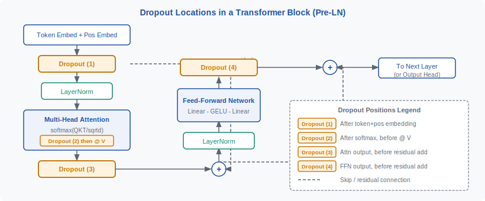
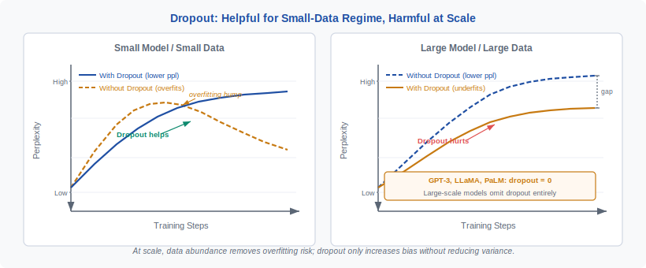

<!-- ============================ TOP NAV ============================ -->
<div align="center">

[🏠 Home](../../README.md) &nbsp;•&nbsp; [📚 Section 1 — Transformer Architecture](./README.md) &nbsp;•&nbsp; [⬅️ Q16 — Weight Tying](./q16-weight-tying.md) &nbsp;•&nbsp; [Q18 — QK-norm ➡️](./q18-qk-norm.md)

</div>

---

# Q17 · Explain the role of dropout in Transformers. Why is it often turned off entirely for large-scale pretraining?

<div align="center">


</div>

> [!IMPORTANT]
> **The 20-second answer.** Dropout randomly zeroes activations during training, acting as an ensemble of exponentially many subnetworks to prevent co-adaptation — a powerful regularizer when data is scarce relative to model capacity. At large-scale pretraining on trillions of tokens, **data itself is the regularizer**: the model never sees the same sequence twice, so overfitting is not the risk; underfitting and wasted compute are. Dropout actively hurts large-scale training by destroying gradient signal and preventing full utilization of every parameter on every step — which is why GPT-3, LLaMA, and PaLM all set $p = 0$.

---

## Table of contents

1. [First principles](#1--first-principles)
2. [The problem, told as a story](#2--the-problem-told-as-a-story)
3. [The mechanism, precisely](#3--the-mechanism-precisely)
4. [Where dropout lives in a Transformer block](#4--where-dropout-lives-in-a-transformer-block)
5. [The intuition and geometric view](#5--the-intuition-and-geometric-view)
6. [Variants and comparison table](#6--variants-and-comparison-table)
7. [Algorithm and pseudocode](#7--algorithm-and-pseudocode)
8. [Reference implementation (PyTorch, runnable)](#8--reference-implementation-pytorch-runnable)
9. [Worked numerical example](#9--worked-numerical-example)
10. [Where it is used and where it breaks](#10--where-it-is-used-and-where-it-breaks)
11. [Cousins and alternatives](#11--cousins-and-alternatives)
12. [Interview drill](#12--interview-drill)
13. [Common misconceptions](#13--common-misconceptions)
14. [One-screen summary](#14--one-screen-summary)
15. [References](#15--references)

---

## 1 · First principles

Dropout (Srivastava et al., 2014) is a stochastic regularization technique. During a training forward pass, each activation unit is independently set to zero with probability $p$ (the **dropout rate**) and scaled up by $\frac{1}{1-p}$ otherwise, so the **expected value of every activation is unchanged**:

$$\mathbb{E}[x_{\text{drop}}] = (1-p)\cdot\frac{x}{1-p} + p\cdot 0 = x$$

This is **inverted dropout**, and it is the universal PyTorch default. No scaling is needed at inference — the network is used as-is and the expected activation is already correct.

Formally, for activation vector $\mathbf{x} \in \mathbb{R}^n$, a binary mask $\mathbf{m} \sim \text{Bernoulli}(1-p)^n$ is drawn fresh at each forward pass:

$$\tilde{x}_i = \frac{m_i \cdot x_i}{1 - p}$$

The model that survives each mask is a **thinned subnetwork**. Across all possible masks, training implicitly samples from a collection of $2^n$ distinct subnetworks that share weights — an exponentially large ensemble trained simultaneously.

**Primary effect:** Co-adaptation is broken. No neuron can learn to fix the mistakes of a specific partner neuron, because that partner may be absent next step. Every unit must learn a feature that is independently useful — the representational redundancy this creates is exactly what prevents overfitting.

---

## 2 · The problem, told as a story

It is 2017. You have a 6-layer Transformer for machine translation, trained on WMT English-German (4.5M sentence pairs). The model has 65M parameters. Your training loss is falling beautifully; your validation BLEU is not. The gap widens step after step. The model is **memorizing**, not generalizing.

This is the classical overfitting regime: **model capacity far exceeds what the data can constrain**. The model finds a near-zero-loss solution on training data that does not generalize. The original Transformer paper (Vaswani et al., 2017) addressed this with residual dropout at $p = 0.1$; it was listed as essential to the model's performance.

<div align="center">

<br><sub><b>Figure 1.</b> The four canonical dropout insertion points in a Transformer block. Each targets a different information pathway to prevent co-adaptation at that layer of processing.</sub>
</div>

Now jump forward to 2020. You have GPT-3: 175B parameters trained on ~300B tokens from a corpus that will never repeat itself within any reasonable training budget. **The regime has completely flipped.** The risk is not that the model memorizes the training set — the model will never even finish one epoch. The bottleneck is compute and data throughput. In this world, dropout does not help: it randomly discards gradient signal, prevents parameters from learning on every step, and slows convergence. GPT-3 disables it entirely.

---

## 3 · The mechanism, precisely


Three distinct effects are happening simultaneously:

1. **Regularization via ensemble approximation.** Each forward pass trains a different subnetwork. At inference, the full network with no dropout computes an approximation of the geometric mean of all $2^n$ subnetwork predictions. This is the classic Srivastava et al. interpretation.

2. **Noise injection as data augmentation.** The random zeroing adds stochastic noise to every layer's representation, making the loss landscape less smooth and the model more robust to small perturbations. This is related to why dropout and data augmentation interact well.

3. **Implicit L2 regularization.** Srivastava et al. showed that dropout applied to a linear model is equivalent to an L2 penalty on the weights, scaled by the input variance. In deep networks the effect is more complex but the regularizing intent is the same.

The **train/inference discrepancy** is important: during training, activations are randomly zeroed. During inference, all neurons are active. This is why `model.eval()` in PyTorch must be called before evaluation — it switches `nn.Dropout` modules to pass-through mode.

> [!WARNING]
> **The most common dropout bug in practice**: forgetting to call `model.eval()` before inference or `model.train()` before resuming training. Evaluation with dropout active gives noisy, non-reproducible predictions and underestimates true model quality. Training without dropout active after you intended it removes your regularizer silently.

---

## 4 · Where dropout lives in a Transformer block

Four distinct insertion points appear in the original Transformer (Vaswani et al., 2017) and its immediate successors:

**1. Embedding dropout** — Applied to the sum of token embeddings and positional encodings before the first layer. Probability $p_e$, typically matching the residual dropout rate.

$$\mathbf{h}_0 = \text{Dropout}(\mathbf{E}_\text{token} + \mathbf{E}_\text{pos}, p_e)$$

**2. Attention weight dropout** — Applied to the attention probability distribution *after* the softmax and *before* multiplying by $V$. Each attention score is zeroed independently.

$$\tilde{A}_{ij} = \text{Dropout}\!\left(\text{softmax}\!\left(\frac{QK^\top}{\sqrt{d_k}}\right), p_\text{attn}\right)$$

This forces the model to attend to multiple positions rather than concentrating on one, serving as a targeted anti-collapse regularizer for the attention pattern.

**3. Residual dropout (post-attention)** — Applied to the output of the attention sublayer before the residual addition and LayerNorm.

$$\mathbf{h} \leftarrow \text{LayerNorm}\!\left(\mathbf{h} + \text{Dropout}(\text{Attn}(\mathbf{h}), p_r)\right)$$

**4. Residual dropout (post-FFN)** — Applied identically to the output of the feedforward sublayer before its residual addition.

$$\mathbf{h} \leftarrow \text{LayerNorm}\!\left(\mathbf{h} + \text{Dropout}(\text{FFN}(\mathbf{h}), p_r)\right)$$

BERT and GPT-2 additionally apply dropout between the two linear layers of the FFN (FFN intermediate dropout). In BERT's fine-tuning recipe, $p_r = 0.1$ is standard and credited with preventing overfitting to small task datasets.

<div align="center">

<br><sub><b>Figure 2.</b> The regime shift. In the small-data regime (left), dropout closes the train-val gap. In the large-scale regime (right), overfitting is not present and dropout only adds noise that raises both losses and slows convergence.</sub>
</div>

---

## 5 · The intuition and geometric view

Think of the weight matrix of a layer as describing a set of **feature detectors**. Without dropout, nothing stops two neurons from learning to detect the same feature — or from learning a feature only because another neuron always corrects for it downstream. This is **co-adaptation**, and it is the core disease dropout cures.

Geometrically, in a learned representation space, co-adapted neurons produce **correlated, redundant basis vectors**. Dropout forces the model toward an **overcomplete, decorrelated representation**: many features, each independently useful, spread across the space rather than clustered.

Concretely: imagine a neuron $A$ that detects "the subject of a sentence" and a neuron $B$ that refines $A$'s output. If $B$ is sometimes absent (dropout), $A$ must learn to produce a clean, self-contained representation on its own. This distributes the representational burden — and when both $A$ and $B$ are present at inference, you get something better than either alone would produce, approximating the ensemble average.

**The temperature analogy:** dropout at rate $p$ means only $(1-p)$ of a layer's neurons contribute on any step. The gradient signal received by each weight comes from fewer forward paths, which regularizes in the same way that a smaller effective batch size regularizes — but applied stochastically per-neuron rather than globally.

**Why this fails at scale:** when data tokens per parameter is extremely large (e.g. Chinchilla: ~20 tokens/param; GPT-3: ~1.7 tokens/param), the model is in an **underfitting** regime, not an overfitting regime. The gradient signal from fresh data is already non-redundant. Adding dropout to a fresh-data stream is like adding artificial blur to a dataset you haven't even looked at yet — it can only hurt.

---

## 6 · Variants and comparison table

| Variant | What is dropped | Granularity | Common use case |
|---|---|---|---|
| **Standard dropout** (Srivastava 2014) | Individual activations/neurons | Per-element | Fully connected layers, FFN intermediates |
| **Attention weight dropout** | Individual attention scores | Per attention entry | Transformer attention sublayer |
| **DropPath / Stochastic Depth** (Huang 2016) | Entire residual branches | Per-sample, per-layer | Deep ResNets, ViT pretraining |
| **LayerDrop** (Fan 2019) | Entire Transformer layers | Per-layer | LLM fine-tuning, structured pruning |
| **DropConnect** (Wan 2013) | Individual weights (not activations) | Per-weight | Rarely used in practice |
| **Variational dropout** (Gal 2016) | Activations, same mask per sequence | Per-column, tied across time | BayesNLP, uncertainty estimation |
| **Spatial dropout** | Entire feature maps | Per-channel | CNNs with spatially correlated features |

**Key distinction: standard dropout vs. stochastic depth.**

Standard dropout zeroes *individual neurons* within a layer — the layer itself still runs, just with partial information. Stochastic depth zeroes an *entire residual block* — when a layer is dropped, the residual connection short-circuits it entirely and the full activation passes through unmodified. Stochastic depth lets the surviving layers receive the **full gradient signal** in their active steps, unlike standard dropout which gives every layer partial gradients always.

---

## 7 · Algorithm and pseudocode

```text
TRAINING FORWARD PASS (inverted dropout):
INPUT:  x             # [batch, seq, d_model] activation tensor
        p             # dropout probability (e.g. 0.1)
OUTPUT: x_out         # activation with same expected value as x

1.  if not training:
        return x      # no-op at inference — crucial

2.  m ~ Bernoulli(1 - p)  sampled iid for each element of x
                       # shape: same as x
                       # m_i = 1 with prob (1-p), m_i = 0 with prob p

3.  x_out = (m * x) / (1 - p)
                       # zero out dropped elements
                       # scale up survivors to preserve expected value

4.  return x_out


TRANSFORMER BLOCK (with residual dropout):
INPUT:  h             # [batch, seq, d_model]
OUTPUT: h_out

1.  attn_out = MultiHeadAttention(h)
2.  attn_out = Dropout(attn_out, p=p_r)   # post-attention residual dropout
3.  h = LayerNorm(h + attn_out)

4.  ffn_out = FFN(h)
5.  ffn_out = Dropout(ffn_out, p=p_r)    # post-FFN residual dropout
6.  h_out = LayerNorm(h + ffn_out)

7.  return h_out


LARGE-SCALE PRETRAINING (p=0, GPT-3 / LLaMA style):
1.  All Dropout(p=0.0) → identity transforms
2.  No mask sampling, no scaling, no train/eval discrepancy
3.  Every neuron contributes to every gradient every step
```

---

## 8 · Reference implementation (PyTorch, runnable)

```python
import torch
import torch.nn as nn
import torch.nn.functional as F
import math


class TransformerBlockWithDropout(nn.Module):
    """Single Transformer block (pre-norm style) demonstrating all four
    canonical dropout insertion points from Vaswani et al. (2017).

    Set p_residual=0.0 and p_attn=0.0 to replicate the GPT-3/LLaMA
    large-scale pretraining configuration (dropout fully disabled).
    """

    def __init__(
        self,
        d_model: int = 256,
        n_heads: int = 4,
        d_ff: int = 1024,
        p_residual: float = 0.1,   # post-attention and post-FFN dropout
        p_attn: float = 0.1,        # attention weight dropout
    ):
        super().__init__()
        assert d_model % n_heads == 0
        self.n_heads = n_heads
        self.d_head = d_model // n_heads

        # Projections
        self.qkv = nn.Linear(d_model, 3 * d_model, bias=False)
        self.out_proj = nn.Linear(d_model, d_model, bias=False)

        # FFN
        self.ff1 = nn.Linear(d_model, d_ff, bias=False)
        self.ff2 = nn.Linear(d_ff, d_model, bias=False)

        # Norms (pre-norm style)
        self.norm1 = nn.LayerNorm(d_model)
        self.norm2 = nn.LayerNorm(d_model)

        # Dropout modules — calling model.eval() disables all of these automatically
        self.attn_drop = nn.Dropout(p_attn)       # on attention weights (point 2)
        self.resid_drop = nn.Dropout(p_residual)  # on residual outputs (points 3+4)

        self.d_model = d_model

    def forward(self, x: torch.Tensor) -> torch.Tensor:
        """x: [batch, seq, d_model]"""
        B, T, _ = x.shape

        # ---- Attention sublayer ----
        residual = x
        x = self.norm1(x)
        q, k, v = self.qkv(x).chunk(3, dim=-1)

        # Split into heads: [B, heads, T, d_head]
        def split_heads(t):
            return t.view(B, T, self.n_heads, self.d_head).transpose(1, 2)

        q, k, v = map(split_heads, (q, k, v))

        # Scaled dot-product attention
        scale = math.sqrt(self.d_head)
        logits = (q @ k.transpose(-2, -1)) / scale          # [B, H, T, T]

        # Causal mask for autoregressive models
        mask = torch.triu(torch.ones(T, T, device=x.device), diagonal=1).bool()
        logits = logits.masked_fill(mask, float("-inf"))

        attn_weights = logits.softmax(dim=-1)

        # DROPOUT POINT 2: attention weight dropout
        attn_weights = self.attn_drop(attn_weights)

        context = attn_weights @ v                           # [B, H, T, d_head]
        context = context.transpose(1, 2).reshape(B, T, -1) # [B, T, d_model]
        context = self.out_proj(context)

        # DROPOUT POINT 3: residual dropout (post-attention)
        x = residual + self.resid_drop(context)

        # ---- FFN sublayer ----
        residual = x
        x = self.norm2(x)
        x = F.gelu(self.ff1(x))
        # (FFN intermediate dropout would slot in here for BERT-style models)
        x = self.ff2(x)

        # DROPOUT POINT 4: residual dropout (post-FFN)
        x = residual + self.resid_drop(x)

        return x


class TokenEmbeddingWithDropout(nn.Module):
    """Embedding layer demonstrating dropout insertion point 1."""

    def __init__(self, vocab_size: int, d_model: int, max_len: int, p_embed: float = 0.1):
        super().__init__()
        self.token_emb = nn.Embedding(vocab_size, d_model)
        self.pos_emb = nn.Embedding(max_len, d_model)
        # DROPOUT POINT 1: embedding dropout
        self.drop = nn.Dropout(p_embed)

    def forward(self, idx: torch.Tensor) -> torch.Tensor:
        B, T = idx.shape
        pos = torch.arange(T, device=idx.device).unsqueeze(0)
        return self.drop(self.token_emb(idx) + self.pos_emb(pos))


# --- Demonstration ---
if __name__ == "__main__":
    torch.manual_seed(42)

    block = TransformerBlockWithDropout(
        d_model=64, n_heads=4, d_ff=256,
        p_residual=0.1, p_attn=0.1
    )

    x = torch.randn(2, 8, 64)   # batch=2, seq=8, d_model=64

    # Training mode: dropout is active, outputs are stochastic
    block.train()
    out_train_a = block(x)
    out_train_b = block(x)
    print("Training mode — same input, two outputs differ:")
    print(f"  Max diff: {(out_train_a - out_train_b).abs().max().item():.4f}  (non-zero because dropout)")

    # Inference mode: dropout is off, outputs are deterministic
    block.eval()
    out_eval_a = block(x)
    out_eval_b = block(x)
    print("Inference mode — same input, two outputs identical:")
    print(f"  Max diff: {(out_eval_a - out_eval_b).abs().max().item():.4f}  (should be 0.0)")

    # Large-scale pretraining: disable dropout entirely via p=0.0
    block_no_drop = TransformerBlockWithDropout(
        d_model=64, n_heads=4, d_ff=256,
        p_residual=0.0,   # GPT-3 / LLaMA style: p=0 throughout
        p_attn=0.0
    )
    block_no_drop.train()
    out_a = block_no_drop(x)
    out_b = block_no_drop(x)
    print("p=0.0 in train mode — outputs are deterministic even without model.eval():")
    print(f"  Max diff: {(out_a - out_b).abs().max().item():.4f}  (0.0 since p=0)")
```

> [!NOTE]
> **The `p=0.0` shortcut.** In PyTorch, `nn.Dropout(p=0.0)` is an identity transform in both train and eval mode. Large-scale codebases such as LLaMA simply pass `dropout=0.0` in their config and never instantiate meaningful dropout modules — no special `model.eval()` call is needed for dropout (though you should still call it for BatchNorm and similar stateful layers if present).

---

## 9 · Worked numerical example

A concrete walk-through of inverted dropout on a single 4-neuron layer with $p = 0.5$.

**Setup.** Post-FFN activations before dropout:

$$\mathbf{x} = [2.0,\; {-1.0},\; 3.5,\; 0.8]$$

**Step 1 — Sample the binary mask.** Each position is independently 1 with probability $0.5$, 0 with probability $0.5$. Suppose this draw gives:

$$\mathbf{m} = [1,\; 0,\; 1,\; 0]$$

Neurons 2 and 4 are dropped (zeroed). Neurons 1 and 3 survive.

**Step 2 — Apply the mask.**

$$\mathbf{x} \odot \mathbf{m} = [2.0 \cdot 1,\; {-1.0} \cdot 0,\; 3.5 \cdot 1,\; 0.8 \cdot 0] = [2.0,\; 0,\; 3.5,\; 0]$$

**Step 3 — Scale up by $\frac{1}{1-p} = \frac{1}{0.5} = 2$.**

$$\tilde{\mathbf{x}} = 2 \cdot [2.0,\; 0,\; 3.5,\; 0] = [4.0,\; 0,\; 7.0,\; 0]$$

**Step 4 — Verify expected value is preserved.** The surviving neurons are scaled up by $2\times$. On average, each neuron survives 50% of steps. So:

$$\mathbb{E}[\tilde{x}_1] = 0.5 \cdot 4.0 + 0.5 \cdot 0 = 2.0 = x_1 \checkmark$$
$$\mathbb{E}[\tilde{x}_3] = 0.5 \cdot 7.0 + 0.5 \cdot 0 = 3.5 = x_3 \checkmark$$

The expected activation matches the original. At inference, no mask is applied and no scaling is needed — the network outputs $[2.0, -1.0, 3.5, 0.8]$ exactly, which matches the expected training-time output.

**What the downstream residual sees.** If the residual stream coming in was $\mathbf{r} = [1.0, 1.0, 1.0, 1.0]$, the post-add is $[1.0 + 4.0,\; 1.0 + 0,\; 1.0 + 7.0,\; 1.0 + 0] = [5.0,\; 1.0,\; 8.0,\; 1.0]$.

On the *next* step, a completely different mask might give $\mathbf{m} = [0, 1, 0, 1]$, so neurons 2 and 4 would carry all the signal. No single neuron can rely on a partner always being there — co-adaptation is broken.

**The large-scale pretraining case ($p = 0$).** The mask is always all-ones, the scale factor is 1. Output is $[2.0, -1.0, 3.5, 0.8]$ — identical every step. Every neuron contributes to every gradient, every step. The full $\frac{\partial \mathcal{L}}{\partial w}$ is computed for every weight on every update.

---

## 10 · Where it is used and where it breaks

**Dropout is beneficial when:**

- Training a small/medium model on a limited dataset (original Transformer on WMT, BERT on Wikipedia+BooksCorpus)
- Fine-tuning a large pretrained model on a small downstream task — BERT fine-tuning uses $p = 0.1$ and it is credited with most of the regularization benefit in the published recipe
- Training ViT on ImageNet (where the dataset, while large, is much smaller than language pretraining corpora) — DeiT explicitly trains with dropout and stochastic depth
- Any setting where training loss is significantly below validation loss (clear overfitting gap)

**Dropout is counterproductive when:**

- Large-scale pretraining on web-scale corpora: GPT-3 (no dropout), LLaMA 1/2/3 (no dropout), PaLM (no dropout), Chinchilla (no dropout). The dataset is so large that the model will never overfit — the bottleneck is compute, not regularization.
- Compute-constrained pretraining: if you are training for $N$ steps on $N$ unique batches, dropout wastes information on every step by discarding activations that could have contributed to learning.
- When attention dropout is high enough to destroy the attention entropy that QK-norm (see [Q18](./q18-qk-norm.md)) is trying to maintain — there is tension between the two techniques.

**The empirical record on large models:**

| Model | Parameters | Dropout during pretraining |
|---|---|---|
| GPT-2 (Radford 2019) | 1.5B | Residual $p=0.1$, attn $p=0.1$ |
| GPT-3 (Brown 2020) | 175B | **None** |
| PaLM (Chowdhery 2022) | 540B | **None** |
| Chinchilla (Hoffmann 2022) | 70B | **None** |
| LLaMA 1 (Touvron 2023) | 7B–65B | **None** |
| LLaMA 2 (Touvron 2023) | 7B–70B | **None** |
| BERT (Devlin 2018) | 340M | $p=0.1$ throughout |
| ViT-B/16 DeiT (Touvron 2021) | 86M | $p=0.1$ + stochastic depth |

GPT-2 (1.5B) is the last significant model in the GPT line to use dropout for pretraining. GPT-3 onwards it disappears entirely.

---

## 11 · Cousins and alternatives

All of the following address the same underlying tension between **regularization** and **information preservation**, but at different granularities.

| Technique | What is dropped | When to prefer over dropout |
|---|---|---|
| **Weight decay (L2)** | No activations; penalizes weight magnitude | Always active, no train/eval gap, preferred default regularizer at scale |
| **Stochastic depth / DropPath** (Huang 2016) | Entire residual branches per sample | Deep networks; allows full layer gradient when active; used in ViT and EfficientNet |
| **LayerDrop** (Fan 2019) | Entire Transformer layers during training | Enables structured pruning post-training; every surviving layer trains at full capacity |
| **Data augmentation** | No activations; augments the input | When the bottleneck is input diversity (vision, audio) |
| **Label smoothing** | No activations; softens the target distribution | Prevents overconfidence in the output distribution; complements or replaces dropout at scale |
| **MC Dropout** (Gal 2016) | Activations, at inference time deliberately | When predictive uncertainty estimates are needed |
| **ZoneOut** (Krueger 2016) | RNN hidden states (keeps previous state instead of zeroing) | Recurrent models; maintains longer-term state |

**Stochastic depth vs. dropout in detail.** Standard dropout at rate $p$ means every layer processes noisy partial activations at every step. Stochastic depth drops an entire layer with probability $p_L$ (often annealed linearly from 0 at layer 1 to $p_L$ at the last layer) and uses the **unmodified residual** when a layer is dropped. The surviving layers run at full capacity. This is a strictly superior regularizer for deep networks because it does not corrupt the gradient paths in the layers that do run. LLM practitioners who want regularization at scale tend to use stochastic depth or LayerDrop rather than standard dropout.

---

## 12 · Interview drill

<details>
<summary><b>Q: Does dropout change model.eval() behavior?</b></summary>

Yes — it is a primary reason `model.eval()` exists in PyTorch. `nn.Dropout` maintains an internal flag (`self.training`) that is toggled by `model.train()` and `model.eval()`. In eval mode, `nn.Dropout` is a pure identity function regardless of the configured $p$. If you forget to call `model.eval()`, inference is non-deterministic and the effective model capacity is reduced by $p$ on average — you silently underestimate model quality. The inverse is also true: forgetting `model.train()` before resuming training silently removes your regularizer.
</details>

<details>
<summary><b>Q: Why does large data make dropout unnecessary?</b></summary>

Dropout's job is to prevent the model from memorizing the training set. Memorization requires the model to see the same example enough times to overfit to it. At trillion-token scale, the probability of any sequence appearing twice in the training data is effectively zero — the model cannot overfit what it never sees twice. The training data itself provides an implicit regularization that is strictly stronger than dropout: instead of randomly hiding 10% of neurons, you are providing a genuinely new training signal at every step. Dropout would only reduce the effective gradient signal and slow convergence without providing any benefit.
</details>

<details>
<summary><b>Q: What is the difference between dropout and stochastic depth?</b></summary>

Dropout zeros individual neurons (activations) within a layer — the layer itself still computes, just with partial information, and every gradient path through the layer is noisy. Stochastic depth zeros an entire residual branch for a given sample on a given step, short-circuiting the entire block — the residual input passes through unchanged. The practical difference: when a block is *active* under stochastic depth, it receives a clean, full-capacity gradient. Under standard dropout, no block ever receives a clean gradient. Stochastic depth is therefore a strictly better regularizer for deep networks where gradient quality matters, and it also halves the effective depth (reducing training cost) without paying the noisy-gradient penalty.
</details>

<details>
<summary><b>Q: Should you use attention dropout or residual dropout? Which matters more?</b></summary>

Both appear in Vaswani et al. (2017) at $p = 0.1$. In ablations for smaller models, residual dropout (points 3 and 4) tends to matter more — it gates the information flow into the residual stream and has a stronger regularizing effect on the layer's contribution to representations. Attention dropout (point 2) is a more targeted regularizer for the attention pattern: it prevents over-reliance on a single key position. For fine-tuning on small datasets, residual dropout is the more impactful term. If you need to drop one, drop attention dropout first. At scale, both are 0.
</details>

<details>
<summary><b>Q: Why does dropout hurt throughput at large scale?</b></summary>

Three mechanisms: (1) **Wasted FLOPs**: the forward pass still runs the full matrix multiplication before the mask zeros out activations — the arithmetic cost is unchanged but a fraction of the result is discarded. (2) **Wasted gradient signal**: during the backward pass, the gradient through zeroed activations is exactly zero, so those weights receive no update on that step — effectively $(100p)\%$ of your weight update budget is wasted per step. (3) **RNG overhead**: sampling a large Bernoulli mask requires a random-number-generator call per element, which adds latency and memory bandwidth pressure on distributed hardware. For a 175B parameter model, even a small overhead per step compounds to days of wasted compute over a full training run.
</details>

<details>
<summary><b>Q: BERT uses dropout=0.1 for fine-tuning. Why does fine-tuning keep dropout when pretraining does not?</b></summary>

The datasets are in completely different regimes. BERT fine-tuning tasks like SST-2 (67K examples), MRPC (3.7K), or CoLA (8.5K) are tiny — a 340M parameter model can trivially memorize them in one epoch. The validation performance degrades rapidly without regularization. So the dropout is not for the pretrained model (which has already generalized); it is for the fine-tuning updates applied to a very small task dataset. This is also why BERT fine-tuning is sensitive to both the dropout rate and the learning rate — both control how much the pretrained representations are perturbed on a tiny dataset.
</details>

---

## 13 · Common misconceptions

| Misconception | Reality |
|---|---|
| ❌ "Dropout is applied at inference to get uncertainty estimates." | Standard dropout is disabled at inference. Applying dropout at inference time is a separate technique called **MC Dropout** (Gal & Ghahramani, 2016), which requires explicit implementation — it is not what happens by default. |
| ❌ "Dropout with $p=0.1$ means 10% of the network is always active." | No. Each individual unit has a 10% chance of being zeroed independently. On average 90% are active, but the exact set changes every forward pass. Survivors are scaled up by $\frac{1}{0.9}$ so the expected activation is preserved. |
| ❌ "You need model.eval() only if the model has BatchNorm." | You need it for **any stochastic or stateful module**, including `nn.Dropout` and `nn.InstanceNorm`. For pure Transformer models without BatchNorm, `model.eval()` is still required to disable dropout. |
| ❌ "Large models just use a smaller dropout rate like p=0.01." | GPT-3, PaLM, LLaMA, and Chinchilla use exactly $p = 0.0$. The change is not quantitative but qualitative: the regularization strategy switches to relying entirely on data diversity. |
| ❌ "Dropout and weight decay are redundant; you only need one." | They regularize differently. Weight decay penalizes weight magnitude globally and is always active. Dropout penalizes co-adaptation stochastically. They are complementary — BERT fine-tuning uses both. At large pretraining scale, only weight decay is kept. |
| ❌ "Stochastic depth is just dropout applied to layers." | Stochastic depth drops the entire *residual branch output*, not individual neurons within a layer. The residual connection bypasses the block entirely — the signal passes through unchanged. Standard layer-level dropout zeros individual activations within the layer. This distinction matters critically for gradient flow. |
| ❌ "Inverted dropout at train time and scaling at inference are mathematically different." | They are equivalent in expectation. But only inverted dropout allows inference code to be written without any knowledge of the training $p$. The original (non-inverted) formulation required knowing $p$ at inference to apply $(1-p)$ scaling. PyTorch uses inverted dropout exclusively. |

---

## 14 · One-screen summary

> **What dropout is:** A training-time stochastic regularizer that independently zeroes each activation with probability $p$, scales survivors by $\frac{1}{1-p}$ to preserve expected value, and thereby forces the network to learn robust, non-co-adapted representations. Equivalent to training an ensemble of $2^n$ weight-sharing subnetworks.
>
> **Where it goes in a Transformer:** Four insertion points — embedding dropout, attention weight dropout (post-softmax, pre-$V$ multiply), residual dropout after attention, and residual dropout after FFN. Each targets a different co-adaptation pathway.
>
> **Why it helps small models:** Prevents memorization of a limited training set. Essential for BERT fine-tuning (67K–400K examples), original WMT translation (4.5M pairs), ViT on ImageNet.
>
> **Why it is turned off for large-scale pretraining:** The trillion-token corpus provides data-level regularization that is strictly stronger than dropout. Overfitting is not the risk; underfitting and compute waste are. Dropout destroys $(100p)\%$ of gradient updates per step — at scale this compounds to weeks of wasted compute with zero regularization benefit.
>
> **The critical model.eval() rule:** Always call `model.eval()` before inference. Dropout is active in training mode and must be explicitly disabled. Forgetting gives non-deterministic, pessimistic evaluation results.
>
> **The scale threshold:** Roughly, dropout transitions from helpful to harmful somewhere between GPT-2 (1.5B, kept dropout) and GPT-3 (175B, removed dropout). The governing variable is whether the data is large enough that the model can never overfit it — when yes, dropout only wastes compute.

---

## 15 · References

1. Srivastava, N., Hinton, G., Krizhevsky, A., Sutskever, I., Salakhutdinov, R. — **Dropout: A Simple Way to Prevent Neural Networks from Overfitting** (2014). *JMLR 15(1):1929–1958.* — original paper; introduces the ensemble interpretation and inverted dropout.
2. Vaswani, A. et al. — **Attention Is All You Need** (2017). *NeurIPS 2017 / arXiv:1706.03762.* — first use of residual dropout and attention dropout in Transformers; $p = 0.1$ throughout.
3. Devlin, J. et al. — **BERT: Pre-training of Deep Bidirectional Transformers for Language Understanding** (2018). *arXiv:1810.04805.* — establishes fine-tuning with dropout at $p = 0.1$ as a standard recipe.
4. Radford, A. et al. — **Language Models are Unsupervised Multitask Learners (GPT-2)** (2019). *OpenAI Blog.* — 1.5B model with residual dropout; the last major GPT-line model to use dropout during pretraining.
5. Brown, T. et al. — **Language Models are Few-Shot Learners (GPT-3)** (2020). *NeurIPS 2020 / arXiv:2005.14165.* — first major model to explicitly drop dropout entirely for pretraining at 175B parameters.
6. Chowdhery, A. et al. — **PaLM: Scaling Language Modeling with Pathways** (2022). *arXiv:2204.02311.* — 540B model, no dropout during pretraining.
7. Hoffmann, J. et al. — **Training Compute-Optimal Large Language Models (Chinchilla)** (2022). *arXiv:2203.15556.* — compute-optimal scaling laws; no dropout; establishes the data-per-parameter framework.
8. Touvron, H. et al. — **LLaMA: Open and Efficient Foundation Language Models** (2023). *arXiv:2302.13971.* — 7B–65B models, no dropout.
9. Huang, G. et al. — **Deep Networks with Stochastic Depth** (2016). *ECCV 2016 / arXiv:1603.09382.* — introduces stochastic depth / DropPath as a superior alternative for deep residual networks.
10. Fan, A. et al. — **Reducing Transformer Depth on Demand with Structured Dropout (LayerDrop)** (2019). *arXiv:1909.11556.* — layer-level stochastic depth for Transformers; enables post-training structured pruning.
11. Gal, Y. & Ghahramani, Z. — **Dropout as a Bayesian Approximation** (2016). *ICML 2016 / arXiv:1506.02142.* — establishes MC Dropout for uncertainty estimation; the inference-time dropout variant.
12. Touvron, H. et al. — **Training Data-Efficient Image Transformers & Distillation (DeiT)** (2021). *arXiv:2012.12877.* — shows dropout and stochastic depth are effective for ViT on ImageNet; the vision pretraining counterexample to "never use dropout."

---

<!-- ============================ BOTTOM NAV ============================ -->
<div align="center">

[⬅️ Q16 — Weight Tying](./q16-weight-tying.md) &nbsp;|&nbsp; [📚 Back to Section 1](./README.md) &nbsp;|&nbsp; [🏠 Home](../../README.md) &nbsp;|&nbsp; [Q18 — QK-norm ➡️](./q18-qk-norm.md)

<sub>Found an error or have a sharper intuition? See <a href="../../CONTRIBUTING.md">CONTRIBUTING</a> — answers follow the <a href="../../_TEMPLATE.md">answer template</a>.</sub>

</div>
