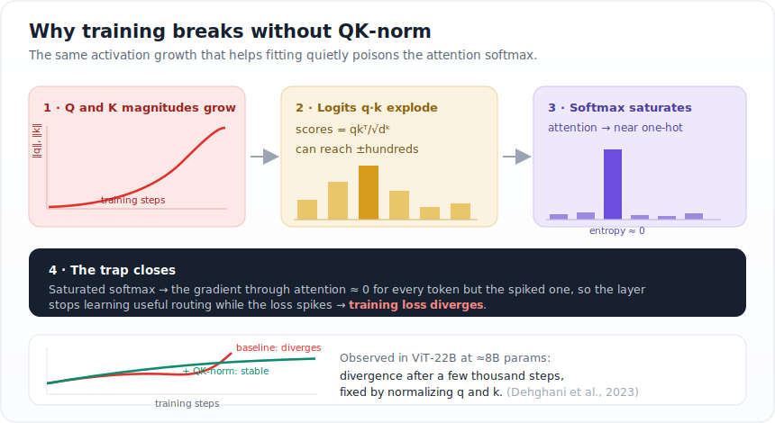
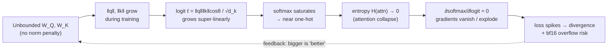
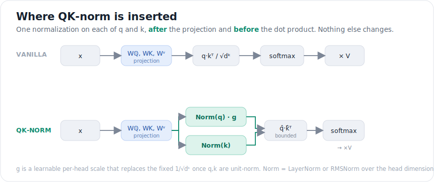
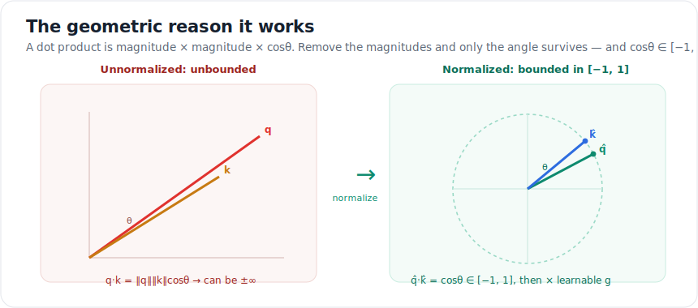
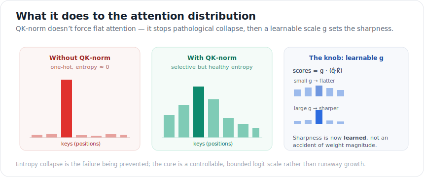

<!-- ============================ TOP NAV ============================ -->
<div align="center">

[🏠 Home](../../README.md) &nbsp;•&nbsp; [📚 Section 1 — Transformer Architecture](./README.md) &nbsp;•&nbsp; [⬅️ Q17 — Dropout](./q17-dropout.md) &nbsp;•&nbsp; [Q19 — RoPE vs ALiBi ➡️](./q19-position-encodings.md)

</div>

---

# Q18 · What is the QK‑norm (query–key normalization) trick? What stability problem does it solve?

<div align="center">


</div>

> [!IMPORTANT]
> **The 20‑second answer.** QK‑norm normalizes the **query** and **key** vectors (to unit length, or with LayerNorm/RMSNorm) **before** their dot product. The disease it cures is **attention‑logit explosion → entropy collapse**: during large‑scale training the Q/K weights grow without bound, the dot‑product logits blow up, the softmax saturates into a near one‑hot spike, gradients through attention vanish, and the **training loss diverges**. By making each logit depend only on the *angle* between q and k (a bounded cosine) and reintroducing a single *learnable* scale, sharpness becomes a thing the model **learns** instead of an accident of weight magnitude.

---

## Table of contents

1. [First, the one idea everything hangs on](#1--first-the-one-idea-everything-hangs-on)
2. [The problem, told as a story](#2--the-problem-told-as-a-story)
3. [The failure mechanism, precisely](#3--the-failure-mechanism-precisely)
4. [The fix: what QK‑norm actually does](#4--the-fix-what-qk-norm-actually-does)
5. [The geometric intuition](#5--the-geometric-intuition)
6. [Two flavors: ℓ₂‑QKNorm vs LayerNorm‑QKNorm](#6--two-flavors-l2-qknorm-vs-layernorm-qknorm)
7. [What it does to the attention distribution](#7--what-it-does-to-the-attention-distribution)
8. [Algorithm & pseudocode](#8--algorithm--pseudocode)
9. [Reference implementation (PyTorch)](#9--reference-implementation-pytorch)
10. [A tiny worked example with real numbers](#10--a-tiny-worked-example-with-real-numbers)
11. [Where it's used — and where it breaks](#11--where-its-used--and-where-it-breaks)
12. [Cousins & alternatives](#12--cousins--alternatives)
13. [Interview drill: the follow‑ups they'll ask](#13--interview-drill-the-follow-ups-theyll-ask)
14. [Common misconceptions](#14--common-misconceptions)
15. [One‑screen summary](#15--one-screen-summary)
16. [References](#16--references)

---

## 1 · First, the one idea everything hangs on

Before any math, lock in a single fact about the **softmax**, because the entire trick is a consequence of it.

The softmax turns a list of numbers (we call them **logits**) into probabilities. It has two personalities:

- **It ignores a shift.** If you add the *same* number to every logit, the output probabilities are **identical**. Formally $\text{softmax}(x + c) = \text{softmax}(x)$. *Adding a constant is free.*
- **It does NOT ignore a stretch.** If you *multiply* every logit by a number $\alpha$, the output changes. $\alpha > 1$ makes the distribution **sharper** (more peaked); $\alpha < 1$ makes it **flatter**. *Scaling is everything.*

That second bullet is the whole ballgame. The size of the logits is secretly a **temperature dial**:

$$\text{softmax}(\alpha \, x) = \text{softmax}\!\left(\frac{x}{T}\right), \qquad T = \frac{1}{\alpha}$$

Big logits = low temperature = a confident, peaky distribution. Tiny logits = high temperature = a fuzzy, hesitant one.

> [!NOTE]
> **Plain‑English version for a 12‑year‑old.** Imagine a vote where everyone shouts a score. If everyone shouts *a little louder by the same amount*, the winner is still the same — that's the shift. But if everyone *exaggerates* their scores (multiply by 10), the loudest option drowns out everyone else and wins by a landslide — that's the stretch. The softmax is that vote. Make the numbers huge and one option always wins. **Attention is exactly this vote, and "who wins" decides which earlier word the model looks at.**

Hold onto this: **logit magnitude controls how sharp attention is.** Now watch what goes wrong when nobody controls the magnitude.

---

## 2 · The problem, told as a story

A Transformer computes attention with **scaled dot‑product attention**:

$$\text{Attention}(Q,K,V) = \text{softmax}\!\left(\frac{QK^\top}{\sqrt{d_k}}\right)V$$

Zoom into a single number inside that softmax — the **logit** comparing query $i$ to key $j$:

$$\ell_{ij} = \frac{q_i \cdot k_j}{\sqrt{d_k}} = \frac{\lVert q_i\rVert \, \lVert k_j\rVert \, \cos\theta_{ij}}{\sqrt{d_k}}$$

Read that right‑hand side slowly. The logit is **three things multiplied**: the length of $q$, the length of $k$, and the cosine of the angle between them. The $\frac{1}{\sqrt{d_k}}$ out front (from [Q2](./q02-scaled-attention.md)) only corrects for the *expected* size at initialization — it is a **fixed constant**, not a guardrail.

Here is the story. The query and key vectors come from learnable matrices $W_Q, W_K$. **Nothing in the loss prevents those matrices from growing.** In fact, cross‑entropy quietly *rewards* growth: making logits bigger sharpens the prediction, which nudges the loss down a hair, which pushes the weights a little bigger, which sharpens again… This positive feedback loop is sometimes called **logit drift** or **logit chasing**.

So as training proceeds, $\lVert q\rVert$ and $\lVert k\rVert$ creep upward — and because the logit is a *product* of the two, the logits can grow **super‑linearly**. The fixed $\frac{1}{\sqrt{d_k}}$ can't save you; it was sized for the magnitudes *at step 0*, not step 50,000.

<div align="center">

<br><sub><b>Figure 1.</b> The four‑step trap. Activation growth that helps fitting silently turns the attention softmax into a coin that always lands on one side.</sub>
</div>

This is not hypothetical. When Google scaled Vision Transformers, they hit a wall:

> *"In scaling ViT beyond prior works, we observed divergent training loss after a few thousand steps … caused by extremely large values in attention logits, which lead to (almost one‑hot) attention weights with near‑zero entropy."* — Dehghani et al., **ViT‑22B** (2023)

The instability appeared around **8B parameters** and was fixed by normalizing the queries and keys.

---

## 3 · The failure mechanism, precisely

Let's make the chain airtight, because an interviewer will push on *why divergence*, not just *what*.



Three things are going wrong at once when the logits explode:

1. **Entropy collapse.** A near one‑hot attention row means every query attends to essentially **one** key. The layer can no longer mix information across positions — it has lost the very capability attention exists to provide. This is the failure mode named in the literature as **attention entropy collapse** (Zhai et al., 2023).

2. **Vanishing/brittle gradients.** The derivative of softmax with respect to its logits is $\text{diag}(p) - pp^\top$. When $p$ is one‑hot, this Jacobian is $\approx 0$. So the attention pattern **freezes** — it can't be corrected — yet any tiny numerical wobble produces an enormous change in loss. That combination (frozen pattern + high sensitivity) is exactly what a **loss spike** looks like.

3. **Numerical overflow.** Logits in the hundreds, exponentiated in **bf16/fp16**, overflow to `inf`/`NaN`. Under high concurrency this shows up as *intermittent* NaNs (cf. [Q40](./q40-nan-debugging.md)).

> [!TIP]
> **Diagnostic an interviewer loves.** If you log per‑layer **attention entropy** and the **max attention logit**, the failure is visible *before* the loss blows up: entropy slides toward 0 and the max logit ramps toward your dtype's ceiling. That early‑warning signal is worth mentioning — it shows you'd catch this in a real training run.

---

## 4 · The fix: what QK-norm actually does

The cure follows directly from Section 1's idea. If the *magnitudes* of $q$ and $k$ are the troublemakers, **remove them** and keep only the part that carries genuine semantic comparison: the **direction**.

QK‑norm inserts a normalization on $q$ and on $k$ **after** the projection and **before** the dot product. In the original $\ell_2$ form (Henry et al., 2020):

$$\hat q_i = \frac{q_i}{\lVert q_i\rVert_2}, \qquad \hat k_j = \frac{k_j}{\lVert k_j\rVert_2}, \qquad \ell_{ij} = g \,\bigl(\hat q_i \cdot \hat k_j\bigr) = g\,\cos\theta_{ij}$$

Two changes, both crucial:

- **The dot product is now a pure cosine**, so $\ell_{ij} \in [-g, +g]$ — **bounded, no matter how big the weights get.** The runaway feedback loop is severed: growing $W_Q, W_K$ no longer changes the logits at all (their magnitude is divided out).
- **We replace the fixed $\frac{1}{\sqrt{d_k}}$ with a single learnable scalar $g$ (per head).** Sharpness is now a *parameter the optimizer sets on purpose*, not an emergent side‑effect of weight growth. If the model needs sharp attention, it raises $g$ deliberately and stably.

<div align="center">

<br><sub><b>Figure 2.</b> The surgical edit. Everything before and after stays the same; two normalizations are slotted in on the q and k paths only. V is untouched.</sub>
</div>

That's the entire trick. It is **cheap** (two normalizations over a vector of size $d_k$, e.g. 64–128, dwarfed by the attention matmuls), **local** (no change to the rest of the block), and **per‑head** (each head gets its own normalization and scale).

---

## 5 · The geometric intuition

Why does throwing away magnitude not hurt? Because the *meaningful* signal in "how much should query $i$ attend to key $j$" is **how aligned they are**, i.e. the angle — not how loud the vectors happen to be shouting.

<div align="center">

<br><sub><b>Figure 3.</b> Unnormalized, the logit rides on vector length and can run off to ±∞. Normalized, the logit <i>is</i> the cosine of the angle — confined to [−1, 1] — and the learnable g sets how strongly that angle is amplified.</sub>
</div>

A useful one‑liner: **QK‑norm decouples *direction* (what the model means) from *magnitude* (how loud it says it), keeps the direction, and hands the loudness knob to the optimizer as a single learnable number.**

---

## 6 · Two flavors: L2-QKNorm vs LayerNorm-QKNorm

Both bound the logits; they differ in *how* they normalize and what's learnable. Know both — interviewers probe the distinction.

| | **ℓ₂‑QKNorm** (Henry et al., 2020) | **LayerNorm/RMSNorm‑QKNorm** (ViT‑22B, Gilmer et al., 2023) |
|---|---|---|
| **Operation on q, k** | Project to the unit hypersphere: $\hat q = q/\lVert q\rVert_2$ | LayerNorm (or RMSNorm) over the **head dim**, with learnable gain $\gamma$ |
| **Scale** | Single learnable scalar **g** per head, replacing $1/\sqrt{d_k}$ | Keep $1/\sqrt{d_k}$; the per‑dimension $\gamma$ inside the norm provides flexibility |
| **Logit range** | Exactly $[-g, +g]$ | Effectively $O(1)$ — q,k have RMS ≈ 1 per dim, so $q\cdot k = O(\sqrt{d_k})$, divided by $\sqrt{d_k}$ |
| **Per‑dim shaping?** | No (pure direction) | Yes (γ can re‑weight dimensions) |
| **Used by** | Low‑resource NMT (origin) | ViT‑22B, and the dominant form in modern LLMs |
| **Mental model** | "Put q, k on a sphere, learn one temperature" | "Standardize q, k like any LayerNorm, then proceed normally" |

> [!NOTE]
> RMSNorm is the mean‑free, cheaper cousin of LayerNorm (see [Q14](./q14-rmsnorm-vs-layernorm.md)) and is the common choice in current LLMs, so production "QK‑norm" today usually means **per‑head RMSNorm on q and k**. The key invariant is the same in every variant: **the pre‑softmax logits are bounded and the effective temperature is learned, not emergent.**

---

## 7 · What it does to the attention distribution

A frequent misread is "QK‑norm forces attention to be flat/uniform." It does **not**. It removes the *pathological* collapse and then lets the model choose its own sharpness through $g$ (or $\gamma$).

<div align="center">

<br><sub><b>Figure 4.</b> Left: pathological one‑hot collapse (the failure). Middle: selective but healthy attention (the goal). Right: the learnable g lets the model dial sharpness on purpose — small g flattens, large g sharpens.</sub>
</div>

So the honest framing for an interview: *QK‑norm doesn't make attention diffuse; it makes the sharpness **controllable and bounded** instead of an uncontrolled function of weight magnitude.*

---

## 8 · Algorithm & pseudocode

```text
INPUT : x           # [batch, seq, d_model]
        W_Q,W_K,W_V # projections
        g           # learnable per-head scale (ℓ2 variant)
OUTPUT: attention output

1.  Q, K, V  ← x @ W_Q,  x @ W_K,  x @ W_V        # standard projections
2.  reshape Q,K,V → [batch, heads, seq, d_head]   # split into heads

    # ---- the QK-norm step (applied per head, over the d_head axis) ----
3.  Q̂ ← normalize(Q, axis = d_head)               # ℓ2:  Q / ‖Q‖₂
                                                   # LN : LayerNorm(Q)  /  RMSNorm(Q)
4.  K̂ ← normalize(K, axis = d_head)
    # -------------------------------------------------------------------

5.  if ℓ2-variant:  logits ← g · (Q̂ @ K̂ᵀ)        # bounded in [-g, +g]
    else        :  logits ← (Q̂ @ K̂ᵀ) / √d_head    # bounded, O(1)

6.  logits ← apply_causal_mask(logits)            # if decoder
7.  A ← softmax(logits, axis = keys)              # healthy entropy now
8.  return (A @ V)                                 # then merge heads, out-proj
```

Only **lines 3–4** are new. Notice V is never normalized — only the comparison (Q·K) is the source of instability, so only Q and K are touched.

---

## 9 · Reference implementation (PyTorch)

```python
import torch
import torch.nn as nn
import torch.nn.functional as F

class QKNormAttention(nn.Module):
    """Multi-head attention with QK-norm. Supports both the ℓ2 (Henry 2020)
    and the RMSNorm (ViT-22B-style) variants."""

    def __init__(self, d_model, n_heads, variant="rmsnorm", causal=True):
        super().__init__()
        assert d_model % n_heads == 0
        self.n_heads, self.d_head, self.causal = n_heads, d_model // n_heads, causal
        self.variant = variant

        self.qkv = nn.Linear(d_model, 3 * d_model, bias=False)   # no-bias is common
        self.out = nn.Linear(d_model, d_model, bias=False)

        if variant == "l2":
            # one learnable temperature PER HEAD, replacing 1/sqrt(d_head).
            # init so the starting scale matches standard attention.
            self.g = nn.Parameter(torch.full((n_heads, 1, 1), self.d_head ** 0.5))
        else:  # rmsnorm: a learnable gain per head-dimension on q and k
            self.q_norm = nn.RMSNorm(self.d_head)
            self.k_norm = nn.RMSNorm(self.d_head)

    def forward(self, x):                                  # x: [B, T, d_model]
        B, T, _ = x.shape
        q, k, v = self.qkv(x).chunk(3, dim=-1)
        # -> [B, heads, T, d_head]
        split = lambda t: t.view(B, T, self.n_heads, self.d_head).transpose(1, 2)
        q, k, v = map(split, (q, k, v))

        # ----------------------- QK-NORM -----------------------
        if self.variant == "l2":
            q = F.normalize(q, dim=-1)                     # unit vectors
            k = F.normalize(k, dim=-1)
            logits = (q @ k.transpose(-2, -1)) * self.g    # bounded in [-g, g]
        else:
            q = self.q_norm(q)                             # RMSNorm over d_head
            k = self.k_norm(k)
            logits = (q @ k.transpose(-2, -1)) / self.d_head ** 0.5
        # -------------------------------------------------------

        if self.causal:
            mask = torch.triu(torch.ones(T, T, device=x.device), 1).bool()
            logits = logits.masked_fill(mask, float("-inf"))

        attn = logits.softmax(dim=-1)
        out = (attn @ v).transpose(1, 2).reshape(B, T, -1)
        return self.out(out)
```

> [!WARNING]
> **Init matters.** For the ℓ₂ variant, if you initialize $g$ too small, attention starts near‑uniform and the model learns slowly; too large and you've reintroduced the very saturation you were avoiding. A safe default is $g \approx \sqrt{d_\text{head}}$ so step‑0 behavior matches standard scaled attention. For the RMSNorm variant, the default unit gain already lands in a good place.

---

## 10 · A tiny worked example with real numbers

Let $d_k = 4$. Take a query and a key whose **directions** are fixed but whose **magnitudes** drift as training proceeds.

**Step 0 (small weights).** $q = [1, 0, 1, 0]$, $k = [1, 0, 0.5, 0]$.

$$q\cdot k = 1 + 0 + 0.5 + 0 = 1.5,\qquad \ell = \tfrac{1.5}{\sqrt 4} = 0.75$$

Against a few competing keys, a logit of 0.75 yields a **gentle, diffuse** softmax — healthy.

**Step 50k (weights grew ~12×).** Same *directions*, but now $q = [12,0,12,0]$, $k=[12,0,6,0]$.

$$q\cdot k = 144 + 72 = 216,\qquad \ell = \tfrac{216}{\sqrt 4} = 108$$

A logit of **108** vs competitors near 0 makes the softmax effectively one‑hot — $p \approx 1$ on this key, $\approx 0$ everywhere else. **Entropy collapsed**, purely because the vectors got louder. The *direction* never changed, so no new information was learned — only the temperature secretly dropped.

**Now apply ℓ₂‑QKNorm** (say $g$ learned to 4):

$$\hat q\cdot\hat k = \frac{q\cdot k}{\lVert q\rVert\,\lVert k\rVert} = \frac{216}{\sqrt{288}\,\sqrt{180}} = \frac{216}{227.0} \approx 0.952,\qquad \ell = g\cdot 0.952 \approx 3.81$$

Critically, this **0.952 is identical at step 0 and step 50k** — because it depends only on the (unchanged) angle. The logit is now a stable, bounded **3.81**, and the only way to sharpen further is for the optimizer to *deliberately* raise $g$. Magnitude drift can no longer hijack the temperature.

---

## 11 · Where it's used — and where it breaks

**Adopted in:**
- **ViT‑22B** (Dehghani et al., 2023) — the canonical "QK‑norm rescued large‑scale training" result (LayerNorm variant).
- **Low‑resource NMT** — the original ℓ₂ form (Henry et al., 2020), which improved BLEU by reducing arbitrary softmax saturation.
- **Modern large multimodal & language models**, especially **unified token‑stream** models (mixing text + image tokens), which are unusually prone to Q/K norm blow‑up. QK‑norm has become a near‑default ingredient in many recent open recipes (e.g., Chameleon‑style multimodal models, OLMo‑2‑era language models).

**Where it does *not* fit:**
- **Multi‑head Latent Attention (MLA)** (DeepSeek‑V2/V3). MLA never *materializes* full per‑head $q,k$ at inference — it keeps a compressed latent KV and reconstructs on the fly — so there is no full $q,k$ to normalize. QK‑norm is therefore **incompatible with MLA**, and recent work (e.g. **QuacK**, 2025) instead controls stability via **parameter‑dependent learning rates** on $W_Q, W_K$, which *is* MLA‑compatible.

> [!TIP]
> Mentioning the MLA incompatibility unprompted is a strong signal in a senior interview — it shows you understand the trick as a *mechanism with preconditions*, not a magic spell.

---

## 12 · Cousins & alternatives

QK‑norm is one member of a family that all fight the **same disease (entropy collapse / logit growth)** with different cures. Knowing the neighbors lets you answer "what else could you do?"

| Method | Where it intervenes | One‑line idea |
|---|---|---|
| **QK‑norm** | the **inputs** to the dot product | bound the logits by normalizing q, k; learn the scale |
| **Logit soft‑capping** (Gemma 2) | the **logits** directly | squash with $c\cdot\tanh(\ell/c)$ so $\ell\in(-c,c)$ |
| **σReparam / spectral reparam** (Zhai et al., 2023) | the **weights** | constrain the spectral norm of attention weights |
| **μP / QuacK** (2025) | the **learning rate** | give $W_Q,W_K$ smaller, parameter‑aware step sizes |
| **nGPT** (Loshchilov et al., 2024) | **everything** | put all representations on the unit hypersphere; QK‑norm is a special case of this worldview |

These are **not** mutually exclusive. Gemma‑2 notably combined QK‑style normalization with logit soft‑capping; there's ongoing debate (e.g. in the nanochat community) over whether running **both** is redundant once QK‑norm bounds the logits.

---

## 13 · Interview drill: the follow-ups they'll ask

<details>
<summary><b>Q: Why doesn't the fixed 1/√d_k already prevent this?</b></summary>

Because $1/\sqrt{d_k}$ corrects only the **expected magnitude at initialization** (it makes the variance of the logit $\approx 1$ when q, k are unit‑variance random vectors — see [Q2](./q02-scaled-attention.md)). It is a constant. Once training pushes $\lVert q\rVert,\lVert k\rVert$ far above their init scale, the constant is the wrong size and the logits grow regardless. QK‑norm fixes the magnitude *dynamically, every forward pass.*
</details>

<details>
<summary><b>Q: Why normalize q and k but not v?</b></summary>

The instability lives entirely in the **comparison** $q\cdot k$ that feeds the softmax — that's what saturates. The value vectors $v$ are just the payload that gets mixed afterward; their magnitude doesn't enter the softmax and is handled by the surrounding LayerNorms and residual stream. Normalizing v would be a different intervention with no bearing on entropy collapse.
</details>

<details>
<summary><b>Q: Doesn't normalizing throw away information the model could use?</b></summary>

Only the *magnitude* of q and k is discarded, and that magnitude was largely an artifact of unconstrained weight growth, not semantic content — the meaning is in the **direction**. The model recovers all the expressiveness it needs through the **learnable scale** (g or γ), which lets it set attention sharpness on purpose. Empirically, ViT‑22B and others match or beat baselines, so the trade is favorable.
</details>

<details>
<summary><b>Q: Is this related to softmax temperature?</b></summary>

Directly. Recall $\text{softmax}(\alpha x)=\text{softmax}(x/T)$ with $T=1/\alpha$. Uncontrolled logit growth is an *uncontrolled drop in temperature* toward 0 (a freezing, peaky distribution). QK‑norm bounds the logits and then makes the effective temperature a **single learnable parameter** instead of a runaway emergent quantity.
</details>

<details>
<summary><b>Q: What signal would tell you QK-norm is needed before the run diverges?</b></summary>

Track **per‑layer attention entropy** (sliding toward 0) and **max attention logit** (ramping toward the dtype ceiling, e.g. ~448 for the bf16 normal range). Both move well before the loss spikes, giving you an early warning. A sudden grad‑norm spike concurrent with falling entropy is the smoking gun.
</details>

<details>
<summary><b>Q: ℓ2 vs LayerNorm/RMSNorm variant — does it matter which?</b></summary>

Both bound the logits and fix the disease. ℓ₂ is the purest (direction‑only, one scalar temperature); RMSNorm/LayerNorm additionally allow **per‑dimension** reshaping via γ and integrate cleanly with the RMSNorm machinery LLMs already use, which is why the norm variant dominates in practice. If pressed for a default in a modern LLM: **per‑head RMSNorm on q and k.**
</details>

---

## 14 · Common misconceptions

| ❌ Misconception | ✅ Reality |
|---|---|
| "QK‑norm makes attention uniform/flat." | It removes *pathological* collapse; sharpness stays fully controllable via the learnable scale. |
| "It's just another LayerNorm in the block." | It's applied to **q and k specifically, per head, before the dot product** — placement is the whole point. |
| "The 1/√d_k already handles logit scale." | That's a fixed init‑time correction; it can't track weight growth during training. |
| "It normalizes Q, K, **and** V." | Only Q and K. V is untouched. |
| "It's expensive." | Negligible — two norms over a length‑$d_\text{head}$ vector vs. the attention matmuls. |
| "It always helps everywhere." | It's incompatible with MLA and is one option among σReparam, soft‑capping, μP‑style LR control. |

---

## 15 · One-screen summary

> **What:** Normalize the query and key vectors (ℓ₂ to unit length, or LayerNorm/RMSNorm over the head dim) **before** computing $q\cdot k$, then apply a **learnable scale**.
>
> **Problem solved:** **Attention‑logit explosion → entropy collapse.** Unbounded growth of $W_Q,W_K$ makes logits blow up, the softmax saturates to near one‑hot, gradients vanish, and the loss **diverges** at scale / high LR (famously around 8B params in ViT‑22B).
>
> **Why it works:** The softmax is shift‑invariant but **not** scale‑invariant, so logit magnitude is a hidden temperature. Normalizing q, k makes the logit a **bounded cosine** of their angle, severing the runaway loop; the learnable scale returns control of sharpness to the optimizer.
>
> **Cost / caveats:** Practically free; per‑head; **incompatible with MLA**; siblings include logit soft‑capping, σReparam, and μP‑style LR control.

---

## 16 · References

1. Henry, A., Dachapally, P. R., Pawar, S., Chen, Y. — **Query‑Key Normalization for Transformers** (2020). *arXiv:2010.04245.* — origin of ℓ₂‑QKNorm; reduces arbitrary softmax saturation, +0.93 BLEU on low‑resource pairs.
2. Dehghani, M. et al. — **Scaling Vision Transformers to 22 Billion Parameters** (ViT‑22B) (2023). *ICML 2023 / arXiv:2302.05442.* — divergence at ~8B from huge attention logits; fixed with LayerNorm‑QKNorm.
3. Gilmer, J. et al. (2023) — the LayerNorm‑on‑q‑and‑k formulation adopted by ViT‑22B.
4. Zhai, S. et al. — **Stabilizing Transformer Training by Preventing Attention Entropy Collapse (σReparam)** (2023). *ICML 2023.* — names and analyzes the entropy‑collapse disease.
5. Loshchilov, I. et al. — **nGPT: Normalized Transformer with Representation Learning on the Hypersphere** (2024). *arXiv:2410.01131.*
6. **QuacK: Query and Key Learning Rate Control** (2025). *arXiv:2511.21377.* — an MLA‑compatible stability alternative; discusses QK‑norm's incompatibility with MLA.
7. Taylor, R. — *QK Norm and the Curious Case of Logit Drift* (2024). Blog — clear treatment of logit drift in unified multimodal models.

---

<!-- ============================ BOTTOM NAV ============================ -->
<div align="center">

[⬅️ Q17 — Dropout](./q17-dropout.md) &nbsp;|&nbsp; [📚 Back to Section 1](./README.md) &nbsp;|&nbsp; [🏠 Home](../../README.md) &nbsp;|&nbsp; [Q19 — RoPE vs ALiBi ➡️](./q19-position-encodings.md)

<sub>Found an error or have a sharper intuition? See <a href="../../CONTRIBUTING.md">CONTRIBUTING</a> — answers follow the <a href="../../_TEMPLATE.md">answer template</a>.</sub>

</div>
