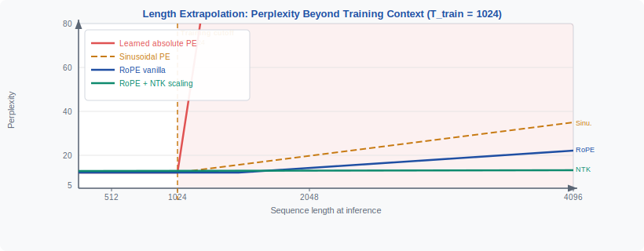
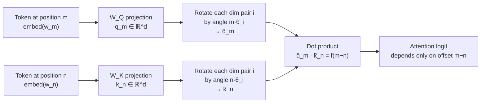
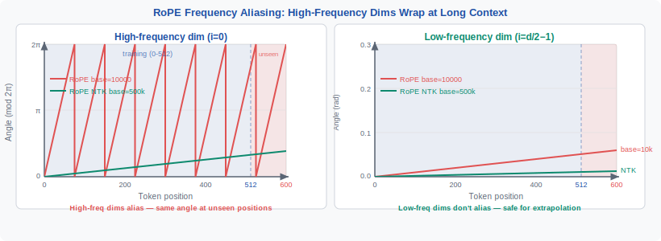

<!-- ============================ TOP NAV ============================ -->
<div align="center">

[🏠 Home](../../README.md) &nbsp;•&nbsp; [📚 Section 1 — Transformer Architecture](./README.md) &nbsp;•&nbsp; [⬅️ Q18 — QK-norm](./q18-qk-norm.md) &nbsp;•&nbsp; [Q20 — ALiBi ➡️](./q20-alibi.md)

</div>

---

# Q19 · Compare absolute, relative, and rotary position encodings on extrapolation behavior. Why does RoPE generalize better?

<div align="center">


</div>

> [!IMPORTANT]
> **The 20-second answer.** Absolute PE (sinusoidal or learned) fails at long context because the attention logit $q_i \cdot k_j$ contains cross-terms between content and absolute position that are out-of-distribution for unseen positions; RoPE avoids this by **constructing** the dot product so it depends only on the **relative offset** $(m - n)$, not on absolute positions $m$ or $n$. Vanilla RoPE still degrades at very long context due to **high-frequency aliasing** — high-frequency rotation dimensions complete many unseen revolution counts — but this is fixed by **NTK-aware base scaling**, which stretches rotation periods so no dimension aliases within the target context window.

---

## Table of contents

1. [First principles](#1--first-principles)
2. [The problem, told as a story](#2--the-problem-told-as-a-story)
3. [The mechanism, precisely](#3--the-mechanism-precisely)
4. [The fix: NTK-aware RoPE scaling](#4--the-fix-ntk-aware-rope-scaling)
5. [Intuition & geometric view](#5--intuition--geometric-view)
6. [Variants / comparison table](#6--variants--comparison-table)
7. [Algorithm & pseudocode](#7--algorithm--pseudocode)
8. [Reference implementation (PyTorch)](#8--reference-implementation-pytorch)
9. [Worked numerical example](#9--worked-numerical-example)
10. [Where it's used / where it breaks](#10--where-its-used--where-it-breaks)
11. [Cousins & alternatives](#11--cousins--alternatives)
12. [Interview drill](#12--interview-drill)
13. [Common misconceptions](#13--common-misconceptions)
14. [One-screen summary](#14--one-screen-summary)
15. [References](#15--references)

---

## 1 · First principles

**Extrapolation** means: a model trained on sequences of length $\leq T_\text{train}$ is asked at inference to process a sequence of length $T_\text{inf} > T_\text{train}$. The central question is whether the positional signal remains **meaningful and in-distribution** at positions the model never encountered during training.

Transformers are position-agnostic by default: self-attention treats its input as a **set**, not a sequence. Position encodings inject ordering. The encoding strategy determines what happens when the sequence grows beyond the training horizon.

Three properties govern extrapolation behavior:

| Property | Why it matters |
|---|---|
| **Relative vs absolute** | Relative encodings represent $i-j$; if the model never sees absolute position $t > T_\text{train}$, relative encodings still produce in-distribution signals as long as the *offset* is familiar. |
| **Parameterized vs formula-based** | A learned lookup table has a hard wall at $T_\text{train}$. A formula (sinusoidal, rotation) is defined everywhere. |
| **High-frequency behavior** | Encoding components that oscillate fast can **alias** — wrap around to a rotation already seen at a short position — causing ambiguity at long range. |

Lock in a single observation: **a dot product between two position-encoded vectors can be decomposed into a content–content term, two content–position cross-terms, and a position–position term.** Which of these terms appear, and whether they depend on absolute vs relative position, is the whole story.

---

## 2 · The problem, told as a story

Picture a language model trained on sequences of length $T_\text{train} = 2048$. On deployment it receives a document of $12\,000$ tokens. What does each PE family do?

**Learned absolute PE** has a table: $\text{PE} \in \mathbb{R}^{T \times d}$. Token 5000 asks for row 5000. That row does not exist. Hard crash, or at best random initialization noise. **Full failure.**

**Sinusoidal absolute PE** ($\sin, \cos$ at pre-set frequencies) can *compute* a vector at position 5000 — there is no lookup table. But during training, the model learned to interpret the cross-term $\text{embed}_i \cdot \text{PE}_j$: for every pair $(i, j)$ it encountered, gradient descent tuned the weights to respond to that combination. At positions 2049–12000, those combinations are **out-of-distribution (OOD)**. The model has no calibration for them. In practice, perplexity degrades steeply at positions beyond $T_\text{train}$.

<div align="center">

<br><sub><b>Figure 1.</b> Schematic extrapolation curves. The x-axis is sequence length relative to $T_\text{train}$. The y-axis is perplexity (lower is better). Absolute PE methods fail hard. Relative and RoPE variants show varying degrees of graceful degradation.</sub>
</div>

**T5 relative PE** assigns a learned bias $b(i-j)$ to each attention logit based on the relative offset, clipped to a bucket. Offsets beyond the maximum bucket share the same bias value. Tokens far apart are treated identically — the model loses distance information but does not see a hard OOD cliff. **Graceful degradation, but information loss.**

**RoPE** rotates the query and key vectors so their dot product is a function of $(m - n)$ only. At position 5000 the rotation is well-defined, and the dot product between positions 5000 and 4998 produces the same functional form as between positions 10 and 8 — the same offset, the same signal. The problem, as we will see, is that the *rotation angle* for position 5000 in a high-frequency dimension may have wrapped around many times beyond anything seen in training. **Geometric failure, not a lookup cliff.**

---

## 3 · The mechanism, precisely

### Absolute PE: the cross-term problem

With absolute PE the token representation is:

$$x_t = \text{embed}(w_t) + \text{PE}(t)$$

The query and key for positions $m$ and $n$ are:

$$q_m = W_Q\bigl(\text{embed}(w_m) + \text{PE}(m)\bigr), \qquad k_n = W_K\bigl(\text{embed}(w_n) + \text{PE}(n)\bigr)$$

The dot product that feeds the softmax decomposes into **four terms**:

$$q_m \cdot k_n = \underbrace{(W_Q e_m)\cdot(W_K e_n)}_{\text{content–content}} + \underbrace{(W_Q e_m)\cdot(W_K p_n)}_{\text{content–position}} + \underbrace{(W_Q p_m)\cdot(W_K e_n)}_{\text{position–content}} + \underbrace{(W_Q p_m)\cdot(W_K p_n)}_{\text{position–position}}$$

where $e_t = \text{embed}(w_t)$ and $p_t = \text{PE}(t)$.

The three terms involving $p_m$ or $p_n$ **depend on absolute position**. The model learns to interpret them only for $m, n \leq T_\text{train}$. At $m = 5000$, these terms carry a signal the model has never calibrated — strictly OOD.

### Relative PE: bucket clipping

Shaw et al. (2018) and T5 (Raffel et al., 2020) replace absolute cross-terms with a **learnable bias on the relative offset**:

$$\text{score}_{mn} = q_m \cdot k_n + b\bigl(\text{clip}(m-n,\,-k,\,+k)\bigr)$$

where $k$ is the maximum bucket boundary. All offsets $|m-n| > k$ share the same bucket value. This removes absolute dependence but introduces **distance blindness**: tokens 100 apart and tokens 10000 apart receive the same bias. The model degrades gracefully but loses the ability to distinguish large distances.

### RoPE: the rotation construction

Su et al. (2021) encode position by **rotating** the query and key vectors in 2D planes of the head dimension. For a head of dimension $d$, split it into $d/2$ pairs. For pair $i$ and token position $m$:

$$\theta_i = \frac{1}{10000^{2i/d}}$$

The rotated query for the $i$-th dimension pair at position $m$:

$$\tilde{q}_m^{(i)} = \begin{pmatrix} q_m^{2i} \cos(m\theta_i) - q_m^{2i+1} \sin(m\theta_i) \\ q_m^{2i} \sin(m\theta_i) + q_m^{2i+1} \cos(m\theta_i) \end{pmatrix}$$

The dot product between rotated query at $m$ and rotated key at $n$ satisfies:

$$\tilde{q}_m \cdot \tilde{k}_n = \text{Re}\!\left[\sum_{i=0}^{d/2-1} q_m^{(i)} \left(k_n^{(i)}\right)^* e^{\,\mathrm{i}(m-n)\theta_i}\right]$$

**The result is a function of $(m-n)$ only.** Absolute positions $m$ and $n$ do not appear independently. This is the key property: **RoPE is relative by construction, not by approximation.**



**Why RoPE extrapolates better than absolute PE:** For any new position $m > T_\text{train}$, the dot product $\tilde{q}_m \cdot \tilde{k}_n$ still depends only on $(m-n)$. If $(m-n) \leq T_\text{train}$, this is an in-distribution offset — the model has seen it. There are no cross-terms that become OOD just because $m$ is large.

**The remaining failure mode — frequency aliasing:** The rotation angle $m\theta_i$ grows without bound. For dimension pair $i=0$: $\theta_0 = 1.0$ rad/token. At $m=628$, this dimension has completed $628/(2\pi) \approx 100$ full rotations. If $T_\text{train} = 2048$, the model has only seen up to $\approx 326$ rotation cycles for this dimension. Positions 2049 and beyond correspond to cycle counts never encountered in training — the model cannot reliably distinguish them. Low-frequency dimensions ($i \approx d/2$, $\theta_i \approx 10^{-4}$) rotate so slowly that even at $m=100\,000$ they have barely completed one full cycle — they extrapolate cleanly.

---

## 4 · The fix: NTK-aware RoPE scaling

### Why "NTK-aware"?

The fix was motivated by an analogy to **Neural Tangent Kernel** theory (bloc97, 2023): changing the base frequency redistributes representational capacity across frequency scales, analogous to changing the NTK of the network with respect to positional inputs.

### The aliasing problem quantified

RoPE uses base $b = 10000$. The per-dimension period (tokens per full cycle) is:

$$P_i = \frac{2\pi}{\theta_i} = 2\pi \cdot 10000^{2i/d}$$

For $d = 128$, $i = 0$: $P_0 = 2\pi \approx 6.28$ tokens. At $T_\text{train} = 4096$, this dimension has seen $4096 / 6.28 \approx 652$ distinct rotation cycles. At $T_\text{inf} = 32768$, it would encounter $32768 / 6.28 \approx 5213$ cycles — **4561 novel cycle counts** beyond training.

<div align="center">

<br><sub><b>Figure 2.</b> Frequency aliasing in vanilla RoPE (left) vs NTK-scaled RoPE (right) for an 8x context extension. After NTK scaling, dimensions stay within manageable cycle counts across the extended window.</sub>
</div>

### The NTK scaling formula

To extend context from $T_\text{train}$ to $T_\text{new}$ by factor $s = T_\text{new}/T_\text{train}$, scale the base so all rotation periods grow by $s$:

$$P_i^{\text{new}} = s \cdot P_i^{\text{old}} \implies \theta_i^{\text{new}} = \theta_i^{\text{old}} / s$$

Since $\theta_i = b^{-2i/d}$, this is achieved by:

$$b^{\text{new}} = b \cdot s^{d/(d-2)}$$

For large $d$ the exponent $d/(d-2) \approx 1$, giving the practical rule:

$$\boxed{b^{\text{new}} \approx b \cdot s}$$

For LLaMA-2 (4096 → 32768, $s=8$, $d=128$):

$$b^{\text{new}} \approx 10000 \times 8 = 80\,000$$

**No retraining is required** — just change the base constant at inference time.

### YaRN: per-dimension scaling

YaRN (Peng et al., 2023) applies **different scaling factors per dimension**:

- **High-frequency dimensions** (small $i$, large $\theta_i$): scale aggressively — these alias most.
- **Low-frequency dimensions** (large $i$, small $\theta_i$): scale minimally — these already extrapolate cleanly.

A smooth interpolation function selects the scaling factor based on each dimension's frequency. YaRN achieves better perplexity than uniform NTK scaling and requires less fine-tuning for the same extension factor.

### Position interpolation (Chen et al., 2023)

An alternative: instead of changing rotation frequencies, **compress the position indices** by factor $s$:

$$\text{PE}(t) \to \text{PE}(t / s)$$

Position 5000 now uses the encoding from position $5000/8 = 625$ — always within the training range. No OOD rotation counts. The trade-off: all distances are compressed by $s$, requiring the model to re-learn sensitivity to compressed distances. Needs **a small amount of fine-tuning** (a few hundred steps). NTK scaling works **without** fine-tuning; position interpolation works better **with** fine-tuning.

---

## 5 · Intuition & geometric view

Think of each RoPE dimension pair as a **clock hand** rotating at a characteristic speed. Dimension $i=0$ ticks at 1 rad/token — one revolution per 6.3 tokens. Dimension $i=d/2-1$ ticks at $10^{-4}$ rad/token — barely moves across an entire context window.

**The attention logit is the inner product of two clock configurations.** Two tokens agree (high attention) when their clock hands point in compatible directions — which happens when the *time difference* (token offset) produces a consistent phase relationship. Because only the time difference matters, **the absolute time of day is irrelevant**. This is the advantage over absolute PE: the absolute position of the sequence is invisible; only offsets between tokens matter.

The failure: the fast clock (period 6.3 tokens) has done $T_\text{train}/(2\pi) \approx 326$ revolutions within training. Asking it to tick to $t=10000$ adds 1265 more novel revolution counts the model has never distinguished. The phase at $t=10000$ looks identical to $t=10000 \bmod 6.28 \approx 4.6$ — the model conflates them.

NTK scaling **slows down the fast clocks**. After 8x NTK scaling, the fastest clock ticks at $1/8$ rad/token — period 50 tokens. The training window covers only 41 revolutions instead of 326, and the 8x-extended window covers exactly 326 revolutions — now fully within the seen range. **The fast clock is retimed to look slow.**

Low-frequency clocks are barely affected: $\theta_{d/2-1} \approx 10^{-4}$, period $\approx 62832$ tokens. Training covers 3% of one cycle — trivially in-distribution at any context a current LLM would use.

---

## 6 · Variants / comparison table

| PE method | Relative? | Parameters | Extrapolation quality | OOD failure mode | Used in |
|---|---|---|---|---|---|
| **Sinusoidal absolute** | No | 0 | Poor beyond $T_\text{train}$ | Content–position cross-terms OOD | Original Transformer (Vaswani 2017) |
| **Learned absolute** | No | $T_\text{train} \times d$ | None (hard wall) | No entry for $t > T_\text{train}$ | GPT-2, BERT |
| **T5 relative** (Shaw/Raffel) | Yes | $2k$ bias values | Moderate (distance blindness) | All offsets $> k$ share one bucket | T5, MT5 |
| **RoPE vanilla** | Yes (by construction) | 0 | Good up to ~2–3× $T_\text{train}$ | High-freq aliasing | LLaMA-1/2, PaLM 2, Mistral |
| **RoPE + NTK scaling** | Yes | 0 (change base only) | Good up to target, no FT needed | Residual aliasing at extreme ranges | LLaMA-3, many community fine-tunes |
| **RoPE + YaRN** | Yes | 0 | Better than NTK, minimal FT | Low-freq dims marginally disturbed | Mistral-long, Qwen community models |
| **RoPE + position interpolation** | Yes | 0 (needs FT) | Excellent with fine-tuning | Compressed distances hard to separate | Code LLaMA 100K, LongLLaMA |
| **ALiBi** | Yes | 0 | Good; gentle distance decay | Bias can dominate at extreme offsets | MPT, BLOOM (see Q20) |

---

## 7 · Algorithm & pseudocode

```text
INPUT : x           # [batch, seq, d_model]
        W_Q, W_K    # projection matrices
        positions   # [seq] integer token positions
        base        # RoPE base frequency (10000 vanilla; ~80000+ NTK)
        d_head      # head dimension (must be even)
OUTPUT: rotated queries and keys for dot-product attention

1.  Q, K  ← x @ W_Q,  x @ W_K                     # standard projections
2.  reshape Q, K → [batch, heads, seq, d_head]

    # --- per-dimension rotation frequencies ---
3.  i ← arange(0, d_head, step=2)                  # even indices 0,2,4,...
4.  theta_i ← 1.0 / (base ** (i / d_head))         # [d_head/2]
    # theta_0 = 1.0 (fast), theta_{d/2-1} ≈ 1e-4 (slow) for base=10000

    # --- rotation angles for each (position, dim_pair) ---
5.  angles ← outer(positions, theta_i)              # [seq, d_head/2]
6.  cos_a  ← cos(angles)
7.  sin_a  ← sin(angles)

    # --- apply 2D rotation to each pair in q and k ---
8.  for each pair i in 0 .. d_head/2 - 1:
        q_rot[..., 2i  ] = Q[..., 2i]*cos_a[...,i] - Q[..., 2i+1]*sin_a[...,i]
        q_rot[..., 2i+1] = Q[..., 2i]*sin_a[...,i] + Q[..., 2i+1]*cos_a[...,i]
        (same for k_rot)

9.  logits ← (q_rot @ k_rot.T) / sqrt(d_head)
10. return logits

NTK-scaled variant: replace step 4 with:
    s        ← T_new / T_train               # extension factor, e.g. 8
    base_ntk ← base * (s ** (d_head / (d_head - 2)))
    theta_i  ← 1.0 / (base_ntk ** (i / d_head))
    (rest identical — the only change is one number)
```

---

## 8 · Reference implementation (PyTorch)

```python
import math
import torch
import torch.nn as nn
import torch.nn.functional as F


def build_rope_cache(
    seq_len: int,
    d_head: int,
    base: float = 10_000.0,
    device: torch.device | None = None,
) -> tuple[torch.Tensor, torch.Tensor]:
    """
    Precompute RoPE cosine and sine caches.

    Args:
        seq_len: Maximum sequence length to precompute.
        d_head:  Head dimension (must be even).
        base:    RoPE base. Use ~80_000 for 8x NTK extension from 4096.
        device:  Target device.

    Returns:
        cos_cache: [seq_len, d_head/2]
        sin_cache: [seq_len, d_head/2]
    """
    assert d_head % 2 == 0, "d_head must be even for RoPE"
    half = d_head // 2

    # theta_i = 1 / base^(2i/d_head) for i in 0..half-1
    i = torch.arange(half, device=device, dtype=torch.float32)
    theta = 1.0 / (base ** (i / half))          # [half]

    positions = torch.arange(seq_len, device=device, dtype=torch.float32)
    angles = torch.outer(positions, theta)       # [seq_len, half]
    return angles.cos(), angles.sin()


def apply_rope(
    x: torch.Tensor,
    cos_cache: torch.Tensor,
    sin_cache: torch.Tensor,
) -> torch.Tensor:
    """
    Apply RoPE rotations to a query or key tensor.

    Args:
        x:          [..., seq_len, d_head]
        cos_cache:  [seq_len, d_head/2]  (precomputed)
        sin_cache:  [seq_len, d_head/2]

    Returns:
        Rotated tensor of same shape as x.
    """
    seq_len = x.shape[-2]
    # broadcast over batch and head dims
    cos = cos_cache[:seq_len].unsqueeze(0).unsqueeze(0)   # [1, 1, seq, half]
    sin = sin_cache[:seq_len].unsqueeze(0).unsqueeze(0)

    x_even = x[..., 0::2]   # [..., seq, half]  — even dims
    x_odd  = x[..., 1::2]   # [..., seq, half]  — odd dims

    # 2D rotation: (a, b) → (a·cos − b·sin, a·sin + b·cos)
    rot_even = x_even * cos - x_odd * sin
    rot_odd  = x_even * sin + x_odd * cos

    # interleave even and odd back into [..., seq, d_head]
    out = torch.stack([rot_even, rot_odd], dim=-1)
    return out.flatten(-2)


class RoPEAttention(nn.Module):
    """
    Multi-head self-attention with RoPE.
    Supports vanilla RoPE (base=10_000) and NTK scaling (larger base).
    """

    def __init__(
        self,
        d_model: int,
        n_heads: int,
        max_seq_len: int = 4096,
        base: float = 10_000.0,
        causal: bool = True,
    ):
        super().__init__()
        assert d_model % n_heads == 0
        self.n_heads = n_heads
        self.d_head  = d_model // n_heads
        self.causal  = causal

        self.qkv = nn.Linear(d_model, 3 * d_model, bias=False)
        self.out  = nn.Linear(d_model, d_model, bias=False)

        # precompute and register rotation cache as non-parameter buffer
        cos_cache, sin_cache = build_rope_cache(max_seq_len, self.d_head, base=base)
        self.register_buffer("cos_cache", cos_cache)
        self.register_buffer("sin_cache", sin_cache)

    def forward(self, x: torch.Tensor) -> torch.Tensor:
        """x: [batch, seq_len, d_model]  →  [batch, seq_len, d_model]"""
        B, T, _ = x.shape
        q, k, v = self.qkv(x).chunk(3, dim=-1)

        def split_heads(t: torch.Tensor) -> torch.Tensor:
            return t.view(B, T, self.n_heads, self.d_head).transpose(1, 2)

        q, k, v = split_heads(q), split_heads(k), split_heads(v)

        # apply RoPE to q and k only — v is never rotated
        q = apply_rope(q, self.cos_cache, self.sin_cache)
        k = apply_rope(k, self.cos_cache, self.sin_cache)

        logits = (q @ k.transpose(-2, -1)) / math.sqrt(self.d_head)

        if self.causal:
            mask = torch.triu(
                torch.ones(T, T, device=x.device, dtype=torch.bool), diagonal=1
            )
            logits = logits.masked_fill(mask, float("-inf"))

        attn = logits.softmax(dim=-1)
        out  = (attn @ v).transpose(1, 2).reshape(B, T, -1)
        return self.out(out)


# ---- Demo: vanilla RoPE vs NTK-scaled RoPE at 2x context extension ----
if __name__ == "__main__":
    torch.manual_seed(42)
    B, T, d = 1, 8192, 512   # T=8192 = 2x the 4096 training length

    # Vanilla RoPE: will show aliasing at positions > ~4096
    model_vanilla = RoPEAttention(d, n_heads=8, max_seq_len=T, base=10_000.0)

    # NTK-scaled RoPE: 2x extension → base ≈ 10000 * 2 = 20000
    model_ntk = RoPEAttention(d, n_heads=8, max_seq_len=T, base=20_000.0)

    x = torch.randn(B, T, d)
    with torch.no_grad():
        out_v = model_vanilla(x)
        out_n = model_ntk(x)

    print(f"Vanilla output shape : {out_v.shape}")   # [1, 8192, 512]
    print(f"NTK     output shape : {out_n.shape}")   # [1, 8192, 512]
    diff = (out_v - out_n).abs().mean().item()
    print(f"Mean |diff|          : {diff:.4f}")
    # Outputs differ because NTK uses slower rotation frequencies,
    # placing long-context positions closer to the trained distribution.
```

> [!NOTE]
> The only change between vanilla and NTK-scaled RoPE is the `base` argument. All weights, all attention logic, all architecture are identical. This is why NTK scaling needs no retraining: the rotation frequencies are not parameters, they are computed on-the-fly from the base constant.

---

## 9 · Worked numerical example

Let $d_\text{head} = 4$ (two dimension pairs: $i=0$ and $i=1$), $T_\text{train} = 32$, base $b = 10000$.

### Step 1: Compute per-dimension frequencies

$$\theta_0 = \frac{1}{10000^{0/4}} = \frac{1}{10000^0} = 1.0000 \;\text{rad/token} \quad (i=0, \text{ high frequency})$$

$$\theta_1 = \frac{1}{10000^{2/4}} = \frac{1}{10000^{0.5}} = \frac{1}{100} = 0.01 \;\text{rad/token} \quad (i=1, \text{ low frequency})$$

The period for each dimension:

$$P_0 = \frac{2\pi}{1.0} \approx 6.28 \;\text{tokens/cycle}, \qquad P_1 = \frac{2\pi}{0.01} \approx 628 \;\text{tokens/cycle}$$

### Step 2: Rotation angles at training boundary and at extrapolation

| Position $m$ | Angle $m\theta_0$ (fast dim) | Cycles completed | Angle $m\theta_1$ (slow dim) | Cycles completed |
|---|---|---|---|---|
| $m = 6$ | $6.0$ rad | $0.95$ | $0.06$ rad | $0.010$ |
| $m = 32$ (training max) | $32.0$ rad | $5.09$ | $0.32$ rad | $0.051$ |
| $m = 200$ (6× train) | $200.0$ rad | $31.8$ | $2.00$ rad | $0.318$ |

At $m=200$, dimension $i=0$ is on its 32nd revolution. The model has only seen up to 5 complete revolutions during training. It has **no calibration** for "this is revolution number 32" vs "revolution 5."

### Step 3: Identify the aliasing

For dimension $i=0$ at $m=200$:

$$200.0 \;\text{rad} \;\bmod\; 2\pi = 200.0 - 31 \times 6.283 = 200.0 - 194.78 = 5.22 \;\text{rad}$$

The rotation *phase* at $m=200$ is $5.22$ rad — the same phase as $m = 5.22$ rad $/ 1.0 = 5.22$ tokens. The model cannot distinguish a 200-token offset from a 5.22-token offset using this dimension alone. Since the training window includes positions 0–32, the model has seen phases spanning the entire $[0, 2\pi)$ interval multiple times — but never in a context where "this phase corresponds to a 200-token offset."

### Step 4: Confirm the slow dimension is safe (vanilla)

For dimension $i=1$ at $m=200$:

$$200 \times 0.01 = 2.00 \;\text{rad} \approx 0.32 \;\text{cycles}$$

Training covered $32 \times 0.01 = 0.32$ rad for this dimension. Position 200 maps to $2.00$ rad — **beyond the training range** ($2.00 > 0.32$), but still less than one full cycle ($2.00 < 2\pi$). No aliasing yet, but the value is OOD. For much longer contexts this dimension would also become OOD.

### Step 5: Apply NTK scaling (8× extension)

$s = 8$, $d = 4$:

$$b^{\text{new}} = 10000 \times 8^{4/(4-2)} = 10000 \times 8^2 = 10000 \times 64 = 640\,000$$

New frequencies:

$$\theta_0^{\text{new}} = \frac{1}{640000^{0/4}} = 1.0 \;\text{rad/token} \quad \text{(i=0 exponent = 0, unchanged)}$$

$$\theta_1^{\text{new}} = \frac{1}{640000^{2/4}} = \frac{1}{\sqrt{640000}} = \frac{1}{800} = 0.00125 \;\text{rad/token}$$

At $m = 200$ with NTK:

$$m\theta_1^{\text{new}} = 200 \times 0.00125 = 0.25 \;\text{rad} \approx 0.040 \;\text{cycles}$$

Compare: vanilla had $m\theta_1 = 2.00$ rad (OOD). NTK has $m\theta_1^{\text{new}} = 0.25$ rad. The training range now covers $32 \times 0.00125 = 0.04$ rad — position 200 maps to 0.25 rad, which is beyond training range but within a much smaller OOD margin.

> [!NOTE]
> For $d=4$, the exponent $d/(d-2) = 4/2 = 2$ is large, making the base adjustment dramatic ($\times 64$). For realistic $d=128$: $d/(d-2) = 128/126 \approx 1.016$, giving $b^{\text{new}} \approx 10000 \times 8^{1.016} \approx 81\,600$ — close to the simple rule $b \times s$.

### Summary: what the example shows

| Scenario | Dim $i=0$ angle at $m=200$ | Dim $i=1$ angle at $m=200$ | Status |
|---|---|---|---|
| Vanilla RoPE | 200 rad (31.8 cycles, OOD) | 2.00 rad (0.32 cycles, OOD) | Both dims aliasing/OOD |
| NTK RoPE (8×) | 200 rad (unchanged) | 0.25 rad (much less OOD) | Slow dim improved significantly |

Dimension $i=0$ is not helped by NTK because $b^{-0/d} = 1$ regardless of $b$. This is the limitation of uniform NTK scaling that YaRN addresses with per-dimension correction.

---

## 10 · Where it's used / where it breaks

**RoPE (vanilla and scaled) is used in:**
- **LLaMA 1/2** (Meta) — base 10000, $T_\text{train} = 4096$.
- **LLaMA-3** (Meta) — base 500000, $T_\text{train} = 8192$, supports 128K context.
- **Mistral 7B** — base 10000; Mistral-long variants use YaRN.
- **PaLM 2, Gemma** — RoPE with various base adjustments.
- **Falcon, Qwen, InternLM, GPT-NeoX** — all use RoPE variants.

**Where vanilla RoPE breaks:**
- **Context > ~2–3× $T_\text{train}$ without scaling:** perplexity degrades due to high-frequency aliasing.
- **Strict positional disambiguation at long range:** models relying purely on relative distance sometimes struggle with "is this token in the first half or second half of the document?" — that requires some form of absolute signal or position interpolation fine-tuning.
- **2D spatial inputs (image patches):** extending RoPE to 2D requires separate row and column frequencies, introducing its own extrapolation concerns in the spatial domain.

**Where NTK/YaRN extensions break:**
- Beyond **~8–16× extension without fine-tuning**, perplexity increases again — dimension $i=0$ aliasing (which NTK does not fix) accumulates.
- **Very long needle-in-a-haystack tasks (>100K tokens):** maintaining coherent attention over such distances requires architectural changes beyond PE (e.g., sliding-window + global attention).

---

## 11 · Cousins & alternatives

| Method | Core idea | Extrapolation mechanism | Fine-tuning needed? |
|---|---|---|---|
| **ALiBi** (Press et al., 2022) | Subtract linear bias $m\cdot|i-j|$ from logits | Never-seen slopes still penalize distance linearly; no rotation aliasing | No (zero-shot) |
| **KERPLE** (Chi et al., 2022) | Kernel-based relative PE: $b(i-j) = a\log(1 + c|i-j|)$ | Log decay generalizes beyond training by design | No |
| **XPos** (Sun et al., 2022) | RoPE + exponential decay on magnitude | Adds locality bias on top of RoPE rotation | No |
| **LongRoPE** (Ding et al., 2024) | Per-dimension non-uniform scaling via evolutionary search | Better than uniform NTK; approaches full fine-tune quality | Minimal FT |
| **Sandwich** (Chi et al., 2023) | Absolute PE at input + relative bias in attention | Absolute gives coarse structure; relative handles fine detail | No |
| **Learned relative PE** (Shaw et al., 2018) | Learnable per-offset bias clipped to max distance $k$ | Works in-distribution; clips beyond $k$ | Yes |

ALiBi (Q20) is the most important alternative. The key difference from RoPE: ALiBi applies a **linear distance penalty directly to logits** rather than rotating representations, making it structurally immune to rotation aliasing — but it lacks the per-frequency flexibility of RoPE and tends to under-perform on tasks requiring fine-grained positional reasoning at short distances.

---

## 12 · Interview drill

<details>
<summary><b>Q: What exactly is "frequency aliasing" in RoPE?</b></summary>

RoPE rotates dimension pair $i$ by angle $m\theta_i$ where $\theta_i = b^{-2i/d}$. High-frequency dimensions (small $i$) have large $\theta_i$ and complete a full $2\pi$ cycle every few tokens ($\approx 6.3$ tokens for $i=0$, base 10000). The training window of $T_\text{train}$ tokens covers $T_\text{train}/(2\pi/\theta_i)$ distinct revolution counts for that dimension. At inference on longer sequences, the revolution count exceeds what training ever produced. The rotation phase at position 10000 may be identical to the phase at position 4.6 (same modulo $2\pi$), so the model conflates a 10000-token offset with a 4.6-token offset on that dimension. Aliasing = two very different positions mapped to the same rotation phase because the period is much shorter than the sequence.
</details>

<details>
<summary><b>Q: Why is relative PE better than absolute for extrapolation?</b></summary>

Absolute PE injects content–position cross-terms into the attention logit: $(W_Q e_m)\cdot(W_K p_n)$ where $p_n$ is the absolute PE vector at position $n$. For $n > T_\text{train}$, the model has never seen $p_n$ during training — strictly OOD. Relative PE avoids this: the positional signal depends only on the offset $m-n$. A long document may have $m=10000$, but the attention between nearby tokens uses offsets $m-n \in \{1, 2, \ldots, 512\}$ — all familiar. The model sees in-distribution positional signals attached to new absolute positions that are otherwise invisible to it.
</details>

<details>
<summary><b>Q: NTK scaling vs position interpolation — when to use which?</b></summary>

**NTK scaling** (change the base): no fine-tuning needed; works zero-shot; suitable for moderate extensions (2–4×) when you need immediate deployment. Perplexity improvement is significant but not as large as with fine-tuning.

**Position interpolation** (compress position indices by $s$): requires a small amount of continued training (100–1000 steps on long-context data) because compressed distances need re-calibration. Achieves better perplexity at the same extension factor. Suitable when you control the training pipeline and can afford fine-tuning. Works for larger extensions (8–32×).

Practical heuristic: NTK for quick deployment, position interpolation for production quality when $s > 4$.
</details>

<details>
<summary><b>Q: Does RoPE require retraining to extend context?</b></summary>

No, for moderate extensions. Vanilla RoPE already works reasonably at 1.5–2× training context because low-frequency dimensions extrapolate cleanly and nearby-token offsets are always in-distribution. NTK scaling at inference (change one constant) gives significant improvement for 2–8× without any training. For production quality at large extensions (>4×), continued training on long-context documents is recommended — a few hundred steps is often enough to restore coherence. The key contrast: unlike learned absolute PE (which hard-fails beyond $T_\text{train}$), RoPE degrades gracefully and is amenable to both zero-shot scaling tricks and subsequent fine-tuning.
</details>

<details>
<summary><b>Q: Why do low-frequency dimensions extrapolate better than high-frequency?</b></summary>

Low-frequency dimensions ($i \approx d/2$, $\theta_i \approx 10^{-4}$) complete fewer than one full cycle even across 100K tokens ($100\,000 \times 10^{-4} = 10$ rad $\approx 1.6$ cycles). The rotation phases they produce at long range may be slightly OOD (beyond $T_\text{train} \times \theta_i$) but do not alias within the seen range. High-frequency dimensions ($i=0$, $\theta_0=1.0$) complete a cycle every 6.3 tokens and have completed hundreds of revolutions within the training window — meaning they carry ambiguous phase information at any new position, since many past positions have identical phase. The model over-relied on these dimensions for short-range cues and they become useless for long-range disambiguation.
</details>

<details>
<summary><b>Q: How does RoPE preserve translation equivariance?</b></summary>

The RoPE dot product satisfies $\tilde{q}_m \cdot \tilde{k}_n = f(m-n)$. Shifting all positions by constant $c$ (replacing $m \to m+c$, $n \to n+c$) leaves $(m-n)$ unchanged, so all attention logits are identical. The attention pattern is invariant to the absolute position of the sequence in the token stream — only relative offsets between tokens matter. Absolute PE breaks this: shifting positions by $c$ changes $p_m \to p_{m+c}$ and therefore all content–position cross-terms, causing different attention patterns for the same text placed at different absolute positions.
</details>

---

## 13 · Common misconceptions

| ❌ Misconception | ✅ Reality |
|---|---|
| "RoPE extrapolates perfectly to any length." | Vanilla RoPE has high-frequency aliasing beyond ~2–3× training length. NTK/YaRN scaling fixes this for practical extensions. |
| "Sinusoidal PE extrapolates because it uses a formula, not a table." | The formula gives valid vectors at new positions, but content–position cross-terms in attention are OOD. The model was never calibrated on sinusoidal PE at $t > T_\text{train}$. |
| "NTK scaling requires retraining." | No — change the base constant at inference. The improvement is immediate and free. Fine-tuning adds quality but is not required. |
| "Position interpolation is always better than NTK scaling." | With fine-tuning, yes. Without fine-tuning, NTK often outperforms position interpolation because compressed distances require re-learning distance sensitivity. |
| "Low-frequency RoPE dimensions are less useful." | They are the *best* dimensions for extrapolation — they barely complete one cycle even at 100K tokens and provide clean, unambiguous positional signal at long range. |
| "RoPE is applied to q, k, and v." | RoPE is applied only to q and k. v is never rotated. The positional signal enters only through attention weights (q·k dot product), not through value aggregation. |
| "NTK scaling changes all rotation frequencies equally." | No. The base change scales $\theta_i = b^{-2i/d}$ by $(b/b')^{2i/d}$. For $i=0$ the exponent is 0 — no change. Higher-index (lower-frequency) dimensions are scaled more. |
| "Relative PE and RoPE are the same mechanism." | No. T5/Shaw relative PE adds a learned bias per bucket to attention logits. RoPE encodes position as a continuous vector rotation. RoPE's relativity is a mathematical identity; T5's is a discrete approximation via bucket clipping. |

---

## 14 · One-screen summary

> **What:** Three families of positional encoding differ in how they represent position and what happens when sequence length exceeds training length.
>
> **Absolute PE (sinusoidal or learned):** position vector added to embedding creates content–position cross-terms in the attention logit that are OOD at $t > T_\text{train}$. Learned variant has a hard wall at $T_\text{train}$. Fails by going OOD.
>
> **Relative PE (T5, Shaw):** adds learned bias $b(i-j)$ to logit; offsets beyond bucket boundary share one value. Graceful degradation but distance information lost. Fails by losing information.
>
> **RoPE:** rotates q and k by $m\theta_i$ per dimension pair so $\tilde{q}_m\cdot\tilde{k}_n = f(m-n)$ — relative by mathematical construction, not approximation. Translation-equivariant, no absolute cross-terms. Fails by high-frequency aliasing at very long context — fast-rotating dimensions see unseen revolution counts.
>
> **Fix (NTK scaling):** replace base $b$ with $b \cdot s^{d/(d-2)} \approx b \cdot s$ for $s$× extension. Slows rotation periods so no dimension aliases within the target window. Zero parameters, no retraining. For large extensions with fine-tuning, position interpolation achieves better perplexity.
>
> **Why RoPE is better than absolute PE:** relative by construction (not approximation), formula-defined (no hard wall), failure mode (aliasing) is graded and fixable — vs absolute PE's hard OOD failure.

---

## 15 · References

1. Vaswani, A. et al. — **Attention Is All You Need** (2017). *NeurIPS 2017.* arXiv:1706.03762. — sinusoidal absolute PE; the $\sin/\cos$ frequency design in §3.5.

2. Devlin, J. et al. — **BERT: Pre-training of Deep Bidirectional Transformers** (2019). *NAACL 2019.* arXiv:1810.04805. — learned absolute position embeddings as a trainable table.

3. Shaw, P., Uszkoreit, J., Vaswani, A. — **Self-Attention with Relative Position Representations** (2018). *NAACL 2018.* arXiv:1803.02155. — origin of relative PE via per-offset additive bias; bucket clipping scheme.

4. Raffel, C. et al. — **Exploring the Limits of Transfer Learning with T5** (2020). *JMLR 21(140).* arXiv:1910.10683. — T5 relative bias PE with logarithmic bucketing.

5. Su, J., Lu, Y., Pan, S., Wen, B., Liu, Y. — **RoFormer: Enhanced Transformer with Rotary Position Embedding (RoPE)** (2021). arXiv:2104.09864. — original RoPE; derives the rotation construction and proves the relative-offset dot-product property.

6. Press, O., Smith, N. A., Lewis, M. — **Train Short, Test Long: Attention with Linear Biases Enables Input Length Extrapolation (ALiBi)** (2022). *ICLR 2022.* arXiv:2108.12409. — ALiBi; direct competitor for extrapolation; see Q20.

7. bloc97 — **NTK-Aware Scaled RoPE** (2023). GitHub gist / Reddit r/LocalLLaMA. — original NTK scaling proposal motivated by neural tangent kernel analogy.

8. Chen, S. et al. — **Extending Context Window of Large Language Models via Positional Interpolation** (2023). arXiv:2306.15595. — position interpolation; extends Code LLaMA to 100K context; comparison with NTK.

9. Peng, B. et al. — **YaRN: Efficient Context Window Extension of Large Language Models** (2023). arXiv:2309.00071. — per-dimension NTK scaling; better extrapolation than uniform NTK; adopted in Mistral-long.

10. Touvron, H. et al. — **LLaMA 2: Open Foundation and Fine-Tuned Chat Models** (2023). arXiv:2307.09288. — RoPE with base 10000 at $T_\text{train}=4096$.

11. Meta AI — **LLaMA 3 Technical Report** (2024). arXiv:2407.21783. — RoPE base 500000 for 128K context; demonstrates large-base scaling.

12. Ding, Y. et al. — **LongRoPE: Extending LLM Context Window Beyond 2 Million Tokens** (2024). arXiv:2402.13753. — non-uniform per-dimension scaling via evolutionary search; 2M+ context extension.

---

<!-- ============================ BOTTOM NAV ============================ -->
<div align="center">

[⬅️ Q18 — QK-norm](./q18-qk-norm.md) &nbsp;|&nbsp; [📚 Back to Section 1](./README.md) &nbsp;|&nbsp; [🏠 Home](../../README.md) &nbsp;|&nbsp; [Q20 — ALiBi ➡️](./q20-alibi.md)

<sub>Found an error or have a sharper intuition? See <a href="../../CONTRIBUTING.md">CONTRIBUTING</a> — answers follow the <a href="../../_TEMPLATE.md">answer template</a>.</sub>

</div>
