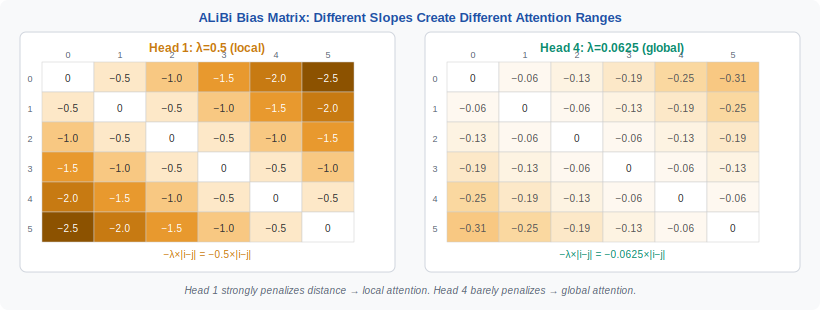
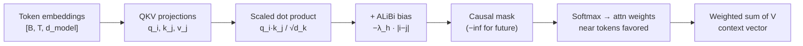
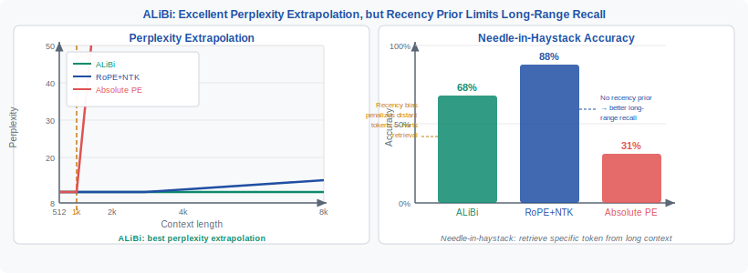

<!-- ============================ TOP NAV ============================ -->
<div align="center">

[🏠 Home](../../README.md) &nbsp;•&nbsp; [📚 Section 1 — Transformer Architecture](./README.md) &nbsp;•&nbsp; [⬅️ Q19 — Position Encodings](./q19-position-encodings.md) &nbsp;•&nbsp; [Q21 — Parallel Attention+FFN ➡️](./q21-parallel-attention-ffn.md)

</div>

---

# Q20 · Discuss ALiBi: how does adding a linear bias to attention logits enable length extrapolation?

<div align="center">


</div>

> [!IMPORTANT]
> **The 20-second answer.** ALiBi (Attention with Linear Biases) injects positional information *after* the query-key dot product by subtracting a head-specific slope times the token distance from each attention logit: $\text{score}(i,j) = q_i \cdot k_j / \sqrt{d_k} - \lambda_h |i - j|$. Because the bias is a mathematical formula rather than a lookup table, it produces a well-defined value at *any* distance — so a model trained on 1 024 tokens can attend over 4 096 tokens at inference without encountering any out-of-distribution position index.

---

## Table of contents

1. [First principles](#1--first-principles)
2. [The problem, told as a story](#2--the-problem-told-as-a-story)
3. [The mechanism, precisely](#3--the-mechanism-precisely)
4. [The fix: what ALiBi actually does](#4--the-fix-what-alibi-actually-does)
5. [Intuition & geometric view](#5--intuition--geometric-view)
6. [Variants / comparison table](#6--variants--comparison-table)
7. [Algorithm & pseudocode](#7--algorithm--pseudocode)
8. [Reference implementation (PyTorch)](#8--reference-implementation-pytorch)
9. [Worked numerical example](#9--worked-numerical-example)
10. [Where it's used / where it breaks](#10--where-its-used--where-it-breaks)
11. [Cousins & alternatives](#11--cousins--alternatives)
12. [Interview drill](#12--interview-drill)
13. [Common misconceptions](#13--common-misconceptions)
14. [One-screen summary](#14--one-screen-summary)
15. [References](#15--references)

---

## 1 · First principles

Attention computes a weighted average over value vectors. The weight between query $i$ and key $j$ is determined by a scalar **logit**:

$$\ell_{ij} = \frac{q_i \cdot k_j}{\sqrt{d_k}}$$

Everything the attention layer knows about *where* two tokens sit in the sequence must flow through this scalar. Positional encoding methods answer the question "how does position get in?" with a design choice:

| When does position enter? | How? | Method |
|---|---|---|
| **Before** the dot product, in $q_i$ and $k_j$ | Add sinusoidal/learned PE to token embedding | Absolute PE, sinusoidal |
| **Before** the dot product, by rotating $q_i$ and $k_j$ | Multiply by a rotation matrix that depends on position | RoPE |
| **After** the dot product, directly to $\ell_{ij}$ | Subtract a penalty that grows with token distance | **ALiBi** |

That final row is the key distinction. ALiBi does not touch the embedding or the projection matrices. It adds a scalar offset to each already-computed logit. This is the architectural choice that makes extrapolation straightforward — the injected term is a closed-form function of distance, not a table that runs out of rows at training length.

Lock in a second fact: the softmax is **shift-invariant per row** ($\text{softmax}(x + c \mathbf{1}) = \text{softmax}(x)$) but **not** invariant to *position-dependent* shifts. Adding a scalar that differs across $j$ *does* reshape the attention distribution, pushing probability mass toward nearby tokens. That is exactly what ALiBi exploits.

---

## 2 · The problem, told as a story

Imagine training a language model on documents up to 1 024 tokens. Your model learns to predict the next token and does it well. Then at inference someone feeds it a 4 096-token document.

**With absolute positional embeddings (APE):** position 1 025 was never seen during training. The embedding table has no entry for it, or if you interpolate you get a vector the model was never asked to interpret. Perplexity skyrockets — the model is confused not because the language is unfamiliar, but because the *coordinates* are foreign. This is the **out-of-distribution position** problem.

**With RoPE:** positions are encoded as rotation angles. Rotation angle at position $t$ is $t \theta_d$ where $\theta_d = 10000^{-2d/D}$. For large $t$, higher-frequency dimensions cycle rapidly, and the dot product of a query at position $t$ with a key at position 0 involves $\cos(t\theta_d)$ terms that the model has never seen at high $t$ during training. When $t$ exceeds training length, those cosine values alias into patterns that look like short-range relationships — a phenomenon called **frequency aliasing** — and perplexity degrades.

<div align="center">

<br><sub><b>Figure 1.</b> The ALiBi bias matrix for a single head. Each cell holds $-\lambda_h |i - j|$. The diagonal (attending to self) has bias 0. Moving left from the diagonal (attending to earlier tokens) the penalty grows linearly. At training time the matrix has rows and columns up to $T_{\text{train}}$; at inference it simply extends — the formula remains valid.</sub>
</div>

**The core need:** position information that generalizes beyond $T_{\text{train}}$ without any out-of-distribution coordinates. ALiBi satisfies this by expressing "position" as a *relative distance penalty* computed from a formula, not a lookup.

---

## 3 · The mechanism, precisely



Step by step:

1. **Project** as in standard attention: $Q = XW_Q$, $K = XW_K$, $V = XW_V$.
2. **Compute raw logits** for each head $h$:
   $$s_{ij}^{(h)} = \frac{q_i^{(h)} \cdot k_j^{(h)}}{\sqrt{d_k}}$$
3. **Add ALiBi bias** (subtraction of a non-negative penalty):
   $$\ell_{ij}^{(h)} = s_{ij}^{(h)} - \lambda_h \cdot |i - j|$$
4. **Apply causal mask** (if decoder): set $\ell_{ij} = -\infty$ for $j > i$.
5. **Softmax** over keys: $a_{ij}^{(h)} = \text{softmax}_j\bigl(\ell_{ij}^{(h)}\bigr)$.
6. **Aggregate**: output $= \sum_j a_{ij}^{(h)} v_j^{(h)}$.

The slopes $\lambda_h$ follow a **geometric sequence** with no learnable parameters:

$$\lambda_h = 2^{-8h/H}, \quad h = 1, 2, \ldots, H$$

For $H = 8$ heads:

| Head $h$ | Slope $\lambda_h$ | Bias per unit distance |
|---|---|---|
| 1 | $2^{-1} = 1/2$ | −0.5 per step |
| 2 | $2^{-2} = 1/4$ | −0.25 per step |
| 3 | $2^{-3} = 1/8$ | −0.125 per step |
| 4 | $2^{-4} = 1/16$ | −0.0625 per step |
| 5 | $2^{-5} = 1/32$ | −0.03125 per step |
| 6 | $2^{-6} = 1/64$ | −0.015625 per step |
| 7 | $2^{-7} = 1/128$ | −0.0078125 per step |
| 8 | $2^{-8} = 1/256$ | −0.00390625 per step |

**Why a geometric sequence?** It gives heads a log-uniform spread of scales: head 1 is local (steep penalty suppresses anything beyond ~5 tokens), head 8 is nearly global (penalty at distance 256 is only −1.0). Together the heads provide a multi-resolution recency prior, and the model can route queries to whichever head's scale is appropriate. Press et al. chose this schedule by grid search over training perplexity and found the geometric sequence near-optimal.

> [!NOTE]
> **Zero learnable parameters.** The slopes $\lambda_h$ are fixed constants set before training starts. ALiBi adds 0 parameters to the model. The bias matrix is a precomputed constant for any given sequence length.

---

## 4 · The fix: what ALiBi actually does

The fundamental reason ALiBi enables length extrapolation is that its positional term is a **formula applied to a number** (distance), not an **index into a table** (position). This seemingly small distinction has large consequences.

**APE failure mode:** At position $t > T_{\text{train}}$, the embedding table has no row $t$. You must extrapolate (random, interpolated, or zero) — the model never learned to interpret whatever value you put there.

**ALiBi at position $t > T_{\text{train}}$:** The bias for (query $i$, key $j$) is $-\lambda_h |i - j|$. For $i = 100{,}000$ and $j = 99{,}900$, this is $-\lambda_h \cdot 100$. This number is perfectly computable, and it is on the **same linear scale** as every bias the model saw during training. At training time, the model learned to interpret logits that include a distance penalty of magnitude $\lambda_h \cdot d$ for $d \in [0, T_{\text{train}}]$. At inference on a longer sequence, the same penalties appear — they are just larger for large $d$. The model has learned the semantic of "large penalty = far away" and correctly generalizes.

<div align="center">

<br><sub><b>Figure 2.</b> Extrapolation curves from Press et al. (2022). ALiBi trained at 1 024 tokens reaches 2 048 tokens with modest perplexity increase. Absolute PE degrades immediately; RoPE degrades more gracefully than APE but still aliases before 2×. (Illustration — curves are qualitative reproductions.)</sub>
</div>

The Press et al. (2022) paper demonstrates this quantitatively: a model trained at 1 024 tokens with ALiBi achieves lower perplexity at 2 048 tokens than a model *trained* at 2 048 tokens with sinusoidal PE. In other words, ALiBi can be more compute-efficient: train shorter, infer longer.

---

## 5 · Intuition & geometric view

**The recency prior as a soft local window.** Each head $h$ imposes an effective attention horizon. The logit penalty at distance $d$ is $\lambda_h d$. For this penalty to overcome a semantic match of strength $s_{ij}$, you need $\lambda_h d > s_{ij}$, i.e. distance $d > s_{ij}/\lambda_h$. With a steep slope ($\lambda_h = 1/2$), semantic strength of 5.0 wins only up to distance ~10. With a shallow slope ($\lambda_h = 1/256$), the same semantic strength wins out to distance ~1 280. Each head is a **soft local window of different radius** and the model can route queries to the right window.

**Why the soft window extrapolates but a hard window does not.** A hard sliding-window attention (as in Longformer) is a trainable mask. It's a binary decision trained on specific window sizes. ALiBi's window is *continuously parameterized* by distance — so a distance of 1 025 at inference time is just a slightly more suppressed version of distance 1 024 at training time. The behavior is *continuous*, not a cliff.

**The gradient perspective.** During training, the gradient of the loss with respect to the bias entry $-\lambda_h |i - j|$ is zero — it is a constant, so no gradient flows through it. But it shapes which (i,j) pairs the content-based dot product needs to be large to overcome the penalty. The model learns $W_Q, W_K, W_V$ to work *in the presence of this recency prior*, and that relationship generalizes.

**One hard edge.** ALiBi's recency prior is unconditional: position 10 000 always gets a larger penalty than position 5. If a task requires retrieving a specific fact from very early in a long document (needle-in-a-haystack), a steep-slope head may suppress it regardless of semantic relevance. This is the core trade-off: better extrapolation, weaker long-range recall.

---

## 6 · Variants / comparison table

| Property | **ALiBi** | **RoPE** | **Sinusoidal APE** | **Learned APE** |
|---|---|---|---|---|
| **Where injected** | After dot product (bias to logit) | Before dot product (rotates q, k) | Before dot product (added to embedding) | Before dot product (added to embedding) |
| **Extrapolation** | Strong (formula-based, no OOD) | Moderate (aliasing beyond 1–2× train length) | Weak (OOD position index) | Weak (OOD position index) |
| **Learned parameters** | 0 | 0 | 0 (sinusoidal fixed) | $T_{\text{max}} \times d_{\text{model}}$ |
| **Recency bias** | Hard (built-in inductive bias) | None (content drives attention) | None | None |
| **Long-range retrieval** | Limited by steep heads | Strong | Strong if within context | Strong if within context |
| **Compatible with FlashAttention** | Yes (add bias in tiling kernel) | Yes | Yes | Yes |
| **Compute overhead** | Negligible (precomputed) | Small (rotation per token) | Negligible | Negligible |
| **Used in** | MPT, BLOOM, Falcon (partial) | LLaMA, Mistral, Gemma, Qwen | GPT-2, early BERT | GPT-3 |
| **Max context in practice** | 65k+ (MPT-65k) | 128k+ with extended RoPE | ≤ train length | ≤ train length |

> [!NOTE]
> RoPE has largely won in frontier models (LLaMA family, Mistral, GPT-4 variants) because it imposes no hard recency prior and can be extended with frequency rescaling (YaRN, LongRoPE, rope_theta adjustments) to very long contexts. ALiBi is still used when simplicity and zero-parameter positional encoding are priorities.

---

## 7 · Algorithm & pseudocode

```text
PRECOMPUTE (once per model config):
  slopes[H]     ← 2^(−8h/H)  for h = 1..H            # shape [H]
  # At runtime, for a sequence of length T:
  dist[T, T]    ← |i − j|   for i,j in 0..T-1         # shape [T, T]
  bias[H, T, T] ← −slopes[:, None, None] * dist        # shape [H, T, T]

FORWARD (per batch):
INPUT : x           ∈ R^[B, T, d_model]
OUTPUT: context     ∈ R^[B, T, d_model]

1. Q, K, V ← x @ W_Q, x @ W_K, x @ W_V               # [B, T, d_model] each
2. Reshape Q, K, V → [B, H, T, d_head]                # split into heads
3. logits ← (Q @ Kᵀ) / √d_head                        # [B, H, T, T]  content scores
4. logits ← logits + bias[H, T, T]                    # [B, H, T, T]  + ALiBi recency penalty
5. logits ← apply_causal_mask(logits)                  # set future positions to −∞
6. attn   ← softmax(logits, dim=−1)                    # [B, H, T, T]
7. out    ← attn @ V                                   # [B, H, T, d_head]
8. return merge_heads(out) @ W_O                       # [B, T, d_model]

NOTE: bias is precomputed and reused across all layers and batches.
      At inference with T > T_train, extend dist to [T_inf, T_inf] — no
      learned table to extend, just evaluate |i−j| for larger i, j.
```

Key observation: steps 1–3 and 5–8 are identical to standard attention. Only step 4 is new, and it is an elementwise add of a precomputed constant tensor.

---

## 8 · Reference implementation (PyTorch)

```python
import torch
import torch.nn as nn
import torch.nn.functional as F
import math


def get_alibi_slopes(n_heads: int) -> torch.Tensor:
    """
    Compute head-specific ALiBi slopes.
    Returns tensor of shape [n_heads], dtype float32.
    Uses the geometric sequence 2^(-8h/H) from Press et al. 2022.
    """
    # Handle case where n_heads is not a power of 2:
    # compute slopes for the nearest power of 2, then interleave extras.
    def _slopes_power_of_2(n: int) -> torch.Tensor:
        start = 2 ** (-(2 ** -(math.log2(n) - 3)))  # = 2^(-8/n)
        ratio = start
        return torch.tensor([start * ratio**i for i in range(n)], dtype=torch.float32)

    if math.log2(n_heads).is_integer():
        return _slopes_power_of_2(n_heads)
    else:
        # Nearest power of 2 <= n_heads
        closest_power = 2 ** math.floor(math.log2(n_heads))
        base_slopes = _slopes_power_of_2(closest_power)
        # Extra slopes interleaved at half the base resolution
        extra_slopes = _slopes_power_of_2(2 * closest_power)[0::2]
        extra_slopes = extra_slopes[: n_heads - closest_power]
        return torch.cat([base_slopes, extra_slopes], dim=0)


def get_alibi_bias(
    n_heads: int, seq_len: int, device: torch.device, dtype: torch.dtype = torch.float32
) -> torch.Tensor:
    """
    Precompute the ALiBi bias matrix.
    Returns tensor of shape [n_heads, seq_len, seq_len].
    Entry [h, i, j] = -slopes[h] * |i - j|.

    For a causal model the upper triangle will be masked to -inf later;
    the bias is still applied before the causal mask.
    """
    slopes = get_alibi_slopes(n_heads).to(device=device, dtype=dtype)  # [H]
    # Relative positions: rows are query positions, cols are key positions.
    positions = torch.arange(seq_len, device=device, dtype=dtype)
    # Distance matrix: shape [seq_len, seq_len]
    dist = (positions.unsqueeze(0) - positions.unsqueeze(1)).abs()  # |i - j|
    # Bias: [H, 1, 1] * [1, T, T] -> [H, T, T], then negate
    bias = -slopes[:, None, None] * dist[None, :, :]  # [H, T, T]
    return bias


class ALiBiAttention(nn.Module):
    """
    Multi-head causal attention with ALiBi positional bias.
    Fully runnable: instantiate and call forward(x).
    """

    def __init__(self, d_model: int, n_heads: int, max_seq_len: int = 8192):
        super().__init__()
        assert d_model % n_heads == 0, "d_model must be divisible by n_heads"
        self.n_heads = n_heads
        self.d_head = d_model // n_heads
        self.scale = self.d_head ** -0.5

        self.qkv = nn.Linear(d_model, 3 * d_model, bias=False)
        self.out_proj = nn.Linear(d_model, d_model, bias=False)

        # Precompute bias for max_seq_len; slice at forward time for shorter seqs.
        # register_buffer ensures it moves to the right device with .to(device).
        alibi = get_alibi_bias(n_heads, max_seq_len, device=torch.device("cpu"))
        self.register_buffer("alibi_bias", alibi, persistent=False)  # [H, T_max, T_max]

    def forward(self, x: torch.Tensor) -> torch.Tensor:
        """
        Args:
            x: [batch, seq_len, d_model]
        Returns:
            [batch, seq_len, d_model]
        """
        B, T, _ = x.shape
        assert T <= self.alibi_bias.shape[-1], (
            f"Sequence length {T} exceeds precomputed max {self.alibi_bias.shape[-1]}. "
            "Re-instantiate with a larger max_seq_len."
        )

        # Project to Q, K, V
        qkv = self.qkv(x)  # [B, T, 3*d_model]
        q, k, v = qkv.chunk(3, dim=-1)  # each [B, T, d_model]

        # Split into heads: [B, H, T, d_head]
        def split_heads(t: torch.Tensor) -> torch.Tensor:
            return t.view(B, T, self.n_heads, self.d_head).transpose(1, 2)

        q, k, v = map(split_heads, (q, k, v))

        # Content-based attention logits
        logits = (q @ k.transpose(-2, -1)) * self.scale  # [B, H, T, T]

        # Add ALiBi bias (slice to current seq length)
        logits = logits + self.alibi_bias[:, :T, :T]  # broadcast over batch

        # Causal mask: future tokens set to -inf
        causal_mask = torch.triu(
            torch.ones(T, T, device=x.device, dtype=torch.bool), diagonal=1
        )
        logits = logits.masked_fill(causal_mask, float("-inf"))

        # Softmax and aggregate
        attn = logits.softmax(dim=-1)  # [B, H, T, T]
        out = attn @ v  # [B, H, T, d_head]

        # Merge heads
        out = out.transpose(1, 2).reshape(B, T, -1)  # [B, T, d_model]
        return self.out_proj(out)


# ─── Quick smoke test ────────────────────────────────────────────────────────
if __name__ == "__main__":
    torch.manual_seed(0)
    model = ALiBiAttention(d_model=128, n_heads=8, max_seq_len=512)
    x = torch.randn(2, 64, 128)   # batch=2, seq=64, d_model=128
    out = model(x)
    print(f"Input shape:  {x.shape}")   # [2, 64, 128]
    print(f"Output shape: {out.shape}") # [2, 64, 128]

    # Verify extrapolation: pass a longer sequence (still within max_seq_len)
    x_long = torch.randn(1, 256, 128)
    out_long = model(x_long)
    print(f"Extrapolated output shape: {out_long.shape}")  # [1, 256, 128]

    # Inspect slopes
    slopes = get_alibi_slopes(8)
    print("Slopes:", slopes.tolist())
    # [0.5, 0.25, 0.125, 0.0625, 0.03125, 0.015625, 0.0078125, 0.00390625]
```

> [!TIP]
> **FlashAttention compatibility.** FlashAttention-2 accepts an `alibi_slopes` argument directly. Pass `get_alibi_slopes(n_heads)` and FlashAttention adds the bias during the tiled matmul without materializing the full $[H, T, T]$ bias matrix. This reduces memory from $O(H T^2)$ to $O(H T)$ for the bias alone.

---

## 9 · Worked numerical example

We use **H = 4 heads, T = 6 tokens**, causal masking. We work through the full bias matrix for two heads and show how the recency prior reshapes attention.

**Step 1: Compute slopes for H = 4.**

$$\lambda_h = 2^{-8h/4} = 2^{-2h}, \quad h = 1, 2, 3, 4$$

| Head | Slope $\lambda_h$ | Decimal |
|---|---|---|
| 1 | $2^{-2} = 1/4$ | 0.25 |
| 2 | $2^{-4} = 1/16$ | 0.0625 |
| 3 | $2^{-6} = 1/64$ | 0.015625 |
| 4 | $2^{-8} = 1/256$ | 0.00390625 |

**Step 2: Distance matrix** (positions 0-indexed, rows = query $i$, cols = key $j$):

$$|i-j| = \begin{pmatrix}
0 & 1 & 2 & 3 & 4 & 5 \\
1 & 0 & 1 & 2 & 3 & 4 \\
2 & 1 & 0 & 1 & 2 & 3 \\
3 & 2 & 1 & 0 & 1 & 2 \\
4 & 3 & 2 & 1 & 0 & 1 \\
5 & 4 & 3 & 2 & 1 & 0
\end{pmatrix}$$

**Step 3: ALiBi bias matrix, Head 1** ($\lambda = 0.25$, steep — local head):

$$B^{(1)} = -0.25 \times |i-j| = \begin{pmatrix}
0 & -0.25 & -0.50 & -0.75 & -1.00 & -1.25 \\
-0.25 & 0 & -0.25 & -0.50 & -0.75 & -1.00 \\
-0.50 & -0.25 & 0 & -0.25 & -0.50 & -0.75 \\
-0.75 & -0.50 & -0.25 & 0 & -0.25 & -0.50 \\
-1.00 & -0.75 & -0.50 & -0.25 & 0 & -0.25 \\
-1.25 & -1.00 & -0.75 & -0.50 & -0.25 & 0
\end{pmatrix}$$

**Step 4: ALiBi bias matrix, Head 4** ($\lambda = 0.00390625$, shallow — global head):

$$B^{(4)} = -0.00390625 \times |i-j| \approx \begin{pmatrix}
0 & -0.004 & -0.008 & -0.012 & -0.016 & -0.020 \\
-0.004 & 0 & -0.004 & -0.008 & -0.012 & -0.016 \\
-0.008 & -0.004 & 0 & -0.004 & -0.008 & -0.012 \\
-0.012 & -0.008 & -0.004 & 0 & -0.004 & -0.008 \\
-0.016 & -0.012 & -0.008 & -0.004 & 0 & -0.004 \\
-0.020 & -0.016 & -0.012 & -0.008 & -0.004 & 0
\end{pmatrix}$$

**Step 5: Concrete attention row for query position $i = 5$** (last token, attending to all 6 tokens including itself).

Suppose the raw content scores for this query row are:

$$s_{5,j} = [1.2,\ 0.8,\ 1.5,\ 0.3,\ 2.1,\ 0.9] \quad j = 0..5$$

After adding Head 1 bias row 5 = $[-1.25, -1.00, -0.75, -0.50, -0.25, 0.0]$:

$$\ell_{5,j}^{(1)} = [1.2 - 1.25,\ 0.8 - 1.00,\ 1.5 - 0.75,\ 0.3 - 0.50,\ 2.1 - 0.25,\ 0.9 + 0.0]$$
$$= [-0.05,\ -0.20,\ 0.75,\ -0.20,\ 1.85,\ 0.90]$$

Softmax: the dominant positions are 4 (distance 1, the immediately preceding token at 1.85) and 5 (self, 0.90) and 2 (1.5 − 0.75 = 0.75). Token 0 (distance 5, original score 1.2) is now penalized to −0.05, nearly suppressed. **Head 1 is local.**

After adding Head 4 bias row 5 = $[-0.020, -0.016, -0.012, -0.008, -0.004, 0.0]$:

$$\ell_{5,j}^{(4)} = [1.18,\ 0.784,\ 1.488,\ 0.292,\ 2.096,\ 0.90]$$

The penalties are tiny — all within 0.02 of the raw scores. Token 0 retains most of its content score (1.18). **Head 4 is global** — semantic relevance dominates the penalty.

**Step 6: Extrapolation demonstration.** Now imagine the sequence extends to $T = 8$, with the query at position $i = 7$ attending to position $j = 0$ (distance 7).

- Head 1 bias: $-0.25 \times 7 = -1.75$. If the raw score is 1.2, the logit is $-0.55$ — strongly suppressed.
- Head 4 bias: $-0.00390625 \times 7 = -0.027$. Logit $\approx 1.173$ — nearly unchanged.

Both values are computed by plugging distance = 7 into the formula. **No lookup table consulted. No OOD index encountered.** The model's learned association "large negative logit = far and less relevant" applies immediately. This is why ALiBi extrapolates.

---

## 10 · Where it's used / where it breaks

**Adopted in production models:**

- **MPT-7B and MPT-30B** (MosaicML, 2023): trained with ALiBi and demonstrated strong perplexity at context lengths up to 65 536 (MPT-65k variant). This is the flagship ALiBi deployment.
- **BLOOM** (BigScience, 2022): 176B parameter multilingual model; one of the earliest large-scale ALiBi deployments.
- **Falcon-7B / Falcon-40B** (TII, 2023): uses ALiBi with parallel attention blocks. Strong multilingual performance with length robustness.

**Where ALiBi underperforms:**

| Failure mode | Reason | Better alternative |
|---|---|---|
| **Needle-in-a-haystack retrieval** | Hard recency prior suppresses distant tokens even when semantically relevant | RoPE (no recency prior) |
| **Multi-hop reasoning over long documents** | Steep-slope heads miss distant co-referents | RoPE + extended context |
| **Tasks requiring uniform global attention** | Some heads will always be local-biased | Learned PE or no PE with attention sinks |
| **Very deep models trained at long contexts** | At $d > 10{,}000$, head 1 penalty exceeds $-2{,}500$ — effectively -inf for all distant tokens | RoPE with YaRN scaling |

**Why RoPE won for frontier models.** RoPE has no hard recency prior, supports precise position-dependent dot products (critical for retrieval tasks), and can be extended with frequency interpolation (YaRN, LongRoPE, rope_theta tuning) to 128k+ contexts without retraining. Models like LLaMA-3 (128k context), Mistral, and Gemma all use variants of extended RoPE. ALiBi's strength — simplicity and formula-based extrapolation — became less decisive once RoPE extension techniques matured.

---

## 11 · Cousins & alternatives

All the methods below attempt to answer the same question: how should a model's attention change based on the relative positions of two tokens?

| Method | Core idea | Extrapolation | Long-range recall |
|---|---|---|---|
| **ALiBi** | Subtract $\lambda_h |i-j|$ from logit after dot product | Strong (formula) | Limited by recency prior |
| **RoPE** | Rotate $q, k$ by position angle before dot product; relative angle appears in dot product | Moderate; improved by YaRN/LongRoPE | Strong |
| **T5 relative bias** (Raffel et al.) | Learned scalar bias per (head, bucket of $|i-j|$) | Weak (learned, fixed buckets) | Moderate |
| **Kerple** (Chi et al., 2022) | Generalizes ALiBi: bias = $-\log(1 + \lambda |i-j|)$ (logarithmic decay instead of linear) | Strong | Slightly better than ALiBi at long range |
| **Sandwich** (Chi et al., 2023) | Combines sinusoidal absolute PE with relative bias | Good | Good |
| **FIRE** (Li et al., 2023) | Functional interpolation with progressive training | Strong | Good |
| **CoPE** (Olsson et al., 2024) | Context-dependent position; PE computed from content | Strong | Good |
| **Sinusoidal APE** | Add $\sin/\cos$ of position to token embedding | Weak | Strong |

**ALiBi vs Kerple.** Kerple's logarithmic decay is less aggressive at long ranges than ALiBi's linear penalty. This means distant tokens are penalized less, giving slightly better long-range recall at the cost of less clean extrapolation. Kerple also introduces one learned parameter per head. In practice neither has displaced RoPE in frontier models.

**Can ALiBi and RoPE be combined?** Technically yes: use RoPE for $q, k$ rotation (injecting relative position into the dot product) and add an ALiBi bias on top. The ALiBi term then acts as an explicit recency smoother on top of the content-and-position score. No widely deployed model uses this combination, but it is not conceptually forbidden. The risk is redundant signals — both already encode relative position, possibly conflicting.

---

## 12 · Interview drill

<details>
<summary><b>Q: How many parameters does ALiBi add to a model?</b></summary>

Zero. The slopes $\lambda_h = 2^{-8h/H}$ are fixed constants computed from the number of heads. The bias matrix is a precomputed constant tensor. No weights are added to the model, no gradient flows through the bias, and checkpoint size is unchanged. This is in contrast to learned relative position bias (T5-style), which adds $O(H \cdot \text{buckets})$ parameters.
</details>

<details>
<summary><b>Q: Why do different heads have different slopes?</b></summary>

The geometric sequence of slopes gives the model a multi-resolution view of distance. Steep-slope heads (e.g. $\lambda = 1/2$) function as local attention heads — they attend mainly to the last few tokens regardless of content. Shallow-slope heads (e.g. $\lambda = 1/256$) are near-global — distance barely penalizes them, so content-based similarity dominates. The model can learn to route different query types through the appropriate head. If all heads had the same slope, the model would lose this diversity and be forced to be either all-local or all-global.
</details>

<details>
<summary><b>Q: What happens to ALiBi at very long sequences where distances are huge?</b></summary>

The bias $-\lambda_h |i - j|$ grows without bound as distance grows. For steep heads ($\lambda_h = 1/2$), distance 1 000 gives bias $-500$ — effectively $-\infty$ after softmax, meaning that head ignores everything more than ~20 tokens away (where the bias equals the typical content score magnitude). For shallow heads ($\lambda_h = 1/256$), distance 1 000 gives bias $-3.9$, which is a meaningful but not catastrophic penalty. So at very long sequences, steep-slope heads degenerate to strict local windows while shallow-slope heads retain some global access. This is graceful degradation but not lossless — tasks requiring global context (like cross-document coreference) will suffer in the steep heads.
</details>

<details>
<summary><b>Q: Can ALiBi and RoPE be combined?</b></summary>

Yes, conceptually. You could apply RoPE rotations to $q$ and $k$ before their dot product (encoding relative position multiplicatively) and then add an ALiBi bias (encoding relative distance additively). Both signals encode $|i-j|$ but in different functional forms and different places in the pipeline. The risk: redundant, potentially conflicting position signals — the model must disentangle them. No frontier model currently uses this combination; when people want ALiBi's smooth extrapolation with RoPE's long-range precision, they instead tune RoPE with YaRN or frequency interpolation.
</details>

<details>
<summary><b>Q: Why does ALiBi extrapolate when absolute PE does not?</b></summary>

Absolute PE requires the model to learn a function $f(\text{position index})$ during training. At position $t > T_{\text{train}}$, that function is evaluated at an index it has never seen — it is an out-of-distribution lookup. The function can be anything (a table, an embedding vector, a sinusoid), but whatever it is, the model was not trained to use it at that index. ALiBi, by contrast, injects position via a formula $-\lambda_h |i - j|$ applied to relative distance. At inference, distance 1 025 is just slightly larger than distance 1 024 — an in-distribution numerical extension of a quantity the model has seen throughout training. The model never looks up an index; it just evaluates a scalar formula. The difference is between a lookup table (which runs out of rows) and an arithmetic expression (which does not).
</details>

<details>
<summary><b>Q: What does the ALiBi bias do to attention entropy?</b></summary>

ALiBi introduces a structured asymmetry in every row of the logit matrix: the current token (distance 0) has bias 0, and all earlier tokens have negative biases that grow with distance. This shifts probability mass toward recent tokens, which decreases attention entropy compared to a model with no positional bias. For steep-slope heads, entropy can be very low (near-local attention). For shallow-slope heads, the effect on entropy is small. This is the recency prior quantified: ALiBi does not just slightly prefer nearby tokens — for steep heads, it strongly concentrates attention in a local window, which is a form of regularization that generalizes to longer sequences because the concentration pattern does not depend on absolute position.
</details>

---

## 13 · Common misconceptions

| ❌ Misconception | ✅ Reality |
|---|---|
| "ALiBi adds learned position embeddings." | ALiBi adds **zero** learnable parameters. Slopes are fixed constants. |
| "ALiBi encodes absolute position." | ALiBi encodes **relative distance** $|i - j|$. It has no notion of where in the document a token sits, only how far apart two tokens are. |
| "All ALiBi heads behave the same way." | Each head has a different slope. Steep heads are local; shallow heads are near-global. This multi-resolution design is central to the method. |
| "ALiBi guarantees perfect extrapolation to any length." | It extrapolates gracefully because the formula is well-defined at any distance, but perplexity still rises at very long lengths — just slower than APE. Retrieval tasks still degrade due to the recency prior. |
| "ALiBi prevents attending to distant tokens." | ALiBi *discounts* distant tokens proportionally; it does not set them to $-\infty$. A sufficiently strong content signal can still overcome the distance penalty in shallow-slope heads. |
| "ALiBi is incompatible with FlashAttention." | FlashAttention-2 has native `alibi_slopes` support. The bias is applied within the tiled kernel, saving memory vs materializing the $[H,T,T]$ tensor. |
| "RoPE and ALiBi solve the same problem in the same way." | RoPE rotates $q,k$ before the dot product (pre-dot-product, multiplicative); ALiBi adds a penalty after (post-dot-product, additive). RoPE encodes absolute position implicitly via rotation angle; ALiBi encodes only pairwise distance. Their failure modes differ substantially. |

---

## 14 · One-screen summary

> **What:** ALiBi adds $-\lambda_h |i - j|$ to attention logit $\ell_{ij}$ after the dot product. Slopes $\lambda_h = 2^{-8h/H}$ are fixed, head-specific, forming a geometric sequence from steep (local) to shallow (global). Zero learned parameters.
>
> **Why it extrapolates:** The bias is a formula evaluated at a scalar distance, not a lookup into a position table. Distance 1 025 at inference is an in-distribution extension of distances seen at training time. No out-of-distribution index is ever consulted.
>
> **The trade-off:** ALiBi installs a hard recency prior — nearer tokens always score higher than farther tokens, all else equal. This improves extrapolation and reduces positional overfitting, but limits long-range retrieval on tasks like needle-in-a-haystack where a distant fact must be surfaced despite the penalty.
>
> **Implementation cost:** Negligible. Precompute an $[H, T, T]$ constant tensor; add elementwise before softmax. Compatible with FlashAttention via native `alibi_slopes` parameter.
>
> **In practice:** MPT-7B/30B/65k, BLOOM, Falcon use ALiBi. LLaMA family, Mistral, Gemma use RoPE, which has no hard recency prior and can be extended to 128k+ with frequency rescaling. RoPE has become the dominant choice for frontier models requiring strong long-range retrieval.

---

## 15 · References

1. Press, O., Smith, N. A., Lewis, M. — **Train Short, Test Long: Attention with Linear Biases Enables Input Length Extrapolation** (2022). *ICLR 2022. arXiv:2108.12409.* — the original ALiBi paper; introduces the linear bias formulation, slope schedule, and the "train short test long" result.
2. Su, J., Lu, Y., Pan, S., Murtadha, A., Wen, B., Liu, Y. — **RoFormer: Enhanced Transformer with Rotary Position Embedding** (2021). *arXiv:2104.09864.* — RoPE; the primary competitor to ALiBi in frontier models.
3. Raffel, C. et al. — **Exploring the Limits of Transfer Learning with a Unified Text-to-Text Transformer** (T5) (2020). *JMLR 21(140).* — introduces learned relative position bias buckets; an earlier relative PE method.
4. Chi, Z., Dong, L., Wei, F., et al. — **Kerple: Kernelized Relative Positional Embedding for Length Extrapolation** (2022). *NeurIPS 2022. arXiv:2205.09921.* — generalizes ALiBi with logarithmic decay; improves long-range recall.
5. Peng, B., Quesnelle, J., Fan, H., Shippole, E. — **YaRN: Efficient Context Window Extension of Large Language Models** (2023). *arXiv:2309.00071.* — extends RoPE to long contexts via frequency rescaling; the main technique that made RoPE competitive at 128k.
6. MosaicML — **Introducing MPT-7B: A New Standard for Open-Source, Commercially Usable LLMs** (2023). *MosaicML Blog.* — production deployment of ALiBi at scale; shows MPT-65k using ALiBi for 65k context.
7. BigScience — **BLOOM: A 176B-Parameter Open-Access Multilingual Language Model** (2022). *arXiv:2211.05100.* — 176B model using ALiBi; demonstrates large-scale multi-lingual ALiBi training.
8. Peng, B., et al. — **Eagle and Finch: RWKV with Matrix-Valued States and Dynamic Recurrence** (2024). *arXiv:2404.05892.* — context on recency priors in modern sequence models; useful for comparative discussion.
9. Dao, T. — **FlashAttention-2: Faster Attention with Better Parallelism and Work Partitioning** (2023). *arXiv:2307.08691.* — native `alibi_slopes` argument in FlashAttention-2 kernel.

---

<!-- ============================ BOTTOM NAV ============================ -->
<div align="center">

[⬅️ Q19 — Position Encodings](./q19-position-encodings.md) &nbsp;|&nbsp; [📚 Back to Section 1](./README.md) &nbsp;|&nbsp; [🏠 Home](../../README.md) &nbsp;|&nbsp; [Q21 — Parallel Attention+FFN ➡️](./q21-parallel-attention-ffn.md)

<sub>Found an error or have a sharper intuition? See <a href="../../CONTRIBUTING.md">CONTRIBUTING</a> — answers follow the <a href="../../_TEMPLATE.md">answer template</a>.</sub>

</div>
