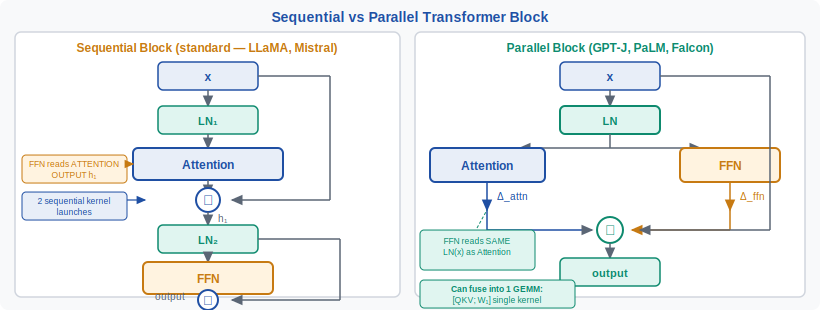
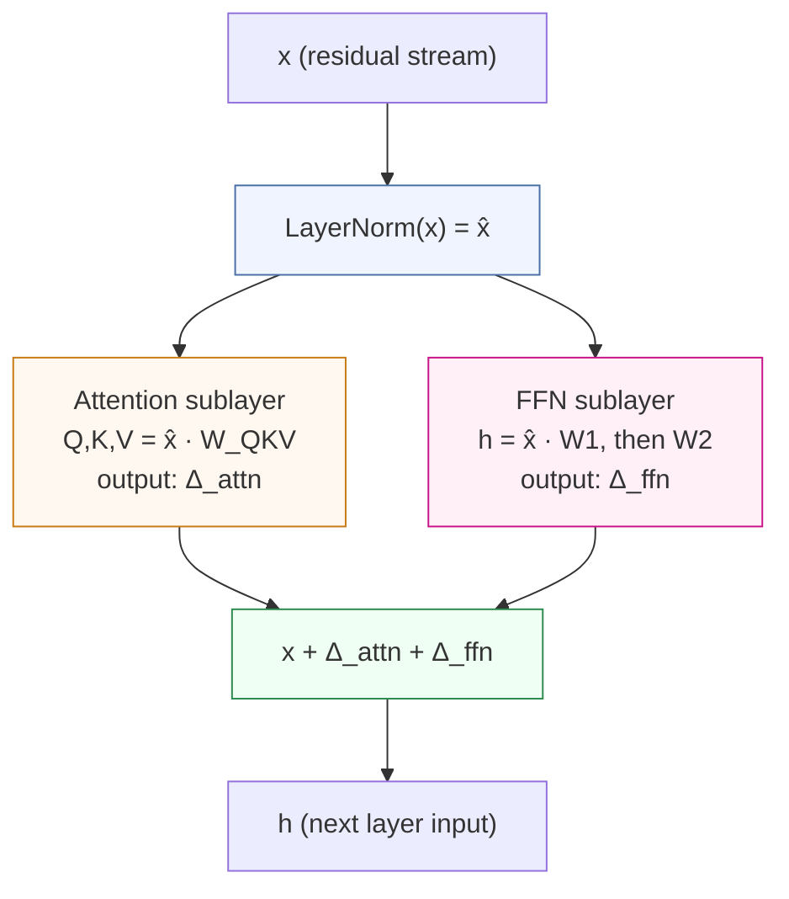
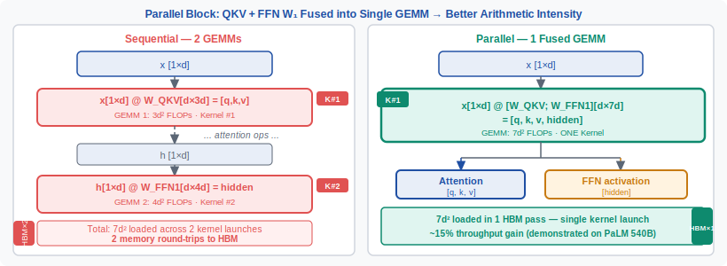

<!-- ============================ TOP NAV ============================ -->
<div align="center">

[🏠 Home](../../README.md) &nbsp;•&nbsp; [📚 Section 1 — Transformer Architecture](./README.md) &nbsp;•&nbsp; [⬅️ Q20 — ALiBi](./q20-alibi.md) &nbsp;•&nbsp; [Q22 — No-bias Transformers ➡️](./q22-no-bias.md)

</div>

---

# Q21 · What is the parallel attention + FFN design used in GPT-J, PaLM, and Falcon? What's the throughput vs quality tradeoff?

<div align="center">


</div>

> [!IMPORTANT]
> **The 20-second answer.** In the **parallel block** design (GPT-J, PaLM, Falcon), the attention sublayer and the FFN sublayer both read the **same LayerNorm output** and their results are summed: $h = x + \text{Attn}(\text{LN}(x)) + \text{FFN}(\text{LN}(x))$. This lets the QKV projection and the first FFN weight matrix be **fused into a single large GEMM**, yielding roughly **15% throughput gain** at 540B scale (PaLM) with negligible quality loss at large scale, but measurable degradation below ~7–13B parameters where the FFN critically benefits from seeing the attention-refined residual.

---

## Table of contents

1. [First principles](#1--first-principles)
2. [The problem, told as a story](#2--the-problem-told-as-a-story)
3. [The mechanism, precisely](#3--the-mechanism-precisely)
4. [The fix / the method](#4--the-fix--the-method)
5. [Intuition & geometric view](#5--intuition--geometric-view)
6. [Variants / comparison table](#6--variants--comparison-table)
7. [Algorithm & pseudocode](#7--algorithm--pseudocode)
8. [Reference implementation (PyTorch)](#8--reference-implementation-pytorch)
9. [Worked numerical example](#9--worked-numerical-example)
10. [Where it's used / where it breaks](#10--where-its-used--where-it-breaks)
11. [Cousins & alternatives](#11--cousins--alternatives)
12. [Interview drill](#12--interview-drill)
13. [Common misconceptions](#13--common-misconceptions)
14. [One-screen summary](#14--one-screen-summary)
15. [References](#15--references)

---

## 1 · First principles

Every Transformer block has two workers: **attention** (which routes information across positions) and the **FFN** (which applies a per-position nonlinear transformation). In the original Transformer (Vaswani et al., 2017) these two workers are chained sequentially — attention goes first, the FFN reads its output. This sequential dependency is the default you will see in GPT-2, LLaMA, and Mistral.

The parallel design asks a deceptively simple question: **do these two workers actually need to see each other's output, or can they both start from the same input and add their contributions directly to the residual stream?**

To answer that you need to understand what each worker actually does:

- **Attention** aggregates information from other positions. It asks "what from elsewhere matters?" and produces a *routing update* $\Delta_{\text{attn}}$.
- **FFN** applies a per-position two-layer MLP. It enriches the token's own representation, functioning as an associative memory that retrieves and writes patterns (Geva et al., 2021).

The question becomes: does the FFN need to see $\Delta_{\text{attn}}$ folded into $x$ before it does its job? At small scale, yes — attention provides critical routing context the FFN builds on. At large scale, the residual stream $x$ already carries rich enough representation that $\Delta_{\text{attn}}$ is a relatively small perturbation, and the FFN's input quality does not significantly degrade from reading $x$ directly.

The reward for running them in parallel is **hardware efficiency**: the two large matrix multiplications that open each sublayer (QKV projection and $W_1$) can be **fused into one kernel call**.

---

## 2 · The problem, told as a story

Imagine you are designing a 540-billion-parameter language model and you want to train it on a fleet of TPUs as fast as possible. Your bottleneck is **tensor core utilization**: TPU matrix units are happiest when you feed them very large matrix multiply operations (GEMMs). Small or sequential GEMMs leave the units idle between kernel launches.

In the standard sequential block, the first thing that happens inside each block is:

1. LayerNorm of $x$.
2. Three projections to get $Q, K, V$ (a GEMM of shape $[B \cdot T, d] \times [d, 3d]$).
3. Compute attention output.
4. Add residual: $h \leftarrow x + \Delta_{\text{attn}}$.
5. **Second** LayerNorm of $h$ — cannot start until step 4 finishes.
6. First FFN projection $W_1$ (a GEMM of shape $[B \cdot T, d] \times [d, 4d]$).

Steps 2 and 6 are two **sequential** GEMMs. There is a hard data dependency between them — you cannot start the FFN GEMM until the attention GEMM finishes *and* you have computed the residual *and* you have computed the second LayerNorm. On hardware, this means two separate kernel launches, each smaller than they could be, with idle time in between.

<div align="center">

<br><sub><b>Figure 1.</b> Sequential (left) vs. parallel (right) Transformer block. In the parallel design both sublayers read the same LayerNorm output, enabling the QKV and W1 GEMMs to fuse into a single larger matmul. The second LayerNorm and its associated residual connection are also eliminated.</sub>
</div>

The parallel design removes the data dependency between the two GEMMs, allowing them to be fused. The PaLM paper (Chowdhery et al., 2022) reports a **15% throughput improvement** at 540B scale from this change alone.

---

## 3 · The mechanism, precisely

The **sequential block** (standard Transformer post-LN, simplified):

$$h_1 = x + \text{Attn}(\text{LN}(x))$$
$$h_2 = h_1 + \text{FFN}(\text{LN}(h_1))$$

The **parallel block**:

$$h = x + \text{Attn}(\text{LN}(x)) + \text{FFN}(\text{LN}(x))$$

In the sequential form there are **two LayerNorm calls** — one before attention, one before the FFN. In the parallel form there is **one LayerNorm call**, shared. Both sublayers receive the identical normalized vector $\hat{x} = \text{LN}(x)$.



The key consequence: because both sublayers read $\hat{x}$ (the same LN output), the QKV projection $[Q;K;V] = \hat{x} \cdot W_{QKV}$ and the first FFN projection $H_1 = \hat{x} \cdot W_1$ can be **concatenated into a single GEMM**:

$$[Q; K; V; H_1] = \hat{x} \cdot [W_{QKV} \| W_1]$$

This is a single matrix multiply of shape $[B \cdot T, \; d] \times [d, \; 3d + 4d]$ = $[B \cdot T, \; d] \times [d, \; 7d]$.

One large GEMM is **more efficient** than two smaller sequential GEMMs because:
- Tensor cores have higher arithmetic intensity with larger matrices (Roofline model: computation-to-memory ratio improves).
- Single kernel launch eliminates launch overhead and synchronization barrier.
- Memory bandwidth is used more efficiently — $\hat{x}$ is loaded from SRAM/HBM once, not twice.

---

## 4 · The fix / the method

The parallel block is the "fix" to a throughput bottleneck. Here is the full specification of what changes:

**What stays the same:**
- All weight matrices ($W_Q, W_K, W_V, W_O, W_1, W_2$) with identical parameter count.
- Total FLOPs per forward pass (approximately — the saved LayerNorm is negligible).
- The residual stream architecture.
- All hyperparameters ($d$, $d_{ff}$, number of heads, etc.).

**What changes:**
1. **One LayerNorm instead of two.** The LayerNorm before the FFN is eliminated; the FFN reads $\text{LN}(x)$ directly.
2. **Single residual add instead of two.** The two residual additions $x + \Delta_{\text{attn}}$ and $h_1 + \Delta_{\text{ffn}}$ are replaced by one: $x + \Delta_{\text{attn}} + \Delta_{\text{ffn}}$.
3. **GEMM fusion opportunity.** Implementation can optionally fuse the QKV and $W_1$ projections.

<div align="center">

<br><sub><b>Figure 2.</b> GEMM fusion in the parallel block. The fused weight $[W_{QKV} \| W_1]$ has shape $[d, 7d]$ (with $d_{ff} = 4d$). A single matmul produces all four intermediate tensors. W2 and W_O cannot be fused as they depend on the attention and FFN computations respectively.</sub>
</div>

**The missing cross-term.** The mathematical difference between sequential and parallel is:

$$h_{\text{sequential}} = x + \Delta_{\text{attn}} + \Delta_{\text{ffn}}(x + \Delta_{\text{attn}})$$
$$h_{\text{parallel}} = x + \Delta_{\text{attn}} + \Delta_{\text{ffn}}(x)$$

The missing term is $\Delta_{\text{ffn}}(x + \Delta_{\text{attn}}) - \Delta_{\text{ffn}}(x)$, which is approximately the FFN's Jacobian applied to $\Delta_{\text{attn}}$. At large scale, $\|\Delta_{\text{attn}}\| \ll \|x\|$ (the residual stream perspective: individual updates are small perturbations to a large accumulated representation), so this cross-term is small. At small scale, $\Delta_{\text{attn}}$ carries a larger fraction of the total signal, making the cross-term non-negligible and the quality difference measurable.

---

## 5 · Intuition & geometric view

Think of the residual stream as a **high-dimensional message board**. At each layer, attention reads the board, writes a routing update ($\Delta_{\text{attn}}$), and the FFN reads the board, writes an enrichment update ($\Delta_{\text{ffn}}$).

**Sequential:** FFN reads the board *after* attention has already posted its update. The FFN can react to what attention just wrote.

**Parallel:** FFN reads the board *before* seeing attention's update. The FFN acts on yesterday's news.

The key insight from the residual stream perspective (Elhage et al., 2021) is that at large scale, the residual stream $x$ at any given layer is a **superposition of all previous layers' contributions** — it already encodes rich contextual information. The attention update $\Delta_{\text{attn}}$ at a single layer is a relatively small correction to this accumulated representation. So the FFN reading $x$ vs. $x + \Delta_{\text{attn}}$ does not matter much when $x$ is already information-dense.

At small scale (fewer layers, fewer parameters), each layer's attention update carries a larger fraction of the total information flow. The FFN genuinely needs to condition on what attention just computed — for example, attention identifies "the subject of this sentence is a person" and the FFN needs to retrieve person-related knowledge conditioned on that routing.

**Geometric view.** In the full model function $f: \mathbb{R}^{T \times d} \to \mathbb{R}^{T \times d}$, the sequential block applies a function that lies in a composition class $\mathcal{F}_{\text{seq}} = \{g \circ h : g \in \mathcal{G}, h \in \mathcal{H}\}$. The parallel block applies functions in $\mathcal{F}_{\text{par}} = \{g + h : g \in \mathcal{G}, h \in \mathcal{H}\}$. The parallel class is a **strict subset** of what the sequential class can represent — not every sequential function can be written as a sum of independent attention and FFN functions. At sufficient depth and width, both classes can approximate the same targets, but at shallow or narrow settings the restriction matters.

---

## 6 · Variants / comparison table

| Property | Sequential Block | Parallel Block |
|---|---|---|
| **Formula** | $h = x + \text{Attn}(\text{LN}(x))$; $h' = h + \text{FFN}(\text{LN}(h))$ | $h = x + \text{Attn}(\text{LN}(x)) + \text{FFN}(\text{LN}(x))$ |
| **LayerNorm count** | 2 per block | 1 per block |
| **Residual adds** | 2 per block | 1 per block |
| **GEMM fusion opportunity** | None (data dependency) | QKV + W1 → single fused GEMM |
| **Throughput gain** | Baseline | ~15% at 540B (PaLM) |
| **Quality at <7B** | Better | Measurably worse |
| **Quality at 13B** | Marginally better | Close, within noise |
| **Quality at 70B+** | Baseline | Negligible difference |
| **FFN sees attention output?** | Yes | No |
| **Memory: activations** | Slightly higher (two LN outputs stored) | Slightly lower (one LN output) |
| **Models using it** | LLaMA, Mistral, GPT-2, GPT-3, T5 | GPT-J (6B), GPT-NeoX (20B), PaLM (540B), Falcon (7B/40B/180B) |

**Note on GPT-J at 6B.** GPT-J uses parallel blocks despite the 6B scale where the quality tradeoff is less favorable. The EleutherAI team made this choice to match the hardware efficiency benefits; the quality difference vs. sequential at this scale is real but modest in practice, and GPT-J still performs competitively for its era.

**GQA/MQA compatibility.** Parallel design is fully compatible with Grouped Query Attention (GQA) and Multi-Query Attention (MQA). The QKV projection in the fused GEMM simply has fewer K and V columns: shape $[d, d_q + 2 \cdot d_{kv}]$ for GQA, where $d_{kv} < d_q$. The FFN projection columns are appended unchanged.

---

## 7 · Algorithm & pseudocode

**Sequential block (standard):**

```text
INPUT : x         # [B, T, d] — residual stream
        LN1, LN2  # two LayerNorms
        Attn      # multi-head attention
        FFN       # two-layer MLP (W1, W2)

1.  x_norm1 = LN1(x)
2.  delta_attn = Attn(x_norm1)           # Q,K,V projections + attention + out-proj
3.  h = x + delta_attn                  # first residual add
4.  x_norm2 = LN2(h)                    # SECOND LayerNorm — cannot start until step 3
5.  delta_ffn = FFN(x_norm2)            # W1 GEMM + activation + W2 GEMM
6.  output = h + delta_ffn              # second residual add
RETURN output
```

**Parallel block:**

```text
INPUT : x       # [B, T, d] — residual stream
        LN      # one LayerNorm
        Attn    # multi-head attention
        FFN     # two-layer MLP (W1, W2)

1.  x_norm = LN(x)                      # ONE LayerNorm — shared by both sublayers
    # --- Both sublayers can now run concurrently (or in a fused GEMM) ---
2a. [Q; K; V; H1] = x_norm @ [W_QKV || W1]  # FUSED GEMM: shape [d, 3d+4d]
2b. delta_attn = attn_compute(Q, K, V) @ W_O # attention pattern + output proj
2c. delta_ffn  = activation(H1) @ W2        # FFN second half
    # -----------------------------------------------------------------------
3.  output = x + delta_attn + delta_ffn  # ONE residual add
RETURN output
```

Key observations:
- Step 2a is the fused GEMM: a single large matrix multiply replaces two separate ones.
- Steps 2b and 2c are independent after the fused GEMM and can run in parallel.
- Step 3 has only one residual add instead of two.
- The FFN reads `x_norm = LN(x)`, not `LN(x + delta_attn)`.

---

## 8 · Reference implementation (PyTorch)

```python
import torch
import torch.nn as nn
import torch.nn.functional as F
import math


class SequentialTransformerBlock(nn.Module):
    """Standard (sequential) Transformer block — attention then FFN."""

    def __init__(self, d_model: int, n_heads: int, d_ff: int, dropout: float = 0.0):
        super().__init__()
        assert d_model % n_heads == 0
        self.n_heads = n_heads
        self.d_head = d_model // n_heads
        self.d_ff = d_ff

        self.ln1 = nn.LayerNorm(d_model)
        self.ln2 = nn.LayerNorm(d_model)

        # Attention projections (separate)
        self.qkv = nn.Linear(d_model, 3 * d_model, bias=False)
        self.out_proj = nn.Linear(d_model, d_model, bias=False)

        # FFN projections (separate)
        self.w1 = nn.Linear(d_model, d_ff, bias=False)
        self.w2 = nn.Linear(d_ff, d_model, bias=False)

        self.drop = nn.Dropout(dropout)

    def _attn(self, x: torch.Tensor) -> torch.Tensor:
        B, T, d = x.shape
        q, k, v = self.qkv(x).chunk(3, dim=-1)
        # Reshape to [B, heads, T, d_head]
        def split_heads(t):
            return t.view(B, T, self.n_heads, self.d_head).transpose(1, 2)
        q, k, v = map(split_heads, (q, k, v))

        scale = math.sqrt(self.d_head)
        logits = (q @ k.transpose(-2, -1)) / scale
        # Causal mask
        mask = torch.triu(torch.ones(T, T, device=x.device, dtype=torch.bool), 1)
        logits = logits.masked_fill(mask, float("-inf"))
        attn = self.drop(logits.softmax(dim=-1))
        out = (attn @ v).transpose(1, 2).reshape(B, T, -1)
        return self.out_proj(out)

    def _ffn(self, x: torch.Tensor) -> torch.Tensor:
        return self.w2(F.gelu(self.w1(x)))

    def forward(self, x: torch.Tensor) -> torch.Tensor:
        # Sequential: FFN reads attention-refined representation
        h = x + self._attn(self.ln1(x))          # first residual (attn)
        h = h + self._ffn(self.ln2(h))            # second residual (ffn reads h, not x)
        return h


class ParallelTransformerBlock(nn.Module):
    """Parallel Transformer block — attention and FFN read the same LN(x).
    
    Used in: GPT-J, GPT-NeoX, PaLM, Falcon.
    Key optimization: QKV + W1 projections are fused into one GEMM.
    """

    def __init__(self, d_model: int, n_heads: int, d_ff: int, dropout: float = 0.0):
        super().__init__()
        assert d_model % n_heads == 0
        self.n_heads = n_heads
        self.d_head = d_model // n_heads
        self.d_ff = d_ff

        # ONE LayerNorm (not two)
        self.ln = nn.LayerNorm(d_model)

        # FUSED projection: [W_Q; W_K; W_V; W_1] in a single weight matrix
        # Shape: [d_model, 3*d_model + d_ff] = [d, 3d + 4d] = [d, 7d]
        self.fused_proj = nn.Linear(d_model, 3 * d_model + d_ff, bias=False)

        # These two cannot be fused (depend on attention compute / activation)
        self.out_proj = nn.Linear(d_model, d_model, bias=False)
        self.w2 = nn.Linear(d_ff, d_model, bias=False)

        self.drop = nn.Dropout(dropout)

    def forward(self, x: torch.Tensor) -> torch.Tensor:
        B, T, d = x.shape

        # ONE shared LayerNorm
        x_norm = self.ln(x)

        # FUSED GEMM: one large matmul produces Q, K, V, and H1 simultaneously
        # x_norm: [B, T, d]  fused_proj.weight: [7d, d]
        fused_out = self.fused_proj(x_norm)  # [B, T, 3d + d_ff]

        # Split the fused output
        q, k, v, h1 = fused_out.split(
            [d, d, d, self.d_ff], dim=-1
        )

        # --- Attention path ---
        def split_heads(t):
            return t.view(B, T, self.n_heads, self.d_head).transpose(1, 2)
        q, k, v = map(split_heads, (q, k, v))

        scale = math.sqrt(self.d_head)
        logits = (q @ k.transpose(-2, -1)) / scale
        mask = torch.triu(torch.ones(T, T, device=x.device, dtype=torch.bool), 1)
        logits = logits.masked_fill(mask, float("-inf"))
        attn = self.drop(logits.softmax(dim=-1))
        delta_attn = self.out_proj(
            (attn @ v).transpose(1, 2).reshape(B, T, -1)
        )

        # --- FFN path (reads x_norm, NOT x_norm + delta_attn) ---
        # h1 came from the fused GEMM, already conditioned on x_norm only
        delta_ffn = self.w2(F.gelu(h1))

        # ONE residual add (not two)
        return x + delta_attn + delta_ffn


def compare_blocks():
    """Sanity check: both blocks produce same shape output; parallel is faster."""
    torch.manual_seed(42)
    d, n_heads, d_ff, B, T = 512, 8, 2048, 2, 128

    seq_block = SequentialTransformerBlock(d, n_heads, d_ff)
    par_block = ParallelTransformerBlock(d, n_heads, d_ff)

    x = torch.randn(B, T, d)

    with torch.no_grad():
        y_seq = seq_block(x)
        y_par = par_block(x)

    print(f"Sequential output shape: {y_seq.shape}")   # [2, 128, 512]
    print(f"Parallel output shape:   {y_par.shape}")   # [2, 128, 512]
    print(f"Outputs are different (expected): {not torch.allclose(y_seq, y_par)}")

    # Count parameters
    seq_params = sum(p.numel() for p in seq_block.parameters())
    par_params = sum(p.numel() for p in par_block.parameters())
    print(f"Sequential params: {seq_params:,}")
    print(f"Parallel params:   {par_params:,}")
    # Should be equal (same matrices, just structured differently)


if __name__ == "__main__":
    compare_blocks()
```

> [!NOTE]
> **Parameter count parity.** Both blocks have the **same total parameter count**: $W_Q, W_K, W_V, W_O$ (each $d \times d$) plus $W_1$ ($d \times d_{ff}$) plus $W_2$ ($d_{ff} \times d$) plus LayerNorm parameters. The parallel block saves one LayerNorm ($2d$ parameters for $\gamma, \beta$) — negligible at large $d$.

> [!WARNING]
> **The fused GEMM is a logical fusion.** In the PyTorch code above, `nn.Linear(d_model, 3*d_model + d_ff)` achieves the fusion at the weight level — a single `F.linear` call. In production (JAX/XLA on TPUs, or CUDA with custom kernels), the compiler can further fuse the kernel launch. The weight-level fusion in PyTorch already captures the memory-bandwidth benefit (loading `x_norm` once).

---

## 9 · Worked numerical example

We compute FLOPs and memory accesses for sequential vs. parallel at a realistic inference setting, showing concretely where the gain comes from.

**Setup:** $d = 4096$, $d_{ff} = 16384$ ($4\times$ expansion), $B = 1$, $T = 1024$, $n_\text{heads} = 32$, $d_\text{head} = 128$.

### Step 1: Count FLOPs in each GEMM

A matrix multiply $[M, K] \times [K, N]$ costs $2MKN$ FLOPs (multiply-add).

Here $M = B \cdot T = 1024$.

| Operation | Shape | FLOPs |
|---|---|---|
| QKV projection | $[1024, 4096] \times [4096, 12288]$ | $2 \times 1024 \times 4096 \times 12288 = 103.1 \text{ GFLOPs}$ |
| FFN W1 projection | $[1024, 4096] \times [4096, 16384]$ | $2 \times 1024 \times 4096 \times 16384 = 137.4 \text{ GFLOPs}$ |
| **Fused GEMM (parallel)** | $[1024, 4096] \times [4096, 28672]$ | $2 \times 1024 \times 4096 \times 28672 = 240.5 \text{ GFLOPs}$ |

**FLOPs are identical** (103.1 + 137.4 = 240.5 GFLOPs). The parallel design does not reduce computation — it changes how the computation is structured.

### Step 2: Memory bandwidth analysis

The key metric is **arithmetic intensity** (FLOPs / bytes read from memory).

**Sequential (two separate GEMMs):**

For GEMM 1 (QKV):
- Read $x_\text{norm}$: $1024 \times 4096 \times 2$ bytes (bf16) $= 8.4$ MB
- Read $W_{QKV}$: $4096 \times 12288 \times 2 = 100.7$ MB
- Total memory: $\approx 109$ MB
- FLOPs: $103.1$ GFLOPs
- Arithmetic intensity: $103.1 \text{ G} / 0.109 \text{ G} \approx 946$ FLOPs/byte

For GEMM 2 (W1):
- Must re-read $x_\text{norm2} = \text{LN}(x + \Delta_\text{attn})$: $8.4$ MB (NEW tensor, not cacheable from GEMM 1)
- Read $W_1$: $4096 \times 16384 \times 2 = 134.2$ MB
- Total: $\approx 143$ MB

**Parallel (one fused GEMM):**
- Read $x_\text{norm}$ ONCE: $8.4$ MB
- Read $W_\text{fused}$: $4096 \times 28672 \times 2 = 234.9$ MB
- Total: $\approx 243$ MB
- FLOPs: $240.5$ GFLOPs
- Arithmetic intensity: $240.5 \text{ G} / 0.243 \text{ G} \approx 990$ FLOPs/byte

### Step 3: The real savings — kernel launches and synchronization

Sequential requires:
1. LayerNorm kernel 1
2. QKV GEMM kernel
3. Attention compute (multiple kernels)
4. **Synchronization barrier** (must complete before continuing)
5. Residual add
6. LayerNorm kernel 2 — **cannot overlap with step 2**
7. W1 GEMM kernel

Parallel requires:
1. LayerNorm kernel (once)
2. Fused GEMM kernel (QKV + W1 together)
3. Attention compute + FFN W2 (can overlap)
4. Residual add (once)

**Kernel launches saved per block:** 2 (one LayerNorm, one residual add).

**For PaLM at 540B:** 118 layers $\times$ 2 saved launches = 236 fewer kernel launches per forward pass. At TPU XLA scale, this is material — combined with improved arithmetic intensity, it yields the reported 15% throughput gain.

### Step 4: Verify parameter equivalence

Sequential parameters per block:
- LN1: $2 \times 4096 = 8192$
- LN2: $2 \times 4096 = 8192$
- $W_{QKV}$: $4096 \times 12288 = 50,331,648$
- $W_O$: $4096 \times 4096 = 16,777,216$
- $W_1$: $4096 \times 16384 = 67,108,864$
- $W_2$: $16384 \times 4096 = 67,108,864$
- **Total:** $\approx 201.4 \text{M}$

Parallel parameters per block:
- LN: $2 \times 4096 = 8192$ (saves one LN = 8192 params)
- Fused $[W_{QKV} \| W_1]$: $4096 \times 28672 = 117,440,512$ (same as QKV + W1 separately)
- $W_O$: $16,777,216$
- $W_2$: $67,108,864$
- **Total:** $\approx 201.3 \text{M}$

Difference: one LayerNorm = 8192 parameters = **0.004% fewer params**. Effectively identical.

---

## 10 · Where it's used / where it breaks

**Models using parallel blocks:**

| Model | Scale | Notes |
|---|---|---|
| **GPT-J** | 6B | EleutherAI; first major open model with parallel blocks |
| **GPT-NeoX** | 20B | EleutherAI; same parallel design as GPT-J |
| **PaLM** | 8B, 62B, 540B | Google; parallel blocks explicitly motivated by 15% throughput gain |
| **PaLM 2** | Various | Continued use of parallel design |
| **Falcon** | 7B, 40B, 180B | TII; parallel blocks + MQA |

**Models NOT using parallel blocks (sequential):**

| Model | Notes |
|---|---|
| **LLaMA 1, 2, 3** | Sequential; prioritizes quality at all scales |
| **Mistral** | Sequential |
| **GPT-3** | Sequential (pre-dates the parallel design) |
| **GPT-4** | Architecture undisclosed, assumed sequential |
| **Gemma, Gemma 2** | Sequential |
| **Qwen** | Sequential |

**Where parallel blocks break or underperform:**

1. **Small models (<7B).** The quality degradation from the FFN not seeing attention output is measurable. For a 1B model, the difference in perplexity is noticeable. The throughput gain is also smaller at smaller scale (fewer kernel launch overheads to save).

2. **Tasks requiring tight attention-FFN coupling.** Tasks where the FFN needs to react to the specific routing decision made by attention (e.g., some few-shot structured reasoning tasks) may see larger degradation than average perplexity suggests.

3. **Models with very large attention relative to FFN.** If you use a large expansion ratio $d_{ff}/d > 8$ or GQA with heavy head reduction, the asymmetry between QKV size and W1 size may reduce the fusion benefit.

4. **When combined with sparse attention.** If attention is sparse (e.g., Longformer-style), the attention GEMM is no longer the bottleneck, and the fusion benefit may not materialize.

---

## 11 · Cousins & alternatives

The parallel block is one point in a design space of efficiency-quality tradeoffs in Transformer blocks. Related ideas:

| Method | Key idea | Tradeoff |
|---|---|---|
| **Parallel attention+FFN** (this page) | Both sublayers read same LN(x) | ~15% throughput, small quality loss at large scale |
| **MoE (Mixture of Experts)** | Replace FFN with sparse expert routing | Large parameter count, conditional compute, high quality |
| **GQA / MQA** | Fewer K,V heads (GPT-J, Falcon, LLaMA-3) | Reduced KV cache, small quality loss, orthogonal to parallel design |
| **Fused attention (FlashAttention)** | Fuse QK, softmax, AV into one kernel | Memory bandwidth savings in attention, no quality loss |
| **Multi-head Latent Attention (MLA)** | Compress KV into a latent; decompose | Reduced KV cache with minimal quality loss |
| **Parallel MLP** (GLU variants) | Split W1 into gate and value paths | SwiGLU/GeGLU improve FFN quality; orthogonal to parallel block design |
| **Block-sparse attention** | Attend only to a local+global subset | Subquadratic attention; works independently of sequential vs parallel block |

**Combining parallel design with GQA:** Falcon 7B and 40B use both parallel blocks and MQA/GQA. The fused GEMM then has shape $[d, d_q + 2d_{kv} + d_{ff}]$, where $d_{kv} \ll d_q$. The FFN columns dominate the weight matrix, and the fusion still provides arithmetic intensity benefits.

---

## 12 · Interview drill

<details>
<summary><b>Q: The parallel block and sequential block have the same FLOPs. Why does the parallel block achieve higher throughput?</b></summary>

FLOPs measure raw computation, but wall-clock time on GPU/TPU is determined by **hardware efficiency** — how well the computation maps to the hardware's capabilities. The parallel design gains throughput in two ways:

1. **Larger GEMMs have higher arithmetic intensity.** The fused GEMM (shape $[B \cdot T, d] \times [d, 7d]$) keeps tensor cores busier than two smaller sequential GEMMs ($[d, 3d]$ then $[d, 4d]$). The Roofline model predicts better utilization when the compute-to-bandwidth ratio is higher.

2. **Elimination of sequential data dependencies.** In the sequential block, W1 cannot start until the attention GEMM finishes and a residual add and second LayerNorm are computed. This chain introduces synchronization latency and prevents overlap. In the parallel block, both sublayers proceed after a single LN, eliminating these barriers.

The 15% speedup reported by PaLM comes primarily from effect #2 at very large scale (many TPU chips, where synchronization latency is amplified).
</details>

<details>
<summary><b>Q: At what model size does the quality tradeoff become acceptable?</b></summary>

Empirically, the evidence suggests:

- **Below 7B**: quality difference is noticeable. The sequential block produces meaningfully better perplexity for the same parameter count.
- **7–13B**: borderline. GPT-J (6B) and GPT-NeoX (20B) show competitive but not clearly superior results vs. sequential models of similar scale.
- **Above 13B, and clearly at 70B+**: the quality difference shrinks to within noise. PaLM (540B) demonstrates that parallel blocks can achieve state-of-the-art results at large scale.

The intuition for the threshold: as scale increases, each layer's updates become smaller relative to the residual stream norm (the "small updates" regime). In this regime, the FFN not seeing $\Delta_{\text{attn}}$ is a small perturbation to a small perturbation — negligible.

The practical tradeoff: if you are training a 7B model, choose sequential. If you are training at 540B and need every % of TPU utilization, parallel blocks are justified.
</details>

<details>
<summary><b>Q: Can you use the parallel design with GQA or MQA?</b></summary>

Yes, they are orthogonal changes. GQA/MQA reduces the number of K,V heads (reducing the KV cache), while parallel blocks change when the FFN reads its input. They can and do coexist: Falcon uses both parallel blocks and MQA.

In the fused GEMM, the projection matrix has shape $[d, d_q + 2d_{kv} + d_{ff}]$ where $d_{kv} = d / g$ for GQA with $g$ groups. For MQA ($g = n_\text{heads}$), $d_{kv} = d_\text{head}$, making the KV columns much smaller. The FFN columns ($d_{ff} = 4d$) still dominate the fused matrix. The fusion benefit persists; the asymmetry slightly changes the arithmetic intensity calculation.
</details>

<details>
<summary><b>Q: How does the parallel design interact with activation checkpointing?</b></summary>

Activation checkpointing (gradient checkpointing) trades compute for memory: during the backward pass, activations are recomputed rather than stored. The interaction is nuanced:

**Sequential block:** two LayerNorm outputs are checkpointed separately. If you checkpoint at block boundaries and recompute within a block, you need to recompute both LN outputs plus the attention pattern.

**Parallel block:** only one LayerNorm output is stored at the checkpoint boundary. This is a modest memory saving. However, the fused GEMM output ($[B \cdot T, 7d]$ tensor, split into Q, K, V, H1) is larger than either of the sequential GEMMs alone. You need to either store this intermediate (memory cost) or recompute the large fused GEMM twice (compute cost). In practice, teams checkpoint at the block input $x$ and recompute everything within the block, so this is a wash.

The main checkpointing interaction is that the parallel block has **fewer total intermediate tensors to checkpoint** (one LN output, one residual add), which slightly simplifies checkpointing decisions.
</details>

<details>
<summary><b>Q: Why does FFN read LN(x) rather than x directly? Would it help to skip the LN?</b></summary>

The LayerNorm before the FFN (in both sequential and parallel designs) serves two purposes:

1. **Normalization for training stability.** Without LN, the FFN input may have highly variable scale across tokens and training steps, causing gradient instability. Pre-norm (reading LN(x)) is generally more stable than post-norm (LN applied after the residual add).

2. **Decoupling magnitude from content.** LN standardizes the residual stream so the FFN's weight magnitudes have a consistent meaning across layers. This makes hyperparameter transfer (e.g., from smaller to larger models) more reliable.

Removing the LN would eliminate these benefits and introduce training instability — especially at scale. The parallel block already saves one LN (going from two to one); removing the remaining one would be a step too far for stability.

Some work (e.g., nGPT, Loshchilov et al., 2024) explores normalizing the residual stream differently (unit sphere representations), but this replaces, rather than eliminates, the normalization role.
</details>

<details>
<summary><b>Q: The PaLM paper says 15% throughput gain. Is that 15% faster training or 15% more tokens/second?</b></summary>

The 15% figure refers to **model FLOPs utilization (MFU) improvement** — effectively 15% more tokens processed per unit time on the same hardware. Since training throughput is measured in tokens/second (or FLOP/s utilized), this directly translates to ~15% faster wall-clock training for the same number of training steps.

Important caveats:
- The gain is hardware-specific: TPU v4 pods at 540B scale, with JAX/XLA compilation. The exact number will differ on A100/H100 GPUs with CUDA.
- The gain is an average across the entire training run; individual step times depend on batch size, sequence length, and how saturated the hardware is.
- At smaller scale (8B PaLM), the reported gain is smaller — the relative cost of kernel launch overhead decreases as the GEMM size grows.

For a 7B model on A100s, the practical gain from parallel blocks is likely in the 5–8% range, not 15%.
</details>

---

## 13 · Common misconceptions

| Misconception | Reality |
|---|---|
| "Parallel blocks reduce total FLOPs." | FLOPs are virtually identical. The gain is arithmetic intensity and fewer kernel launches, not fewer raw operations. |
| "The FFN in a parallel block is worse because it has less information." | At large scale, it is negligibly worse. The quality gap only materializes significantly below ~13B parameters. |
| "Parallel design means attention and FFN run simultaneously on different hardware." | The parallelism is logical, not necessarily physical. On a single GPU, they may still run sequentially in the fused GEMM's output processing stage. |
| "You can fuse W2 and W_O in the parallel block too." | No. W2 depends on the FFN activation applied to H1 (cannot fuse through nonlinearity), and W_O depends on the attention pattern applied to V. |
| "LLaMA uses parallel blocks." | LLaMA 1, 2, and 3 use sequential blocks. LLaMA chose sequential for better quality at the 7B–70B scale range they target. |
| "Parallel design is incompatible with RoPE or other position encodings." | Fully compatible. Position encodings are applied to Q and K inside the attention path; the parallel structure does not affect this. |
| "The quality loss from parallel blocks scales with sequence length." | Not primarily. The quality difference comes from the FFN not seeing the attention output, which is a function of model depth and width, not sequence length. |
| "Falcon's parallel design is why it underperformed LLaMA-2 7B." | Other factors (training data quality, data quantity, tokenization) contribute. Parallel blocks at 7B scale are a contributing factor but not the sole explanation. |

---

## 14 · One-screen summary

> **What it is.** The parallel Transformer block merges the attention and FFN sublayers so both read the same LayerNorm output: $h = x + \text{Attn}(\text{LN}(x)) + \text{FFN}(\text{LN}(x))$. Used in GPT-J (6B), GPT-NeoX (20B), PaLM (540B), Falcon (7B/40B/180B).
>
> **Why it's faster.** The QKV projection and the FFN's first projection (W1) share the same input, enabling a single fused GEMM of shape $[d, 7d]$ instead of two sequential GEMMs of shape $[d, 3d]$ and $[d, 4d]$. Larger GEMMs have higher arithmetic intensity; the sequential data dependency is eliminated; one LayerNorm and one residual add are saved. PaLM reports **~15% throughput gain** at 540B scale on TPUv4.
>
> **The quality tradeoff.** The FFN no longer sees the attention-refined residual $x + \Delta_{\text{attn}}$ — it sees only $x$. The missing cross-term $\Delta_{\text{ffn}}(x + \Delta_{\text{attn}}) - \Delta_{\text{ffn}}(x)$ matters at small scale (where $\|\Delta_{\text{attn}}\|$ is large relative to $\|x\|$) and becomes negligible at large scale. Below 7–13B: measurable quality loss. Above 70B: negligible. Parallel design is a **large-scale optimization**, not a universal improvement.
>
> **Bottom line.** Same parameters, same FLOPs, ~15% faster at scale, small quality cost at small scale. Use sequential for models under 13B; consider parallel above 70B when throughput is the binding constraint.

---

## 15 · References

1. Chowdhery, A. et al. — **PaLM: Scaling Language Modeling with Pathways** (2022). *arXiv:2204.02311.* — Introduces the parallel block design with the 15% throughput figure; 540B model at scale.

2. Wang, B. & Komatsuzaki, A. — **GPT-J-6B: A 6 Billion Parameter Autoregressive Language Model** (2021). EleutherAI blog. — First major open-weight model with parallel blocks.

3. Black, S. et al. — **GPT-NeoX-20B: An Open-Source Autoregressive Language Model** (2022). *arXiv:2204.06745.* — 20B model with parallel blocks; describes the EleutherAI motivation.

4. Almazrouei, E. et al. — **The Falcon Series of Open Language Models** (2023). *arXiv:2311.16867.* — Falcon 7B, 40B, 180B with parallel blocks + MQA.

5. Vaswani, A. et al. — **Attention Is All You Need** (2017). *NeurIPS 2017 / arXiv:1706.03762.* — Original sequential Transformer block; the baseline this design modifies.

6. Elhage, N. et al. — **A Mathematical Framework for Transformer Circuits** (2021). *Transformer Circuits Thread / arXiv:2112.00114.* — Residual stream perspective used in Section 5; motivates the "small updates" intuition for why parallel works at scale.

7. Geva, M. et al. — **Transformer Feed-Forward Layers Are Key-Value Memories** (2021). *EMNLP 2021 / arXiv:2012.14913.* — Explains the FFN's role as associative memory; used in Section 1's characterization of what FFN does.

8. Narayanan, D. et al. — **Efficient Large-Scale Language Model Training on GPU Clusters Using Megatron-LM** (2021). *SC'21 / arXiv:2104.04473.* — GEMM fusion and kernel launch overhead analysis; the Roofline model context for Section 9.

9. Loshchilov, I. et al. — **nGPT: Normalized Transformer with Representation Learning on the Hypersphere** (2024). *arXiv:2410.01131.* — Extreme version of normalization; context for Section 11's cousins.

10. Dao, T. et al. — **FlashAttention-2: Faster Attention with Better Parallelism and Work Partitioning** (2023). *arXiv:2307.08691.* — Orthogonal GEMM fusion approach (within attention); mentioned in Section 11.

---

<!-- ============================ BOTTOM NAV ============================ -->
<div align="center">

[⬅️ Q20 — ALiBi](./q20-alibi.md) &nbsp;|&nbsp; [📚 Back to Section 1](./README.md) &nbsp;|&nbsp; [🏠 Home](../../README.md) &nbsp;|&nbsp; [Q22 — No-bias Transformers ➡️](./q22-no-bias.md)

<sub>Found an error or have a sharper intuition? See <a href="../../CONTRIBUTING.md">CONTRIBUTING</a> — answers follow the <a href="../../_TEMPLATE.md">answer template</a>.</sub>

</div>
