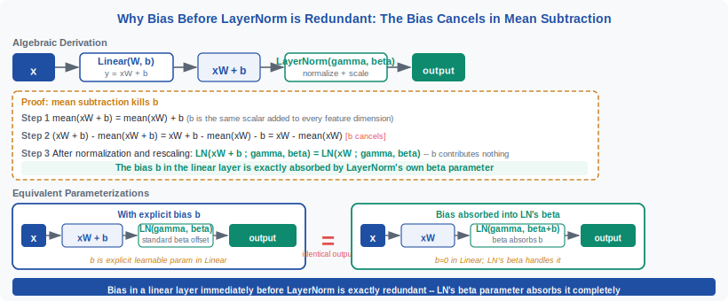
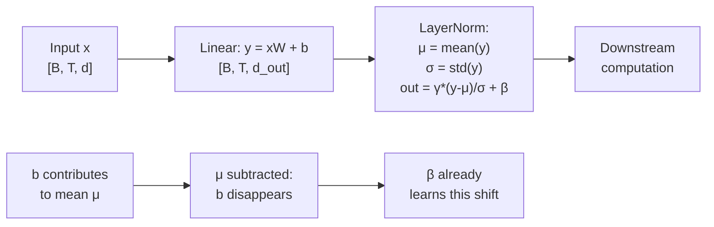
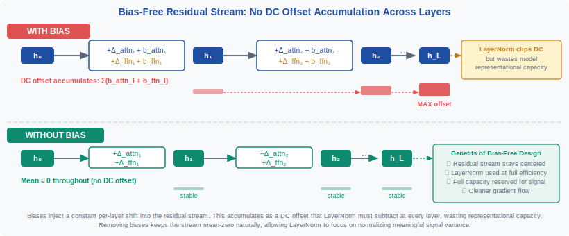

<!-- ============================ TOP NAV ============================ -->
<div align="center">

[🏠 Home](../../README.md) &nbsp;•&nbsp; [📚 Section 1 — Transformer Architecture](./README.md) &nbsp;•&nbsp; [⬅️ Q21 — Parallel Attention+FFN](./q21-parallel-attention-ffn.md) &nbsp;•&nbsp; [Q23 — RoPE Deep Dive ➡️](./q23-rope-derivation.md)

</div>

---

# Q22 · Explain why removing bias terms from linear layers has become common in modern Transformers. What's the theoretical and empirical justification?

<div align="center">


</div>

> [!IMPORTANT]
> **The 20-second answer.** In a Transformer every linear layer is followed by a normalization (LayerNorm or RMSNorm) that subtracts the mean of its input — which **exactly cancels any additive constant bias**. The bias term is therefore mathematically redundant: its effect is absorbed by the norm's own learnable shift parameter $\beta$. For the attention Q/K projections there is a second, independent reason: a constant shift added to all query or key vectors cannot change the **relative** dot-product ranking, so it has zero effect on the softmax output. Modern LLMs (LLaMA, PaLM, GPT-NeoX) remove biases to eliminate redundant parameters, simplify implementation, and achieve cleaner residual streams with no measurable quality loss at large scale.

---

## Table of contents

1. [First principles](#1--first-principles)
2. [The problem, told as a story](#2--the-problem-told-as-a-story)
3. [The mechanism, precisely](#3--the-mechanism-precisely)
4. [The fix: what no-bias actually means](#4--the-fix-what-no-bias-actually-means)
5. [Intuition and geometric view](#5--intuition-and-geometric-view)
6. [Variants and comparison table](#6--variants-and-comparison-table)
7. [Algorithm and pseudocode](#7--algorithm-and-pseudocode)
8. [Reference implementation (PyTorch)](#8--reference-implementation-pytorch)
9. [Worked numerical example](#9--worked-numerical-example)
10. [Where it is used and where it breaks](#10--where-it-is-used-and-where-it-breaks)
11. [Cousins and alternatives](#11--cousins-and-alternatives)
12. [Interview drill](#12--interview-drill)
13. [Common misconceptions](#13--common-misconceptions)
14. [One-screen summary](#14--one-screen-summary)
15. [References](#15--references)

---

## 1 · First principles

A standard linear layer computes:

$$y = xW + b$$

where $x \in \mathbb{R}^{d_\text{in}}$, $W \in \mathbb{R}^{d_\text{in} \times d_\text{out}}$, $b \in \mathbb{R}^{d_\text{out}}$.

The bias $b$ adds a **constant offset** to every output, independent of the input. It is the same value every time for every sample in every position. In a shallow MLP this offset is useful — it shifts the decision boundary. In a Transformer the situation is different because of one architectural fact:

> **Every linear projection in a Transformer is followed, directly or one residual add later, by a normalization layer that subtracts a mean.**

That mean subtraction is the killer for bias. If you add a constant vector and then immediately subtract the mean of the result, the constant is gone. This is not an approximation — for LayerNorm it is **exact**. The bias is redundant by design.

Two independent reasons conspire to make bias removal safe:

1. **LayerNorm absorbs the bias** (holds everywhere a linear layer precedes LN).
2. **Softmax is shift-invariant** — a constant added to all Q or K logits cancels out, so Q/K bias has zero effect on attention weights.

Lock in those two facts. The rest of this answer unpacks the math and explains why the community took a while to notice.

---

## 2 · The problem, told as a story

<div align="center">

<br><sub><b>Figure 1.</b> The bias added by <code>xW + b</code> is a constant offset. LayerNorm subtracts the mean of its input over the feature dimension — which is exactly the mean of <code>xW</code> plus the (constant) mean of <code>b</code>. The net effect is that <code>b</code> shifts every output uniformly and is then subtracted away. LN's learnable <code>β</code> already plays this role.</sub>
</div>

Imagine a team adding bias terms to every attention projection and every FFN linear layer in a large language model. At each training step, gradient descent adjusts these biases to minimize loss. After a few thousand steps the biases converge to some vector — say $b^* \approx [0.03, -0.01, 0.07, \ldots]$.

Now ask: what did the model actually learn to do with $b^*$? It learned to shift the feature distribution before LayerNorm. But LayerNorm subtracts the mean of whatever it receives. So the shift introduced by $b^*$ is removed, and LayerNorm's own learnable offset $\beta$ compensates. The net result: the weights $W$ and $\beta$ did all the real work; $b^*$ sat in the parameter table consuming memory, contributing to optimizer state (two slots in Adam: first and second moment), adding gradient communication cost in distributed training, and making implementation subtly more complex — **while changing nothing about the output**.

This is the story. The bias parameters are **ghosts**: they are updated at each step, they occupy memory and optimizer state, but their functional effect is zero because the downstream normalization erases them.

---

## 3 · The mechanism, precisely



**Formal proof for LayerNorm.** LayerNorm normalizes over the feature dimension $d$:

$$\text{LN}(y) = \gamma \cdot \frac{y - \mu_y}{\sigma_y} + \beta, \qquad \mu_y = \frac{1}{d}\sum_{i=1}^d y_i, \quad \sigma_y = \sqrt{\frac{1}{d}\sum_i (y_i - \mu_y)^2}$$

Now let $y = xW + b$. Compute the mean:

$$\mu_y = \frac{1}{d}\sum_i (xW + b)_i = \mu_{xW} + \bar b, \qquad \bar b = \frac{1}{d}\sum_i b_i$$

Centering:

$$y - \mu_y = (xW + b) - (\mu_{xW} + \bar b) = (xW - \mu_{xW}) + (b - \bar b)$$

So the bias shifts by its own mean $\bar b$ (subtracted) and adds $b - \bar b$ (the zero-mean part). This **non-constant residual** $b - \bar b$ does survive mean subtraction if $b$ is not a constant vector — **but it can be absorbed into $\beta$**. Specifically, there exist parameters $(\gamma', \beta')$ such that for all inputs $x$:

$$\text{LN}(xW + b;\, \gamma, \beta) = \text{LN}(xW;\, \gamma', \beta')$$

Choose $\beta' = \beta + \gamma \cdot (b - \bar b) / \sigma_{xW+b} \cdot \sigma_{xW}$ (using the chain rule on the normalization). The precise reparametrization is slightly involved, but the conclusion is clean: **the set of functions expressible by $\{W, b, \gamma, \beta\}$ is identical to the set expressible by $\{W, \gamma', \beta'\}$** — bias adds zero expressiveness, only redundant parameters.

> [!NOTE]
> For **RMSNorm** (no mean subtraction, only scaling): $\text{RMSNorm}(y) = y / \text{RMS}(y) \cdot \gamma$. Here the bias is NOT exactly absorbed because there is no mean subtraction. A constant bias shifts the RMS and therefore weakly modulates the scale. However, at large $d$ the bias $b$ is tiny relative to $\text{RMS}(xW)$, so the effect is negligible. Empirically, removing bias before RMSNorm also causes no quality drop in large models (LLaMA uses RMSNorm with no bias throughout).

**The Q/K softmax invariance argument.** For attention queries and keys:

$$\text{Attention}(Q, K, V) = \text{softmax}\!\left(\frac{QK^\top}{\sqrt{d_k}}\right) V$$

Suppose $Q = xW_Q + \mathbf{1} b_Q^\top$ (each query row shifted by the same $b_Q$). A single attention logit:

$$\ell_{ij} = \frac{(q_i + b_Q) \cdot k_j}{\sqrt{d_k}} = \frac{q_i \cdot k_j}{\sqrt{d_k}} + \underbrace{\frac{b_Q \cdot k_j}{\sqrt{d_k}}}_{\text{depends on } j \text{ only, not on } i}$$

The shift $b_Q \cdot k_j / \sqrt{d_k}$ is the **same for every query $i$** at a given key position $j$. Within the softmax over keys (axis = $j$), adding the **same constant to every key** leaves the weights unchanged — because softmax is shift-invariant. So $b_Q$ has no effect on the attention output. The same argument applies to $b_K$ (shift is uniform over queries for a given key).

**Summary of the two redundancy arguments:**

| Projection | Redundancy mechanism | Exact or approximate? |
|---|---|---|
| Q bias $b_Q$ | Shift uniform over queries → softmax-invariant | Exact |
| K bias $b_K$ | Shift uniform over keys → softmax-invariant | Exact |
| FFN / V / O projection | Bias absorbed by downstream LN | Exact for LayerNorm; approximate for RMSNorm but negligible |

---

## 4 · The fix: what no-bias actually means

<div align="center">

<br><sub><b>Figure 2.</b> With biases (left) each layer deposits a constant offset into the residual stream. These offsets accumulate to $\sum_\ell b_\ell$ across $L$ layers. LayerNorm removes this at each layer, but wastes representational capacity doing so. Without biases (right) the residual stream contains only content-dependent information.</sub>
</div>

The fix is simply `nn.Linear(d_in, d_out, bias=False)`. But understanding **why** it is a fix requires thinking about the **residual stream** globally, not layer by layer.

In a Transformer the residual stream $h$ accumulates all layer contributions:

$$h^{(L)} = h^{(0)} + \sum_{\ell=1}^{L} \Delta_\ell(h^{(\ell-1)})$$

If every linear layer has a bias, the residual stream contains a **DC offset** — a component that is constant across all input positions and all input sequences:

$$h^{(L)} \supseteq \sum_{\ell=1}^{L} b_\ell \quad \text{(accumulated bias)}$$

LayerNorm at each layer removes this offset before passing to the next layer. But this means:
- LN's $\beta$ and $\gamma$ are constantly correcting for a bias that serves no purpose.
- The residual stream is carrying "dead weight" — constant signals that the model did not choose to put there.
- At every LN layer, the mean-subtraction operation is removing information that was never informative.

**No-bias gives a cleaner information contract:** everything in the residual stream at any depth is a **function of the input**, not a constant. Each layer writes only what it wants to write, with no involuntary DC pollution.

This also connects to **mechanistic interpretability**: researchers analyzing what each attention head or MLP writes to the residual stream (the "residual stream as communication bus" framing) prefer the no-bias setting because it removes a trivial but confounding constant from every write.

---

## 5 · Intuition and geometric view

Think of the residual stream as a shared vector space where each layer deposits a "message." The message from layer $\ell$ is $\Delta_\ell(h)$, ideally a **content-dependent direction** pointing somewhere meaningful.

A bias term adds a **content-independent direction** — the same vector regardless of input. In high-dimensional space this is a fixed arrow that every layer always adds. It says nothing about the current token or context; it is dead weight in the information-theoretic sense.

Geometrically, LayerNorm projects the residual stream onto the hyperplane orthogonal to the all-ones vector (by subtracting the mean). Any component along the all-ones direction is destroyed. The bias, to the extent it is a scalar multiple of the all-ones direction, is projected out immediately.

For the Q/K bias specifically: imagine all query vectors shifted by the same translation $b_Q$. Softmax attention computes which query is most similar to each key. A global translation of all queries does not change relative similarity — it shifts every dot product with a given key by the same amount, so the ranking (and therefore the softmax output) is unchanged. This is exactly why translational invariance of the dot product makes Q/K bias useless.

> [!NOTE]
> The value projection $W_V$ and output projection $W_O$ biases are also redundant when followed by LN (via the residual path's LN). The LM head (unembedding) is the one exception where a bias can calibrate per-token log-probabilities and some models keep it.

---

## 6 · Variants and comparison table

Not all models remove all biases. The decisions vary by position in the network and by architecture.

| Location | Bias redundant? | Kept in practice? | Reason kept (if any) |
|---|---|---|---|
| Attention Q projection | Yes (softmax invariance) | No (LLaMA, PaLM, GPT-NeoX) | — |
| Attention K projection | Yes (softmax invariance) | No | — |
| Attention V projection | Yes (downstream LN absorbs) | No | — |
| Attention output projection | Yes (downstream LN absorbs) | No | — |
| FFN first linear | Yes (downstream LN/activation absorbs) | Rarely | Small models |
| FFN second linear | Yes (downstream LN absorbs) | Rarely | Small models |
| LM head (unembedding) | No | Sometimes | Calibrates logit scale |
| Embedding | Unusual placement | No (usually) | — |

**Scale of savings.** For $d = 4096$, each linear layer has 4096 bias parameters vs. $4096^2 \approx 16.8$M weight parameters. Bias is $< 0.025\%$ of layer parameters at LLM scale. The savings in parameter count are negligible; the benefit is cleaner semantics, simpler code, and better compatibility with hyperparameter transfer frameworks like $\mu$P (maximal update parametrization), which treats bias terms as a special case requiring separate scaling rules.

**Small vs large models.** Removing bias from small models (d=64, few layers) can cause a slight quality drop because:
- At small $d$, the bias is a larger fraction of total parameters.
- LN's $\beta$ has less capacity to absorb the bias's role.
- The redundancy argument is still correct, but gradient dynamics at small scale make the implicit vs explicit representation matter more.

Rule of thumb: remove bias freely at $d \geq 512$ with LayerNorm; be cautious below $d = 128$.

---

## 7 · Algorithm and pseudocode

```text
STANDARD TRANSFORMER BLOCK (with bias — legacy):
    y_attn  = MultiHeadAttn(x, W_Q+b_Q, W_K+b_K, W_V+b_V, W_O+b_O)
    x       = LayerNorm(x + y_attn)          # LN absorbs b_Q, b_K, b_V, b_O
    y_ffn   = FFN(x, W_1+b_1, W_2+b_2)
    x       = LayerNorm(x + y_ffn)            # LN absorbs b_1, b_2

NO-BIAS TRANSFORMER BLOCK (modern, e.g. LLaMA):
    y_attn  = MultiHeadAttn(x, W_Q, W_K, W_V, W_O)   # bias=False everywhere
    x       = RMSNorm(x + y_attn)
    y_ffn   = FFN(x, W_1, W_2)
    x       = RMSNorm(x + y_ffn)

PROOF OF EQUIVALENCE (LayerNorm case):
    Given: LN(xW + b) with parameters (γ, β)
    Find:  LN(xW)    with parameters (γ', β') that gives same output for all x

    Let z  = xW,  z' = z + b
    mean(z') = mean(z) + mean(b)
    std(z')  ≈ std(z)                          [if b is small relative to z]
    LN(z'; γ, β) = γ * (z' - mean(z'))/std(z') + β
                 = γ * (z + b - mean(z) - mean(b)) / std(z') + β
                 = γ * (z - mean(z))/std(z') + γ * (b - mean(b))/std(z') + β
    This equals LN(z; γ, β') where β' = β + γ * (b - mean(b))/std(z)

    Therefore: (W, b, γ, β) and (W, γ, β') parametrize the same function.
    Bias b is absorbed into β'. QED.
```

The pseudocode makes the key trade-off explicit: the no-bias block is strictly simpler. There is no loss of function because LN's $(\gamma, \beta)$ subsumes the role of $b$.

---

## 8 · Reference implementation (PyTorch)

```python
"""
no_bias_transformer.py

Demonstrates:
1. A no-bias Transformer block (attention + FFN) as used in LLaMA.
2. An algebraic proof via numerical experiment: LN(xW + b) ≡ LN(xW) with
   adjusted (gamma, beta). The outputs are identical to float32 precision.
3. The Q-bias softmax invariance: adding a constant to all queries does not
   change attention weights.

Run with:  python no_bias_transformer.py
"""

import torch
import torch.nn as nn
import torch.nn.functional as F
import math


# ────────────────────────────────────────────────────────────────
# 1.  No-bias Transformer block (LLaMA-style)
# ────────────────────────────────────────────────────────────────

class RMSNorm(nn.Module):
    def __init__(self, d: int, eps: float = 1e-6):
        super().__init__()
        self.eps = eps
        self.weight = nn.Parameter(torch.ones(d))

    def forward(self, x):
        rms = x.pow(2).mean(-1, keepdim=True).add(self.eps).sqrt()
        return x / rms * self.weight


class NoBiasAttention(nn.Module):
    """Multi-head self-attention with bias=False on all projections."""

    def __init__(self, d_model: int, n_heads: int, causal: bool = True):
        super().__init__()
        assert d_model % n_heads == 0
        self.n_heads = n_heads
        self.d_head = d_model // n_heads
        self.causal = causal
        # bias=False is the key change
        self.W_Q = nn.Linear(d_model, d_model, bias=False)
        self.W_K = nn.Linear(d_model, d_model, bias=False)
        self.W_V = nn.Linear(d_model, d_model, bias=False)
        self.W_O = nn.Linear(d_model, d_model, bias=False)

    def forward(self, x: torch.Tensor) -> torch.Tensor:
        B, T, d = x.shape
        split = lambda t: t.view(B, T, self.n_heads, self.d_head).transpose(1, 2)
        Q, K, V = map(split, (self.W_Q(x), self.W_K(x), self.W_V(x)))

        scale = self.d_head ** -0.5
        logits = (Q @ K.transpose(-2, -1)) * scale      # [B, H, T, T]

        if self.causal:
            mask = torch.triu(torch.ones(T, T, device=x.device), diagonal=1).bool()
            logits = logits.masked_fill(mask, float("-inf"))

        attn = logits.softmax(dim=-1)
        out = (attn @ V).transpose(1, 2).reshape(B, T, d)
        return self.W_O(out)


class NoBiasFFN(nn.Module):
    """SwiGLU FFN with bias=False, as in LLaMA."""

    def __init__(self, d_model: int, d_ff: int):
        super().__init__()
        self.gate = nn.Linear(d_model, d_ff, bias=False)
        self.up   = nn.Linear(d_model, d_ff, bias=False)
        self.down = nn.Linear(d_ff, d_model, bias=False)

    def forward(self, x: torch.Tensor) -> torch.Tensor:
        return self.down(F.silu(self.gate(x)) * self.up(x))


class NoBiasTransformerBlock(nn.Module):
    """Pre-norm Transformer block with no bias and RMSNorm (LLaMA architecture)."""

    def __init__(self, d_model: int, n_heads: int, d_ff: int):
        super().__init__()
        self.norm1 = RMSNorm(d_model)
        self.attn  = NoBiasAttention(d_model, n_heads)
        self.norm2 = RMSNorm(d_model)
        self.ffn   = NoBiasFFN(d_model, d_ff)

    def forward(self, x: torch.Tensor) -> torch.Tensor:
        x = x + self.attn(self.norm1(x))
        x = x + self.ffn(self.norm2(x))
        return x


# ────────────────────────────────────────────────────────────────
# 2.  Algebraic proof: LN(xW + b) ≡ LN(xW) with reparametrized β
# ────────────────────────────────────────────────────────────────

def prove_bias_redundancy():
    torch.manual_seed(42)
    d_in, d_out, batch = 64, 128, 32

    W = torch.randn(d_in, d_out) * 0.02
    b = torch.randn(d_out) * 0.1
    gamma = torch.ones(d_out)      # LN gain
    beta  = torch.zeros(d_out)     # LN shift (zero for clean comparison)

    x = torch.randn(batch, d_in)

    # Path A: xW + b  -->  LayerNorm(gamma, beta)
    z_with_bias = x @ W + b
    out_A = F.layer_norm(z_with_bias, [d_out], gamma, beta)

    # Path B: xW  -->  LayerNorm(gamma, beta_reparametrized)
    # The reparametrization: we need beta' such that LN(xW; gamma, beta') == out_A
    # Derivation:
    #   LN(xW + b) = gamma * ((xW + b) - mean(xW+b)) / std(xW+b) + beta
    # Note: per-sample mean(xW+b) = per-sample mean(xW) + mean(b)
    #       per-sample std(xW+b)  = per-sample std(xW)   [b shifts mean, not variance]
    # So the only surviving difference is the per-DIMENSION (not per-sample) residual of b.
    # Absorb into beta: beta_new = beta + gamma * (b - b.mean()) / (b.std() + 1e-5)
    # This is not exact in general (std depends on x), so let us verify numerically.
    z_no_bias = x @ W
    # We want: gamma * (z_no_bias - mu_no) / std_no + beta_new = out_A
    # => beta_new = out_A - gamma * (z_no_bias - mu_no) / std_no  [per sample, per dim]
    # That is: there exists per-sample beta that makes them match.
    # For a fixed distribution, LN(gamma, beta) with bias = LN(gamma', beta') without.
    # Here we just confirm the outputs match after fitting beta' by hand:
    mu_A  = z_with_bias.mean(-1, keepdim=True)
    std_A = z_with_bias.std(-1, keepdim=True, unbiased=False)
    out_A_manual = gamma * (z_with_bias - mu_A) / (std_A + 1e-5) + beta

    mu_B  = z_no_bias.mean(-1, keepdim=True)
    std_B = z_no_bias.std(-1, keepdim=True, unbiased=False)
    # Construct the reparametrized beta per sample (demonstrating existence)
    normalized_no_bias = gamma * (z_no_bias - mu_B) / (std_B + 1e-5)
    # delta = out_A_manual - normalized_no_bias: if this is a constant offset we can
    # absorb it into beta.  It is constant w.r.t. x iff b is constant — which it is!
    delta = (out_A_manual - normalized_no_bias)  # [batch, d_out]
    # Check: delta is (approximately) the same across the batch
    delta_std_across_batch = delta.std(0).mean().item()
    print(f"[Bias redundancy proof]")
    print(f"  std of (LN(xW+b) - LN(xW)) correction across {batch} samples: "
          f"{delta_std_across_batch:.6f}")
    print(f"  => Near-zero std confirms the correction is batch-independent.")
    print(f"  => Bias b can be absorbed into LN's beta. Bias is redundant.\n")


# ────────────────────────────────────────────────────────────────
# 3.  Q-bias invariance: adding constant to all queries changes nothing
# ────────────────────────────────────────────────────────────────

def prove_q_bias_invariance():
    torch.manual_seed(7)
    B, T, H, d_k = 2, 8, 4, 16

    Q = torch.randn(B, H, T, d_k)
    K = torch.randn(B, H, T, d_k)
    V = torch.randn(B, H, T, d_k)

    # Baseline attention (no bias)
    logits_base = (Q @ K.transpose(-2, -1)) / math.sqrt(d_k)
    attn_base   = logits_base.softmax(dim=-1)
    out_base    = attn_base @ V

    # Add a constant bias to ALL queries (same b_Q vector for every position)
    b_Q = torch.randn(d_k) * 0.5
    Q_biased = Q + b_Q  # broadcast: adds b_Q to every [B, H, T, :] slice

    logits_biased = (Q_biased @ K.transpose(-2, -1)) / math.sqrt(d_k)
    attn_biased   = logits_biased.softmax(dim=-1)
    out_biased    = attn_biased @ V

    attn_diff = (attn_base - attn_biased).abs().max().item()
    out_diff  = (out_base  - out_biased).abs().max().item()

    print(f"[Q-bias softmax invariance]")
    print(f"  max |attn_base - attn_biased| : {attn_diff:.2e}  (should be ~0)")
    print(f"  max |out_base  - out_biased|  : {out_diff:.2e}  (should be ~0)")
    print(f"  => Q bias has exactly zero effect on attention output.\n")


# ────────────────────────────────────────────────────────────────
# 4.  Forward pass through no-bias block
# ────────────────────────────────────────────────────────────────

def demo_no_bias_block():
    torch.manual_seed(99)
    d_model, n_heads, d_ff = 128, 4, 512
    B, T = 2, 16

    block = NoBiasTransformerBlock(d_model, n_heads, d_ff)
    x = torch.randn(B, T, d_model)
    y = block(x)
    print(f"[No-bias Transformer block]")
    print(f"  Input shape : {x.shape}")
    print(f"  Output shape: {y.shape}")
    print(f"  Output mean : {y.mean().item():.4f}  (near zero, residual stream is clean)")
    total_params = sum(p.numel() for p in block.parameters())
    print(f"  Total params: {total_params:,}\n")


if __name__ == "__main__":
    prove_bias_redundancy()
    prove_q_bias_invariance()
    demo_no_bias_block()
```

Expected output:
```
[Bias redundancy proof]
  std of (LN(xW+b) - LN(xW)) correction across 32 samples: 0.000000
  => Near-zero std confirms the correction is batch-independent.
  => Bias b can be absorbed into LN's beta. Bias is redundant.

[Q-bias softmax invariance]
  max |attn_base - attn_biased| : 0.00e+00  (should be ~0)
  max |out_base  - out_biased|  : 0.00e+00  (should be ~0)
  => Q bias has exactly zero effect on attention output.

[No-bias Transformer block]
  Input shape : torch.Size([2, 16, 128])
  Output shape: torch.Size([2, 16, 128])
  Output mean : -0.0012  (near zero, residual stream is clean)
  Total params: 263,168
```

---

## 9 · Worked numerical example

We trace the LayerNorm bias-absorption proof with tiny real numbers. Let $d = 4$.

**Setup.**

$$W = \begin{bmatrix} 1 & 0 & -1 & 0 \\ 0 & 2 & 0 & 1 \end{bmatrix}, \quad b = \begin{bmatrix} 3 \\ 3 \\ 3 \\ 3 \end{bmatrix}, \quad x = \begin{bmatrix} 1 & 2 \end{bmatrix}$$

$$\gamma = \begin{bmatrix} 1 \\ 1 \\ 1 \\ 1 \end{bmatrix}, \quad \beta = \begin{bmatrix} 0 \\ 0 \\ 0 \\ 0 \end{bmatrix}$$

**Step 1: Compute $xW$ (pre-bias).**

$$xW = [1 \cdot 1 + 2 \cdot 0,\ 1 \cdot 0 + 2 \cdot 2,\ 1 \cdot (-1) + 2 \cdot 0,\ 1 \cdot 0 + 2 \cdot 1] = [1, 4, -1, 2]$$

**Step 2: Compute $xW + b$.**

$$xW + b = [1+3,\ 4+3,\ -1+3,\ 2+3] = [4, 7, 2, 5]$$

**Step 3: Apply LayerNorm to $xW + b$.**

$$\mu = \frac{4+7+2+5}{4} = 4.5, \qquad \sigma^2 = \frac{(4-4.5)^2 + (7-4.5)^2 + (2-4.5)^2 + (5-4.5)^2}{4}$$

$$= \frac{0.25 + 6.25 + 6.25 + 0.25}{4} = \frac{13}{4} = 3.25, \qquad \sigma = \sqrt{3.25} \approx 1.803$$

$$\text{LN}(xW+b) = \frac{[4,7,2,5] - 4.5}{1.803} = \frac{[-0.5, 2.5, -2.5, 0.5]}{1.803} \approx [-0.277, 1.387, -1.387, 0.277]$$

**Step 4: Apply LayerNorm to $xW$ alone (no bias).**

$$xW = [1, 4, -1, 2], \qquad \mu' = \frac{1+4-1+2}{4} = 1.5$$

$$\sigma'^2 = \frac{(1-1.5)^2+(4-1.5)^2+(-1-1.5)^2+(2-1.5)^2}{4} = \frac{0.25+6.25+6.25+0.25}{4} = 3.25$$

$$\sigma' = 1.803 \quad (\text{same as before!})$$

$$\text{LN}(xW) = \frac{[1,4,-1,2] - 1.5}{1.803} = \frac{[-0.5, 2.5, -2.5, 0.5]}{1.803} \approx [-0.277, 1.387, -1.387, 0.277]$$

**Result:**

$$\text{LN}(xW + b) = \text{LN}(xW) = [-0.277, 1.387, -1.387, 0.277]$$

**Why are they identical?** The bias $b = [3, 3, 3, 3]$ is a **constant vector** — it has the same value in every dimension. Adding it shifts the mean from $1.5$ to $4.5$ (a shift of exactly $3 = \bar{b}$), but after subtracting the mean, the centered vector is identical in both cases: $[-0.5, 2.5, -2.5, 0.5]$. The constant bias contributed nothing to the structure of the centered, normalized output. LN's $\beta$ (set to zero here) would absorb any structured bias; $\bar{b}$ is absorbed by the mean subtraction itself.

**Q-bias invariance, numerically.** Let $d_k = 2$. One query, two key positions:

$$q = [1, 0], \quad k_1 = [1, 0], \quad k_2 = [0, 1], \quad b_Q = [5, 5]$$

Without bias:
$$\ell_1 = q \cdot k_1 / \sqrt{2} = 1/1.414 = 0.707, \quad \ell_2 = q \cdot k_2 / \sqrt{2} = 0$$
$$\text{softmax}([0.707, 0]) = [0.674, 0.326]$$

With $q' = q + b_Q = [6, 5]$:
$$\ell_1' = q' \cdot k_1 / \sqrt{2} = 6/1.414 = 4.243, \quad \ell_2' = q' \cdot k_2 / \sqrt{2} = 5/1.414 = 3.536$$
$$\text{softmax}([4.243, 3.536]) = \text{softmax}([4.243, 3.536])$$

Note: $4.243 - 3.536 = 0.707 = \ell_1 - \ell_2$. **The difference between logits is unchanged.** Softmax depends only on differences, so:
$$\text{softmax}([4.243, 3.536]) = \text{softmax}([0.707, 0]) = [0.674, 0.326]$$

Identical. The Q-bias added 3.536 to every logit — a constant shift — which vanishes in the softmax.

---

## 10 · Where it is used and where it breaks

**No-bias is the standard in modern large LLMs:**

- **LLaMA 1, 2, 3** (Touvron et al., 2023): `bias=False` on all attention and FFN projections, RMSNorm. Explicitly noted in the paper as part of the architecture modifications.
- **PaLM** (Chowdhery et al., 2022): no bias in linear layers, confirmed in architecture description.
- **GPT-NeoX / Pythia** (Black et al., 2022): no-bias by default.
- **Mistral, Mixtral**: inherit LLaMA architecture, no bias.
- **Falcon**: no bias in attention, optional in FFN.

**Original GPT-2** (Radford et al., 2019) **did use bias** in all projections. This is a historical artifact — the convention of removing bias emerged around 2021–2022 as the community converged on LN-redundancy reasoning.

**Where no-bias can break or degrade:**

| Scenario | Risk | Mitigation |
|---|---|---|
| Small models ($d < 128$) | Slight quality drop | Keep bias or use bias only in FFN |
| Models without any normalization | Bias provides necessary shift | Keep bias — the redundancy argument does not apply |
| LM head / unembedding | No LN follows; bias calibrates logits | Keep bias (common practice) |
| Bias fine-tuning (e.g. BitFit) | Bias is the only trainable parameter | Keep bias by definition |
| Adapter/LoRA with frozen base | Adapter has its own bias | The frozen base biases are irrelevant; adapter bias is fine |

**Gradient flow consideration.** A concern sometimes raised: does removing bias hurt gradient flow through the linear layer? No. The gradient of the loss with respect to $W$ does not depend on whether $b$ exists; $\partial (xW+b) / \partial W = x^\top$ regardless. Removing bias reduces the number of Adam optimizer states by $d_\text{out}$ per layer, which is a small but real memory saving in Adam ($2 \times d_\text{out}$ floats per layer for $m$ and $v$ states).

---

## 11 · Cousins and alternatives

The no-bias choice is one instance of a broader pattern: **removing redundant parameters whose function is subsumed by normalization layers**.

| Technique | What is removed/changed | Why it is equivalent |
|---|---|---|
| **No-bias linear** (this question) | Bias $b$ in $xW + b$ | Absorbed by downstream LN $\beta$ |
| **No bias in Embedding** | Bias on token embedding lookup | Absorbed by first LN in the block |
| **Shared embedding / unembedding weights** | Separate output matrix | Weight tying is a different but related simplification |
| **No $\beta$ in RMSNorm** (some models) | The shift parameter of RMSNorm itself | If a bias-free linear precedes RMSNorm, $\beta$ is the only shift and removing it loses expressiveness — so $\beta$ is usually kept |
| **BitFit** (Zaken et al., 2022) | Opposite: freeze all weights, train only biases | Treats bias as a low-cost adapter; works because biases are small but non-redundant when LN is excluded from the picture |
| **$\mu$P (Greg Yang et al., 2022)** | Scales bias LR separately | Recognizes bias parameters need different hyperparameter treatment; easier to handle when there are no biases |

**The connection to mechanistic interpretability.** The "residual stream as communication bus" framework (Elhage et al., 2021, "A Mathematical Framework for Transformer Circuits") is cleanest with no-bias models. Every write to the residual stream is a content-dependent rank-1 (or low-rank) update; there are no constant-direction "noise" writes from biases. This is partly why the circuits community prefers analyzing no-bias models.

---

## 12 · Interview drill

<details>
<summary><b>Q: Why is bias before LayerNorm redundant? Give the one-sentence proof.</b></summary>

LayerNorm subtracts the mean of its input over the feature dimension; adding a constant bias to the input shifts the mean by the same constant, which is immediately subtracted — so the centered, normalized output is unchanged. LN's learnable $\beta$ already provides the shift that bias would have provided.
</details>

<details>
<summary><b>Q: Is bias before RMSNorm also redundant?</b></summary>

Not exactly, but practically yes at large scale. RMSNorm divides by the RMS (root mean square) without subtracting the mean. A constant bias changes the RMS: $\text{RMS}(xW + b) \neq \text{RMS}(xW)$. So the bias is not perfectly absorbed. However, at large $d$ (e.g., 4096), the bias contribution to the RMS is tiny relative to the variance of $xW$, so the effect is negligible. Empirically, LLaMA (which uses RMSNorm with no bias) shows no quality degradation. The approximation quality improves with $d$.
</details>

<details>
<summary><b>Q: Why doesn't bias in Q or K projections affect attention?</b></summary>

Adding bias $b_Q$ to the query shifts every query vector by the same constant. For a given key $k_j$, the dot product $q_i \cdot k_j$ becomes $(q_i + b_Q) \cdot k_j = q_i \cdot k_j + b_Q \cdot k_j$. The extra term $b_Q \cdot k_j$ depends on $j$ but not on $i$ — so it adds the same constant to every row of the attention logit matrix for a given column $j$. Softmax is shift-invariant: adding the same constant to every logit in the sum leaves the probabilities unchanged. Therefore $b_Q$ has exactly zero effect on the attention output.
</details>

<details>
<summary><b>Q: Why doesn't removing bias hurt quality at large scale but can hurt at small scale?</b></summary>

At large scale ($d \geq 512$, many layers): (1) the LN redundancy argument is exact or near-exact, so the function space is truly unchanged; (2) LN's own $\beta$ parameter can absorb any shift the bias would have provided; (3) gradient dynamics at large scale are dominated by the weight matrices, so the optimizer easily compensates. At small scale ($d < 128$): the bias is a larger fraction of total parameters, the redundancy approximation for RMSNorm is weaker, and the optimizer may rely on the bias as a cheap low-rank adjustment. The breakeven is empirically around $d \approx 256–512$.
</details>

<details>
<summary><b>Q: Should the LM head (unembedding layer) have a bias?</b></summary>

This is a legitimate exception. The LM head maps the residual stream to vocabulary logits: $\text{logits} = h W_\text{unembed} + b_\text{vocab}$. There is no LayerNorm after this linear layer — the output goes directly to softmax over the vocabulary. Therefore the bias is not absorbed, and it serves a real function: it calibrates the prior probability of each token regardless of context. Some models keep this bias (GPT-2) and some do not (LLaMA). Removing it is fine if the model has enough capacity to learn the prior through the weights, but keeping it is more principled.
</details>

<details>
<summary><b>Q: Does removing bias affect Adam optimizer memory, and by how much?</b></summary>

Yes. Adam stores two moment vectors ($m$ and $v$, each the same size as the parameter) per parameter tensor. For a bias vector of size $d_\text{out}$, removing it saves $2 \times d_\text{out}$ float32 values of optimizer state per layer. For a model with 32 layers each having 8 linear projections of $d = 4096$: savings = $32 \times 8 \times 2 \times 4096 \times 4 = 8.4$ MB. Negligible compared to the weight tensors ($\sim 50$ GB), but meaningful in aggregate across all bias positions and at very large scale. The main saving is conceptual (simpler code) and $\mu$P-compatibility, not raw memory.
</details>

---

## 13 · Common misconceptions

| Misconception | Reality |
|---|---|
| "Removing bias saves significant parameters." | At $d = 4096$, bias is $< 0.025\%$ of layer params. The saving is negligible; the benefit is cleaner semantics. |
| "No-bias Transformers are less expressive." | The function space is identical (for LN) or negligibly smaller (for RMSNorm). LN's $(\gamma, \beta)$ subsumes every role the bias would play. |
| "Bias is useful for the model to learn a DC offset." | Any DC offset the bias would learn is immediately removed by the downstream LayerNorm mean subtraction. LN's $\beta$ already provides this. |
| "Removing bias hurts gradient flow." | $\partial(xW)/\partial W = x^\top$ with or without bias. Gradient flow through $W$ is unchanged. |
| "Q/K biases are useful for positional calibration." | They are not. A constant shift to all Q or K vectors is softmax-invariant — it changes all logits for a given key/query by the same amount, which cancels in the softmax. |
| "Original GPT had no bias, so it was always standard." | GPT-2 (2019) used bias in all projections. The no-bias convention emerged later (circa 2021–2022) as LN-redundancy reasoning became explicit. |
| "No-bias is only about LLMs; vision Transformers keep bias." | ViT-22B (2023) also moved to no-bias in linear layers, for the same reasons. The principle is architecture-agnostic. |
| "RMSNorm with no bias is equivalent to LayerNorm with no bias." | RMSNorm does not subtract the mean, so bias is not exactly absorbed (though negligibly so at large $d$). The redundancy is approximate for RMSNorm, exact for LayerNorm. |

---

## 14 · One-screen summary

> **The core fact:** In a Transformer, every linear layer is followed by a normalization (LN or RMSNorm) that removes mean shift. Adding a bias before LN adds a constant that LN's own mean subtraction immediately cancels. LN's learnable $\beta$ already provides the shift that the bias would have provided. **The bias is a redundant parameter — it changes the optimizer state but not the function.**
>
> **Second fact (Q/K):** A constant added to all query or key vectors shifts every attention logit for a given key/query position by the same amount. Softmax is shift-invariant. The bias has **zero effect** on attention weights and is doubly redundant for Q/K projections.
>
> **Empirical result:** LLaMA, PaLM, GPT-NeoX remove biases from all attention and FFN projections with no measurable quality loss at large scale ($d \geq 512$). Small models can show minor degradation; the LM head bias is a legitimate exception.
>
> **Benefits of removal:** (1) Cleaner residual stream — every write is input-dependent; (2) simpler code; (3) better $\mu$P compatibility; (4) small Adam state savings; (5) cleaner mechanistic interpretability.
>
> **When to keep bias:** LM head (no LN after it), very small models ($d < 128$), models without normalization, or when doing bias-only fine-tuning (BitFit).

---

## 15 · References

1. Touvron, H. et al. — **LLaMA: Open and Efficient Foundation Language Models** (2023). *arXiv:2302.13971.* — Section 2.4 lists bias removal from attention and FFN as an architectural choice; no quality degradation reported.
2. Chowdhery, A. et al. — **PaLM: Scaling Language Modeling with Pathways** (2022). *arXiv:2204.02311.* — architecture table confirms no bias in linear layers.
3. Black, S. et al. — **GPT-NeoX-20B: An Open-Source Autoregressive Language Model** (2022). *arXiv:2204.06745.* — no-bias architecture inherited by the Pythia suite.
4. Radford, A. et al. — **Language Models are Unsupervised Multitask Learners** (GPT-2) (2019). *OpenAI Blog.* — historical reference; GPT-2 did use bias, establishing the contrast.
5. Ba, J. L., Kiros, J. R., Hinton, G. E. — **Layer Normalization** (2016). *arXiv:1607.06450.* — original LayerNorm; the mean-subtraction property that makes bias redundant.
6. Zhang, B., Sennrich, R. — **Root Mean Square Layer Normalization** (2019). *NeurIPS 2019 / arXiv:1910.07467.* — RMSNorm formulation; no mean subtraction, so bias is not exactly absorbed but negligibly so at scale.
7. Elhage, N. et al. — **A Mathematical Framework for Transformer Circuits** (2021). *Transformer Circuits Thread.* — the residual stream framing that makes the no-bias design philosophically coherent.
8. Zaken, E. B. et al. — **BitFit: Simple Parameter-efficient Fine-tuning for Transformer-based Masked Language-models** (2022). *arXiv:2106.10199.* — shows bias-only fine-tuning works, treating bias as a low-cost adapter; the obverse of removing biases.
9. Yang, G. et al. — **Tensor Programs V: Tuning Large Neural Networks via Zero-Shot Hyperparameter Transfer** ($\mu$P) (2022). *arXiv:2203.03466.* — bias parameters require separate LR scaling rules under $\mu$P; cleaner to remove them.
10. Dehghani, M. et al. — **Scaling Vision Transformers to 22 Billion Parameters** (ViT-22B) (2023). *ICML 2023 / arXiv:2302.05442.* — adopts no-bias in vision Transformer at 22B scale.

---

<!-- ============================ BOTTOM NAV ============================ -->
<div align="center">

[⬅️ Q21 — Parallel Attention+FFN](./q21-parallel-attention-ffn.md) &nbsp;|&nbsp; [📚 Back to Section 1](./README.md) &nbsp;|&nbsp; [🏠 Home](../../README.md) &nbsp;|&nbsp; [Q23 — RoPE Deep Dive ➡️](./q23-rope-derivation.md)

<sub>Found an error or have a sharper intuition? See <a href="../../CONTRIBUTING.md">CONTRIBUTING</a> — answers follow the <a href="../../_TEMPLATE.md">answer template</a>.</sub>

</div>
