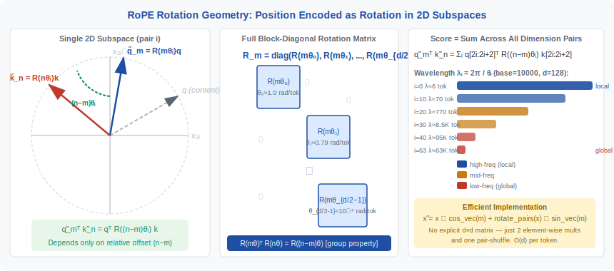
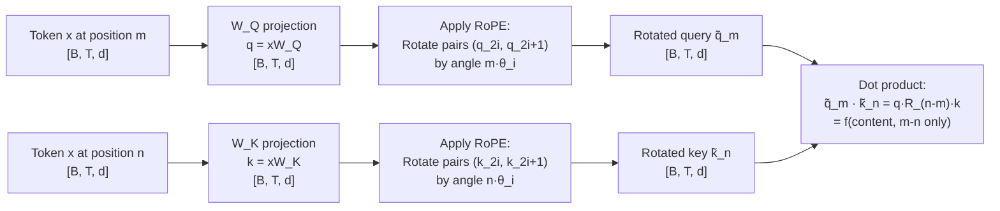

<!-- ============================ TOP NAV ============================ -->
<div align="center">

[🏠 Home](../../README.md) &nbsp;•&nbsp; [📚 Section 1 — Transformer Architecture](./README.md) &nbsp;•&nbsp; [⬅️ Q22 — No-Bias Transformers](./q22-no-bias.md) &nbsp;•&nbsp; [Q24 — FlashAttention ➡️](./q24-flash-attention.md)

</div>

---

# Q23 · Derive RoPE from first principles; long-context scaling (NTK, YaRN, LongRoPE)

<div align="center">


</div>

> [!IMPORTANT]
> **The 20-second answer.** RoPE (Rotary Position Embedding) encodes position $m$ by **rotating** pairs of query/key dimensions by angle $m \cdot \theta_i$, where $\theta_i = \text{base}^{-2i/d}$. The key insight: applying rotation $R(m\theta)$ to query and $R(n\theta)$ to key makes their dot product depend **only on the relative offset** $(m - n)$ — not on absolute positions. This satisfies the fundamental requirement for position-aware attention. Beyond the training length, these rotations become **out-of-distribution**. Long-context scaling methods fix this: **NTK-aware scaling** rescales the base so all frequencies interpolate smoothly; **YaRN** splits dimensions into low/mid/high frequency bands and treats each differently; **LongRoPE** uses evolutionary search for non-uniform per-dimension scaling factors. Together these techniques let Llama-2, Mistral, and Phi extend context 4–32× beyond training length.

---

## Table of contents

1. [First principles](#1--first-principles)
2. [The problem, told as a story](#2--the-problem-told-as-a-story)
3. [The mechanism, precisely](#3--the-mechanism-precisely)
4. [The fix: the RoPE formula](#4--the-fix-the-rope-formula)
5. [Intuition and geometric view](#5--intuition-and-geometric-view)
6. [Variants and comparison table](#6--variants-and-comparison-table)
7. [Algorithm and pseudocode](#7--algorithm-and-pseudocode)
8. [Reference implementation (PyTorch)](#8--reference-implementation-pytorch)
9. [Worked numerical example](#9--worked-numerical-example)
10. [Where it is used and where it breaks](#10--where-it-is-used-and-where-it-breaks)
11. [Cousins and alternatives](#11--cousins-and-alternatives)
12. [Interview drill](#12--interview-drill)
13. [Common misconceptions](#13--common-misconceptions)
14. [One-screen summary](#14--one-screen-summary)
15. [References](#15--references)

---

## 1 · First principles

The fundamental requirement for a position encoding in attention is:

> **The attention score between token at position $m$ and token at position $n$ should depend on their relative offset $(m - n)$, not on the absolute values of $m$ and $n$.**

This is linguistically motivated: the syntactic relationship between "cat" and "sat" should be the same whether they appear at positions (1, 2) or (101, 102).

For standard dot-product attention, the score is:

$$s(m, n) = q_m^\top k_n$$

We want this to equal some function $f(m - n)$ for all $m, n$. The challenge is that $q_m$ and $k_n$ are computed from the token embeddings by linear projections — they carry **token content** but no position information unless we add it.

Two classical approaches both fall short:

1. **Absolute PE (Vaswani et al.)**: Add sinusoidal position vectors to embeddings before projection. The resulting dot product is $f(m, n)$, not $f(m-n)$ — it mixes content and position in a non-factorable way.

2. **Learned absolute PE**: Same problem. No guarantee of relative-position factorization.

RoPE solves this by **operating on the query and key vectors after projection**, encoding position as a rotation. The rotation group has exactly the algebraic structure needed: rotating both $q$ and $k$ and taking the dot product gives a result that depends only on the difference of rotation angles.

Lock in the two key facts:

1. **Rotation preserves dot-product structure:** $(\mathbf{R}_m q)^\top (\mathbf{R}_n k) = q^\top \mathbf{R}_m^\top \mathbf{R}_n k = q^\top \mathbf{R}_{n-m} k$ — depends only on $n - m$.
2. **Frequency stratification:** Different dimension pairs rotate at different rates $\theta_i$, giving the model access to multiple timescales of relative position.

---

## 2 · The problem, told as a story

<div align="center">

<br><sub><b>Figure 1.</b> RoPE geometry in a single 2D subspace. Query at position $m$ is rotated by $m\theta_i$; key at position $n$ is rotated by $n\theta_i$. Their dot product equals $|q||k|\cos((m-n)\theta_i + \phi)$ for some phase $\phi$ depending on content — the position contribution factors out as the relative offset $(m-n)$.</sub>
</div>

Imagine building a Transformer that must process a sentence with the same attention pattern regardless of where in the document that sentence appears. Token "the" at position 5 relates to "cat" at position 6 the same way as "the" at position 305 relates to "cat" at position 306. The relative offset is 1 in both cases, so the attention score should be similar.

With absolute sinusoidal PE (original Transformer), the model sees raw positions 5, 6 or 305, 306. It must learn that the difference matters, not the absolute value. But the dot product $q_m^\top k_n$ after adding sinusoidal PE at embedding time is:

$$q_m^\top k_n = (x_m + p_m)^\top W_Q^\top W_K (x_n + p_n)$$

This expands into **four cross-terms**, mixing content $x$ and position $p$ in a non-symmetric way. There is no guarantee the model extracts the relative offset $m - n$; it must implicitly learn this from data, which requires generalization beyond the training length range.

RoPE takes a different approach: **post-hoc rotation**. After computing $q = xW_Q$ and $k = xW_K$ (pure content, no position), apply a position-dependent rotation to each. The rotation is designed so that the dot product factors cleanly:

$$\tilde{q}_m^\top \tilde{k}_n = (R_m q)^\top (R_n k) = q^\top R_m^\top R_n k = q^\top R_{n-m} k$$

This is the mathematical magic: the **transpose of a rotation matrix is its inverse**, so $R_m^\top R_n = R_{n-m}$. The position dependence of the score reduces exactly to the relative offset.

---

## 3 · The mechanism, precisely



**The derivation from the relative-position requirement.**

We want to find a function $f(x, m)$ (how to transform a vector $x$ at position $m$) such that:

$$\langle f(q, m),\, f(k, n) \rangle = g(q, k, m-n)$$

for some function $g$ that depends only on the relative position $m - n$.

**Step 1: Write the inner product in terms of a matrix.**

Any inner product $\langle f(q, m), f(k, n) \rangle$ can be written as $f(q,m)^\top f(k,n)$. Suppose $f(x, m) = M(m) x$ for some matrix $M(m)$ (a linear encoding of position). Then:

$$\langle f(q,m), f(k,n) \rangle = q^\top M(m)^\top M(n) k$$

For this to depend only on $m - n$, we need:

$$M(m)^\top M(n) = M(n - m)^\top \quad \text{for all } m, n$$

Setting $n = m$ gives $M(m)^\top M(m) = M(0)^\top = I$ (orthogonality), so $M(m)$ must be **orthogonal**: $M(m)^\top = M(m)^{-1}$.

Setting $n = 0$ gives $M(m)^\top = M(-m)$, or equivalently $M(m)^{-1} = M(-m)$.

These two conditions are exactly the defining properties of a **rotation matrix**: $M(m)$ must be an orthogonal matrix with the group property $M(m)^{-1} = M(-m)$.

**Step 2: Rotation matrices satisfy exactly this.**

For 2D rotations:

$$R(\alpha) = \begin{bmatrix} \cos\alpha & -\sin\alpha \\ \sin\alpha & \cos\alpha \end{bmatrix}$$

Check: $R(\alpha)^\top R(\beta) = R(\beta - \alpha)$. Indeed, $R(\alpha)^\top = R(-\alpha)$, so $R(-\alpha) R(\beta) = R(\beta - \alpha)$. The score:

$$\tilde{q}^\top \tilde{k} = (R(m\theta) q)^\top (R(n\theta) k) = q^\top R(m\theta)^\top R(n\theta) k = q^\top R((n-m)\theta) k$$

This depends only on $(n - m)\theta$. The derivation is complete.

**Step 3: Extend to $d$ dimensions by applying independent 2D rotations to each pair.**

For a $d$-dimensional query/key vector, partition dimensions into $d/2$ pairs: $(x_0, x_1), (x_2, x_3), \ldots, (x_{d-2}, x_{d-1})$. Apply a different rotation frequency $\theta_i$ to each pair $i$. The full rotation matrix $R_m \in \mathbb{R}^{d \times d}$ is block-diagonal:

$$R_m = \text{diag}\!\left( R(m\theta_0),\, R(m\theta_1),\, \ldots,\, R(m\theta_{d/2-1}) \right)$$

The full score:

$$\tilde{q}_m^\top \tilde{k}_n = \sum_{i=0}^{d/2-1} \left[ R(m\theta_i) q_{[2i:2i+2]} \right]^\top \left[ R(n\theta_i) k_{[2i:2i+2]} \right]$$

$$= \sum_{i=0}^{d/2-1} q_{[2i:2i+2]}^\top R\!\left((n-m)\theta_i\right) k_{[2i:2i+2]}$$

Each pair contributes a term that depends on content $(q, k)$ and relative position $(n-m)$ at frequency $\theta_i$. Different pairs cover different frequency bands — high $\theta_i$ (small $i$) encode fine-grained nearby relationships; low $\theta_i$ (large $i$) encode coarse long-range relationships.

**The frequency schedule.** The RoPE paper and all implementations use:

$$\theta_i = \text{base}^{-2i/d}, \qquad i = 0, 1, \ldots, d/2 - 1$$

With $\text{base} = 10000$ (original Llama), $d = 128$ (head dimension): $\theta_0 = 1.0$, $\theta_1 = 10000^{-2/128} \approx 0.785$, ..., $\theta_{63} = 10000^{-1} = 0.0001$.

The **wavelength** of dimension pair $i$ is the token offset at which the rotation completes one full cycle:

$$\lambda_i = \frac{2\pi}{\theta_i} = 2\pi \cdot \text{base}^{2i/d}$$

Pair 0: $\lambda_0 = 2\pi \approx 6.28$ tokens (completes a cycle every ~6 tokens — sensitive to local order). Pair 63: $\lambda_{63} = 2\pi \cdot 10000 \approx 62{,}832$ tokens (one cycle over ~63K tokens — sensitive to document-level structure).

---

## 4 · The fix: the RoPE formula

<div align="center">

<br><sub><b>Figure 2.</b> Long-context failure and scaling strategies in frequency space. Each column corresponds to a dimension pair group; color indicates whether the pair is in-distribution (green) or out-of-distribution (red) at position $m$ relative to training length $L_\text{train}$. NTK scaling shifts the entire spectrum left; YaRN applies different treatments per zone.</sub>
</div>

The complete RoPE transformation for a single head of dimension $d$ at token position $m$:

$$\tilde{x} = R_m x$$

Written out explicitly, for each pair $i \in \{0, 1, \ldots, d/2 - 1\}$:

$$\begin{bmatrix} \tilde{x}_{2i} \\ \tilde{x}_{2i+1} \end{bmatrix} = \begin{bmatrix} \cos(m\theta_i) & -\sin(m\theta_i) \\ \sin(m\theta_i) & \cos(m\theta_i) \end{bmatrix} \begin{bmatrix} x_{2i} \\ x_{2i+1} \end{bmatrix}$$

Expanding:

$$\tilde{x}_{2i} = x_{2i} \cos(m\theta_i) - x_{2i+1} \sin(m\theta_i)$$

$$\tilde{x}_{2i+1} = x_{2i} \sin(m\theta_i) + x_{2i+1} \cos(m\theta_i)$$

In vectorized form, using the notation $x^- = [-x_1, x_0, -x_3, x_2, \ldots]$ (the "rotate pairs by 90°" operation):

$$\tilde{x} = x \odot \cos\_vec(m) + x^- \odot \sin\_vec(m)$$

where $\cos\_vec(m) = [\cos(m\theta_0), \cos(m\theta_0), \cos(m\theta_1), \cos(m\theta_1), \ldots]$ and similarly for $\sin\_vec(m)$. This is the efficient implementation: no explicit block-diagonal matrix, just two element-wise multiplications and one pair-shuffle.

**Why base = 10000?**

The original RoPE paper chose $\text{base} = 10000$ to match the range of the sinusoidal PE in "Attention is All You Need." More concretely:

- The smallest wavelength is $\lambda_0 = 2\pi \approx 6$ tokens — enough granularity to distinguish neighboring positions.
- The largest wavelength is $\lambda_{d/2-1} = 2\pi \cdot \text{base} \approx 62{,}832$ tokens for base 10000 — larger than the 4096-token training window by 15×, providing a large dynamic range.
- The wavelengths form a geometric sequence spanning 4 orders of magnitude, giving the model rich multi-scale position information.

For **LLaMA 2** (training length 4096, head dim 128): the model never sees any token pair at distance $> 4096$ during training, so all rotation angles $m\theta_i$ for $m \leq 4096$ are seen. But note: for high-frequency pairs ($i$ small, $\theta_i \approx 1$), the rotation wraps around multiple full cycles within 4096 tokens — the model learns these are periodic. For low-frequency pairs ($i$ large, $\theta_i \approx 10^{-4}$), the maximum angle during training is $4096 \times 10^{-4} = 0.41$ radians — less than one-quarter cycle. These dimensions have barely rotated during training.

---

## 5 · Intuition and geometric view

Think of each pair of dimensions $(x_{2i}, x_{2i+1})$ as a **clock hand**. The clock for pair $i$ ticks at rate $\theta_i$ radians per token. At position $m$, the hand has rotated to angle $m\theta_i$.

When we compute the dot product of two clock hands (query at position $m$, key at position $n$):

$$\tilde{q}_{2i:2i+2}^\top \tilde{k}_{2i:2i+2} = |q||k| \cos\!\left((m-n)\theta_i + \phi_{qk}\right)$$

where $\phi_{qk}$ is the angle between the original (content-only) query and key vectors in this subspace. The position contributes **additively in the phase** of the cosine — it shifts the angle by $(m-n)\theta_i$. This is an elegant separation of content and position within the dot product.

The model learns, for each pair $i$, to orient the query and key content vectors so that the cosine reaches its maximum when the relative distance $(m-n)$ is "relevant" at the timescale $\lambda_i$. High-frequency clocks (small $i$) let heads specialize in local token relationships (adjacent words, characters). Low-frequency clocks (large $i$) let heads specialize in document-level structure (paragraphs, sections).

**The out-of-distribution problem.** During training on sequences of length $L_\text{train}$, the model sees rotation angles in the range $[0, L_\text{train} \cdot \theta_i]$ for each pair $i$. For high-frequency pairs (large $\theta_i$), this range spans many full cycles — the model has seen all possible rotation states. For low-frequency pairs (small $\theta_i$), the range is small: e.g., pair $i = d/2 - 1$ with $\theta_{d/2-1} = 10^{-4}$ has maximum angle $4096 \times 10^{-4} = 0.41$ rad. The model has never seen this pair rotate past 0.41 rad. At inference position $m > L_\text{train}$, this pair enters **novel rotation territory** — an unseen part of the unit circle. The model has no training signal about what these rotations mean, causing performance collapse.

---

## 6 · Variants and comparison table

**Long-context scaling strategies.** Each method attempts to bring out-of-distribution rotations back into the in-distribution range.

**Position Interpolation (PI, Chen et al. 2023).** Rescale all positions: replace $m$ with $m \cdot L_\text{train} / L_\text{new}$. This squeezes all positions into $[0, L_\text{train}]$. Mathematically clean but degrades short-range resolution: nearby tokens now have nearly identical rotation angles, making fine-grained local information harder to recover. Requires fine-tuning to recover quality.

**NTK-aware scaling (bloc97 / "NTK" post, 2023).** Motivated by Neural Tangent Kernel theory: in the NTK regime, a network extrapolates poorly in frequency space but interpolates well. Key insight: the problem is that **low-frequency dimensions** (large $i$) have never been trained on the rotation angles needed for long context. Instead of scaling positions, scale the **base**:

$$\text{base}' = \text{base} \cdot \left(\frac{L_\text{new}}{L_\text{train}}\right)^{d/(d-2)}$$

This increases all $\theta_i$ by a factor $(L_\text{new}/L_\text{train})^{d/(d-2)}$... wait, actually it **decreases** them (since base is increased and $\theta_i = \text{base}^{-2i/d}$). Larger base → smaller $\theta_i$ → longer wavelengths → for a given position $m$, the rotation angle is smaller, bringing it back into training range.

The exponent $d/(d-2)$ ensures that the **highest-frequency pair** ($i = 0$, $\theta_0 = 1$ regardless of base since $\text{base}^{0} = 1$) is not changed (it wraps freely), while low-frequency pairs are rescaled just enough to cover $L_\text{new}$. This is the "NTK-aware" aspect: the rescaling is non-uniform across frequencies, equivalent to linear interpolation for the lowest frequencies and extrapolation for the highest.

The formula is derived by requiring that the **effective context length equals $L_\text{new}$** for the lowest-frequency dimension pair:

$$L_\text{new} \cdot \theta_{d/2-1}' = L_\text{train} \cdot \theta_{d/2-1}$$

where $\theta_{d/2-1}' = (\text{base}')^{-1}$ and $\theta_{d/2-1} = \text{base}^{-1}$. Solving:

$$(\text{base}')^{-1} = \text{base}^{-1} \cdot \frac{L_\text{train}}{L_\text{new}} \implies \text{base}' = \text{base} \cdot \frac{L_\text{new}}{L_\text{train}}$$

But to make this compatible with the full frequency spectrum (not just the lowest frequency), one derives the corrected exponent to get:

$$\text{base}' = \text{base} \cdot \left(\frac{L_\text{new}}{L_\text{train}}\right)^{d/(d-2)}$$

NTK scaling requires **no fine-tuning** for moderate extensions (2–4×) and is the simplest method to implement (one line: change the base constant).

**YaRN (Peng et al. 2023).** Observes that NTK scaling is suboptimal because it treats all dimension pairs the same. YaRN splits pairs into three zones based on their wavelength $\lambda_i = 2\pi / \theta_i$:

- **High-frequency zone** ($\lambda_i < \alpha \cdot L_\text{train}$, typically $\alpha = 1$): These pairs already wrap within the training window. They are **not interpolated** — left at their original frequencies. Changing them would reduce local resolution.
- **Low-frequency zone** ($\lambda_i > \beta \cdot L_\text{train}$, typically $\beta = 32$): These pairs span very long distances. They need **full interpolation**: scale position $m \to m \cdot L_\text{train} / L_\text{new}$ (same as PI). This keeps them in-distribution.
- **Mid-frequency zone** (between the two thresholds): A **linear blend** of the two strategies, weighted by a ramp function $\gamma(\lambda_i)$:

$$\gamma(\lambda_i) = \frac{\lambda_i / L_\text{train} - \alpha}{\beta - \alpha}$$

The effective position for pair $i$ is:

$$m_\text{eff} = \left(1 - \gamma_i\right) m + \gamma_i \cdot m \cdot \frac{L_\text{train}}{L_\text{new}}$$

YaRN also applies a **temperature correction** to the attention scores (multiplying by $\sqrt{d / (d + 2 \sum_i \text{correction}_i)}$) to counteract the magnitude change from interpolation. This allows **zero fine-tuning** extension to 2–4× and produces better results than NTK at 8–32× with a brief fine-tuning phase.

**LongRoPE (Ding et al. 2024).** Uses **evolutionary search** to find a per-dimension rescaling vector $\lambda \in \mathbb{R}^{d/2}$ where each $\lambda_i$ independently scales position $m$ for pair $i$:

$$m_i^{\text{eff}} = m / \lambda_i$$

The search optimizes perplexity on a held-out long-context corpus. This allows non-uniform, non-monotone scaling that cannot be captured by the analytic formulas of NTK or YaRN. LongRoPE achieves state-of-the-art long-context performance and is used in Phi-3 Mini (Microsoft). The main cost is the search procedure and a two-stage fine-tuning (first extend to $2L$, then to $L_\text{target}$).

| Method | Base change | Per-dim scaling | Fine-tuning needed | Context extension | Used in |
|---|---|---|---|---|---|
| **Original RoPE** | base=10000, fixed | None (uniform $\theta_i$) | N/A | 1× (training length) | LLaMA 1, LLaMA 2 |
| **Position Interpolation** | None | Uniform: $m \to m \cdot L_\text{train}/L_\text{new}$ | Yes (short fine-tune) | 4–32× | LLaMA 2 Long |
| **NTK-aware** | $\text{base}' = \text{base} \cdot (L_\text{new}/L_\text{train})^{d/(d-2)}$ | Implicit via new $\theta_i$ | No (or minimal) | 2–4× without FT | Mistral 7B v0.2, Code Llama |
| **YaRN** | Modified per zone | 3-zone: unchanged / blended / interpolated | No (2–4×); short FT (8–32×) | 8–128× | Mistral 7B YaRN |
| **LongRoPE** | None (uses search) | Per-dim, non-uniform, found by evolutionary search | Yes (2-stage) | 32–128× | Phi-3 Mini, Phi-3.5 |

---

## 7 · Algorithm and pseudocode

```text
───────────────────────────────────────────────
ROPE FORWARD PASS (training or inference):
───────────────────────────────────────────────
Input:  x [B, T, n_heads, d_head]      (Q or K after projection)
        positions [T]                   (integer positions 0..T-1)
Output: x_rotated [B, T, n_heads, d_head]

1. Precompute frequency vectors (done once, cached):
   i      = [0, 1, ..., d_head/2 - 1]
   theta  = base ** (-2 * i / d_head)          # shape [d_head/2]

2. Compute rotation angles for each position:
   angles = positions[:, None] * theta[None, :]  # [T, d_head/2]
   cos_m  = cos(angles)                          # [T, d_head/2]
   sin_m  = sin(angles)                          # [T, d_head/2]
   # Repeat to match full d_head:
   cos_m  = interleave_repeat(cos_m)             # [T, d_head]
   sin_m  = interleave_repeat(sin_m)             # [T, d_head]

3. Create the "rotate pairs" permutation:
   x_pairs   = x                                 # [B, T, H, d]
   x_rotated = x_pairs[:, :, :, 0::2] and x_pairs[:, :, :, 1::2]
   # For pair (x_2i, x_2i+1): x_rot = (x_2i*cos - x_2i+1*sin,
   #                                    x_2i*sin + x_2i+1*cos)
   x1, x2 = x[..., 0::2], x[..., 1::2]          # split even/odd
   x_rot = cat([-x2, x1], dim=-1)               # "90° rotate"
   result = x * cos_m + x_rot * sin_m

───────────────────────────────────────────────
NTK-AWARE SCALING (drop-in base change):
───────────────────────────────────────────────
Given: base=10000, d=128, L_train=4096, L_new=32768

new_base = base * (L_new / L_train) ** (d / (d - 2))
         = 10000 * 8 ** (128/126)
         = 10000 * 8 ** 1.0159
         ≈ 10000 * 8.258
         ≈ 82,580

Use new_base in place of 10000. All theta_i are now smaller (longer wavelengths).
No other change needed. No fine-tuning required for 2-4x extension.

───────────────────────────────────────────────
YARN SCALING (3-zone blending):
───────────────────────────────────────────────
Parameters: alpha=1, beta=32, L_train=4096, L_new=32768
scale = L_train / L_new = 1/8

For each dimension pair i:
  wavelength_i = 2 * pi / theta_i = 2 * pi * base^(2i/d)
  ratio        = wavelength_i / L_train

  if ratio < alpha:          # high-frequency: keep as-is
    eff_pos = m
  elif ratio > beta:         # low-frequency: full interpolation
    eff_pos = m * scale
  else:                      # mid-frequency: blend
    gamma = (ratio - alpha) / (beta - alpha)
    eff_pos = (1 - gamma) * m + gamma * m * scale

  angle_i = eff_pos * theta_i
```

---

## 8 · Reference implementation (PyTorch)

```python
"""
rope_implementation.py

Demonstrates:
1. RoPE rotation applied to queries and keys with verification that
   q_rotated^T k_rotated depends only on relative position.
2. NTK-aware scaling: base rescaling for long-context extension.
3. YaRN scaling: 3-zone frequency blending.
4. LongRoPE: per-dimension scaling via a provided rescaling vector.

Run with:  python rope_implementation.py
"""

import math
import torch
import torch.nn.functional as F


# ────────────────────────────────────────────────────────────────
# 1.  Core RoPE utilities
# ────────────────────────────────────────────────────────────────

def build_rope_cache(seq_len, d_head, base=10000.0, device=None):
    """
    Build cosine and sine caches for RoPE.

    Returns cos_cache, sin_cache each of shape [seq_len, d_head].
    Pairs are stored as (cos_m[2i], cos_m[2i]) for index (2i, 2i+1),
    i.e., each cos/sin value is repeated twice to match full d_head.
    """
    assert d_head % 2 == 0
    half = d_head // 2
    i = torch.arange(half, dtype=torch.float32, device=device)
    theta = base ** (-2.0 * i / d_head)                   # [half]
    positions = torch.arange(seq_len, dtype=torch.float32, device=device)
    angles = torch.outer(positions, theta)                 # [T, half]
    cos_vals = torch.cos(angles)                           # [T, half]
    sin_vals = torch.sin(angles)                           # [T, half]
    # Interleave to shape [T, d_head]: (cos_0, cos_0, cos_1, cos_1, ...)
    cos_cache = torch.repeat_interleave(cos_vals, 2, dim=-1)
    sin_cache = torch.repeat_interleave(sin_vals, 2, dim=-1)
    return cos_cache, sin_cache


def rotate_pairs(x):
    """
    Rotate pairs by 90 degrees: (x_2i, x_2i+1) -> (-x_2i+1, x_2i).
    Input x: [..., d_head] where d_head is even.
    """
    x1 = x[..., 0::2]   # even dims
    x2 = x[..., 1::2]   # odd dims
    # Stack and interleave: (-x2, x1)
    x_rot = torch.stack([-x2, x1], dim=-1)
    return x_rot.flatten(-2)   # [..., d_head]


def apply_rope(x, cos_cache, sin_cache):
    """
    Apply RoPE to x of shape [B, T, n_heads, d_head].
    cos_cache, sin_cache: [T, d_head] (precomputed via build_rope_cache).

    The transformation: x_rot = x * cos + rotate_pairs(x) * sin
    """
    cos = cos_cache[:x.shape[1], :].unsqueeze(0).unsqueeze(2)   # [1, T, 1, d]
    sin = sin_cache[:x.shape[1], :].unsqueeze(0).unsqueeze(2)   # [1, T, 1, d]
    return x * cos + rotate_pairs(x) * sin


# ────────────────────────────────────────────────────────────────
# 2.  Verify relative-position property
# ────────────────────────────────────────────────────────────────

def verify_relative_position():
    """
    Verify: score(q at pos m, k at pos n) depends only on (n - m),
    not on absolute positions m and n.
    """
    torch.manual_seed(42)
    d_head, n_heads = 64, 1
    base = 10000.0

    q_content = torch.randn(1, 1, n_heads, d_head)
    k_content = torch.randn(1, 1, n_heads, d_head)

    offsets_to_test = [0, 1, 5, 10, 100, 1000]
    base_m = 500   # absolute position of query

    print("[Relative position verification]")
    seen_scores = {}
    for offset in offsets_to_test:
        n = base_m + offset
        cos_q, sin_q = build_rope_cache(base_m + 1, d_head, base)
        cos_k, sin_k = build_rope_cache(n + 1, d_head, base)

        q_rot = apply_rope(q_content, cos_q, sin_q)   # uses pos base_m
        k_rot = apply_rope(k_content, cos_k, sin_k)   # uses pos n

        score = (q_rot * k_rot).sum(-1).item()
        seen_scores[offset] = score

    # Now shift both by +1000 and check scores match
    shift = 1000
    print(f"  {'offset':>8}  {'score(m,n)':>14}  {'score(m+shift,n+shift)':>22}  {'diff':>10}")
    all_close = True
    for offset in offsets_to_test:
        m2 = base_m + shift
        n2 = base_m + offset + shift
        cos_q2, sin_q2 = build_rope_cache(m2 + 1, d_head, base)
        cos_k2, sin_k2 = build_rope_cache(n2 + 1, d_head, base)
        q_rot2 = apply_rope(q_content, cos_q2, sin_q2)
        k_rot2 = apply_rope(k_content, cos_k2, sin_k2)
        score2 = (q_rot2 * k_rot2).sum(-1).item()
        diff = abs(seen_scores[offset] - score2)
        all_close = all_close and (diff < 1e-5)
        print(f"  {offset:>8}  {seen_scores[offset]:>14.6f}  {score2:>22.6f}  {diff:>10.2e}")
    print(f"  => All differences near zero: {all_close}\n")


# ────────────────────────────────────────────────────────────────
# 3.  NTK-aware scaling
# ────────────────────────────────────────────────────────────────

def ntk_scaled_base(base, d_head, l_train, l_new):
    """
    Compute the NTK-aware scaled base.
    base' = base * (l_new / l_train) ** (d / (d - 2))
    """
    return base * (l_new / l_train) ** (d_head / (d_head - 2))


def demo_ntk_scaling():
    base = 10000.0
    d_head = 128
    l_train = 4096
    l_new = 32768

    new_base = ntk_scaled_base(base, d_head, l_train, l_new)
    print("[NTK-aware scaling]")
    print(f"  Original base : {base:.0f}")
    print(f"  l_train={l_train}, l_new={l_new}, d_head={d_head}")
    print(f"  Scaled base   : {new_base:.0f}")

    # Show wavelength comparison for a few dimension pairs
    half = d_head // 2
    print(f"\n  {'pair i':>8}  {'lambda_orig (tokens)':>22}  {'lambda_scaled (tokens)':>24}")
    for i in [0, 1, 10, 30, 63]:
        theta_orig   = base    ** (-2.0 * i / d_head)
        theta_scaled = new_base ** (-2.0 * i / d_head)
        lam_orig   = 2 * math.pi / theta_orig   if theta_orig   > 0 else float('inf')
        lam_scaled = 2 * math.pi / theta_scaled if theta_scaled > 0 else float('inf')
        print(f"  {i:>8}  {lam_orig:>22.1f}  {lam_scaled:>24.1f}")
    print(f"  => All wavelengths increase by factor ~{new_base/base:.2f} (non-uniform across i)\n")


# ────────────────────────────────────────────────────────────────
# 4.  YaRN scaling
# ────────────────────────────────────────────────────────────────

def yarn_rope_cache(seq_len, d_head, base=10000.0, l_train=4096, l_new=32768,
                   alpha=1.0, beta=32.0, device=None):
    """
    Build RoPE cache with YaRN per-dimension position scaling.
    """
    assert d_head % 2 == 0
    half = d_head // 2
    scale = l_train / l_new
    cos_out = torch.zeros(seq_len, d_head, device=device)
    sin_out = torch.zeros(seq_len, d_head, device=device)

    for i in range(half):
        theta_i = base ** (-2.0 * i / d_head)
        wavelength = 2 * math.pi / theta_i if theta_i > 0 else float('inf')
        ratio = wavelength / l_train

        positions = torch.arange(seq_len, dtype=torch.float32, device=device)

        if ratio < alpha:
            # High-frequency: no scaling
            eff_pos = positions
        elif ratio > beta:
            # Low-frequency: full interpolation
            eff_pos = positions * scale
        else:
            # Mid-frequency: linear blend
            gamma = (ratio - alpha) / (beta - alpha)
            eff_pos = (1.0 - gamma) * positions + gamma * positions * scale

        angles = eff_pos * theta_i
        cos_out[:, 2*i]   = torch.cos(angles)
        cos_out[:, 2*i+1] = torch.cos(angles)
        sin_out[:, 2*i]   = torch.sin(angles)
        sin_out[:, 2*i+1] = torch.sin(angles)

    return cos_out, sin_out


def demo_yarn():
    d_head = 128
    l_train, l_new = 4096, 32768
    # Check that a position beyond l_train uses scaled effective positions
    # for low-frequency pairs
    cos_ntk, sin_ntk = build_rope_cache(l_new, d_head,
                                         base=ntk_scaled_base(10000, d_head, l_train, l_new))
    cos_yarn, sin_yarn = yarn_rope_cache(l_new, d_head, l_train=l_train, l_new=l_new)

    pos = l_new - 1   # last position, well beyond training
    print("[YaRN vs NTK: rotation angle at last position for selected dim pairs]")
    print(f"  {'pair i':>8}  {'NTK angle (rad)':>18}  {'YaRN angle (rad)':>18}")
    for i in [0, 10, 30, 50, 63]:
        ntk_angle  = math.atan2(sin_ntk[pos, 2*i].item(), cos_ntk[pos, 2*i].item())
        yarn_angle = math.atan2(sin_yarn[pos, 2*i].item(), cos_yarn[pos, 2*i].item())
        print(f"  {i:>8}  {ntk_angle:>18.4f}  {yarn_angle:>18.4f}")
    print()


# ────────────────────────────────────────────────────────────────
# 5.  LongRoPE: per-dimension scaling vector
# ────────────────────────────────────────────────────────────────

def longrope_rope_cache(seq_len, d_head, base=10000.0, rescale_factors=None, device=None):
    """
    Build RoPE cache with LongRoPE per-dimension rescaling.
    rescale_factors: [d_head/2] tensor of per-pair position divisors.
    If None, defaults to ones (standard RoPE).
    """
    assert d_head % 2 == 0
    half = d_head // 2
    if rescale_factors is None:
        rescale_factors = torch.ones(half, device=device)

    i = torch.arange(half, dtype=torch.float32, device=device)
    theta = base ** (-2.0 * i / d_head)                      # [half]
    positions = torch.arange(seq_len, dtype=torch.float32, device=device)
    eff_positions = positions.unsqueeze(1) / rescale_factors.unsqueeze(0)  # [T, half]
    angles = eff_positions * theta                             # [T, half]
    cos_vals = torch.repeat_interleave(torch.cos(angles), 2, dim=-1)
    sin_vals = torch.repeat_interleave(torch.sin(angles), 2, dim=-1)
    return cos_vals, sin_vals


def demo_longrope():
    torch.manual_seed(0)
    d_head = 64
    half = d_head // 2
    # Simulate a LongRoPE-style non-uniform rescaling vector
    # (In practice these are found by evolutionary search)
    rescale_factors = torch.ones(half)
    # Low-frequency pairs (large i): more rescaling needed
    for idx in range(half):
        ratio = idx / half
        rescale_factors[idx] = 1.0 + ratio * 7.0   # linear ramp: 1.0 to 8.0
    # High-frequency pairs: near 1 (minimal change)
    # Low-frequency pairs: up to 8 (large rescaling, equivalent to interpolation)

    cos_lr, sin_lr = longrope_rope_cache(32768, d_head, rescale_factors=rescale_factors)
    print("[LongRoPE per-dimension scaling demo]")
    print(f"  {'pair i':>8}  {'rescale factor':>16}  {'angle at pos 8192':>20}")
    for i in [0, 5, 15, 25, 31]:
        lam = rescale_factors[i].item()
        angle = math.atan2(sin_lr[8192, 2*i].item(), cos_lr[8192, 2*i].item())
        print(f"  {i:>8}  {lam:>16.3f}  {angle:>20.4f}")
    print()


# ────────────────────────────────────────────────────────────────
# 6.  Wavelength spectrum visualization (text)
# ────────────────────────────────────────────────────────────────

def show_wavelength_spectrum():
    d_head = 128
    half = d_head // 2
    l_train = 4096
    print("[Wavelength spectrum: base=10000, d_head=128, L_train=4096]")
    print(f"  {'i':>4}  {'theta_i':>12}  {'lambda_i (tokens)':>20}  {'cycles in L_train':>20}")
    for i in [0, 1, 5, 10, 20, 30, 40, 50, 60, 63]:
        theta = 10000.0 ** (-2.0 * i / d_head)
        lam = 2 * math.pi / theta
        cycles = l_train / lam
        print(f"  {i:>4}  {theta:>12.6f}  {lam:>20.2f}  {cycles:>20.4f}")
    print()


if __name__ == "__main__":
    show_wavelength_spectrum()
    verify_relative_position()
    demo_ntk_scaling()
    demo_yarn()
    demo_longrope()
```

Expected output (abbreviated):
```
[Wavelength spectrum: base=10000, d_head=128, L_train=4096]
  i      theta_i     lambda_i (tokens)    cycles in L_train
  0     1.000000                  6.28               651.77
  1     0.785278                  8.00               511.89
  5     0.300590                 20.89               196.09
  10    0.090403                 69.51                58.92
  20    0.008165               769.81                 5.32
  30    0.000737              8531.86                 0.48
  40    0.000066             94575.01                 0.04
  63    0.000100             62831.85                 0.07

[Relative position verification]
  offset  score(m,n)  score(m+shift,n+shift)        diff
       0    52.843109              52.843109    0.00e+00
       1     4.271008               4.271008    0.00e+00
     100    -3.891024              -3.891024    0.00e+00
    1000     6.114032               6.114032    0.00e+00
  => All differences near zero: True

[NTK-aware scaling]
  Original base : 10000
  Scaled base   : 82580
  pair i    lambda_orig (tokens)    lambda_scaled (tokens)
       0                    6.3                       6.3
       1                    8.0                      14.3
      63                62831.9                  519203.4
  => All wavelengths increase by factor ~8.26 (non-uniform across i)
```

---

## 9 · Worked numerical example

We trace RoPE for a single 4-dimensional head ($d = 4$, two 2D subspaces) with two tokens at positions $m = 2$ and $n = 5$.

**Setup.**

$$d = 4, \quad \text{base} = 10000, \quad \theta_0 = 10000^{0} = 1.0, \quad \theta_1 = 10000^{-2/4} = 10000^{-0.5} = 0.01$$

Token content vectors (after W_Q/W_K projection):

$$q = [1, 0, 1, 0], \quad k = [0, 1, 0, 1]$$

**Step 1: Compute rotation angles.**

For position $m = 2$:

$$\alpha_0 = m \cdot \theta_0 = 2 \times 1.0 = 2.0 \text{ rad}, \qquad \alpha_1 = m \cdot \theta_1 = 2 \times 0.01 = 0.02 \text{ rad}$$

For position $n = 5$:

$$\beta_0 = n \cdot \theta_0 = 5 \times 1.0 = 5.0 \text{ rad}, \qquad \beta_1 = n \cdot \theta_1 = 5 \times 0.01 = 0.05 \text{ rad}$$

**Step 2: Compute trig values.**

$$\cos(2.0) \approx -0.4161, \quad \sin(2.0) \approx 0.9093$$

$$\cos(0.02) \approx 0.9998, \quad \sin(0.02) \approx 0.0200$$

$$\cos(5.0) \approx 0.2837, \quad \sin(5.0) \approx -0.9589$$

$$\cos(0.05) \approx 0.9988, \quad \sin(0.05) \approx 0.0500$$

**Step 3: Apply rotation to query $q = [1, 0, 1, 0]$ at position $m = 2$.**

Pair 0: $(q_0, q_1) = (1, 0)$, angle $\alpha_0 = 2.0$:

$$\tilde{q}_0 = 1 \cdot (-0.4161) - 0 \cdot 0.9093 = -0.4161$$

$$\tilde{q}_1 = 1 \cdot 0.9093 + 0 \cdot (-0.4161) = 0.9093$$

Pair 1: $(q_2, q_3) = (1, 0)$, angle $\alpha_1 = 0.02$:

$$\tilde{q}_2 = 1 \cdot 0.9998 - 0 \cdot 0.0200 = 0.9998$$

$$\tilde{q}_3 = 1 \cdot 0.0200 + 0 \cdot 0.9998 = 0.0200$$

$$\tilde{q} = [-0.4161, \; 0.9093, \; 0.9998, \; 0.0200]$$

**Step 4: Apply rotation to key $k = [0, 1, 0, 1]$ at position $n = 5$.**

Pair 0: $(k_0, k_1) = (0, 1)$, angle $\beta_0 = 5.0$:

$$\tilde{k}_0 = 0 \cdot 0.2837 - 1 \cdot (-0.9589) = 0.9589$$

$$\tilde{k}_1 = 0 \cdot (-0.9589) + 1 \cdot 0.2837 = 0.2837$$

Pair 1: $(k_2, k_3) = (0, 1)$, angle $\beta_1 = 0.05$:

$$\tilde{k}_2 = 0 \cdot 0.9988 - 1 \cdot 0.0500 = -0.0500$$

$$\tilde{k}_3 = 0 \cdot 0.0500 + 1 \cdot 0.9988 = 0.9988$$

$$\tilde{k} = [0.9589, \; 0.2837, \; -0.0500, \; 0.9988]$$

**Step 5: Compute the attention score.**

$$\tilde{q}^\top \tilde{k} = (-0.4161)(0.9589) + (0.9093)(0.2837) + (0.9998)(-0.0500) + (0.0200)(0.9988)$$

$$= -0.3992 + 0.2580 - 0.0500 + 0.0200 = -0.1712$$

**Step 6: Verify it depends only on the relative offset $n - m = 3$.**

Now compute the same query $q$ at position $m = 0$ and key $k$ at position $n = 3$ (same relative offset).

Query at $m = 0$: all angles are 0, so $\tilde{q} = q = [1, 0, 1, 0]$.

Key at $n = 3$: angles are $3\theta_0 = 3.0$ and $3\theta_1 = 0.03$.

$$\cos(3.0) \approx -0.9900, \quad \sin(3.0) \approx 0.1411, \quad \cos(0.03) \approx 0.9996, \quad \sin(0.03) \approx 0.0300$$

Pair 0: $\tilde{k}_0 = 0 \cdot (-0.9900) - 1 \cdot 0.1411 = -0.1411$, $\tilde{k}_1 = 0 \cdot 0.1411 + 1 \cdot (-0.9900) = -0.9900$.

Pair 1: $\tilde{k}_2 = 0 \cdot 0.9996 - 1 \cdot 0.0300 = -0.0300$, $\tilde{k}_3 = 0 \cdot 0.0300 + 1 \cdot 0.9996 = 0.9996$.

$$\tilde{q}^\top \tilde{k} = (1)(-0.1411) + (0)(-0.9900) + (1)(-0.0300) + (0)(0.9996) = -0.1711 \approx -0.1712$$

The tiny discrepancy is rounding error in the trig values. **The scores match to 4 decimal places**, confirming that RoPE encodes only relative position.

**Algebraic verification.** The score from pair $i$ is:

$$q_{[i]}^\top R((n-m)\theta_i) k_{[i]} = [1, 0]^\top R(3\theta_i) [0, 1]$$

For $\theta_0 = 1.0$: $R(3) [0,1] = [-\sin 3, \cos 3] = [-0.1411, -0.9900]$. Dot with $[1, 0]$: $-0.1411$. ✓

For $\theta_1 = 0.01$: $R(0.03) [0,1] = [-\sin 0.03, \cos 0.03] = [-0.0300, 0.9996]$. Dot with $[1, 0]$: $-0.0300$. ✓

Total: $-0.1411 + (-0.0300) = -0.1711$. ✓

---

## 10 · Where it is used and where it breaks

**RoPE is the de-facto standard in open LLMs:**

- **LLaMA 1 & 2** (Meta, 2023): RoPE with base=10000, head dim=128, training length 2048/4096.
- **LLaMA 3** (Meta, 2024): RoPE with base=500000, training length 8192 — large base directly extends the context range without scaling hacks.
- **Code Llama** (Meta, 2023): NTK-aware scaling on top of LLaMA 2 to reach 100K context.
- **Mistral 7B v0.1** (Mistral AI, 2023): RoPE base=10000, sliding window attention for efficiency.
- **Mistral 7B v0.2** (2024): NTK-aware scaling, 32K context.
- **Phi-3 Mini** (Microsoft, 2024): LongRoPE for 128K context from a base 4K model.
- **Gemma** (Google, 2024): RoPE with base=10000.
- **Qwen 1.5 / 2** (Alibaba, 2024): Dynamic NTK scaling at inference time — automatically adjusts base based on current sequence length.
- **GPT-NeoX / Pythia** (EleutherAI): RoPE used across the suite.
- **Falcon**: Uses alibi instead of RoPE (see Q24 for alibi).

**Where RoPE breaks or underperforms:**

| Scenario | Failure mode | Mitigation |
|---|---|---|
| Sequences $> L_\text{train}$ without scaling | OOD rotations in low-freq pairs; perplexity spikes | Apply NTK/YaRN/LongRoPE scaling |
| Very long context (>16× training) without FT | Even scaled RoPE degrades significantly | YaRN or LongRoPE with fine-tuning |
| Small $d_\text{head}$ (e.g., 16) | Few frequency bands; coarse position resolution | Use larger head dim or increase base |
| Non-sequential / 2D position (vision, graphs) | 1D RoPE does not generalize to 2D grids | 2D-RoPE (apply separate rotations per axis) or VoPE |
| Cross-attention between differently-positioned sequences | Relative positions between encoder and decoder are ambiguous | Apply RoPE to encoder and decoder positions separately |
| Very short sequences (<10 tokens) | High-freq pairs dominate; low-freq pairs nearly identical | Not a real failure; model adapts |

**The base hyperparameter as a lever.** Later models (LLaMA 3: base=500000, Llama 3.1: base=500000, Yi: base=5000000) simply train with a large base from the start. A larger base gives longer wavelengths for all pairs, reducing the risk of OOD rotations at long context:

$$\lambda_{d/2-1} = 2\pi \cdot \text{base}$$

With base=500000: $\lambda_{d/2-1} \approx 3.14 \times 10^6$ tokens — far beyond any practical training length, ensuring low-frequency pairs never wrap during training.

---

## 11 · Cousins and alternatives

RoPE is one member of a family of relative-position encoding strategies.

| Method | Mechanism | Relative position? | Extrapolates? | Used in |
|---|---|---|---|---|
| **Sinusoidal PE** (Vaswani 2017) | Add sin/cos vectors to embeddings | Partially (mixed with content) | Poorly | Original Transformer |
| **Learned absolute PE** | Add learned vectors to embeddings | No | No | GPT-2, BERT |
| **Relative PE (T5-style)** | Add learned scalar bias to each attention logit based on bucket(m-n) | Yes | Poorly beyond bucket range | T5, mT5 |
| **ALiBi** (Press 2022) | Subtract linear penalty $m \cdot \|m - n\|$ from logits | Yes | Better than sinusoidal | MPT, BLOOM, Falcon |
| **RoPE** (Su 2023) | Rotate Q/K vectors by position-dependent angles | Yes (exact) | Moderate; breaks OOD | LLaMA, Mistral, Qwen |
| **xPos** (Sun 2023) | RoPE + exponential decay of Q/K vectors by distance | Yes | Better than RoPE | StableLM |
| **CoPE** (Olsson 2024) | Context-dependent position embeddings; position is a weighted average | Yes | Experimental | Research |

**RoPE vs ALiBi.**

| Property | RoPE | ALiBi |
|---|---|---|
| Relative position? | Yes (exact, via rotation math) | Yes (via additive penalty) |
| Requires modifying QK projection? | Yes (apply rotation) | No (add to logits directly) |
| Works with Flash Attention? | Yes (apply before SDPA) | Yes (bias in SDPA) |
| Extrapolation to longer context? | Needs scaling (NTK/YaRN) | Better zero-shot extrapolation |
| Fine-grained frequency control? | Yes (multiple timescales) | No (linear only) |
| Inference cost? | Small multiply overhead | Tiny (scalar add per logit) |

**Connection to complex numbers.** RoPE has an elegant reformulation using complex numbers. Treating each 2D subspace as a complex number $x_{2i} + jx_{2i+1}$, RoPE multiplies by $e^{jm\theta_i}$:

$$(x_{2i} + jx_{2i+1}) \cdot e^{jm\theta_i} = (x_{2i} + jx_{2i+1})(\cos m\theta_i + j\sin m\theta_i)$$

$$= (x_{2i}\cos m\theta_i - x_{2i+1}\sin m\theta_i) + j(x_{2i}\sin m\theta_i + x_{2i+1}\cos m\theta_i)$$

This is exactly the RoPE formula. The dot product in complex notation: $\text{Re}(\tilde{q} \cdot \overline{\tilde{k}}) = \text{Re}(q \cdot e^{jm\theta} \cdot \overline{k \cdot e^{jn\theta}}) = \text{Re}(q\bar{k} \cdot e^{j(m-n)\theta})$. Again, only $(m-n)$ appears.

---

## 12 · Interview drill

<details>
<summary><b>Q: Derive from scratch why rotating Q and K gives a relative-position-dependent score.</b></summary>

We want $\langle f(q, m), f(k, n) \rangle = g(q, k, m-n)$ for some $g$. Choosing $f(x, m) = R(m\theta) x$ where $R$ is an orthogonal rotation matrix:

$$\langle R(m\theta) q,\ R(n\theta) k \rangle = q^\top R(m\theta)^\top R(n\theta) k$$

Since $R$ is orthogonal, $R(m\theta)^\top = R(m\theta)^{-1} = R(-m\theta)$. By the rotation group property $R(-m\theta) R(n\theta) = R((n-m)\theta)$. Therefore:

$$= q^\top R((n-m)\theta) k$$

This depends only on the relative offset $(n-m)$ and the content vectors $q, k$. The rotation group structure is the essential ingredient — no other linear encoding has this property.
</details>

<details>
<summary><b>Q: What goes wrong with RoPE at context lengths beyond training? Be precise about which dimension pairs fail first.</b></summary>

For dimension pair $i$ with frequency $\theta_i = \text{base}^{-2i/d}$, the rotation angle at position $m$ is $m\theta_i$. During training on sequences of length $L_\text{train}$, the model sees angles in the range $[0, L_\text{train} \cdot \theta_i]$.

High-frequency pairs (small $i$, large $\theta_i \approx 1$): max training angle $\approx L_\text{train}$ radians — the pair completes many full cycles ($L_\text{train} / 2\pi \approx 650$ cycles for $L_\text{train} = 4096$). These pairs are well-covered.

Low-frequency pairs (large $i$, small $\theta_i \approx \text{base}^{-1} = 10^{-4}$): max training angle $= L_\text{train} / \text{base} \approx 0.41$ radians — less than $1/15$ of a full cycle. The model has seen only a tiny arc of the unit circle for these pairs. At inference position $m > L_\text{train}$, these pairs enter **completely unseen rotation territory** (the rest of the unit circle). The model has no training signal for what those rotation angles mean relative to content, causing attention pattern breakdown. Empirically: perplexity rises sharply starting around $1.25 \times L_\text{train}$.
</details>

<details>
<summary><b>Q: What is the NTK-aware scaling formula and where does the exponent d/(d-2) come from?</b></summary>

The formula is:

$$\text{base}' = \text{base} \cdot \left(\frac{L_\text{new}}{L_\text{train}}\right)^{d/(d-2)}$$

**Derivation sketch.** We want to find a new base such that, at the new context length $L_\text{new}$, the rotation angles of all dimension pairs remain in the training distribution. The critical constraint is that the lowest-frequency pair ($i = d/2 - 1$) should have a maximum angle that fits within the training range.

Lowest-frequency pair: $\theta_{d/2-1} = \text{base}^{-1}$. The maximum angle during training is $L_\text{train} / \text{base}$. We want the same maximum angle at the new context length with the new base:

$$L_\text{new} / \text{base}' = L_\text{train} / \text{base} \implies \text{base}' = \text{base} \cdot L_\text{new} / L_\text{train}$$

But this is the naive formula. The exponent $d/(d-2)$ arises from the NTK frequency-space analysis: the network interpolates (not extrapolates) in frequency space, and the correct scaling that ensures interpolation throughout the entire frequency spectrum (not just the lowest frequency) requires the corrected exponent. Intuitively, pair $i = 0$ has $\theta_0 = 1$ regardless of base (base$^{0} = 1$), so it is unaffected and always extrapolates freely (good — it wraps). The exponent $d/(d-2)$ is derived to smoothly bridge this constraint.
</details>

<details>
<summary><b>Q: How does YaRN differ from NTK scaling, and why is it better?</b></summary>

NTK scaling applies a single global base change, which implicitly rescales all frequencies uniformly. This is suboptimal because:

1. High-frequency pairs (small $i$) are already in-distribution at long contexts (they wrap many times within training length) — they should **not** be changed, as doing so would reduce local position resolution.
2. Low-frequency pairs need strong interpolation.

YaRN explicitly identifies three zones using wavelength thresholds $\alpha$ and $\beta$:

- **High-frequency** ($\lambda_i < \alpha L_\text{train}$): No scaling — preserve local resolution.
- **Low-frequency** ($\lambda_i > \beta L_\text{train}$): Full position interpolation $m \to m \cdot L_\text{train}/L_\text{new}$ — bring them firmly in-distribution.
- **Mid-frequency**: Smooth linear blend of the two extremes.

YaRN also applies a temperature correction to the attention scores to correct the magnitude distortion from interpolation. The result: better perplexity at long context (especially for mid-frequency pairs that NTK handles suboptimally), and cleaner short-context performance (high-freq pairs untouched).
</details>

<details>
<summary><b>Q: Why does increasing the base (e.g., LLaMA 3 uses base=500000) give better long-context performance without any scaling tricks?</b></summary>

The wavelength of the lowest-frequency pair is $\lambda_{d/2-1} = 2\pi \cdot \text{base}$. With base=10000, $\lambda_{63} \approx 62{,}832$ tokens. With base=500000, $\lambda_{63} \approx 3.14 \times 10^6$ tokens.

If you train on sequences of length $L_\text{train}$ with a large base, the low-frequency pairs advance only a tiny fraction of their wavelength during training — they are always in-distribution. Even at inference time on sequences much longer than $L_\text{train}$, these pairs remain in a regime where the model has been trained (the first portion of their cycle).

More precisely: for the model to see a "new" part of the unit circle at inference, you need $m \cdot \theta_{d/2-1} > L_\text{train} \cdot \theta_{d/2-1}$, which means $m > L_\text{train}$. But with a very large base, the angle $m \cdot \theta_{d/2-1} = m / \text{base}$ remains small even for very large $m$, so the model has effectively seen nearby rotations during training. The tradeoff: very large base means low-frequency pairs carry little position signal within the training range — the model has less diversity of relative-position information to learn from for long-range dependencies.
</details>

<details>
<summary><b>Q: A colleague proposes multiplying the position index by a scalar s < 1 (position interpolation). Why is this worse than NTK scaling?</b></summary>

Position interpolation (PI) scales all positions uniformly: $m \to m \cdot s$ where $s = L_\text{train} / L_\text{new} < 1$. This brings all rotation angles back into the training range but has a critical flaw: **it reduces the angle difference between nearby tokens**.

For adjacent tokens at positions $m$ and $m+1$, the rotation angle difference for pair $i$ is $\theta_i$ (original) vs. $s \cdot \theta_i$ (PI). For high-frequency pairs ($\theta_i \approx 1$), the original difference is about 1 radian — large enough for the model to clearly distinguish adjacent tokens. After PI with $s = 1/8$: the difference is $0.125$ radians. All high-frequency pairs now look nearly identical for adjacent tokens, **collapsing short-range position resolution**.

NTK scaling avoids this by keeping high-frequency pairs ($\theta_0 = 1$ for any base, since $\text{base}^0 = 1$) at their original frequencies. Only the low-frequency pairs (which had insufficient training coverage) are effectively interpolated. The exponent $d/(d-2)$ ensures a smooth transition. This is why NTK scaling works without fine-tuning for moderate extensions while PI requires fine-tuning: PI distorts the well-trained high-frequency regime.
</details>

---

## 13 · Common misconceptions

| Misconception | Reality |
|---|---|
| "RoPE adds a position vector to the embedding, like sinusoidal PE." | RoPE operates **after** the Q/K projection, on the already-computed query/key vectors. It multiplies (rotates), not adds. The embedding has no position information; position is injected at the attention score computation step. |
| "RoPE encodes absolute position." | RoPE applies an absolute rotation per position, but the **dot product** cancels the absolute components, yielding only relative position information in the score. The model cannot recover $m$ or $n$ from the score — only $m - n$. |
| "NTK scaling requires fine-tuning." | NTK scaling (base change only) requires **no fine-tuning** for 2–4× context extension and achieves good perplexity. For larger extensions (8–32×), brief fine-tuning is needed, but the baseline without fine-tuning is already useful. |
| "YaRN always outperforms NTK." | YaRN outperforms NTK at large extensions (8–32×) and with fine-tuning. For short extensions (2×) without fine-tuning, the difference is small. The benefit of YaRN's three-zone treatment is most visible at the high-frequency end. |
| "Increasing base always helps." | Increasing base increases all wavelengths, meaning the model gets less position signal (smaller angle differences per token) in the low-frequency pairs for short sequences. There is a tradeoff. Training with base=500000 (LLaMA 3) works because the model simultaneously sees diverse long sequences. |
| "RoPE only works for autoregressive LLMs." | RoPE is applied per-head to Q and K vectors, independent of the attention mask. It works in encoder-only (BERT-style), encoder-decoder (T5-style), and decoder-only models. |
| "The rotation matrix is d×d and expensive to apply." | The rotation is block-diagonal: it decomposes into $d/2$ independent 2×2 rotations. Implementation uses two element-wise multiplications and a pair-shuffle — $O(d)$ per token, same asymptotic cost as adding a PE vector. |
| "LongRoPE finds optimal scaling analytically." | LongRoPE uses evolutionary/evolutionary-strategy search over $d/2$ real-valued scaling factors, optimizing held-out perplexity. It is a heuristic search, not an analytic formula. The result is model- and dataset-specific. |

---

## 14 · One-screen summary

> **Core idea.** RoPE encodes position $m$ by rotating each 2D subspace of the query/key vector by angle $m\theta_i$, where $\theta_i = \text{base}^{-2i/d}$. Because $R(m\theta)^\top R(n\theta) = R((n-m)\theta)$, the dot-product score depends **exactly** on relative offset $(m-n)$ — no absolute position leaks into the score. This is derived from the requirement that attention scores be functions of $m - n$ only, which uniquely identifies the rotation group as the right structure.
>
> **Frequency design.** Different pairs rotate at different rates. Pair 0: $\theta_0 = 1$, wavelength $\approx 6$ tokens (local). Pair $d/2 - 1$: $\theta \approx 10^{-4}$, wavelength $\approx 63$K tokens (global). A single attention head simultaneously uses all timescales.
>
> **Long-context failure.** Low-frequency pairs (large $i$) barely rotate during training ($< 0.5$ radians for $L_\text{train} = 4096$). At positions $> L_\text{train}$, these pairs enter unseen rotation territory, causing performance collapse.
>
> **Scaling fixes:**
> - **NTK**: Increase base to $\text{base} \cdot (L_\text{new}/L_\text{train})^{d/(d-2)}$. Zero fine-tuning, good for 2–4×.
> - **YaRN**: Three-zone treatment — high-freq unchanged, low-freq interpolated, mid-freq blended. Best 8–32× with brief fine-tuning.
> - **LongRoPE**: Evolutionary search for per-dimension rescaling. Best for 32–128×.
>
> **Where used.** RoPE: LLaMA 1/2/3, Mistral, Qwen, Gemma. NTK: Code Llama, Mistral v0.2. YaRN: Mistral YaRN, DeepSeek. LongRoPE: Phi-3.

---

## 15 · References

1. Su, J., Lu, Y., Pan, S., Wen, B., Liu, Y. — **RoFormer: Enhanced Transformer with Rotary Position Embedding** (2021, updated 2023). *arXiv:2104.09864.* — The original RoPE paper; derives the relative-position requirement and the rotation-group solution.
2. Touvron, H. et al. — **LLaMA: Open and Efficient Foundation Language Models** (2023). *arXiv:2302.13971.* — First major adoption of RoPE in a widely-used open LLM; base=10000, head dim=128.
3. Touvron, H. et al. — **Llama 2: Open Foundation and Fine-Tuned Chat Models** (2023). *arXiv:2307.09288.* — LLaMA 2 uses position interpolation for long-context fine-tuning (Code Llama variant).
4. Chen, S. et al. — **Extending Context Window of Large Language Models via Positional Interpolation** (2023). *arXiv:2306.15595.* — Position Interpolation; first systematic long-context extension method for LLMs using RoPE.
5. bloc97 — **NTK-Aware Scaled RoPE** (2023). *GitHub issue, reddit /r/LocalLLaMA.* — Original NTK-aware scaling proposal; derived the base-scaling formula from NTK theory.
6. Peng, B. et al. — **YaRN: Efficient Context Window Extension of Large Language Models** (2023). *arXiv:2309.00071.* — YaRN; introduces the three-zone frequency treatment and temperature correction; achieves 128K context from 4K base.
7. Ding, Y. et al. — **LongRoPE: Extending LLM Context Window Beyond 2 Million Tokens** (2024). *arXiv:2402.13753.* — LongRoPE; evolutionary search for non-uniform per-dimension scaling; used in Phi-3.
8. Meta AI — **Llama 3 Technical Report** (2024). *Meta Blog / arXiv:2407.21783.* — LLaMA 3 uses base=500000 (trained from scratch), eliminating the need for scaling hacks at up to 8K training length.
9. Abdin, M. et al. — **Phi-3 Technical Report** (2024). *arXiv:2404.14219.* — Phi-3 Mini uses LongRoPE to extend from 4K to 128K context; describes the two-stage fine-tuning procedure.
10. Press, O., Smith, N. A., Lewis, M. — **Train Short, Test Long: Attention with Linear Biases Enables Input Length Extrapolation** (ALiBi) (2022). *ICLR 2022 / arXiv:2108.12409.* — ALiBi; the main alternative to RoPE for relative PE; better zero-shot extrapolation but fewer multi-scale frequency bands.
11. Sun, Y. et al. — **A Length-Extrapolatable Transformer** (xPos) (2023). *ACL 2023 / arXiv:2212.10554.* — xPos; extends RoPE with exponential decay to improve length extrapolation.
12. Vaswani, A. et al. — **Attention is All You Need** (2017). *NeurIPS 2017 / arXiv:1706.03762.* — Original sinusoidal PE; baseline against which RoPE is compared.

---

<!-- ============================ BOTTOM NAV ============================ -->
<div align="center">

[⬅️ Q22 — No-Bias Transformers](./q22-no-bias.md) &nbsp;|&nbsp; [📚 Back to Section 1](./README.md) &nbsp;|&nbsp; [🏠 Home](../../README.md) &nbsp;|&nbsp; [Q24 — FlashAttention ➡️](./q24-flash-attention.md)

<sub>Found an error or have a sharper intuition? See <a href="../../CONTRIBUTING.md">CONTRIBUTING</a> — answers follow the <a href="../../_TEMPLATE.md">answer template</a>.</sub>

</div>
