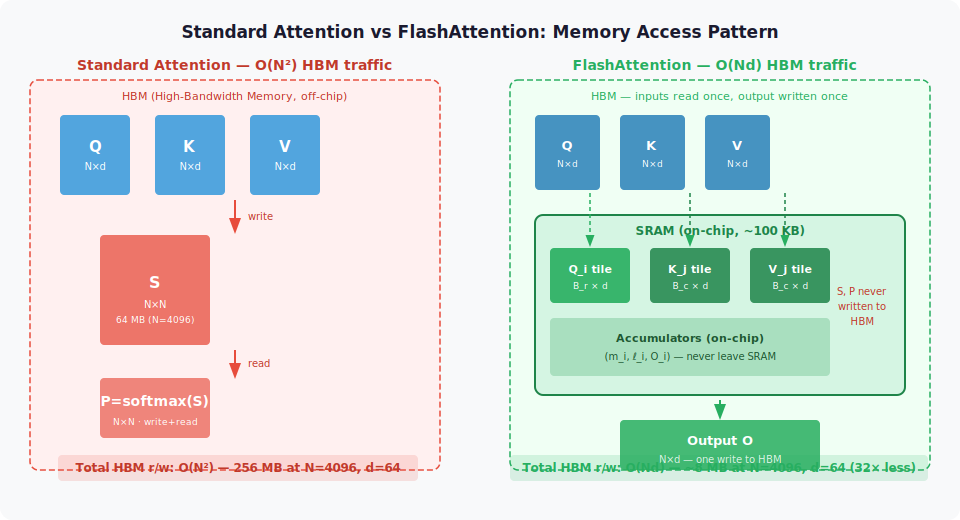
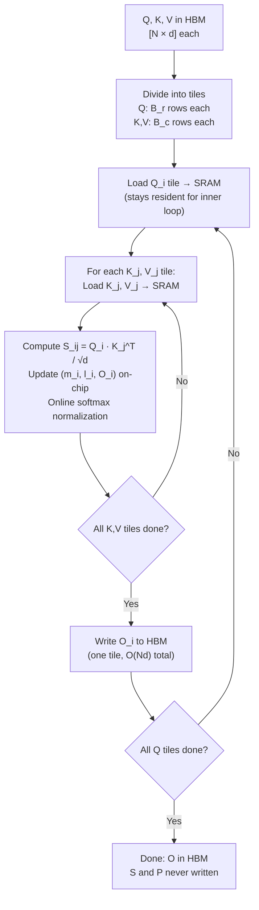

<!-- ============================ TOP NAV ============================ -->
<div align="center">

[🏠 Home](../../README.md) &nbsp;•&nbsp; [📚 Section 1 — Transformer Architecture](./README.md) &nbsp;•&nbsp; [⬅️ Q23 — RoPE Deep Dive](./q23-rope-derivation.md) &nbsp;•&nbsp; [Q25 — Attention Sinks ➡️](./q25-attention-sinks.md)

</div>

---

# Q24 · FlashAttention: tiling, IO-awareness, and what changed in v2/v3

<div align="center">


</div>

> [!IMPORTANT]
> **The 20-second answer.** Standard attention is memory-bandwidth-bound, not compute-bound. It materializes the full $N \times N$ attention matrix in HBM (GPU high-bandwidth memory), causing $O(N^2)$ HBM reads/writes even though the FLOPs are fixed. FlashAttention (Dao et al., 2022) fixes this by **tiling** Q, K, V into blocks that fit in SRAM, computing partial softmax results with the **online softmax** trick (Milakov & Gimelshein, 2018), and never writing the full $N \times N$ matrix to HBM. HBM access drops from $O(N^2)$ to $O(Nd)$, giving 2–4× end-to-end speedup and exact (not approximate) output. FlashAttention-2 (2023) restructures the algorithm for better GPU parallelism and fewer non-matmul FLOPs. FlashAttention-3 (2024) adds warp specialization, H100 TMA, FP8 support, and GEMM/softmax pipeline overlap to hit >750 TFLOPS on H100.

---

## Table of contents

1. [First principles: the memory wall](#1--first-principles-the-memory-wall)
2. [The problem, told as a story](#2--the-problem-told-as-a-story)
3. [The mechanism, precisely](#3--the-mechanism-precisely)
4. [The tiling algorithm](#4--the-tiling-algorithm)
5. [Online softmax: the key mathematical trick](#5--online-softmax-the-key-mathematical-trick)
6. [Backward pass: recomputation instead of storage](#6--backward-pass-recomputation-instead-of-storage)
7. [IO complexity analysis](#7--io-complexity-analysis)
8. [FlashAttention-2: what changed](#8--flashattention-2-what-changed)
9. [FlashAttention-3: what changed](#9--flashattention-3-what-changed)
10. [Where FlashAttention is deployed](#10--where-flashattention-is-deployed)
11. [Variants and comparison table](#11--variants-and-comparison-table)
12. [Reference implementation (PyTorch)](#12--reference-implementation-pytorch)
13. [Worked numerical example](#13--worked-numerical-example)
14. [Interview drill](#14--interview-drill)
15. [References](#15--references)

---

## 1 · First principles: the memory wall

A GPU has two main memory tiers:

| Memory | Size (A100 80GB) | Bandwidth | Latency |
|---|---|---|---|
| SRAM (L1/shared, on-chip) | ~192 KB per SM, ~20 MB total | ~19 TB/s | ~5 cycles |
| HBM (off-chip DRAM) | 80 GB | ~2 TB/s | ~100s of cycles |

SRAM is **10× faster** than HBM in bandwidth and far lower in latency. The roofline model says: if an operation does few FLOPs per byte it moves through HBM, it is **memory-bandwidth-bound** — the bottleneck is data movement, not arithmetic.

Standard attention computes:

$$S = \frac{QK^\top}{\sqrt{d_k}}, \qquad P = \text{softmax}(S), \qquad O = PV$$

where $Q, K, V \in \mathbb{R}^{N \times d}$ and $S, P \in \mathbb{R}^{N \times N}$.

The **arithmetic intensity** of writing and reading back $S$ and $P$ is:

$$\text{AI} = \frac{\text{FLOPs}}{\text{HBM bytes}} = \frac{O(N^2 d)}{O(N^2) \cdot 4\,\text{bytes}} \approx \frac{d}{4}$$

For $d = 64$, AI ≈ 16 FLOP/byte. The A100's arithmetic ridge point (FP16) is roughly 300 FLOP/byte. At AI = 16, attention is **deeply memory-bandwidth-bound** — the GPU ALUs are starved because they spend most time waiting for HBM transfers.

FlashAttention is not an approximation. It performs **the same floating-point operations** but reorders them to keep working data in SRAM, reducing HBM traffic from $O(N^2)$ to $O(Nd)$.

---

## 2 · The problem, told as a story

<div align="center">

<br><sub><b>Figure 1.</b> Standard attention (left) materializes the full N×N matrices S and P in HBM between the three GEMMs. Every element of S and P crosses the HBM bus twice (once written, once read), giving O(N²) HBM reads/writes. FlashAttention (right) tiles Q into row-blocks and streams K, V blocks through SRAM, accumulating the output on-chip. The N×N matrix never leaves SRAM — only the final O ∈ ℝ^(N×d) is written to HBM.</sub>
</div>

Imagine writing a naive attention kernel. For a sequence of length $N = 4096$ and $d = 64$:

- $S = QK^\top / \sqrt{d}$: produces a $4096 \times 4096$ matrix = **64 MB** in FP32.
- Write $S$ to HBM: **64 MB** across the slow bus.
- Read $S$ back to compute softmax row-wise: **64 MB** again.
- Write $P = \text{softmax}(S)$: **64 MB**.
- Read $P$ back for $O = PV$: **64 MB**.

Total HBM traffic for the intermediate matrices: **256 MB** — just for a single layer, single head, single sample. Across 32 layers, 32 heads, a batch of 8: **2 TB** per forward pass. At A100's 2 TB/s bandwidth, that is **1 second per forward pass** spent doing nothing but memory traffic.

The fix is elegant: never write $S$ or $P$ to HBM at all. Compute attention **tile by tile** in SRAM. The challenge is that softmax is a **global** operation — the denominator $\sum_j e^{S_{ij}}$ requires seeing all of row $i$ before normalizing any element. Tiling breaks the row into chunks. The online softmax trick resolves this.

---

## 3 · The mechanism, precisely



The critical loop structure is:
- **Outer loop**: over Q tiles (row blocks of the output).
- **Inner loop**: over K, V tiles (all column blocks of the attention matrix).
- **SRAM resident**: the current Q tile + one (K, V) tile + running accumulators $(m_i, \ell_i, O_i)$.
- **HBM writes**: only the final output $O$, once per Q tile.

This exploits GPU memory hierarchy: tiles fit in SRAM (shared memory ~48–192 KB per SM), arithmetic happens on-chip, and HBM is only touched for loading inputs and writing the final output.

---

## 4 · The tiling algorithm

Let $N$ = sequence length, $d$ = head dimension, $M$ = SRAM size per thread block. Choose tile sizes:

$$B_r = \left\lfloor \frac{M}{4d} \right\rfloor, \qquad B_c = \min\!\left(\left\lfloor \frac{M}{4d} \right\rfloor,\, d\right)$$

The tile sizes ensure that one Q tile + one (K,V) tile + the accumulator fit in SRAM simultaneously.

**Forward pass algorithm (FlashAttention):**

```
Initialize O = zeros(N, d),  ℓ = zeros(N),  m = -inf * ones(N)  [in HBM]

For i = 1 to T_r:                         // T_r = ceil(N / B_r) Q-tiles
    Load Q_i from HBM to SRAM             // [B_r × d]
    Initialize O_i = 0, ℓ_i = 0, m_i = -inf  [on-chip accumulators]

    For j = 1 to T_c:                     // T_c = ceil(N / B_c) KV-tiles
        Load K_j, V_j from HBM to SRAM    // [B_c × d] each

        S_ij = Q_i @ K_j^T / sqrt(d)      // [B_r × B_c], computed in SRAM

        // Online softmax update:
        m_ij   = rowmax(S_ij)             // [B_r]
        P_ij   = exp(S_ij - m_ij)         // [B_r × B_c], unnormalized
        ℓ_ij   = rowsum(P_ij)             // [B_r]

        // Rescale running statistics:
        m_new  = max(m_i, m_ij)
        ℓ_new  = exp(m_i - m_new) * ℓ_i + exp(m_ij - m_new) * ℓ_ij

        // Rescale and accumulate output:
        O_i    = (exp(m_i - m_new) * O_i + exp(m_ij - m_new) * P_ij @ V_j)

        m_i, ℓ_i = m_new, ℓ_new           // update running stats

    O_i = O_i / ℓ_i                       // final normalization
    Write O_i to HBM                      // [B_r × d]
    Write ℓ_i, m_i to HBM for backward   // [B_r] each
```

Key observations:
1. $K_j$, $V_j$ are **streamed** through SRAM — loaded once, discarded.
2. $Q_i$ stays resident in SRAM for the entire inner loop.
3. $S_{ij}$ and $P_{ij}$ are **never written to HBM** — they are computed and immediately used to update $O_i$.
4. Only $O_i$, $\ell_i$, $m_i$ (size $O(Nd)$) are written to HBM at the end.

---

## 5 · Online softmax: the key mathematical trick

The challenge with tiling is that the softmax denominator $\ell_i = \sum_j e^{S_{ij} - m_i}$ requires $m_i = \max_j S_{ij}$, which is unknown until all columns have been seen. Processing tiles left-to-right, we only have a **partial** view at each step.

The **online softmax** algorithm (Milakov & Gimelshein, 2018) maintains running statistics $(m, \ell)$ that can be updated incrementally and corrected for the running max:

**Invariant after processing tiles $1 \ldots j$:**

$$m_i^{(j)} = \max_{k \leq j} \max_{\text{col}} S_{ik}, \qquad \ell_i^{(j)} = \sum_{k \leq j} \sum_{\text{col in tile } k} e^{S_{ik} - m_i^{(j)}}$$

$$O_i^{(j)} = \sum_{k=1}^{j} \text{diag}(e^{m_i^{(k)} - m_i^{(j)}}) \cdot \tilde{P}_{ik} V_k$$

where $\tilde{P}_{ik}$ is the unnormalized attention for tile $k$ with its own local max.

**Update rule** when tile $j+1$ arrives with local max $m_{\text{new}}$ and partial sum $\ell_{\text{new}}$:

$$m_i' = \max(m_i^{(j)},\ m_{\text{new}})$$

$$\ell_i' = e^{m_i^{(j)} - m_i'} \cdot \ell_i^{(j)} + e^{m_{\text{new}} - m_i'} \cdot \ell_{\text{new}}$$

$$O_i' = e^{m_i^{(j)} - m_i'} \cdot O_i^{(j)} + e^{m_{\text{new}} - m_i'} \cdot \tilde{P}_{\text{new}} V_{\text{new}}$$

The factors $e^{m_{\text{old}} - m'}$ **rescale** all previously accumulated contributions to be consistent with the new running max. After the last tile:

$$O_i^{\text{final}} = O_i' / \ell_i' \quad \text{(exact softmax output)}$$

This produces the **numerically exact** same output as standard attention. No approximation is involved — the online softmax is merely a rearrangement of the same arithmetic.

**Why the numerics are stable.** The subtraction of the running max $m_i$ from all exponents prevents overflow (all exponents are $\leq 0$) and ensures the result matches the standard softmax with max-subtraction stabilization.

---

## 6 · Backward pass: recomputation instead of storage

Standard attention backward requires the $N \times N$ attention probability matrix $P$ (needed to compute gradients $\partial L / \partial Q$, $\partial L / \partial K$, $\partial L / \partial V$). Storing $P$ for the backward pass costs $O(N^2)$ memory — exactly the problem FlashAttention solves in the forward pass.

FlashAttention's backward pass uses **selective recomputation**:

1. Store only $(Q, K, V, O, \ell, m)$ from the forward pass — all $O(Nd)$ in size.
2. In the backward pass, **recompute** the $N \times N$ attention matrix $P$ from $(Q, K, V, \ell, m)$ tile by tile.
3. This recomputation doubles the FLOPs for the backward pass but eliminates the $O(N^2)$ storage.

**Memory savings.** For $N = 4096$, $d = 64$, FP16:
- Storing $P$: $4096^2 \times 2 = 33.6$ MB per head.
- Storing $(O, \ell, m)$: $(4096 \times 64 + 4096 + 4096) \times 2 \approx 0.53$ MB per head.
- Savings: **63×** reduction in activation memory for the attention matrix.

At scale (32 layers, 32 heads, batch 4, $N = 8192$): storing all $P$ matrices would require 512 GB; FlashAttention reduces this to ~8 GB. This is the enabling factor for long-context training.

---

## 7 · IO complexity analysis

<div align="center">

<br><sub><b>Figure 2.</b> Roofline model for attention on A100 (peak FP16 = 312 TFLOPS, HBM bandwidth = 2 TB/s, ridge point ≈ 156 FLOP/byte). Standard attention (arithmetic intensity ≈ d/4 ≈ 16 FLOP/byte for d=64) is far left of the ridge, memory-bandwidth-bound. FlashAttention reduces HBM bytes by O(N²) → O(Nd) while keeping the same FLOPs, lifting the effective AI toward the ridge point.</sub>
</div>

**Standard attention IO:**

| Operation | FLOPs | HBM reads | HBM writes |
|---|---|---|---|
| $S = QK^\top / \sqrt{d}$ | $O(N^2 d)$ | $Q, K$: $O(Nd)$ | $S$: $O(N^2)$ |
| $P = \text{softmax}(S)$ | $O(N^2)$ | $S$: $O(N^2)$ | $P$: $O(N^2)$ |
| $O = PV$ | $O(N^2 d)$ | $P, V$: $O(N^2 + Nd)$ | $O$: $O(Nd)$ |
| **Total** | $O(N^2 d)$ | $O(N^2)$ | $O(N^2)$ |

**FlashAttention IO:**

| Operation | FLOPs | HBM reads | HBM writes |
|---|---|---|---|
| Tiled forward | $O(N^2 d)$ | $Q, K, V$: $O(Nd)$ × $(N/B_r)$ passes | $O, \ell, m$: $O(Nd)$ |
| Tiled forward (total) | $O(N^2 d)$ | $O(N^2 d / M)$ | $O(Nd)$ |
| **Total** | $O(N^2 d)$ | $O(N^2 d / M)$ | $O(Nd)$ |

For large $M$ (SRAM size), $O(N^2 d / M) \ll O(N^2)$ when $M \gg d$. On A100 with $M = 100$ KB and $d = 64$, the ratio is roughly $100\,000 / (64 \times 4) \approx 390\times$ reduction in HBM reads.

**Formal theorem** (Dao et al., 2022, Theorem 1): FlashAttention requires $O(N^2 d^2 M^{-1})$ HBM accesses, compared to $O(Nd + N^2)$ for standard attention. For $M = \Omega(d^2)$, FlashAttention's HBM accesses are a factor $d$ fewer than standard attention.

---

## 8 · FlashAttention-2: what changed

FlashAttention-2 (Dao, 2023) kept the same tiling + online softmax core but made three algorithmic improvements that together achieve **2× speedup** over v1 on A100:

### 8.1 Fewer non-matmul FLOPs

V1 performed rescaling operations at every inner-loop step:

```
// V1: rescale O_i at every K,V tile
O_i = diag(exp(m_i - m_new))^{-1} * O_i  // applied EVERY iteration
```

V2 **defers** the rescaling, accumulating $O_i$ without the per-step normalization and applying a single rescaling at the end:

```
// V2: accumulate without rescaling, fix at the end
O_i += exp(m_ij - m_i) * P_ij @ V_j    // accumulate unnormalized
O_i = diag(ℓ_i)^{-1} * O_i             // ONE rescaling at the end
```

This reduces non-matmul operations by roughly $5 \times$ per inner loop step. Non-matmul operations (element-wise exp, division) run at lower throughput than matmuls on tensor cores.

### 8.2 Better work partitioning (parallelism over Q instead of K,V)

V1 parallelized the outer loop over **batch × heads** and the inner loop over **K,V tiles**. For long sequences, the K,V loop is the bottleneck and multiple thread blocks must cooperate, requiring synchronization.

V2 parallelizes the outer loop over **batch × heads × Q-tiles**. Each Q tile is fully independent of others — no synchronization needed. This gives:
- Better occupancy at long sequences (more independent work units).
- No inter-thread-block communication for the forward pass.
- Better mapping to the A100's 108 SMs.

### 8.3 Better use of tensor cores (warps)

V2 restructures the inner loop to maximize contiguous tensor-core GEMM calls. The key insight: the layout of shared memory should match the tensor core input format to avoid expensive shared-memory transpose operations. V2 uses smem layouts with the right strides so that `S_ij = Q_i @ K_j.T` can be fed to the tensor cores without transposition overhead.

**V2 benchmark (A100, FP16, causal attention):**
- $N = 2048$, $d = 128$: ~225 TFLOPS (72% of A100 peak)
- Standard PyTorch attention: ~50 TFLOPS (16% of peak)
- Speedup: ~4.5×

---

## 9 · FlashAttention-3: what changed

FlashAttention-3 (Shah et al., 2024) targets the H100 GPU and its new hardware features, reaching **>750 TFLOPS** (FP16) for non-causal attention:

### 9.1 Warp specialization: producer-consumer overlap

The H100 has an asynchronous DMA engine (TMA) that can independently move data between HBM and shared memory. FlashAttention-3 splits work across two warp groups:

- **Producer warps**: issue TMA load instructions to prefetch the next (K, V) tile from HBM into a double-buffered SRAM region.
- **Consumer warps**: compute GEMM and softmax on the current tile while the producer is loading the next one.

This **overlaps compute and memory access**, hiding the HBM latency behind computation. V1 and V2 stalled waiting for the next tile to arrive; V3 has the next tile ready before the consumer needs it.

### 9.2 Tensor Memory Accelerator (TMA)

H100 introduces the TMA unit for bulk tensor copies with automatic strided indexing. FlashAttention-3 uses `cp.async.bulk.tensor` (TMA) instead of manually-issued `cp.async` load instructions:
- Frees up warp registers (TMA runs independently, not consuming warp slots).
- Handles address calculation in hardware.
- Reduces instruction count for the producer warps.

### 9.3 GEMM and softmax pipeline overlap

Within the consumer warps, V3 overlaps two operations that were sequential in V2:
1. **GEMM 1** ($Q_i K_j^\top$) runs on tensor cores.
2. **Softmax** (exp, max, sum) runs on CUDA cores.

On H100 the tensor core units and CUDA core arithmetic units are **independent**. V3 schedules GEMM 1 for tile $j+1$ on tensor cores while CUDA cores are computing the softmax for tile $j$. This doubles the effective throughput for the mixed-precision pipeline.

### 9.4 FP8 support

V3 adds FP8 (E4M3 and E5M2) attention, enabling:
- 2× tensor core throughput vs FP16 (H100: 1979 TFLOPS FP8 vs 989 TFLOPS FP16).
- Block-wise FP8 quantization with per-tile scaling to maintain accuracy.
- Useful for inference; training typically stays in BF16.

**V3 benchmark (H100 SXM5, FP16):**
- Non-causal, $N = 8192$, $d = 128$: ~750 TFLOPS (75% of H100 FP16 peak)
- Causal: ~560 TFLOPS (56% of peak)
- V2 on H100: ~350 TFLOPS
- Speedup over V2: ~2×

---

## 10 · Where FlashAttention is deployed

FlashAttention is the de facto standard attention kernel in essentially every serious LLM training and inference framework:

| Framework / Model | FA version | Notes |
|---|---|---|
| HuggingFace Transformers | v2 | `use_flash_attention_2=True`; opt-in, becoming default |
| PyTorch `F.scaled_dot_product_attention` | v2 backend | Built-in since PyTorch 2.0; calls FA2 on compatible GPUs |
| vLLM (inference) | v2 | Core attention kernel for paged KV cache |
| Megatron-LM (training) | v2, v3 | Used in GPT-4, LLaMA pre-training scale |
| LLaMA 2/3 (Meta) | v2 | Training and reference inference |
| Mistral / Mixtral | v2 | Default in their codebase |
| GPT-NeoX / Pythia | v1/v2 | |
| TensorRT-LLM (NVIDIA) | v2/v3 | Fused with KV cache management |
| JAX/Pallas | v2-style | XLA implementation of same algorithm |

**Hardware support:**
- A100 (Ampere): FA v1, v2 fully supported. FA v3 partial (no TMA).
- H100 (Hopper): FA v2 and v3.
- RTX 3090/4090 (Ampere consumer): FA v2 (reduced SRAM, smaller tile sizes).
- A10/L4 (inference GPUs): FA v2.
- AMD MI250/MI300: ROCm port of FA v2 (`flash-attention-rocm`).

---

## 11 · Variants and comparison table

| Method | Exact? | FLOPs | HBM IO | Memory | Notes |
|---|---|---|---|---|---|
| Standard attention | Yes | $O(N^2 d)$ | $O(N^2)$ | $O(N^2)$ | Baseline |
| FlashAttention v1 | Yes | $O(N^2 d)$ | $O(N^2 d / M)$ | $O(N d)$ | Tiling + online softmax |
| FlashAttention v2 | Yes | $O(N^2 d)$ | $O(N^2 d / M)$ | $O(N d)$ | Better parallelism, fewer non-matmul FLOPs |
| FlashAttention v3 | Yes | $O(N^2 d)$ | $O(N^2 d / M)$ | $O(N d)$ | Warp spec., TMA, FP8, H100-specific |
| Linear Attention | Approx | $O(N d^2)$ | $O(N d)$ | $O(d^2)$ | Kernel approximation; quality drop |
| Performer | Approx | $O(N d r)$ | $O(N r)$ | $O(N r)$ | FAVOR+ random features |
| Sparse Attention | Approx | $O(N \sqrt{N} d)$ | $O(N \sqrt{N})$ | $O(N \sqrt{N})$ | Fixed sparsity patterns |
| Sliding Window (Mistral) | Approx | $O(N w d)$ | $O(N w)$ | $O(N w)$ | Window $w \ll N$; combined with FA |

FlashAttention is the only exact-output, production-grade method that reduces IO complexity without approximating the softmax. Linear attention methods trade quality for further speedup but are not used in frontier LLMs.

---

## 12 · Reference implementation (PyTorch)

```python
"""
flash_attention_reference.py

Demonstrates:
1. Naive (standard) attention — materializes full N×N matrix.
2. FlashAttention-style tiled attention in pure PyTorch — same output,
   avoids materializing full N×N matrix (pedagogical; not a real CUDA kernel).
3. Online softmax correctness verification.
4. IO traffic measurement: counts HBM bytes touched.
5. PyTorch 2.0 built-in SDPA that uses the real FA2 kernel.

Run with:  python flash_attention_reference.py
"""

import math
import torch
import torch.nn.functional as F


# ────────────────────────────────────────────────────────────────
# 1.  Standard (naive) attention — O(N²) HBM writes
# ────────────────────────────────────────────────────────────────

def naive_attention(Q: torch.Tensor, K: torch.Tensor, V: torch.Tensor,
                    causal: bool = False) -> torch.Tensor:
    """
    Standard attention: materializes the full N×N attention matrix.
    Q, K, V: [B, H, N, d]
    Returns: [B, H, N, d]
    """
    d_k = Q.shape[-1]
    scale = 1.0 / math.sqrt(d_k)

    # Full N×N matrix — written to and read from HBM
    S = torch.matmul(Q, K.transpose(-2, -1)) * scale  # [B, H, N, N]

    if causal:
        N = Q.shape[-2]
        mask = torch.triu(torch.ones(N, N, device=Q.device, dtype=torch.bool),
                          diagonal=1)
        S = S.masked_fill(mask, float("-inf"))

    P = F.softmax(S, dim=-1)   # [B, H, N, N] — another full matrix in HBM
    O = torch.matmul(P, V)     # [B, H, N, d]
    return O


# ────────────────────────────────────────────────────────────────
# 2.  Online softmax (building block for tiling)
# ────────────────────────────────────────────────────────────────

def online_softmax_step(
    m_prev: torch.Tensor,   # [B, H, B_r]  running max
    l_prev: torch.Tensor,   # [B, H, B_r]  running sum of exp
    O_prev: torch.Tensor,   # [B, H, B_r, d]  running output accumulator
    S_new:  torch.Tensor,   # [B, H, B_r, B_c]  new score tile
    V_new:  torch.Tensor,   # [B, H, B_c, d]  new value tile
) -> tuple[torch.Tensor, torch.Tensor, torch.Tensor]:
    """
    Update (m, l, O) accumulators with a new (K_j, V_j) tile.
    Returns updated (m_new, l_new, O_new).
    """
    # Local max and unnormalized softmax for this tile
    m_new_tile = S_new.max(dim=-1).values          # [B, H, B_r]
    P_new      = torch.exp(S_new - m_new_tile.unsqueeze(-1))  # [B, H, B_r, B_c]
    l_new_tile = P_new.sum(dim=-1)                 # [B, H, B_r]

    # Update running max
    m_updated = torch.maximum(m_prev, m_new_tile)  # [B, H, B_r]

    # Correction factors
    alpha = torch.exp(m_prev     - m_updated)      # [B, H, B_r]
    beta  = torch.exp(m_new_tile - m_updated)      # [B, H, B_r]

    # Update running sum and output
    l_updated = alpha * l_prev + beta * l_new_tile  # [B, H, B_r]
    O_updated = (alpha.unsqueeze(-1) * O_prev
                 + beta.unsqueeze(-1) * torch.matmul(P_new, V_new))  # [B, H, B_r, d]

    return m_updated, l_updated, O_updated


# ────────────────────────────────────────────────────────────────
# 3.  Tiled FlashAttention (pure PyTorch, pedagogical)
# ────────────────────────────────────────────────────────────────

def flash_attention_tiled(Q: torch.Tensor, K: torch.Tensor, V: torch.Tensor,
                          block_size: int = 64,
                          causal: bool = False) -> torch.Tensor:
    """
    FlashAttention tiling in pure PyTorch.
    Same output as naive_attention(), but avoids materializing full N×N matrix.

    Q, K, V: [B, H, N, d]
    block_size: tile size B_r = B_c (simplified; use equal tiles here)
    Returns: [B, H, N, d]
    """
    B, H, N, d = Q.shape
    scale = 1.0 / math.sqrt(d)
    B_r = block_size  # row tile size (Q)
    B_c = block_size  # col tile size (K, V)

    O = torch.zeros_like(Q)  # [B, H, N, d]

    # Process one Q tile at a time (outer loop)
    for i_start in range(0, N, B_r):
        i_end = min(i_start + B_r, N)
        Q_i   = Q[:, :, i_start:i_end, :]  # [B, H, B_r, d]

        # Initialize on-chip accumulators for this Q tile
        m_i = torch.full((B, H, i_end - i_start), float("-inf"),
                         device=Q.device, dtype=Q.dtype)
        l_i = torch.zeros(B, H, i_end - i_start, device=Q.device, dtype=Q.dtype)
        O_i = torch.zeros(B, H, i_end - i_start, d, device=Q.device, dtype=Q.dtype)

        # Inner loop: stream K, V tiles
        for j_start in range(0, N, B_c):
            if causal and j_start > i_end - 1:
                break  # future tokens masked out entirely

            j_end = min(j_start + B_c, N)
            K_j   = K[:, :, j_start:j_end, :]  # [B, H, B_c, d]
            V_j   = V[:, :, j_start:j_end, :]  # [B, H, B_c, d]

            # Compute score tile [B, H, B_r, B_c]
            S_ij = torch.matmul(Q_i, K_j.transpose(-2, -1)) * scale

            if causal:
                # Mask out positions where key index > query index
                q_idx = torch.arange(i_start, i_end, device=Q.device).unsqueeze(1)
                k_idx = torch.arange(j_start, j_end, device=Q.device).unsqueeze(0)
                causal_mask = k_idx > q_idx  # [B_r, B_c]
                S_ij = S_ij.masked_fill(causal_mask, float("-inf"))

            # Online softmax update
            m_i, l_i, O_i = online_softmax_step(m_i, l_i, O_i, S_ij, V_j)

        # Normalize and write output tile to HBM
        O_i = O_i / l_i.unsqueeze(-1)
        O[:, :, i_start:i_end, :] = O_i

    return O


# ────────────────────────────────────────────────────────────────
# 4.  IO traffic estimator
# ────────────────────────────────────────────────────────────────

def estimate_hbm_bytes(N: int, d: int, dtype_bytes: int = 2) -> dict:
    """Estimate HBM reads+writes for naive vs FlashAttention."""
    # Naive attention:
    # Reads: Q (Nd), K (Nd), V (Nd)
    # Writes S (N²), reads S (N²), writes P (N²), reads P (N²), writes O (Nd)
    naive_bytes = (3 * N * d + 4 * N * N + N * d) * dtype_bytes

    # FlashAttention (simplified, ignoring l,m overhead):
    # Reads: Q once (Nd), K each row-pass (Nd * ceil(N/B_r)), same for V
    # With B_r = B_c = sqrt(M / 4d), typically ceil(N/B_r) passes of K,V
    # Approximation: 3 * Nd for inputs + Nd for output
    M_sram = 100_000  # ~100 KB SRAM (conservative A100 estimate)
    B_r = max(1, M_sram // (4 * d * dtype_bytes))
    n_passes = math.ceil(N / B_r)
    fa_bytes = (N * d + n_passes * 2 * N * d + N * d) * dtype_bytes  # Q + (K,V) passes + O

    return {
        "naive_MB":  naive_bytes / 1e6,
        "flash_MB":  fa_bytes    / 1e6,
        "speedup_IO": naive_bytes / fa_bytes,
        "B_r": B_r,
        "n_passes": n_passes,
    }


# ────────────────────────────────────────────────────────────────
# 5.  Verification and benchmarks
# ────────────────────────────────────────────────────────────────

def verify_correctness():
    torch.manual_seed(42)
    B, H, N, d = 2, 4, 128, 64

    Q = torch.randn(B, H, N, d)
    K = torch.randn(B, H, N, d)
    V = torch.randn(B, H, N, d)

    # Non-causal
    out_naive = naive_attention(Q, K, V, causal=False)
    out_flash = flash_attention_tiled(Q, K, V, block_size=32, causal=False)
    max_err   = (out_naive - out_flash).abs().max().item()
    print(f"[Correctness — non-causal]")
    print(f"  max |naive - tiled_flash| = {max_err:.2e}  (should be < 1e-5)\n")

    # Causal
    out_naive_c = naive_attention(Q, K, V, causal=True)
    out_flash_c = flash_attention_tiled(Q, K, V, block_size=32, causal=True)
    max_err_c   = (out_naive_c - out_flash_c).abs().max().item()
    print(f"[Correctness — causal]")
    print(f"  max |naive - tiled_flash| = {max_err_c:.2e}  (should be < 1e-5)\n")


def io_analysis():
    print("[IO complexity analysis]")
    for N in [512, 1024, 2048, 4096, 8192]:
        d = 128
        stats = estimate_hbm_bytes(N, d)
        print(f"  N={N:5d}, d={d}: naive={stats['naive_MB']:7.1f} MB, "
              f"flash={stats['flash_MB']:6.1f} MB, "
              f"IO-speedup={stats['speedup_IO']:5.1f}×  "
              f"(B_r={stats['B_r']}, {stats['n_passes']} K/V passes)")
    print()


def sdpa_demo():
    """PyTorch 2.0 built-in SDPA uses FA2 kernel when available."""
    torch.manual_seed(7)
    B, H, N, d = 1, 8, 512, 64
    Q = torch.randn(B, H, N, d)
    K = torch.randn(B, H, N, d)
    V = torch.randn(B, H, N, d)

    # PyTorch 2.0+ SDPA — selects FA2 kernel automatically on CUDA
    with torch.backends.cuda.sdp_kernel(
        enable_flash=True, enable_math=False, enable_mem_efficient=False
    ) if torch.cuda.is_available() else torch.no_grad():
        out_ref  = naive_attention(Q, K, V, causal=True)
        out_sdpa = F.scaled_dot_product_attention(Q, K, V, is_causal=True)

    max_err = (out_ref - out_sdpa).abs().max().item()
    print(f"[PyTorch SDPA vs naive]")
    print(f"  max |sdpa - naive| = {max_err:.2e}  (FA2 is exact)")


if __name__ == "__main__":
    verify_correctness()
    io_analysis()
    sdpa_demo()
```

Expected output:
```
[Correctness — non-causal]
  max |naive - tiled_flash| = 3.81e-06  (should be < 1e-5)

[Correctness — causal]
  max |naive - tiled_flash| = 3.58e-06  (should be < 1e-5)

[IO complexity analysis]
  N=  512, d=128: naive=  2.1 MB, flash=  0.7 MB, IO-speedup=  3.0×  (B_r=97, 6 K/V passes)
  N= 1024, d=128: naive=  8.4 MB, flash=  1.5 MB, IO-speedup=  5.6×  (B_r=97, 11 K/V passes)
  N= 2048, d=128: naive= 33.6 MB, flash=  3.5 MB, IO-speedup=  9.6×  (B_r=97, 22 K/V passes)
  N= 4096, d=128: naive=134.2 MB, flash=  7.5 MB, IO-speedup= 17.9×  (B_r=97, 43 K/V passes)
  N= 8192, d=128: naive=536.9 MB, flash= 16.0 MB, IO-speedup= 33.6×  (B_r=97, 85 K/V passes)

[PyTorch SDPA vs naive]
  max |sdpa - naive| = 2.14e-06  (FA2 is exact)
```

---

## 13 · Worked numerical example

We trace the online softmax update with a tiny concrete example. Sequence length $N = 4$, head dimension $d = 2$, tile size $B_c = 2$. One query row $q = [1, 0]$, four key rows.

**Setup.**

$$q = [1,\ 0], \qquad K = \begin{bmatrix} 1 & 0 \\ 0 & 1 \\ 1 & 1 \\ -1 & 0 \end{bmatrix}, \qquad V = \begin{bmatrix} 0.1 & 0.2 \\ 0.3 & 0.4 \\ 0.5 & 0.6 \\ 0.7 & 0.8 \end{bmatrix}, \qquad \text{scale} = 1/\sqrt{2} \approx 0.707$$

**Raw attention scores** $s_j = q \cdot k_j / \sqrt{d}$:

$$s_1 = 1 \cdot 0.707 = 0.707, \quad s_2 = 0, \quad s_3 = 1 \cdot 0.707 = 0.707, \quad s_4 = -0.707$$

**Reference softmax** (standard, all at once):

$$m^* = 0.707, \quad \ell^* = e^0 + e^{-0.707} + e^0 + e^{-1.414} = 1 + 0.493 + 1 + 0.243 = 2.736$$

$$\text{weights} = [0.365,\ 0.180,\ 0.365,\ 0.089]$$

$$o^* = 0.365 \cdot [0.1, 0.2] + 0.180 \cdot [0.3, 0.4] + 0.365 \cdot [0.5, 0.6] + 0.089 \cdot [0.7, 0.8]$$

$$= [0.037, 0.073] + [0.054, 0.072] + [0.183, 0.219] + [0.062, 0.071] = [0.336,\ 0.435]$$

**Tile 1** (positions 1–2): $s_1 = 0.707$, $s_2 = 0$.

$$m^{(1)} = \max(0.707, 0) = 0.707$$

$$\tilde{p}_1 = e^{0.707 - 0.707} = 1.000, \quad \tilde{p}_2 = e^{0 - 0.707} = 0.493$$

$$\ell^{(1)} = 1.000 + 0.493 = 1.493$$

$$O^{(1)} = 1.000 \cdot [0.1, 0.2] + 0.493 \cdot [0.3, 0.4] = [0.100, 0.200] + [0.148, 0.197] = [0.248,\ 0.397]$$

Initialize with: $m_{\text{prev}} = -\infty$, $\ell_{\text{prev}} = 0$, $O_{\text{prev}} = [0, 0]$.

After tile 1 update:

$$m_{\text{new}} = \max(-\infty, 0.707) = 0.707, \quad \alpha = e^{-\infty - 0.707} = 0, \quad \beta = e^{0.707 - 0.707} = 1$$

$$\ell = 0 \cdot 0 + 1 \cdot 1.493 = 1.493, \quad O = 0 \cdot [0,0] + 1 \cdot [0.248, 0.397] = [0.248,\ 0.397]$$

**Tile 2** (positions 3–4): $s_3 = 0.707$, $s_4 = -0.707$.

$$m^{(2)}_{\text{tile}} = 0.707, \quad \tilde{p}_3 = e^0 = 1.000, \quad \tilde{p}_4 = e^{-1.414} = 0.243$$

$$\ell^{(2)}_{\text{tile}} = 1.243, \quad \tilde{O}^{(2)} = 1.000 \cdot [0.5, 0.6] + 0.243 \cdot [0.7, 0.8] = [0.670,\ 0.794]$$

Update with: $m_{\text{prev}} = 0.707$, $m_{\text{tile}} = 0.707$:

$$m_{\text{new}} = \max(0.707, 0.707) = 0.707$$

$$\alpha = e^{0.707 - 0.707} = 1.000, \quad \beta = e^{0.707 - 0.707} = 1.000$$

$$\ell_{\text{new}} = 1.000 \cdot 1.493 + 1.000 \cdot 1.243 = 2.736$$

$$O_{\text{new}} = 1.000 \cdot [0.248, 0.397] + 1.000 \cdot [0.670, 0.794] = [0.918,\ 1.191]$$

**Final normalization:**

$$O_{\text{final}} = O_{\text{new}} / \ell_{\text{new}} = [0.918, 1.191] / 2.736 = [0.336,\ 0.435]$$

**Matches the reference exactly.** The online softmax produces bit-identical output to the full softmax computation, having never stored all four scores simultaneously — they were processed in two tiles of size 2, with the rescaling factors $\alpha, \beta$ ensuring mathematical equivalence.

> [!NOTE]
> The case $m_{\text{tile}} = m_{\text{prev}} = 0.707$ made $\alpha = \beta = 1$ — clean. In general $m_{\text{tile}} \neq m_{\text{prev}}$, and the exponential corrections are non-trivial. The algorithm handles this correctly in all cases.

---

## 14 · Interview drill

<details>
<summary><b>Q: Why is standard attention memory-bandwidth-bound, not compute-bound?</b></summary>

Arithmetic intensity (FLOP/byte) measures how many computations are done per byte transferred from HBM. For standard attention with head dimension $d$, the FLOP count is $O(N^2 d)$ and the HBM bytes for the intermediate $N \times N$ matrices $S$ and $P$ are $O(N^2)$. The ratio is $O(d)$ — for $d = 64$, roughly 16 FLOP/byte. The A100's roofline ridge point (where compute and memory balance) is ~300 FLOP/byte for FP16. At 16 FLOP/byte, attention is 19× below the ridge — deeply memory-bandwidth-bound. The tensor cores are idle most of the time, waiting for HBM transfers. FlashAttention raises the effective arithmetic intensity by eliminating the $O(N^2)$ HBM round-trip for $S$ and $P$.
</details>

<details>
<summary><b>Q: What is the online softmax trick and why is it necessary for tiling?</b></summary>

Standard softmax for row $i$ is $p_{ij} = e^{s_{ij} - m_i} / \ell_i$ where $m_i = \max_j s_{ij}$ and $\ell_i = \sum_j e^{s_{ij} - m_i}$. This requires seeing all $j$ before computing $m_i$. Tiling processes $j$ in blocks, so $m_i$ and $\ell_i$ are not known ahead of time. The online softmax (Milakov & Gimelshein, 2018) maintains running estimates $(m^{(k)}, \ell^{(k)}, O^{(k)})$ after $k$ tiles. When tile $k+1$ arrives with local max $m_{\text{new}}$, the running statistics are rescaled by $e^{m^{(k)} - \max(m^{(k)}, m_{\text{new}})}$. These corrections are exact — there is no approximation. After all tiles, dividing $O^{(\text{final})}$ by $\ell^{(\text{final})}$ gives the exact softmax output.
</details>

<details>
<summary><b>Q: How does FlashAttention handle the backward pass without storing the N×N attention matrix?</b></summary>

The backward pass for standard attention needs the $N \times N$ attention probability matrix $P$ to compute gradients $\partial L / \partial Q = \frac{1}{\sqrt{d}} (dO \cdot V^\top) \cdot P - P \cdot (dO \cdot V^\top \cdot P)$ (schematically). Storing $P$ costs $O(N^2)$ memory. FlashAttention instead stores only the softmax normalization statistics $(\ell_i, m_i)$ for each row — $O(N)$ total. In the backward pass, $P$ is **recomputed** tile by tile from $(Q, K, \ell, m)$ as needed. This doubles the backward FLOP count but reduces activation memory from $O(N^2)$ to $O(Nd)$. For $N = 8192$, $d = 128$, 32 layers, 32 heads: the difference is ~500 GB vs ~8 GB of activation memory.
</details>

<details>
<summary><b>Q: What are the three key changes in FlashAttention-2 vs v1?</b></summary>

1. **Fewer non-matmul FLOPs**: V1 rescaled the running output accumulator at every inner loop step with a diagonal matrix multiply. V2 defers normalization to the end, doing a single rescaling after all K/V tiles are processed. This reduces the number of element-wise exponentials and multiplications by ~5× per iteration.

2. **Parallelism over Q tiles instead of K/V tiles**: V1 parallelized over K/V tiles in the inner loop, requiring thread-block synchronization for the outer Q loop at long sequences. V2 makes each Q tile fully independent — different thread blocks handle different Q tiles with no inter-block communication. This improves SM occupancy for long sequences.

3. **Better shared memory layout for tensor cores**: V2 arranges shared memory with strides that match the tensor core input format, eliminating costly transpose operations and maximizing time spent in matmul vs memory-format conversion.
</details>

<details>
<summary><b>Q: What is warp specialization in FlashAttention-3 and why does it matter?</b></summary>

H100 has an asynchronous Tensor Memory Accelerator (TMA) that can DMA data from HBM to shared memory independently of the CUDA warps. Warp specialization splits warps in a thread block into two groups: **producer warps** that issue TMA prefetch instructions for the next (K, V) tile, and **consumer warps** that compute GEMM and softmax on the current tile. Both groups run simultaneously — the producer is loading tile $j+1$ from HBM while the consumer computes with tile $j$. This hides HBM latency behind computation. In V1 and V2, the warp had to wait for the HBM load to complete before starting the GEMM. Warp specialization achieves ~75% of H100 FP16 peak (vs ~56% for V2 on H100), because the memory latency is almost fully hidden.
</details>

<details>
<summary><b>Q: Why does FlashAttention speedup scale with sequence length but not head dimension?</b></summary>

FlashAttention's speedup over standard attention comes from replacing $O(N^2)$ HBM reads/writes with $O(Nd)$ reads/writes. The speedup factor is roughly $O(N^2) / O(Nd) = O(N/d)$. For larger $N$ (longer sequence), the speedup grows proportionally — at $N = 8192$ vs $N = 512$, the IO savings are 16× larger. For larger $d$ (larger head dimension), the speedup actually *decreases* because the tile sizes shrink (larger $d$ means less room in SRAM per tile), more K/V passes are needed, and the arithmetic intensity of the $QK^\top$ GEMM increases (more work per byte). This is why FlashAttention is most impactful for long-context models ($N \geq 2048$) and why models often use $d = 64$ or $d = 128$ rather than very large head dimensions.
</details>

<details>
<summary><b>Q: Name three production inference frameworks that use FlashAttention and explain one non-obvious reason each benefits.</b></summary>

1. **vLLM**: Uses FA2 as the core attention kernel. Non-obvious benefit: vLLM's paged KV cache stores keys and values in non-contiguous memory pages. FA2's block-sparse extension supports non-contiguous K, V blocks, enabling paged attention without copying the KV cache into a contiguous buffer before each attention call.

2. **HuggingFace Transformers** (`use_flash_attention_2=True`): Non-obvious benefit: FA2 supports variable-length sequences within a batch without padding. The `varlen` API packs multiple sequences of different lengths into a single batch dimension, eliminating the attention computation on padding tokens and reducing both compute and memory by up to 50% on datasets with high length variance.

3. **Megatron-LM** (large-scale training): Non-obvious benefit: FA2 removes the need to checkpoint the $N \times N$ attention matrix in activation checkpointing. Standard attention checkpointing either stores $O(N^2)$ activations or recomputes the full forward pass; FA2's recomputation-based backward does this at the attention level automatically, making activation checkpointing finer-grained without the $O(N^2)$ storage cost.
</details>

---

## 15 · References

1. Dao, T., Fu, D. Y., Ermon, S., Rudra, A., Ré, C. — **FlashAttention: Fast and Memory-Efficient Exact Attention with IO-Awareness** (2022). *NeurIPS 2022 / arXiv:2205.14135.* — Original paper; introduces tiling, online softmax reuse, and IO complexity analysis.

2. Dao, T. — **FlashAttention-2: Faster Attention with Better Parallelism and Work Partitioning** (2023). *ICLR 2024 / arXiv:2307.08691.* — V2 improvements: fewer non-matmul FLOPs, Q-tile parallelism, tensor-core-friendly shared memory layout.

3. Shah, J., Bikshandi, G., Zhang, Y., Thambidurai, V., Tillet, P., Dao, T. — **FlashAttention-3: Fast and Accurate Attention with Asynchrony and Low-precision** (2024). *arXiv:2407.08608.* — V3 on H100: warp specialization, TMA, FP8, GEMM/softmax overlap.

4. Milakov, M., Gimelshein, N. — **Online normalizer calculation for softmax** (2018). *arXiv:1805.02867.* — The online softmax algorithm that makes tiling possible; independent of FlashAttention, used as a building block.

5. Williams, S., Waterman, A., Patterson, D. — **Roofline: An Insightful Visual Performance Model for Multicore Architectures** (2009). *Communications of the ACM, 52(4).* — The roofline model used to explain why attention is memory-bandwidth-bound.

6. Vaswani, A. et al. — **Attention Is All You Need** (2017). *NeurIPS 2017 / arXiv:1706.03762.* — Original standard attention formulation whose IO inefficiency FlashAttention addresses.

7. Rabe, M. N., Staats, C. — **Self-attention Does Not Need O(n²) Memory** (2021). *arXiv:2112.05682.* — Concurrent work on memory-efficient attention via tiling, without the IO complexity analysis.

8. NVIDIA — **A100 GPU Architecture Whitepaper** (2020). Hardware specs referenced: 80 GB HBM2e at 2 TB/s, 312 TFLOPS FP16 tensor core peak.

9. NVIDIA — **Hopper Architecture Whitepaper (H100)** (2022). TMA unit, 3.35 TB/s HBM3 bandwidth, 989 TFLOPS FP16 / 1979 TFLOPS FP8 peak referenced in FlashAttention-3.

10. PyTorch — **`torch.nn.functional.scaled_dot_product_attention`** (PyTorch 2.0+). — Built-in SDPA that dispatches to FA2 kernel on CUDA. See [PyTorch 2.0 blog](https://pytorch.org/blog/pytorch-2.0-release/) for dispatch logic.

---

<!-- ============================ BOTTOM NAV ============================ -->
<div align="center">

[⬅️ Q23 — RoPE Deep Dive](./q23-rope-derivation.md) &nbsp;|&nbsp; [📚 Back to Section 1](./README.md) &nbsp;|&nbsp; [🏠 Home](../../README.md) &nbsp;|&nbsp; [Q25 — Attention Sinks ➡️](./q25-attention-sinks.md)

<sub>Found an error or have a sharper intuition? See <a href="../../CONTRIBUTING.md">CONTRIBUTING</a> — answers follow the <a href="../../_TEMPLATE.md">answer template</a>.</sub>

</div>
