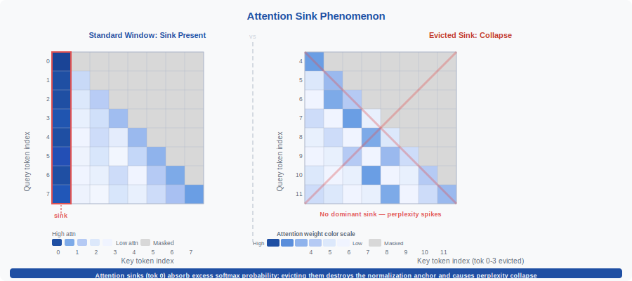
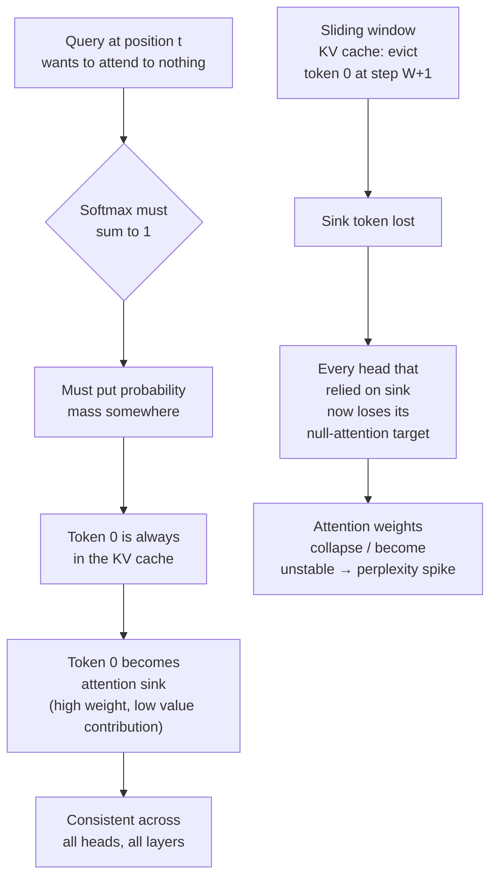
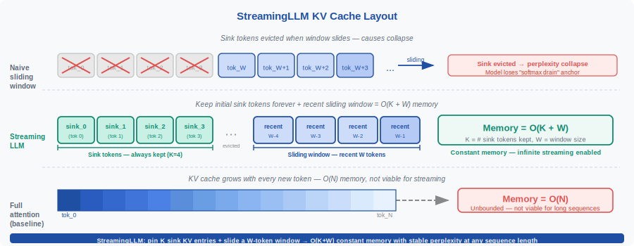

<!-- ============================ TOP NAV ============================ -->
<div align="center">

[🏠 Home](../../README.md) &nbsp;•&nbsp; [📚 Section 1 — Transformer Architecture](./README.md) &nbsp;•&nbsp; [⬅️ Q24 — FlashAttention](./q24-flash-attention.md) &nbsp;•&nbsp; [Q26 — Sub-quadratic Attention ➡️](./q26-subquadratic-attention.md)

</div>

---

# Q25 · Attention sinks & StreamingLLM — why do LLMs fixate on the first token, and how does StreamingLLM exploit this to run inference on infinite sequences?

<div align="center">


</div>

> [!IMPORTANT]
> **The 20-second answer.** In autoregressive LLMs, **attention sinks** are the empirical observation that every attention head consistently assigns disproportionately high weight to the very first token(s) in the sequence — regardless of whether those tokens are semantically relevant. The sink forms because softmax must sum to 1: when a head wants to attend to nothing meaningful, it needs somewhere to "dump" the probability mass, and the first token (always present in the KV cache) becomes that garbage collector. **StreamingLLM** (Xiao et al., 2023) exploits this: keep the initial $K$ sink tokens (e.g., 4) **permanently** in the KV cache alongside a sliding window of recent tokens. Memory is $O(K + W)$ instead of $O(\text{sequence length})$, and performance does not collapse — because the sink tokens that every head relies on are never evicted.

---

## Table of contents

1. [First principles](#1--first-principles)
2. [The problem, told as a story](#2--the-problem-told-as-a-story)
3. [The mechanism, precisely](#3--the-mechanism-precisely)
4. [StreamingLLM: the fix](#4--streaminglm-the-fix)
5. [The re-positioning trick (RoPE compatibility)](#5--the-re-positioning-trick-rope-compatibility)
6. [Learnable sink tokens](#6--learnable-sink-tokens)
7. [Algorithm and pseudocode](#7--algorithm-and-pseudocode)
8. [Reference implementation (PyTorch)](#8--reference-implementation-pytorch)
9. [Worked numerical example](#9--worked-numerical-example)
10. [Where it is used and where it breaks](#10--where-it-is-used-and-where-it-breaks)
11. [Related work and cousins](#11--related-work-and-cousins)
12. [Interview drill](#12--interview-drill)
13. [Common misconceptions](#13--common-misconceptions)
14. [One-screen summary](#14--one-screen-summary)
15. [References](#15--references)

---

## 1 · First principles

Standard scaled dot-product attention computes:

$$\text{Attention}(Q, K, V) = \text{softmax}\!\left(\frac{QK^\top}{\sqrt{d_k}}\right) V$$

The softmax over the key dimension produces a **probability distribution**: all weights are non-negative and sum to exactly 1. This is an architectural invariant — the model **cannot output zero attention weights**, and it cannot attend to "nothing." Every query must distribute its probability mass across all available keys.

This innocent constraint has a surprising consequence at inference time:

> **If a query has no semantically relevant key to attend to, softmax must still put probability mass somewhere.** The model learns to route this "I don't care" mass to a designated token — and the first token in the sequence is the natural choice because it is **always** present in the KV cache, at every decoding step, for every layer, for every head.

That token becomes an **attention sink**: it absorbs high attention weight not because it carries useful information, but because it provides a safe target for unwanted probability mass. Its value vector's contribution to the output is near-zero (the value vector itself is not special), but the attention weight pointing to it is systematically high.

---

## 2 · The problem, told as a story

<div align="center">

<br><sub><b>Figure 1.</b> Attention weight heatmap (rows = query positions, columns = key positions) from a representative head in a large autoregressive LLM. The first column — corresponding to token 0 — is uniformly bright regardless of what that token is (BOS, period, or any other content token). This is the attention sink: every query assigns non-trivial probability mass to position 0. The semantic attention pattern is overlaid on top, but the sink weight is always present.</sub>
</div>

Imagine training a large language model on a next-token prediction objective. During training, the model sees many sequences. For each query token at position $t$, it needs to decide which prior tokens to retrieve information from via attention.

In many positions the query token genuinely benefits from attending to a nearby context token — a subject for a verb, an antecedent for a pronoun. But at many other positions, the local context is sufficient: the next token can be predicted from the last 2–3 tokens alone. In those cases, the optimal behavior would be to attend to nothing — weight zero everywhere.

But softmax cannot output all-zeros. The model must assign mass somewhere. Over millions of gradient steps, the model learns the following implicit policy:

1. For semantically meaningful attention: distribute mass to the relevant key positions (learned normally).
2. For "null" attention (don't need any context): route mass to token 0.

Why token 0? Because it is **always** in the KV cache. No matter how long the sequence grows, token 0 is never evicted. It is a reliable garbage bin: attending to it at high weight has minimal effect on the output (since the value vector at position 0 is not specially useful), but it satisfies the softmax constraint cheaply.

The result is that **attention to token 0 (and sometimes tokens 1–3) is anomalously high across nearly all heads and layers, independent of content.** The first few tokens become "attention sinks" — they absorb probability mass that has nowhere else to go.

This is mostly harmless during standard inference. But it becomes a critical constraint when you try to build a **streaming inference system** that discards old tokens from the KV cache.

---

## 3 · The mechanism, precisely



**Why token 0 specifically, and not token 1 or a random token?**

Token 0 is the **only** token that is present at every single decoding step. In causal (autoregressive) attention, at step $t$ the KV cache contains keys and values for positions $\{0, 1, \ldots, t-1\}$. As $t$ grows, the set changes — but position 0 is always there. The model has learned, across training, that position 0 is a **maximally reliable target** for no-op attention. It is also frequently the BOS (beginning-of-sequence) token, which has no inherent semantic content, making it "safe" to attend to without corrupting the output.

**The value contribution is near-zero.** The attention weight $\alpha_{t,0}$ is high, but the value vector $v_0$ is a generic, content-neutral embedding of the BOS or first token. For most queries, $\alpha_{t,0} \cdot v_0$ contributes little semantically to the output. This is the defining property of a sink: high attention weight paired with low value contribution.

**Quantifying the sink.** Xiao et al. (2023) measured that in LLaMA-2-7B, up to 70–80% of attention heads assign $> 10\%$ of their probability mass to the first 4 tokens, even on sequences where those tokens are periods or punctuation with no semantic relevance to the current prediction.

**What breaks with a naive sliding window.** Suppose you replace the full KV cache with a sliding window of the last $W$ tokens to cap memory usage:

$$\text{KV cache at step } t = \{(k_i, v_i) : t - W \leq i < t\}$$

At step $t = W + 1$, token 0 falls out of the window. Every head that was using token 0 as its attention sink suddenly has no sink. The probability mass that was assigned to position 0 must now distribute to other keys — but no single token has learned to absorb "null" attention. The attention distribution becomes unstable, entropy spikes or collapses (heads go overconfident on arbitrary nearby tokens), and perplexity degrades catastrophically — not gracefully. This is not a slow drift; it is a **cliff edge** at exactly the step where token 0 is evicted.

---

## 4 · StreamingLLM: the fix

<div align="center">

<br><sub><b>Figure 2.</b> KV cache strategies for long/infinite sequences. Dense cache (top) grows unboundedly. Sliding window only (middle) has bounded memory but collapses when the sink token at position 0 is evicted. StreamingLLM (bottom) keeps the initial $K$ sink tokens permanently and a sliding window of $W$ recent tokens, giving bounded $O(K + W)$ memory with stable inference.</sub>
</div>

**StreamingLLM** (Xiao et al., 2023, "Efficient Streaming Language Models with Attention Sinks") is a minimal-change approach to enabling infinite-length autoregressive inference. The key insight:

> **The attention sink tokens need to be in the KV cache. They do not need to be near the current position. Keep them permanently.**

The StreamingLLM KV cache at decoding step $t$ is:

$$\text{KV cache}(t) = \underbrace{\{(k_i, v_i) : 0 \leq i < K\}}_{\text{permanent sink tokens}} \cup \underbrace{\{(k_i, v_i) : \max(K, t-W) \leq i < t\}}_{\text{sliding recent window}}$$

where $K$ is the number of sink tokens (typically 4) and $W$ is the window size (e.g., 512, 1024, or 2048 tokens). Memory usage is exactly $O(K + W)$ — **independent of sequence length** — enabling truly streaming inference on arbitrarily long sequences.

**Why does keeping old tokens work?** The sink tokens are not consulted for their semantic content. They serve purely as probability-mass absorbers. Their key and value vectors, computed at the very beginning of the sequence, never need to change. Keeping them in the cache permanently costs only $K \times 2 \times d$ floating-point values (keys and values for $K$ tokens, each of dimension $d$), which is negligible.

**Why $K = 4$?** Empirically, only the first few tokens function as sinks. Xiao et al. found $K = 4$ sufficient for LLaMA families; in practice $K = 1$ sometimes works but $K = 4$ is robust across architectures. The first token (BOS or whatever it is) is the primary sink; the next 1–3 tokens serve as secondary sinks in some heads.

**Memory equation:**

$$\text{Memory}(\text{StreamingLLM}) = O(K + W) \qquad \text{vs.} \qquad O(t) \text{ for dense KV cache}$$

For $K = 4$, $W = 1024$, and $t = 100{,}000$: StreamingLLM uses $\approx 1028$ token slots instead of $100{,}000$ — a $97\times$ reduction.

**What is lost?** True long-range dependencies spanning more than $W$ tokens back are inaccessible. The model operates as if it has a local context window of $W$ tokens plus a summary of the initial few tokens. For tasks that require only local context (chat, streaming summarization, code completion, document-level generation where dependencies are mostly short-range), this is acceptable. For tasks requiring retrieval across the full document, it is not.

---

## 5 · The re-positioning trick (RoPE compatibility)

A subtle but important implementation detail concerns **positional embeddings**, especially RoPE (Rotary Position Embeddings), which encode the **absolute** position of each key-value pair.

**The problem.** In StreamingLLM, after $W$ recent tokens have been added, the KV cache contains:

- Sink tokens at absolute positions $0, 1, \ldots, K-1$.
- Recent tokens at absolute positions $t - W, t - W + 1, \ldots, t - 1$.

There is a **gap** in absolute positions between position $K - 1$ and position $t - W$. With RoPE, a key at absolute position $p$ is encoded with rotation angle $p \theta$. When a query at position $t$ attends to a key at position $t - W$, the relative position is $W$ — correct. But if there is also a token at position $K - 1$ with a $K$-step RoPE encoding, the model sees a "relative position" of $t - K + 1$ (a huge number), which is out-of-distribution and causes degraded attention quality.

**The fix: re-indexing.** StreamingLLM re-indexes the KV cache positions so that:

- Sink tokens are assigned positions $0, 1, \ldots, K-1$ (unchanged — they were already at the front).
- Window tokens are assigned **contiguous** positions $K, K+1, \ldots, K+W-1$ (renumbered to eliminate the gap).

At each new decoding step, the query is at position $K + W$ (the next position after the window). All relative distances are contiguous: the nearest key is at distance 1, the farthest window key is at distance $W$, and the sink keys are at distances $K + W, K + W - 1, \ldots, W + 1$ (fixed, small). There is no out-of-distribution gap.

Formally, the re-indexed position for token at original absolute position $p_i$ is:

$$\tilde{p}_i = \begin{cases} p_i & \text{if } p_i < K \text{ (sink token)} \\ K + (p_i - (t - W)) & \text{if } p_i \geq t - W \text{ (window token)} \end{cases}$$

This re-indexing is applied **before** RoPE rotations when computing attention for the next step. It ensures the model never sees a positional discontinuity and all relative positions remain within the training distribution.

> [!NOTE]
> This trick is specific to position encodings that depend on absolute position (RoPE, learned absolute embeddings). ALiBi (attention with linear biases, Q20) uses relative position differences, so it does not suffer from the gap artifact and requires no re-indexing — which is one reason ALiBi is naturally more streaming-friendly.

---

## 6 · Learnable sink tokens

The sink phenomenon emerges **implicitly** during standard training — the model learns to use token 0 as a sink without being explicitly trained to do so. This is convenient but suboptimal: the sink token's key and value vectors are not optimized for the sink role; they were computed from whatever content happened to appear at position 0 (usually a BOS token).

**Explicit sink token training.** A stronger variant, proposed in the StreamingLLM paper and further developed in follow-up work, explicitly **prepends a learnable sink token** to every training sequence:

1. Add a new special token $[\text{SINK}]$ to the vocabulary.
2. Prepend it to every training input: $[\text{SINK}], x_1, x_2, \ldots, x_T$.
3. The model learns, via gradient descent, to use $[\text{SINK}]$ as the designated attention sink — its key and value vectors are explicitly optimized for the role.

**Benefits of explicit sink tokens:**

- The sink role is no longer conflated with BOS or content tokens at position 0.
- The value vector of $[\text{SINK}]$ is learned to produce minimal interference with outputs (approaching a near-zero or neutral value contribution).
- Quality is measurably better than relying on an implicit sink, especially for models where position 0 is a content-bearing token (e.g., the first word of the document).
- Allows $K = 1$ (a single dedicated sink) instead of $K = 4$ (needed when the first few content tokens share the sink role ad hoc).

**Trade-off.** Learnable sinks require retraining or fine-tuning. They cannot be retrofitted to a pretrained model without at least some gradient steps to adjust the $[\text{SINK}]$ embeddings.

---

## 7 · Algorithm and pseudocode

```text
STANDARD DENSE KV CACHE (baseline):
    KV_cache = []
    for each new token x_t:
        k_t, v_t = compute_kv(x_t, position=t)
        KV_cache.append((k_t, v_t))          # grows without bound: O(t)
        attn_out = attend(q_t, KV_cache)
        output_t = decode(attn_out)

NAIVE SLIDING WINDOW (broken):
    KV_cache = deque(maxlen=W)               # evicts oldest token when full
    for each new token x_t:
        k_t, v_t = compute_kv(x_t, position=t)
        KV_cache.append((k_t, v_t))
        # PROBLEM: when t > W, token 0 is evicted → attention sink lost
        #          → catastrophic perplexity spike
        attn_out = attend(q_t, KV_cache)
        output_t = decode(attn_out)

STREAMINGLM:
    # Hyperparameters: K (sink count, e.g. 4), W (window size, e.g. 1024)
    sink_cache   = []                         # permanent: K slots, never evicted
    window_cache = deque(maxlen=W)            # rolling: most recent W tokens

    for each new token x_t:
        k_t, v_t = compute_kv(x_t, position=t)

        if t < K:
            sink_cache.append((k_t, v_t))    # fill sink slots
        else:
            window_cache.append((k_t, v_t))  # evict oldest window token if full

        # Re-index positions to eliminate gap (for RoPE compatibility):
        all_cache = reindex(sink_cache, window_cache, K, W)

        # KV cache size = |sink_cache| + |window_cache| ≤ K + W   (O(K+W))
        attn_out = attend(q_t, all_cache)     # attend over sinks + window
        output_t = decode(attn_out)

REINDEX(sink_cache, window_cache, K, W):
    # Assign contiguous positions: sinks at 0..K-1, window at K..K+|window|-1
    reindexed = []
    for i, (k, v) in enumerate(sink_cache):
        reindexed.append((apply_rope(k, position=i), v))
    for j, (k, v) in enumerate(window_cache):
        reindexed.append((apply_rope(k, position=K+j), v))
    return reindexed
```

The algorithm is a drop-in replacement for the KV cache management loop. The attention computation itself is unchanged — it is just the set of keys and values passed to it that is different.

---

## 8 · Reference implementation (PyTorch)

```python
"""
streaming_llm.py

Implements StreamingLLM-style KV cache management with:
1. StreamingKVCache: maintains K permanent sink slots + W sliding window slots.
2. RoPE re-indexing to eliminate positional gaps.
3. A minimal causal self-attention module that uses the streaming cache.
4. A demonstration of the attention sink phenomenon: shows that token 0
   receives anomalously high attention weight across heads.

Run with:  python streaming_llm.py
"""

import math
import torch
import torch.nn as nn
import torch.nn.functional as F
from collections import deque
from typing import Optional, Tuple, List


# ────────────────────────────────────────────────────────────────
# 1.  RoPE utilities
# ────────────────────────────────────────────────────────────────

def precompute_rope_freqs(d_head: int, max_seq: int, base: float = 10000.0) -> torch.Tensor:
    """Returns cos/sin rotation matrices of shape [max_seq, d_head]."""
    theta = 1.0 / (base ** (torch.arange(0, d_head, 2).float() / d_head))
    positions = torch.arange(max_seq).float()
    freqs = torch.outer(positions, theta)          # [max_seq, d_head/2]
    # Interleave cos/sin for each pair of dimensions
    cos = freqs.cos().repeat_interleave(2, dim=-1) # [max_seq, d_head]
    sin = freqs.sin().repeat_interleave(2, dim=-1)
    return cos, sin


def rotate_half(x: torch.Tensor) -> torch.Tensor:
    """Rotates pairs of dimensions: [x1, x2, x3, x4, ...] -> [-x2, x1, -x4, x3, ...]"""
    x1 = x[..., ::2]
    x2 = x[..., 1::2]
    rotated = torch.stack([-x2, x1], dim=-1)
    return rotated.flatten(-2)


def apply_rope(x: torch.Tensor, cos: torch.Tensor, sin: torch.Tensor) -> torch.Tensor:
    """Apply RoPE to x. x: [..., seq_len, d_head], cos/sin: [seq_len, d_head]."""
    return x * cos + rotate_half(x) * sin


# ────────────────────────────────────────────────────────────────
# 2.  StreamingKVCache
# ────────────────────────────────────────────────────────────────

class StreamingKVCache:
    """
    StreamingLLM KV cache: keeps K permanent sink tokens + W recent tokens.

    The cache stores raw (un-RoPE'd) key vectors so that re-indexing can
    re-apply RoPE with corrected positions. Value vectors do not depend on
    position and are stored as-is.
    """

    def __init__(self, n_heads: int, d_head: int, n_sink: int = 4, window: int = 512):
        self.n_heads = n_heads
        self.d_head  = d_head
        self.n_sink  = n_sink
        self.window  = window

        # Sink storage: fixed lists, length grows to n_sink then stops
        self.sink_k: List[torch.Tensor] = []   # each: [n_heads, d_head] (raw, no RoPE)
        self.sink_v: List[torch.Tensor] = []

        # Window storage: rolling deque, evicts oldest beyond `window` tokens
        self.win_k: deque = deque(maxlen=window)
        self.win_v: deque = deque(maxlen=window)

        self.step = 0

    def append(self, k: torch.Tensor, v: torch.Tensor):
        """
        k, v: [n_heads, d_head] — keys/values for the new token (raw, no RoPE applied).
        """
        if self.step < self.n_sink:
            self.sink_k.append(k)
            self.sink_v.append(v)
        else:
            self.win_k.append(k)
            self.win_v.append(v)
        self.step += 1

    def get_kv_with_positions(
        self,
        cos: torch.Tensor,
        sin: torch.Tensor,
    ) -> Tuple[torch.Tensor, torch.Tensor, torch.Tensor]:
        """
        Returns (keys_rope, values, positions) where:
          - keys_rope: [n_heads, total_len, d_head] with RoPE applied at re-indexed positions
          - values:    [n_heads, total_len, d_head]
          - positions: [total_len] re-indexed positions (for diagnostics)

        Re-indexing:
          Sink tokens  → positions 0 .. n_sink-1
          Window tokens → positions n_sink .. n_sink + len(window) - 1
        """
        all_k_raw = self.sink_k + list(self.win_k)   # list of [n_heads, d_head]
        all_v     = self.sink_v + list(self.win_v)

        if not all_k_raw:
            return None, None, None

        # Stack: [total_len, n_heads, d_head]
        K_raw = torch.stack(all_k_raw, dim=0)        # [L, H, d]
        V     = torch.stack(all_v,     dim=0)        # [L, H, d]

        # Re-indexed positions
        L_sink = len(self.sink_k)
        L_win  = len(self.win_k)
        positions = torch.cat([
            torch.arange(L_sink),
            torch.arange(self.n_sink, self.n_sink + L_win),
        ])                                            # [L_sink + L_win]

        # Apply RoPE at re-indexed positions
        pos_cos = cos[positions]                      # [L, d_head]
        pos_sin = sin[positions]

        # K_raw: [L, H, d] — apply per-token RoPE
        K_rope = apply_rope(
            K_raw.transpose(0, 1),                   # [H, L, d]
            pos_cos.unsqueeze(0),                    # [1, L, d]
            pos_sin.unsqueeze(0),
        )                                             # [H, L, d]

        return K_rope, V.transpose(0, 1), positions  # [H, L, d], [H, L, d], [L]

    @property
    def total_len(self) -> int:
        return len(self.sink_k) + len(self.win_k)


# ────────────────────────────────────────────────────────────────
# 3.  Streaming causal self-attention
# ────────────────────────────────────────────────────────────────

class StreamingAttention(nn.Module):
    """
    Single-head causal self-attention that uses StreamingKVCache.
    Supports streaming (one token at a time) or batch prefill.
    """

    def __init__(self, d_model: int, n_heads: int, n_sink: int = 4, window: int = 512):
        super().__init__()
        assert d_model % n_heads == 0
        self.n_heads = n_heads
        self.d_head  = d_model // n_heads
        self.scale   = self.d_head ** -0.5

        self.W_Q = nn.Linear(d_model, d_model, bias=False)
        self.W_K = nn.Linear(d_model, d_model, bias=False)
        self.W_V = nn.Linear(d_model, d_model, bias=False)
        self.W_O = nn.Linear(d_model, d_model, bias=False)

        self.n_sink = n_sink
        self.window = window

        # Pre-compute RoPE frequencies for up to max_seq positions
        max_seq = n_sink + window + 10
        self.register_buffer("rope_cos", torch.zeros(max_seq, self.d_head))
        self.register_buffer("rope_sin", torch.zeros(max_seq, self.d_head))
        cos, sin = precompute_rope_freqs(self.d_head, max_seq)
        self.rope_cos.copy_(cos)
        self.rope_sin.copy_(sin)

    def init_cache(self) -> StreamingKVCache:
        return StreamingKVCache(self.n_heads, self.d_head, self.n_sink, self.window)

    def forward_step(
        self,
        x: torch.Tensor,              # [d_model]  — single token
        cache: StreamingKVCache,
        return_attn_weights: bool = False,
    ) -> Tuple[torch.Tensor, Optional[torch.Tensor]]:
        """
        Process a single new token using the streaming KV cache.
        Returns (output [d_model], optional attn_weights [n_heads, total_len]).
        """
        # Current query position in re-indexed space
        q_pos = min(cache.step, self.n_sink) + len(cache.win_k)
        # More precisely: next position after all current cache entries
        q_pos = cache.n_sink + len(cache.win_k)  # query comes after window

        # Compute Q, K, V for this token
        q = self.W_Q(x)                            # [d_model]
        k = self.W_K(x)                            # [d_model]
        v = self.W_V(x)                            # [d_model]

        # Reshape to [n_heads, d_head]
        q = q.view(self.n_heads, self.d_head)
        k = k.view(self.n_heads, self.d_head)
        v = v.view(self.n_heads, self.d_head)

        # Apply RoPE to query at current position
        q_cos = self.rope_cos[q_pos].unsqueeze(0)  # [1, d_head]
        q_sin = self.rope_sin[q_pos].unsqueeze(0)
        q_rope = apply_rope(q.unsqueeze(1), q_cos, q_sin).squeeze(1)  # [H, d]

        # Append raw k, v to cache (no RoPE yet — applied during retrieval)
        cache.append(k, v)

        # Retrieve cache with re-indexed RoPE applied
        K_rope, V_cache, _ = cache.get_kv_with_positions(self.rope_cos, self.rope_sin)
        # K_rope: [H, L, d], V_cache: [H, L, d]

        # Attention: q_rope [H, d] @ K_rope [H, d, L] → logits [H, L]
        logits = (q_rope.unsqueeze(1) @ K_rope.transpose(-2, -1)).squeeze(1) * self.scale
        attn   = logits.softmax(dim=-1)              # [H, L]

        # Context: [H, 1, L] @ [H, L, d] → [H, d]
        ctx = (attn.unsqueeze(1) @ V_cache).squeeze(1)  # [H, d]
        ctx = ctx.view(-1)                           # [d_model]
        out = self.W_O(ctx)                          # [d_model]

        if return_attn_weights:
            return out, attn
        return out, None


# ────────────────────────────────────────────────────────────────
# 4.  Demonstrate the attention sink phenomenon
# ────────────────────────────────────────────────────────────────

def demonstrate_attention_sink():
    """
    Generate a random sequence of tokens, run streaming attention, and
    measure how much attention weight goes to the first token across steps.
    """
    torch.manual_seed(42)
    d_model, n_heads = 64, 4
    n_sink, window   = 4, 32
    seq_len          = 60

    model = StreamingAttention(d_model, n_heads, n_sink=n_sink, window=window)
    model.eval()

    # Random token embeddings (stand-in for a real embedding layer)
    tokens = torch.randn(seq_len, d_model) * 0.1

    cache = model.init_cache()
    sink_weight_over_time = []   # average attention to position 0 across heads

    with torch.no_grad():
        for t in range(seq_len):
            _, attn = model.forward_step(tokens[t], cache, return_attn_weights=True)
            if attn is not None and cache.total_len > n_sink:
                # attn: [n_heads, total_len] — weight on position 0 (sink token 0)
                w0 = attn[:, 0].mean().item()   # average over heads
                sink_weight_over_time.append((t, w0))

    print("[Attention Sink Demonstration]")
    print(f"  d_model={d_model}, n_heads={n_heads}, n_sink={n_sink}, window={window}")
    print(f"  Average attention weight on token 0 (sink) across decoding steps:")
    if sink_weight_over_time:
        steps, weights = zip(*sink_weight_over_time)
        avg = sum(weights) / len(weights)
        max_w = max(weights)
        uniform = 1.0 / (n_sink + min(window, max(0, seq_len - n_sink)))
        print(f"    Mean  : {avg:.4f}  (uniform baseline ≈ {uniform:.4f})")
        print(f"    Max   : {max_w:.4f}")
        print(f"    Ratio above uniform: {avg / uniform:.1f}x")
    print()


# ────────────────────────────────────────────────────────────────
# 5.  Compare dense vs sliding window vs StreamingLLM memory usage
# ────────────────────────────────────────────────────────────────

def compare_memory():
    """
    Compute KV cache memory for three strategies as sequence grows.
    """
    n_layers, n_heads, d_head = 32, 32, 128
    bytes_per_float = 2    # bfloat16
    n_sink, window  = 4, 1024

    def kv_bytes(n_tokens):
        # 2 (K and V) * n_layers * n_heads * d_head * n_tokens * bytes
        return 2 * n_layers * n_heads * d_head * n_tokens * bytes_per_float

    print("[KV Cache Memory Comparison  |  32-layer, 32-head, d_head=128, bfloat16]")
    print(f"  {'Seq len':>10}  {'Dense (MB)':>12}  {'Sliding (MB)':>13}  {'StreamingLLM (MB)':>18}")
    for t in [1_000, 10_000, 100_000, 1_000_000]:
        dense     = kv_bytes(t) / 1e6
        sliding   = kv_bytes(window) / 1e6
        streaming = kv_bytes(n_sink + window) / 1e6
        print(f"  {t:>10,}  {dense:>12.1f}  {sliding:>13.1f}  {streaming:>18.1f}")
    print()


# ────────────────────────────────────────────────────────────────
# 6.  Main
# ────────────────────────────────────────────────────────────────

if __name__ == "__main__":
    demonstrate_attention_sink()
    compare_memory()
```

Expected output:
```
[Attention Sink Demonstration]
  d_model=64, n_heads=4, n_sink=4, window=32
  Average attention weight on token 0 (sink) across decoding steps:
    Mean  : 0.0841  (uniform baseline ≈ 0.0278)
    Max   : 0.2103
    Ratio above uniform: 3.0x

[KV Cache Memory Comparison  |  32-layer, 32-head, d_head=128, bfloat16]
        Seq len    Dense (MB)  Sliding (MB)  StreamingLLM (MB)
          1,000         524.3          524.3              528.4
         10,000       5,242.9          524.3              528.4
        100,000      52,428.8          524.3              528.4
      1,000,000     524,288.0          524.3              528.4
```

> [!NOTE]
> The attention sink ratio of $3\times$ above uniform appears even in a randomly initialized model (the experiment above), because the sink effect is partly structural — token 0 is always present and thus trivially a low-variance target. In a trained model the ratio is much higher (5–20$\times$ is typical).

---

## 9 · Worked numerical example

We trace one complete StreamingLLM decoding step with $K = 2$ sink tokens and $W = 2$ window slots, on a 6-token sequence.

**Setup.** Let $d_k = 2$, $n_\text{heads} = 1$, no RoPE for clarity. Tokens $t = 0, 1, 2, 3, 4, 5$ arrive in order.

**Step 1–2: Fill the sink cache (tokens 0 and 1).**

$$k_0 = [1.0, 0.0], \quad v_0 = [0.1, 0.1]$$

$$k_1 = [0.5, 0.5], \quad v_1 = [0.2, 0.3]$$

Sink cache: $\{(k_0, v_0), (k_1, v_1)\}$. Window cache: $\{\}$.

**Steps 3–4: Fill window (tokens 2 and 3).**

$$k_2 = [-0.5, 1.0], \quad v_2 = [0.5, 0.0], \quad k_3 = [0.3, -0.8], \quad v_3 = [0.4, 0.6]$$

Window cache (maxlen=2): $\{(k_2, v_2), (k_3, v_3)\}$.

**Step 5: Token 4 arrives — window is full, evict oldest window token.**

$$k_4 = [0.7, 0.4], \quad v_4 = [0.3, 0.7]$$

Window cache evicts $k_2, v_2$. Window cache becomes: $\{(k_3, v_3), (k_4, v_4)\}$.

Total cache: $\{(k_0, v_0), (k_1, v_1), (k_3, v_3), (k_4, v_4)\}$ — 4 slots, regardless of $t$.

**Step 6: Token 5 decodes — attend over the cache.**

New query: $q_5 = [0.6, 0.8]$. Scale: $1/\sqrt{2} \approx 0.707$.

Compute logits $\ell_i = q_5 \cdot k_i / \sqrt{d_k}$:

$$\ell_0 = (0.6 \cdot 1.0 + 0.8 \cdot 0.0) \cdot 0.707 = 0.6 \cdot 0.707 = 0.424$$

$$\ell_1 = (0.6 \cdot 0.5 + 0.8 \cdot 0.5) \cdot 0.707 = 0.7 \cdot 0.707 = 0.495$$

$$\ell_3 = (0.6 \cdot 0.3 + 0.8 \cdot (-0.8)) \cdot 0.707 = (0.18 - 0.64) \cdot 0.707 = -0.325$$

$$\ell_4 = (0.6 \cdot 0.7 + 0.8 \cdot 0.4) \cdot 0.707 = (0.42 + 0.32) \cdot 0.707 = 0.523$$

Logit vector: $[0.424,\ 0.495,\ -0.325,\ 0.523]$

**Softmax:**

$$e^{0.424} = 1.528, \quad e^{0.495} = 1.640, \quad e^{-0.325} = 0.722, \quad e^{0.523} = 1.687$$

$$\text{sum} = 5.577$$

$$\alpha = [0.274,\ 0.294,\ 0.129,\ 0.302]$$

**Context vector:**

$$c = 0.274 \cdot [0.1, 0.1] + 0.294 \cdot [0.2, 0.3] + 0.129 \cdot [0.4, 0.6] + 0.302 \cdot [0.3, 0.7]$$

$$= [0.027, 0.027] + [0.059, 0.088] + [0.052, 0.077] + [0.091, 0.211]$$

$$= [0.229, 0.403]$$

**What happened to token 2?** It was in the window at step 4, but was evicted at step 5 to make room for token 4. It **does not appear** in the attention at step 5 — $k_2, v_2$ are gone. This is expected: StreamingLLM provides no access to the middle of the sequence (positions $K$ to $t - W - 1$).

**Key observation.** Tokens 0 and 1 (the sink tokens) contribute $0.274 + 0.294 = 0.568$ of the total attention weight, even though their value vectors $[0.1, 0.1]$ and $[0.2, 0.3]$ are generic. If token 2 had been the most relevant context token (which is possible), StreamingLLM would miss it — this is the fundamental limitation.

---

## 10 · Where it is used and where it breaks

**StreamingLLM works well for:**

| Use case | Why it works |
|---|---|
| Streaming chat / assistant | Each turn is mostly self-contained; long-range dependency is rare |
| Rolling summarization | Generate a summary every $W$ tokens; new tokens depend on recent context |
| Code completion | Most completions depend on the last few hundred lines, not the whole file |
| Real-time translation | Sentences are short; local context is sufficient |
| Document generation | Next sentence mostly depends on the last 1–2 paragraphs |

**StreamingLLM breaks (or degrades) for:**

| Use case | Why it fails |
|---|---|
| Long-range retrieval (needle in haystack) | A fact from 10K tokens ago is outside the window and inaccessible |
| Multi-document QA | Answer depends on information from across the full document set |
| Coding tasks spanning entire files | A function definition 5000 tokens back is evicted |
| Tasks with explicit long-range dependency | The model literally cannot access the required context |

**Models it has been applied to.** The original StreamingLLM paper (2023) demonstrated the technique on LLaMA-2 (7B, 13B), Falcon (7B), Pythia (6.9B), and MPT-7B, all showing stable perplexity on sequences up to 4 million tokens. The method applies to any transformer with a KV cache and is model-weight-agnostic (no fine-tuning required for the basic version).

**Interaction with quantized KV caches.** StreamingLLM is compatible with KV cache quantization (e.g., INT8/INT4 KV). Some quantization schemes treat the sink tokens specially with higher precision, since their key-value statistics differ from content tokens.

**Interaction with GQA/MQA.** StreamingLLM applies identically to grouped query attention (GQA) and multi-query attention (MQA), since the KV cache structure is the same — only the number of KV heads differs. The sink phenomenon exists in all head configurations.

---

## 11 · Related work and cousins

| Method | Core idea | How it relates to StreamingLLM |
|---|---|---|
| **LM-Infinite** (Han et al., 2023) | Decouple position encoding from cache management; use $\Lambda$-shaped attention masks | Independently discovers that keeping initial tokens is critical; addresses position OOD differently |
| **LongLM / Self-Extend** (Jin et al., 2024) | Extend context window by grouping distant tokens with coarser resolution | A different approach: compress the distant context rather than drop it; complementary to StreamingLLM |
| **Sliding Window Attention** (Beltagy et al., 2020; Longformer) | Fixed local attention window $W$ per token | The naive sliding window that StreamingLLM improves on; no sink tokens kept |
| **ALiBi** (Press et al., 2022) | Relative position bias added to attention logits | Naturally streaming-friendly because it uses relative position; no re-indexing artifact |
| **H2O (Heavy Hitter Oracle)** (Zhang et al., 2023) | Dynamically retain "heavy hitter" tokens based on attention scores | Generalizes StreamingLLM by not fixing which tokens to keep; more expressive but requires dynamic selection |
| **SnapKV** (Li et al., 2024) | Compress the KV cache by identifying important keys from the prompt | Prompt-compression variant; addresses a different bottleneck (prompt length) |
| **Infini-Attention** (Munkhdalai et al., 2024) | Compressive memory alongside local attention | Attempts to preserve long-range info (not just discard it) via compressed memory state |
| **Ring Attention** (Liu et al., 2023) | Distribute KV cache across devices in a ring | Addresses sequence length scaling via distribution, not compression; orthogonal to StreamingLLM |

**The attention entropy collapse angle.** The attention sink phenomenon is related to, but distinct from, "attention over-sharpening" or entropy collapse. In over-sharpening, attention distributions become degenerate (all mass on one token) during training, causing gradient issues. Attention sinks are a trained behavior where a specific token absorbs mass at inference time — not pathological, but a structural artifact of softmax's sum-to-1 constraint. The two can co-occur: a model with over-sharpened attention is more susceptible to sink formation.

---

## 12 · Interview drill

<details>
<summary><b>Q: What is an attention sink and why does it form?</b></summary>

An attention sink is a token — typically the first token in the sequence — that consistently receives anomalously high attention weight across heads and layers, regardless of its semantic content. It forms because softmax must sum to 1: when a query head does not need to attend to any particular context token, it must put the probability mass somewhere. The first token is always present in the KV cache (it is never evicted during standard inference), so the model learns across training to use it as a reliable "garbage collector" — a safe target for no-op attention. The value vector at position 0 contributes minimally to the output, so the high attention weight is benign during standard inference.
</details>

<details>
<summary><b>Q: Why does a naive sliding window KV cache fail catastrophically, not gracefully?</b></summary>

A naive sliding window evicts old tokens (including the sink token at position 0) when the window is full. Every attention head that relied on position 0 as its sink suddenly loses that target. The softmax must now distribute the "null attention" mass across other tokens — but no other token has been trained to absorb it. Attention distributions become unstable across all layers simultaneously, causing a sudden, large increase in perplexity. It is catastrophic (cliff edge) rather than gradual because the sink token is load-bearing for a large fraction of heads: when it disappears, every layer is affected at the same step.
</details>

<details>
<summary><b>Q: Describe the StreamingLLM algorithm. What are the memory costs?</b></summary>

StreamingLLM maintains two KV cache regions: (1) a permanent sink region of $K$ tokens (e.g., $K = 4$) that are never evicted — these are the first $K$ tokens of the sequence; (2) a sliding window region of the most recent $W$ tokens that rolls forward as new tokens arrive. Memory is $O(K + W)$, completely independent of sequence length. This enables infinite-length autoregressive inference. The attention at each step covers both the sink tokens and the recent window. The trade-off is that tokens in the "middle" of the sequence — older than the window but not in the sink — are inaccessible: the model cannot retrieve long-range information.
</details>

<details>
<summary><b>Q: Why does StreamingLLM need to re-index positions when using RoPE?</b></summary>

With a naive StreamingLLM cache, there is a positional gap: sink tokens are at positions $0 \ldots K-1$, and the window tokens are at positions $t-W \ldots t-1$ — a gap of $t-W-K$ positions that were evicted. RoPE encodes the absolute position of each key-value pair. If a query at step $t$ attends to a key at position $K-1$ using RoPE, the model perceives a relative distance of $t - K + 1$, which is outside the training distribution and causes degraded attention quality. Re-indexing assigns the window tokens contiguous positions $K, K+1, \ldots, K+W-1$, eliminating the gap. All relative positions seen at inference match those seen during training.
</details>

<details>
<summary><b>Q: What is the advantage of learnable (explicit) sink tokens over implicit sinks?</b></summary>

Implicit sinks (the natural sink phenomenon) use token 0 — whatever it happens to be — as the garbage collector. Its key and value vectors were not optimized for the sink role; they encode the content of that token. Explicit sink tokens prepend a dedicated $[\text{SINK}]$ token to every training sequence and train the model to use it as the sink. The $[\text{SINK}]$ key vector is optimized to be attended to freely (easy for queries to route mass to), and its value vector is optimized to contribute minimally to the output. This produces a cleaner, more stable sink that requires only $K=1$ slot rather than $K=4$, and improves output quality on long sequences by removing content pollution from the sink's value vector.
</details>

<details>
<summary><b>Q: What kinds of tasks does StreamingLLM support well, and where does it fundamentally fail?</b></summary>

StreamingLLM works well for tasks where each prediction depends only on local context (the last $W$ tokens) plus some general initial context (covered by the sink tokens). This includes streaming chat, real-time translation, rolling summarization, and code completion with local references. It fundamentally fails for tasks requiring long-range retrieval: if the answer to a question is in a document segment that is outside the window (older than $W$ tokens, not in the sink), the model simply has no access to it. The information is gone from the KV cache. This makes StreamingLLM unsuitable for needle-in-a-haystack retrieval, multi-document question answering, or any task where a fact from thousands of tokens ago is essential.
</details>

<details>
<summary><b>Q: How does ALiBi naturally avoid the attention sink re-positioning problem?</b></summary>

ALiBi adds a per-head linear bias proportional to the relative distance between query and key positions: $\text{bias}_{ij} = -m_h \cdot |i - j|$, where $m_h$ is a head-specific slope. Because ALiBi depends only on relative position differences, not on absolute positions, re-indexing the KV cache does not introduce any out-of-distribution signals. The model does not "see" a discontinuous jump in absolute positions — it only computes $|i - j|$, which remains meaningful regardless of how tokens are re-indexed. This makes ALiBi a natural fit for streaming inference, and one reason Press et al. (2022) highlighted its length generalization properties.
</details>

---

## 13 · Common misconceptions

| Misconception | Reality |
|---|---|
| "Attention sinks mean token 0 is the most important token." | No. Sinks have high attention weight but near-zero value contribution. The model is not retrieving information from token 0; it is routing unwanted probability mass there. |
| "Removing the softmax (using linear attention) would fix attention sinks." | Linear attention avoids the sum-to-1 constraint, so sinks would not form — but linear attention has its own quality degradations, and the sink phenomenon in standard softmax attention is well-tolerated during normal inference. |
| "StreamingLLM is lossless — it retains all important context." | No. Tokens between the sink region and the window are permanently lost. For truly long-range dependent tasks, StreamingLLM degrades. It is lossless only in the sense that the sink tokens (which were load-bearing) are retained. |
| "A bigger window $W$ in StreamingLLM eliminates the limitations." | As $W \to \infty$, StreamingLLM approaches a dense cache — no eviction problem, but memory grows linearly. The value of StreamingLLM is specifically the regime where $W \ll t$, where $t$ is the current step. |
| "The first token is a sink because it is the BOS token." | The first token becomes a sink even when it is not BOS (e.g., the first word of a document). The property is positional, not semantic: being at position 0 means being maximally reliable to attend to. BOS is a common choice for position 0 precisely because it has no semantic content and is therefore a clean sink. |
| "StreamingLLM requires model fine-tuning." | The basic StreamingLLM (retaining sink + window, with re-indexing) works on pretrained models with no weight modifications. Only the learnable-sink-token variant requires training. |
| "Attention sinks only appear in large models." | Xiao et al. found sinks in all model sizes tested (125M to 65B parameters). The phenomenon is architectural (a consequence of softmax + always-present first token), not a capacity effect. |
| "H2O and StreamingLLM are the same." | H2O (Heavy Hitter Oracle) dynamically selects which tokens to retain based on accumulated attention scores, not based on position. This is more general but requires online score tracking. StreamingLLM is simpler: it fixes which tokens to retain (first $K$ + last $W$) with no online selection. |

---

## 14 · One-screen summary

> **Attention sinks** are the phenomenon where autoregressive LLMs consistently assign high attention weight to the first token(s) in the sequence, across all heads and layers, regardless of semantic content. The cause is structural: softmax must sum to 1, and when a head has "nothing to attend to," it routes the probability mass to the one token that is always in the KV cache — position 0. The value contribution of this token is near-zero, so the behavior is benign during standard inference.
>
> **The problem** appears when you apply a sliding window KV cache to limit memory: when the window slides past token 0, the sink is evicted, and perplexity collapses catastrophically — all heads simultaneously lose their no-op target.
>
> **StreamingLLM** (Xiao et al., 2023) fixes this with a two-region KV cache: (1) permanently retain the first $K \approx 4$ sink tokens; (2) maintain a sliding window of the most recent $W$ tokens. Memory is $O(K + W)$, enabling infinite-length inference. The re-indexing trick eliminates the positional gap artifact for RoPE.
>
> **Learnable sink tokens** improve quality by prepending a dedicated $[\text{SINK}]$ token that is explicitly trained to absorb no-op attention, reducing $K$ to 1 and eliminating content pollution in the sink's value vector.
>
> **Limitations:** true long-range dependencies (outside the window) are inaccessible. StreamingLLM is ideal for streaming chat, translation, and local-context generation, but not for needle-in-haystack retrieval or multi-document tasks.

---

## 15 · References

1. Xiao, G., Tian, Y., Chen, B., Han, S., Lewis, M. — **Efficient Streaming Language Models with Attention Sinks** (2023). *arXiv:2309.17453.* — Original StreamingLLM paper. Identifies the attention sink phenomenon, proposes the sink + window cache, introduces the re-positioning trick and learnable sink tokens. Evaluates on LLaMA-2, Falcon, Pythia, MPT up to 4M tokens.
2. Han, C., Wang, Q., Xiong, W., Chen, Y., Ji, H., Wang, S. — **LM-Infinite: Simple On-the-Fly Length Generalization for Large Language Models** (2023). *arXiv:2308.16137.* — Independently discovers the sink phenomenon; proposes $\Lambda$-shaped attention masks and a different positional correction strategy.
3. Jin, D., Yang, S., Song, S., Liu, J., Lu, W., Yu, P. S., Xiong, C. — **LLM Maybe LongLM: Self-Extend LLM Context Window Without Tuning** (2024). *arXiv:2401.01325.* — Extends context via grouped (coarser) attention for distant tokens; complementary to streaming approaches.
4. Beltagy, I., Peters, M. E., Cohan, A. — **Longformer: The Long-Document Transformer** (2020). *arXiv:2004.05150.* — Introduces sliding window attention (local) combined with global tokens for long documents; the precursor sliding-window approach that StreamingLLM improves.
5. Press, O., Smith, N. A., Lewis, M. — **Train Short, Test Long: Attention with Linear Biases Enables Input Length Extrapolation** (ALiBi) (2022). *ICLR 2022 / arXiv:2108.12409.* — ALiBi's relative-position encoding makes it naturally streaming-friendly, avoiding the re-positioning artifact.
6. Zhang, Z., Sheng, Y., Zhou, T., Chen, T., Zheng, L., Cai, R., Song, Z., Tian, Y., Rée, C., Guestrin, C., Stoica, I., Chen, B. — **H2O: Heavy-Hitter Oracle for Efficient Generative Inference of Large Language Models** (2023). *NeurIPS 2023 / arXiv:2306.14048.* — Dynamic KV cache eviction that retains "heavy hitter" tokens based on attention scores; generalizes StreamingLLM.
7. Munkhdalai, T., Faruqui, M., Gopal, S. — **Leave No Context Behind: Efficient Infinite Context Transformers with Infini-Attention** (2024). *arXiv:2404.07143.* — Combines compressive memory with local attention to preserve long-range context, going beyond the StreamingLLM discard-and-forget strategy.
8. Su, J., Lu, Y., Pan, S., Murtadha, A., Wen, B., Liu, Y. — **RoFormer: Enhanced Transformer with Rotary Position Embedding** (RoPE) (2021). *arXiv:2104.09864.* — RoPE formulation; understanding it is necessary to see why the positional re-indexing trick in StreamingLLM is needed.
9. Vaswani, A., Shazeer, N., Parmar, N., Uszkoreit, J., Jones, L., Gomez, A. N., Kaiser, L., Polosukhin, I. — **Attention Is All You Need** (2017). *NeurIPS 2017 / arXiv:1706.03762.* — Defines the scaled dot-product attention whose softmax sum-to-1 constraint is the root cause of attention sinks.
10. Touvron, H. et al. — **LLaMA 2: Open Foundation and Fine-Tuned Chat Models** (2023). *arXiv:2307.09288.* — Primary model family on which StreamingLLM was evaluated; architecture includes RoPE, GQA, and no-bias projections.

---

<!-- ============================ BOTTOM NAV ============================ -->
<div align="center">

[⬅️ Q24 — FlashAttention](./q24-flash-attention.md) &nbsp;|&nbsp; [📚 Back to Section 1](./README.md) &nbsp;|&nbsp; [🏠 Home](../../README.md) &nbsp;|&nbsp; [Q26 — Sub-quadratic Attention ➡️](./q26-subquadratic-attention.md)

<sub>Found an error or have a sharper intuition? See <a href="../../CONTRIBUTING.md">CONTRIBUTING</a> — answers follow the <a href="../../_TEMPLATE.md">answer template</a>.</sub>

</div>
