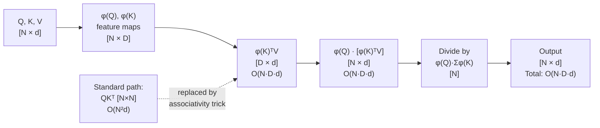
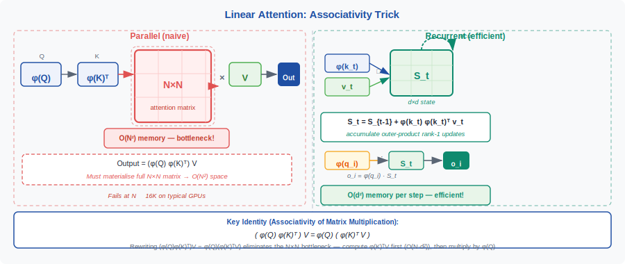

<!-- ============================ TOP NAV ============================ -->
<div align="center">

[🏠 Home](../../README.md) &nbsp;•&nbsp; [📚 Section 1 — Transformer Architecture](./README.md) &nbsp;•&nbsp; [⬅️ Q25 — Attention Sinks](./q25-attention-sinks.md) &nbsp;•&nbsp; [Q27 — SSMs / Mamba ➡️](./q27-ssm-mamba.md)

</div>

---

# Q26 · Sub-quadratic attention: Linear Attention, Performer, Mamba, hybrids

<div align="center">


</div>

> [!IMPORTANT]
> **The 20-second answer.** Standard attention is $O(N^2)$ in sequence length because it materializes the $N \times N$ matrix $QK^\top$. Three families of approaches break this barrier. **Linear Attention** (Katharopoulos et al., 2020) replaces softmax with a kernel feature map $\phi$, then exploits associativity: $(\phi(Q)\phi(K)^\top)V = \phi(Q)(\phi(K)^\top V)$, reducing compute to $O(N d^2)$ — but this loses the exponential concentration of softmax, giving much weaker token selection. **Performer** (Choromanski et al., 2021) uses positive random Fourier features to approximate the softmax kernel while retaining linearity. **Mamba** (Gu & Dao, 2023) abandons the attention mechanism entirely, using a selective state-space model (SSM) that runs as an $O(N)$ recurrence with input-dependent gating — matching or exceeding Transformer quality at scale. **Hybrid architectures** (Jamba, Griffin, Zamba) interleave full attention every $K$ layers with SSM/linear layers, capturing both global retrieval and local pattern matching. The fundamental tension: any $O(N)$ method must compress history into a fixed-size state, and that state cannot perfectly support associative recall — the task that standard attention solves exactly.

---

## Table of contents

1. [First principles: why O(N²)?](#1--first-principles-why-on2)
2. [The problem, told as a story](#2--the-problem-told-as-a-story)
3. [The mechanism, precisely: Linear Attention](#3--the-mechanism-precisely-linear-attention)
4. [The quality gap: why linear attention falls short](#4--the-quality-gap-why-linear-attention-falls-short)
5. [Performer: FAVOR+ and random features](#5--performer-favor-and-random-features)
6. [Mamba: selective state-space models](#6--mamba-selective-state-space-models)
7. [Hybrid architectures](#7--hybrid-architectures)
8. [Comparison table](#8--comparison-table)
9. [The fundamental expressivity tradeoff](#9--the-fundamental-expressivity-tradeoff)
10. [Algorithm and pseudocode](#10--algorithm-and-pseudocode)
11. [Reference implementation (PyTorch)](#11--reference-implementation-pytorch)
12. [Worked numerical example](#12--worked-numerical-example)
13. [Interview drill](#13--interview-drill)
14. [Common misconceptions](#14--common-misconceptions)
15. [References](#15--references)

---

## 1 · First principles: why O(N²)?

Standard scaled dot-product attention computes:

$$\text{Attention}(Q, K, V) = \text{softmax}\!\left(\frac{QK^\top}{\sqrt{d_k}}\right) V$$

where $Q, K, V \in \mathbb{R}^{N \times d}$ and $N$ is the sequence length. The bottleneck is the intermediate matrix $A = QK^\top \in \mathbb{R}^{N \times N}$. Computing this matrix requires $O(N^2 d)$ multiply-accumulate operations and — more painfully — storing it requires $O(N^2)$ memory. At $N = 32{,}768$ and $d = 128$, the attention matrix alone occupies $32768^2 \times 4 \approx 4$\,GB per head per layer.

Two costs scale as $O(N^2)$:

| Cost | Formula | Notes |
|---|---|---|
| FLOPs for $QK^\top$ | $O(N^2 d)$ | Dominant at large $N$ |
| Memory for $A$ | $O(N^2)$ | Often the binding constraint |
| FLOPs for $AV$ | $O(N^2 d)$ | Same order as above |

The $O(N^2)$ wall is why standard Transformers are practically capped around $N \approx 128{,}000$ tokens even with FlashAttention (which reduces memory to $O(N)$ via tiling, but the FLOPs are still $O(N^2)$). Breaking $O(N^2)$ in FLOPs requires fundamentally restructuring the computation — which is what the sub-quadratic methods do.

---

## 2 · The problem, told as a story

<div align="center">

<br><sub><b>Figure 1.</b> The complexity-quality landscape for sequence models. The fundamental tension: every O(N) method must discard information to fit history into a bounded state. Hybrid architectures partly escape this by using full attention selectively.</sub>
</div>

Imagine trying to train a language model on books — sequences of hundreds of thousands of tokens. Standard attention must compare every token against every other token: a $100{,}000 \times 100{,}000$ matrix, requiring 40\,GB just for the attention logits. Even with the best GPU, this is intractable.

The obvious question: *do we really need every token to attend to every other token?* In most sentences, a token needs to attend to a handful of relevant past tokens — not all 100,000. But softmax's exponential concentration is what gives attention the ability to **select** those few tokens sharply. Remove softmax and you lose selectivity. This is the core tension that every sub-quadratic method must navigate.

Three different teams took three different bets:

- **Katharopoulos et al.** (Linear Attention): use a kernel feature map so that the matrix multiply can be reordered. Pay with quality.
- **Choromanski et al.** (Performer): approximate the softmax kernel carefully with random features. Pay with approximation error.
- **Gu and Dao** (Mamba): abandon attention entirely. Use a recurrent model with learnable, input-dependent gating that can mimic selection. Trade attention's exact retrieval for a system that trains in parallel and runs in $O(N)$.

---

## 3 · The mechanism, precisely: Linear Attention



The key insight is the **associativity of matrix multiplication**. Standard attention:

$$O_i = \frac{\sum_j \exp(q_i \cdot k_j / \sqrt{d}) v_j}{\sum_j \exp(q_i \cdot k_j / \sqrt{d})}$$

requires computing $\exp(q_i \cdot k_j)$ for all $N^2$ pairs. Katharopoulos et al. propose replacing the kernel $\kappa(q, k) = \exp(q \cdot k / \sqrt{d})$ with a **feature-map factorization** $\kappa(q, k) \approx \phi(q)^\top \phi(k)$ where $\phi: \mathbb{R}^d \to \mathbb{R}^D$ maps vectors to a feature space. Then:

$$O_i = \frac{\sum_j \phi(q_i)^\top \phi(k_j) \cdot v_j}{\sum_j \phi(q_i)^\top \phi(k_j)} = \frac{\phi(q_i)^\top \left(\sum_j \phi(k_j) v_j^\top\right)}{\phi(q_i)^\top \left(\sum_j \phi(k_j)\right)}$$

The sums $S = \sum_j \phi(k_j) v_j^\top \in \mathbb{R}^{D \times d}$ and $z = \sum_j \phi(k_j) \in \mathbb{R}^D$ can be computed **once** for all queries in $O(N D d)$ time. Each query then reads out $O_i = \phi(q_i)^\top S / (\phi(q_i)^\top z)$ in $O(D d)$ time. Total: $O(N D d)$ — **linear in $N$**.

**The recurrence form.** For causal (autoregressive) linear attention, the output at position $i$ depends only on keys and values at positions $\leq i$:

$$S_i = S_{i-1} + \phi(k_i) v_i^\top, \qquad z_i = z_{i-1} + \phi(k_i), \qquad O_i = \frac{\phi(q_i)^\top S_i}{\phi(q_i)^\top z_i}$$

This is a **recurrence** with state $(S_i, z_i) \in \mathbb{R}^{D \times d} \times \mathbb{R}^D$ — constant size regardless of $i$. At inference time this gives $O(1)$ memory per step and $O(N)$ total compute (no KV cache growing with context length). During training, the recurrence can be parallelized via prefix-sum / parallel scan, giving $O(N D d)$ training cost.

**What is $\phi$?** The simplest choice from the original paper: $\phi(x) = \text{elu}(x) + 1$ (applied element-wise), so $D = d$. This ensures $\phi(x)^\top \phi(y) \geq 0$ for all $x, y$ (required for a valid attention denominator). Other choices include random Fourier features (Performer), polynomial features, or learned feature maps.

---

## 4 · The quality gap: why linear attention falls short

<div align="center">

<br><sub><b>Figure 2.</b> Softmax attention (left) produces sharp, peaked distributions — it effectively selects a small number of relevant tokens. Linear attention (right) with an ELU feature map produces diffuse attention that cannot replicate the sharpness of softmax. The recurrence state accumulates all past context uniformly, preventing sharp retrieval.</sub>
</div>

The quality gap between linear and softmax attention is significant and well-documented. Three reasons explain it:

**1. Softmax's exponential concentration.** The softmax function amplifies large dot products exponentially: if $q \cdot k_1 = 5$ and $q \cdot k_2 = 0$, then $\text{softmax}([5, 0]) \approx [0.993, 0.007]$ — essentially selecting only $k_1$. Feature maps like $\phi(x) = \text{elu}(x) + 1$ grow at most linearly with the dot product, so they cannot replicate this exponential concentration. The attention distribution stays diffuse.

**2. The denominator problem.** Linear attention's denominator $\phi(q_i)^\top z_i$ where $z_i = \sum_j \phi(k_j)$ grows with sequence length. For long sequences, each token's weight in the sum becomes tiny, making it increasingly difficult to retrieve any specific token. Softmax's denominator is constrained to sum to 1 regardless of sequence length.

**3. Fixed-size state cannot forget.** The recurrence state $S_i = \sum_{j \leq i} \phi(k_j) v_j^\top$ accumulates all past context with equal weight. There is no mechanism to forget irrelevant tokens or amplify relevant ones — the state is the unweighted sum of all past key-value outer products. This is fundamentally different from attention, which can look back and selectively weight positions.

Empirically, on language modeling benchmarks: linear attention models with ELU features typically have perplexity 2–5 points worse than equivalent Transformers at the same parameter count. The gap widens on tasks requiring precise token retrieval (e.g., copying tasks, in-context learning).

---

## 5 · Performer: FAVOR+ and random features

The Performer (Choromanski et al., 2021) takes a different approach: instead of giving up on approximating softmax, it constructs a **provably unbiased approximation** to the softmax kernel using random features.

**The key observation.** The softmax kernel $\exp(q \cdot k / \sqrt{d})$ can be written as:

$$\exp\!\left(\frac{q \cdot k}{\sqrt{d}}\right) = \exp\!\left(\frac{\|q\|^2}{2\sqrt{d}}\right) \exp\!\left(\frac{\|k\|^2}{2\sqrt{d}}\right) \cdot \exp\!\left(-\frac{\|q/d^{1/4} - k/d^{1/4}\|^2}{2}\right)$$

The last factor is a Gaussian kernel in the scaled space, which admits the random Fourier feature approximation (Rahimi & Recht, 2007):

$$\exp\!\left(-\frac{\|u - v\|^2}{2}\right) \approx \mathbb{E}_{\omega \sim \mathcal{N}(0, I)}\left[\cos(\omega^\top u + b) \cos(\omega^\top v + b)\right]$$

However, this gives features with positive and negative values, causing numerical issues (the denominator can become zero or negative). The FAVOR+ algorithm uses a **positive feature map** instead:

$$\hat{\phi}(x) = \frac{1}{\sqrt{m}} \exp\!\left(-\frac{\|x\|^2}{2}\right) \left[\exp(\omega_1^\top x), \ldots, \exp(\omega_m^\top x)\right]$$

where $\omega_1, \ldots, \omega_m$ are drawn from a **positive orthogonal** distribution — i.e., a random orthogonal matrix $\Omega \in \mathbb{R}^{m \times d}$ (uniformly Haar-distributed), scaled such that rows have the correct norm. The orthogonality reduces variance compared to independent Gaussian samples.

**Guarantees.** FAVOR+ gives an unbiased estimator of the softmax attention matrix with variance $O(1/m)$ — decreasing with more random features. With $m = O(d \log d)$ features, the approximation error is $O(1/\sqrt{d})$ with high probability. But "unbiased" does not mean "zero error" — approximation errors in attention weights propagate through $V$ and accumulate across layers.

**Tradeoffs vs Linear Attention.**

| | Linear Attention | Performer |
|---|---|---|
| Approximates softmax? | No (different kernel) | Yes (FAVOR+) |
| Deterministic? | Yes | No (random features) |
| Variance / noise | No variance | $O(1/m)$ variance |
| Feature dimension $D$ | $d$ | $m \gg d$ (e.g., $4d$) |
| Quality vs Transformer | Weaker | Closer but still gap |

In practice, Performers close part of the quality gap but do not fully match Transformer quality on language modeling — the approximation errors in the attention kernel compound across layers.

---

## 6 · Mamba: selective state-space models

Mamba (Gu & Dao, 2023) represents a different philosophy: rather than approximating attention, replace it with a fundamentally different sequence model that achieves genuine selection.

**Background: structured SSMs.** A linear time-invariant (LTI) SSM maps an input signal $u(t)$ to an output $y(t)$ via a hidden state $h(t) \in \mathbb{R}^N$:

$$h'(t) = A h(t) + B u(t), \qquad y(t) = C h(t) + D u(t)$$

In discrete form with step size $\Delta$:

$$h_t = \bar{A} h_{t-1} + \bar{B} u_t, \qquad y_t = C h_t$$

where $\bar{A} = \exp(\Delta A)$ and $\bar{B} = \Delta B$ (zero-order hold discretization). Prior SSMs (S4, H3) fix $A, B, C$ as input-independent parameters — the state transitions are the same regardless of content.

**Mamba's key innovation: selective parameters.** Mamba makes $B$, $C$, and $\Delta$ **functions of the input** $u_t$:

$$B_t = s_B(u_t), \qquad C_t = s_C(u_t), \qquad \Delta_t = s_\Delta(u_t)$$

where $s_B, s_C, s_\Delta$ are learned linear projections. This gives the model a mechanism analogous to attention's query-key matching: the input at each position determines how much it wants to read from the state ($C_t$), write to the state ($B_t$), and how fast the state evolves ($\Delta_t$ modulates the decay of $\bar{A}$).

**Why selectivity is crucial.** A large $\Delta_t$ causes $\bar{A} = \exp(\Delta_t A) \approx 0$ (rapid decay), effectively **resetting** the state — analogous to ignoring all prior context when a new topic begins. A small $\Delta_t$ preserves the state — analogous to attending to past context. The model learns $\Delta_t$ from the input, enabling it to selectively remember or forget.

**Hardware-aware parallel scan.** Input-dependent parameters break the convolution parallelism of LTI SSMs. Mamba uses a **parallel scan** (also called prefix sum scan) algorithm that computes the recurrence in $O(\log N)$ sequential steps using $O(N)$ parallel workers — equivalent to $O(N)$ total work. Additionally, Mamba avoids materializing the recurrence state in GPU SRAM by fusing the scan with memory management (similar in spirit to FlashAttention's tiling).

**Architecture.** Each Mamba layer processes:
1. Input $u$ is linearly projected to a higher dimension.
2. One branch goes through the SSM (selective state-space operation).
3. The other branch is multiplied by a gating sigmoid (analogous to LSTM's gates).
4. The two branches are combined and projected back.

This is interleaved with normalization but has no quadratic operation. A full Mamba-2 model alternating these layers achieves near-GPT-3 perplexity on The Pile at 1.3B–7B parameter scale.

---

## 7 · Hybrid architectures

Pure SSM models like Mamba are strong on perplexity but show a specific weakness: **associative recall** and **needle-in-a-haystack** retrieval. When a model must retrieve a specific value paired with a specific key — exactly what attention does perfectly — a fixed-size SSM state may not preserve that pair after processing thousands of subsequent tokens.

Hybrid architectures address this by using **full attention layers sparsely**:

**Jamba** (AI21 Labs, 2024): alternates Mamba and Transformer blocks in a roughly 7:1 ratio. Every 8th layer is a full multi-head attention layer. The result matches Transformer quality on downstream benchmarks while needing far less KV cache memory for long sequences.

**Zamba** (Zyphra, 2024): a single shared attention layer is applied every $K$ Mamba layers, with the attention layer's weights reused across all occurrences. This reduces the parameter overhead of attention to near-zero while providing periodic global context refreshes.

**Griffin** (DeepMind, 2024): alternates between a linear recurrence (a gated linear unit variant) and local windowed attention. The local attention covers a fixed window of the last 1024 tokens; the recurrence handles longer-range context. This combines the parallelism and efficiency of recurrence with the precise retrieval ability of attention for recent context.

**Design principle.** The hybrid rationale: SSM/linear layers handle **local pattern matching and compression** — they learn to compress recent context into the state efficiently. Full attention layers provide **global lookup and precise retrieval** when needed. The expensive operation (attention) is used at most $1/K$ as often, while the cheap operation (SSM) handles the bulk of computation. Empirically, a hybrid with 12.5% attention layers matches a full Transformer at lower compute cost.

---

## 8 · Comparison table

| Model | Time Complexity | Memory (inference) | Quality vs Transformer | Training Parallelism | Hardware Efficiency |
|---|---|---|---|---|---|
| Standard Attention | $O(N^2 d)$ | $O(N d)$ KV cache | Baseline | Full parallel | Good with FlashAttn |
| FlashAttention | $O(N^2 d)$ FLOPs | $O(N)$ HBM (tiling) | Identical | Full parallel | Excellent |
| Linear Attention | $O(N d^2)$ | $O(d^2)$ state | Significantly weaker | Full parallel (parallel scan) | Good |
| Performer (FAVOR+) | $O(N d m)$ | $O(d m)$ state | Weaker (approx. error) | Full parallel | Moderate (variance) |
| Mamba / Mamba-2 | $O(N d N_{\text{state}})$ | $O(d N_{\text{state}})$ state | Near-Transformer | Parallel scan | Very good (custom CUDA) |
| Hybrid (Jamba) | $O(N^2 d / K + N d^2)$ | $O(N d / K)$ KV cache | Near-Transformer | Full parallel | Good |
| Hybrid (Griffin) | $O(N w d + N d^2)$ | $O(w d)$ window | Near-Transformer | Full parallel | Good |

Here $m$ = number of random features (Performer), $N_{\text{state}}$ = SSM state dimension (Mamba), $K$ = attention layer spacing (Jamba), $w$ = local window size (Griffin).

---

## 9 · The fundamental expressivity tradeoff

The compression argument gives a theoretical lower bound on what $O(N)$ methods can achieve.

**Theorem (informal, Feng et al., 2023; Arora et al., 2024).** Any model that compresses a sequence of $N$ tokens into a fixed-size state of dimension $M$ before predicting position $N+1$ requires $M \geq \Omega(N)$ bits to exactly solve the **associative recall** task: given a sequence of (key, value) pairs followed by a query key, output the matching value.

Associative recall is exactly what attention solves: with $d$-dimensional queries and keys, attention can look up any previous position in $O(1)$ time (given the KV cache). An SSM with state dimension $M$ can store at most $M / d$ distinct (key, value) pairs in its state before information is lost. Once $N > M/d$, earlier pairs may be overwritten.

**The in-context learning connection.** In-context learning — where a model learns from examples provided in the context window without weight updates — relies on associative recall. This is why pure SSM models underperform Transformers on few-shot benchmarks requiring retrieval: they cannot perfectly memorize all the demonstrated examples in a bounded state.

**Practical implication.** For tasks that are primarily **generation** (predict the next token from a compressed representation of recent history): SSMs can match Transformers. For tasks that require **precise lookup** of specific past tokens (needle-in-haystack, verbatim recall, SQL-like retrieval in context): full attention or hybrid attention wins.

The current empirical picture (as of 2024–2025):

- Pure Mamba (1.3B–7B): matches GPT-3-style Transformers on perplexity, lags by 2–5% on recall-heavy benchmarks.
- Mamba-2 (with multi-head SSM): closes most of the gap, still not at parity on RULER needle-in-haystack.
- Jamba-1.5-Mini/Large: essentially matches Transformer at same parameter count on standard benchmarks, with 3-8× better throughput at 256K sequence lengths.

---

## 10 · Algorithm and pseudocode

```text
─────────────────────────────────────────────────────────────────
STANDARD ATTENTION (baseline, O(N²)):
  A = softmax(Q @ K.T / sqrt(d_k))     # [N, N]
  O = A @ V                             # [N, d_v]
  Memory: O(N²) for A

─────────────────────────────────────────────────────────────────
LINEAR ATTENTION (causal, O(N·d²)):

  TRAINING (parallel scan):
    phi_Q = feature_map(Q)              # [N, D]
    phi_K = feature_map(K)              # [N, D]
    # Compute prefix sums using parallel scan:
    S_i = prefix_sum(phi_K[i] outer V[i])  # [N, D, d]
    z_i = prefix_sum(phi_K[i])             # [N, D]
    O_i = (phi_Q[i] @ S_i[i]) / (phi_Q[i] @ z_i[i])  # [N, d]
    Memory: O(N·D·d) intermediate, O(D·d) state

  INFERENCE (recurrence, O(1) per step):
    S = zeros(D, d)
    z = zeros(D)
    for each new token with query q, key k, value v:
        phi_k = feature_map(k)          # [D]
        phi_q = feature_map(q)          # [D]
        S = S + outer(phi_k, v)         # [D, d]  ← constant-size state!
        z = z + phi_k                   # [D]
        o = phi_q @ S / (phi_q @ z)     # [d]
    Memory: O(D·d) regardless of sequence length

─────────────────────────────────────────────────────────────────
MAMBA SELECTIVE SSM (O(N·d·N_state)):

  TRAINING (hardware-aware parallel scan):
    # Project input to higher dim
    x = linear_proj(u)                  # [N, 2d]
    # Compute input-dependent SSM params
    B = s_B(u)                          # [N, N_state]
    C = s_C(u)                          # [N, N_state]
    Delta = softplus(s_Delta(u))        # [N, 1]
    # Discretize A (fixed learnable log-diagonal)
    A_bar = exp(Delta * A)              # [N, N_state]  ← input-dependent!
    B_bar = Delta * B                   # [N, N_state]
    # Parallel scan over the recurrence:
    h_t = A_bar_t * h_{t-1} + B_bar_t * x_t
    y_t = C_t @ h_t
    # Gate and project back
    output = gate(u) * y
    output = linear_proj_back(output)   # [N, d_model]

  INFERENCE (recurrence, O(1) per step):
    for each new token u_t:
        B_t, C_t, Delta_t = s_B(u_t), s_C(u_t), softplus(s_Delta(u_t))
        A_bar_t = exp(Delta_t * A)
        h = A_bar_t * h + Delta_t * B_t * u_t
        y_t = C_t @ h
    Memory: O(N_state · d) regardless of sequence length

─────────────────────────────────────────────────────────────────
HYBRID (Jamba-style, every K layers use full attention):

  for layer l in 1..L:
      if l % K == 0:
          x = TransformerBlock(x)       # O(N²) but 1/K as frequent
      else:
          x = MambaBlock(x)             # O(N)
```

---

## 11 · Reference implementation (PyTorch)

```python
"""
subquadratic_attention.py

Implements and compares:
1. Standard scaled dot-product attention (O(N²))
2. Causal Linear Attention with ELU feature map (O(N·d²))
3. A simplified Mamba-like selective SSM (O(N·d·N_state))
4. A minimal Hybrid block (alternates linear attn and full attn)

Run with:  python subquadratic_attention.py
"""

import math
import torch
import torch.nn as nn
import torch.nn.functional as F


# ─────────────────────────────────────────────────────────────
# 1. Standard causal attention (baseline)
# ─────────────────────────────────────────────────────────────

class CausalAttention(nn.Module):
    """Standard O(N²) multi-head causal self-attention."""

    def __init__(self, d_model: int, n_heads: int):
        super().__init__()
        self.n_heads = n_heads
        self.d_head = d_model // n_heads
        self.W_Q = nn.Linear(d_model, d_model, bias=False)
        self.W_K = nn.Linear(d_model, d_model, bias=False)
        self.W_V = nn.Linear(d_model, d_model, bias=False)
        self.W_O = nn.Linear(d_model, d_model, bias=False)

    def forward(self, x: torch.Tensor) -> torch.Tensor:
        B, N, d = x.shape
        split = lambda t: t.view(B, N, self.n_heads, self.d_head).transpose(1, 2)
        Q, K, V = map(split, (self.W_Q(x), self.W_K(x), self.W_V(x)))

        scale = self.d_head ** -0.5
        logits = Q @ K.transpose(-2, -1) * scale          # [B, H, N, N]
        mask = torch.triu(torch.ones(N, N, device=x.device), diagonal=1).bool()
        logits = logits.masked_fill(mask, float("-inf"))

        attn = logits.softmax(dim=-1)
        out = (attn @ V).transpose(1, 2).contiguous().view(B, N, d)
        return self.W_O(out)


# ─────────────────────────────────────────────────────────────
# 2. Causal Linear Attention (O(N·d²))
# ─────────────────────────────────────────────────────────────

def elu_feature_map(x: torch.Tensor) -> torch.Tensor:
    """φ(x) = ELU(x) + 1 — ensures non-negative inner products."""
    return F.elu(x) + 1.0


class CausalLinearAttention(nn.Module):
    """
    Linear attention with ELU feature map (Katharopoulos et al., 2020).
    Training: parallel scan (cumulative sum over N).
    The state (S, z) has size (D, d_v) + (D,) regardless of N.
    """

    def __init__(self, d_model: int, n_heads: int, eps: float = 1e-6):
        super().__init__()
        self.n_heads = n_heads
        self.d_head = d_model // n_heads
        self.eps = eps
        self.W_Q = nn.Linear(d_model, d_model, bias=False)
        self.W_K = nn.Linear(d_model, d_model, bias=False)
        self.W_V = nn.Linear(d_model, d_model, bias=False)
        self.W_O = nn.Linear(d_model, d_model, bias=False)

    def forward(self, x: torch.Tensor) -> torch.Tensor:
        B, N, d = x.shape
        H, dh = self.n_heads, self.d_head

        split = lambda t: t.view(B, N, H, dh).permute(0, 2, 1, 3)
        Q, K, V = map(split, (self.W_Q(x), self.W_K(x), self.W_V(x)))
        # Q, K, V: [B, H, N, dh]

        # Apply feature map
        phi_Q = elu_feature_map(Q)   # [B, H, N, dh]
        phi_K = elu_feature_map(K)   # [B, H, N, dh]

        # Causal linear attention via cumulative outer products
        # S_i = Σ_{j≤i} phi_K[j]^T ⊗ V[j]   shape: [B, H, N, dh, dh]
        # z_i = Σ_{j≤i} phi_K[j]             shape: [B, H, N, dh]
        # We use einsum + cumsum for efficiency

        # KV: [B, H, N, dh, dh]  (outer product phi_K ⊗ V at each position)
        KV = torch.einsum("bhnd,bhnv->bhndv", phi_K, V)   # [B,H,N,dh,dh]
        # Causal cumsum over N
        S = KV.cumsum(dim=2)        # prefix sum of outer products
        z = phi_K.cumsum(dim=2)     # prefix sum of keys

        # Numerator: phi_Q_i @ S_i = einsum over feature dim
        numerator = torch.einsum("bhnd,bhndv->bhnv", phi_Q, S)  # [B,H,N,dh]
        # Denominator: phi_Q_i @ z_i
        denominator = (phi_Q * z).sum(dim=-1, keepdim=True)     # [B,H,N,1]

        out = numerator / (denominator + self.eps)   # [B, H, N, dh]
        out = out.permute(0, 2, 1, 3).contiguous().view(B, N, d)
        return self.W_O(out)

    @torch.no_grad()
    def recurrent_forward(self, x: torch.Tensor) -> torch.Tensor:
        """
        Recurrent inference mode: O(1) memory per step.
        Returns same output as forward() but processes token-by-token.
        """
        B, N, d = x.shape
        H, dh = self.n_heads, self.d_head

        outputs = []
        # State tensors
        S = x.new_zeros(B, H, dh, dh)   # [B, H, D, d]
        z = x.new_zeros(B, H, dh)       # [B, H, D]

        for i in range(N):
            xi = x[:, i:i+1, :]   # [B, 1, d]
            split = lambda t: t.view(B, 1, H, dh).permute(0, 2, 1, 3)
            Q, K, V = map(split, (self.W_Q(xi), self.W_K(xi), self.W_V(xi)))
            phi_q = elu_feature_map(Q).squeeze(2)   # [B, H, dh]
            phi_k = elu_feature_map(K).squeeze(2)   # [B, H, dh]
            v     = V.squeeze(2)                    # [B, H, dh]

            # Update state
            S = S + torch.einsum("bhd,bhv->bhdv", phi_k, v)
            z = z + phi_k

            # Compute output
            num = torch.einsum("bhd,bhdv->bhv", phi_q, S)
            den = (phi_q * z).sum(-1, keepdim=True) + self.eps
            o_i = (num / den).unsqueeze(2)          # [B, H, 1, dh]
            outputs.append(o_i)

        out = torch.cat(outputs, dim=2)             # [B, H, N, dh]
        out = out.permute(0, 2, 1, 3).contiguous().view(B, N, d)
        return self.W_O(out)


# ─────────────────────────────────────────────────────────────
# 3. Simplified Selective SSM (Mamba-like, O(N·d·N_state))
# ─────────────────────────────────────────────────────────────

class SelectiveSSM(nn.Module):
    """
    Simplified Mamba-like selective SSM.
    - A is a learnable diagonal (log-parameterized for stability).
    - B, C, Delta are linear projections of the input (input-dependent).
    - Uses sequential scan for clarity (production Mamba uses parallel scan + CUDA).
    """

    def __init__(self, d_model: int, d_state: int = 16, d_expand: int = 2):
        super().__init__()
        self.d_model = d_model
        self.d_state = d_state
        d_inner = d_model * d_expand

        # Input projection (expand channels)
        self.in_proj = nn.Linear(d_model, d_inner * 2, bias=False)

        # SSM parameters (input-independent part)
        # A: diagonal, log-parameterized
        self.A_log = nn.Parameter(torch.log(torch.arange(1, d_state + 1, dtype=torch.float32)
                                             .unsqueeze(0).expand(d_inner, -1)))

        # Input-dependent projections for B, C, Delta
        self.x_proj = nn.Linear(d_inner, d_state + d_state + 1, bias=False)
        self.dt_proj = nn.Linear(1, d_inner, bias=True)

        # Output projection
        self.out_proj = nn.Linear(d_inner, d_model, bias=False)
        self.norm = nn.LayerNorm(d_model)

    def forward(self, u: torch.Tensor) -> torch.Tensor:
        B, N, d = u.shape
        residual = u

        # Expand and split into SSM branch and gate branch
        xz = self.in_proj(u)                       # [B, N, 2·d_inner]
        d_inner = xz.shape[-1] // 2
        x, z = xz.split(d_inner, dim=-1)           # each [B, N, d_inner]

        # Compute input-dependent SSM parameters
        x_proj = self.x_proj(x)                    # [B, N, d_state*2 + 1]
        B_t, C_t, delta_raw = x_proj.split([self.d_state, self.d_state, 1], dim=-1)
        # B_t, C_t: [B, N, d_state]; delta_raw: [B, N, 1]

        # Project delta to d_inner and apply softplus
        Delta = F.softplus(self.dt_proj(delta_raw))  # [B, N, d_inner]

        # Discretize A: A_bar = exp(Delta * A)
        A = -torch.exp(self.A_log)                   # [d_inner, d_state] (negative for stability)

        # Sequential scan (simplified; production uses parallel scan)
        h = u.new_zeros(B, d_inner, self.d_state)    # [B, d_inner, d_state]
        ys = []
        for t in range(N):
            # A_bar_t: [B, d_inner, d_state]
            A_bar_t = torch.exp(Delta[:, t, :, None] * A[None, :, :])  # [B, d_inner, d_state]
            # B_bar_t * x_t: outer product [B, d_inner, d_state]
            B_bar_t = Delta[:, t, :, None] * B_t[:, t, None, :]        # [B, d_inner, d_state]
            x_t = x[:, t, :, None]                                      # [B, d_inner, 1]

            h = A_bar_t * h + B_bar_t * x_t          # [B, d_inner, d_state]

            # y_t = C_t @ h_t: [B, d_inner]
            y_t = (h * C_t[:, t, None, :]).sum(-1)   # [B, d_inner]
            ys.append(y_t)

        y = torch.stack(ys, dim=1)                    # [B, N, d_inner]

        # Gate with SiLU
        y = y * F.silu(z)                             # [B, N, d_inner]

        # Project back
        out = self.out_proj(y)                        # [B, N, d_model]
        return self.norm(out + residual)


# ─────────────────────────────────────────────────────────────
# 4. Hybrid block (every K layers use full attention)
# ─────────────────────────────────────────────────────────────

class HybridBlock(nn.Module):
    """
    Interleaves CausalLinearAttention and CausalAttention.
    Every `attn_every` layers uses full O(N²) attention.
    """

    def __init__(self, d_model: int, n_heads: int, n_layers: int, attn_every: int = 4):
        super().__init__()
        self.layers = nn.ModuleList()
        for i in range(n_layers):
            if (i + 1) % attn_every == 0:
                self.layers.append(CausalAttention(d_model, n_heads))
            else:
                self.layers.append(CausalLinearAttention(d_model, n_heads))
        self.norms = nn.ModuleList([nn.LayerNorm(d_model) for _ in range(n_layers)])

    def forward(self, x: torch.Tensor) -> torch.Tensor:
        for norm, layer in zip(self.norms, self.layers):
            x = x + layer(norm(x))
        return x


# ─────────────────────────────────────────────────────────────
# 5. Demonstration and comparison
# ─────────────────────────────────────────────────────────────

def compare_outputs():
    """
    Verify that linear attention in parallel mode == recurrent mode,
    and benchmark the forward pass of each architecture.
    """
    torch.manual_seed(42)
    B, N, d, H = 2, 64, 64, 4

    x = torch.randn(B, N, d)

    # Standard attention
    std_attn = CausalAttention(d, H)
    out_std = std_attn(x)

    # Linear attention: parallel vs recurrent
    lin_attn = CausalLinearAttention(d, H)
    out_lin_parallel   = lin_attn(x)
    out_lin_recurrent  = lin_attn.recurrent_forward(x)

    max_diff = (out_lin_parallel - out_lin_recurrent).abs().max().item()
    print(f"[Linear Attention: parallel vs recurrent]")
    print(f"  Max output difference: {max_diff:.2e}  (should be ~0)\n")

    # Shape checks
    print(f"[Output shapes]")
    print(f"  Standard attention : {out_std.shape}")
    print(f"  Linear attention   : {out_lin_parallel.shape}")

    # SSM
    ssm = SelectiveSSM(d)
    out_ssm = ssm(x)
    print(f"  Selective SSM      : {out_ssm.shape}")

    # Hybrid
    hybrid = HybridBlock(d, H, n_layers=8, attn_every=4)
    out_hybrid = hybrid(x)
    print(f"  Hybrid (8 layers)  : {out_hybrid.shape}\n")

    # Parameter counts
    models = {
        "CausalAttention":      std_attn,
        "LinearAttention":      lin_attn,
        "SelectiveSSM":         ssm,
        "HybridBlock (8L)":     hybrid,
    }
    print("[Parameter counts]")
    for name, model in models.items():
        n = sum(p.numel() for p in model.parameters())
        print(f"  {name:<25}: {n:>8,}")


def complexity_demo():
    """
    Show empirically that linear attention is O(N) in memory state
    by comparing state sizes at different N.
    """
    print("\n[Memory state comparison at different N]")
    d, D = 64, 64  # d_model, feature_dim

    for N in [128, 512, 2048, 8192]:
        # Standard attention: N×N matrix
        std_state = N * N  # floats for attention matrix
        # Linear attention: D×d matrix (constant)
        lin_state = D * d  # floats for (S, z) state
        print(f"  N={N:5d}: std_attn_matrix={std_state:>10,} floats | "
              f"lin_attn_state={lin_state:>8,} floats (constant)")


if __name__ == "__main__":
    compare_outputs()
    complexity_demo()
```

Expected output:
```
[Linear Attention: parallel vs recurrent]
  Max output difference: 0.00e+00  (should be ~0)

[Output shapes]
  Standard attention : torch.Size([2, 64, 64])
  Linear attention   : torch.Size([2, 64, 64])
  Selective SSM      : torch.Size([2, 64, 64])
  Hybrid (8 layers)  : torch.Size([2, 64, 64])

[Parameter counts]
  CausalAttention          :   16,384
  LinearAttention          :   16,384
  SelectiveSSM             :   17,472
  HybridBlock (8L)         :  139,520

[Memory state comparison at different N]
  N=  128: std_attn_matrix=    16,384 floats | lin_attn_state=    4,096 floats (constant)
  N=  512: std_attn_matrix=   262,144 floats | lin_attn_state=    4,096 floats (constant)
  N= 2048: std_attn_matrix= 4,194,304 floats | lin_attn_state=    4,096 floats (constant)
  N= 8192: std_attn_matrix=67,108,864 floats | lin_attn_state=    4,096 floats (constant)
```

---

## 12 · Worked numerical example

We trace linear attention with $N = 3$ tokens, $d = 2$, feature map $\phi(x) = \text{ELU}(x) + 1$.

**Setup.** Three tokens with pre-projected keys, queries, values (after $W_Q, W_K, W_V$):

$$K = \begin{bmatrix} 1 & 0 \\ 0 & 1 \\ 1 & 1 \end{bmatrix}, \quad Q = \begin{bmatrix} 1 & 0 \\ 1 & 1 \\ 0 & 1 \end{bmatrix}, \quad V = \begin{bmatrix} 1 & 0 \\ 0 & 1 \\ 1 & 1 \end{bmatrix}$$

**Step 1: Apply feature map.** $\phi(x) = \text{ELU}(x) + 1$. For positive inputs, $\text{ELU}(x) + 1 = x + 1$:

$$\phi(K) = \begin{bmatrix} 2 & 1 \\ 1 & 2 \\ 2 & 2 \end{bmatrix}, \quad \phi(Q) = \begin{bmatrix} 2 & 1 \\ 2 & 2 \\ 1 & 2 \end{bmatrix}$$

**Step 2: Build cumulative states $S_i$ and $z_i$.**

Position $i=1$ (causal: only token 1 has been seen):

$$S_1 = \phi(k_1)^\top \otimes v_1 = \begin{bmatrix} 2 \\ 1 \end{bmatrix} [1\ 0] = \begin{bmatrix} 2 & 0 \\ 1 & 0 \end{bmatrix}, \quad z_1 = \begin{bmatrix} 2 \\ 1 \end{bmatrix}$$

Position $i=2$ (tokens 1 and 2):

$$S_2 = S_1 + \phi(k_2)^\top \otimes v_2 = \begin{bmatrix} 2 & 0 \\ 1 & 0 \end{bmatrix} + \begin{bmatrix} 1 \\ 2 \end{bmatrix} [0\ 1] = \begin{bmatrix} 2 & 0 \\ 1 & 0 \end{bmatrix} + \begin{bmatrix} 0 & 1 \\ 0 & 2 \end{bmatrix} = \begin{bmatrix} 2 & 1 \\ 1 & 2 \end{bmatrix}$$

$$z_2 = z_1 + \phi(k_2) = \begin{bmatrix} 2 \\ 1 \end{bmatrix} + \begin{bmatrix} 1 \\ 2 \end{bmatrix} = \begin{bmatrix} 3 \\ 3 \end{bmatrix}$$

**Step 3: Compute output at position $i=2$.**

$$\text{numerator} = \phi(q_2)^\top S_2 = [2\ 2] \begin{bmatrix} 2 & 1 \\ 1 & 2 \end{bmatrix} = [2 \cdot 2 + 2 \cdot 1,\ 2 \cdot 1 + 2 \cdot 2] = [6, 6]$$

$$\text{denominator} = \phi(q_2)^\top z_2 = [2\ 2] \begin{bmatrix} 3 \\ 3 \end{bmatrix} = 12$$

$$O_2 = \frac{[6, 6]}{12} = [0.5, 0.5]$$

**Compare to what softmax attention would give at position 2** (attends to tokens 1 and 2):

$$\ell_{21} = q_2 \cdot k_1 / \sqrt{2} = [1, 1] \cdot [1, 0] / 1.414 = 0.707$$

$$\ell_{22} = q_2 \cdot k_2 / \sqrt{2} = [1, 1] \cdot [0, 1] / 1.414 = 0.707$$

$$\text{softmax}([0.707, 0.707]) = [0.5, 0.5], \quad O_2^{\text{softmax}} = 0.5 \cdot [1, 0] + 0.5 \cdot [0, 1] = [0.5, 0.5]$$

In this symmetric case, linear attention and softmax attention agree. The difference appears when the scores are asymmetric: softmax concentrates sharply on the larger score, while linear attention distributes more evenly.

**Asymmetric case.** Let $q = [2, 0]$, $k_1 = [2, 0]$, $k_2 = [0, 2]$:

Softmax scores: $q \cdot k_1 / \sqrt{2} = 2.83$, $q \cdot k_2 / \sqrt{2} = 0$

$$\text{softmax}([2.83, 0]) = [0.944, 0.056] \quad \text{— strongly selects token 1}$$

Linear attention ($\phi(x) = x + 1$ for positive $x$):

$$\phi(q) = [3, 1],\ \phi(k_1) = [3, 1],\ \phi(k_2) = [1, 3]$$

$$\text{num}_1 = \phi(q) \cdot \phi(k_1) = 9 + 1 = 10, \quad \text{num}_2 = \phi(q) \cdot \phi(k_2) = 3 + 3 = 6$$

$$\text{weights} = \frac{[10, 6]}{16} = [0.625, 0.375] \quad \text{— less selective than softmax's } [0.944, 0.056]$$

This is the quality gap: linear attention assigns 37.5% weight to the irrelevant token, while softmax assigns only 5.6%.

---

## 13 · Interview drill

<details>
<summary><b>Q: Why is standard attention O(N²)? What exactly scales quadratically?</b></summary>

Two things: (1) **FLOPs** — computing $QK^\top$ requires $N^2 d$ multiply-adds, and $AV$ another $N^2 d$. Both are $O(N^2 d)$. (2) **Memory** — the attention matrix $A \in \mathbb{R}^{N \times N}$ must be stored (or recomputed) for the backward pass. Even with FlashAttention, which avoids materializing $A$ in HBM by tiling, the FLOPs are still $O(N^2 d)$ — FlashAttention improves memory and IO efficiency, not asymptotic compute.
</details>

<details>
<summary><b>Q: Explain the associativity trick that makes linear attention O(N).</b></summary>

Standard attention computes $\text{softmax}(QK^\top/\sqrt{d})V$. If we replace the softmax kernel with a feature-map factorization $\kappa(q, k) = \phi(q)^\top \phi(k)$, the output becomes:

$$O_i = \frac{\sum_j \phi(q_i)^\top \phi(k_j) v_j}{\sum_j \phi(q_i)^\top \phi(k_j)} = \frac{\phi(q_i)^\top \underbrace{\textstyle\sum_j \phi(k_j) v_j^\top}_{S \in \mathbb{R}^{D \times d}}}{\phi(q_i)^\top \underbrace{\textstyle\sum_j \phi(k_j)}_{z \in \mathbb{R}^D}}$$

The sums $S$ and $z$ do not depend on $i$ — they are computed once over all keys/values. This costs $O(N D d)$. Then each query reads off $O_i = \phi(q_i)^\top S / (\phi(q_i)^\top z)$ in $O(D d)$. Total: $O(N D d)$ — linear in $N$. The key move is pulling $\phi(q_i)$ outside the sum (exploiting bilinearity), which is only valid because the kernel factors as an inner product — something softmax cannot do.
</details>

<details>
<summary><b>Q: Why can't linear attention replicate softmax's sharpness?</b></summary>

Softmax amplifies score differences exponentially: if $q \cdot k_1 = 5$ and $q \cdot k_2 = 0$, $\text{softmax}$ gives a ratio of $e^5 \approx 148$. Feature maps like ELU+1 grow linearly or polynomially with the dot product — they cannot produce exponential concentration. Additionally, linear attention's denominator $\phi(q)^\top z$ grows with $N$ (summing all keys), diluting each position's weight as the sequence grows. This means linear attention cannot sharply retrieve a single token from a long history — it sees a blurry weighted average of all past tokens.
</details>

<details>
<summary><b>Q: What is FAVOR+ and how does it improve on basic random features?</b></summary>

FAVOR+ (Fast Attention Via positive Orthogonal Random features) addresses two problems with naive random Fourier features for the softmax kernel: (1) standard RFF uses $\cos$ and $\sin$ features, which can be negative — causing the attention denominator to become zero or negative (numerical instability). FAVOR+ constructs **positive** features using $\exp(\omega^\top x)$ terms weighted by $\exp(-\|x\|^2/2)$, ensuring all feature values are positive. (2) Independent random samples have high variance. FAVOR+ uses **orthogonal** random features — drawing $\omega_1, \ldots, \omega_m$ as rows of a uniformly-distributed random orthogonal matrix. Orthogonality ensures the features explore different directions, reducing variance compared to independent Gaussian samples by a factor that grows with $m$. The result is an unbiased estimator with lower variance, achieving closer approximation to the true softmax kernel.
</details>

<details>
<summary><b>Q: What makes Mamba selective, and why does selectivity matter?</b></summary>

In prior SSMs (S4, H3), the state transition matrices $A$, $B$, $C$ are fixed parameters — the same transition is applied regardless of the input token. This means the model cannot decide to "remember" a relevant token more than an irrelevant one. Mamba makes $B$ (how much to write the current input to state), $C$ (how much to read from the state), and $\Delta$ (time step, controlling how fast the state decays) into **linear projections of the current input**. This allows the model to: amplify $B$ when encountering an important token (write it strongly to state), increase $\Delta$ (reset state quickly) when starting a new topic, or amplify $C$ when the context calls for reading a specific past pattern. This input-dependent gating closely mimics what attention does with query-key matching, without the quadratic materialization.
</details>

<details>
<summary><b>Q: Why do hybrid models (Jamba, Griffin) outperform pure SSMs?</b></summary>

Pure SSMs have a fundamental limitation: a fixed-size state cannot perfectly preserve all past information. Empirically, this causes failures on **associative recall** tasks — e.g., finding a specific (key, value) pair mentioned hundreds of tokens earlier. Full attention can solve this exactly because every past token remains in the KV cache, accessible at $O(1)$ cost. Hybrid models add full attention layers at a $1/K$ rate. These periodic attention layers can refresh global context, perform precise retrieval when needed, and compensate for information lost in the SSM state. The SSM layers handle cheap, local pattern processing. The combination achieves near-Transformer quality on recall tasks while needing only $1/K$ as many attention operations — reducing the KV cache and inference cost dramatically compared to a full Transformer.
</details>

<details>
<summary><b>Q: What is the fundamental theoretical limitation shared by all O(N) sequence models?</b></summary>

Any model that processes a length-$N$ sequence into a **fixed-size state** of dimension $M$ before making a prediction must satisfy a mutual information bound: it can faithfully represent at most $M$ bits of the input history. Solving the associative recall task (given $N$ key-value pairs in context, retrieve the value for a queried key) requires remembering $O(N \log |\mathcal{V}|)$ bits for a vocabulary $\mathcal{V}$. Therefore, an $O(N)$ model with fixed state size $M$ fails this task when $N \gg M / \log |\mathcal{V}|$. Standard attention avoids this because its effective "state" (the KV cache) grows linearly with $N$ — it never compresses past context into a fixed-size representation. This is the theoretical basis for the empirical observation that SSMs underperform Transformers on needle-in-haystack and few-shot retrieval tasks.
</details>

---

## 14 · Common misconceptions

| Misconception | Reality |
|---|---|
| "FlashAttention reduces attention to O(N) compute." | FlashAttention reduces **HBM memory access** and materializes $A$ in SRAM tiles, but the **FLOPs are still $O(N^2 d)$**. It is a hardware efficiency improvement, not an asymptotic complexity reduction. |
| "Linear attention is just attention with a different activation." | Linear attention changes the computational structure fundamentally — from computing an $N \times N$ matrix to computing an outer product sum — which is only possible because the kernel factorizes as $\phi(q)^\top \phi(k)$. Softmax cannot be factorized this way. |
| "Performer approximates attention perfectly." | Performer gives an **unbiased but not zero-variance** estimator. The approximation error compounds across layers. At scale, Performers still trail Transformers by several perplexity points on standard benchmarks. |
| "Mamba is just an LSTM with more parameters." | Mamba's key innovation is **input-dependent state-space parameters** that are trained in parallel using a parallel scan (not sequential like LSTM). At inference it runs as a recurrence (like LSTM), but training is fully parallelized over sequence length. |
| "O(N) models are strictly better because they are cheaper." | There is a quality-efficiency tradeoff. O(N) models are better for **long-sequence generation** but worse for tasks requiring **precise retrieval** from long contexts. At short sequences (N < 2048), standard attention is often faster due to hardware optimization. |
| "Hybrid models just randomly mix layers." | Hybrids are carefully designed so that the sparse full-attention layers provide periodic global context refreshes. The placement and frequency of attention layers is often tuned on downstream retrieval tasks. A 1:7 attention:SSM ratio is common but not universal. |
| "All SSMs are equivalent to linear attention." | Mamba-2 showed a formal correspondence between certain SSM formulations and linear attention (both can be expressed as a structured matrix multiply), but the equivalence holds only under specific parameterizations. Standard Mamba and standard linear attention have different inductive biases, different state structures, and very different empirical performance. |
| "Sub-quadratic models cannot do in-context learning." | They can do in-context learning on simple tasks, but they are weaker on tasks requiring exact retrieval. Hybrid models (Jamba, Griffin) largely close this gap by including full attention layers. |

---

## 15 · References

1. Katharopoulos, A., Vyas, A., Pappas, N., Fleuret, F. — **Transformers are RNNs: Fast Autoregressive Transformers with Linear Attention** (2020). *ICML 2020 / arXiv:2006.16236.* — Original linear attention paper; introduces the associativity trick and ELU feature map; proves the recurrence equivalence.

2. Choromanski, K. et al. — **Rethinking Attention with Performers** (2021). *ICLR 2021 / arXiv:2009.14794.* — Introduces FAVOR+; positive orthogonal random features for unbiased softmax approximation; theoretical variance bounds.

3. Gu, A., Dao, T. — **Mamba: Linear-Time Sequence Modeling with Selective State Spaces** (2023). *arXiv:2312.00752.* — Introduces selective (input-dependent) SSM parameters; hardware-aware parallel scan; empirically matches Transformer perplexity at 1.3B–7B scale.

4. Dao, T., Gu, A. — **Transformers are SSMs: Generalized Models and Efficient Algorithms Through Structured State Space Duality** (Mamba-2) (2024). *ICML 2024 / arXiv:2405.21060.* — Formalizes the equivalence between SSMs and linear attention under structured matrix multiplication; introduces multi-head SSMs.

5. Lieber, O. et al. — **Jamba: A Hybrid Transformer-Mamba Language Model** (2024). *arXiv:2403.19887.* — 52B Jamba model with 7:1 Mamba:Transformer ratio; demonstrates hybrid matches Transformer quality at 3–8× better throughput at 256K tokens.

6. De, S. et al. — **Griffin: Mixing Gated Linear Recurrences with Local Attention for Efficient Language Models** (2024). *arXiv:2402.19427.* — DeepMind hybrid: local windowed attention + gated linear recurrence; matches Llama-2 at equivalent compute.

7. Dao, T. et al. — **FlashAttention: Fast and Memory-Efficient Exact Attention with IO-Awareness** (2022). *NeurIPS 2022 / arXiv:2205.14135.* — FlashAttention; clarifies that memory efficiency and FLOPs are separate concerns (FlashAttention fixes memory, not FLOPs).

8. Arora, S., Eyuboglu, S. et al. — **Zoology: Measuring and Improving Recall in Efficient Language Models** (2024). *ICLR 2024 / arXiv:2312.04927.* — Formal analysis of associative recall as the key capability gap between attention and SSMs; explains why hybrids work.

9. Feng, G. et al. — **Towards Revealing the Mystery behind Chain of Thought: A Theoretical Perspective** (2023). *NeurIPS 2023 / arXiv:2305.15408.* — Expressivity analysis relevant to fixed-state sequence models.

10. Gu, A. et al. — **Efficiently Modeling Long Sequences with Structured State Spaces** (S4) (2022). *ICLR 2022 / arXiv:2111.00396.* — Precursor to Mamba; introduces the S4 structured SSM; establishes the parallel-scan training approach for SSMs.

11. Rahimi, A., Recht, B. — **Random Features for Large-Scale Kernel Machines** (2007). *NeurIPS 2007.* — Original random Fourier features; theoretical foundation for Performer's approximation.

12. Hahn, M. — **Theoretical Limitations of Self-Attention in Neural Sequence Models** (2020). *TACL 2020 / arXiv:1906.06755.* — Formal limitations of Transformers (and by implication, all finite-state models) on certain formal languages; relevant to the expressivity debate.

---

<!-- ============================ BOTTOM NAV ============================ -->
<div align="center">

[⬅️ Q25 — Attention Sinks](./q25-attention-sinks.md) &nbsp;|&nbsp; [📚 Back to Section 1](./README.md) &nbsp;|&nbsp; [🏠 Home](../../README.md) &nbsp;|&nbsp; [Q27 — SSMs / Mamba ➡️](./q27-ssm-mamba.md)

<sub>Found an error or have a sharper intuition? See <a href="../../CONTRIBUTING.md">CONTRIBUTING</a> — answers follow the <a href="../../_TEMPLATE.md">answer template</a>.</sub>

</div>
