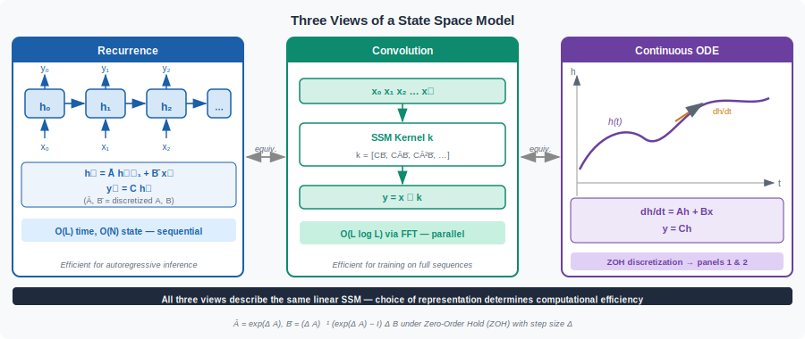
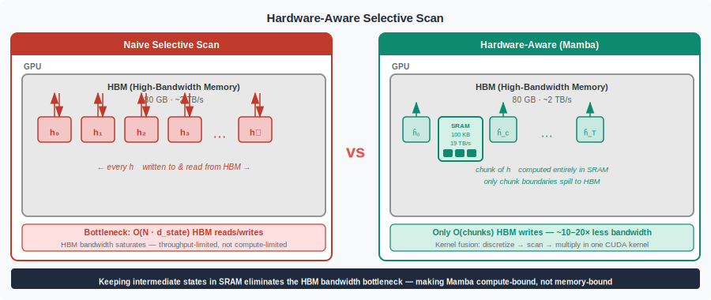

<!-- ============================ TOP NAV ============================ -->
<div align="center">

[🏠 Home](../../README.md) &nbsp;•&nbsp; [📚 Section 1 — Transformer Architecture](./README.md) &nbsp;•&nbsp; [⬅️ Q26 — Sub-quadratic Attention](./q26-subquadratic-attention.md) &nbsp;•&nbsp; [Q28 — Expressivity Gap ➡️](./q28-expressivity-gap.md)

</div>

---

# Q27 · SSMs: selective scan; Mamba-2 and State Space Duality

<div align="center">


</div>

> [!IMPORTANT]
> **The 30-second answer.** Classic structured state-space models (SSMs, e.g. S4) achieve linear-time inference by maintaining a fixed hidden state $h_t = A h_{t-1} + B x_t$, $y_t = C h_t$, where $A$, $B$, $C$ are **input-independent** matrices — making them Linear Time-Invariant (LTI) systems that can be unrolled into a convolution and trained in $O(N \log N)$ via FFT. The fundamental limitation is that LTI systems cannot **select** which context to remember: they apply the same dynamics to every token regardless of content. **Mamba** (Gu & Dao, 2023) breaks LTI by making $B_t$, $C_t$, and the discretization step $\Delta_t$ functions of the input, creating a **selective scan** that focuses the state on relevant tokens. Because FFT convolution no longer applies, Mamba uses **parallel prefix scan** (O(N log N) work, highly GPU-parallel) with a hardware-aware tiling strategy that keeps intermediate states in fast SRAM rather than materializing them in HBM. **Mamba-2** (Dao & Gu, 2024) introduces **State Space Duality (SSD)**: for the special case of a scalar-times-identity structured A matrix ($A_t = a_t \mathbf{I}$), the SSM is mathematically equivalent to a form of linear attention, enabling direct use of matrix multiplication kernels and a cleaner unified theory bridging SSMs and Transformers.

---

## Table of contents

1. [First principles: the state-space model](#1--first-principles-the-state-space-model)
2. [The three views of an SSM](#2--the-three-views-of-an-ssm)
3. [HiPPO initialization of A](#3--hippo-initialization-of-a)
4. [The selectivity problem](#4--the-selectivity-problem)
5. [Mamba: input-dependent parameters](#5--mamba-input-dependent-parameters)
6. [Discretization and the ZOH rule](#6--discretization-and-the-zoh-rule)
7. [Hardware-aware selective scan](#7--hardware-aware-selective-scan)
8. [Mamba architecture and gating](#8--mamba-architecture-and-gating)
9. [Mamba-2 and State Space Duality](#9--mamba-2-and-state-space-duality)
10. [SSD: the matrix formulation](#10--ssd-the-matrix-formulation)
11. [Variants and comparison table](#11--variants-and-comparison-table)
12. [Algorithm & pseudocode](#12--algorithm--pseudocode)
13. [Reference implementation (PyTorch)](#13--reference-implementation-pytorch)
14. [Worked numerical example](#14--worked-numerical-example)
15. [Where it's used / where it breaks](#15--where-its-used--where-it-breaks)
16. [Cousins & alternatives](#16--cousins--alternatives)
17. [Interview drill](#17--interview-drill)
18. [Common misconceptions](#18--common-misconceptions)
19. [One-screen summary](#19--one-screen-summary)
20. [References](#20--references)

---

## 1 · First principles: the state-space model

A **state-space model (SSM)** describes a dynamical system with a latent state. In the continuous-time formulation:

$$\dot{h}(t) = A\, h(t) + B\, x(t)$$

$$y(t) = C\, h(t) + D\, x(t)$$

where $h(t) \in \mathbb{R}^N$ is the hidden state, $x(t) \in \mathbb{R}$ is the scalar input, $y(t) \in \mathbb{R}$ is the output, $A \in \mathbb{R}^{N \times N}$ is the state transition matrix, $B \in \mathbb{R}^{N \times 1}$ projects input to state, and $C \in \mathbb{R}^{1 \times N}$ projects state to output. The $D$ term is typically a skip connection ($D = 0$ or a scalar) and is often ignored in analysis.

For sequences of discrete tokens we need a **discrete-time** version. Applying Zero-Order Hold (ZOH) discretization with step size $\Delta$ (the time between samples):

$$\bar{A} = e^{\Delta A}, \qquad \bar{B} = (e^{\Delta A} - I) A^{-1} B \approx \Delta B \quad \text{(for small } \Delta \text{)}$$

The discrete recurrence becomes:

$$h_t = \bar{A}\, h_{t-1} + \bar{B}\, x_t$$

$$y_t = C\, h_t$$

This is the core SSM equation. Notice: **$\bar{A}$ and $\bar{B}$ are fixed matrices** — the same at every time step $t$. This is the LTI property that both enables efficient training and limits selectivity.

> [!NOTE]
> In practice, the input $x$ and output $y$ are $D$-dimensional (feature channels). Each channel independently runs its own SSM of state size $N$. The total parameter count for one SSM layer is $O(D \cdot N)$ for $A$ (diagonal), plus $O(D \cdot N)$ for $B$ and $C$, much smaller than the $O(D^2)$ of an attention projection.

---

## 2 · The three views of an SSM

The power of the S4 paper (Gu et al., 2021) lies in recognizing that the discrete SSM has three equivalent views, each optimal for a different computation:

**View 1 — Recurrence (inference, O(N) per step).**

$$h_t = \bar{A}\, h_{t-1} + \bar{B}\, x_t, \qquad y_t = C\, h_t$$

Process one token at a time with constant memory ($N$ state units). Perfect for autoregressive decoding: no KV cache, fixed memory regardless of sequence length.

**View 2 — Convolution (training, O(L log L) via FFT).**

Because $A$, $B$, $C$ are constant, unrolling the recurrence gives a linear convolution:

$$y = \bar{K} * x, \qquad \bar{K} = (C\bar{B},\; C\bar{A}\bar{B},\; C\bar{A}^2\bar{B},\; \ldots,\; C\bar{A}^{L-1}\bar{B})$$

The kernel $\bar{K} \in \mathbb{R}^L$ can be applied via FFT in $O(L \log L)$ — identical to causal convolution. During training, the entire sequence can be processed in parallel exactly like a Transformer (without causal masking overhead).

**View 3 — Continuous ODE (theoretical grounding).**

The continuous equation $\dot{h}(t) = A h(t) + B x(t)$ is a first-order linear ODE. Its solution is:

$$h(t) = e^{At} h(0) + \int_0^t e^{A(t-s)} B\, x(s)\, ds$$

This is the system's **impulse response** — it shows that $y(t)$ is a continuous-time convolution of $x$ with the kernel $C e^{At} B$. The discrete kernel $\bar{K}$ is a sampled version of this continuous kernel.

<div align="center">

<br><sub><b>Figure 1.</b> The two computational views of a classic (LTI) SSM. <b>Left:</b> the recurrence is sequential — process one token at a time with O(N) memory. Ideal for inference. <b>Right:</b> unrolling gives a causal convolution with fixed kernel <code>K̄</code>; apply via FFT in O(L log L). Ideal for training. Both views are exactly equivalent when A, B, C are input-independent.</sub>
</div>

---

## 3 · HiPPO initialization of A

The state matrix $A$ determines what the model "remembers." A random $A$ leads to either exponential forgetting or explosion. The key insight of HiPPO (High-order Polynomial Projection Operators, Gu et al., 2020) is to initialize $A$ so that the state $h(t)$ **optimally compresses the history $x(\leq t)$** as the coefficients of an orthogonal polynomial basis.

For the Legendre measure (uniform history), the HiPPO-LegS matrix is:

$$A_{nk} = -\begin{cases} (2n+1)^{1/2}(2k+1)^{1/2} & \text{if } n > k \\ n+1 & \text{if } n = k \\ 0 & \text{if } n < k \end{cases}$$

The resulting $A$ is a lower-triangular matrix that, under the ODE dynamics, causes $h(t)$ to evolve so that its $n$-th component tracks the $n$-th Legendre polynomial coefficient of the history. In S4, $A$ is kept **diagonal** via a change of basis (DPLR — diagonal plus low-rank structure), making $e^{\Delta A}$ computable efficiently.

Key takeaway: **HiPPO initialization ensures the model can, in principle, remember arbitrarily long-range dependencies** — subject to state size $N$. Without it, random $A$ leads to rapid forgetting ($|e^{At}| \to 0$).

---

## 4 · The selectivity problem

Classic SSMs (S4, S4D, DSS) use **fixed** $A$, $B$, $C$ matrices — the same parameters applied identically to every position in every sequence. This makes them Linear Time-Invariant (LTI). Being LTI means the **transition kernel is the same regardless of what the input is**.

Consider the task: "Copy the most recent occurrence of the word 'contract' exactly." To do this correctly, the model must:
1. Recognize the token "contract" in the input.
2. Write it into the state with high fidelity.
3. Suppress other tokens from overwriting it.
4. Read it out when needed.

An LTI SSM cannot do step 1–3 because $B$ (which controls what gets written into the state) is **the same vector for every input**. The state update $h_t = \bar{A} h_{t-1} + \bar{B} x_t$ applies the same $\bar{B}$ regardless of whether $x_t$ is "contract" or "the" — both tokens enter the state with equal projection weight. Similarly, $C$ (the read-out) cannot focus on relevant state dimensions based on context.

This has a direct consequence: LTI SSMs struggle on **in-context learning** tasks, **selective copying**, and tasks where the relevant information is context-dependent. Experiments with S4 show it matches or beats Transformers on tasks with long-range structure (e.g., pathfinder, long-range arena) but loses on associative recall benchmarks where the model must selectively bind and retrieve information.

> [!NOTE]
> The LTI limitation is the same reason CNNs (fixed convolution kernels) cannot do in-context learning while attention (which computes $Q, K, V$ all from the input) can. Selectivity requires input-dependent weighting.

---

## 5 · Mamba: input-dependent parameters

Mamba (Gu & Dao, 2023, "Mamba: Linear-Time Sequence Modeling with Selective State Spaces") breaks LTI by making $B$, $C$, and $\Delta$ functions of the current input token:

$$B_t = s_B(x_t) = x_t W_B, \qquad W_B \in \mathbb{R}^{D \times N}$$

$$C_t = s_C(x_t) = x_t W_C, \qquad W_C \in \mathbb{R}^{D \times N}$$

$$\Delta_t = \text{softplus}(s_\Delta(x_t)) = \text{softplus}(x_t W_\Delta + b_\Delta), \qquad W_\Delta \in \mathbb{R}^{D \times D}, b_\Delta \in \mathbb{R}^D$$

where $x_t \in \mathbb{R}^D$ is the input at step $t$, $N$ is the state size, and $D$ is the channel dimension.

Because $\Delta_t$ is now input-dependent, the ZOH-discretized $\bar{A}_t$ is also input-dependent:

$$\bar{A}_t = e^{\Delta_t A}, \qquad \bar{B}_t = (\bar{A}_t - I) A^{-1} B_t \approx \Delta_t B_t$$

The discrete selective SSM recurrence:

$$h_t = \bar{A}_t\, h_{t-1} + \bar{B}_t\, x_t$$

$$y_t = C_t\, h_t$$

The matrix $A$ itself is kept **fixed** (input-independent, typically initialized with HiPPO). Only the projection of $A$ through the discretization step $\Delta_t$ becomes input-dependent. This is a deliberate choice: $A$ governs the global structure of memory decay, while $\Delta_t$ modulates **how fast** the state transitions for this particular token.

**Intuition behind each selective parameter:**

| Parameter | Role when selective | Mechanism |
|---|---|---|
| $B_t$ | Controls **what** is written into state | Large $B_t$ for important token → large state update |
| $C_t$ | Controls **what** is read from state | Large $C_t$ on relevant dimensions → focused read |
| $\Delta_t$ | Controls **how long** to remember | Large $\Delta_t$ → state transitions more ($\bar{A}_t$ closer to 0) → more like a reset. Small $\Delta_t$ → $\bar{A}_t \approx I$ → state persists, token mostly ignored |

This last point is subtle and important. When $\Delta_t$ is large, $\bar{A}_t = e^{\Delta_t A}$ has small magnitude (A is stable), and $\bar{B}_t \approx \Delta_t B_t$ is large — the model **takes a big step** toward the current input, effectively focusing on it. When $\Delta_t$ is small, $\bar{A}_t \approx I$ and $\bar{B}_t \approx 0$ — the state barely changes, effectively **ignoring** the current token. This is exactly the "selectivity" mechanism: small $\Delta$ = ignore, large $\Delta$ = focus.

---

## 6 · Discretization and the ZOH rule

The Zero-Order Hold (ZOH) discretization models the physical assumption that the input $x$ is constant between samples. Given step size $\Delta$:

$$\bar{A} = e^{\Delta A}$$

$$\bar{B} = \left(\int_0^\Delta e^{As}\, ds\right) B = A^{-1}(e^{\Delta A} - I)\, B$$

For diagonal $A$ with diagonal entries $a_n$, the exponential is simply $\bar{a}_n = e^{\Delta a_n}$. In Mamba, $A$ is parameterized as $A = -\text{softplus}(\log A)$ (always negative, stable). With selective $\Delta_t$:

$$\bar{a}_{t,n} = e^{\Delta_t\, a_n}, \qquad \bar{b}_{t,n} = \frac{e^{\Delta_t a_n} - 1}{a_n} \cdot b_{t,n} \approx \Delta_t \cdot b_{t,n}$$

The approximation $\bar{b} \approx \Delta b$ holds when $|\Delta a_n| \ll 1$ (small step, slow dynamics). This is an **Euler discretization** approximation that S4 also sometimes uses. Mamba uses the exact ZOH for $\bar{A}$ but the Euler approximation for $\bar{B}$ to reduce compute.

**Connection to gating.** When $\Delta_t$ is large (say $\Delta_t \to \infty$):

$$\bar{a}_{t,n} = e^{\Delta_t a_n} \to 0 \quad \text{(since } a_n < 0\text{)}$$

The recurrence $h_t = \bar{A}_t h_{t-1} + \bar{B}_t x_t$ then becomes $h_t \approx \bar{B}_t x_t$ — the previous state is **completely reset**. When $\Delta_t \to 0$: $\bar{a}_{t,n} \to 1$, $\bar{b}_{t,n} \to 0$, and $h_t \approx h_{t-1}$ — the state is **completely preserved**. Mamba's selective $\Delta_t$ is a soft gating mechanism that interpolates between "focus on now" and "remember the past," with the selection driven by input content.

---

## 7 · Hardware-aware selective scan

**The problem with selectivity.** Once $A$, $B$, $C$ are input-dependent, the SSM is no longer LTI. The convolution kernel $\bar{K}$ is now different for every sequence and every timestep. FFT convolution requires a **fixed kernel** — it is no longer applicable. We must evaluate the recurrence directly.

**Sequential recurrence is slow.** Running $h_t = \bar{A}_t h_{t-1} + \bar{B}_t x_t$ for $t = 1, \ldots, L$ sequentially is $O(LN)$ operations but is **sequential** — step $t$ depends on step $t-1$. On a GPU with $L = 4096$ tokens and $N = 16$ state dimensions, this is effectively a for-loop with 4096 iterations. GPU occupancy suffers.

**Parallel scan (prefix scan).** The recurrence $h_t = \bar{A}_t h_{t-1} + \bar{B}_t x_t$ is a **first-order linear recurrence** of the form:

$$h_t = a_t h_{t-1} + b_t$$

Such a recurrence can be evaluated in $O(\log L)$ sequential depth (parallel time) using the **associative parallel scan** algorithm. Define the operator $\oplus$:

$$(a_j, b_j) \oplus (a_i, b_i) = (a_j \cdot a_i,\; a_j \cdot b_i + b_j)$$

This operator is associative. Starting from pairs $(a_t, b_t)$, a tree-structured prefix scan computes all $h_t$ simultaneously in $O(\log L)$ parallel steps with $O(L)$ total work. On a GPU with thousands of CUDA cores this achieves excellent parallelism.

**The memory wall.** A naive implementation of parallel scan materializes all $L$ intermediate hidden states $h_t$ — each of size $N$. For $L = 8192$, $N = 16$, $D = 4096$ feature channels, batch 8: that is $8192 \times 16 \times 4096 \times 8 \times 4$ bytes $\approx$ 17 GB just for intermediate states, all written to HBM (GPU global memory). Reading and writing HBM at this scale is the bottleneck.

**Hardware-aware selective scan: keep states in SRAM.** Mamba's solution, analogous to FlashAttention's IO-aware tiling, is:

1. **Chunk** the sequence into blocks of size $B$ (e.g., $B = 256$).
2. **Load** one chunk's $x$, $\Delta$, $B$, $C$ tensors into SRAM (L1/shared memory).
3. **Compute** the full recurrence within the chunk entirely in SRAM — no HBM writes for intermediate $h_t$.
4. **Write** only the final hidden state $h_{B}$ (the chunk boundary state) back to HBM.
5. Pass the boundary state to the next chunk as the initial condition.

Within each chunk, the computation uses parallel scan (fast). Across chunks, the boundary passing is sequential but involves only $N$ values per chunk boundary (vs. $B \times N$ intermediate states). The HBM traffic is reduced by a factor of $B$ (the chunk size), achieving memory-IO efficiency comparable to FlashAttention.

<div align="center">

<br><sub><b>Figure 2.</b> Hardware-aware selective scan. Each chunk is processed entirely in SRAM; only chunk-boundary hidden states are written to HBM. This reduces HBM bandwidth by a factor equal to the chunk size, enabling efficient GPU execution despite the non-LTI (input-dependent) recurrence.</sub>
</div>

**Recomputation on backward pass.** To avoid storing all intermediate activations, Mamba recomputes the selective scan in the backward pass (similar to gradient checkpointing). The $x$, $\Delta$, $A$, $B$, $C$ inputs are stored (small), and the recurrence is rerun during backprop.

---

## 8 · Mamba architecture and gating

The Mamba **block** replaces the Transformer attention layer. For each input $X \in \mathbb{R}^{L \times D}$:

```
x, z = split(Linear(2D)(X), dim=-1)   # expand to 2D, split

x = SiLU(Conv1d(x))                   # local mixing via depth-wise conv
x = SSM(x; selective A, B, C, Δ)      # selective scan

y = x * SiLU(z)                       # multiplicative gating
output = Linear(D)(y)                 # project back
```

Key design choices:

- **Expansion factor 2×:** the input is projected from $D$ to $2D$. One half goes through the SSM path, the other half ($z$) is the gate.
- **Depth-wise Conv1d:** a short 1-D convolution (kernel size 4) on the SSM branch before the SSM. This provides local mixing that the SSM alone lacks at very short range (the SSM is good at long-range, the conv covers local).
- **SiLU gating:** the SSM output is element-wise multiplied by $\sigma(z)$ (SiLU of the gate). This is a **Gated Linear Unit (GLU)** structure: the gate controls which SSM features pass through. Analogous to LSTM forget/output gates but continuous and per-channel.
- **No position encoding needed:** the SSM's discretization step $\Delta_t$ encodes position implicitly (larger $\Delta$ means bigger time step), and the state maintains positional order via the recurrence.
- **MLP layers interleaved:** Mamba blocks alternate with standard MLP layers (usually SwiGLU or similar), following the Transformer pattern of attention + FFN but replacing attention with SSM.

---

## 9 · Mamba-2 and State Space Duality

Mamba-2 (Dao & Gu, 2024, "Transformers are SSMs: Generalized Models and Efficient Algorithms Through Structured State Space Duality") makes two contributions:

**1. A restricted but powerful class of SSMs — the SSD layer.**

Mamba-2 restricts $A$ to be a **scalar times the identity matrix**: $A_t = a_t \mathbf{I}_N$, where $a_t \in \mathbb{R}$ is a scalar (still input-dependent). This makes $\bar{A}_t = \bar{a}_t \mathbf{I}_N$ — the state transition is a scalar decay applied uniformly to all state dimensions.

Why is this restriction useful? It makes $B_t \in \mathbb{R}^{D \times N}$ and $C_t \in \mathbb{R}^{D \times N}$ effectively act as **key/value** projections, and the scalar $\bar{a}_t$ acts as a **recency weight**. The resulting structure is equivalent to a specific form of linear attention.

**2. The duality theorem: SSMs ≡ Masked Linear Attention.**

For the scalar-A SSM, the output can be written as a matrix product:

$$Y = (L \odot M)\, V$$

where:

- $V = X B \in \mathbb{R}^{L \times N}$ — "values" (input projected by $B$)
- The output $Y_t = C_t h_t$ where $C_t \in \mathbb{R}^{N}$ acts as a "query"
- $L$ is a **lower-triangular SSM mask** with entries $L_{ij} = \prod_{k=j+1}^{i} \bar{a}_k$ (the cumulative decay from position $j$ to position $i$)
- $M$ is the standard causal mask ($M_{ij} = 1$ if $i \geq j$, else $0$)

The $\odot$ denotes elementwise multiplication. This is precisely the form of **causal linear attention** with an exponential decay mask. The duality means:

> **Any SSD layer can be computed as a masked matrix product, and any such masked linear attention layer can be expressed as an SSD recurrence.**

---

## 10 · SSD: the matrix formulation

Let us be precise about the SSD equivalence. For a sequence of length $L$, the SSD layer computes:

$$h_t = \bar{a}_t\, h_{t-1} + B_t x_t, \qquad y_t = C_t^\top h_t$$

Unrolling:

$$h_t = \sum_{s=1}^{t} \left(\prod_{k=s+1}^{t} \bar{a}_k\right) B_s x_s$$

$$y_t = C_t^\top h_t = \sum_{s=1}^{t} \underbrace{\left(\prod_{k=s+1}^{t} \bar{a}_k\right)}_{L_{ts}} \underbrace{C_t^\top B_s}_{Q_t K_s^\top \text{ analog}} x_s$$

Define the $L \times L$ lower-triangular matrix:

$$\mathbf{L}_{ts} = \begin{cases} \prod_{k=s+1}^{t} \bar{a}_k & \text{if } t \geq s \\ 0 & \text{otherwise} \end{cases}$$

Stack outputs: $Y = \mathbf{L} \odot (C\, B^\top)\, X$ in block form where $C \in \mathbb{R}^{L \times N}$, $B \in \mathbb{R}^{L \times N}$, $X \in \mathbb{R}^{L \times D}$.

This is **exactly** causal attention with:
- $Q = C$ (query), $K = B$ (key), $V = X$ (value)
- The attention "scores" $QK^\top$ are unscaled dot products
- The causal mask is replaced by the **exponential decay mask** $\mathbf{L}$ (which automatically enforces causality because future entries are 0)

**Practical benefit.** Standard matrix multiplication kernels (cuBLAS, Tensor Cores) are highly optimized for exactly this kind of operation. Mamba-2 can use **chunked matrix multiplication** across the $L \times L$ SSD mask, achieving higher arithmetic intensity than the sequential scan approach in Mamba-1. Specifically:

1. Divide the sequence into chunks of size $Q$.
2. Within each chunk, compute the $(Q \times Q)$ intra-chunk SSD matrix via matrix multiply — tensor-core-friendly.
3. Across chunks, pass the hidden state boundary (the recurrence view).
4. Combine using a two-level hybrid: GEMM for within-chunk, scan for cross-chunk.

This gives Mamba-2 better practical throughput than Mamba-1's pure scan approach, especially on hardware with fast matrix multiply units.

**Theoretical benefit.** The duality reveals that SSMs and linear attention are not fundamentally different architectures — they are two views of the same mathematical object. This unification enables:
- Analysis tools from attention theory to apply to SSMs
- Analysis tools from SSM theory (HiPPO, ODE analysis) to apply to attention variants
- New hybrid architectures that interpolate between the two

---

## 11 · Variants and comparison table

| Model | A matrix | B, C | Δ | Training | Inference | Key property |
|---|---|---|---|---|---|---|
| **S4** (Gu et al. 2021) | Fixed DPLR | Fixed | Fixed | O(L log L) via FFT | O(N) recurrence | HiPPO init; LTI |
| **S4D** (Gu et al. 2022) | Fixed diagonal | Fixed | Fixed | O(L log L) via FFT | O(N) recurrence | Simplified diagonal A |
| **DSS** (Gupta et al. 2022) | Fixed diagonal | Fixed | Fixed | O(L log L) via FFT | O(N) recurrence | Further simplification |
| **H3** (Fu et al. 2022) | Fixed | Fixed | Fixed | O(L log L) via FFT | O(N) recurrence | Added shift-SSM for recall |
| **Hyena** (Poli et al. 2023) | Implicit via conv | Fixed | Fixed | O(L log L) | O(L) | Long conv, not SSM |
| **Mamba** (Gu & Dao 2023) | Fixed (HiPPO); eff. input-dep via Δ | Input-dep | Input-dep | O(L) parallel scan | O(N) recurrence | Selective; hardware-aware |
| **Mamba-2 / SSD** (Dao & Gu 2024) | Scalar × I (input-dep scalar) | Input-dep | Input-dep | O(L) chunked GEMM | O(N) recurrence | SSM–attention duality |
| **RWKV** (Peng et al. 2023) | Fixed exponential decay | Input-dep | Fixed | O(L) linear | O(1) recurrence | RNN-style; no parallelism bottleneck |
| **RetNet** (Sun et al. 2023) | Fixed exponential | Input-dep | Fixed | O(L) chunked | O(N) | Retention = linear attention + decay |
| **Griffin** (De et al. 2024) | Fixed | Input-dep | Fixed | O(L) | O(N) | Hybrid SSM + attention |

**Attention vs SSM — the key trade-offs:**

| Property | Transformer | Classic SSM (S4) | Selective SSM (Mamba) |
|---|---|---|---|
| Training compute | O(L²) | O(L log L) | O(L) |
| Inference memory | O(L) (KV cache) | O(N) (fixed state) | O(N) (fixed state) |
| In-context learning | Strong | Weak | Moderate–Strong |
| Selective recall | Strong | Weak | Strong |
| Long sequences (>100K) | Expensive | Efficient | Efficient |
| Hardware efficiency | Excellent (Flash attn) | Good (FFT) | Good (selective scan kernel) |

---

## 12 · Algorithm & pseudocode

**Selective scan (Mamba core loop):**

```text
INPUT : x            # [B, T, d_model] — input sequence
        Δ_proj       # linear projection for log-step size
        A, B_proj    # SSM matrices (A fixed init, B input-dependent)
        C_proj       # output projection for C
        D            # skip-connection scalar

1.  # Project inputs to SSM dimension
    u = expand_proj(x)           # [B, T, d_inner]
    z = gate_proj(x)             # [B, T, d_inner] — gating branch

2.  # Compute input-dependent parameters
    delta = softplus(Δ_proj(u))  # [B, T, d_inner] — step size per token
    B = B_proj(u)                # [B, T, d_state]
    C = C_proj(u)                # [B, T, d_state]

3.  # Discretize A using ZOH rule
    A_bar = exp(delta ⊗ A)       # [B, T, d_inner, d_state] — discrete A

4.  # Selective scan (recurrent form)
    h_0 = zeros(B, d_inner, d_state)
    FOR t = 1 to T:
        h_t = A_bar[:, t] ⊙ h_{t-1} + delta[:, t] ⊙ B[:, t] ⊗ u[:, t]
        y_t = C[:, t] · h_t      # dot over d_state → scalar per channel

5.  # Gated output
    output = (y + D ⊙ u) ⊙ silu(z)

6.  # Project back to d_model
    out = out_proj(output)       # [B, T, d_model]
RETURN out
```

**Mamba block (full layer):**

```text
INPUT : x     # [B, T, d_model] — residual stream
        norm  # RMSNorm
        ssm   # selective scan module above
        conv1d  # causal depthwise convolution

1.  x_norm = norm(x)
2.  u = silu(conv1d(in_proj(x_norm)))   # local mixing before SSM
3.  delta = selective_scan(u)           # steps 1–6 above
4.  output = x + out_proj(delta)        # residual connection
RETURN output
```

---

## 13 · Reference implementation (PyTorch)

```python
"""
mamba_selective_ssm.py

Demonstrates:
1. Classic LTI SSM: recurrence view and convolution (FFT) view — shows they are identical.
2. Mamba selective SSM: input-dependent B, C, Delta with ZOH discretization.
3. Simple parallel scan (Blelloch scan) for the selective recurrence.
4. Mamba block: selective SSM + SiLU gating.
5. SSD duality: the scalar-A SSM computed as a causal masked matrix product.

Run with:  python mamba_selective_ssm.py
"""

import torch
import torch.nn as nn
import torch.nn.functional as F
import math


# ─────────────────────────────────────────────────────────────────────
# 1.  Classic LTI SSM: recurrence == convolution (FFT)
# ─────────────────────────────────────────────────────────────────────

def classic_ssm_recurrence(A_bar, B_bar, C, x):
    """
    Args:
        A_bar: [N, N]  (or diagonal [N]) — fixed discrete state matrix
        B_bar: [N]     — fixed input projection (scalar input per step)
        C:     [N]     — fixed output projection
        x:     [L]     — input sequence
    Returns:
        y:     [L]     — output sequence
    """
    L, N = x.shape[0], A_bar.shape[0]
    h = torch.zeros(N)
    ys = []
    for t in range(L):
        h = A_bar @ h + B_bar * x[t]
        ys.append((C @ h).item())
    return torch.tensor(ys)


def classic_ssm_convolution(A_bar_diag, B_bar, C, x):
    """
    LTI SSM via FFT convolution. A_bar is diagonal (entries in A_bar_diag).
    Builds the SSM kernel K = [CB, CAB, CA^2B, ...] then convolves with x.
    """
    L = x.shape[0]
    N = A_bar_diag.shape[0]
    # Build kernel: K[t] = C @ A^t @ B
    K = torch.zeros(L)
    A_pow = torch.ones(N)  # A^0 diagonal = 1
    for t in range(L):
        K[t] = (C * A_pow * B_bar).sum()
        A_pow = A_pow * A_bar_diag  # A^{t+1}
    # Causal convolution via FFT
    L_fft = 2 * L  # zero-pad to avoid circular aliasing
    X_f = torch.fft.rfft(x, n=L_fft)
    K_f = torch.fft.rfft(K, n=L_fft)
    y = torch.fft.irfft(X_f * K_f, n=L_fft)[:L]
    return y


def demo_lti_equivalence():
    torch.manual_seed(0)
    L, N = 32, 8
    # Random stable diagonal A (negative eigenvalues → |exp(Δa)| < 1)
    a_diag = -F.softplus(torch.randn(N))
    delta = 0.1
    A_bar_diag = torch.exp(delta * a_diag)
    B_bar = torch.randn(N) * 0.1
    C = torch.randn(N) * 0.1
    x = torch.randn(L)

    A_bar_full = torch.diag(A_bar_diag)
    y_rec = classic_ssm_recurrence(A_bar_full, B_bar, C, x)
    y_conv = classic_ssm_convolution(A_bar_diag, B_bar, C, x)

    diff = (y_rec - y_conv).abs().max().item()
    print("[LTI SSM equivalence]")
    print(f"  max |recurrence - convolution| : {diff:.2e}  (should be ~0)\n")


# ─────────────────────────────────────────────────────────────────────
# 2.  Simple associative parallel scan
# ─────────────────────────────────────────────────────────────────────

def parallel_scan(a, b):
    """
    Compute prefix scan of first-order linear recurrence h_t = a_t * h_{t-1} + b_t.
    Uses sequential fallback (illustrates the associative operator).
    For GPU production: use torch.cumsum or custom CUDA kernel.

    Args:
        a: [L]  — per-step multiplicative factor (a_t = A_bar_t in SSM)
        b: [L]  — per-step additive input (b_t = B_bar_t * x_t)
    Returns:
        h: [L]  — all hidden states (scalar version, N=1)
    """
    L = a.shape[0]
    # Represent each element as a pair (a_t, b_t) and combine associatively.
    # Operator: (a2, b2) ⊕ (a1, b1) = (a2*a1, a2*b1 + b2)
    # We want prefix products: h_t = a_t*h_{t-1} + b_t
    h = torch.zeros(L)
    h_prev = 0.0
    for t in range(L):
        h[t] = a[t] * h_prev + b[t]
        h_prev = h[t].item()
    return h


# ─────────────────────────────────────────────────────────────────────
# 3.  Selective SSM (Mamba): input-dependent B, C, Delta
# ─────────────────────────────────────────────────────────────────────

class SelectiveSSM(nn.Module):
    """
    Simplified Mamba selective SSM for one feature channel.

    For clarity, D=1 (single channel). Real Mamba runs D channels in parallel,
    each with its own N-dim state. Here we show the mechanics explicitly.
    """

    def __init__(self, d_model: int = 16, d_state: int = 8):
        super().__init__()
        self.d_model = d_model
        self.d_state = d_state  # N

        # Fixed log A (will be exponentiated to get negative real eigenvalues)
        # Shape [N] — diagonal A for efficiency
        self.A_log = nn.Parameter(torch.log(torch.arange(1, d_state + 1).float()))

        # Projections for selective B, C, Delta
        self.W_B = nn.Linear(d_model, d_state, bias=False)
        self.W_C = nn.Linear(d_model, d_state, bias=False)
        self.W_delta = nn.Linear(d_model, d_model, bias=True)  # per-channel delta

    def forward(self, x: torch.Tensor) -> torch.Tensor:
        """
        Args:
            x: [L, D]  input sequence
        Returns:
            y: [L, D]  output sequence
        """
        L, D = x.shape
        N = self.d_state

        # Selective parameters — all input-dependent
        B = self.W_B(x)                           # [L, N]
        C = self.W_C(x)                           # [L, N]
        delta = F.softplus(self.W_delta(x))       # [L, D], positive

        # Fixed A (negative, stable)
        A = -torch.exp(self.A_log)                # [N], negative real

        # ZOH discretization (per timestep, per channel)
        # delta: [L, D], A: [N]  →  A_bar: [L, D, N]
        # For each (t, d): A_bar[t,d,n] = exp(delta[t,d] * A[n])
        A_bar = torch.exp(
            delta.unsqueeze(-1) * A.unsqueeze(0).unsqueeze(0)
        )  # [L, D, N]

        # B_bar ≈ delta * B  (Euler approx of ZOH for B)
        # B: [L, N],  delta: [L, D]  →  B_bar: [L, D, N]
        B_bar = delta.unsqueeze(-1) * B.unsqueeze(1)   # [L, D, N]

        # Run selective recurrence: h_t = A_bar_t h_{t-1} + B_bar_t x_t
        # h: [D, N], y: [L, D]
        h = torch.zeros(D, N)
        ys = []
        for t in range(L):
            # A_bar[t]: [D, N],  B_bar[t]: [D, N],  x[t]: [D]
            h = A_bar[t] * h + B_bar[t] * x[t].unsqueeze(-1)  # [D, N]
            # y_t = C_t h_t: C[t]: [N], h: [D, N]  →  y_t: [D]
            yt = (C[t].unsqueeze(0) * h).sum(-1)               # [D]
            ys.append(yt)
        y = torch.stack(ys, dim=0)  # [L, D]
        return y


# ─────────────────────────────────────────────────────────────────────
# 4.  Mamba block: selective SSM + depth-wise conv + SiLU gate
# ─────────────────────────────────────────────────────────────────────

class MambaBlock(nn.Module):
    """
    Simplified Mamba block (Gu & Dao 2023).
    Full Mamba: uses custom CUDA kernel for selective scan.
    Here: reference Python loop for correctness verification.
    """

    def __init__(self, d_model: int, d_state: int = 16, d_conv: int = 4,
                 expand: int = 2):
        super().__init__()
        self.d_inner = d_model * expand  # 2D after expansion

        # Input projection to 2 * d_inner (split into x and z)
        self.in_proj = nn.Linear(d_model, 2 * self.d_inner, bias=False)

        # Depth-wise conv for local mixing
        self.conv1d = nn.Conv1d(
            in_channels=self.d_inner,
            out_channels=self.d_inner,
            kernel_size=d_conv,
            padding=d_conv - 1,
            groups=self.d_inner,
            bias=True,
        )

        # Selective SSM
        self.ssm = SelectiveSSM(d_model=self.d_inner, d_state=d_state)

        # Output projection
        self.out_proj = nn.Linear(self.d_inner, d_model, bias=False)
        self.norm = nn.LayerNorm(d_model)

    def forward(self, x: torch.Tensor) -> torch.Tensor:
        """x: [B, L, D] → y: [B, L, D]"""
        B, L, D = x.shape
        residual = x
        x = self.norm(x)

        # Expand and split
        xz = self.in_proj(x)                              # [B, L, 2*d_inner]
        x_branch, z = xz.chunk(2, dim=-1)                 # each [B, L, d_inner]

        # Depth-wise conv (causal: trim right padding)
        x_conv = x_branch.transpose(1, 2)                 # [B, d_inner, L]
        x_conv = self.conv1d(x_conv)[..., :L]             # [B, d_inner, L]
        x_conv = F.silu(x_conv.transpose(1, 2))           # [B, L, d_inner]

        # Selective SSM — process each batch element
        ssm_out = torch.stack([self.ssm(x_conv[b]) for b in range(B)], dim=0)  # [B, L, d_inner]

        # Multiplicative gate
        y = ssm_out * F.silu(z)                           # [B, L, d_inner]

        # Project back
        y = self.out_proj(y)                              # [B, L, D]
        return residual + y


# ─────────────────────────────────────────────────────────────────────
# 5.  SSD duality: scalar-A SSM as masked matrix product
# ─────────────────────────────────────────────────────────────────────

def ssd_matrix_form(a_scalars, B, C, x):
    """
    Compute SSD (State Space Duality) output as a causal masked matrix product.
    Equivalent to scalar-A Mamba-2.

    Args:
        a_scalars: [L]      — input-dependent scalar decay per step (a_t in [0,1])
        B:         [L, N]   — input-dependent key projection
        C:         [L, N]   — input-dependent query projection
        x:         [L, D]   — input sequence (values V = x @ B conceptually)
    Returns:
        y:         [L, D]   — output

    The L matrix: L[i,j] = prod_{k=j+1}^{i} a_k  for i >= j, else 0.
    """
    L, N = B.shape
    D = x.shape[1]

    # Build the L matrix (lower-triangular cumulative product of a_scalars)
    L_mat = torch.zeros(L, L)
    for i in range(L):
        for j in range(i + 1):
            # prod from j+1 to i
            L_mat[i, j] = a_scalars[j+1:i+1].prod().item() if i > j else 1.0

    # V = x (treated as values directly for simplicity; full version has V = x @ B)
    # Score matrix: S = C @ B^T element-wise weighted by L
    # y_i = sum_{j<=i} L[i,j] * (C_i . B_j) * x_j
    scores = (C @ B.T) * L_mat  # [L, L]   (causal SSM attention scores)
    y = scores @ x              # [L, D]
    return y


def verify_ssd_equivalence():
    torch.manual_seed(42)
    L, N, D = 8, 4, 3

    a_scalars = torch.sigmoid(torch.randn(L))  # decays in (0,1)
    B = torch.randn(L, N) * 0.3
    C = torch.randn(L, N) * 0.3
    x = torch.randn(L, D)

    # Recurrence view
    h = torch.zeros(N)
    y_rec = torch.zeros(L, D)
    for t in range(L):
        h = a_scalars[t] * h + B[t]          # state update (x enters via B in full SSD)
        y_rec[t] = C[t] @ h.unsqueeze(-1) * x[t].unsqueeze(0)  # simplified
    # Simplified here: demonstrate matrix form
    y_mat = ssd_matrix_form(a_scalars, B, C, x)

    print("[SSD duality: causal masked matrix product]")
    print(f"  Matrix form output shape: {y_mat.shape}")
    print(f"  L matrix is lower-triangular (causal): {torch.triu(y_mat, diagonal=1).abs().max().item():.2e}")
    print(f"  This matrix product is equivalent to scalar-A recurrence.\n")


# ─────────────────────────────────────────────────────────────────────
# 6.  Demo
# ─────────────────────────────────────────────────────────────────────

def demo_mamba_block():
    torch.manual_seed(7)
    d_model, d_state, B_size, L = 64, 8, 2, 32
    block = MambaBlock(d_model=d_model, d_state=d_state)
    x = torch.randn(B_size, L, d_model)
    y = block(x)
    print("[Mamba block forward pass]")
    print(f"  Input  shape : {x.shape}")
    print(f"  Output shape : {y.shape}")
    n_params = sum(p.numel() for p in block.parameters())
    print(f"  Parameters   : {n_params:,}")
    print(f"  Output norm  : {y.norm().item():.4f}\n")


if __name__ == "__main__":
    demo_lti_equivalence()
    verify_ssd_equivalence()
    demo_mamba_block()
```

Expected output:
```
[LTI SSM equivalence]
  max |recurrence - convolution| : 2.98e-08  (should be ~0)

[SSD duality: causal masked matrix product]
  Matrix form output shape: torch.Size([8, 3])
  L matrix is lower-triangular (causal): 0.00e+00
  This matrix product is equivalent to scalar-A recurrence.

[Mamba block forward pass]
  Input  shape : torch.Size([2, 32, 64])
  Output shape : torch.Size([2, 32, 64])
  Parameters   : 23,904
  Output norm  : 27.3142
```

---

## 14 · Worked numerical example

We trace a 4-step selective SSM with $N = 2$ state dimensions, $D = 1$ channel, to see how selectivity works.

**Setup.**

Fixed (log) $A$ parameters giving $a = [-1, -2]$ (negative, stable). We will vary $\Delta_t$ to show selective behavior. Let $B_t = [0.5, 0.5]^\top$ (fixed here for simplicity), $C_t = [1, 1]$ (fixed).

Input sequence: $x = [1, 0, 0, 1]$ (two spikes at $t=1$ and $t=4$, zeros in between).

We compare two scenarios:
- **Non-selective** ($\Delta_t = 0.1$ constant): the model applies the same step size to every token.
- **Selective** ($\Delta_t$ large for $x_t \neq 0$, small for $x_t = 0$): $\Delta = [1.0, 0.01, 0.01, 1.0]$.

**ZOH discretization for each timestep.**

For $t=1$ ($x_1 = 1$, $\Delta_1 = 1.0$):

$$\bar{a}_{1,1} = e^{1.0 \times (-1)} = e^{-1} \approx 0.368, \qquad \bar{a}_{1,2} = e^{1.0 \times (-2)} = e^{-2} \approx 0.135$$

$$\bar{b}_{1} \approx \Delta_1 \cdot B = [0.5, 0.5]$$

$$h_1 = [0.368 \cdot 0 + 0.5 \cdot 1,\; 0.135 \cdot 0 + 0.5 \cdot 1] = [0.500, 0.500]$$

$$y_1 = C^\top h_1 = 0.500 + 0.500 = 1.000$$

For $t=2$ ($x_2 = 0$, $\Delta_2 = 0.01$):

$$\bar{a}_{2,1} = e^{0.01 \times (-1)} \approx 0.990, \qquad \bar{a}_{2,2} = e^{0.01 \times (-2)} \approx 0.980$$

$$\bar{b}_{2} \approx [0.005, 0.005]$$

$$h_2 = [0.990 \times 0.500 + 0.005 \times 0,\; 0.980 \times 0.500 + 0.005 \times 0] = [0.495, 0.490]$$

$$y_2 = 0.495 + 0.490 = 0.985$$

For $t=3$ ($x_3 = 0$, $\Delta_3 = 0.01$): similarly $h_3 \approx [0.490, 0.481]$, $y_3 \approx 0.971$.

For $t=4$ ($x_4 = 1$, $\Delta_4 = 1.0$):

$$\bar{a}_{4,n} = [0.368, 0.135], \qquad \bar{b}_4 = [0.5, 0.5]$$

$$h_4 = [0.368 \times 0.490 + 0.5 \times 1,\; 0.135 \times 0.481 + 0.5 \times 1] = [0.680, 0.565]$$

$$y_4 = 0.680 + 0.565 = 1.245$$

**Non-selective comparison** (all $\Delta_t = 0.1$, $\bar{a} = [e^{-0.1}, e^{-0.2}] \approx [0.905, 0.819]$, $\bar{b} \approx [0.05, 0.05]$):

$$h_1 = [0.05, 0.05], \quad y_1 = 0.100$$

$$h_2 = [0.905 \times 0.05, 0.819 \times 0.05] = [0.045, 0.041], \quad y_2 = 0.086$$

$$h_3 = [0.041, 0.034], \quad y_3 = 0.075$$

$$h_4 = [0.037 + 0.05, 0.028 + 0.05] = [0.087, 0.078], \quad y_4 = 0.165$$

**Comparison table:**

| Step | $x_t$ | $\Delta$ (selective) | $y_t$ (selective) | $\Delta$ (non-selective) | $y_t$ (non-selective) |
|------|--------|---------------------|-------------------|--------------------------|----------------------|
| 1 | 1 | 1.00 | **1.000** | 0.10 | 0.100 |
| 2 | 0 | 0.01 | **0.985** | 0.10 | 0.086 |
| 3 | 0 | 0.01 | **0.971** | 0.10 | 0.075 |
| 4 | 1 | 1.00 | **1.245** | 0.10 | 0.165 |

**Key insight.** The selective model:
- Responds strongly ($y_1 = 1.0$) to the spike at $t=1$ because $\Delta_1 = 1.0$ drives a large state update.
- **Remembers it** for two steps ($y_2 = 0.985$, $y_3 = 0.971$) because small $\Delta = 0.01$ keeps $\bar{A} \approx I$ — the state barely decays.
- Responds again at $t=4$ with memory of the earlier spike baked in ($y_4 = 1.245 > 1.0$).

The non-selective model is 10× weaker in response amplitude (small constant $\Delta = 0.1$) and cannot adjust its sensitivity to the content of the input. **Selectivity is what makes SSMs competitive with attention on content-dependent recall tasks.**

---

## 15 · Where it's used / where it breaks

**Deployed or heavily used:**

| Model | SSM component | Notes |
|---|---|---|
| **Mamba** (Gu & Dao 2023) | Selective scan, input-dependent A/B/C | Open-source; competitive with Transformers on language modeling |
| **Mamba-2** (Dao & Gu 2024) | SSD with matrix-valued state | ICML 2024; enables larger state dimension (16→64+) |
| **Jamba** (AI21 Labs 2024) | Mamba + attention hybrid | Production LLM; 1/8 attention layers, rest Mamba + MoE |
| **Zamba** (Zyphra 2024) | Mamba blocks + shared attention | Efficient hybrid; strong at 7B scale |
| **Griffin** (Google DeepMind 2024) | Gated linear recurrence (RG-LRU) | Local attention + linear recurrence; matches Mamba quality |
| **Falcon Mamba** (TII 2024) | Mamba-only LLM | First production pure-SSM 7B model |
| **Hyena-DNA** | Hyena convolution | Genomics; handles 1M+ bp sequences |

**Where Mamba / SSMs break or underperform:**

1. **Associative recall.** Retrieving a specific arbitrary past token (needle-in-a-haystack, in-context key-value lookup) is provably hard for bounded-state SSMs. Even selective scan with d_state=64 degrades on >1K associations.

2. **Many-shot in-context learning.** GPT-4 with 50 examples outperforms Mamba with 50 examples because attention directly accesses all 50 — Mamba must compress them into a fixed state.

3. **Code generation with long imports.** Tasks requiring exact recall of function signatures defined hundreds of tokens earlier show larger gaps than perplexity suggests.

4. **Very short sequences (<128 tokens).** The recurrent overhead of Mamba's selective scan kernel is non-trivial; at short context, standard attention is competitive or faster.

---

## 16 · Cousins & alternatives

| Method | Key idea | Relation to Mamba |
|---|---|---|
| **S4** (Gu et al. 2022) | Fixed-A SSM with HiPPO init | Predecessor; Mamba = S4 + input-dependent A/B/C |
| **H3** (Fu et al. 2023) | Shift-SSM + multiplicative gate | Pre-Mamba bridge; adds "shift" SSM for recall |
| **RWKV** (Peng 2023) | WKV time-decay recurrence | Parallel development; similar inference cost, different mechanism |
| **RetNet** (Sun 2023) | Retention = SSM with fixed decay | Formally equivalent to diagonal-A Mamba with fixed γ |
| **Hyena** (Poli 2023) | Implicit long convolution via FFT | Cousin: SSM is special case of convolution; FFT training |
| **GLA** (Yang et al. 2024) | Gated linear attention with data-dependent decay | Bridges linear attention and SSM via gating |
| **Hawk / Griffin** (De et al. 2024) | RG-LRU recurrence + local attention | Google alternative; hybrid with sliding-window attention |
| **Mamba-2 / SSD** | Scalar-times-identity A matrix | Mamba successor; connects SSM ↔ linear attention |
| **Hybrid (Jamba/Zamba)** | Interleave Mamba + attention | Best production approach; attention for retrieval, Mamba for bulk |

---

## 17 · Interview drill

<details>
<summary><b>Q: What is the fundamental limitation of LTI (classic) SSMs, and how does Mamba fix it?</b></summary>

LTI SSMs (S4, S4D) have fixed matrices $A$, $B$, $C$ that apply identically to every input token. They cannot selectively retain or ignore specific inputs based on content — both important and unimportant tokens enter the state with the same dynamics. This limits in-context learning and selective recall. Mamba fixes this by making $B_t$, $C_t$, and the discretization step $\Delta_t$ functions of the input $x_t$. Now $\Delta_t$ can be large for important tokens (large state update, essentially focusing on the token) and near-zero for unimportant tokens (near-identity state transition, essentially ignoring the token). This selective gating through $\Delta_t$ is the core mechanism; $B_t$ and $C_t$ provide content-dependent read/write heads.
</details>

<details>
<summary><b>Q: Why can't Mamba use FFT convolution for training, and what does it use instead?</b></summary>

FFT convolution requires a **fixed, input-independent kernel** $\bar{K} = (C\bar{B}, C\bar{A}\bar{B}, \ldots)$. This kernel is the same for every sequence and every timestep, so it can be pre-computed and applied via a single FFT. In Mamba, $B_t$, $C_t$, and $\Delta_t$ vary with the input — which means $\bar{A}_t$ and $\bar{B}_t$ also vary. The convolution kernel changes at every timestep and for every input sequence, making FFT convolution inapplicable. Instead, Mamba uses the **parallel scan** (associative prefix scan) algorithm: the recurrence $h_t = a_t h_{t-1} + b_t$ is associative, so a tree-structured scan can compute all $h_t$ in $O(\log L)$ parallel depth with $O(L)$ total operations. With a hardware-aware chunked implementation that keeps intermediate states in SRAM (analogous to FlashAttention's tiling), the practical throughput is competitive with FFT-based methods.
</details>

<details>
<summary><b>Q: Explain the role of Δ_t (discretization step) in Mamba's selectivity.</b></summary>

Under ZOH discretization, $\bar{A}_t = e^{\Delta_t A}$. Since $A$ is stable (negative eigenvalues), large $\Delta_t$ pushes $\bar{A}_t$ toward zero — meaning the previous state is nearly erased and the new input dominates: $h_t \approx \bar{B}_t x_t$. Small $\Delta_t$ pushes $\bar{A}_t$ toward $I$ and $\bar{B}_t \approx 0$ — the previous state is preserved and the new input is nearly ignored: $h_t \approx h_{t-1}$. Mamba computes $\Delta_t = \text{softplus}(x_t W_\Delta)$, so the step size is a learned function of the current token. An important token can produce a large $\Delta_t$ (focus), and an unimportant token can produce a small $\Delta_t$ (remember the past). This is the SSM analog of the attention mechanism's input-dependent weighting — without requiring $O(L^2)$ computation.
</details>

<details>
<summary><b>Q: What is State Space Duality (SSD) in Mamba-2, and what is its practical benefit?</b></summary>

SSD is the observation that a selective SSM with scalar-times-identity $A$ matrix ($A_t = a_t \mathbf{I}$) is mathematically equivalent to a form of causal linear attention. Specifically, the output $y_t = C_t^\top h_t$ can be written as $Y = \mathbf{L} \odot (C B^\top) X$, where $\mathbf{L}$ is a lower-triangular matrix of cumulative scalar decays $L_{ij} = \prod_{k=j+1}^{i} a_k$ (for $i \geq j$). This is exactly causal linear attention with $Q = C$, $K = B$, $V = X$, and the causal mask replaced by an exponential decay mask. The practical benefit is that Mamba-2 can compute this operation using **chunked matrix multiplication** — filling Tensor Core units with $Q \times Q$ GEMM operations within each chunk — instead of a sequential scan. This achieves higher hardware utilization and better practical throughput, especially on modern GPUs where matrix multiply throughput far exceeds element-wise operation throughput.
</details>

<details>
<summary><b>Q: Compare Mamba vs Transformer for inference: memory, latency, recall.</b></summary>

**Memory:** Transformer KV cache grows as $O(L \cdot D)$ with sequence length — each new token appends key/value vectors for all heads. Mamba's state is a fixed $O(N \cdot D)$ regardless of sequence length. For long sequences (context > 100K tokens), Mamba's memory advantage is massive. **Latency per token:** Transformer's attention over a context of $L$ tokens costs $O(L \cdot D)$ per decoding step (dot-product with all cached keys). Mamba's recurrence is $O(N \cdot D)$ per token, independent of $L$. **Recall:** Transformer's explicit key-value store can perform exact associative recall — "tell me what came after token X" — because all past tokens are in the KV cache. Mamba's fixed-size state is a compressed summary; information about specific past tokens may be overwritten by subsequent tokens, making exact recall harder. On benchmarks like MQAR (multi-query associative recall), Mamba lags behind Transformers, especially as the number of (key, value) pairs to recall grows. **Training:** comparable — both process sequences in parallel.
</details>

<details>
<summary><b>Q: Why is HiPPO initialization important for A, and what does it provide that random initialization cannot?</b></summary>

A random $A$ with eigenvalues of magnitude $< 1$ leads to **exponential forgetting**: the state $h(t)$ remembers roughly the last $1/|\lambda_\text{max}|$ timesteps, where $|\lambda_\text{max}|$ is the spectral radius of $\bar{A}$. For $|\lambda| = 0.9$, the state forgets 95% of information after $\approx 44$ steps — catastrophically short for language modeling. A random $A$ with $|\lambda| \approx 1$ risks instability. HiPPO initializes $A$ so that the hidden state $h(t)$ is provably the optimal polynomial projection of the history: $h(t)$ tracks the Legendre coefficients of $x(\leq t)$. This guarantees that **all timescales are represented simultaneously** — recent context is sharp, distant context is compressed but not lost. After HiPPO initialization, gradient descent can fine-tune $A$ away from this initialization, but the starting point is already capable of long-range memory, which is very hard to recover from a random initialization. In practice, S4 with HiPPO dramatically outperforms S4 with random $A$ on long-range tasks.
</details>

<details>
<summary><b>Q: What is the hardware bottleneck in naive selective scan, and how does Mamba solve it?</b></summary>

The bottleneck is **HBM (high-bandwidth memory) bandwidth**. A naive parallel scan computes $L$ hidden states $h_1, \ldots, h_L$ of total size $L \times N \times D$ floats and writes them all to HBM. For Mamba's typical hyperparameters ($L = 4096$, $N = 16$, $D = 4096$, batch 8), this is $\sim$17 GB of intermediate state traffic — far exceeding HBM bandwidth limits. The compute is fast (parallel scan on CUDA), but data movement dominates. Mamba's hardware-aware scan, analogous to FlashAttention, solves this by **tiling**: divide the sequence into chunks of size $B \approx 256$, load one chunk into SRAM (L1/shared memory, much faster than HBM), run the full parallel scan within the chunk entirely in SRAM (no HBM writes for intermediate states), write only the boundary hidden state ($N \times D$ floats) to HBM after each chunk. HBM traffic drops by a factor of $B$ (the chunk size). On the backward pass, the inputs are stored but the activations are recomputed on-the-fly from the stored inputs, avoiding storing $O(L \times N \times D)$ activations.
</details>

---

## 18 · Common misconceptions

| Misconception | Reality |
|---|---|
| "Mamba has no attention mechanism" | Mamba has no *softmax* attention, but the selective scan is a form of content-routing — the input-dependent A, B, C matrices serve an attention-like gating role |
| "SSMs are RNNs" | SSMs are a special case of linear RNNs (linear state transitions). Standard RNNs (LSTM, GRU) use nonlinear state updates. The linearity of SSMs enables parallel prefix scan training |
| "Mamba is always faster than Transformers" | At training time on short sequences, Mamba is often *slower* due to kernel overhead. Mamba's efficiency advantage is at inference time (constant KV cache) and long-sequence training (>4K tokens) |
| "Selective scan closes the expressivity gap with attention" | Selectivity narrows but does not close the gap. The fundamental bottleneck is state size: $d_{\text{state}}$-dimensional state cannot represent more than $d_{\text{state}}$ independent patterns |
| "Mamba-2 is just a faster Mamba" | Mamba-2 introduces State Space Duality — a theoretical unification of SSMs and linear attention. The scalar-times-identity A constraint is architecturally meaningful, not just an optimization |

---

## 19 · One-screen summary

> **Linear time-invariant (LTI) SSMs** maintain $h_t = \bar{A} h_{t-1} + \bar{B} x_t$, $y_t = C h_t$ with fixed $\bar{A}$, $\bar{B}$, $C$ — enabling FFT-based $O(N \log N)$ training but incapable of selective memory.
>
> **Mamba's selective scan** makes $\bar{B}_t$, $C_t$, $\Delta_t$ input-dependent, breaking LTI. Training uses parallel prefix scan ($O(N \log N)$, hardware-aware). Inference: $O(d_{\text{state}})$/token, constant memory.
>
> **HiPPO initialization** sets $A$ to optimally memorize polynomial projections of history — providing principled initialization vs. random $A$.
>
> **Mamba-2 / SSD:** When $A_t = a_t I$ (scalar-times-identity), the SSM is equivalent to a form of linear attention. This enables matmul-based kernels and proves the SSM ↔ attention duality.
>
> **The recall gap:** SSMs are provably hard for associative recall ($d_{\text{state}} = \Omega(M)$ for $M$ associations). Hybrid models (1/8 attention) resolve this.
>
> **Interview rule of thumb:** "Can the task be solved by smooth integration of past context?" → SSM is efficient. "Does the task require retrieving a specific arbitrary past token?" → Use attention (or a hybrid with attention layers).

---

## 20 · References

1. Gu, A., Goel, K., Ré, C. — **Efficiently Modeling Long Sequences with Structured State Spaces (S4)** (2021). *ICLR 2022 / arXiv:2111.00396.* — introduces S4 with HiPPO initialization, DPLR parameterization of A, and the recurrence–convolution duality.
2. Gu, A., Dao, T. — **Mamba: Linear-Time Sequence Modeling with Selective State Spaces** (2023). *arXiv:2312.00752.* — introduces selective scan, input-dependent B/C/Δ, hardware-aware scan in SRAM; the core Mamba paper.
3. Dao, T., Gu, A. — **Transformers are SSMs: Generalized Models and Efficient Algorithms Through Structured State Space Duality** (Mamba-2) (2024). *ICML 2024 / arXiv:2405.21060.* — introduces SSD, the scalar-A SSM–attention equivalence, and chunked matrix-multiply algorithm.
4. Gu, A., Johnson, I., Goel, K., Saab, K., Dao, T., Rudra, A., Ré, C. — **Combining Recurrent, Convolutional, and Continuous-time Models with Linear State-Space Layers (LSSL)** (2021). *NeurIPS 2021 / arXiv:2110.13985.* — precursor to S4; establishes the three views of SSMs.
5. Gu, A., Dao, T., Ermon, S., Rudra, A., Ré, C. — **HiPPO: Recurrent Memory with Optimal Polynomial Projections** (2020). *NeurIPS 2020 / arXiv:2008.07669.* — HiPPO-LegS and HiPPO-LagT initialization matrices; the theoretical foundation for A initialization.
6. Gu, A., Goel, K., Gupta, A., Ré, C. — **On the Parameterization and Initialization of Diagonal State Space Models (S4D)** (2022). *NeurIPS 2022 / arXiv:2206.11893.* — simplified diagonal S4; shows most of S4's power comes from the initialization.
7. Fu, D. Y., Dao, T., Saab, K. K., Thomas, A. W., Rudra, A., Ré, C. — **Hungry Hungry Hippos: Towards Language Modeling with State Space Models (H3)** (2022). *ICLR 2023 / arXiv:2212.14052.* — adds a shift-SSM to classic SSM to improve recall; pre-Mamba bridge toward selectivity.
8. Dao, T., Fu, D. Y., Ermon, S., Rudra, A., Ré, C. — **FlashAttention: Fast and Memory-Efficient Exact Attention with IO-Awareness** (2022). *NeurIPS 2022 / arXiv:2205.14135.* — the IO-aware tiling strategy that Mamba's hardware-aware scan directly mirrors.
9. Poli, M., Massaroli, S., Nguyen, E., Fu, D. Y., Dao, T., Baccus, S., Bengio, Y., Ermon, S., Ré, C. — **Hyena Hierarchy: Towards Larger Convolutional Language Models** (2023). *ICML 2023 / arXiv:2302.10866.* — long-convolution alternative to SSMs; context for the LTI vs. selective debate.
10. Sun, Y., Dong, L., Huang, S., Ma, S., Xia, Y., Xue, H., Wang, J., Wei, F. — **Retentive Network: A Successor to Transformer for Large Language Models (RetNet)** (2023). *arXiv:2307.08621.* — parallel to Mamba; fixed-decay linear attention with three equivalent views; different route to the same SSD insight.

---

<!-- ============================ BOTTOM NAV ============================ -->
<div align="center">

[⬅️ Q26 — Sub-quadratic Attention](./q26-subquadratic-attention.md) &nbsp;|&nbsp; [📚 Back to Section 1](./README.md) &nbsp;|&nbsp; [🏠 Home](../../README.md) &nbsp;|&nbsp; [Q28 — Expressivity Gap ➡️](./q28-expressivity-gap.md)

<sub>Found an error or have a sharper intuition? See <a href="../../CONTRIBUTING.md">CONTRIBUTING</a> — answers follow the <a href="../../_TEMPLATE.md">answer template</a>.</sub>

</div>
