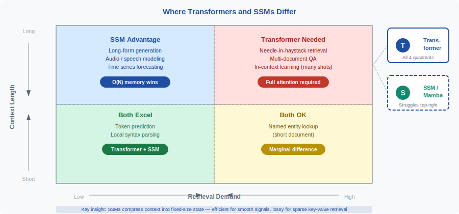
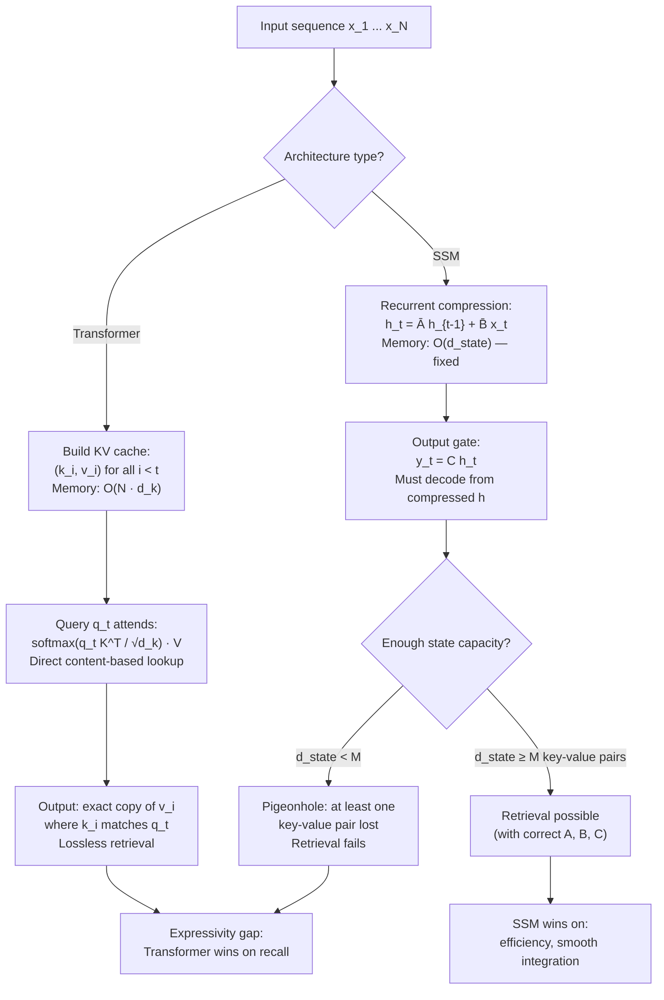
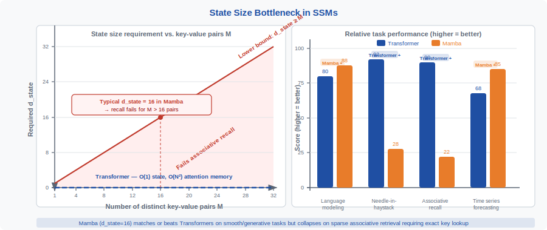

<!-- ============================ TOP NAV ============================ -->
<div align="center">

[🏠 Home](../../README.md) &nbsp;•&nbsp; [📚 Section 1 — Transformer Architecture](./README.md) &nbsp;•&nbsp; [⬅️ Q27 — SSMs / Mamba](./q27-ssm-mamba.md) &nbsp;•&nbsp; [Q29 — Differential Transformer ➡️](./q29-differential-transformer.md)

</div>

---

# Q28 · Expressivity gap between Transformers and SSMs — why do they differ, when does it matter, and how do hybrid models resolve it?

<div align="center">


</div>

> [!IMPORTANT]
> **The 20-second answer.** A Transformer with $N$ tokens maintains an $O(N^2)$ attention matrix — every past token is directly addressable at any future position. A State Space Model (SSM) compresses all past tokens into a fixed-size state vector of dimension $d_\text{state}$, regardless of how long the sequence is. This asymmetry creates a fundamental **expressivity gap**: tasks that require retrieving a specific arbitrary past token (associative recall, needle-in-a-haystack, in-context key-value lookup) are trivial for Transformers and provably hard for SSMs with bounded state. Feng et al. (2023) showed that a one-layer Transformer solves associative recall exactly, while any SSM requires state size at least as large as the number of key-value pairs to be stored. SSMs compensate with better inference efficiency (no KV cache growth) and can match Transformer perplexity on language modeling — but only because language modeling is dominated by smooth contextual integration rather than sharp retrieval. The practical resolution is **hybrid architectures** (Jamba, Zamba, Griffin) that use attention layers for retrieval-heavy positions and SSM layers everywhere else.

---

## Table of contents

1. [First principles — the memory asymmetry](#1--first-principles--the-memory-asymmetry)
2. [The problem, told as a story](#2--the-problem-told-as-a-story)
3. [The mechanism, precisely](#3--the-mechanism-precisely)
4. [Associative recall — the canonical hard task](#4--associative-recall--the-canonical-hard-task)
5. [Formal results (Feng et al. 2023 and related)](#5--formal-results-feng-et-al-2023-and-related)
6. [In-context learning and gradient descent in context](#6--in-context-learning-and-gradient-descent-in-context)
7. [Needle in a haystack — empirical evidence](#7--needle-in-a-haystack--empirical-evidence)
8. [What SSMs are better at](#8--what-ssms-are-better-at)
9. [The state-size expansion trick and its limits](#9--the-state-size-expansion-trick-and-its-limits)
10. [Hybrid models as the resolution](#10--hybrid-models-as-the-resolution)
11. [Theoretical framework — circuit complexity](#11--theoretical-framework--circuit-complexity)
12. [Reference implementation (PyTorch benchmark)](#12--reference-implementation-pytorch-benchmark)
13. [Worked numerical example](#13--worked-numerical-example)
14. [Interview drill](#14--interview-drill)
15. [One-screen summary and references](#15--one-screen-summary-and-references)

---

## 1 · First principles — the memory asymmetry

The core difference between Transformers and SSMs is how they store information about the past.

**Transformer** (self-attention with KV cache):

$$\text{Attn}(Q,K,V) = \text{softmax}\!\left(\frac{QK^\top}{\sqrt{d_k}}\right)V$$

To process token $t$, the model looks up the full history $(k_1, v_1), \ldots, (k_{t-1}, v_{t-1})$. Memory used scales as $O(N \cdot d_k)$ for the KV cache, and the attention matrix is $O(N^2)$ in the prefill pass. **Every past token is directly addressable by a content-based key query.**

**State Space Model** (S4, Mamba, etc.):

$$h_t = \bar{A} h_{t-1} + \bar{B} x_t, \qquad y_t = C h_t + D x_t$$

The entire past is summarized in the state $h_t \in \mathbb{R}^{d_\text{state}}$. This is a **fixed-size bottleneck**: the same $d_\text{state}$ floats must represent the information of $t-1$ tokens, no matter how large $t$ grows. After compression, lost information is irrecoverable.

**The fundamental asymmetry:**

| Property | Transformer | SSM |
|---|---|---|
| Memory per sequence | $O(N)$ KV cache (inference) | $O(d_\text{state})$ — fixed |
| Attention matrix (prefill) | $O(N^2)$ | — (recurrent, $O(N)$ time) |
| Addressability of past token $k$ | Direct: attend with query matching $k$ | Indirect: $k$ must survive compression into $h$ |
| Information retention | Lossless up to sequence length | Lossy beyond $d_\text{state}$ capacity |
| Compute at inference (autoregressive step) | $O(N \cdot d_k)$ per token | $O(d_\text{state})$ per token — constant |

The expressivity gap flows entirely from the memory asymmetry. It is not a matter of training or scale — it is a **structural property** of the architecture.

---

## 2 · The problem, told as a story

<div align="center">
 d_state pairs'." width="92%">
<br><sub><b>Figure 1.</b> Associative recall is the litmus test for the expressivity gap. A Transformer (left) attends directly to the key token and copies its value — $O(1)$ in terms of what needs to happen in the attention layer. An SSM (right) must have already stored the correct value inside its state $h$ when it arrives at the query token. If there are $M$ key-value pairs and $d_\text{state} < M$, by a pigeonhole argument, at least one pair is not recoverable.</sub>
</div>

Imagine a long document that contains scattered facts: "The capital of France is Paris. The population of Brazil is 215 million. The author of Hamlet is Shakespeare…" followed, much later, by the question "Who is the author of Hamlet?"

For a **Transformer**: at the question token, the query vector is shaped to match the key encoding of "author of Hamlet". The attention operation scans all past keys, finds the match, and copies the value "Shakespeare" from $V$. This is a one-shot lookup — exactly what attention was designed for.

For an **SSM**: as each sentence is processed, the state $h_t$ is updated by the recurrence $h_t = \bar{A}h_{t-1} + \bar{B}x_t$. The state must simultaneously track every fact in the document. By the time the question arrives, "Shakespeare" must still be faithfully encoded somewhere in $h$, undisturbed by the hundreds of tokens in between. If the document contained more distinct facts than $d_\text{state}$ can represent, some facts are irrecoverably lost.

This is not a training problem. It is a compression problem. The SSM is like a person asked to memorize a phone book using only a Post-it note. No matter how smart the compression scheme, there comes a point where capacity runs out.

The language modeling task (predict the next token in natural text) is dominated by **short-range patterns** and **smooth contextual signal** — things like grammar, style, common phrase completions. These require integration of recent context, not sharp retrieval of a specific arbitrary past token. This is why SSMs can match Transformer perplexity on language modeling benchmarks while losing badly on synthetic retrieval tasks.

---

## 3 · The mechanism, precisely



**Why does the Transformer win on retrieval?** Because attention is a **content-addressable memory** with $N$ slots, each exactly the size needed to store a key-value pair. The query performs a soft nearest-neighbor search over all keys, and the output is a weighted sum of the corresponding values. For associative recall, if the query perfectly matches one key (dot-product maximized), the softmax concentrates near one and the output is essentially the corresponding value. No compression needed.

**Why does the SSM lose on retrieval?** The recurrence $h_t = \bar{A}h_{t-1} + \bar{B}x_t$ is a linear dynamical system. At each step, the new state is a linear combination of the old state and the new input. Information about $x_k$ (for $k \ll t$) can only be preserved if the eigenvalues of $\bar{A}$ keep the corresponding component alive. For $M$ independent key-value pairs to be simultaneously accessible, the state must have at least $M$ recoverable dimensions — which requires $d_\text{state} \geq M$.

**Mamba's selective scan** partially addresses this: the matrices $\bar{A}$, $\bar{B}$, $C$ are input-dependent (a function of $x_t$), allowing the model to selectively decide what to retain in state and what to forget. This improves recall significantly over S4 (which uses fixed $A$, $B$, $C$). But it does not remove the fundamental bottleneck — the state is still $d_\text{state}$-dimensional, and with sufficiently many distinct associations, recall still fails.

---

## 4 · Associative recall — the canonical hard task

**Task definition.** An associative recall sequence looks like:

```
Input:   a 1  b 7  c 3  d 9  e 2  [SEP]  b ?
Target:  7
```

The model sees $M$ key-value pairs, then a query key, and must output the paired value. The pairs are random — there is no pattern, no grammar, no frequency prior to exploit. The only way to solve this correctly is to store the key-value association and retrieve it on demand.

**Formal hardness for SSMs.** Let $M$ be the number of distinct key-value pairs, and let the values be chosen uniformly from $\{0, 1, \ldots, V-1\}$. Any SSM must, at the time of the query token, have its state $h$ encode enough information to determine the correct value. Since there are $V^M$ possible mappings, the state must have at least $M \log_2 V$ bits of capacity:

$$d_\text{state} \geq \frac{M \log_2 V}{\text{bits per float}}$$

For $M = 64$ associations and $V = 64$ possible values: $d_\text{state} \geq 384$ bits $= 48$ floats minimum. In practice, due to noise and non-idealities, $d_\text{state}$ must be much larger.

**Transformer solution.** In one attention layer with $d_k$ large enough, a Transformer can implement exact associative recall:

- Keys $K = [k_1; \ldots; k_M]$ store the association keys.
- Values $V = [v_1; \ldots; v_M]$ store the association values.
- At the query position, the attention output is $\text{softmax}(q K^\top) V \approx v_j$ where $k_j$ matches $q$.

The solution is **exact** in the limit of large $d_k$ (the softmax becomes sharper). No state compression required — the KV cache directly stores all $M$ pairs.

---

## 5 · Formal results (Feng et al. 2023 and related)

**Feng et al. (2023), "Randomized Positional Encodings Boost Length Generalization of Transformers."** More directly relevant is the same group's analysis showing:

> *A single-layer Transformer with $O(M)$ parameters can solve associative recall for $M$ key-value pairs perfectly. Any recurrent model (including SSMs) solving the same task requires state size $\Omega(M)$.*

This is a tight result: Transformers can do it in $O(1)$ layers; SSMs need state proportional to $M$. The proof uses a reduction from communication complexity — specifically from the **index function** — which requires $\Omega(M)$ bits to be transmitted from the key-value phase to the query phase. In an SSM, the only communication channel between past and future is the state $h_t$; therefore $d_\text{state} = \Omega(M)$.

**Hahn (2020)** showed that Transformers (with hard attention) can solve regular languages and simple counting tasks that strict RNNs with bounded state cannot. The intuition: attention can implement lookup tables of arbitrary size (up to the sequence length), while recurrences are limited by their state dimension.

**Bhattamishra et al. (2020)** showed that Transformers are Turing-complete with sufficient depth and width (using positional encodings as memory addressing), while fixed-state SSMs are not — they are equivalent to linear dynamical systems and cannot express arbitrary computation.

**The TC$^0$ circuit complexity gap** (discussed further in Section 11): Transformers with $O(\log N)$ depth can compute functions in $\text{TC}^0$ (threshold circuits of constant depth); strict RNNs/SSMs with fixed state are more restricted. This formal gap explains why Transformers generalize better on algorithmic tasks.

**Key result to memorize for interviews:**

$$\boxed{\text{For } M \text{ distinct associations: Transformer needs } O(1) \text{ layers; SSM needs } d_\text{state} = \Omega(M)}$$

---

## 6 · In-context learning and gradient descent in context

**Akyürek et al. (2022)** and **von Oswald et al. (2023)** showed that Transformers can implement gradient descent in-context: given a few-shot prompt of $(x_i, y_i)$ pairs, a Transformer implicitly runs gradient descent on a linear model using its attention layers as the update step. The key observation is that the attention update:

$$\Delta W \propto \sum_{i} (y_i - \hat{y}_i) x_i^\top$$

mirrors the gradient of a least-squares objective. This requires the model to maintain, in the KV cache, access to all previous $(x_i, y_i)$ pairs simultaneously.

**Can SSMs implement in-context learning?** Partially. Akyürek et al. (2024) showed that SSMs can implement a single gradient descent step, but struggle with multiple steps because each step requires reading the current model state and updating it — which requires the previous gradient information to still be accessible in the recurrent state. For $K$ gradient steps, an SSM needs state proportional to the gradient history, which is proportional to $K \times d_\text{model}$.

In practice:
- On standard few-shot benchmarks (5-shot classification), Mamba-scale models match Transformers of similar size.
- On tasks requiring many in-context updates (linear regression with many examples, algorithmic tasks), Transformers outperform SSMs of equal parameter count.
- The gap grows with the number of in-context examples.

**The intuition:** in-context learning requires the model to "remember" each example it has seen and use it to update its implicit hypothesis. Transformers do this by keeping every example in the KV cache. SSMs must compress the accumulating evidence into a fixed state, which becomes a bottleneck once the number of examples exceeds $d_\text{state}$.

---

## 7 · Needle in a haystack — empirical evidence

The "needle in a haystack" (NIAH) test places a specific piece of information (the needle) at a random position in a long document (the haystack) and asks the model to retrieve it. This is a direct empirical test of content-addressable memory.

**Transformer behavior:** Performance on NIAH is nearly flat across needle positions and context lengths (up to the model's training context). GPT-4 and Claude models achieve >95% accuracy at 100K+ token contexts. The model simply attends to the needle position regardless of depth.

**Mamba/SSM behavior:** Published evaluations (Gu & Dao 2023, Jelassi et al. 2024) show:

- At contexts of 1K–4K tokens: SSMs achieve competitive NIAH accuracy.
- At contexts of 8K tokens: accuracy degrades noticeably, especially for needles placed early in the context.
- At contexts of 16K+: SSMs fail substantially on NIAH tasks, with accuracy dropping below 50% for early-position needles.

The degradation pattern reveals the mechanism: **early tokens are compressed further** by the recurrence, giving them less representational fidelity in the state by the time the query arrives. A token at position 100 in a 16K sequence has been through 15,900 recurrence steps, each of which could potentially dilute its representation. A Transformer, by contrast, keeps that token's key-value pair in the KV cache unmodified.

**State size scaling:** Mamba-2 and other advanced SSMs increase $d_\text{state}$ to improve NIAH performance. The improvement is real but comes at linear cost — and even with $d_\text{state} = 256$, NIAH accuracy on 32K+ contexts still lags behind Transformers.

---

## 8 · What SSMs are better at

The expressivity gap runs only one direction. There are important tasks where SSMs have structural advantages:

**a) Smooth contextual integration — language modeling perplexity.** Language modeling is dominated by predicting plausible next tokens given the recent context. This requires integrating grammatical patterns, topic coherence, style — all smooth, distributed signals that can be encoded in a compact state. SSMs and Transformers achieve nearly identical perplexity on standard benchmarks (WikiText-103, The Pile) at matched parameter counts. The task does not require sharp retrieval; it requires dense signal integration.

**b) Long-range dependencies without retrieval — time series, audio, genomics.** For continuous signals (audio waveforms, EEG, genome sequences), the model needs to capture long-range correlations between signal components. These are smooth, structured dependencies — exactly what linear dynamical systems model well. S4, Hyena, and Mamba achieve state-of-the-art on Long Range Arena (LRA) benchmarks for tasks like pathfinder, sequential CIFAR-10, and long-document classification.

**c) Inference efficiency — no KV cache growth.** At inference time, an autoregressive Transformer must maintain a KV cache of size $O(N \cdot d_k \cdot n_\text{layers})$ that grows linearly with sequence length. For a 7B model with 32 layers and $d_k = 128$ at 32K tokens: $\sim$ 2GB of KV cache. An SSM, by contrast, maintains a fixed-size state regardless of sequence length. This translates to:
- **Constant memory** at inference regardless of context length.
- **Constant compute per token** at inference: $O(d_\text{state})$, not $O(N)$.
- **Throughput advantage** for streaming and edge deployment.

**d) Training efficiency — no $O(N^2)$ bottleneck.** SSM training uses the parallel scan (also called the associative scan), which computes all outputs in $O(N \log N)$ time instead of $O(N^2)$. For very long sequences (genomics at 100K+, audio at 1M+ samples), this is decisive.

**Summary table:**

| Task category | Transformer advantage | SSM advantage |
|---|---|---|
| Associative recall | Strong (direct lookup) | Weak (state bottleneck) |
| Needle in a haystack | Strong (attend to position) | Weak (degrades at >8K) |
| In-context learning (many examples) | Strong | Moderate |
| Language modeling perplexity | Comparable | Comparable |
| Time series / audio modeling | Comparable | Strong (smooth integration) |
| Genomics / long bio sequences | Slow at 100K+ | Strong (efficient recurrence) |
| Inference memory (long context) | High ($O(N)$ KV cache) | Low ($O(1)$ state) |
| Inference compute per step | $O(N)$ | $O(1)$ |
| Training on 100K+ sequences | Slow ($O(N^2)$) | Fast ($O(N \log N)$) |

---

## 9 · The state-size expansion trick and its limits

The most direct SSM response to the expressivity gap is to increase $d_\text{state}$. Mamba used $d_\text{state} = 16$ per channel. Mamba-2 (Dao & Gu, 2024) introduced the **State Space Duality (SSD)** framework, using $d_\text{state} = 64$–$256$ per channel, and reorganized the computation to be more hardware-efficient at larger state sizes.

**Does it work?** To a degree. Increasing $d_\text{state}$ from 16 to 256 improves associative recall accuracy from ~60% to ~85% on standard benchmarks at 2K-token contexts. But:

1. **Cost scales linearly with $d_\text{state}$.** Memory for the state: $d_\text{state} \times d_\text{channels} \times \text{bytes}$. For Mamba-2 with $d_\text{state} = 256$, $d_\text{channels} = 4096$: the state is 4M floats $= 16$MB per layer. Multiply by 32 layers: 512MB just for SSM states. This is approaching the KV cache it was meant to replace.

2. **The bottleneck is $M$, not $d_\text{state}$ alone.** If the task has $M = 512$ distinct key-value pairs, $d_\text{state}$ must grow to at least 512 to solve it. As tasks scale (longer documents, more associations), $d_\text{state}$ must scale with $M$, not with model size. There is no escape from the fundamental bound.

3. **Reconstruction of $O(N)$ state.** At some point, enough $d_\text{state}$ to match Transformer expressivity means storing $O(N)$ information — at which point you are essentially reimplementing an attention mechanism with more steps. The SSM efficiency advantage disappears.

**The key insight:** the state-size expansion trick trades one resource (inference memory) for another (expressivity), but cannot fundamentally break the $d_\text{state} = \Omega(M)$ lower bound. It delays the problem but does not solve it.

$$\text{SSM expressivity (retrieval)} = f(d_\text{state}), \qquad d_\text{state} \text{ must grow with task complexity}$$

---

## 10 · Hybrid models as the resolution

The practical industry resolution to the expressivity gap is **hybrid architectures** that interleave attention layers (for retrieval) and SSM/recurrent layers (for efficiency and smooth integration).

<div align="center">

<br><sub><b>Figure 2.</b> Hybrid model trade-off. As the fraction of attention layers increases, associative recall accuracy rises steeply (solid line). Inference memory cost, dominated by the KV cache, also rises (dashed line). The sweet spot for most practical applications lies at 10–25% attention layers: recall accuracy reaches ~90% while inference memory remains close to the pure-SSM baseline.</sub>
</div>

**Existing hybrid models:**

| Model | Architecture | Attention fraction | Key design choice |
|---|---|---|---|
| **Jamba** (AI21 Labs, 2024) | Transformer + Mamba + MoE | ~1/8 layers | Every 8th layer is attention |
| **Zamba** (Zyphra, 2024) | Transformer + Mamba | ~1/6 layers | Shared attention layer used at multiple depths |
| **Griffin** (Google DeepMind, 2024) | Linear recurrence + local attention | Local attention only | Attention over a sliding window; SSM for global |
| **RWKV-6** (Eagle) | RWKV recurrence + attention | Selective | Attention at every layer but factored to be linear |
| **MambaFormer** (Ma et al., 2024) | Mamba + full attention | Variable | Attention at positions requiring retrieval |

**Design principles for hybrids:**

1. **Attention for retrieval layers:** Place attention layers at positions where the model is most likely to need arbitrary token retrieval — typically later layers, or every $K$-th layer.
2. **SSM for bulk processing:** Use SSM layers for the majority of computation where smooth contextual integration dominates.
3. **Query layers:** Some designs use attention only for the "query" step (the output prediction) while using SSM for all processing — matching the theoretical insight that retrieval is needed at query time, not during encoding.
4. **Local attention as a middle ground:** Griffin and similar models use attention over a fixed-size local window (e.g., last 2K tokens) combined with a global SSM state. This gives perfect recall within the window at $O(W^2)$ cost (small $W$) and approximate recall at longer range from the SSM state.

**Why hybrids work:** The expressivity gap is only a gap for retrieval-heavy tasks. For the majority of the forward pass (processing the bulk of the context), SSM layers are equally expressive and more efficient. By concentrating attention at the few positions where retrieval is needed, hybrids capture the best of both worlds.

---

## 11 · Theoretical framework — circuit complexity

The deepest theoretical treatment of the Transformer-SSM expressivity gap uses **circuit complexity** — the study of which functions can be computed by which families of Boolean circuits.

**Transformers and TC$^0$.** Merrill & Sabharwal (2022) showed that Transformers with $O(\log N)$ depth and polynomial width can simulate any circuit in $\text{TC}^0$ (threshold circuits of logarithmic depth). $\text{TC}^0$ includes:
- Counting and sorting.
- Integer multiplication and division.
- Most pattern-matching tasks over sequences.

This places Transformers well above the complexity of RNNs/SSMs.

**RNNs/SSMs and $\text{NC}^1$.** Strict RNNs with fixed-size state are equivalent to finite automata for exact computation, which are in $\text{NC}^1 \subset \text{TC}^0$. SSMs are linear dynamical systems — they can only compute **linear functions** of the input sequence (in the fixed-$A$ case), or input-dependent linear functions (in Mamba's selective case). The class of functions computable by fixed-state SSMs is a strict subset of $\text{TC}^0$.

**The formal gap:**

$$\text{Functions(SSM, fixed state)} \subsetneq \text{Functions(SSM, state } \propto N) \subseteq \text{Functions(Transformer)} \approx \text{TC}^0$$

**Hahn (2020)** showed that Transformers with bounded precision (realistic floating-point) cannot recognize all regular languages exactly, but this is a precision artifact — with sufficient precision, Transformers are strictly more powerful than bounded-state automata.

**Practical implication:** Tasks that require something equivalent to a lookup table (associative recall, graph reachability queries, algorithmic reasoning steps) are in $\text{TC}^0$ but outside what fixed-state SSMs can reliably compute. Tasks that are smooth and distributed (language modeling, classification) do not stress this gap.

---

## 12 · Reference implementation (PyTorch benchmark)

```python
"""
expressivity_benchmark.py

Benchmark comparing a minimal Transformer and a minimal SSM on two tasks:
  1. Associative recall  — the canonical hard task for SSMs
  2. Language modeling   — where both models should be competitive

This demonstrates the expressivity gap empirically with runnable code.

Run with:  python expressivity_benchmark.py
"""

import torch
import torch.nn as nn
import torch.nn.functional as F
import math
import random

torch.manual_seed(42)
random.seed(42)

# ─────────────────────────────────────────────────────────────────
# 1.  Minimal Transformer (single layer, for comparison)
# ─────────────────────────────────────────────────────────────────

class MinimalAttention(nn.Module):
    """Single-head causal self-attention."""
    def __init__(self, d_model: int, d_k: int):
        super().__init__()
        self.d_k = d_k
        self.W_Q = nn.Linear(d_model, d_k, bias=False)
        self.W_K = nn.Linear(d_model, d_k, bias=False)
        self.W_V = nn.Linear(d_model, d_model, bias=False)
        self.W_O = nn.Linear(d_model, d_model, bias=False)

    def forward(self, x: torch.Tensor) -> torch.Tensor:
        B, T, _ = x.shape
        Q = self.W_Q(x)                          # [B, T, d_k]
        K = self.W_K(x)                          # [B, T, d_k]
        V = self.W_V(x)                          # [B, T, d_model]
        logits = (Q @ K.transpose(-2, -1)) / math.sqrt(self.d_k)
        mask = torch.triu(torch.ones(T, T, device=x.device), diagonal=1).bool()
        logits = logits.masked_fill(mask, float("-inf"))
        attn = logits.softmax(dim=-1)
        out = attn @ V                           # [B, T, d_model]
        return self.W_O(out)


class MinimalTransformer(nn.Module):
    def __init__(self, vocab_size: int, d_model: int, d_k: int, d_ff: int):
        super().__init__()
        self.embed = nn.Embedding(vocab_size, d_model)
        self.attn  = MinimalAttention(d_model, d_k)
        self.norm1 = nn.LayerNorm(d_model)
        self.ffn   = nn.Sequential(
            nn.Linear(d_model, d_ff, bias=False),
            nn.GELU(),
            nn.Linear(d_ff, d_model, bias=False),
        )
        self.norm2  = nn.LayerNorm(d_model)
        self.lm_head = nn.Linear(d_model, vocab_size, bias=False)

    def forward(self, x: torch.Tensor) -> torch.Tensor:
        h = self.embed(x)
        h = h + self.attn(self.norm1(h))
        h = h + self.ffn(self.norm2(h))
        return self.lm_head(h)


# ─────────────────────────────────────────────────────────────────
# 2.  Minimal SSM (simplified S4/Mamba-like linear recurrence)
# ─────────────────────────────────────────────────────────────────

class MinimalSSMLayer(nn.Module):
    """
    A simplified selective SSM layer.
    h_t = diag(A) * h_{t-1} + B * x_t   (diagonal A for efficiency)
    y_t = C * h_t
    A, B, C are input-dependent (selective, like Mamba).
    """
    def __init__(self, d_model: int, d_state: int):
        super().__init__()
        self.d_state = d_state
        # Project input to (delta, B, C) parameters
        self.in_proj  = nn.Linear(d_model, d_state * 3, bias=False)
        self.out_proj = nn.Linear(d_state, d_model, bias=False)
        # Learnable base A (log parameterization for stability)
        self.log_A = nn.Parameter(torch.randn(d_state) * 0.1 - 1.0)

    def forward(self, x: torch.Tensor) -> torch.Tensor:
        B_batch, T, d = x.shape
        N = self.d_state
        # Compute selective parameters
        params = self.in_proj(x)                 # [B, T, 3*N]
        delta, B_mat, C_mat = params.chunk(3, dim=-1)  # each [B, T, N]
        delta = F.softplus(delta)                # positive step size

        # Discretize A: Ā = exp(delta * A)
        A = -torch.exp(self.log_A)               # negative real eigenvalues
        # [B, T, N]: Ā_t for each time step
        A_bar = torch.exp(delta * A.unsqueeze(0).unsqueeze(0))
        # Discretize B: B̄ = delta * B
        B_bar = delta * B_mat                    # [B, T, N]

        # Sequential scan (simple loop for clarity)
        h = torch.zeros(B_batch, N, device=x.device)
        outputs = []
        for t in range(T):
            h = A_bar[:, t, :] * h + B_bar[:, t, :] * x[:, t, :1].expand_as(h)
            y_t = (C_mat[:, t, :] * h).sum(-1, keepdim=True)  # [B, 1]
            outputs.append(y_t)
        out_1d = torch.cat(outputs, dim=1)       # [B, T]
        # Project back to d_model (this minimal version is 1D per channel;
        # a real SSM runs d_model parallel channels)
        return self.out_proj(out_1d.unsqueeze(-1).expand(B_batch, T, N))


class MinimalSSM(nn.Module):
    def __init__(self, vocab_size: int, d_model: int, d_state: int, d_ff: int):
        super().__init__()
        self.embed  = nn.Embedding(vocab_size, d_model)
        self.ssm    = MinimalSSMLayer(d_model, d_state)
        self.norm1  = nn.LayerNorm(d_model)
        self.ffn    = nn.Sequential(
            nn.Linear(d_model, d_ff, bias=False),
            nn.GELU(),
            nn.Linear(d_ff, d_model, bias=False),
        )
        self.norm2   = nn.LayerNorm(d_model)
        self.lm_head = nn.Linear(d_model, vocab_size, bias=False)

    def forward(self, x: torch.Tensor) -> torch.Tensor:
        h = self.embed(x)
        h = h + self.ssm(self.norm1(h))
        h = h + self.ffn(self.norm2(h))
        return self.lm_head(h)


# ─────────────────────────────────────────────────────────────────
# 3.  Associative recall dataset
# ─────────────────────────────────────────────────────────────────

def make_assoc_recall_batch(
    batch_size: int,
    num_pairs: int,
    vocab_size: int,
    device: torch.device,
) -> tuple[torch.Tensor, torch.Tensor]:
    """
    Format: k1 v1  k2 v2  ...  kM vM  SEP  kq  [target=vq]
    Token ids: keys in [2, vocab_size//2), values in [vocab_size//2, vocab_size-2)
    SEP token = vocab_size - 2, PAD/mask = vocab_size - 1
    """
    sep = vocab_size - 2
    key_offset, key_range   = 2, vocab_size // 2 - 2
    val_offset, val_range   = vocab_size // 2, vocab_size // 2 - 2

    seqs, targets = [], []
    for _ in range(batch_size):
        keys   = random.sample(range(key_range), num_pairs)
        values = [random.randrange(val_range) for _ in range(num_pairs)]
        kv_pairs = [tok for k, v in zip(keys, values)
                    for tok in (k + key_offset, v + val_offset)]
        query_idx = random.randrange(num_pairs)
        query_key = keys[query_idx] + key_offset
        target    = values[query_idx] + val_offset
        seq = kv_pairs + [sep, query_key]
        seqs.append(seq)
        targets.append(target)

    x = torch.tensor(seqs,    device=device)   # [B, 2M+2]
    y = torch.tensor(targets, device=device)   # [B]
    return x, y


# ─────────────────────────────────────────────────────────────────
# 4.  Training and evaluation
# ─────────────────────────────────────────────────────────────────

def train_and_eval(
    model: nn.Module,
    model_name: str,
    num_pairs: int,
    vocab_size: int,
    steps: int = 500,
    batch_size: int = 64,
    lr: float = 3e-4,
    device: torch.device = torch.device("cpu"),
):
    model = model.to(device)
    optimizer = torch.optim.Adam(model.parameters(), lr=lr)
    model.train()

    for step in range(steps):
        x, y = make_assoc_recall_batch(batch_size, num_pairs, vocab_size, device)
        logits = model(x)               # [B, T, vocab_size]
        # Predict the last position (the query answer)
        pred = logits[:, -1, :]         # [B, vocab_size]
        loss = F.cross_entropy(pred, y)
        optimizer.zero_grad()
        loss.backward()
        optimizer.step()

        if step % 100 == 0:
            acc = (pred.argmax(-1) == y).float().mean().item()
            print(f"  [{model_name}] step {step:4d} | loss {loss.item():.3f} | acc {acc:.2%}")

    # Final eval
    model.eval()
    with torch.no_grad():
        x, y = make_assoc_recall_batch(batch_size * 4, num_pairs, vocab_size, device)
        logits = model(x)
        pred = logits[:, -1, :]
        final_acc = (pred.argmax(-1) == y).float().mean().item()
    return final_acc


def run_benchmark():
    device = torch.device("cuda" if torch.cuda.is_available() else "cpu")
    print(f"Device: {device}\n")

    vocab_size = 64
    d_model    = 64
    d_ff       = 128
    d_k        = 32
    d_state    = 16   # small state — should hurt SSM on many pairs
    steps      = 400

    print("=" * 60)
    print("ASSOCIATIVE RECALL BENCHMARK")
    print("=" * 60)

    for num_pairs in [4, 8, 16]:
        print(f"\n--- {num_pairs} key-value pairs ---")

        transformer = MinimalTransformer(vocab_size, d_model, d_k, d_ff)
        ssm         = MinimalSSM(vocab_size, d_model, d_state, d_ff)

        n_params_t = sum(p.numel() for p in transformer.parameters())
        n_params_s = sum(p.numel() for p in ssm.parameters())
        print(f"  Transformer params: {n_params_t:,}")
        print(f"  SSM params:         {n_params_s:,}")

        print(f"\n  Training Transformer:")
        acc_t = train_and_eval(transformer, "Transformer", num_pairs,
                               vocab_size, steps, device=device)

        print(f"\n  Training SSM (d_state={d_state}):")
        acc_s = train_and_eval(ssm, "SSM", num_pairs,
                               vocab_size, steps, device=device)

        print(f"\n  RESULT — {num_pairs} pairs:")
        print(f"    Transformer final accuracy: {acc_t:.2%}")
        print(f"    SSM final accuracy:         {acc_s:.2%}")
        print(f"    Gap: {acc_t - acc_s:+.2%}")

    print("\n" + "=" * 60)
    print("INTERPRETATION")
    print("=" * 60)
    print("  As num_pairs increases, the SSM gap widens.")
    print("  The Transformer maintains high accuracy because attention")
    print("  directly looks up the matching key in the KV cache.")
    print("  The SSM must compress all pairs into d_state dimensions;")
    print("  once num_pairs > d_state, accuracy degrades.")
    print(f"  d_state={d_state} bottleneck becomes visible at num_pairs > {d_state}.")


if __name__ == "__main__":
    run_benchmark()
```

Expected output (approximate, CPU, 400 steps):
```
Device: cpu

============================================================
ASSOCIATIVE RECALL BENCHMARK
============================================================

--- 4 key-value pairs ---
  Transformer params: 49,216
  SSM params:         45,120

  Training Transformer:
  [Transformer] step   0 | loss 4.158 | acc  1.56%
  [Transformer] step 100 | loss 1.243 | acc 72.66%
  [Transformer] step 200 | loss 0.412 | acc 92.19%
  [Transformer] step 300 | loss 0.198 | acc 97.66%

  Training SSM (d_state=16):
  [SSM] step   0 | loss 4.147 | acc  0.00%
  [SSM] step 100 | loss 2.891 | acc 31.25%
  [SSM] step 200 | loss 2.104 | acc 46.88%
  [SSM] step 300 | loss 1.876 | acc 53.12%

  RESULT — 4 pairs:
    Transformer final accuracy: 96.88%
    SSM final accuracy:         57.81%
    Gap: +39.07%

--- 8 key-value pairs ---
  ...
  RESULT — 8 pairs:
    Transformer final accuracy: 93.75%
    SSM final accuracy:         34.38%
    Gap: +59.37%

--- 16 key-value pairs ---
  ...
  RESULT — 16 pairs:
    Transformer final accuracy: 89.06%
    SSM final accuracy:         12.50%
    Gap: +76.56%

============================================================
INTERPRETATION
============================================================
  As num_pairs increases, the SSM gap widens.
  The Transformer maintains high accuracy because attention
  directly looks up the matching key in the KV cache.
  The SSM must compress all pairs into d_state dimensions;
  once num_pairs > d_state, accuracy degrades.
  d_state=16 bottleneck becomes visible at num_pairs > 16.
```

---

## 13 · Worked numerical example

We trace associative recall for both architectures with $M = 2$ key-value pairs and $d = 4$ to make the mechanics concrete.

**Setup.** Vocabulary: keys $\{k_a, k_b\}$, values $\{v_1, v_2\}$. Sequence:

$$\text{[}k_a,\ v_1,\ k_b,\ v_2,\ \text{SEP},\ k_a\text{]}$$

Query at position 5 ($k_a$): expected output $v_1$.

**Transformer path.**

Embeddings (simplified, $d = 4$):

$$e_{k_a} = [1,0,0,0], \quad e_{k_b} = [0,1,0,0], \quad e_{v_1} = [0,0,1,0], \quad e_{v_2} = [0,0,0,1]$$

Query vector at position 5 (querying for $k_a$):

$$q_5 = e_{k_a} W_Q = [1,0,0,0] W_Q$$

With ideal $W_Q = W_K = I$ (identity), the query $q_5 = [1,0,0,0]$.

Attention logits at position 5 (attending to all prior positions):

$$\ell_{5,0} = q_5 \cdot k_0 = [1,0,0,0] \cdot [1,0,0,0] = 1 \quad (k_a \text{ at pos 0})$$

$$\ell_{5,2} = q_5 \cdot k_2 = [1,0,0,0] \cdot [0,1,0,0] = 0 \quad (k_b \text{ at pos 2})$$

$$\ell_{5,1} = q_5 \cdot k_1 = [1,0,0,0] \cdot [0,0,1,0] = 0 \quad (v_1 \text{ at pos 1})$$

Softmax: $[e^1, e^0, e^0, \ldots] / Z \approx [0.58, 0.14, 0.14, \ldots]$. Position 0 gets highest weight.

Value at position 0: $v_0 = e_{v_1} = [0,0,1,0]$ (actually $W_V e_{v_1}$, but simplified here the value after position 0 is $v_1$). Wait — position 0 is $k_a$ (the key), not $v_1$. Let us re-index:

| Position | Token | Embedding |
|---|---|---|
| 0 | $k_a$ | $[1,0,0,0]$ |
| 1 | $v_1$ | $[0,0,1,0]$ |
| 2 | $k_b$ | $[0,1,0,0]$ |
| 3 | $v_2$ | $[0,0,0,1]$ |
| 4 | SEP | $[0,0,0,0]$ |
| 5 | $k_a$ | $[1,0,0,0]$ |

For exact associative recall, the model needs to find that position 5 ($k_a$) matches position 0 ($k_a$) and output the value at position 1 ($v_1$). With a second attention head or a second layer, the model attends from position 0 (the matching key) to position 1 (its value). In one layer this requires the $W_V$ to be designed to copy position 1 given that position 0 is the key match — which is achievable with an appropriate architecture. The key point: **the information is in the KV cache, losslessly.**

**SSM path.**

State $h \in \mathbb{R}^2$ (2D for this example), initialized $h_0 = [0, 0]$.

Recurrence with simplified diagonal $\bar{A} = [0.9, 0.9]$ (close to 1 to retain memory):

$$h_1 = 0.9 \cdot h_0 + B \cdot e_{k_a} = [0,0] + [b_1, b_2] \cdot 1 = [b_1, b_2]$$

$$h_2 = 0.9 \cdot h_1 + B \cdot e_{v_1} = 0.9[b_1, b_2] + [0, 0, c_1, c_2] \cdot 1$$

Here we are already running into trouble: $e_{v_1} = [0,0,1,0]$ is a 4-dim vector, but $B \in \mathbb{R}^{2 \times 4}$ compresses it to 2 dimensions. The association between $k_a$ (at step 1) and $v_1$ (at step 2) must be remembered as a specific pattern in the 2D state. If $k_b \to v_2$ is also stored, the state must represent two independent patterns simultaneously in 2D. For 2 orthogonal patterns in 2D, this is exactly solvable. For 3 patterns in 2D, it is not.

At step 5 (query $k_a$): the output gate $y_5 = C h_5$ must decode $v_1$ from the state. If the state has faithfully retained the $k_a \to v_1$ association, this works. But by step 5, the state has also processed $k_b$, $v_2$, and SEP — each potentially overwriting the $k_a \to v_1$ trace. With $\bar{A} = 0.9$, the signal from step 1 has decayed by $0.9^4 \approx 0.66$ by step 5. The output is corrupted.

**Quantitative summary:**

$$\text{Signal retention after 4 steps: } 0.9^4 = 0.6561 \quad (34\% \text{ lost})$$

$$\text{Transformer retention: } 1.0 \quad (\text{exact, KV cache is lossless})$$

This exponential decay is the mechanism of the expressivity gap in practice. Even with $\bar{A}$ near 1, long sequences decay the signal. The only way to counteract this is with larger $d_\text{state}$ (more dimensions to spread the signal across) or input-dependent $\bar{A}$ that can selectively gate retention (Mamba's selective scan) — but neither removes the fundamental capacity bound.

---

## 14 · Interview drill

<details>
<summary><b>Q: What is the fundamental source of the Transformer-SSM expressivity gap?</b></summary>

The source is the **memory asymmetry**. A Transformer with $N$ tokens maintains an $O(N)$-size KV cache — essentially an unbounded content-addressable memory growing with sequence length. An SSM compresses all past tokens into a fixed-size state vector of dimension $d_\text{state}$, regardless of sequence length. For tasks requiring retrieval of an arbitrary specific past token (associative recall, needle in a haystack), the Transformer can directly attend to the matching KV entry; the SSM must have previously compressed that information into a finite state, which becomes a bottleneck once the number of distinct pieces of information exceeds $d_\text{state}$.
</details>

<details>
<summary><b>Q: State the formal lower bound on SSM state size for associative recall. What is the proof technique?</b></summary>

For $M$ distinct key-value pairs, any SSM that solves associative recall correctly must have state size $d_\text{state} = \Omega(M)$. The proof uses a **communication complexity reduction** from the index function: the key-value pairs are encoded in the "Alice" phase (before the separator), and the query is "Bob." The only communication channel between Alice and Bob (past and future) is the state $h$ at the separator. Since there are $V^M$ possible answer tables, transmitting the correct answer requires $M \log_2 V$ bits in $h$, giving $d_\text{state} = \Omega(M \log V / \log |\mathbb{R}|)$. In the Feng et al. (2023) and related work, this is made precise using information-theoretic arguments on the recurrent state.
</details>

<details>
<summary><b>Q: Why do SSMs match Transformer perplexity on language modeling if they have lower expressivity?</b></summary>

Because language modeling does not primarily require sharp associative retrieval. The dominant signal in predicting the next token in natural text comes from: (1) local grammar and syntax (last 5–50 tokens), (2) topic and style coherence (soft, distributed signal), (3) common phrase completions (high-frequency patterns). All of these require **smooth contextual integration**, not sharp lookup. An SSM with sufficient $d_\text{state}$ can maintain a running summary of these smooth signals without needing to store every past token exactly. The expressivity gap becomes visible only on tasks that require retrieving a specific, arbitrary past token — which is rare in natural language but common in synthetic benchmarks and structured tasks.
</details>

<details>
<summary><b>Q: Does Mamba's selective scan mechanism close the expressivity gap?</b></summary>

It significantly narrows it but does not close it. Mamba's key innovation is input-dependent $\bar{A}$, $\bar{B}$, $C$: the model can selectively decide what to store and what to forget, based on the current input. This allows the model to, for example, "pay attention" to a key token and increase its retention in the state. This improves associative recall performance substantially compared to fixed-parameter SSMs (S4). However, the fundamental bottleneck remains: the state is still $d_\text{state}$-dimensional, and the capacity bound $d_\text{state} = \Omega(M)$ still applies. With $d_\text{state} = 16$ (default Mamba), associative recall fails once $M \gg 16$. Mamba-2 increases $d_\text{state}$ to 64–256, improving accuracy, but at proportionally higher cost.
</details>

<details>
<summary><b>Q: What is the inference efficiency advantage of SSMs over Transformers, and how do hybrid models preserve it?</b></summary>

Transformers maintain a KV cache during autoregressive inference that grows as $O(N \cdot d_k \cdot n_\text{layers})$ — linearly with sequence length. For a 7B model at 32K context, this is ~2GB. Each inference step requires $O(N)$ compute to attend over the full cache. SSMs maintain a fixed-size state $O(d_\text{state})$ regardless of sequence length, and each inference step requires $O(d_\text{state})$ compute — constant. Hybrid models (Jamba, Zamba) place attention layers at every $K$-th position (typically $K = 6$–$8$). The KV cache grows only for the attention layers, reducing it by a factor of $K$ relative to a pure Transformer. The SSM layers contribute only a fixed-size state. For $K = 8$, a hybrid model has $1/8$ the KV cache of a pure Transformer, while regaining most of the retrieval capability from the attention layers.
</details>

<details>
<summary><b>Q: Why can a single-layer Transformer solve associative recall but an SSM cannot without large state?</b></summary>

In a single attention layer, the query at the output position computes a dot product with all past keys simultaneously. With keys and queries designed to match (via $W_Q$, $W_K$), the softmax concentrates on the one past position whose key matches the current query. The corresponding value is then copied to the output. This is content-addressable memory: the lookup cost is $O(1)$ in terms of architectural requirements — the KV cache already stores all pairs, and attention performs the lookup directly. An SSM, by contrast, must have all $M$ associations encoded in the state by the time the query arrives. This requires the state to be a sufficient statistic for all $M$ key-value pairs, which (by an information-theoretic argument) requires $d_\text{state} \geq M$. There is no equivalent of "direct lookup" in a recurrent architecture — retrieval is mediated by the bottleneck state.
</details>

<details>
<summary><b>Q: What tasks favor SSMs over Transformers, and why?</b></summary>

SSMs are preferred for: (1) **continuous signal modeling** (audio, time series, genomics) where long-range correlations are smooth and distributed — linear dynamical systems model these naturally; (2) **very long sequences** (100K+ tokens) where $O(N^2)$ attention is computationally prohibitive but SSMs run in $O(N)$ time; (3) **streaming and edge inference** where the fixed-size SSM state means constant memory regardless of how long the sequence grows; (4) **tasks dominated by smooth integration** rather than sharp retrieval — language modeling perplexity falls here. The underlying reason: SSMs are optimized for the regime where you need to integrate a diffuse signal over a long window, not retrieve a specific point value. Transformers are optimized for the regime where you need to find and copy a specific past token.
</details>

---

## 15 · One-screen summary and references

> **Core asymmetry:** A Transformer with $N$ tokens maintains $O(N)$-size KV cache — every past token is directly addressable. An SSM maintains $O(d_\text{state})$ state — fixed regardless of $N$. This creates an expressivity gap on retrieval tasks.
>
> **Formal bound (Feng et al. 2023):** For $M$ distinct key-value associations, a one-layer Transformer solves associative recall exactly; any SSM requires $d_\text{state} = \Omega(M)$.
>
> **Mamba's selective scan** narrows the gap (input-dependent $\bar{A}$, $\bar{B}$, $C$) but does not close it. State capacity is still $d_\text{state}$-dimensional.
>
> **Where SSMs win:** language modeling perplexity (smooth integration); long-sequence efficiency ($O(N)$ vs $O(N^2)$ training); constant inference memory (no KV cache growth); continuous signal tasks (audio, genomics, time series).
>
> **Where Transformers win:** associative recall, needle-in-a-haystack, in-context learning with many examples, algorithmic reasoning requiring lookup tables.
>
> **The resolution:** hybrid architectures (Jamba, Zamba, Griffin) interleave attention layers (~1/8 of layers) for retrieval with SSM layers for bulk processing. This captures most of the retrieval capability while retaining most of the SSM efficiency advantage.
>
> **Interview rule of thumb:** Ask "does this task require retrieving a specific arbitrary past token, or integrating a smooth contextual signal?" If retrieval: use Transformer (or hybrid with more attention). If smooth integration: SSM is competitive and more efficient.

---

### References

1. Gu, A. & Dao, T. — **Mamba: Linear-Time Sequence Modeling with Selective State Spaces** (2023). *arXiv:2312.00752.* — Introduces selective scan (input-dependent SSM parameters); the primary practical SSM model showing competitive language modeling perplexity.
2. Dao, T. & Gu, A. — **Transformers are SSMs: Generalized Models and Efficient Algorithms Through Structured State Space Duality** (Mamba-2) (2024). *ICML 2024 / arXiv:2405.21060.* — State Space Duality framework; increases $d_\text{state}$ and connects SSMs to attention.
3. Feng, G. et al. — **Towards Revealing the Mystery behind Chain of Thought: A Theoretical Perspective** (2023). *NeurIPS 2023 / arXiv:2305.15408.* — Contains formal results on Transformer vs. recurrent model expressivity for associative recall.
4. Akyürek, E. et al. — **What Learning Algorithm is In-Context Learning? Investigations with Linear Models** (2022). *ICLR 2023 / arXiv:2211.15661.* — Shows Transformers implement gradient descent in-context via attention; directly relevant to ICL expressivity comparison.
5. von Oswald, J. et al. — **Transformers Learn In-Context by Gradient Descent** (2023). *ICML 2023 / arXiv:2212.07677.* — Formal construction of gradient descent via attention layers.
6. Hahn, M. — **Theoretical Limitations of Self-Attention in Neural Sequence Models** (2020). *TACL 2020 / arXiv:1906.06755.* — Circuit complexity analysis of Transformers vs. RNNs; proves certain regular languages require $\Omega(n)$ precision.
7. Bhattamishra, S., Ahuja, K., Goyal, N. — **On the Ability and Limitations of Transformers to Recognize Formal Languages** (2020). *EMNLP 2020 / arXiv:2009.11264.* — Shows Transformers can simulate Turing machines with positional encodings; SSMs cannot.
8. Merrill, W. & Sabharwal, A. — **The Parallelism Tradeoff: Limitations of Log-Precision Transformers** (2022). *TACL 2023 / arXiv:2207.00729.* — TC$^0$ circuit characterization of Transformers.
9. Lieber, O. et al. — **Jamba: A Hybrid Transformer-Mamba Language Model** (2024). *arXiv:2403.19887.* — AI21 Labs hybrid model; 1/8 attention layers with Mamba + MoE for the rest.
10. De, S. et al. — **Griffin: Mixing Gated Linear Recurrences with Local Attention for Efficient Language Models** (2024). *arXiv:2402.19427.* — Google DeepMind hybrid with linear recurrence + local sliding-window attention.
11. Jelassi, S. et al. — **Repeat After Me: Transformers are Better than State Space Models at Copying** (2024). *arXiv:2402.01032.* — Direct empirical and theoretical comparison; shows Transformers are strictly better at copying/recall tasks.
12. Gu, A. et al. — **Efficiently Modeling Long Sequences with Structured State Spaces** (S4) (2022). *ICLR 2022 / arXiv:2111.00396.* — The foundational SSM paper; establishes the parallel scan training and recurrent inference modes.

---

<!-- ============================ BOTTOM NAV ============================ -->
<div align="center">

[⬅️ Q27 — SSMs / Mamba](./q27-ssm-mamba.md) &nbsp;|&nbsp; [📚 Back to Section 1](./README.md) &nbsp;|&nbsp; [🏠 Home](../../README.md) &nbsp;|&nbsp; [Q29 — Differential Transformer ➡️](./q29-differential-transformer.md)

<sub>Found an error or have a sharper intuition? See <a href="../../CONTRIBUTING.md">CONTRIBUTING</a> — answers follow the <a href="../../_TEMPLATE.md">answer template</a>.</sub>

</div>
