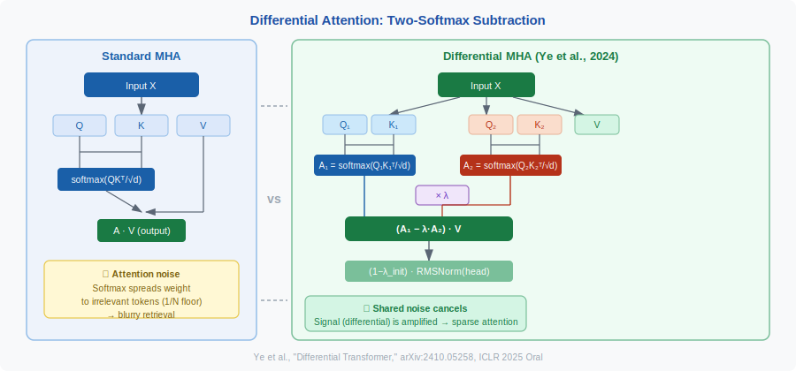
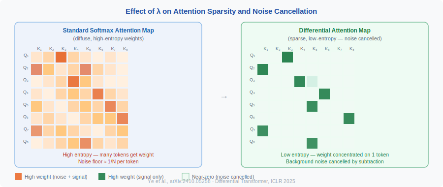

<!-- ============================ TOP NAV ============================ -->
<div align="center">

[🏠 Home](../../README.md) &nbsp;•&nbsp; [📚 Section 1 — Transformer Architecture](./README.md) &nbsp;•&nbsp; [⬅️ Q28 — Expressivity Gap](./q28-expressivity-gap.md) &nbsp;•&nbsp; [Q30 — Hyena / RetNet / RWKV ➡️](./q30-hyena-retnet-rwkv.md)

</div>

---

# Q29 · Differential Transformer — what is it, how does differential attention work, and why does it reduce attention noise?

<div align="center">


</div>

> [!IMPORTANT]
> **The 20-second answer.** Standard softmax attention spreads probability mass broadly, assigning non-trivial weight to irrelevant tokens — this is "attention noise." The Differential Transformer (Ye et al., 2024; ICLR 2025 Oral) fixes this by computing **two** separate softmax attention maps from two pairs of queries and keys, then subtracting one from the other scaled by a learnable scalar $\lambda$. The subtraction cancels the common-mode noise (tokens both heads weakly attend to), leaving a sharp, sparse signal on the tokens that actually matter. The analogy is a noise-canceling headphone: each earbud captures signal + noise; subtracting the two eliminates shared noise. The result is a model that uses fewer parameters to match — or exceed — a standard Transformer of 1.8× the size on long-context retrieval, hallucination, and in-context learning benchmarks.

---

## Table of contents

1. [First principles — why attention has noise](#1--first-principles--why-attention-has-noise)
2. [The problem, told as a story](#2--the-problem-told-as-a-story)
3. [The mechanism, precisely](#3--the-mechanism-precisely)
4. [The lambda parameter](#4--the-lambda-parameter)
5. [Multi-head differential attention](#5--multi-head-differential-attention)
6. [Intuition & figures](#6--intuition--figures)
7. [Variants / comparison](#7--variants--comparison)
8. [Reference implementation](#8--reference-implementation)
9. [Where it's used / where it breaks](#9--where-its-used--where-it-breaks)
10. [Interview drill](#10--interview-drill)
11. [Common misconceptions](#11--common-misconceptions)
12. [One-screen summary](#12--one-screen-summary)
13. [References](#13--references)

---

## 1 · First principles — why attention has noise

Standard scaled dot-product attention computes:

$$
\text{Attn}(Q, K, V) = \text{softmax}\!\left(\frac{QK^\top}{\sqrt{d}}\right) V
$$

Softmax is **sum-preserving**: the output is always a convex combination of value vectors. Even tokens with small similarity scores still receive non-zero weight. On a sequence of length $N$, the baseline attention weight for any token is on the order of $1/N$ even if it is completely irrelevant. For long contexts this "noise floor" drowns out the signal from the genuinely relevant tokens.

> [!NOTE]
> **Plain English.** Softmax is like distributing a fixed budget of $1.00 across all tokens. Even unimportant tokens get a few cents. Over thousands of tokens those cents add up to a blurry, averaged value output — attention noise.

---

## 2 · The problem, told as a story

<div align="center">

<br><sub><b>Figure 1.</b> Standard multi-head attention (left) vs. Differential attention (right). Two softmax attention maps are computed and subtracted with a learnable weight λ, canceling the shared noise floor.</sub>
</div>

Imagine a 10 000-token document. A question asks for the value of a specific variable defined on line 3. A perfect attention map would assign weight 1.0 to that single line and 0.0 everywhere else. In practice, softmax smears weight across hundreds of lines because the exponential normalization is global: every token "competes," but the denominator forces the distribution to be wide. This is why:

- LLMs hallucinate facts buried in long context.
- "Lost in the middle" is a real failure mode (Liu et al., 2023).
- In-context learning is sensitive to example ordering.

The insight of the Differential Transformer: two softmax maps of comparable quality will share the same noise floor. Subtracting them eliminates the shared floor and amplifies only the differential signal.

---

## 3 · The mechanism, precisely

Given an input sequence $X \in \mathbb{R}^{N \times d_\text{model}}$, the differential attention block splits projections into two groups:

$$
[Q_1; Q_2] = X W^Q, \quad [K_1; K_2] = X W^K, \quad V = X W^V
$$

where $W^Q, W^K \in \mathbb{R}^{d_\text{model} \times 2d}$ and $W^V \in \mathbb{R}^{d_\text{model} \times d_\text{model}}$. Each query/key pair has dimension $d$ (half the head dimension of a standard head).

The **differential attention** output is:

$$
\boxed{
\text{DiffAttn}(X) = \Bigl(\text{softmax}\!\left(\tfrac{Q_1 K_1^\top}{\sqrt{d}}\right) - \lambda \cdot \text{softmax}\!\left(\tfrac{Q_2 K_2^\top}{\sqrt{d}}\right)\Bigr) V
}
$$

The two softmax maps are computed independently; their difference is a **signed** attention weight matrix. When both maps assign similar weights to a "background" token, the subtraction cancels that token's contribution. When only one map strongly attends to a specific token (the signal), the difference is large and the token's value vector is retrieved faithfully.

---

## 4 · The lambda parameter

$\lambda$ is a **learnable** scalar per head, initialized via:

$$
\lambda = \exp(\lambda_{q_1} \cdot \lambda_{k_1}) - \exp(\lambda_{q_2} \cdot \lambda_{k_2}) + \lambda_\text{init}
$$

where $\lambda_{q_1}, \lambda_{k_1}, \lambda_{q_2}, \lambda_{k_2}$ are learnable vectors (same dimension as the key) and the dot products form the exponent. The default **layer-wise initialization** is:

$$
\lambda_\text{init} = 0.8 - 0.6 \times \exp\!\bigl(-0.3 \cdot (l - 1)\bigr)
$$

where $l$ is the 1-indexed layer depth. This means:
- Early layers start with $\lambda \approx 0.2$ (mild noise cancellation).
- Deep layers start with $\lambda \approx 0.8$ (strong noise cancellation).

> [!NOTE]
> **Why learnable?** A fixed $\lambda$ too close to 0 gives standard attention; too close to 1 risks gradient instability. A learnable $\lambda$ lets the model tune noise cancellation per head and layer. The paper shows results are robust to the specific initialization strategy.

---

## 5 · Multi-head differential attention

Each head $i$ computes its own $\text{DiffAttn}$ output, which is then normalized and scaled:

$$
\text{head}_i = (1 - \lambda_\text{init}) \cdot \text{LN}\!\left(\text{DiffAttn}(X;\, W_i^Q, W_i^K, W_i^V, \lambda_i)\right)
$$

where $\text{LN}(\cdot)$ is **RMSNorm** applied independently to each head (headwise normalization). The $(1 - \lambda_\text{init})$ multiplier compensates for the magnitude reduction from the subtraction, ensuring gradient flow is comparable to standard multi-head attention.

The final output is:

$$
\text{MultiHead}(X) = \text{Concat}(\text{head}_1, \ldots, \text{head}_h)\, W^O
$$

**Parameter count comparison.** Each differential head splits its Q/K projections in two, so the head dimension is halved. The total parameter count is slightly higher than standard MHA (due to two Q, K projections per head) but the paper matches FLOPs by reducing the number of heads $h$.

---

## 6 · Intuition & figures

<div align="center">

<br><sub><b>Figure 2.</b> Attention weight heatmaps for a representative head: standard softmax attention (left) diffuses weight broadly, while differential attention (right) concentrates it on 1–3 positions, dramatically reducing "attention noise."</sub>
</div>

**The noise-canceling headphone analogy.** A noise-canceling headphone has two microphones: one facing the environment (signal + noise) and one facing inward (mostly noise). The electronics subtract the inward signal from the outward signal, canceling shared noise. Differential attention does the same: $Q_1 K_1^\top$ is the "outward mic" and $Q_2 K_2^\top$ is the "inward mic."

**Differential amplifier analogy.** In electrical engineering, a differential amplifier amplifies the *difference* between two inputs, rejecting common-mode signals. This is exactly the mathematical structure of DiffAttn.

**Effect on attention maps.** Empirically, the paper shows that differential attention heads have much sparser attention maps than standard heads — the effective attention is concentrated on 1–3 tokens rather than diffuse across dozens. This directly reduces hallucination and improves retrieval.

---

## 7 · Variants / comparison

| Property | Standard MHA | Differential MHA |
|---|---|---|
| Attention maps per head | 1 softmax | 2 softmax, subtracted |
| Head dimension | $d_\text{head}$ | $d_\text{head}/2$ per sub-head |
| Learnable noise param | None | $\lambda$ per head |
| Normalization | None within head | RMSNorm per head |
| Training cost | Baseline | ~$\approx$1.0× (matched FLOPs) |
| Long-context retrieval | Baseline | +significant gain |
| Attention sparsity | Low | High (emergent) |
| Activation outliers | High | Low (reduces outliers) |
| Publication | Vaswani et al. 2017 | Ye et al. 2024, ICLR 2025 Oral |

**Key results from the paper (Ye et al., 2024):**
- A DIFF Transformer with 3B parameters matches a standard Transformer with 6.8B parameters on long-context key retrieval tasks (2× compression).
- Hallucination rate on summarization tasks is reduced.
- In-context learning is more robust to example ordering.
- Activation outliers are substantially reduced, which benefits quantization.

---

## 8 · Reference implementation

```python
import torch
import torch.nn as nn
import torch.nn.functional as F
import math

class DifferentialAttentionHead(nn.Module):
    """
    Single differential attention head (Ye et al., 2024).
    d_head: full head dimension; each sub-head uses d_head // 2.
    """
    def __init__(self, d_model: int, d_head: int, layer_idx: int = 0):
        super().__init__()
        self.d_sub = d_head // 2          # sub-head dimension
        self.layer_idx = layer_idx

        # Two Q/K projections (concatenated), one V projection
        self.W_Q = nn.Linear(d_model, 2 * self.d_sub, bias=False)
        self.W_K = nn.Linear(d_model, 2 * self.d_sub, bias=False)
        self.W_V = nn.Linear(d_model, d_head, bias=False)

        # Learnable lambda components (scalar dot-product form)
        self.lq1 = nn.Parameter(torch.randn(self.d_sub) * 0.1)
        self.lk1 = nn.Parameter(torch.randn(self.d_sub) * 0.1)
        self.lq2 = nn.Parameter(torch.randn(self.d_sub) * 0.1)
        self.lk2 = nn.Parameter(torch.randn(self.d_sub) * 0.1)

        # Layer-wise lambda_init (fixed, used for scaling)
        self.lambda_init = 0.8 - 0.6 * math.exp(-0.3 * layer_idx)

        self.norm = nn.RMSNorm(d_head)

    def _lambda(self) -> torch.Tensor:
        return (torch.exp(self.lq1 @ self.lk1)
                - torch.exp(self.lq2 @ self.lk2)
                + self.lambda_init)

    def forward(self, x: torch.Tensor, mask=None) -> torch.Tensor:
        # x: (B, N, d_model)
        B, N, _ = x.shape
        d = self.d_sub

        QQ = self.W_Q(x)                  # (B, N, 2*d)
        KK = self.W_K(x)                  # (B, N, 2*d)
        V  = self.W_V(x)                  # (B, N, d_head)

        Q1, Q2 = QQ[..., :d], QQ[..., d:]
        K1, K2 = KK[..., :d], KK[..., d:]

        scale = d ** -0.5
        A1 = F.softmax(Q1 @ K1.transpose(-2, -1) * scale, dim=-1)  # (B,N,N)
        A2 = F.softmax(Q2 @ K2.transpose(-2, -1) * scale, dim=-1)  # (B,N,N)

        lam = self._lambda()
        # Differential attention output
        out = (A1 - lam * A2) @ V         # (B, N, d_head)

        # Headwise normalization + scaling
        out = (1 - self.lambda_init) * self.norm(out)
        return out
```

> [!WARNING]
> The implementation above is didactic. Production usage should fuse the two attention computations with FlashAttention-style IO-aware kernels. The signed attention weights mean the output is **not** constrained to be a convex combination of V — values can be subtracted, which may require careful initialization.

---

## 9 · Where it's used / where it breaks

**Works well:**
- Long-context tasks (needle-in-a-haystack, multi-hop QA).
- Tasks requiring precise retrieval from large contexts.
- Reducing hallucination in summarization and QA.
- Post-training quantization (fewer activation outliers).

**Caution / limitations:**
- The two-softmax computation is slightly more expensive than one (though FLOPs can be matched by reducing head count).
- Existing FlashAttention kernels do not natively support differential attention; custom kernels are needed.
- Negative attention weights (when $\lambda$ is large) can complicate interpretation.
- The paper was trained from scratch; retrofitting to pretrained standard Transformers is non-trivial (though see arXiv:2505.16333 for work on unchaining pretrained self-attentions).

---

## 10 · Interview drill

<details><summary><b>Q: Why does subtracting two softmax maps reduce noise rather than just introducing negative weights?</b></summary>

Both maps compute softmax over the same keys, so tokens that are weakly attended by both maps (noise) have similar weights in both. The subtraction cancels their common contribution. Tokens that are strongly attended by $A_1$ but less by $A_2$ (the actual signal) have a large positive differential weight. The result is a signed weight matrix that is effectively sparser than either individual softmax map.
</details>

<details><summary><b>Q: Why is lambda layer-dependent in its initialization?</b></summary>

Early layers tend to build local syntactic representations and benefit from less aggressive noise cancellation ($\lambda \approx 0.2$). Deeper layers attend over more abstract, semantically distant tokens and benefit from stronger noise cancellation ($\lambda \approx 0.8$). The exponential schedule provides a smooth ramp.
</details>

<details><summary><b>Q: How does this compare to sparse attention (e.g., BigBird, Longformer)?</b></summary>

Sparse attention pre-specifies which tokens can attend to which (via sliding window + global tokens). Differential attention achieves sparsity **emergently** — the model learns which tokens to cancel out, without any hardcoded sparsity pattern. This is more flexible but requires the model to learn the cancellation structure during training.
</details>

<details><summary><b>Q: What is the cost in FLOPs vs. standard MHA?</b></summary>

Two Q/K projections double the cost of QK projection, but if you halve the number of heads (keeping total parameters similar), the overall FLOPs are comparable. The paper reports matched-FLOP comparisons.
</details>

---

## 11 · Common misconceptions

| Misconception | Reality |
|---|---|
| "Differential attention removes all background attention." | It reduces it — the subtraction cancels shared noise, but the remaining signal is not guaranteed to be perfectly sparse. |
| "$\lambda$ must be between 0 and 1." | $\lambda$ is unconstrained; it is a learnable scalar. Values greater than 1 are theoretically possible, though the initialization keeps it in $(0,1)$ initially. |
| "This doubles the cost of attention." | FLOPs are matched to standard MHA by halving the number of heads. |
| "Pretrained standard Transformers can be trivially converted." | Retrofit is non-trivial; the paper trains from scratch. Research on conversion is ongoing (arXiv:2505.16333). |

---

## 12 · One-screen summary

> **What:** Compute two independent softmax attention maps $(A_1, A_2)$ and output $(A_1 - \lambda A_2)V$ with a learnable $\lambda$. **Problem solved:** Softmax attention noise — weak but non-zero weights on irrelevant tokens that blur retrieval and cause hallucination. **Why it works:** Common-mode noise is identical in both maps and cancels; signal tokens are differential and survive. **Caveats:** Needs custom kernels for efficiency; trained from scratch; negative weights complicate interpretation.

---

## 13 · References

1. **Ye, T., Dong, L., Xia, Y., Sun, Y., Zhu, Y., Huang, G., Wei, F.** "Differential Transformer." arXiv:2410.05258, October 2024. Accepted as Oral at ICLR 2025. [https://arxiv.org/abs/2410.05258](https://arxiv.org/abs/2410.05258)

2. **Vaswani, A., et al.** "Attention Is All You Need." NeurIPS 2017. The baseline standard MHA this work extends.

3. **Liu, N., et al.** "Lost in the Middle: How Language Models Use Long Contexts." TACL 2024. Motivates the attention noise problem.

4. **Understanding Differential Transformer Unchains Pretrained Self-Attentions.** arXiv:2505.16333, 2025. Follow-up on retrofitting. [https://arxiv.org/abs/2505.16333](https://arxiv.org/abs/2505.16333)

5. **Differential Transformer V2.** Hugging Face blog, Microsoft Research. [https://huggingface.co/blog/microsoft/diff-attn-v2](https://huggingface.co/blog/microsoft/diff-attn-v2)

---

<!-- ============================ BOTTOM NAV ============================ -->
<div align="center">

[⬅️ Q28 — Expressivity Gap](./q28-expressivity-gap.md) &nbsp;|&nbsp; [📚 Back to Section 1](./README.md) &nbsp;|&nbsp; [🏠 Home](../../README.md) &nbsp;|&nbsp; [Q30 — Hyena / RetNet / RWKV ➡️](./q30-hyena-retnet-rwkv.md)

<sub>Found an error? See <a href="../../CONTRIBUTING.md">CONTRIBUTING</a>.</sub>

</div>
