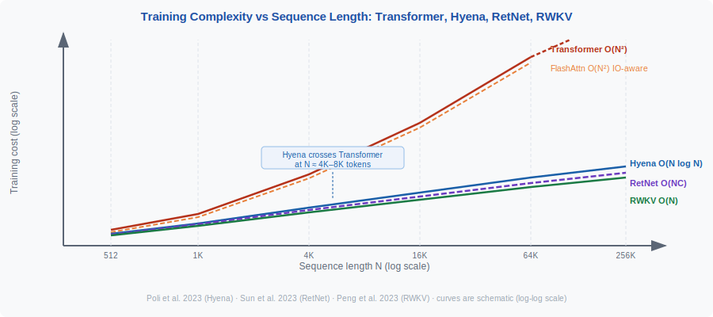
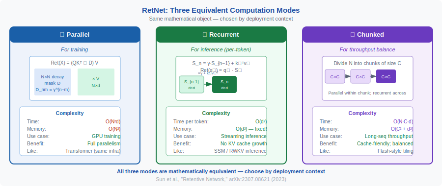

<!-- ============================ TOP NAV ============================ -->
<div align="center">

[🏠 Home](../../README.md) &nbsp;•&nbsp; [📚 Section 1 — Transformer Architecture](./README.md) &nbsp;•&nbsp; [⬅️ Q29 — Differential Transformer](./q29-differential-transformer.md) &nbsp;•&nbsp; [Q31 — Softmax-Free Attention ➡️](./q31-softmax-free-attention.md)

</div>

---

# Q30 · Hyena, RetNet, and RWKV — complexity profiles, mechanisms, and when to use each

<div align="center">


</div>

> [!IMPORTANT]
> **The 20-second answer.** All three replace standard $O(N^2)$ attention with sub-quadratic or linear alternatives. **Hyena** (Poli et al., 2023) uses implicitly-parametrized long convolutions computed via FFT: $O(N \log N)$ training, $O(N)$ inference (sequential). **RetNet** (Sun et al., 2023) introduces a "retention" mechanism with three computation modes — parallel ($O(N^2)$) for training, recurrent ($O(1)$ per token) for inference, and chunked ($O(C^2 N/C)$) for throughput balance. **RWKV** (Peng et al., 2023) uses a WKV operator — a time-decay weighted key-value that can be parallelized during training ($O(Td^2)$) and runs as a true RNN at inference ($O(d)$ per token). None fully matches attention quality on associative-recall tasks, but all trade some accuracy for dramatically better inference efficiency.

---

## Table of contents

1. [Motivation — the quadratic wall](#1--motivation--the-quadratic-wall)
2. [Hyena — implicit long convolutions](#2--hyena--implicit-long-convolutions)
3. [RetNet — retention with three modes](#3--retnet--retention-with-three-modes)
4. [RWKV — reinventing RNNs for the Transformer era](#4--rwkv--reinventing-rnns-for-the-transformer-era)
5. [Complexity comparison table](#5--complexity-comparison-table)
6. [When to use each](#6--when-to-use-each)
7. [Reference implementations (sketches)](#7--reference-implementations-sketches)
8. [Interview drill](#8--interview-drill)
9. [Common misconceptions](#9--common-misconceptions)
10. [One-screen summary](#10--one-screen-summary)
11. [References](#11--references)

---

## 1 · Motivation — the quadratic wall

Standard multi-head attention:

$$
\text{Attn}(Q, K, V) = \text{softmax}\!\left(\frac{QK^\top}{\sqrt{d}}\right) V
$$

requires materializing the $N \times N$ attention matrix, costing $O(N^2 d)$ time and $O(N^2)$ memory. For $N = 100\text{k}$ tokens (a book), the matrix is $10^{10}$ entries — infeasible. FlashAttention reduces memory to $O(N)$ via tiling but does not change the asymptotic time complexity. A fundamentally different mechanism is needed.

The three approaches below replace the attention operation with sub-quadratic primitives while preserving much of the modeling capacity.

---

## 2 · Hyena — implicit long convolutions

<div align="center">

<br><sub><b>Figure 1.</b> Training time scaling with sequence length N. Hyena (O(N log N)) and RetNet/RWKV (linear modes) become faster than FlashAttention above ~6 000 tokens, a key motivation for sub-quadratic architectures.</sub>
</div>

**Paper:** "Hyena Hierarchy: Towards Larger Convolutional Language Models"
**Authors:** Michael Poli, Stefano Massaroli, Eric Nguyen, Daniel Y. Fu, Tri Dao, Stephen Baccus, Yoshua Bengio, Stefano Ermon, Christopher Ré
**Venue:** ICML 2023
**arXiv:** 2302.10866 (February 2023)

### Core mechanism

The Hyena operator replaces attention with a **recurrence of long convolutions and element-wise gating**. Given input projections $v, z^{(1)}, \ldots, z^{(N_\text{ord})}$ (where $N_\text{ord}$ is the "order" of the operator, typically 2–3), the recurrence is:

$$
y^{(0)} = v
$$

$$
y^{(n)} = z^{(n)} \star \bigl(h^{(n)} * y^{(n-1)}\bigr), \quad n = 1, \ldots, N_\text{ord}
$$

where $\star$ denotes element-wise multiplication, $*$ denotes long convolution, and $h^{(n)}$ is a **filter parametrized by a small feed-forward network** (MLP over positional features). The filters are "implicit" — they are not stored as explicit weight vectors but generated on-the-fly from an MLP, giving sublinear parameter scaling with sequence length.

In pseudocode:

```
v, z1, z2 = input_projections(u)   # three projections of input u
h1 = hyena_filter(L)               # filter at order 1, generated by MLP
h2 = hyena_filter(L)               # filter at order 2
y  = v
y  = z1 * fftconv(h1, y)          # element-wise gating + FFT convolution
y  = z2 * fftconv(h2, y)          # repeat for each order
output = y
```

### Complexity

- **Training:** $O(N_\text{ord} \cdot N \log N)$ via FFT convolution. For $N_\text{ord} = 2$ and long sequences, this beats FlashAttention at $N \gtrsim 6\text{k}$; at $N = 100\text{k}$ Hyena is $\approx 100\times$ faster.
- **Inference:** $O(N \cdot d)$ sequential; no native parallel decoding advantage (though the recurrence can be unrolled).

### Strengths and limitations

| Dimension | Hyena |
|---|---|
| Expressivity | Strictly sub-quadratic; cannot exactly simulate softmax attention |
| Long-context speed | Excellent ($O(N \log N)$) |
| Language modeling | Closes most of the gap with attention at matched FLOP budgets |
| Associative recall | Weaker than attention (finite-depth recurrence) |
| Parameter count | Sublinear in $N$ (implicit filters) |
| Crossover with FlashAttn | $\sim 6\text{k}$ tokens |

---

## 3 · RetNet — retention with three modes

**Paper:** "Retentive Network: A Successor to Transformer for Large Language Models"
**Authors:** Yutao Sun, Li Dong, Shaohan Huang, Shuming Ma, Yuqing Xia, Jilong Xue, Jianyong Wang, Furu Wei
**arXiv:** 2307.08621 (July 2023)

### Core mechanism: the retention function

RetNet replaces softmax attention with a **retention** function based on a geometric decay. For a sequence position $n$ and head $h$, define a decay rate $\gamma_h \in (0,1)$ (different per head — multi-scale retention).

**Parallel representation** (for training):

$$
\text{Retention}(X) = (QK^\top \odot D)\, V
$$

where $D \in \mathbb{R}^{N \times N}$ is the causal decay matrix:

$$
D_{nm} = \begin{cases} \gamma^{n-m} & \text{if } n \geq m \\ 0 & \text{otherwise} \end{cases}
$$

This replaces the softmax with a simple masking + decay operation. No normalization is needed; the decay ensures old tokens have exponentially less influence.

**Recurrent representation** (for $O(1)$ inference):

The state at position $n$ is a matrix $S_n \in \mathbb{R}^{d \times d}$:

$$
S_n = \gamma \cdot S_{n-1} + k_n^\top v_n
$$

$$
\text{Retention}(x_n) = q_n \cdot S_n
$$

This is a pure RNN with constant-size state — $O(d^2)$ per step, $O(1)$ in sequence length.

**Chunkwise recurrent representation** (for throughput balance):

Divide the sequence into chunks of size $C$. Within each chunk, use the parallel representation ($O(C^2)$). Across chunks, pass the state $S$ recurrently. This gives $O(NC)$ time with cache-friendly memory access.

### Multi-scale retention

Each head $h$ uses a distinct $\gamma_h$:

$$
\gamma_h = 1 - 2^{-5 - h}, \quad h = 1, \ldots, H
$$

so heads range from $\gamma \approx 0.97$ (long memory) to $\gamma \approx 0.5$ (short memory).

### Complexity

| Mode | Time | Memory | Use case |
|---|---|---|---|
| Parallel | $O(N^2 d)$ | $O(N^2)$ | Training (GPU-parallel) |
| Recurrent | $O(N d^2)$ | $O(d^2)$ | Autoregressive inference |
| Chunkwise | $O(NC \cdot d)$ | $O(C^2 + d^2)$ | Long-sequence throughput |

### Strengths and limitations

| Dimension | RetNet |
|---|---|
| Training | Parallel, comparable to Transformer |
| Inference | $O(1)$ per token (true RNN) |
| Perplexity | Competitive with Transformer at matched params |
| Associative recall | Weaker (exponential decay loses distant info) |
| Flexible context window | No (fixed decay, no sliding attention) |

---

## 4 · RWKV — reinventing RNNs for the Transformer era

**Paper:** "RWKV: Reinventing RNNs for the Transformer Era"
**Authors:** Bo Peng, Eric Alcaide, Quentin Anthony, Alon Albalak, Samuel Arcadinho, Huanqi Cao, Xin Cheng, Michael Chung, Matteo Grella, Kranthi Kiran GV, Xuzheng He, Haowen Hou, Przemyslaw Kazienko, Jan Kocon, Jiaming Kong, Bartlomiej Koptyra, Hayden Lau, Krishna Sri Ipsit Mantri, Ferdinand Mom, Atsushi Saito, Xiangru Tang, Bolun Wang, Johan S. Wind, Stanislaw Wozniak, Ruichong Zhang, Zhenyuan Zhang, Qihang Zhao, Peng Zhou, Jian Zhu, Rui-Jie Zhu
**Venue:** EMNLP 2023 Findings
**arXiv:** 2305.13048 (May 2023)

### Core mechanism: the WKV operator

RWKV uses two alternating sublayers — **Time-Mixing** (replaces attention) and **Channel-Mixing** (replaces FFN).

**Time-Mixing — the WKV operator:**

For token at position $t$, first compute receptance $r_t$, key $k_t$, value $v_t$ via token-shifted linear projections:

$$
r_t = W_r \cdot (\mu_r \odot x_t + (1-\mu_r) \odot x_{t-1})
$$

$$
k_t = W_k \cdot (\mu_k \odot x_t + (1-\mu_k) \odot x_{t-1})
$$

$$
v_t = W_v \cdot (\mu_v \odot x_t + (1-\mu_v) \odot x_{t-1})
$$

The WKV operator is a time-decay weighted sum:

$$
\text{wkv}_t = \frac{\displaystyle\sum_{i=1}^{t-1} e^{-(t-1-i)w + k_i} \odot v_i \;+\; e^{u + k_t} \odot v_t}{\displaystyle\sum_{i=1}^{t-1} e^{-(t-1-i)w + k_i} \;+\; e^{u + k_t}}
$$

where $w \in \mathbb{R}^d$ is a **non-negative learnable time-decay vector** and $u \in \mathbb{R}^d$ is a **learnable bonus for the current token**. The output is:

$$
o_t = W_o \cdot (\sigma(r_t) \odot \text{wkv}_t)
$$

**Channel-Mixing (replaces FFN):**

$$
o'_t = \sigma(r'_t) \odot \bigl(W'_v \cdot \max(k'_t, 0)^2\bigr)
$$

using squared ReLU activation.

### Key design insight

The WKV formula can be computed in two ways:
1. **Parallel (training):** Unroll the sum; it has the structure of a cumulative sum that can be parallelized along the time dimension, similar to a prefix scan. Training cost dominates at $O(BTd^2)$ (matrix multiplications in $W_r, W_k, W_v, W_o$).
2. **Recurrent (inference):** Maintain two running accumulators $a_t$ and $b_t$: $a_t = \gamma a_{t-1} + e^{k_t} v_t$ and $b_t = \gamma b_{t-1} + e^{k_t}$, so $\text{wkv}_t = a_t / b_t$. This is $O(d)$ per token — constant in sequence length.

### RWKV-5 (Eagle) and RWKV-6 (Finch)

The follow-up paper (Peng et al., 2024; arXiv:2404.05892) introduces:
- **RWKV-5 / Eagle:** Multi-headed **matrix-valued** states (replacing scalar accumulation with outer products), reformulated receptance, additional gating.
- **RWKV-6 / Finch:** Data-dependent time-mixing weights (the decay $w$ becomes input-dependent), enabling more expressive context-dependent memory dynamics. 7B Finch improved +5.38% vs 7B Eagle across benchmarks.

### Complexity

| Aspect | Training | Inference |
|---|---|---|
| Time | $O(BTd^2)$ | $O(Td)$ per step |
| Memory | $O(T^2 + Td)$ (scan) | $O(d)$ (state only) |
| Mechanism | Parallel prefix scan | Sequential RNN state update |

---

## 5 · Complexity comparison table

<div align="center">

<br><sub><b>Figure 2.</b> RetNet's three computation modes. Parallel mode (training): O(N²d), identical complexity to standard attention. Recurrent mode (inference): O(d²) per token, constant KV cache. Chunked mode (efficient training): interpolates between the two.</sub>
</div>

| Model | Training time | Training memory | Inference / token | State size |
|---|---|---|---|---|
| Standard Transformer | $O(N^2 d)$ | $O(N^2)$ | $O(N d)$ (KV cache grows) | $O(Nd)$ KV cache |
| FlashAttention | $O(N^2 d)$ | $O(N)$ (tiled) | $O(Nd)$ | $O(Nd)$ KV cache |
| Hyena ($p$ orders) | $O(p \cdot N \log N)$ | $O(N)$ | $O(Nd)$ sequential | $O(d)$ per filter |
| RetNet (parallel) | $O(N^2 d)$ | $O(N^2)$ | — | — |
| RetNet (recurrent) | — | — | $O(d^2)$ | $O(d^2)$ state matrix |
| RetNet (chunked) | $O(NCd)$ | $O(C^2 + d^2)$ | $O(d^2)$ | $O(d^2)$ state matrix |
| RWKV (training) | $O(Td^2)$ | $O(Td)$ | — | — |
| RWKV (inference) | — | — | $O(d)$ | $O(d)$ accumulators |
| Mamba (SSM) | $O(N \cdot d \cdot D)$ | $O(ND)$ | $O(dD)$ | $O(dD)$ state |

$N$ = sequence length, $d$ = model dimension, $T$ = sequence length (RWKV notation), $C$ = chunk size, $D$ = SSM state dimension.

---

## 6 · When to use each

| Scenario | Best choice | Reason |
|---|---|---|
| Long-context language modeling ($N > 10\text{k}$) with training budget | Hyena or RetNet chunked | Sub-quadratic training |
| Streaming inference, edge deployment | RWKV or RetNet recurrent | True $O(1)$ per token RNN |
| High-quality retrieval / associative recall | Transformer + FlashAttention | Attention is still best here |
| Very long sequences ($N > 100\text{k}$) | Hyena | FFT convolution scales best |
| Matching Transformer perplexity at scale | RetNet or RWKV (14B) | Both scale like Transformers in perplexity |
| Multilingual, diverse tasks | RWKV-6 (Finch) | Trained on diverse multilingual corpus |

---

## 7 · Reference implementations (sketches)

### Hyena (pseudocode)
```python
def hyena_operator(u, order=2):
    # u: (B, L, d)
    projections = [linear(u) for _ in range(order + 1)]  # v, z1, z2, ...
    v = projections[0]
    for n in range(1, order + 1):
        h = mlp_filter(L)          # implicit filter via MLP, shape (L, d)
        v = projections[n] * fft_conv(h, v)  # elem-wise gate + FFT conv
    return linear_output(v)
```

### RetNet recurrent (pseudocode)
```python
def retnet_step(x_t, S, gamma):
    # x_t: (d,), S: (d, d) state matrix
    q = W_Q @ x_t;  k = W_K @ x_t;  v = W_V @ x_t
    S = gamma * S + torch.outer(k, v)   # state update
    y = q @ S                           # retrieval
    return y, S
```

### RWKV inference step (pseudocode)
```python
def rwkv_step(x_t, x_prev, a, b, w, u):
    # Token shift
    k = W_k @ (mu_k * x_t + (1 - mu_k) * x_prev)
    v = W_v @ (mu_v * x_t + (1 - mu_v) * x_prev)
    r = W_r @ (mu_r * x_t + (1 - mu_r) * x_prev)
    # WKV update
    wkv = (a + exp(u + k) * v) / (b + exp(u + k))
    a = exp(-exp(w)) * a + exp(k) * v   # accumulator update
    b = exp(-exp(w)) * b + exp(k)
    out = W_o @ (sigmoid(r) * wkv)
    return out, a, b
```

---

## 8 · Interview drill

<details><summary><b>Q: Why does RetNet have three computation modes rather than one?</b></summary>

The three modes correspond to three engineering trade-offs. The parallel mode matches Transformer training throughput by using GPU parallelism over the full sequence. The recurrent mode provides $O(1)$ inference cost per token, critical for deployment. The chunkwise mode is a middle ground: within each chunk, computation is parallel (fast); across chunks, it is recurrent (memory efficient). Different deployment scenarios call for different modes.
</details>

<details><summary><b>Q: RWKV claims linear complexity — what is linear in what?</b></summary>

During inference, RWKV is $O(d)$ per token — linear in the model dimension, independent of sequence length. During training, the cost is $O(Td^2)$ — linear in sequence length $T$ (dominated by the $d \times d$ weight matrix multiplications, which scale the same way as a Transformer's FFN, but the sequence scan is $O(T)$ rather than $O(T^2)$).
</details>

<details><summary><b>Q: Where does Hyena fail compared to attention?</b></summary>

Hyena struggles on tasks requiring sharp associative recall — retrieving a specific key-value pair from a long context. The FFT convolution is a fixed linear operation; it cannot route information as flexibly as the data-dependent attention matrix. On copying or induction-head tasks, Hyena lags behind Transformers, especially at small model sizes.
</details>

<details><summary><b>Q: What is the crossover point between Hyena and FlashAttention?</b></summary>

Empirically, at sequence lengths below $\sim 6\text{k}$ tokens, highly optimized FlashAttention is faster. At $N = 100\text{k}$, Hyena is approximately 100× faster. The exact crossover depends on hardware and implementation.
</details>

---

## 9 · Common misconceptions

| Misconception | Reality |
|---|---|
| "RetNet is always $O(1)$ complexity." | $O(1)$ per token applies only to the recurrent mode. Parallel training mode is $O(N^2)$. |
| "RWKV cannot be parallelized." | Training uses a parallel prefix scan (like a cumulative sum), which is GPU-parallelizable. |
| "Hyena is $O(N \log N)$ during inference." | Inference runs the recurrence sequentially; only training benefits from FFT-based parallelism. |
| "These models match Transformers on all tasks." | On associative recall and precise retrieval tasks, softmax attention retains a significant quality advantage. |
| "RWKV-4 is the latest version." | As of 2024, RWKV-5 (Eagle) and RWKV-6 (Finch) with matrix-valued states and data-dependent recurrence are the current versions (arXiv:2404.05892). |

---

## 10 · One-screen summary

> **Hyena:** $O(N \log N)$ via implicit FFT convolutions; best for very long sequence training. **RetNet:** Three computation modes (parallel/recurrent/chunked); $O(N^2)$ training, $O(1)$ inference per token via geometric decay state. **RWKV:** WKV time-decay operator; parallelizable at training ($O(Td^2)$), true $O(d)$ RNN at inference. All three sacrifice some associative-recall quality for inference efficiency. Choose based on deployment constraints.

---

## 11 · References

1. **Poli, M., Massaroli, S., Nguyen, E., Fu, D.Y., Dao, T., Baccus, S., Bengio, Y., Ermon, S., Ré, C.** "Hyena Hierarchy: Towards Larger Convolutional Language Models." ICML 2023. arXiv:2302.10866. [https://arxiv.org/abs/2302.10866](https://arxiv.org/abs/2302.10866)

2. **Sun, Y., Dong, L., Huang, S., Ma, S., Xia, Y., Xue, J., Wang, J., Wei, F.** "Retentive Network: A Successor to Transformer for Large Language Models." arXiv:2307.08621, July 2023. [https://arxiv.org/abs/2307.08621](https://arxiv.org/abs/2307.08621)

3. **Peng, B., et al.** "RWKV: Reinventing RNNs for the Transformer Era." EMNLP 2023 Findings. arXiv:2305.13048. [https://arxiv.org/abs/2305.13048](https://arxiv.org/abs/2305.13048)

4. **Peng, B., et al.** "Eagle and Finch: RWKV with Matrix-Valued States and Dynamic Recurrence." arXiv:2404.05892, April 2024. [https://arxiv.org/abs/2404.05892](https://arxiv.org/abs/2404.05892) — RWKV-5 and RWKV-6.

5. **Gu, A., Dao, T.** "Mamba: Linear-Time Sequence Modeling with Selective State Spaces." arXiv:2312.00752, 2023. — Related SSM for comparison.

---

<!-- ============================ BOTTOM NAV ============================ -->
<div align="center">

[⬅️ Q29 — Differential Transformer](./q29-differential-transformer.md) &nbsp;|&nbsp; [📚 Back to Section 1](./README.md) &nbsp;|&nbsp; [🏠 Home](../../README.md) &nbsp;|&nbsp; [Q31 — Softmax-Free Attention ➡️](./q31-softmax-free-attention.md)

<sub>Found an error? See <a href="../../CONTRIBUTING.md">CONTRIBUTING</a>.</sub>

</div>
