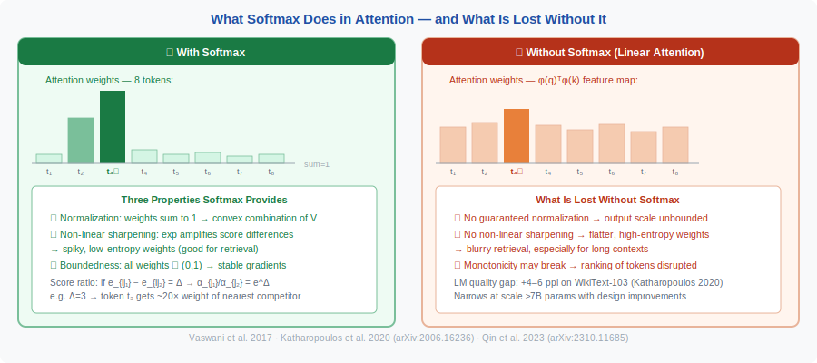
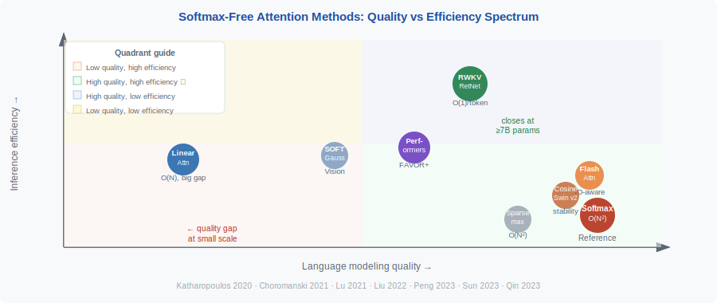

<!-- ============================ TOP NAV ============================ -->

[🏠 Home](../../README.md) &nbsp;•&nbsp; [📚 Section 1 — Transformer Architecture](./README.md) &nbsp;•&nbsp; [⬅️ Q30 — Hyena / RetNet / RWKV](./q30-hyena-retnet-rwkv.md) &nbsp;•&nbsp; [Q32 — Attention Turing Complete ➡️](./q32-attention-turing-complete.md)

---

# Q31 · The role of softmax in attention — is softmax-free attention viable?

> [!IMPORTANT]
> **The 20-second answer.** Softmax in attention serves three purposes: (1) it normalizes raw dot-product scores into a probability distribution so they sum to 1, (2) it provides a non-linear "sharpening" that concentrates weight on the most relevant tokens (spiky, low-entropy attention), and (3) it is numerically bounded (outputs always in $[0,1]$). Softmax-free attention is possible and has been demonstrated — notably via kernel feature maps (linear attention, Performers), Gaussian kernels (SOFT), and cosine similarity (Swin v2) — but all currently suffer a meaningful quality gap on language tasks compared to softmax attention. The core problem is that removing softmax loses the normalization invariance and the data-dependent spikiness that makes attention so effective at retrieving specific tokens.

---

## Table of contents

1. [Why softmax? — first principles](#1--why-softmax--first-principles)
2. [What breaks without softmax](#2--what-breaks-without-softmax)
3. [Linear attention — the kernel trick](#3--linear-attention--the-kernel-trick)
4. [SOFT — Gaussian kernel attention](#4--soft--gaussian-kernel-attention)
5. [Cosine attention in Swin v2](#5--cosine-attention-in-swin-v2)
6. [Hardmax and sparsemax](#6--hardmax-and-sparsemax)
7. [Quality gap analysis](#7--quality-gap-analysis)
8. [Comparison table](#8--comparison-table)
9. [When softmax-free attention is viable](#9--when-softmax-free-attention-is-viable)
10. [Worked numerical example](#10--worked-numerical-example)
11. [Where it's used / where it breaks](#11--where-its-used--where-it-breaks)
12. [Cousins & alternatives](#12--cousins--alternatives)
13. [Interview drill](#13--interview-drill)
14. [Common misconceptions](#14--common-misconceptions)
15. [One-screen summary](#15--one-screen-summary)
16. [References](#16--references)

---

## 1 · Why softmax? — first principles

Raw scaled dot-product scores:

$$
e_{ij} = \frac{q_i \cdot k_j}{\sqrt{d}}
$$

are unbounded real numbers. Softmax converts them to a probability distribution:

$$
\alpha_{ij} = \frac{\exp(e_{ij})}{\sum_{j'} \exp(e_{ij'})}
$$

This gives three properties:
1. **Normalization:** $\sum_j \alpha_{ij} = 1$ — the output is a convex combination of values.
2. **Non-linear sharpening:** The exponential magnifies differences; a score difference of $\Delta e$ leads to a probability ratio of $e^\Delta$. This creates "spiky" distributions that concentrate on a few tokens.
3. **Boundedness:** All weights lie in $(0,1)$; gradients are well-behaved.

> [!NOTE]
> **The spikiness property matters.** Empirical analysis (arXiv:2310.11685) shows that softmax attention has consistently low-entropy (spiky) weight distributions. This is what allows a single attention head to retrieve a specific token from a long context. Removing softmax tends to produce higher-entropy (flatter) weights, which blurs retrieval.

The $\sqrt{d}$ scaling was introduced by Vaswani et al. (2017) because without it, large $d$ causes $q \cdot k$ to grow large, pushing softmax into saturation (near-zero gradients).

---

## 2 · What breaks without softmax

 <b>Figure 1.</b> Softmax produces spiky, low-entropy attention weights (left) that concentrate on relevant tokens. Without softmax (right), weights are flatter and unbounded — blurring retrieval, especially at long context.

Without softmax, the output $\sum_j e_{ij} \cdot v_j$ (raw dot products times values) is:
- **Unbounded:** A single large score can dominate with arbitrary magnitude.
- **Non-normalized:** The output is no longer a convex combination; it can have arbitrary scale.
- **Linear in scores:** No non-linear sharpening — the model cannot easily concentrate attention.

These issues are not fatal, but they require mitigation via alternative mechanisms.

---

## 3 · Linear attention — the kernel trick

**Paper:** "Transformers are RNNs: Fast Autoregressive Transformers with Linear Attention"
**Authors:** Angelos Katharopoulos, Apoorv Vyas, Nikolaos Pappas, François Fleuret
**Venue:** ICML 2020
**arXiv:** 2006.16236

### The key idea

Softmax attention can be written as:

$$
\text{Attn}(Q, K, V)_i = \frac{\sum_j \text{sim}(q_i, k_j) \cdot v_j}{\sum_j \text{sim}(q_i, k_j)}
$$

where $\text{sim}(q,k) = \exp(q \cdot k / \sqrt{d})$ is a kernel function. The paper proposes approximating this with a **feature map** $\phi: \mathbb{R}^d \to \mathbb{R}^r$ such that:

$$
\text{sim}(q, k) \approx \phi(q)^\top \phi(k)
$$

Then:

$$
\text{Attn}(Q, K, V)_i = \frac{\phi(q_i)^\top \left(\sum_j \phi(k_j) v_j^\top\right)}{\phi(q_i)^\top \left(\sum_j \phi(k_j)\right)}
$$

By computing the sums $\sum_j \phi(k_j) v_j^\top$ and $\sum_j \phi(k_j)$ **first** (exploiting associativity of matrix multiplication), the complexity drops from $O(N^2 d)$ to $O(N r d)$, which is $O(N)$ when $r$ is fixed.

### Feature map choice

Katharopoulos et al. used:

$$
\phi(x) = \text{elu}(x) + 1
$$

where elu is the exponential linear unit. This ensures non-negativity (required for the ratio to be valid). The authors note that any non-negative kernel feature map works in principle.

### Causal masking complication

In autoregressive (decoder) settings, the causal mask prevents computing $\sum_j \phi(k_j) v_j^\top$ globally — it depends on the query position. The recurrent formulation resolves this: maintain a running sum $S_i = \sum_{j \leq i} \phi(k_j) v_j^\top$, updated at each step in $O(rd)$ per token.

### Quality gap

Despite $O(N)$ complexity, linear attention suffers a significant quality gap on language modeling:
- Perplexity on WikiText-103: linear attention is 4–6 ppl worse than softmax attention.
- Root cause: $\phi(x) = \text{elu}(x)+1$ does not approximate the softmax kernel well for typical $(q,k)$ magnitudes. The approximation loses the spikiness of softmax.

---

## 4 · SOFT — Gaussian kernel attention

**Paper:** "SOFT: Softmax-free Transformer with Linear Complexity"
**Authors:** Jiachen Lu, Jinghan Yao, Junge Zhang, Xiatian Zhu, Hang Xu, Weiguo Gao, Chunjing Xu, Tao Xiang, Li Zhang
**Venue:** NeurIPS 2021 Spotlight
**arXiv:** 2110.11945 (October 2021)

### Mechanism

SOFT replaces the dot-product softmax similarity with a **Gaussian kernel**:

$$
A_{ij} = \exp\!\left(-\frac{\|q_i - k_j\|^2}{2}\right) = \exp\!\left(-\frac{\|q_i\|^2 + \|k_j\|^2}{2}\right) \cdot \exp(q_i \cdot k_j)
$$

Because the Gaussian kernel is a positive semi-definite kernel, the full attention matrix $A \in \mathbb{R}^{N \times N}$ admits a **low-rank approximation** $A \approx UV^\top$ via the Nyström method or similar. The Moore-Penrose pseudo-inverse of this approximation is computed via Newton-Raphson iteration, giving a stable linear-complexity attention.

The key equation without further normalization:

$$
\text{SOFT}(Q, K, V) \approx A_\text{low-rank} \cdot V \quad \text{(linear in } N \text{)}
$$

### Properties
- No explicit softmax normalization — the Gaussian kernel naturally produces bounded, non-negative weights.
- Achieves linear complexity on vision tasks (ImageNet classification, COCO detection).
- Showed significant efficiency improvement over ViT variants.
- Less extensively validated on language modeling.

---

## 5 · Cosine attention in Swin v2

**Paper:** "Swin Transformer V2: Scaling Up Capacity and Resolution"
**Authors:** Ze Liu, Han Hu, Yutao Lin, Zhuliang Yao, Zhenda Xie, Yixuan Wei, Jia Ning, Guodong Cao, Zheng Zhang, Li Dong, Furu Wei, Baining Guo
**Venue:** CVPR 2022
**arXiv:** 2111.09883

### Mechanism

Swin v2 replaces dot-product attention with **scaled cosine attention**:

$$
\text{Sim}(q_i, k_j) = \frac{q_i \cdot k_j}{\|q_i\| \cdot \|k_j\|} \cdot \tau
$$

where $\tau$ is a learnable temperature scalar (initialized to a small value). The result is passed through softmax:

$$
\alpha_{ij} = \text{softmax}\!\left(\frac{q_i \cdot k_j}{\|q_i\| \cdot \|k_j\| \cdot \tau}\right)
$$

> [!NOTE]
> Swin v2's cosine attention retains the softmax operation — it changes the similarity metric, not the normalization. It is therefore "softmax with cosine similarity" rather than "softmax-free."

**Motivation:** Scaling to 3B parameters caused training instability due to large activation values in the dot products. Cosine similarity is bounded in $[-1, 1]$, preventing logit explosion. Combined with post-norm and log-spaced positional biases, this stabilized 3B-parameter training.

---

## 6 · Hardmax and sparsemax

**Hardmax** replaces softmax with an argmax:

$$
\alpha_{ij} = \begin{cases} 1 & \text{if } j = \arg\max_{j'} e_{ij'} \\ 0 & \text{otherwise} \end{cases}
$$

This is the theoretical basis of the Turing completeness proof (Pérez et al., 2021) but is non-differentiable and unusable in practice.

**Sparsemax** (Martins & Astudillo, 2016) provides a differentiable alternative that returns the Euclidean projection onto the probability simplex:

$$
\text{sparsemax}(z) = \arg\min_{p \in \Delta} \|p - z\|^2
$$

This produces exactly sparse outputs (many exact zeros) but is still differentiable almost everywhere. It is used in some structured prediction tasks but has not displaced softmax in general Transformers.

---

## 7 · Quality gap analysis

Research (arXiv:2310.11685, "Why Softmax Attention Outperforms Linear Attention") identifies two key properties of softmax attention that alternatives lose:

1. **Low-entropy (spiky) weights:** Softmax's exponential function concentrates weight on the top-scoring tokens. Linear attention with feature maps produces higher-entropy distributions.

2. **Dot-product monotonicity:** In softmax attention, if $q \cdot k_1 > q \cdot k_2$, then $\alpha_{i,k_1} > \alpha_{i,k_2}$. Some softmax-free formulations break this monotonicity.

Quantitatively (on language modeling):
- Standard softmax attention: reference perplexity.
- Linear attention (elu+1): +4–6 ppl worse.
- RWKV (WKV, effectively softmax-free): matches perplexity at scale (14B parameters) on diverse benchmarks.
- RetNet (no softmax, decay only): competitive perplexity at matched scale.

The gap narrows significantly at large scale and with architectural improvements (gating, better feature maps, normalization).

---

## 8 · Comparison table

| Method | Replaces softmax with | Complexity | Quality gap (LM) | Notes |
|---|---|---|---|---|
| Softmax attention | — (baseline) | $O(N^2)$ | 0 (reference) | Vaswani et al. 2017 |
| Linear attention | $\phi(q)^\top \phi(k)$ feature map | $O(N)$ | Large (4–6 ppl) | Katharopoulos et al. 2020 |
| Performers (FAVOR+) | Random Fourier features | $O(N r d)$ | Moderate | Choromanski et al. 2021 |
| SOFT | Gaussian kernel + low-rank approx | $O(N)$ | Moderate (vision tasks) | Lu et al. 2021, NeurIPS 2021 Spotlight |
| Cosine attention (Swin v2) | Cosine similarity (keeps softmax) | $O(N^2)$ | ~0 | Liu et al. 2022, CVPR 2022 |
| Hardmax | Argmax (non-differentiable) | $O(N^2)$ | Unusable | Theoretical only |
| Sparsemax | Euclidean projection to simplex | $O(N^2)$ | Small | Martins & Astudillo 2016 |
| RWKV WKV | Time-decay weighted sum | $O(N)$ training | Small at scale | Peng et al. 2023 |
| RetNet retention | Geometric decay | $O(N^2)$ / $O(1)$ | Small at scale | Sun et al. 2023 |

 <b>Figure 2.</b> Quality–efficiency landscape for softmax and softmax-free attention variants. The ideal region (high quality, high efficiency) is top-right. RWKV/RetNet approach it at scale; linear attention sacrifices quality for O(N) inference; Performers balance both.

---

## 9 · When softmax-free attention is viable

**Use softmax-free attention when:**
- Sequence length $N > 10\text{k}$ and memory/compute is the bottleneck.
- Deployment requires constant-time inference per token (streaming, edge).
- Vision tasks with fixed input sizes (patch-based) — the quality gap is smaller here.
- Working at large model scale ($\geq 7\text{B}$ parameters) where the quality gap narrows.

**Stick with softmax attention when:**
- Maximum quality on language modeling or reasoning is required.
- Tasks require sharp associative recall from long contexts.
- Sequence length is moderate ($N \leq 8\text{k}$) where FlashAttention handles it.

---

## 10 · Worked numerical example

We compare softmax attention and ELU+1 linear attention on a 4-token sequence with $d = 2$ to make the kernel trick concrete.

**Setup.** $N = 4$ tokens, $d_\text{head} = 2$. Queries, keys, values (rows):

$$Q = K = \begin{bmatrix}1&0\\0&1\\1&1\\0&0\end{bmatrix}, \quad V = \begin{bmatrix}1&0\\0&1\\1&1\\0.5&0.5\end{bmatrix}$$

**Standard softmax attention** — compute full $4 \times 4$ matrix, $\text{scale} = 1/\sqrt{2}$:

Raw scores $QK^\top / \sqrt{2}$:

$$S = \begin{bmatrix}
0.707 & 0 & 0.707 & 0 \\
0 & 0.707 & 0.707 & 0 \\
0.707 & 0.707 & 1.414 & 0 \\
0 & 0 & 0 & 0
\end{bmatrix}$$

Softmax row 0: $[e^{0.707}, e^0, e^{0.707}, e^0]/Z = [2.028, 1.0, 2.028, 1.0]/6.056 \approx [0.335, 0.165, 0.335, 0.165]$

Output row 0: $0.335 \cdot [1,0] + 0.165 \cdot [0,1] + 0.335 \cdot [1,1] + 0.165 \cdot [0.5, 0.5]$
$\approx [0.335+0.335+0.083,\ 0.165+0.335+0.083] = [0.752,\ 0.582]$

**ELU+1 linear attention** — feature map $\phi(x) = \text{elu}(x) + 1$ (elementwise):

$$\phi(Q) = \phi(K) = \begin{bmatrix}1.718&1\\1&1.718\\1.718&1.718\\1&1\end{bmatrix} \quad (\text{elu}(x)+1: \text{elu}(1)+1=1.718,\ \text{elu}(0)+1=1)$$

**Kernel trick: compute $\phi(K)^\top V$ first** (size $2 \times 2$, independent of $N$):

$$\phi(K)^\top V = \begin{bmatrix}1.718&1&1.718&1\\1&1.718&1.718&1\end{bmatrix} \begin{bmatrix}1&0\\0&1\\1&1\\0.5&0.5\end{bmatrix}$$

$$= \begin{bmatrix}1.718\cdot1+1\cdot0+1.718\cdot1+1\cdot0.5 & 1.718\cdot0+1\cdot1+1.718\cdot1+1\cdot0.5\\1\cdot1+1.718\cdot0+1.718\cdot1+1\cdot0.5 & 1\cdot0+1.718\cdot1+1.718\cdot1+1\cdot0.5\end{bmatrix} = \begin{bmatrix}3.936 & 3.218\\3.218 & 3.936\end{bmatrix}$$

**Normalization** $\phi(K)^\top \mathbf{1}$: $[1.718+1+1.718+1, 1+1.718+1.718+1] = [5.436, 5.436]$

**Output row 0** (query $\phi(q_0) = [1.718, 1]$):

$$y_0 = \phi(q_0) \cdot (\phi(K)^\top V) / (\phi(q_0) \cdot (\phi(K)^\top \mathbf{1}))$$

Numerator: $[1.718, 1] \cdot \begin{bmatrix}3.936&3.218\\3.218&3.936\end{bmatrix} = [1.718\cdot3.936+1\cdot3.218,\ 1.718\cdot3.218+1\cdot3.936] = [9.985,\ 9.465]$

Denominator: $[1.718, 1] \cdot [5.436, 5.436] = 9.333 + 5.436 = 14.768$

$$y_0^{\text{linear}} \approx [9.985/14.768,\ 9.465/14.768] \approx [0.676,\ 0.641]$$

**Comparison:**

| Method | Output row 0 | Cost |
|---|---|---|
| Softmax | $[0.752, 0.582]$ | $O(N^2 d)$ — 4×4 matrix computed |
| ELU+1 linear | $[0.676, 0.641]$ | $O(Nd^2)$ — 2×2 intermediate only |

The outputs differ: linear attention is a weaker approximation of softmax ($\Delta \approx 0.08$ per coordinate here). This is the quality gap in miniature. The key computational saving: the $\phi(K)^\top V$ intermediate has size $d \times d = 2 \times 2$ — never grows with $N$.

---

## 11 · Where it's used / where it breaks

**Methods in production / wide use:**

| Method | Deployment context | Notes |
|---|---|---|
| **Cosine attention** (Swin v2) | Vision Transformers — Swin v2, DALL-E 3 backbone | Stability fix for large-window attention; softmax retained |
| **RWKV WKV** | Open-source LLMs (RWKV-4–6, 1.5B–14B) | Softmax-free recurrence; linear training complexity |
| **RetNet retention** | Research models; informs Mamba-2 SSD | Geometric decay replaces softmax; three training modes |
| **Linear attention** (ELU+1) | Rarely deployed standalone; used as component in hybrids | Significant quality gap makes standalone deployment uncommon |
| **SOFT** | Vision tasks (ViT variants in research) | NeurIPS 2021 Spotlight; not widely productionized |
| **Performers** | Research; some deployment in protein folding models | Unbiased approximation; quality gap at language modeling |

**Where softmax-free methods fail:**

1. **Autoregressive language modeling at <7B scale.** The quality gap (4–6 perplexity points for ELU+1 linear attention) is too large for competitive deployment. Only at ≥7B with careful design does the gap approach zero.

2. **Long-context sharp retrieval.** Without softmax's spikiness, linear attention produces diffuse attention patterns. Needle-in-a-haystack performance degrades severely.

3. **Training stability at large scale.** Some softmax-free methods (cosine attention is the exception) exhibit training instabilities when logit magnitudes grow large — exactly the problem softmax solves via its normalization.

4. **Causal language modeling with the kernel trick.** The linear-time advantage requires non-causal computation; adding causal masking to linear attention requires sequential prefix scans, adding implementation complexity.

---

## 12 · Cousins & alternatives

| Method | Similarity function | Normalization | O(N²)? | Key property |
|---|---|---|---|---|
| **Softmax attention** (baseline) | $\exp(q^\top k/\sqrt{d})$ | Row-sum = 1 | Yes | Spiky, stable, exact |
| **Linear attention** (Katharopoulos 2020) | $(\text{elu}(q)+1)^\top(\text{elu}(k)+1)$ | Denominator | No ($O(N)$) | Fast; large quality gap |
| **Performers / FAVOR+** (Choromanski 2021) | $\phi(q)^\top\phi(k)$ random features | Denominator | No ($O(Nrd)$) | Unbiased; moderate gap |
| **SOFT** (Lu 2021) | Gaussian kernel, Nyström | Matrix inverse | No ($O(N)$) | Stable; vision-focused |
| **Cosine attention** (Liu 2022, Swin v2) | $\text{softmax}(\tau \cdot \text{cos}(q,k))$ | Softmax (kept!) | Yes | Stable logits; not truly SF |
| **Hardmax** | $\text{argmax}$ | Deterministic | Yes | Turing complete; non-differentiable |
| **Sparsemax** (Martins 2016) | Euclidean projection | Sparse simplex | Yes | Sparse; differentiable |
| **RWKV WKV** | Time-decay weighted sum | Denominator | No ($O(N)$) | Recurrent; no pairwise kernel |
| **RetNet retention** | Geometric decay mask | Denominator | No ($O(1)$/token) | Three modes; structured decay |
| **Sigmoid attention** | $\sigma(q^\top k/\sqrt{d})$ | None | Yes | Simple; output unbounded |

---

## 13 · Interview drill

<b>Q: What does the ELU+1 feature map do for linear attention?</b>

$\phi(x) = \text{elu}(x) + 1$ maps inputs to non-negative values (since ELU is $\geq -1$, adding 1 makes it $\geq 0$). Non-negativity is required for the denominator $\sum_j \phi(q_i)^\top \phi(k_j)$ to be always positive, ensuring valid normalization. However, this feature map is a poor approximation to the exponential kernel of softmax, which is why the quality gap is significant.

<b>Q: Why does removing softmax hurt autoregressive language modeling more than vision?</b>

In language modeling, sharp retrieval of specific tokens is crucial (e.g., retrieving a pronoun's antecedent). Softmax's spikiness enables this. In vision, attention patterns tend to be smoother — nearby patches have semantically similar content. Softmax-free methods that produce higher-entropy distributions are less harmful in smooth-attention domains.

<b>Q: Can you recover the quadratic-to-linear speedup with causal masking in linear attention?</b>

Yes, but only via a recurrent formulation. Maintain a running state $S_i = \sum_{j \leq i} \phi(k_j) v_j^\top \in \mathbb{R}^{r \times d}$. At each position $i$: update $S_i = S_{i-1} + \phi(k_i) v_i^\top$, then output $o_i = \phi(q_i)^\top S_i / \phi(q_i)^\top z_i$ where $z_i = \sum_{j \leq i} \phi(k_j)$. This is $O(rd)$ per step — linear in sequence length.

<b>Q: What is the quality gap in practice, and at what scale does it close?</b>

On language modeling benchmarks, ELU+1 linear attention suffers a perplexity gap of 4–6 points on WikiText-103 versus softmax attention at the same parameter count. Qin et al. (arXiv:2310.11685, 2023) systematically analyzed this gap and found: at small scale ($\leq$1B parameters) the gap is large; at ≥7B parameters with architectural improvements (normalization, better feature maps, positional encodings), the gap narrows substantially. RWKV-6 and RetNet, which replace softmax with structured alternatives (time-decay recurrence), match or approach Transformer perplexity at 7B+ parameters. The honest answer: as of 2024, no pure softmax-free method fully closes the gap at all scales and tasks.

<b>Q: Why is causal masking harder for linear attention than for softmax attention?</b>

Softmax attention with causal masking simply masks out future positions before the softmax: $\text{softmax}(QK^\top \odot M)$ where $M$ is a lower-triangular mask. The masked positions contribute 0 weight after softmax. For linear attention, the kernel trick requires computing $\phi(K)^\top V$ as a single sum over all $N$ keys — this inherently includes future keys. To enforce causality, you must compute a separate cumulative sum $\sum_{j \leq i} \phi(k_j) v_j^\top$ for each query position $i$, which requires sequential processing (prefix scans). While prefix scan is $O(N \log N)$ work and $O(\log N)$ depth, it breaks the simple "compute $\phi(K)^\top V$ once" trick and makes batched training more complex. FlashLinearAttention (arXiv:2312.06635) addresses this via chunkwise prefix scans.

<b>Q: What distinguishes SOFT's Gaussian kernel from ELU+1 linear attention?</b>

ELU+1 uses the feature map $\phi(x) = \text{elu}(x)+1$ to approximate $\exp(q^\top k)$ — a scaled dot-product kernel. SOFT (Lu et al., NeurIPS 2021) instead approximates the Gaussian (RBF) kernel $K(q, k) = \exp(-\|q-k\|^2 / 2\sigma^2)$ using a low-rank decomposition via the Nyström method. Key differences: (1) RBF kernel is always in $[0,1]$ — stable normalization; (2) Nyström selects $m$ landmark points and approximates the $N \times N$ kernel matrix as a rank-$m$ product — $O(Nm)$ cost; (3) SOFT was designed for vision (ViT), where softmax attention is already less critical than in language, so the quality gap is less pronounced. The main limitation: Nyström landmark selection adds complexity, and the RBF kernel has a different inductive bias than the dot-product kernel softmax implicitly uses.

<b>Q: Is cosine attention (Swin v2) actually "softmax-free"?</b>

No — this is a common misconception. Swin v2 uses $\text{softmax}(\tau \cdot \text{cosine}(q_i, k_j))$ where $\tau$ is a learnable scalar temperature per head. Softmax is still applied; what changes is the similarity function from dot product to cosine (normalized dot product). The motivation was numerical stability: large window sizes caused dot-product logits to grow unboundedly, creating training instability. Cosine attention bounds logits to $[-\tau, +\tau]$. So Swin v2 is "dot-product-free" but not "softmax-free." The $O(N^2)$ complexity is unchanged.

---

## 14 · Common misconceptions

| Misconception | Reality |
|---|---|
| "Linear attention is just as good as softmax." | There is a significant quality gap (4–6 ppl on language tasks) with naive feature maps. |
| "Softmax is needed for the output to sum to 1." | Softmax ensures convex combination, but models can normalize by other means (e.g., dividing by sum of similarities as in linear attention). |
| "Swin v2 is softmax-free." | Swin v2 uses cosine similarity but keeps the softmax normalization — it is not softmax-free. |
| "Hardmax is better because it's sparser." | Hardmax is non-differentiable and cannot be trained by backpropagation in standard settings. |
| "The quality gap has been closed." | As of 2024–2025, softmax attention remains the gold standard for language modeling quality; linear attention alternatives are competitive only at large scale with additional design improvements. |

---

## 15 · One-screen summary

> **Role of softmax:** Normalizes scores to a probability distribution; provides non-linear sharpening (spiky attention) that enables precise token retrieval. **Softmax-free options:** (a) Linear attention via feature maps — $O(N)$, significant quality gap; (b) SOFT via Gaussian kernel + low-rank — $O(N)$, viable for vision; (c) Cosine attention (Swin v2) — keeps softmax, changes similarity metric for stability. **Verdict:** Softmax-free is viable for efficiency-dominated settings at large scale or on vision tasks; for highest-quality language modeling, softmax attention remains the standard.
>
> **Interview rule of thumb:** If you need true O(N) inference with a trained model, ELU+1 linear attention or RWKV are the clearest paths — accept a quality gap at <7B scale. If you need to keep quality while eliminating the N×N matrix in the forward pass but can keep O(N²) compute, FAVOR+ (Performers) is the right choice. If the task is vision and stability matters more than raw speed, cosine attention is a safe drop-in.

---

## 16 · References

1. **Vaswani, A., et al.** "Attention Is All You Need." NeurIPS 2017. — Original softmax attention.

2. **Katharopoulos, A., Vyas, A., Pappas, N., Fleuret, F.** "Transformers are RNNs: Fast Autoregressive Transformers with Linear Attention." ICML 2020. arXiv:2006.16236. [https://arxiv.org/abs/2006.16236](https://arxiv.org/abs/2006.16236)

3. **Lu, J., et al.** "SOFT: Softmax-free Transformer with Linear Complexity." NeurIPS 2021 Spotlight. arXiv:2110.11945. [https://arxiv.org/abs/2110.11945](https://arxiv.org/abs/2110.11945)

4. **Liu, Z., et al.** "Swin Transformer V2: Scaling Up Capacity and Resolution." CVPR 2022. arXiv:2111.09883. [https://arxiv.org/abs/2111.09883](https://arxiv.org/abs/2111.09883) — Cosine attention for training stability.

5. **Martins, A., Astudillo, R.** "From Softmax to Sparsemax: A Sparse Model of Attention and Multi-Label Classification." ICML 2016. — Sparsemax.

6. **Qin, Z., et al.** "Why Softmax Attention Outperforms Linear Attention." arXiv:2310.11685, 2023. — Analysis of the quality gap. [https://arxiv.org/abs/2310.11685](https://arxiv.org/abs/2310.11685)

7. **Choromanski, K., et al.** "Rethinking Attention with Performers." ICLR 2021. arXiv:2009.14794. [https://arxiv.org/abs/2009.14794](https://arxiv.org/abs/2009.14794) — FAVOR+ random feature approximation (see also Q33).

---

<!-- ============================ BOTTOM NAV ============================ -->

[⬅️ Q30 — Hyena / RetNet / RWKV](./q30-hyena-retnet-rwkv.md) &nbsp;|&nbsp; [📚 Back to Section 1](./README.md) &nbsp;|&nbsp; [🏠 Home](../../README.md) &nbsp;|&nbsp; [Q32 — Attention Turing Complete ➡️](./q32-attention-turing-complete.md)

Found an error or have a sharper intuition? See <a href="../../CONTRIBUTING.md">CONTRIBUTING</a> — answers follow the <a href="../../_TEMPLATE.md">answer template</a>.

