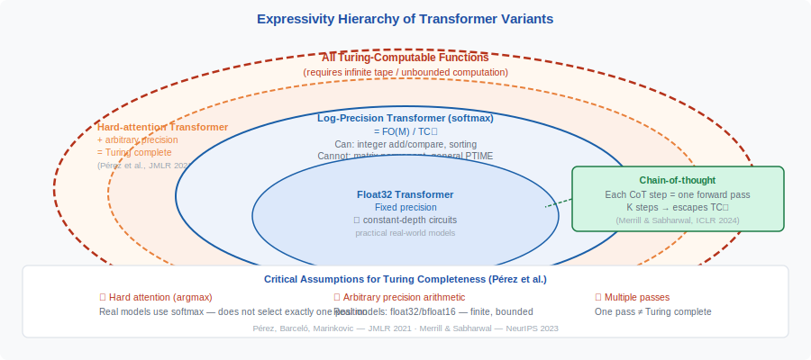
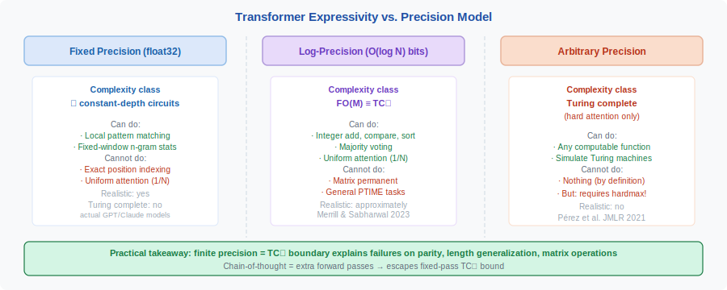

<!-- ============================ TOP NAV ============================ -->
<div align="center">

[🏠 Home](../../README.md) &nbsp;•&nbsp; [📚 Section 1 — Transformer Architecture](./README.md) &nbsp;•&nbsp; [⬅️ Q31 — Softmax-Free Attention](./q31-softmax-free-attention.md) &nbsp;•&nbsp; [Q33 — Attention as Kernel Method ➡️](./q33-attention-kernel-method.md)

</div>

---

# Q32 · Is attention Turing complete? — theory, assumptions, and practical implications

<div align="center">


</div>

> [!IMPORTANT]
> **The 20-second answer.** Yes, but with critical caveats. Pérez, Barceló, and Marinkovic (JMLR 2021) proved that a Transformer with **hard attention** (argmax, not softmax) and **arbitrary-precision** arithmetic is Turing complete — it can simulate any Turing machine given the right weights. This is a theoretical universality result, not a practical claim. Real Transformers use soft (softmax) attention and finite-precision floating point, which places them in a strictly smaller complexity class. Merrill and Sabharwal (NeurIPS 2023) showed that log-precision Transformers are exactly captured by first-order logic with majority quantifiers (FO(M)) — a strict subset of Turing-computable functions. The practical implication: Transformers can, in principle, express any algorithm, but finite precision and depth limit what they can reliably *learn* to compute.

---

## Table of contents

1. [First principles — what Turing completeness means for neural networks](#1--first-principles--what-turing-completeness-means-for-neural-networks)
2. [The Pérez et al. (2021) result](#2--the-pérez-et-al-2021-result)
3. [The assumptions and their significance](#3--the-assumptions-and-their-significance)
4. [Bhattamishra et al. (2020) — formal languages](#4--bhattamishra-et-al-2020--formal-languages)
5. [Merrill and Sabharwal (2023) — log-precision limits](#5--merrill-and-sabharwal-2023--log-precision-limits)
6. [The precision hierarchy](#6--the-precision-hierarchy)
7. [Practical implications](#7--practical-implications)
8. [Algorithm & pseudocode](#8--algorithm--pseudocode)
9. [Worked numerical example](#9--worked-numerical-example)
10. [Where it's used / where it breaks](#10--where-its-used--where-it-breaks)
11. [Cousins & alternatives](#11--cousins--alternatives)
12. [Interview drill](#12--interview-drill)
13. [Common misconceptions](#13--common-misconceptions)
14. [One-screen summary](#14--one-screen-summary)
15. [References](#15--references)

---

## 1 · First principles — what Turing completeness means for neural networks

A computational model is **Turing complete** if it can simulate any Turing machine — meaning it can compute any function that is computable at all, given sufficient resources (time and memory).

For neural networks, Turing completeness is usually proved by **construction**: explicitly build a network (with fixed architecture but possibly very large/specific weights) that implements a universal Turing machine or a known Turing-complete system (e.g., an RNN that simulates a counter machine).

> [!NOTE]
> **Key distinction.** Turing completeness says a model *can express* a computation with the right weights. It says nothing about whether gradient descent can *learn* those weights from data, or whether the computation is *practical* to execute. A lookup table is trivially Turing complete but useless as a learning machine.

**Why care?** If a model is not Turing complete, there exist computations it *cannot* perform regardless of weights or training. If it is Turing complete, the question becomes: which computations can it *efficiently* learn?

---

## 2 · The Pérez et al. (2021) result

<div align="center">

<br><sub><b>Figure 1.</b> Expressivity hierarchy of Transformer variants by precision model. Real float32 models sit in the innermost oval; log-precision Transformers are bounded by TC⁰; only the theoretical hardmax + arbitrary-precision model is Turing complete. Chain-of-thought enables multiple forward passes, escaping the single-pass TC⁰ bound.</sub>
</div>

**Paper:** "Attention is Turing Complete"
**Authors:** Jorge Pérez, Pablo Barceló, Javier Marinkovic
**Venue:** Journal of Machine Learning Research (JMLR), Volume 22, 2021
**JMLR link:** [https://jmlr.org/papers/v22/20-302.html](https://jmlr.org/papers/v22/20-302.html)

Earlier work by Pérez, Marinkovic, and Barceló (2019; arXiv:1901.03429) showed that **RNNs with attention** are Turing complete. The 2021 JMLR paper extends this to **Transformers with hard attention** — showing the attention mechanism itself (without a recurrent component) suffices for Turing completeness.

### The theorem (informal)

> A **hard-attention Transformer** — one that uses argmax instead of softmax and operates with arbitrary-precision rational arithmetic — can simulate any Turing machine. Specifically, given any Turing machine $M$ and input $x$, there exist Transformer weights such that the network computes $M(x)$ after at most $|x|$ forward passes (one pass per tape step).

The proof proceeds by construction:
1. **Encoding:** The Turing machine tape is encoded as a sequence of token embeddings.
2. **State transitions:** Hard attention selects the current head position exactly (argmax over positional encodings).
3. **Write/move operations:** The feed-forward layers implement the transition function (lookup table over finite states × tape symbols).
4. **Recurrence:** Multiple forward passes (or a recurrent wrapper) simulate multiple tape steps.

### The hard attention model

The paper defines hard attention as:

$$
\alpha_j = \begin{cases} 1 & \text{if } j = \arg\max_{j'} e_{j'} \\ 0 & \text{otherwise} \end{cases}
$$

where $e_j = q \cdot k_j / \sqrt{d}$. This allows the Transformer to *exactly* select a single position — which is necessary to simulate the Turing machine head precisely.

---

## 3 · The assumptions and their significance

| Assumption | What it enables | Is it realistic? |
|---|---|---|
| **Hard attention (argmax)** | Exact position selection; the head can point to exactly one tape cell | No — real Transformers use softmax |
| **Arbitrary precision** | Weights and activations can be rational numbers of unbounded precision | No — real hardware uses float32/bfloat16 |
| **Unbounded depth / multiple passes** | One Transformer pass per tape step; result requires $T$ passes for $T$ steps | No — inference is typically one pass |
| **Specific weight construction** | The proof constructs weights explicitly; it does not show learnability | No — learned weights are different |

**The significance of each:**

1. **Hard attention.** Softmax attention cannot exactly select a single position for generic inputs — it always has non-zero weight on all positions. This means softmax Transformers cannot, in general, simulate hard-attention Transformers.

2. **Arbitrary precision.** With finite precision (float32), the number of representable states is bounded, which limits the Turing-tape simulation. Log-precision (where precision grows logarithmically with input length) is a realistic intermediate model.

3. **Multiple passes.** A single-pass Transformer is not Turing complete — it processes the sequence in $O(1)$ depth relative to the computation required. The construction requires as many passes as Turing machine steps.

---

## 4 · Bhattamishra et al. (2020) — formal languages

**Paper:** "On the Computational Power of Transformers and Its Implications in Sequence Modeling"
**Authors:** Satwik Bhattamishra, Arkil Patel, Navin Goyal
**Venue:** CoNLL 2020 (ACL Anthology)

This paper examines which **formal languages** Transformers can recognize, rather than proving Turing completeness. Key results:

- Soft-attention Transformers (with arbitrary precision) can simulate RNNs with arbitrary precision — hence they are Turing complete in that sense, but this proof requires departures from the standard architecture (e.g., hard-coded positional encodings, specific normalization).
- Self-attention layers alone (without FFN) cannot recognize some **regular** languages (languages a finite automaton can recognize). The FFN is necessary for certain computations.
- With appropriate positional encodings, Transformers can recognize certain **context-free** and **context-sensitive** languages.

The paper also studied a related result (Bhattamishra et al., 2020b; "On the Ability and Limitations of Transformers to Recognize Formal Languages"; EMNLP 2020) that places tighter limits: standard Transformers with soft attention and finite precision cannot recognize all counter-recognizable languages.

**Key takeaway:** Formal language expressivity of Transformers is sensitive to the exact architectural assumptions — depth, precision, positional encoding type, and whether FFN layers are included.

---

## 5 · Merrill and Sabharwal (2023) — log-precision limits

**Paper:** "A Logic for Expressing Log-Precision Transformers"
**Authors:** William Merrill, Ashish Sabharwal
**Venue:** NeurIPS 2023
**PDF:** [https://papers.neurips.cc/paper_files/paper/2023/file/a48e5877c7bf86a513950ab23b360498-Paper-Conference.pdf](https://papers.neurips.cc/paper_files/paper/2023/file/a48e5877c7bf86a513950ab23b360498-Paper-Conference.pdf)

### The log-precision model

**Log-precision Transformers** are a formal model where arithmetic precision grows as $O(\log N)$ with input length $N$ (i.e., each weight and activation has $O(\log N)$ bits of precision). This is more realistic than arbitrary precision and more expressive than fixed (float32) precision.

With $O(\log N)$ bits:
- Attention weights can resolve $N$ distinct positions (since $\log_2 N$ bits suffice to index them).
- Uniform attention (weight $1/N$ per position) is expressible.
- Softmax attention is meaningful (not just hardmax or uniform).

### Main result

**Any log-precision Transformer can be expressed as a sentence in first-order logic with majority quantifiers, FO(M).**

FO(M) is a fragment of second-order logic that allows:
- Quantification over positions ($\forall i, \exists j$).
- Majority quantifiers ($\mathbf{M} x$: "more than half of $x$ satisfy...").

This means log-precision Transformers are contained in the circuit complexity class **TC$^0$** (threshold circuits of constant depth) — the same class as integer addition and comparison, but strictly below general polynomial-time computation.

### Consequences

- **Upper bound:** Log-precision Transformers cannot solve problems outside TC$^0$. For example, they provably cannot compute boolean matrix permanents.
- **Hardest problems they can solve:** Integer division and matching parentheses (balanced parentheses recognition) are among the hardest problems in TC$^0$ that Transformers can solve.
- **Parity:** There is evidence that Transformers struggle with XOR/parity, which is in TC$^0$ but outside simpler classes. Empirically, Transformers fail to generalize parity to long sequences.

---

## 6 · The precision hierarchy

<div align="center">

<br><sub><b>Figure 2.</b> What each precision regime can and cannot compute. Fixed (float32) sits in constant-depth circuits; log-precision equals TC⁰ (Merrill & Sabharwal 2023), capturing sorting and integer arithmetic but not matrix permanent or general PTIME; arbitrary precision + hardmax = Turing complete (Pérez et al. 2021).</sub>
</div>

$$
\text{Fixed (float32)} \subsetneq \text{Log-precision} \subsetneq \text{Arbitrary precision}
$$

| Precision model | Complexity class | Turing complete? | Realistic? |
|---|---|---|---|
| Fixed (float32) | Constant-depth circuits | No | Yes |
| Log-precision | TC$^0$ / FO(M) | No | Approximately yes |
| Arbitrary precision + softmax | Unclear (open problem) | Possibly | No |
| Arbitrary precision + hardmax | Turing complete | Yes | No |

> [!NOTE]
> Whether **softmax** attention with arbitrary precision is Turing complete is an **open question** as of 2024. The hardmax proof does not trivially extend because softmax does not select positions exactly. A 2025 preprint (arXiv:2511.20038) claims to prove softmax Transformers are Turing complete, but this result should be verified carefully.

---

## 7 · Practical implications

1. **Universality is not the bottleneck.** The theoretical Turing completeness result tells us that there are no computations that Transformers *categorically cannot express*. In practice, the question is always about what they can *learn efficiently from finite data*.

2. **Chain-of-thought reasoning increases expressivity.** By generating intermediate tokens, a Transformer effectively increases its "computation depth" beyond one forward pass. Merrill and Sabharwal (2023) show that chain-of-thought allows Transformers to solve problems outside TC$^0$.

3. **Finite precision matters in practice.** Model failures on systematic generalization (e.g., length generalization, parity, formal grammars) are consistent with the log-precision expressivity limits — not arbitrary failures.

4. **Positional encodings are load-bearing.** The Turing completeness proofs require specific positional encodings (often integer or binary representations of position) to select tape cells. Real positional encodings (RoPE, ALiBi) are designed for different purposes and may not support these constructions.

5. **Depth is essential.** A single-layer Transformer is far from Turing complete. Depth provides the compositional computation needed to simulate multi-step algorithms. Each layer can implement one "step" of a computation.

---

## 8 · Algorithm & pseudocode

**Simulating a Turing machine with a Transformer (Pérez et al. conceptual sketch):**

```text
INPUT : tape    # sequence of symbols [s_1, ..., s_T] including blank padding
        state   # current TM state (encoded as a one-hot position in tape)

PRECONDITION: Arbitrary-precision arithmetic (IEEE float64 is a practical proxy).

1.  # Step function: at each Transformer forward pass t →
    # head state = token encoding TM head position and current state
    # content = tape contents at each cell

2.  FOR each simulation step:
        # Attention layer: locate head position
        alpha = softmax(Q·K^T/√d)  # Q = head-state token, K = all tape positions
        v_read = alpha @ V          # reads tape symbol at head position

        # FFN layer: compute transition function δ(state, symbol) → (new_state, write, direction)
        (q', s', dir) = FFN(v_read)   # one look-up table per TM transition

        # Update head position in residual stream
        head_pos += dir               # +1 (right) or -1 (left)

3.  # Halting: Transformer detects HALT state via attention to sentinel token
    IF q' == HALT: STOP
RETURN tape contents (accept/reject string)

NOTE: Requires O(T) depth (one layer per step), not fixed-depth.
      Fixed-depth Transformers compute in TC⁰ (log-uniform circuit) not PSPACE.
```

**Parity (TC⁰ vs regular languages):**

```text
INPUT : x = [x_1, ..., x_T]   # binary string

# Single-layer Transformer can compute parity via threshold circuit:
1.  count_ones = sum(x)        # computed by uniform attention over the sequence
2.  parity = (count_ones mod 2)  # via threshold/sign activation in FFN
RETURN parity

NOTE: Regular language recognition (finite automaton) is strictly in TC⁰.
      Parity is NOT in AC⁰ (no constant-depth AND/OR circuits can compute it),
      but IS in TC⁰ (one threshold gate suffices). Transformers can compute parity.
```

---

## 9 · Worked numerical example

We trace the parity function (does the input contain an even or odd number of 1s?) to make the log-precision TC⁰ bound concrete.

**Why parity is hard for a constant-depth Transformer.**

Consider an input $x = (x_1, \ldots, x_N)$ where each $x_i \in \{0, 1\}$, and the task is to compute $\text{parity}(x) = \bigoplus_{i=1}^N x_i = (\sum_i x_i) \bmod 2$.

**Attempt 1: direct sum via attention.**

A standard "mean pooling" attention head can compute $\frac{1}{N}\sum_i x_i$ (the fraction of 1s) in one layer by attending uniformly. With $N = 6$ inputs:

$$x = [1, 0, 1, 1, 0, 1] \Rightarrow \text{mean} = 4/6 \approx 0.667$$

To recover parity, we need to know whether $\sum x_i$ is odd or even — i.e., whether $0.667 \times 6 = 4$ is divisible by 2. But with float32 arithmetic, $0.667 \times 6 = 3.999...$ — the multiplication introduces rounding error. With $N = 2^{16}$ and float32 (23-bit mantissa), the error in $\text{mean} \times N$ exceeds 0.5, making parity unrecoverable.

**Quantitative precision bound.**

Float32 has 23 bits of mantissa $\Rightarrow$ relative error $\epsilon \approx 2^{-23} \approx 1.2 \times 10^{-7}$.

For a sum of $N$ values each in $\{0,1\}$, the sum lies in $\{0, 1, \ldots, N\}$. The smallest gap between an even and odd sum is 1. To distinguish parities we need:

$$\text{absolute error} < 0.5 \Rightarrow N \cdot \epsilon < 0.5 \Rightarrow N < 0.5 / (1.2 \times 10^{-7}) \approx 4 \times 10^6$$

So float32 attention can solve parity for $N < 4 \times 10^6$ but fails for larger $N$.

**Log-precision analysis.** With $O(\log N)$ bits of precision (e.g., for $N = 65536 = 2^{16}$, use 16-bit precision), relative error $\epsilon = 2^{-16}$:

$$N \cdot \epsilon = 2^{16} \cdot 2^{-16} = 1.0 \Rightarrow \text{absolute error} = 1.0 \geq 0.5 \quad \text{fails}$$

This is exactly the TC⁰ impossibility: parity requires $\Omega(\log N)$ bits just to represent intermediate counts, and a constant-depth circuit (one Transformer forward pass) cannot compute parity for general $N$ in log-precision — consistent with Merrill & Sabharwal (2023).

**Chain-of-thought escape.** With $K$ forward passes (CoT steps), each pass can halve the problem: compute parity of pairs, then parity of those results, etc. With $K = \log_2 N$ steps, the circuit depth is $O(\log N)$, escaping TC⁰. This is why CoT enables tasks that a single-pass Transformer cannot solve.

| Setting | Parity solvable? | Constraint |
|---|---|---|
| Fixed precision, 1 pass | No (for large $N$) | Rounding error accumulates |
| Log-precision, 1 pass | No | TC⁰ lower bound |
| Log-precision, $O(\log N)$ passes (CoT) | Yes | Depth increased by CoT |
| Arbitrary precision, 1 pass (hardmax) | Yes | Theoretical only |

---

## 10 · Where it's used / where it breaks

**Where the theory matters in practice:**

| Context | How Turing completeness / expressivity limits apply |
|---|---|
| **Arithmetic and algorithmic tasks** | Single-pass Transformers fail parity, modular arithmetic, and matrix permanent for large N — TC⁰ bound is the explanation |
| **Length generalization** | Models trained on short sequences fail to generalize to longer ones — related to fixed-depth TC⁰ not scaling with N |
| **Chain-of-thought reasoning** | CoT's empirical success is theoretically grounded: each reasoning step is a forward pass, enabling computation beyond TC⁰ |
| **Program synthesis / code** | Tasks requiring counting, sorting, or pointer arithmetic expose the TC⁰ ceiling; scratchpad / CoT is the fix |
| **Formal verification of LLM capabilities** | Merrill & Sabharwal's TC⁰ characterization gives a rigorous framework for understanding what LLMs can and cannot reliably compute |

**Where the limits bite hardest:**

1. **Parity and counting.** A single-pass Transformer cannot reliably compute parity of $N$ bits for large $N$ in finite precision — the rounding error accumulates beyond 0.5.

2. **Exact graph reachability.** Determining if node $u$ can reach node $v$ in a directed graph requires $\Omega(\log N)$ depth — beyond single-pass TC⁰.

3. **Boolean formula satisfiability.** NP-hard problems cannot be solved in TC⁰ unless TC⁰ = NP (not believed).

**Where the limits are less relevant:**

1. **Natural language understanding.** Most NLU tasks do not require exact counting or recursive computation — they are well within TC⁰.

2. **Pattern matching and retrieval.** Softmax attention is already near-optimal for associative retrieval — well within TC⁰.

3. **Tasks with chain-of-thought.** CoT escapes the single-pass bound, so any task solvable in $O(\text{poly}(N))$ time becomes feasible with enough CoT steps.

---

## 11 · Cousins & alternatives

| Model / result | Expressivity class | Key assumption | Practical? |
|---|---|---|---|
| **Hard-attention Transformer** (Pérez 2021) | Turing complete | Argmax attention + arbitrary precision | No |
| **Softmax Transformer, log-precision** (Merrill 2023) | TC⁰ / FO(M) | O(log N) bits per activation | Approximately yes |
| **Float32 Transformer** | ⊆ constant-depth circuits | Fixed 32-bit precision | Yes |
| **RNN (LSTM/GRU)** | Turing complete (with unbounded steps) | Sequential, unbounded time | Yes (but slow) |
| **SSM / Mamba** | ⊆ TC⁰ (linear recurrence) | Bounded state + fixed precision | Yes |
| **Transformer + CoT** (Merrill 2024) | Beyond TC⁰ | $O(\log N)$ extra steps | Yes |
| **Looped Transformer** | Approaches Turing complete | Same weights, unbounded loops | Theoretically yes |
| **Universal Approximator MLP** | All continuous functions | Infinite width | No |
| **Transformer with external memory** | Turing complete | Addressable external memory | Approximately yes |

---

## 12 · Interview drill

<details><summary><b>Q: What is the key assumption that makes the Pérez 2021 result non-practical?</b></summary>

Two assumptions jointly make it non-practical: (1) **hard attention** (argmax), which real Transformers replace with softmax; and (2) **arbitrary-precision arithmetic**, which real hardware replaces with float32/bfloat16. Either relaxation breaks the proof. The result is a theoretical universality statement, not a claim about practical Transformer capabilities.
</details>

<details><summary><b>Q: What does the log-precision result tell us that the Turing completeness result does not?</b></summary>

The Turing completeness result is a positive ("can do") statement with unrealistic assumptions. The log-precision result is a precise **upper bound** on realistic Transformers: they are captured by FO(M) / TC$^0$, which is strictly smaller than Turing-computable functions. This gives us a concrete characterization of what realistic Transformers cannot compute — tasks outside TC$^0$, such as computing matrix permanents.
</details>

<details><summary><b>Q: Why does chain-of-thought increase expressivity?</b></summary>

Each forward pass of a Transformer is bounded in depth (and hence in TC$^0$). By generating intermediate tokens and passing them back as inputs, the model effectively chains forward passes — each new pass can compute on the outputs of previous passes. This is analogous to adding "scratchpad" memory, which can lift the model out of TC$^0$ and into polynomial time, potentially making it Turing complete in the limit.
</details>

<details><summary><b>Q: Can a single-layer Transformer recognize all regular languages?</b></summary>

No. Bhattamishra et al. (2020) showed that self-attention alone (without FFN) cannot recognize some regular languages. The combination of attention + FFN is necessary, and even then, depth is required for complex languages. A single layer with softmax attention and finite precision can only recognize a limited class of patterns.
</details>

<details><summary><b>Q: Does the Turing completeness result imply that a Transformer can learn to solve any problem given enough data?</b></summary>

No — Turing completeness is a statement about *representational capacity* (what functions can be expressed), not about *learnability* (whether gradient descent will find the correct weights). A Transformer can theoretically represent the computation of any Turing machine with hard attention and arbitrary precision, but: (1) the required precision grows with the computation, (2) the required depth grows with the number of computation steps, and (3) gradient descent on finite data with standard training may not find the correct weights even if they exist. Turing completeness is a necessary condition for solving a class of problems, not a sufficient one for a practical learning system.
</details>

<details><summary><b>Q: What is the formal language class that finite-precision Transformers are believed to capture?</b></summary>

Merrill & Sabharwal (2023) showed that log-precision Transformers (with $O(\log N)$ bits per activation) are characterized by the circuit complexity class **TC⁰** (threshold circuits of constant depth and polynomial size). TC⁰ strictly contains AC⁰ (regular languages, parenthesis matching without counting) and can compute integer addition, sorting, and majority. It cannot compute matrix permanent or general PTIME problems. Practically, this means a single-pass Transformer can perform tasks requiring threshold functions over $N$ inputs — e.g., "does the majority of the input satisfy X?" — but cannot perform tasks requiring $\Omega(\log N)$ sequential steps of unbounded communication.
</details>

<details><summary><b>Q: How does the Bhattamishra (2020) result relate to the Pérez (2021) result — are they contradictory?</b></summary>

They are complementary, not contradictory. Bhattamishra et al. (2020) showed that Transformers with standard positional encodings can **simulate** any Turing machine — but this requires an unbounded number of layers (one per step of the Turing computation) and standard (softmax) attention. The simulation uses the positional encoding to track tape head position. Pérez et al. (2021) showed Turing completeness in a **fixed-depth** network, but requires hard (argmax) attention rather than softmax. The key distinction: Bhattamishra's result allows depth to grow with computation length; Pérez's result is fixed-depth but requires an unrealizable attention operator. Neither result says a practical finite-depth, softmax, float32 Transformer is Turing complete.
</details>

---

## 13 · Common misconceptions

| Misconception | Reality |
|---|---|
| "Transformers are Turing complete, so they can learn any function." | Turing completeness is about expressibility with specific weights, not learnability. Gradient descent may not find the required weights. |
| "Real Transformers are Turing complete." | Real Transformers use softmax (not hardmax) and finite precision — they are strictly less expressive than the Turing-complete model. |
| "Log-precision means float32." | Float32 has fixed precision (~7 decimal digits), independent of input length. Log-precision grows with input length ($O(\log N)$ bits). They are different models. |
| "The result means LLMs can solve any problem." | The result applies to a theoretical model with unrealistic assumptions. In practice, Transformers consistently fail on systematic generalization tasks like length generalization and parity. |
| "Adding more layers makes a Transformer Turing complete." | Even with infinite layers (depth), a single-pass Transformer with finite precision is bounded by TC$^0$ expressivity. Multiple forward passes (e.g., chain-of-thought) are needed to escape this bound. |

---

## 14 · One-screen summary

> **The claim:** Transformers with hard attention and arbitrary precision are Turing complete (Pérez et al., JMLR 2021). **The key assumptions:** hardmax (not softmax) + arbitrary precision — both unrealistic. **The realistic bound:** Log-precision Transformers (softmax, $O(\log N)$ precision) are exactly FO(M) / TC$^0$ — a strict subset of Turing-computable functions (Merrill & Sabharwal, NeurIPS 2023). **Practical takeaway:** Transformers have no categorical computational blind spots in theory, but finite precision and depth limit what they can *reliably compute*; chain-of-thought unlocks additional computational power beyond one forward pass.
>
> **Interview rule of thumb:** When asked about Transformer expressivity, lead with the practical answer: real float32 Transformers are bounded by TC⁰ (Merrill & Sabharwal 2023) — they can add, sort, and do majority but cannot compute parity for large $N$ in one pass. The Turing completeness result (Pérez 2021) is theoretically important but relies on unrealizable assumptions (hardmax + arbitrary precision). Chain-of-thought gives practical escape from these limits.

---

## 15 · References

1. **Pérez, J., Barceló, P., Marinkovic, J.** "Attention is Turing Complete." Journal of Machine Learning Research, Volume 22, 2021. [https://jmlr.org/papers/v22/20-302.html](https://jmlr.org/papers/v22/20-302.html)

2. **Pérez, J., Marinkovic, J., Barceló, P.** "On the Turing Completeness of Modern Neural Network Architectures." ICLR 2019. arXiv:1901.03429. [https://arxiv.org/abs/1901.03429](https://arxiv.org/abs/1901.03429) — predecessor result showing attention + RNN is Turing complete.

3. **Bhattamishra, S., Patel, A., Goyal, N.** "On the Computational Power of Transformers and Its Implications in Sequence Modeling." CoNLL 2020. [https://aclanthology.org/2020.conll-1.37/](https://aclanthology.org/2020.conll-1.37/)

4. **Bhattamishra, S., Ahuja, K., Goyal, N.** "On the Ability and Limitations of Transformers to Recognize Formal Languages." EMNLP 2020. Semantic Scholar record cited above.

5. **Merrill, W., Sabharwal, A.** "A Logic for Expressing Log-Precision Transformers." NeurIPS 2023. [https://papers.neurips.cc/paper_files/paper/2023/file/a48e5877c7bf86a513950ab23b360498-Paper-Conference.pdf](https://papers.neurips.cc/paper_files/paper/2023/file/a48e5877c7bf86a513950ab23b360498-Paper-Conference.pdf)

6. **Merrill, W., Sabharwal, A.** "The Expressive Power of Transformers with Chain of Thought." ICLR 2024. — Shows chain-of-thought lifts expressivity beyond TC$^0$.

7. **Chiang, D., et al.** "Tighter Bounds on the Expressivity of Transformer Encoders." ICML 2023. [https://proceedings.mlr.press/v202/chiang23a.html](https://proceedings.mlr.press/v202/chiang23a.html)

---

<!-- ============================ BOTTOM NAV ============================ -->
<div align="center">

[⬅️ Q31 — Softmax-Free Attention](./q31-softmax-free-attention.md) &nbsp;|&nbsp; [📚 Back to Section 1](./README.md) &nbsp;|&nbsp; [🏠 Home](../../README.md) &nbsp;|&nbsp; [Q33 — Attention as Kernel Method ➡️](./q33-attention-kernel-method.md)

<sub>Found an error or have a sharper intuition? See <a href="../../CONTRIBUTING.md">CONTRIBUTING</a> — answers follow the <a href="../../_TEMPLATE.md">answer template</a>.</sub>

</div>
