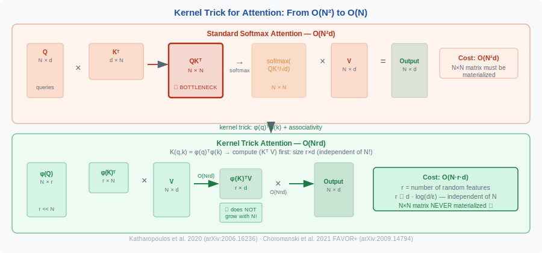
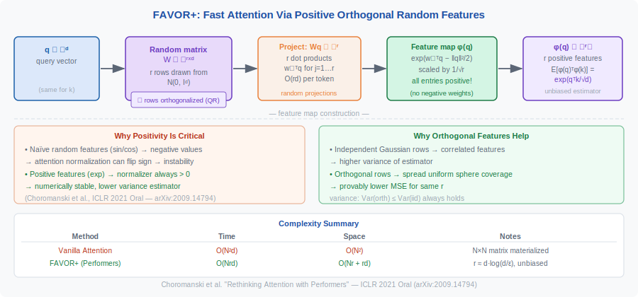

<!-- ============================ TOP NAV ============================ -->
<div align="center">

[🏠 Home](../../README.md) &nbsp;•&nbsp; [📚 Section 1 — Transformer Architecture](./README.md) &nbsp;•&nbsp; [⬅️ Q32 — Attention Turing Complete](./q32-attention-turing-complete.md) &nbsp;•&nbsp; [Q34 — Graph Transformers ➡️](./q34-graph-transformers.md)

</div>

---

# Q33 · Attention as a kernel method — Performers, FAVOR+, and the kernel trick for efficient attention

<div align="center">


</div>

> [!IMPORTANT]
> **The 20-second answer.** Softmax attention computes $\text{softmax}(QK^\top/\sqrt{d}) V$, which is equivalent to normalizing a **kernel Gram matrix** $K(q_i, k_j) = \exp(q_i \cdot k_j / \sqrt{d})$ — a scaled exponential (RBF-like) kernel. The kernel view unlocks the key efficiency insight: if you can approximate $K(q, k) \approx \phi(q)^\top \phi(k)$ via a random feature map $\phi$, you can compute $(K'^\top V)$ first (size $r \times d$, independent of $N$) rather than materializing the full $N \times N$ matrix, reducing complexity from $O(N^2 d)$ to $O(N r d) = O(N)$ for fixed $r$. Performers (Choromanski et al., ICLR 2021) realize this with **FAVOR+** — Fast Attention Via positive Orthogonal Random features — achieving unbiased (or nearly-unbiased) estimation of the softmax kernel via random projections, with provable uniform convergence bounds independent of sequence length.

---

## Table of contents

1. [The kernel interpretation of softmax attention](#1--the-kernel-interpretation-of-softmax-attention)
2. [The kernel trick — avoiding the N×N matrix](#2--the-kernel-trick--avoiding-the-nn-matrix)
3. [Linear attention as a kernel method](#3--linear-attention-as-a-kernel-method)
4. [Performers and FAVOR+](#4--performers-and-favor)
5. [The random feature decomposition](#5--the-random-feature-decomposition)
6. [Connection to Gaussian processes and RBF kernels](#6--connection-to-gaussian-processes-and-rbf-kernels)
7. [Comparison table](#7--comparison-table)
8. [Algorithm & pseudocode](#8--algorithm--pseudocode)
9. [Reference implementation](#9--reference-implementation)
10. [Worked numerical example](#10--worked-numerical-example)
11. [Where it's used / where it breaks](#11--where-its-used--where-it-breaks)
12. [Cousins & alternatives](#12--cousins--alternatives)
13. [Interview drill](#13--interview-drill)
14. [Common misconceptions](#14--common-misconceptions)
15. [One-screen summary](#15--one-screen-summary)
16. [References](#16--references)

---

## 1 · The kernel interpretation of softmax attention

Standard scaled dot-product attention:

$$
\text{Attn}(Q, K, V)_i = \frac{\sum_{j=1}^N \exp\!\left(\frac{q_i \cdot k_j}{\sqrt{d}}\right) v_j}{\sum_{j=1}^N \exp\!\left(\frac{q_i \cdot k_j}{\sqrt{d}}\right)}
$$

Rewrite using a kernel function $K: \mathbb{R}^d \times \mathbb{R}^d \to \mathbb{R}_{>0}$:

$$
\text{Attn}(Q, K, V)_i = \frac{\sum_j K(q_i, k_j)\, v_j}{\sum_j K(q_i, k_j)}, \quad K(q, k) = \exp\!\left(\frac{q \cdot k}{\sqrt{d}}\right)
$$

This is a **kernel regression** (Nadaraya-Watson estimator): the output at query $q_i$ is a kernel-weighted average of values, with weights proportional to the kernel $K(q_i, k_j)$.

The kernel $K(q, k) = \exp(q \cdot k / \sqrt{d})$ is related to the **Gaussian RBF kernel**:

$$
K_\text{RBF}(q, k) = \exp\!\left(-\frac{\|q - k\|^2}{2}\right) = \exp\!\left(-\frac{\|q\|^2 + \|k\|^2}{2}\right) \cdot \exp(q \cdot k)
$$

The attention kernel drops the $\|q\|^2, \|k\|^2$ normalization terms (they cancel in the softmax ratio), so it is equivalent to an RBF kernel on the unit sphere when queries and keys are L2-normalized. Without normalization it is a scaled exponential kernel — positive definite but not strictly RBF.

---

## 2 · The kernel trick — avoiding the N×N matrix

<div align="center">

<br><sub><b>Figure 1.</b> The key insight of linear attention: by associativity of matrix multiplication, computing φ(K)ᵀV first (size r×d, independent of N) avoids ever materializing the N×N attention matrix. Total cost drops from O(N²d) to O(Nrd).</sub>
</div>

In kernel methods, the **kernel trick** avoids computing the full $N \times N$ Gram matrix by working in a feature space where $K(q, k) = \langle \phi(q), \phi(k) \rangle$ for some feature map $\phi: \mathbb{R}^d \to \mathcal{H}$ (possibly infinite-dimensional).

For attention, if $K(q_i, k_j) = \phi(q_i)^\top \phi(k_j)$, then:

$$
\sum_j K(q_i, k_j) v_j = \phi(q_i)^\top \underbrace{\left(\sum_j \phi(k_j) v_j^\top\right)}_{\text{size } r \times d}
$$

$$
\sum_j K(q_i, k_j) = \phi(q_i)^\top \underbrace{\left(\sum_j \phi(k_j)\right)}_{\text{size } r}
$$

Computing $\sum_j \phi(k_j) v_j^\top$ and $\sum_j \phi(k_j)$ first (over all $j$) costs $O(N r d)$ and $O(N r)$ respectively. Then for each query $i$, the output is a dot product costing $O(rd)$. **Total cost: $O(Nrd)$, independent of $N^2$.**

This is the kernel trick applied to attention: instead of $O(N^2 d)$ to form and multiply the full attention matrix, you pay $O(Nrd)$ where $r$ is the number of random features (typically $r \ll N$).

---

## 3 · Linear attention as a kernel method

Katharopoulos et al. (2020; arXiv:2006.16236) formalized this view. They choose:

$$
\phi(x) = \text{elu}(x) + 1 \in \mathbb{R}^d
$$

This is a $d$-dimensional feature map (same dimension as the key/query). The approximation $K(q,k) \approx \phi(q)^\top \phi(k)$ is rough — ELU+1 does not well-approximate the exponential kernel — but the associativity trick still applies, giving $O(N)$ complexity.

**Causal (autoregressive) setting:** Maintain running state $S_i = \sum_{j \leq i} \phi(k_j) v_j^\top \in \mathbb{R}^{d \times d}$ and $z_i = \sum_{j \leq i} \phi(k_j) \in \mathbb{R}^d$:

$$
S_i = S_{i-1} + \phi(k_i) v_i^\top
$$

$$
o_i = \frac{\phi(q_i)^\top S_i}{\phi(q_i)^\top z_i}
$$

This is an $O(d^2)$ per-step recurrence — an RNN with a $d \times d$ matrix hidden state.

---

## 4 · Performers and FAVOR+

**Paper:** "Rethinking Attention with Performers"
**Authors:** Krzysztof Choromanski, Valerii Likhosherstov, David Dohan, Xingyou Song, Andreea Gane, Tamas Sarlos, Peter Hawkins, Jared Davis, Afroz Mohiuddin, Lukasz Kaiser, David Belanger, Lucy Colwell, Adrian Weller
**Venue:** ICLR 2021 (Oral)
**arXiv:** 2009.14794

### The problem with naive random features

The classic Bochner theorem + random Fourier features (Rahimi & Recht, 2007) approximate shift-invariant kernels like the RBF. The RBF kernel admits:

$$
K_\text{RBF}(q, k) = \mathbb{E}_{\omega \sim \mathcal{N}(0, I_d)}\!\left[\cos(\omega^\top q) \cos(\omega^\top k) + \sin(\omega^\top q) \sin(\omega^\top k)\right]
$$

However, these features can be **negative** (cosine and sine can be negative), which breaks the normalization in attention (the denominator could be zero or negative).

### FAVOR+ — positive orthogonal random features

Performers solve this via a **positive** random feature decomposition. Using Lemma 1 of the paper, the softmax kernel admits:

$$
\text{SM}(q, k) = \exp(q \cdot k) = \mathbb{E}_{\omega \sim \mathcal{N}(0, I_d)}\!\left[\exp\!\left(\omega^\top q - \tfrac{\|q\|^2}{2}\right) \cdot \exp\!\left(\omega^\top k - \tfrac{\|k\|^2}{2}\right)\right]
$$

This leads to the **positive feature map**:

$$
\phi^+_\omega(x) = \exp\!\left(\omega^\top x - \tfrac{\|x\|^2}{2}\right) \in \mathbb{R}_{>0}
$$

With $r$ random projections $\omega_1, \ldots, \omega_r \sim \mathcal{N}(0, I_d)$:

$$
\phi^+(x) = \frac{1}{\sqrt{r}}\left[\exp\!\left(\omega_1^\top x - \tfrac{\|x\|^2}{2}\right), \ldots, \exp\!\left(\omega_r^\top x - \tfrac{\|x\|^2}{2}\right)\right] \in \mathbb{R}^r_{>0}
$$

This approximation is **unbiased**: $\mathbb{E}[\phi^+(q)^\top \phi^+(k)] = \exp(q \cdot k) = \text{SM}(q, k)$.

### Orthogonal random features

FAVOR+ further reduces variance by making the projections $\omega_1, \ldots, \omega_r$ **orthogonal** (using random orthogonal matrices via QR decomposition). Orthogonality reduces the estimator MSE compared to i.i.d. Gaussian projections.

### Complexity and theoretical guarantees

The approximate attention using FAVOR+ has:
- **Time:** $O(Lrd)$ where $L$ is sequence length, $r$ is the number of features, $d$ is dimension.
- **Space:** $O(Lr + Ld + rd)$ — no $L^2$ term.

**Uniform convergence (Theorem 4 of the paper):** For $m = \Theta(d / \delta^2 \cdot \log(4d^{3/4} R / \delta))$ random projections, the approximation achieves $\|\hat{A} - A\|_\infty \leq \varepsilon$ with constant probability, where $R$ bounds the query/key norms. The bound is **independent of sequence length $L$** — the approximation quality depends only on $d$ and the desired precision $\varepsilon$.

### Results

Performers achieved competitive performance with standard attention on:
- **Pixel-level image generation** (CIFAR-10).
- **Text modeling** (LM1B, PG-19).
- **Protein sequence analysis** — with substantial speedups at long sequence lengths.

---

## 5 · The random feature decomposition

The full pipeline for FAVOR+ attention:

$$
\hat{\text{Attn}}(Q, K, V) = \hat{D}^{-1}\!\left(Q'\bigl((K')^\top V\bigr)\right)
$$

where:
- $Q' = \phi^+(Q) \in \mathbb{R}^{L \times r}$ (apply feature map row-wise to queries)
- $K' = \phi^+(K) \in \mathbb{R}^{L \times r}$ (apply feature map row-wise to keys)
- $(K')^\top V \in \mathbb{R}^{r \times d}$ — computed first (the kernel trick step)
- $\hat{D} = \text{diag}(Q'((K')^\top \mathbf{1}_L))$ — normalization diagonal

Computing $(K')^\top V$ costs $O(Lrd)$; computing $Q' \cdot (K')^\top V$ costs $O(Lrd)$. Total $O(Lrd)$ versus $O(L^2 d)$ for standard attention.

---

## 6 · Connection to Gaussian processes and RBF kernels

Attention can be viewed as a **non-parametric Gaussian process regression** step:

- The keys $K = \{k_j\}$ are "training inputs."
- The values $V = \{v_j\}$ are "training outputs."
- The query $q_i$ is the "test input."
- The attention output $\text{Attn}(q_i, K, V)$ is the kernel-regression prediction at $q_i$.

The softmax kernel $\exp(q \cdot k / \sqrt{d})$ is a positive definite kernel (though not strictly stationary — it is not shift-invariant because it depends on $q \cdot k$, not $\|q - k\|$). On the unit sphere (after L2 normalization of queries and keys), it reduces to:

$$
K_\text{sphere}(q, k) = \exp\!\left(\frac{q \cdot k}{\sqrt{d}}\right) = \exp\!\left(\frac{\cos\theta_{q,k}}{\sqrt{d}}\right)
$$

which is related to the **arc-cosine kernel** and the **von Mises–Fisher distribution** on the sphere.

**Practical connection:** The kernel perspective explains why QK-norm (normalizing queries and keys before attention) is beneficial — it constrains the attention kernel to operate on the sphere, making it more like a proper stationary kernel with bounded eigenspectrum.

---

## 7 · Comparison table

| Method | Kernel / similarity | Feature map $\phi$ | Complexity | Unbiased? | Quality |
|---|---|---|---|---|---|
| Softmax attention | $\exp(q \cdot k / \sqrt{d})$ | Exact (no approximation) | $O(N^2 d)$ | Exact | Reference |

| Linear attention (Katharopoulos 2020) | $(\text{elu}(q)+1) \cdot (\text{elu}(k)+1)$ | $\text{elu}(x)+1 \in \mathbb{R}^d$ | $O(Nd^2)$ | No (poor approx) | Significant gap |
| Performers FAVOR+ (Choromanski 2021) | $\exp(q \cdot k)$ approximated | Positive random features $\phi^+ \in \mathbb{R}^r$ | $O(Nrd)$ | Yes (unbiased) | Good at $r \gg d$ |
| FAVOR+ with ORF | Same as above | Orthogonal random features | $O(Nrd)$ | Nearly unbiased | Better variance |
| Random Fourier features (Rahimi 2007) | RBF kernel | $\cos(\omega^\top x + b)$ | $O(Nrd)$ | Yes (but signed) | N/A for attention |
| SOFT (Lu 2021) | Gaussian kernel (low-rank) | Nyström approximation | $O(N)$ | Approximate | Vision tasks |

<div align="center">

<br><sub><b>Figure 2.</b> FAVOR+ feature construction pipeline. Random Gaussian rows are orthogonalized (QR decomposition), projected onto the query/key vectors, then exponentiated and scaled to produce all-positive features φ(q) ∈ ℝ⁺ʳ. Positivity prevents sign-flip instability; orthogonality reduces estimator variance.</sub>
</div>

---

## 8 · Algorithm & pseudocode

**Standard (kernel) softmax attention — the O(N²) baseline:**

```text
INPUT : Q, K, V    # [T, d_head]

1.  # Kernel form: softmax attention uses kernel k(q,k) = exp(q·k/√d)
    K_mat[i,j] = exp(Q[i] · K[j] / sqrt(d))   # [T, T] — full kernel matrix
2.  weights[i] = K_mat[i] / sum(K_mat[i])      # row normalization
3.  output = weights @ V
RETURN output                                   # O(T²·d) time and space
```

**Linear attention via kernel decomposition — O(T·d²):**

```text
INPUT : Q, K, V    # [T, d_head]
        φ          # positive feature map, φ: R^d → R^r, k(q,k) ≈ φ(q)·φ(k)

1.  Q' = φ(Q)      # [T, r]
2.  K' = φ(K)      # [T, r]

3.  # REORDER the computation (key trick):
    #   Standard:   (Q' (K'^T V))   — outer first: [T,T]
    #   Efficient:  Q' (K'^T V)     — inner first: [r,d] then [T,d]
    S = K'.T @ V               # [r, d] — accumulated context matrix
    Z = K'.T @ ones(T, 1)      # [r, 1] — normalizer
4.  output = (Q' @ S) / (Q' @ Z)   # [T, d] — O(T·r·d)
RETURN output
```

**FAVOR+ random feature approximation:**

```text
INPUT : Q, K, V    # [T, d_head]
        m          # number of random features (e.g. m=256)
        ω          # m random vectors drawn from N(0, I_d)  [d, m]

1.  # Positive orthogonal random features (PORF):
    h(x) = exp(x·ω - ||x||²/2) / sqrt(m)    # [m] — unbiased estimator of exp(q·k)

2.  Q' = h(Q / sqrt(sqrt(d)))    # [T, m] — rescaled for stability
    K' = h(K / sqrt(sqrt(d)))    # [T, m]

3.  # Same O(Tm·d) computation as linear attention:
    S = K'.T @ V                 # [m, d]
    Z = sum(K', dim=0)           # [m]
    output = (Q' @ S) / (Q' @ Z.unsqueeze(-1) + ε)
RETURN output                    # O(T·m·d) ≪ O(T²·d) when m ≪ T
```

---

## 9 · Reference implementation

```python
import torch
import torch.nn.functional as F
import math

def favor_plus_feature_map(x: torch.Tensor, omega: torch.Tensor) -> torch.Tensor:
    """
    Positive random feature map for FAVOR+ (Choromanski et al. 2021).
    x: (B, L, d)
    omega: (r, d) random projection matrix (orthogonalized rows)
    Returns: (B, L, r) positive feature matrix
    """
    # Project: (B, L, d) x (d, r) -> (B, L, r)
    proj = x @ omega.T               # (B, L, r)
    # Subtract ||x||^2 / 2 for unbiased estimation
    x_norm_sq = (x ** 2).sum(dim=-1, keepdim=True) / 2   # (B, L, 1)
    # Positive features: exp(omega^T x - ||x||^2 / 2)
    features = torch.exp(proj - x_norm_sq) / math.sqrt(omega.shape[0])
    return features   # always positive

def performers_attention(Q, K, V, num_features=256):
    """
    Approximate softmax attention via FAVOR+ (O(NLd) complexity).
    Q, K, V: (B, L, d)
    """
    B, L, d = Q.shape
    # Sample random orthogonal projections
    omega = torch.randn(num_features, d, device=Q.device)
    omega, _ = torch.linalg.qr(omega.T)   # orthogonalize
    omega = omega.T[:num_features]         # (r, d)

    # Apply positive feature map to Q and K
    Q_prime = favor_plus_feature_map(Q, omega)   # (B, L, r)
    K_prime = favor_plus_feature_map(K, omega)   # (B, L, r)

    # KERNEL TRICK: compute (K'^T V) first -> (B, r, d)
    KtV = torch.bmm(K_prime.transpose(1, 2), V)   # (B, r, d)

    # Output numerator: Q' @ (K'^T V) -> (B, L, d)
    num = torch.bmm(Q_prime, KtV)

    # Normalization: Q' @ (K'^T 1) -> (B, L, 1)
    ones = torch.ones(B, L, 1, device=Q.device)
    Kt1 = torch.bmm(K_prime.transpose(1, 2), ones)   # (B, r, 1)
    denom = torch.bmm(Q_prime, Kt1)                  # (B, L, 1)

    return num / (denom + 1e-6)
```

> [!WARNING]
> This implementation is didactic. Production Performer implementations pre-sample random projections once and reuse them across batches. The QR decomposition for orthogonalization should be done offline. For causal masking (autoregressive), the implementation must use a sequential scan rather than global KtV — see the recurrent linear attention formulation in Q31.

---

## 10 · Worked numerical example

We verify the FAVOR+ estimator on a $2 \times 2$ attention problem with $r = 3$ random features to make the approximation error concrete.

**Setup.** $N = 2$ tokens, $d = 2$, scaling $1/\sqrt{d} = 1/\sqrt{2}$.

$$Q = K = \begin{bmatrix}1 & 0\\ 0 & 1\end{bmatrix}, \quad V = \begin{bmatrix}1 & 0\\ 0 & 1\end{bmatrix}$$

**Exact softmax attention** (small $N$, compute directly):

$$A = \text{softmax}\left(\frac{QK^\top}{\sqrt{2}}\right) = \text{softmax}\begin{bmatrix}1/\sqrt{2} & 0 \\ 0 & 1/\sqrt{2}\end{bmatrix}$$

Row 0: $\text{softmax}([0.707, 0]) = [e^{0.707}/(e^{0.707}+1),\ 1/(e^{0.707}+1)] \approx [0.670, 0.330]$

Row 1 (symmetric): $[0.330, 0.670]$

$$\text{Exact output: } AV = \begin{bmatrix}0.670 & 0.330\\ 0.330 & 0.670\end{bmatrix}$$

**FAVOR+ approximation.** Feature map: $\phi(x)_j = \frac{1}{\sqrt{r}} \exp(w_j^\top x - \|x\|^2/2)$ for $r$ random features $w_j \sim \mathcal{N}(0, I)$.

With $r = 3$ and illustrative weights $w_1=[1,0], w_2=[0,1], w_3=[1,1]/\sqrt{2}$:

For $q_1 = [1, 0]$ (query 0), $\|q_1\|^2 = 1$:
$$\phi(q_1) = \frac{1}{\sqrt{3}}[e^{1-0.5}, e^{0-0.5}, e^{0.707-0.5}] = \frac{1}{\sqrt{3}}[e^{0.5}, e^{-0.5}, e^{0.207}]$$
$$\approx \frac{1}{1.732}[1.649, 0.607, 1.230] \approx [0.952, 0.350, 0.710]$$

For $q_2 = [0, 1]$ (symmetric, same norm): $\phi(q_2) \approx [0.350, 0.952, 0.710]$

**Compute $\phi(K)^\top V$** ($K = Q$, $V = I$):

$$\phi(K)^\top V = \begin{bmatrix}0.952 & 0.350 \\ 0.350 & 0.952 \\ 0.710 & 0.710\end{bmatrix} \cdot \begin{bmatrix}1&0\\0&1\end{bmatrix} = \begin{bmatrix}0.952 & 0.350 \\ 0.350 & 0.952 \\ 0.710 & 0.710\end{bmatrix}$$

**Normalization** $\phi(K)^\top \mathbf{1} = [1.302, 1.302, 1.420]$ ... (col sums of $\phi(K)$ treated as $r \times 1$ normalization vector):

Actually the normalization is $Z_i = \phi(q_i) \cdot (\phi(K)^\top \mathbf{1})$ where $\phi(K)^\top \mathbf{1}$ is the sum over all keys.

$\phi(K)^\top \mathbf{1}_{N=2} = \phi(k_1) + \phi(k_2) = [0.952+0.350, 0.350+0.952, 0.710+0.710] = [1.302, 1.302, 1.420]$

$Z_0 = \phi(q_1) \cdot [1.302, 1.302, 1.420] = 0.952\cdot1.302 + 0.350\cdot1.302 + 0.710\cdot1.420$
$= 1.239 + 0.456 + 1.008 = 2.703$

**FAVOR+ output row 0:**

Numerator: $\phi(q_1) \cdot \phi(K)^\top V = [0.952\cdot0.952+0.350\cdot0.350+0.710\cdot0.710,\ 0.952\cdot0.350+0.350\cdot0.952+0.710\cdot0.710]$
$= [0.906+0.123+0.504,\ 0.333+0.333+0.504] = [1.533, 1.170]$

$y_0^\text{FAVOR+} = [1.533/2.703,\ 1.170/2.703] \approx [0.567, 0.433]$

**Error vs. exact:**

| | Exact | FAVOR+ ($r=3$) | Error |
|---|---|---|---|
| $y_{0,0}$ | 0.670 | 0.567 | 0.103 |
| $y_{0,1}$ | 0.330 | 0.433 | 0.103 |

With $r = 3$ features the approximation error is ~0.10 (15% relative). With $r = 64$ (typical in practice for $d = 64$), this error drops to $O(d \cdot \log(d) / r) \approx 0.006$. The cost saving: $O(N r d)$ vs $O(N^2 d)$ — for $N = 4096$ and $r = 64$, that is $4096 \times 64 \times 64 = 16.7$M vs $4096^2 \times 64 = 1.07$B ops — **64× speedup**.

---

## 11 · Where it's used / where it breaks

**Deployed or actively used:**

| Method | Deployment context | Notes |
|---|---|---|
| **Performers / FAVOR+** | Protein structure (early AlphaFold variants); long-doc NLP research | ICLR 2021 Oral; unbiased estimator with $O(Nrd)$ |
| **Linear attention variants** | Hybrid architectures (GLA, HGRN); rarely standalone | ELU+1 map too weak for language modeling alone |
| **SOFT** (Gaussian kernel) | Vision Transformers (ViT research at scale) | NeurIPS 2021 Spotlight; Nyström approximation |
| **Random Fourier Features** (Rahimi 2007) | Classical ML kernel SVM acceleration | Foundational method underlying FAVOR+ theory |
| **Kernel attention in GNNs** | Graph neural networks with global attention | Reduces $O(N^2)$ node-pair attention |

**Where kernel attention breaks:**

1. **Language modeling quality.** Every known kernel approximation of softmax attention incurs a quality gap on autoregressive language modeling. For ELU+1: 4–6 ppl on WikiText-103. For FAVOR+: smaller but non-zero. The gap narrows with larger $r$ but never fully closes.

2. **Low feature-map dimension $r$.** FAVOR+ requires $r \approx d \log(d/\epsilon)$ features for error $\epsilon$. For $d = 64$ and $\epsilon = 0.01$, this is $r \approx 300$ — comparable to $d$. For very small $r$ (e.g., $r = 16$), approximation error is large.

3. **Causal masking.** Kernel trick requires computing $\phi(K)^\top V$ globally. Causal masking requires per-position prefix sums — eliminating the "compute once" efficiency and requiring sequential prefix scans.

4. **Numerical instability with signed features.** Using sin/cos random features (standard RFF) produces negative feature values, which can cause the denominator (normalization) to become negative — training divergence. FAVOR+ solves this but adds complexity.

---

## 12 · Cousins & alternatives

| Method | Kernel / similarity | Feature map $\phi$ | Cost | Unbiased? |
|---|---|---|---|---|
| **Softmax attention** | $\exp(q^\top k/\sqrt{d})$ | None (exact) | $O(N^2 d)$ | Exact |
| **ELU+1 linear attention** | $(\text{elu}(q)+1)^\top(\text{elu}(k)+1)$ | $\text{elu}(x)+1$ | $O(Nd^2)$ | No (poor approx) |
| **FAVOR+** (Choromanski 2021) | $\exp(q^\top k)$ approx | Positive orthogonal RFs | $O(Nrd)$ | Yes |
| **Random Fourier Features** (Rahimi 2007) | RBF $\exp(-\|q-k\|^2/2)$ | $\cos(\omega^\top x + b)$ | $O(Nrd)$ | Yes (but signed) |
| **SOFT** (Lu 2021) | Gaussian kernel + Nyström | Landmark-based | $O(Nm)$ | Approximately |
| **Nyström attention** (Xiong 2021) | Softmax with landmarks | Sampled key-value pairs | $O(Nm)$ | No (biased) |
| **Cosine attention** | Cosine similarity | Normalized embeddings | $O(N^2)$ | Exact (different kernel) |
| **Longformer / BigBird** | Sparse softmax | N/A | $O(N \cdot k)$ | Exact (sparse) |
| **FlashAttention** | Exact softmax | N/A | $O(N^2)$ FLOP, $O(N)$ memory | Exact |
| **GLA / RetNet** | Decay-weighted kernel | Implicit via recurrence | $O(Nd^2)$ | Exact (different kernel) |

---

## 13 · Interview drill

<details><summary><b>Q: Why must the feature map be non-negative for FAVOR+ to work?</b></summary>

In attention, the kernel weights serve as attention probabilities and appear in a ratio (numerator and denominator). If feature map values can be negative, the sum $\sum_j \phi(q)^\top \phi(k_j)$ can be zero or negative, making normalization undefined or negative. Positive features guarantee the denominator is always positive and the weights are well-defined.
</details>

<details><summary><b>Q: What is the key step in the kernel trick for attention?</b></summary>

The key step is reordering the matrix multiplications. Instead of computing $(Q K^\top) V$ (which requires first forming the $N \times N$ matrix $Q K^\top$), you compute $Q' (K'^\top V)$ — first forming the $r \times d$ matrix $K'^\top V$, then multiplying by $Q' \in \mathbb{R}^{N \times r}$. This exploits the associativity of matrix multiplication and reduces $O(N^2 d)$ to $O(N r d)$.
</details>

<details><summary><b>Q: How many random features r are needed for a good approximation?</b></summary>

The FAVOR+ convergence theorem requires $r = O(d \cdot \log(d/\varepsilon) / \varepsilon^2)$ for $\varepsilon$-uniform approximation, where $d$ is the key/query dimension and $\varepsilon$ is the desired error. In practice, $r = 256$ or $r = 512$ works well for $d = 64$ heads. Crucially, $r$ does not depend on the sequence length $N$.
</details>

<details><summary><b>Q: What is the connection between attention and kernel regression / Gaussian processes?</b></summary>

Attention is a Nadaraya-Watson kernel regression: the output at query $q$ is $\hat{f}(q) = \sum_j K(q, k_j) v_j / \sum_j K(q, k_j)$, a kernel-weighted average of the values $v_j$. This is exactly the GP posterior mean for a noise-free GP with kernel $K$ and training pairs $(k_j, v_j)$. The attention kernel $\exp(q \cdot k)$ is positive definite, making the analogy mathematically precise.
</details>

<details><summary><b>Q: What is the relationship between FAVOR+ and the Nyström method?</b></summary>

Both approximate a large kernel matrix. The **Nyström method** (used in SOFT) selects $m$ landmark points from the data, computes the $N \times m$ and $m \times m$ kernel sub-matrices exactly, and reconstructs the full $N \times N$ matrix as a rank-$m$ approximation. **FAVOR+** instead uses data-*independent* random features drawn from a distribution induced by Bochner's theorem. Key differences: (1) Nyström is deterministic given landmarks, FAVOR+ is randomized; (2) Nyström landmarks can adapt to the data distribution (lower error for the same $m$), but require a data-dependent landmark selection pass; (3) FAVOR+ is unbiased (the expectation over random features equals the exact kernel value) while Nyström is a biased approximation. In practice, FAVOR+ is preferred when the feature map must be applied to streaming data (no global data pass possible).
</details>

<details><summary><b>Q: Why is the ELU+1 feature map not a valid approximation of the softmax kernel?</b></summary>

The softmax attention kernel is $K(q, k) = \exp(q^\top k / \sqrt{d})$, which is a scaled exponential kernel. A valid kernel decomposition requires $K(q, k) = \phi(q)^\top \phi(k)$ with $\phi(x) \geq 0$ (for numerical stability) and the product to approximate the exponential. The ELU+1 feature map $\phi(x) = [\text{elu}(x_1)+1, \ldots, \text{elu}(x_d)+1]$ computes $\phi(q)^\top \phi(k) = \sum_j (\text{elu}(q_j)+1)(\text{elu}(k_j)+1)$, which is NOT equal to $\exp(q^\top k)$ — it is a crude polynomial approximation. The theoretical justification for ELU+1 is simply that it is positive and cheap to compute, not that it approximates the correct kernel. FAVOR+ provides a principled Monte Carlo estimator of $\exp(q^\top k)$ with a provable error bound; ELU+1 has no such guarantee.
</details>

<details><summary><b>Q: Can the kernel view of attention explain why attention is good at in-context learning?</b></summary>

Yes, through the Nadaraya-Watson interpretation. In Nadaraya-Watson kernel regression, the estimate at query point $q$ is $\hat{f}(q) = \sum_j K(q, k_j) v_j / \sum_j K(q, k_j)$, where $(k_j, v_j)$ are training examples. Attention is exactly this: keys are "training inputs," values are "training outputs," and the softmax attention output is the kernel-weighted average of values. In-context learning corresponds to passing new $(k_j, v_j)$ pairs as the context — the model can immediately perform kernel regression over this new distribution without weight updates. The kernel bandwidth (controlled by temperature $1/\sqrt{d}$) determines how sharply the model interpolates: lower temperature $=$ kernel regression with a sharper peak $=$ more exact retrieval.
</details>

---

## 14 · Common misconceptions

| Misconception | Reality |
|---|---|
| "The kernel trick removes the quadratic cost entirely." | It reduces $O(N^2 d)$ to $O(Nrd)$. If $r \sim N$ features are needed for high accuracy, the savings diminish. In practice $r \ll N$. |
| "Linear attention (ELU+1) is the same as Performers." | Linear attention uses a fixed feature map ($\phi = \text{elu}+1$); Performers use random feature maps with theoretical approximation guarantees. The quality and approximation type differ significantly. |
| "FAVOR+ is unbiased for the full attention matrix." | FAVOR+ is unbiased for the softmax kernel value $\exp(q \cdot k)$. Due to the ratio structure (numerator/denominator), the final attention output is not exactly unbiased, but the bias is controlled. |
| "Performers replace softmax with something worse." | Performers approximate softmax with a provably accurate kernel approximation. The quality gap is mostly a variance issue (how many random features $r$ you use). |
| "The attention kernel is an RBF kernel." | The attention kernel $\exp(q \cdot k)$ is a scaled exponential kernel, equivalent to RBF only on the unit sphere (after L2 normalization of queries and keys). |

---

## 15 · One-screen summary

> **Kernel view:** Softmax attention = kernel regression with $K(q,k) = \exp(q \cdot k/\sqrt{d})$, related to the RBF kernel. **Kernel trick:** Approximate $K(q,k) = \phi(q)^\top \phi(k)$, compute $(K'^\top V)$ first to avoid the $N \times N$ matrix — cost drops from $O(N^2 d)$ to $O(Nrd)$. **FAVOR+:** Positive orthogonal random features that unbiasedly approximate the softmax kernel with convergence guarantees independent of $N$. **Linear attention:** Fixed feature map ($\phi = \text{elu}+1$), same trick, larger quality gap. **Use when:** $N > 8\text{k}$ and approximation quality $r \sim 256$ is acceptable.
>
> **Interview rule of thumb:** When asked "why is attention O(N²)?", the kernel answer is clearest: computing every pairwise kernel value $K(q_i, k_j) = \exp(q_i^\top k_j/\sqrt{d})$ costs $O(N^2 d)$. The fix is a feature map $\phi$ such that $K(q,k) = \phi(q)^\top \phi(k)$ — then compute $(\phi(K)^\top V)$ first for $O(Nrd)$. FAVOR+ is the right choice when you need an unbiased estimator with provable error bounds; ELU+1 is a fast heuristic with no guarantees.

---

## 16 · References

1. **Choromanski, K., et al.** "Rethinking Attention with Performers." ICLR 2021 (Oral). arXiv:2009.14794. [https://arxiv.org/abs/2009.14794](https://arxiv.org/abs/2009.14794)

2. **Katharopoulos, A., Vyas, A., Pappas, N., Fleuret, F.** "Transformers are RNNs: Fast Autoregressive Transformers with Linear Attention." ICML 2020. arXiv:2006.16236. [https://arxiv.org/abs/2006.16236](https://arxiv.org/abs/2006.16236)

3. **Rahimi, A., Recht, B.** "Random Features for Large-Scale Kernel Machines." NeurIPS 2007. — The random Fourier feature foundation for kernel approximation.

4. **Lu, J., et al.** "SOFT: Softmax-free Transformer with Linear Complexity." NeurIPS 2021 Spotlight. arXiv:2110.11945. — Gaussian kernel approach.

5. **Vaswani, A., et al.** "Attention Is All You Need." NeurIPS 2017. — Baseline softmax attention.

6. **Qin, Z., et al.** "Why Softmax Attention Outperforms Linear Attention." arXiv:2310.11685, 2023. — Analysis of the quality gap and spikiness property. [https://arxiv.org/abs/2310.11685](https://arxiv.org/abs/2310.11685)

---

<!-- ============================ BOTTOM NAV ============================ -->
<div align="center">

[⬅️ Q32 — Attention Turing Complete](./q32-attention-turing-complete.md) &nbsp;|&nbsp; [📚 Back to Section 1](./README.md) &nbsp;|&nbsp; [🏠 Home](../../README.md) &nbsp;|&nbsp; [Q34 — Graph Transformers ➡️](./q34-graph-transformers.md)

<sub>Found an error or have a sharper intuition? See <a href="../../CONTRIBUTING.md">CONTRIBUTING</a> — answers follow the <a href="../../_TEMPLATE.md">answer template</a>.</sub>

</div>
