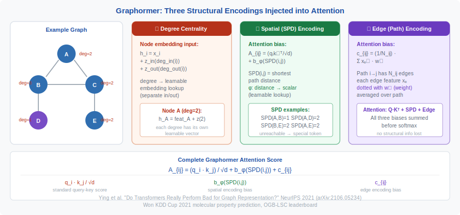
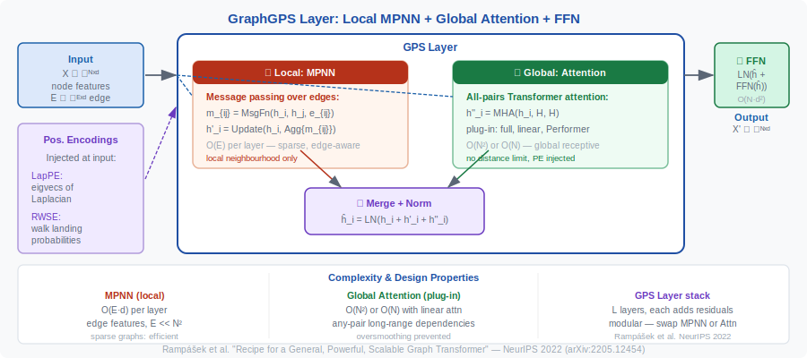

<!-- ============================ TOP NAV ============================ -->
<div align="center">

[🏠 Home](../../README.md) &nbsp;•&nbsp; [📚 Section 1 — Transformer Architecture](./README.md) &nbsp;•&nbsp; [⬅️ Q33 — Attention as Kernel Method](./q33-attention-kernel-method.md)

</div>

---

# Q34 · Transformers on graphs — Graphormer, GraphGPS, and why vanilla Transformers struggle on graph data

<div align="center">


</div>

> [!IMPORTANT]
> **The 20-second answer.** Vanilla Transformers treat input as a sequence with fixed positional order; graphs are unordered, irregular structures where the inductive bias of "distance" is topological (shortest path), not positional. A Transformer applied naively to graph nodes sees all nodes as equally distant and loses permutation equivariance unless graph structure is explicitly encoded. Two papers define the modern approach: **Graphormer** (Ying et al., NeurIPS 2021) injects graph structure into standard Transformer attention via three learnable encodings — degree centrality, spatial (shortest-path distance), and edge encodings as attention biases. **GraphGPS** (Rampášek et al., NeurIPS 2022) generalizes this into a modular framework combining local message-passing networks (MPNN) + positional/structural encodings + global Transformer attention, achieving linear complexity $O(N+E)$ and state-of-the-art results across 16 graph benchmarks.

---

## Table of contents

1. [Why vanilla Transformers struggle on graphs](#1--why-vanilla-transformers-struggle-on-graphs)
2. [The key design challenge — encoding graph structure](#2--the-key-design-challenge--encoding-graph-structure)
3. [Graphormer — structural bias in Transformer attention](#3--graphormer--structural-bias-in-transformer-attention)
4. [GraphGPS — the modular GPS framework](#4--graphgps--the-modular-gps-framework)
5. [Comparison table](#5--comparison-table)
6. [Key results](#6--key-results)
7. [Intuition and design choices](#7--intuition-and-design-choices)
8. [Reference implementations (sketches)](#8--reference-implementations-sketches)
9. [Worked numerical example](#9--worked-numerical-example)
10. [Interview drill](#10--interview-drill)
11. [Common misconceptions](#11--common-misconceptions)
12. [One-screen summary](#12--one-screen-summary)
13. [References](#13--references)

---

## 1 · Why vanilla Transformers struggle on graphs

### Problem 1: No intrinsic spatial structure

A standard Transformer uses positional encodings (sinusoidal, RoPE, etc.) that encode the **index** of a token in a sequence. Graphs have no natural linear ordering — nodes are indexed arbitrarily, and any permutation of node indices describes the same graph. Applying sequence positional encodings to graph nodes gives encodings that depend on the arbitrary index assignment, breaking **permutation equivariance**.

> [!NOTE]
> **Permutation equivariance** for graph models means: if you permute the node labels (renumber the nodes), the output for each node should be permuted correspondingly. A model that embeds node $i$ differently from node $j$ purely because $i < j$ (sequence positional order) is not permutation equivariant.

### Problem 2: All-to-all attention ignores graph topology

In a vanilla Transformer, every node attends to every other node with equal initial access — the model starts from a fully-connected view. For graphs, many node pairs are structurally far apart (high shortest-path distance or no path at all), and their interaction should be downweighted. Without structural priors, the model must learn topology from scratch, which is data-inefficient.

### Problem 3: Edge features are discarded

Many graphs (molecules, knowledge graphs, citation networks) have rich edge features (bond types, relation labels, citation weights). A sequence Transformer has no natural mechanism to incorporate edge-level information.

### Problem 4: Over-squashing in deep MPNNs (alternative approach fails)

The classical alternative — message-passing GNNs (MPNNs) — aggregate information only from local neighborhoods. At depth $k$, a node sees only its $k$-hop neighbors. For long-range dependencies, this requires very deep networks that suffer from **over-squashing** (exponentially many paths compressed into a fixed-size vector) and **over-smoothing** (node features converge to indistinguishable vectors).

---

## 2 · The key design challenge — encoding graph structure

<div align="center">

<br><sub><b>Figure 1.</b> Graphormer injects graph structure via three additive terms: degree centrality bias in node embeddings, shortest-path distance (SPD) as an attention score bias b_φ(SPD(i,j)), and edge-path features averaged over the shortest path as an additional bias c_{ij}. All three are learnable and preserve permutation equivariance.</sub>
</div>

Any graph Transformer must solve: **how do you encode graph structure (topology, distances, edge features) into the attention mechanism without breaking permutation equivariance?**

The answer has three categories:

| Encoding type | What it captures | How injected |
|---|---|---|
| **Node-level (centrality)** | Node importance / degree | Added to node feature embedding |
| **Pairwise (spatial)** | Distance between node pairs | Added as attention bias $b_{ij}$ |
| **Edge-level** | Features on the edge between nodes | Added as attention bias or feature |

Permutation equivariance is preserved as long as encodings depend on **graph properties** (degree, path length) rather than **node indices**.

---

## 3 · Graphormer — structural bias in Transformer attention

**Paper:** "Do Transformers Really Perform Bad for Graph Representation?"
**Authors:** Chengxuan Ying, Tianle Cai, Shengjie Luo, Shuxin Zheng, Guolin Ke, Di He, Yanming Shen, Tie-Yan Liu
**Venue:** NeurIPS 2021
**arXiv:** 2106.05234

### Three structural encodings

#### (1) Centrality encoding — node degree

Each node $v$ in the graph has in-degree $\text{deg}^-(v)$ and out-degree $\text{deg}^+(v)$. Graphormer adds learnable degree embeddings to the input node features:

$$
h_v^{(0)} = x_v + z^-_{\text{deg}^-(v)} + z^+_{\text{deg}^+(v)}
$$

where $x_v$ is the node feature and $z^-, z^+ \in \mathbb{R}^{d}$ are learnable embedding tables indexed by degree. This informs the model about the structural importance of each node (hub nodes have high degree).

#### (2) Spatial encoding — shortest-path distance

For each pair of nodes $(v_i, v_j)$, compute the shortest-path distance $\text{SPD}(v_i, v_j)$ in the graph. Assign a learnable scalar bias $b_\phi$ to the attention logit:

$$
A_{ij} = \frac{(h_i W_Q)(h_j W_K)^\top}{\sqrt{d}} + b_{\phi(v_i, v_j)}
$$

where $\phi(v_i, v_j) = \text{SPD}(v_i, v_j)$ and $b_\phi \in \mathbb{R}$ is a learnable scalar per distance value. For disconnected nodes, a special "unreachable" token is assigned. This encodes the graph's metric structure into attention.

#### (3) Edge encoding — attention bias from edge features

For node pairs $(v_i, v_j)$ connected by a path $\pi_{ij} = (e_1, e_2, \ldots, e_K)$ of $K$ edges, the edge encoding is:

$$
c_{ij} = \frac{1}{K} \sum_{n=1}^K x_{e_n}^\top w_n
$$

where $x_{e_n}$ is the feature of the $n$-th edge on the path and $w_n \in \mathbb{R}^{d_e}$ are learnable weights. This is added as an additional attention bias:

$$
A_{ij} = \frac{(h_i W_Q)(h_j W_K)^\top}{\sqrt{d}} + b_{\phi(v_i, v_j)} + c_{ij}
$$

The combined attention formula thus incorporates node features, pair-wise topology (SPD), and edge features along shortest paths.

### Key insight

Graphormer shows that many popular GNN variants (GCN, GraphSAGE, GIN, etc.) can be expressed as **special cases of Graphormer** by choosing appropriate encodings. This makes Graphormer a strict generalization of the MPNN family.

---

## 4 · GraphGPS — the modular GPS framework

**Paper:** "Recipe for a General, Powerful, Scalable Graph Transformer"
**Authors:** Ladislav Rampášek, Mikhail Galkin, Vijay Prakash Dwivedi, Anh Tuan Luu, Guy Wolf, Dominique Beaini
**Venue:** NeurIPS 2022
**arXiv:** 2205.12454

### Motivation

Graphormer's spatial encoding requires precomputing all-pairs shortest paths — $O(N^3)$ preprocessing and $O(N^2)$ memory, prohibiting large graphs. GraphGPS addresses this with a modular framework that achieves **linear complexity $O(N + E)$** by decoupling local and global computation.

### The GPS layer

Each GPS layer combines three components applied in sequence (or parallel):

$$
h^{(\ell+1)} = \text{GPS-Layer}(h^{(\ell)}) = \text{FFN}(\text{GlobalAttn}(h^{(\ell)}) + \text{LocalMPNN}(h^{(\ell)}))
$$

More precisely:

1. **Local Message-Passing (MPNN):** Any standard MPNN (GatedGCN, GINE, etc.) operating on **real edges only** — aggregates information from direct neighbors. Cost: $O(E \cdot d)$ where $E$ = number of edges.

2. **Global Attention:** Any Transformer-style attention operating over **all node pairs** — captures long-range dependencies. Cost: $O(N^2 d)$ for full attention, or $O(Nrd)$ for linear attention (Performers, etc.). When linear attention is used, the whole GPS layer is $O(N + E)$.

3. **FFN:** Standard position-wise feed-forward network.

The key insight is that the MPNN and global attention are **decoupled** — the MPNN handles local topology with exact edge information, and the global attention handles long-range patterns without needing to encode every pairwise distance.

### Positional and structural encodings in GraphGPS

GraphGPS categorizes encodings into three types:

| Type | Example | What it encodes |
|---|---|---|
| **Local** | Node degree, local topology | Immediate neighborhood |
| **Global** | Laplacian eigenvectors (LapPE), random-walk encodings (RWSE) | Graph-global position |
| **Relative** | Shortest-path distance (as in Graphormer) | Pairwise relationships |

The paper evaluates multiple combinations. **Laplacian PE (LapPE):** Use the eigenvectors of the normalized graph Laplacian $L = I - D^{-1/2} A D^{-1/2}$:

$$
L v_k = \lambda_k v_k, \quad \text{PE}_i = [v_1(i), v_2(i), \ldots, v_K(i)]
$$

where $v_k(i)$ is the $i$-th component of the $k$-th eigenvector. This assigns each node a $K$-dimensional encoding reflecting its position in the graph's spectral geometry.

**Random Walk PE (RWSE):** $\text{PE}_i(k) = P^k_{ii}$ — the probability of a random walk returning to node $i$ after $k$ steps. This encodes local graph structure without eigenvector sign ambiguity.

### Complexity

| Component | Cost |
|---|---|
| MPNN | $O(E \cdot d)$ |
| Global attention (full) | $O(N^2 d)$ |
| Global attention (linear/Performer) | $O(N r d)$ |
| FFN | $O(N d^2)$ |
| **Total (with linear attention)** | $O((N + E) d + N d^2)$ |

For sparse graphs ($E \ll N^2$), the total is effectively linear in $N$.

---

## 5 · Comparison table

<div align="center">

<br><sub><b>Figure 2.</b> A GraphGPS layer combines a local MPNN (O(E) — edge-aware, sparse) and a global attention module (O(N²) or O(N) with linear attention) in parallel, then merges via LayerNorm and an FFN. Structural positional encodings (LapPE, RWSE) are injected at the input to both branches.</sub>
</div>

| Dimension | Vanilla Transformer | Graphormer | GraphGPS |
|---|---|---|---|
| Graph structure input | None | SPD + degree + edge bias | MPNN local + PE global |
| Permutation equivariant | No (sequence PE) | Yes (graph-based PE) | Yes |
| Complexity | $O(N^2 d)$ | $O(N^2 d)$ + $O(N^3)$ SPD preprocessing | $O(N+E)$ with linear attn |
| Edge features | No | Yes (path-averaged) | Yes (via MPNN) |
| Max graph size | N/A | ~100s of nodes | ~10k+ nodes |
| Generalization | Sequences | Generalizes MPNNs | Strictly more expressive than MPNNs |
| Benchmarks | N/A | OGB-LSC winner (2021) | SOTA on 16 benchmarks (2022) |
| Published | Vaswani 2017 | NeurIPS 2021 | NeurIPS 2022 |

---

## 6 · Key results

### Graphormer

- **OGB Large-Scale Challenge (PCQM4M):** Graphormer achieved the best MAE among all entries at NeurIPS 2021, demonstrating that Transformers with structural encodings can outperform specialized GNNs on molecular property prediction.
- **Open Catalyst Challenge:** Graphormer won this competition on modeling catalyst-adsorbate reaction systems.
- **OGB-MolHIV, OGB-MolPCBA:** Competitive with or better than top GNN methods.

### GraphGPS

- **LRGB (Long-Range Graph Benchmarks):** GPS achieves state-of-the-art on 5 out of 5 LRGB datasets designed specifically to test long-range information flow — tasks where MPNNs struggle.
- **16 diverse benchmarks:** GPS with different MPNN backends and PE types consistently outperforms prior methods across molecular, social, citation, and code graphs.
- **Scalability:** By using Performer attention, GPS scales to graphs with tens of thousands of nodes.

---

## 7 · Intuition and design choices

**Why can't you just add sequence positional encodings?**

Sequence PE embeds node $i$ differently from node $j$ because $i \neq j$, but there is no reason a priori that node $1$ is more similar to node $2$ than node $1000$ — graph topology, not index, determines similarity. SPD-based spatial encoding instead embeds node pairs by their *graph distance*, which is permutation invariant.

**Why does Graphormer need $O(N^3)$ preprocessing?**

All-pairs shortest path (APSP) computation costs $O(N^3)$ via Floyd-Warshall or $O(N(N+E))$ via $N$ BFS calls. For molecules (N ~ 10–100 atoms), this is trivial. For large graphs (N ~ 10,000 nodes), it becomes prohibitive.

**Why does GPS add MPNN to global attention rather than replacing it?**

MPNNs explicitly propagate information along real edges, which encodes local topology exactly and efficiently. Global attention captures long-range patterns but is agnostic to whether two nodes are actually connected. The combination gets the best of both: exact local structure + long-range global context.

**Laplacian eigenvectors vs. random walk PE:**

Laplacian eigenvectors are theoretically motivated (they are the "graph Fourier basis") but have a sign ambiguity (eigenvectors are defined up to $\pm 1$), requiring special handling (e.g., sign-equivariant encoders). Random walk PE avoids sign ambiguity and is computationally simpler.

---

## 8 · Reference implementations (sketches)

### Graphormer spatial encoding
```python
def graphormer_attention_bias(spd_matrix, max_dist=20):
    """
    spd_matrix: (N, N) integer shortest-path distances
    Returns attention bias: (N, N)
    """
    # Learnable bias table indexed by SPD
    bias_table = nn.Embedding(max_dist + 2, 1)   # +2 for unreachable token
    spd_clamped = spd_matrix.clamp(0, max_dist)
    spd_clamped[spd_matrix < 0] = max_dist + 1   # unreachable
    return bias_table(spd_clamped).squeeze(-1)    # (N, N)

def graphormer_attention(Q, K, V, spd_bias, edge_bias=None):
    d = Q.shape[-1]
    scores = (Q @ K.transpose(-2, -1)) / d**0.5  # (N, N)
    scores = scores + spd_bias
    if edge_bias is not None:
        scores = scores + edge_bias
    return F.softmax(scores, dim=-1) @ V
```

### GPS layer (pseudocode)
```python
class GPSLayer(nn.Module):
    def __init__(self, mpnn, global_attn, d_model, dropout=0.1):
        super().__init__()
        self.mpnn = mpnn          # any MPNN (GatedGCN, GINE, etc.)
        self.attn = global_attn   # any attention (full or Performer)
        self.norm1 = nn.LayerNorm(d_model)
        self.norm2 = nn.LayerNorm(d_model)
        self.ffn = FFN(d_model)

    def forward(self, x, edge_index, edge_attr=None):
        # Local: MPNN over real edges
        h_local = self.mpnn(x, edge_index, edge_attr)
        # Global: attention over all nodes
        h_global = self.attn(x)
        # Combine, normalize, FFN
        h = self.norm1(x + h_local + h_global)
        h = self.norm2(h + self.ffn(h))
        return h
```

---

## 9 · Worked numerical example

We compute Graphormer's attention score for two node pairs on a small 4-node graph to make the three structural encodings concrete.

**Graph setup.** Four nodes A, B, C, D with edges A-B, B-C, B-D (star from B).

| Node | Degree (undirected) | Features $x_i \in \mathbb{R}^2$ |
|---|---|---|
| A | 1 | $[1, 0]$ |
| B | 3 | $[0, 1]$ |
| C | 1 | $[1, 0]$ |
| D | 1 | $[1, 0]$ |

**Structural encodings** (all learnable; we use illustrative scalar values):

**(1) Degree centrality.** Learnable degree embedding $z(\text{deg})$:

$$z(1) = 0.1, \quad z(3) = 0.5 \quad (\text{scalar illustration; in practice} \in \mathbb{R}^d)$$

Node embeddings after centrality encoding:
$$h_A = x_A + z(1) = [1, 0] + 0.1 = [1.1, 0.1], \quad h_B = x_B + z(3) = [0, 1] + 0.5 = [0.5, 1.5]$$

**(2) Spatial encoding.** Shortest-path distances (SPD) and learnable bias $b_\phi(\text{SPD})$:

| Pair | SPD | $b_\phi(\text{SPD})$ |
|---|---|---|
| (A, B) | 1 | $0.8$ |
| (A, C) | 2 | $0.3$ |
| (A, D) | 2 | $0.3$ |
| (B, C) | 1 | $0.8$ |
| (A, A) | 0 | $1.0$ (self) |

**(3) Edge encoding.** A-B edge feature $e_{AB} = [1]$ (one edge type), weight $w_1 = 0.6$: $c_{AB} = e_{AB} \cdot w_1 = 0.6$.

**Full attention score** for pair (A, B):

$$A_{AB} = \underbrace{(q_A \cdot k_B) / \sqrt{2}}_{\text{standard}} + \underbrace{b_\phi(\text{SPD}(A,B))}_{\text{spatial}} + \underbrace{c_{AB}}_{\text{edge}}$$

With simplified projections $W_Q = W_K = I$:

$$q_A = h_A = [1.1, 0.1], \quad k_B = h_B = [0.5, 1.5]$$

$$q_A \cdot k_B = 1.1 \times 0.5 + 0.1 \times 1.5 = 0.55 + 0.15 = 0.70$$

$$A_{AB} = 0.70/\sqrt{2} + 0.8 + 0.6 = 0.495 + 0.8 + 0.6 = \mathbf{1.895}$$

**Pair (A, C)** — two hops, no direct edge ($c_{AC} = 0$):

$$q_A \cdot k_C = [1.1, 0.1] \cdot [1.1, 0.1] = 1.21 + 0.01 = 1.22 \quad (C = A \text{ in features})$$

$$A_{AC} = 1.22/\sqrt{2} + 0.3 + 0 = 0.863 + 0.3 = \mathbf{1.163}$$

**Comparison:**

| Pair | Dot product / √d | Spatial bias | Edge bias | Total |
|---|---|---|---|---|
| (A, B) | 0.495 | 0.8 | 0.6 | **1.895** |
| (A, C) | 0.863 | 0.3 | 0.0 | **1.163** |
| (A, A) | $\|h_A\|^2/\sqrt{2} = 0.864$ | 1.0 | 0.0 | **1.864** |

Despite A and C having identical raw features (dot product favoring A-C), the spatial encoding ($0.8 > 0.3$) and edge encoding ($0.6 > 0$) push A-B to the highest attention score — correctly reflecting the graph topology. Without structural encodings, attention would treat A and C as more similar to each other than to B.

**Key insight:** The structural biases steer attention toward topologically relevant nodes even when raw feature similarity points elsewhere.

---

## 10 · Interview drill

<details><summary><b>Q: Why is permutation equivariance important for graph models?</b></summary>

Graphs don't have a canonical node ordering — renaming node 1 as node 2 and vice versa describes the same graph. A model that is not permutation equivariant would give different predictions for the same molecule depending on how atoms are numbered, which is incorrect. Permutation equivariance ensures predictions depend only on the graph structure, not the arbitrary labeling.
</details>

<details><summary><b>Q: How does Graphormer show that GNNs are special cases of Graphormer?</b></summary>

Standard MPNNs (GCN, GIN) aggregate over 1-hop neighbors, which corresponds to Graphormer with spatial encoding restricted to nodes at SPD = 1 (directly connected). The attention to non-adjacent nodes is masked out (or given zero bias). More precisely, GCN's adjacency normalization is equivalent to Graphormer's attention with specific degree-based biases and no long-range connections.
</details>

<details><summary><b>Q: What is the main advantage of GraphGPS over Graphormer for large graphs?</b></summary>

Graphormer requires all-pairs SPD computation ($O(N^3)$ preprocessing) and $O(N^2)$ memory for attention — prohibitive for large graphs. GraphGPS achieves $O(N+E)$ by (1) using MPNN for local edges (cost proportional to edges, not node pairs) and (2) using linear attention (Performers) for global attention (cost linear in $N$). The GPS approach scales to graphs with tens of thousands of nodes.
</details>

<details><summary><b>Q: What tasks specifically benefit most from graph Transformers vs. pure MPNNs?</b></summary>

Tasks requiring **long-range dependencies** — where information must flow across many hops — benefit most. Examples: (1) Molecular property prediction where distant functional groups interact (long-range electronic effects); (2) Graph regression where global topology determines the label; (3) Tasks on social/citation graphs where distant nodes are semantically related. Pure MPNNs over-squash exponentially many paths into fixed-size vectors at deep layers, losing long-range information.
</details>

<details><summary><b>Q: How does Graphormer handle graphs that are too large for all-pairs attention?</b></summary>

Graphormer's vanilla formulation is $O(N^2)$ in both time and memory — the same as standard Transformers — plus $O(N^3)$ preprocessing to compute all-pairs shortest paths. For large graphs (thousands of nodes), this is prohibitive. Graphormer addresses this through: (1) **subgraph sampling**: apply Graphormer to sampled subgraphs of bounded size (used in the OGB-LSC setting); (2) **approximate SPD**: use BFS distance truncated at a maximum hop count; (3) **GraphGPS as the scalable successor**: replaces all-pairs encoding with local MPNN + linear attention ($O(N+E)$). In practice, Graphormer is suited for small-to-medium molecular graphs (≤100 atoms) where $O(N^2)$ is tractable; GraphGPS is preferred for larger graphs.
</details>

<details><summary><b>Q: What is Laplacian positional encoding (LapPE), and why is it graph-appropriate?</b></summary>

LapPE uses the $k$ smallest non-trivial eigenvectors of the graph Laplacian $L = D - A$ as positional encodings for each node. The Laplacian eigenvectors form a spectral basis for the graph: eigenvectors with small eigenvalues (close to 0) capture global, smooth structure (connected components, clusters); eigenvectors with large eigenvalues capture local, oscillatory structure. Unlike positional encodings for sequences (sinusoidal, RoPE), Laplacian PE is permutation-equivariant by construction — swapping two nodes swaps their PE, which is consistent with graph isomorphism. The main challenge: eigenvectors are only unique up to sign flips (for simple eigenvalues), so random sign augmentation is used during training. LapPE can be precomputed once per graph and is used in GraphGPS and many subsequent graph Transformers.
</details>

<details><summary><b>Q: What is over-squashing in MPNNs, and how do graph Transformers address it?</b></summary>

Over-squashing occurs in deep MPNNs when information from exponentially many nodes must be compressed into a fixed-size message at each aggregation step. After $k$ MPNN layers, each node has an $O(r^k)$-neighborhood (where $r$ is average degree), but the representation has fixed dimension $d$. For large $k$, information from distant nodes is diluted and eventually lost. This is particularly harmful for tasks requiring long-range dependencies (e.g., functional group interactions in molecules). Graph Transformers address over-squashing by adding global attention: every node attends directly to every other node, bypassing the multi-hop bottleneck. In GraphGPS, the global attention module provides direct all-pairs communication, while the local MPNN handles edge-featured local structure. The combination eliminates over-squashing for graph-level tasks while keeping $O(N+E)$ complexity via linear attention.
</details>

---

## 11 · Common misconceptions

| Misconception | Reality |
|---|---|
| "Any Transformer can be applied to graphs with just node feature inputs." | Without structural encodings, the model loses permutation equivariance and cannot distinguish graph topology — it treats all nodes as equally distant. |
| "Graphormer requires a special graph neural network backbone." | Graphormer is a standard Transformer; it is made graph-aware entirely through its encoding strategy (degree, SPD, edge biases), not through a modified architecture. |
| "GraphGPS replaces the MPNN with Transformer attention." | GPS **adds** global attention on top of MPNN — both are used together, not one replacing the other. |
| "SPD-based positional encoding is like sequence positional encoding." | SPD encodes topological distance in the graph (permutation invariant). Sequence PE encodes token index (permutation sensitive). They are fundamentally different. |
| "Graphormer won't scale to large graphs." | The original Graphormer is limited by $O(N^2)$ attention and $O(N^3)$ SPD preprocessing. Follow-up work (Graphormer-GD, etc.) addresses scaling for larger graphs. |

---

## 12 · One-screen summary

> **Problem:** Vanilla Transformers can't handle graphs — no permutation equivariance, no awareness of graph topology, no edge features, and quadratic cost is prohibitive for large graphs. **Graphormer (NeurIPS 2021):** Add degree centrality to node embeddings; add SPD-based learnable scalar bias to attention logits; add edge encoding bias — all permutation invariant. State-of-the-art on molecular benchmarks; $O(N^2)$ cost limits scale. **GraphGPS (NeurIPS 2022):** Modular GPS layer = MPNN (local) + global attention + PE; $O(N+E)$ with linear attention; SOTA on 16 benchmarks including long-range tasks. **Key design rule:** Encode graph structure via graph-property-dependent (not index-dependent) features injected into attention as biases.
>
> **Interview rule of thumb:** For small molecular graphs (≤100 nodes) where structural encodings matter and $O(N^2)$ is affordable, Graphormer is the gold standard. For larger graphs (proteins, social networks, citation graphs with thousands of nodes), GraphGPS with linear attention ($O(N+E)$) and LapPE/RWSE is the practical choice. The key principle: always inject topology — an attention model that ignores graph structure reduces to a bag-of-nodes model regardless of depth.

---

## 13 · References

1. **Ying, C., Cai, T., Luo, S., Zheng, S., Ke, G., He, D., Shen, Y., Liu, T.-Y.** "Do Transformers Really Perform Bad for Graph Representation?" NeurIPS 2021. arXiv:2106.05234. [https://arxiv.org/abs/2106.05234](https://arxiv.org/abs/2106.05234)

2. **Rampášek, L., Galkin, M., Dwivedi, V.P., Luu, A.T., Wolf, G., Beaini, D.** "Recipe for a General, Powerful, Scalable Graph Transformer." NeurIPS 2022. arXiv:2205.12454. [https://arxiv.org/abs/2205.12454](https://arxiv.org/abs/2205.12454) — Code: [https://github.com/rampasek/GraphGPS](https://github.com/rampasek/GraphGPS)

3. **Vaswani, A., et al.** "Attention Is All You Need." NeurIPS 2017. — Baseline Transformer.

4. **Dwivedi, V.P., et al.** "Long Range Graph Benchmark." NeurIPS 2022 Datasets Track. arXiv:2206.08164. — The LRGB benchmark suite GraphGPS was evaluated on.

5. **Xu, K., et al.** "How Powerful are Graph Neural Networks?" ICLR 2019. — GIN, the theoretical foundation for MPNN expressivity. arXiv:1810.00826.

6. **Veličković, P., et al.** "Graph Attention Networks." ICLR 2018. arXiv:1710.10903. — Key prior work on attention in GNNs.

---

<!-- ============================ BOTTOM NAV ============================ -->
<div align="center">

[⬅️ Q33 — Attention as Kernel Method](./q33-attention-kernel-method.md) &nbsp;|&nbsp; [📚 Back to Section 1](./README.md) &nbsp;|&nbsp; [🏠 Home](../../README.md)

<sub>Found an error or have a sharper intuition? See <a href="../../CONTRIBUTING.md">CONTRIBUTING</a> — answers follow the <a href="../../_TEMPLATE.md">answer template</a>.</sub>

</div>
