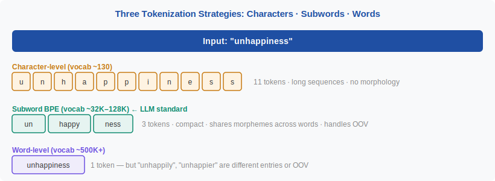
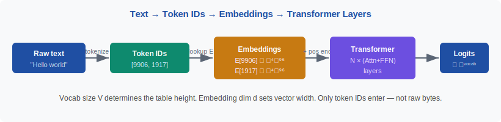

<!-- ============================ TOP NAV ============================ -->
<div align="center">

[🏠 Home](../../README.md) &nbsp;•&nbsp; [📚 Section 2 — Tokenization & Embeddings](./README.md) &nbsp;•&nbsp; [Q2‑02 — BPE ➡️](./q02-bpe.md)

</div>

---

# Q2‑01 · What is a token, and why do LLMs operate on tokens rather than characters or words?

<div align="center">


</div>

> [!IMPORTANT]
> **The 20‑second answer.** A **token** is the atomic unit a language model processes — typically a subword piece like "un", "happy", or "ness". LLMs use tokens instead of characters (too many steps for long sequences, no morphological grouping) or words (vocabulary explosion, out-of-vocabulary problem). Subword tokenization hits the sweet spot: a compact vocabulary of 32K–128K entries that covers all text without ever producing an UNK, and that keeps semantically related forms (e.g. "happy" / "happiness") sharing a common prefix.

---

## Table of contents

1. [First principles](#1--first-principles)
2. [The problem, told as a story](#2--the-problem-told-as-a-story)
3. [The three approaches, compared](#3--the-three-approaches-compared)
4. [Why subwords win](#4--why-subwords-win)
5. [How text becomes token IDs](#5--how-text-becomes-token-ids)
6. [Variants / comparison table](#6--variants--comparison-table)
7. [Algorithm & pseudocode](#7--algorithm--pseudocode)
8. [Reference implementation](#8--reference-implementation)
9. [Worked example](#9--worked-example)
10. [Where it matters in practice](#10--where-it-matters-in-practice)
11. [Cousins & alternatives](#11--cousins--alternatives)
12. [Interview drill](#12--interview-drill)
13. [Common misconceptions](#13--common-misconceptions)
14. [One‑screen summary](#14--one-screen-summary)
15. [References](#15--references)

---

## 1 · First principles

A language model must turn arbitrary text into a **fixed-size vector** it can process. The very first decision is: what is the smallest unit of text we hand to the model?

There are three natural choices:

- **Character** — the alphabet (ASCII, Unicode codepoints)
- **Word** — space-separated tokens
- **Subword** — something between character and word

The choice affects three quantities that are in tension:

$$\text{sequence length} \propto \frac{1}{\text{token granularity}}, \qquad \text{vocab size} \propto \text{token granularity}, \qquad \text{OOV risk} \propto \frac{1}{\text{vocab size}}$$

> [!NOTE]
> **Plain‑English version.** Imagine writing in Lego bricks. Single-letter bricks give you maximum flexibility but you need thousands of bricks to write a sentence. Full-word bricks are compact but you'd need millions of different brick shapes, and any word you've never built a brick for is unrepresentable. Subword bricks — "un-", "happy", "-ness" — give you a few tens of thousands of shapes that can construct almost any English (or other language) word.

---

## 2 · The problem, told as a story

Early neural language models (pre-2016) used word vocabularies of 50K–100K entries. This caused two painful failure modes:

**Failure 1 — OOV (Out-Of-Vocabulary).** Any rare word, misspelling, technical term, or new proper noun that didn't appear in training becomes `[UNK]`. All information in that word is silently discarded. A medical NLP model trained before 2020 literally cannot represent "COVID-19".

**Failure 2 — Vocabulary explosion for morphologically rich languages.** Finnish has 15 grammatical cases; a Finnish word like "talo" (house) generates "talo", "talon", "talossa", "talosta", "taloon", "talolla", "talolta", "talolle"… dozens of surface forms per lemma. A word-level vocabulary for Finnish needs millions of entries to have reasonable coverage.

Character-level models avoid both problems but create a third: **long sequences**. The word "internationalization" is 20 characters. A 4K-context window fits only ~200 words at character granularity. Attention is $O(n^2)$ in sequence length, so this is expensive.

<div align="center">

<br><sub><b>Figure 1.</b> The granularity spectrum. Subword tokenization balances sequence length, vocabulary size, and OOV coverage.</sub>
</div>

---

## 3 · The three approaches, compared

| Property | Character | Subword (BPE/WP) | Word |
|---|---|---|---|
| **Vocab size** | ~100–300 | 32K–256K | 500K–millions |
| **Sequence length** | 5–6× longer | 1× (baseline) | 0.7–0.8× |
| **OOV handling** | Never (every char exists) | Rare (byte-level: never) | Frequent for rare words |
| **Morphology** | No grouping | Partial (shared prefixes) | Full word forms separate |
| **Example models** | CANINE, ByT5 | GPT-4, Llama, BERT | Early NMT (pre-2016) |
| **Context efficiency** | Poor | Good | Best (but OOV is fatal) |

---

## 4 · Why subwords win

The subword approach captures three desiderata simultaneously:

1. **Bounded vocabulary** — 32K–128K entries fit in GPU memory and make the softmax over vocab tractable.
2. **OOV-free** — with byte-level BPE (GPT-2 onward), every UTF-8 byte has an entry, so any string tokenizes.
3. **Morphological regularity** — "happy", "unhappy", "happiness", "happily" all share the subword "happy", so the embedding space captures semantic proximity for free.

The tradeoff is that subword tokenization is **language-specific in its efficiency**: English text tokenizes at ~4 characters/token with GPT-4's tokenizer, while some non-Latin scripts tokenize at 1–2 characters/token (higher fertility → longer sequences → higher cost).

---

## 5 · How text becomes token IDs

<div align="center">

<br><sub><b>Figure 2.</b> The full pipeline. The tokenizer (CPU step) converts text to integer IDs; the embedding table (GPU) converts IDs to float vectors; Transformer layers process those vectors.</sub>
</div>

The embedding table $E \in \mathbb{R}^{V \times d}$ is the first weight matrix of the model. Each row is a $d$-dimensional vector for one vocabulary entry. A forward pass looks up each token ID's row — this is a strided memory access, not a matrix multiply, so it is $O(d)$ per token.

---

## 6 · Variants / comparison table

| Algorithm | Selection criterion | OOV | Continuation marker | Main users |
|---|---|---|---|---|
| **BPE** | Most frequent pair | Byte-level: never | None (merge handles it) | GPT-2/3/4, Llama, Mistral |
| **WordPiece** | Likelihood gain ratio | [UNK] possible | `##` prefix | BERT, DistilBERT |
| **Unigram LM** | Maximize corpus log-likelihood | Very rare | None | SentencePiece (T5, mBART) |
| **Character** | N/A | Never | Explicit EOS/BOS | ByT5, CANINE |
| **Byte-level** | N/A | Never | N/A | ByT5 (raw bytes) |

---

## 7 · Algorithm & pseudocode

```text
INPUT : text string
        tokenizer vocabulary V  (list of subword strings, ordered by priority)
        merge rules R           (for BPE) or probabilities P (for Unigram)
OUTPUT: list of integer token IDs

TRAINING (once, offline):
  1.  Pre-tokenize text into words (split on whitespace / regex)
  2.  Initialize base alphabet (characters or bytes)
  3.  Iteratively merge or prune until |vocabulary| = target size V
  4.  Serialize vocabulary + rules to disk

ENCODING (per request):
  1.  Apply pre-tokenization (same regex as training)
  2.  For each word:
        a.  Split into base units (characters or bytes)
        b.  Apply merge rules greedily in order (BPE)
            OR run Viterbi to find MAP segmentation (Unigram)
  3.  Map each subword to its integer ID
  RETURN list of IDs

DECODING (inference output):
  1.  Map IDs back to subword strings
  2.  Concatenate, strip continuation markers
  RETURN text string
```

---

## 8 · Reference implementation

```python
# Using HuggingFace tokenizers — the standard interface
from transformers import AutoTokenizer

tok = AutoTokenizer.from_pretrained("meta-llama/Meta-Llama-3-8B")

text = "Tokenization is the hidden tax on every LLM."
ids  = tok.encode(text)           # list[int]
back = tok.decode(ids)            # reconstruct text

print(ids)   # [128000, 9139, 2065, 367, 374, 279, ...]
print(back)  # "Tokenization is the hidden tax on every LLM."

# Inspect individual tokens
for id_ in ids[:8]:
    print(f"{id_:6d}  {tok.decode([id_])!r}")
```

> [!NOTE]
> `tok.encode` calls the **tokenizer** (pure CPU, usually Rust via HuggingFace tokenizers library). The embedding lookup happens inside the model's `forward()` call, not here.

---

## 9 · Worked example

Input sentence: **"unhappiness is complex"**

Using a BPE tokenizer with vocabulary containing `{un, happy, ness, is, complex, Ġis, Ġcomplex, Ġun}` (Ġ = space prefix):

| Position | Raw chars | Token | ID |
|---|---|---|---|
| 0 | "un" | `un` | 913 |
| 1 | "happy" | `happy` | 6380 |
| 2 | "ness" | `ness` | 1108 |
| 3 | " is" | `Ġis` | 374 |
| 4 | " complex" | `Ġcomplex` | 6485 |

**5 tokens** for 3 words. A character-level model would need 22 tokens for the same span. The sequence is 4.4× shorter — meaning 4.4× more text fits in the same context window.

---

## 10 · Where it matters in practice

- **API cost**: OpenAI charges per token — a poorly-tokenized language pays more per word than English.
- **Context window**: 128K token context = ~500K English characters, but only ~130K Tamil characters (due to high fertility).
- **Arithmetic**: "1,234,567" may tokenize as `["1", ",", "234", ",", "567"]` — 5 tokens — making digit-level operations hard (see Q2‑13).
- **Security**: Some token IDs correspond to unexpected strings ("glitch tokens") with unusual embeddings (see Q2‑17).
- **Streaming**: Token boundaries determine when a word appears in streamed output — a word split across two tokens appears in two flushes.

---

## 11 · Cousins & alternatives

| Method | Idea | When to prefer |
|---|---|---|
| **Byte-level (ByT5)** | Each byte is a token; no vocabulary training needed | Multilingual, noisy text, robustness to typos |
| **Character-level (CANINE)** | Each Unicode codepoint is a token | Morphology-rich, low-resource |
| **Word n-gram** | Explicit phrase tokens | Old-school IR, not in modern LLMs |
| **Sentence-level** | Embed full sentences as one token | Retrieval embeddings (not generative) |

---

## 12 · Interview drill

<details>
<summary><b>Q: Why not just use characters? Fewer parameters, simpler vocabulary.</b></summary>

Characters produce sequences 5–6× longer than subwords for typical English text. Since self-attention is $O(n^2)$ in sequence length, character-level models are far more expensive to train for the same context. More importantly, characters carry no morphological grouping — "un", "happy", "ness" share no representation, so the model must re-learn their semantic relationship from scratch in every context.
</details>

<details>
<summary><b>Q: Why not words? More natural, easier to interpret.</b></summary>

Two fatal problems: (1) **Vocabulary size** — English alone has millions of surface forms; fitting an embedding table is prohibitive and the softmax over vocab at output is slow. (2) **OOV** — any unseen word (rare, new, misspelled) maps to `[UNK]`, discarding all signal. Subwords solve both.
</details>

<details>
<summary><b>Q: Does the tokenizer affect model quality, or is it just preprocessing?</b></summary>

It directly affects quality. A tokenizer that fragments domain-specific terms into many small pieces makes it harder for the model to associate the term with its meaning. Fertility differences across languages create implicit training-data imbalance — a language requiring 5× more tokens per sentence is 5× less represented per character of training text.
</details>

<details>
<summary><b>Q: How does the tokenizer relate to the model's vocabulary size hyperparameter?</b></summary>

They are the same $V$. The tokenizer vocabulary and the model's embedding table (first weight matrix, shape $V \times d$) must match exactly. Changing one requires retraining the other. This is why swapping tokenizers mid-training is extremely disruptive.
</details>

---

## 13 · Common misconceptions

| ❌ Misconception | ✅ Reality |
|---|---|
| "Tokens are words." | Tokens are subword pieces; one word is often 1–4 tokens, and short common words are 1. |
| "The tokenizer is part of the model." | The tokenizer is a separate, deterministic rule system; the model never sees text — only integer IDs. |
| "Larger vocabulary → always better." | Larger vocab reduces sequence length but inflates the embedding table and output softmax; there's an optimal range (32K–128K for most LLMs). |
| "Token boundaries align with morpheme boundaries." | Sometimes, but not guaranteed — BPE merges by frequency, not linguistic meaning. |
| "Changing the tokenizer is cheap." | Changing vocab requires re-initializing the embedding and output matrices and retraining from scratch. |

---

## 14 · One‑screen summary

> **What:** A token is the atomic input unit of an LLM — typically a subword string like "un", "happy", or "##ness".
>
> **Problem solved:** Characters produce excessively long sequences (slow attention); words produce OOV and vocabulary explosion. Subwords hit the sweet spot: compact vocab (32K–128K), OOV-free (with byte-level BPE), and morphologically regular.
>
> **Why it works:** Subword segmentation decomposes text into frequent chunks that recur across many words, so the embedding table can amortize representations across related forms.
>
> **Caveats:** Tokenization is language-specific — non-Latin scripts tokenize at 2–6× the fertility of English, increasing cost and reducing effective context. Token granularity also hurts arithmetic and exact-string matching tasks.

---

## 15 · References

1. Sennrich, R., Haddow, B., Birch, A. — **Neural Machine Translation of Rare Words with Subword Units** (BPE paper). *ACL 2016 / arXiv:1508.07909.* — foundational BPE tokenization paper.
2. Schuster, M., Nakamura, K. — **Japanese and Korean Voice Search** (WordPiece). *ICASSP 2012.* — origin of WordPiece; adopted by BERT.
3. Kudo, T., Richardson, J. — **SentencePiece: A simple and language-independent subword tokenizer**. *EMNLP 2018.* — the standard implementation for Unigram LM and BPE.
4. Radford, A. et al. — **Language Models are Unsupervised Multitask Learners** (GPT-2). *OpenAI 2019.* — introduces byte-level BPE.
5. Rust, P. et al. — **How Good is Your Tokenizer? On the Monolingual Performance of Multilingual Language Models**. *ACL 2021.* — fertility analysis across languages; shows fertility predicts downstream performance.
6. Touvron, H. et al. — **Llama 2: Open Foundation and Fine-Tuned Chat Models**. *arXiv:2307.09288.* — uses SentencePiece BPE with 32K vocab.
7. Dubey, A. et al. — **The Llama 3 Herd of Models**. *arXiv:2407.21783.* — expands to 128K tiktoken-based vocabulary.

---

<!-- ============================ BOTTOM NAV ============================ -->
<div align="center">

[📚 Back to Section 2](./README.md) &nbsp;|&nbsp; [🏠 Home](../../README.md) &nbsp;|&nbsp; [Q2‑02 — BPE ➡️](./q02-bpe.md)

<sub>Found an error or have a sharper intuition? See <a href="../../CONTRIBUTING.md">CONTRIBUTING</a> — answers follow the <a href="../../_TEMPLATE.md">answer template</a>.</sub>

</div>
