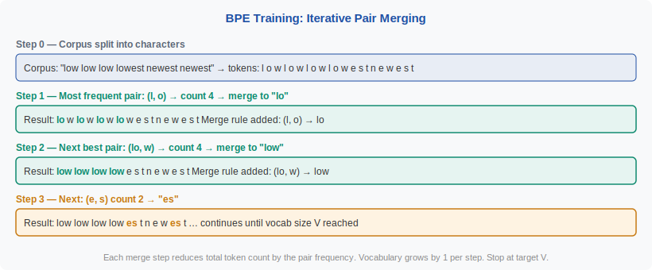
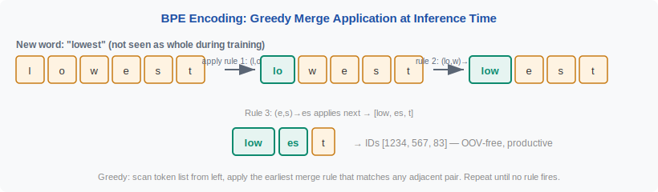

<!-- ============================ TOP NAV ============================ -->
<div align="center">

[🏠 Home](../../README.md) &nbsp;•&nbsp; [📚 Section 2 — Tokenization & Embeddings](./README.md) &nbsp;•&nbsp; [⬅️ Q2‑01 — What is a token?](./q01-what-is-a-token.md) &nbsp;•&nbsp; [Q2‑03 — WordPiece ➡️](./q03-wordpiece.md)

</div>

---

# Q2‑02 · Explain Byte-Pair Encoding (BPE) from scratch — the merge algorithm, stopping criterion, and the role of the vocabulary size hyperparameter

<div align="center">


</div>

> [!IMPORTANT]
> **The 20‑second answer.** BPE starts with a base vocabulary of individual characters (or bytes) and **greedily merges the most frequent adjacent pair** of tokens in the training corpus, adding the merged unit to the vocabulary. This repeats until the vocabulary reaches a target size $V$. The merge history forms a table of rules used to encode new text. BPE is **data-driven** (frequent subwords get their own token), **OOV-free** at the byte level (every byte always has an entry), and **deterministic** at encoding time (apply rules in training order, leftmost-first).

---

## Table of contents

1. [First principles](#1--first-principles)
2. [The problem, told as a story](#2--the-problem-told-as-a-story)
3. [The training algorithm, precisely](#3--the-training-algorithm-precisely)
4. [The encoding algorithm](#4--the-encoding-algorithm)
5. [Geometric intuition](#5--geometric-intuition)
6. [Vocabulary size: the key hyperparameter](#6--vocabulary-size-the-key-hyperparameter)
7. [Algorithm & pseudocode](#7--algorithm--pseudocode)
8. [Reference implementation](#8--reference-implementation)
9. [Worked example](#9--worked-example)
10. [Where it's used — and where it breaks](#10--where-its-used--and-where-it-breaks)
11. [Cousins & alternatives](#11--cousins--alternatives)
12. [Interview drill](#12--interview-drill)
13. [Common misconceptions](#13--common-misconceptions)
14. [One‑screen summary](#14--one-screen-summary)
15. [References](#15--references)

---

## 1 · First principles

BPE was originally a **data compression algorithm** (Gage, 1994): replace the most frequent pair of bytes in a file with an unused byte. Sennrich et al. (2016) adapted it for NLP: instead of compressing a file, we build a **vocabulary** of subword units.

The core insight is:

> **If two character sequences always appear adjacent, they function as a unit — give them a single token.**

Formally, after $k$ merges, the vocabulary is:

$$\mathcal{V}_k = \mathcal{V}_0 \cup \{t_1, t_2, \ldots, t_k\}$$

where $\mathcal{V}_0$ is the base alphabet and each $t_i$ is the result of merging a pair chosen by:

$$\text{merge}^* = \arg\max_{(a,b)} \;\text{count}(ab \text{ adjacent in corpus at step } i)$$

> [!NOTE]
> **Plain-English version.** Imagine you have a book and you notice "t" and "h" always appear next to each other. You replace every "th" with a new symbol "Ω". Now "Ω" and "e" always appear together — replace with another symbol. Keep going until you've created a useful shorthand dictionary. That dictionary is the BPE vocabulary.

---

## 2 · The problem, told as a story

A character-only vocabulary for English has ~100 entries. That's tiny — but "internationalization" is 20 characters, and a 4K context window would hold only ~200 words. A word vocabulary avoids this but fails on OOV words and requires 500K+ entries.

BPE solves both: start character-level (always representable), merge until you reach a target size (compact). The stopping criterion — **target vocabulary size $V$** — is a hyperparameter, not a convergence criterion. You stop exactly when $|\mathcal{V}| = V$.

<div align="center">

<br><sub><b>Figure 1.</b> BPE training on a tiny corpus. Each step adds one merge rule and reduces total token count by the pair frequency.</sub>
</div>

---

## 3 · The training algorithm, precisely

**Input:** raw training corpus (text), target vocabulary size $V$.

**Step 0 — Pre-tokenize.** Split on whitespace (or a language-specific regex). Represent each word as a sequence of characters + a special end-of-word marker (GPT-2 uses a leading `Ġ` for word-initial bytes instead).

**Step 1 — Count pairs.** For every adjacent pair of tokens in the current segmentation of the corpus, count how many times it appears across all word occurrences.

**Step 2 — Merge best pair.** Find the pair with the highest count. Create a new token by concatenating the pair. Add it to the vocabulary. Update the corpus segmentation by replacing all occurrences of the pair with the new token.

**Step 3 — Repeat** steps 1–2 until $|\mathcal{V}| = V$.

**Computational cost (training):** $O(V \cdot |C|)$ where $|C|$ is corpus size in characters. Each of the $V$ merge steps scans the corpus once. For large corpora this is done with efficient data structures (priority queues) that reduce it to $O(|C| \log |C|)$ amortized.

---

## 4 · The encoding algorithm

Once merge rules are fixed, encoding a **new** string uses the rules in training order:

1. Split into characters (or bytes for byte-level BPE).
2. Scan the current token list from left to right.
3. If the earliest-learned merge rule applies to any adjacent pair, apply it (merge that pair).
4. Repeat until no rule fires.
5. Map each remaining token to its ID.

**Computational cost (encoding):** $O(|w| \cdot R)$ per word where $|w|$ is word length and $R$ is the number of merge rules (≈ $V$). In practice, encoding with a priority queue is near-linear.

<div align="center">

<br><sub><b>Figure 2.</b> Encoding applies merge rules in training order. Rules learned early (high-frequency pairs) fire before later rules.</sub>
</div>

---

## 5 · Geometric intuition

Think of BPE as building a **hierarchy of units**:

```
Level 0 (chars):   l  o  w  e  s  t
Level 1 (merge 1): lo    w  e  s  t
Level 2 (merge 2): low      e  s  t
Level 3 (merge 3): low      es    t
```

Frequent words end up as single tokens at high levels ("low" = 1 token). Rare words stay fragmented at lower levels ("Antidisestablishmentarianism" = many char-level tokens). This is exactly the compression principle: frequent sequences cost 1 token; infrequent ones cost proportional to their length.

---

## 6 · Vocabulary size: the key hyperparameter

$V$ controls the fundamental sequence-length / vocabulary-size tradeoff:

| $V$ | Sequence length | Embedding table memory | Softmax cost | Used by |
|---|---|---|---|---|
| 8K | Long | 8K × d | Cheap | Small models, ByT5 |
| 32K | Medium | 32K × d | Moderate | GPT-2, Llama 1/2 |
| 50K | Medium | 50K × d | Moderate | GPT-3 |
| 100K | Short | 100K × d | Expensive | GPT-4 (cl100k) |
| 128K | Shorter | 128K × d | More expensive | Llama 3 |

**Rule of thumb:** for English-centric models, 32K–50K is mature. For multilingual models, 100K–128K is needed to give non-Latin scripts fair coverage without excessive fertility.

> [!NOTE]
> The embedding table alone at $V=128\text{K}$, $d=4096$, fp16 costs $128{,}000 \times 4{,}096 \times 2 \approx 1\text{ GB}$. This is non-trivial — doubling $V$ doubles this cost.

---

## 7 · Algorithm & pseudocode

```text
===== BPE TRAINING =====
INPUT : corpus (list of words with frequencies), target vocab size V
OUTPUT: merge_rules (ordered list of pair merges), vocabulary

1.  vocab ← {char for char in all words}  # base alphabet
    word_segs ← {word: list(word) for word in corpus}  # char-split each word

2.  WHILE |vocab| < V:
    a.  pair_counts ← count all adjacent pairs across word_segs
    b.  best_pair ← argmax pair_counts
    c.  new_token ← concat(best_pair)
    d.  vocab.add(new_token)
    e.  merge_rules.append(best_pair)
    f.  word_segs ← replace best_pair with new_token in all word_segs

3.  RETURN merge_rules, vocab

===== BPE ENCODING =====
INPUT : word string, merge_rules (in training order)
OUTPUT: list of token IDs

1.  tokens ← list(chars(word))           # split to chars (or bytes)
2.  FOR rule (a, b) IN merge_rules:
    a.  i ← 0
    b.  WHILE i < len(tokens) - 1:
            IF tokens[i] == a AND tokens[i+1] == b:
                tokens[i] ← a+b
                DELETE tokens[i+1]
            ELSE:
                i ← i + 1
3.  RETURN [vocab_id[t] for t in tokens]
```

---

## 8 · Reference implementation

```python
from collections import defaultdict

def get_pairs(vocab):
    """Count all adjacent pairs across vocabulary words."""
    pairs = defaultdict(int)
    for word, freq in vocab.items():
        symbols = word.split()
        for i in range(len(symbols) - 1):
            pairs[(symbols[i], symbols[i+1])] += freq
    return pairs

def merge_vocab(pair, vocab):
    """Apply one merge rule to the vocabulary."""
    new_vocab = {}
    bigram = " ".join(pair)
    replacement = "".join(pair)
    for word, freq in vocab.items():
        new_word = word.replace(bigram, replacement)
        new_vocab[new_word] = freq
    return new_vocab

def train_bpe(corpus: dict, target_vocab_size: int):
    """
    corpus: dict mapping 'space-separated chars' to frequency
    e.g. {"l o w </w>": 4, "l o w e s t </w>": 2, ...}
    """
    vocab = dict(corpus)
    merge_rules = []

    # Base alphabet
    base_vocab = set()
    for word in vocab:
        for sym in word.split():
            base_vocab.add(sym)

    while len(base_vocab) + len(merge_rules) < target_vocab_size:
        pairs = get_pairs(vocab)
        if not pairs:
            break
        best = max(pairs, key=pairs.get)
        vocab = merge_vocab(best, vocab)
        merge_rules.append(best)

    return merge_rules
```

> [!WARNING]
> This naive implementation is $O(V \cdot |C|)$ and slow for large corpora. Production implementations (HuggingFace tokenizers in Rust, tiktoken in C) use priority queues and incremental updates — encoding millions of tokens per second.

---

## 9 · Worked example

**Corpus** (character-split with `</w>` end-of-word marker):

```
"l o w </w>"     : freq 4
"l o w e s t </w>": freq 2
"n e w e s t </w>": freq 2
```

| Step | Best pair | Count | New token | Vocab size |
|---|---|---|---|---|
| 0 | — | — | — | 10 (chars) |
| 1 | (l, o) | 6 | lo | 11 |
| 2 | (lo, w) | 6 | low | 12 |
| 3 | (e, s) | 4 | es | 13 |
| 4 | (es, t) | 4 | est | 14 |
| 5 | (n, e) | 2 | ne | 15 |

After step 4: "lowest" → `[low, est, </w>]` (3 tokens), "newest" → `[ne, w, est, </w>]` (4 tokens), "low" → `[low, </w>]` (2 tokens).

---

## 10 · Where it's used — and where it breaks

**Adopted by:** GPT-2, GPT-3, GPT-4 (cl100k_base with tiktoken), Llama 1/2/3, Mistral, Falcon, RoBERTa, many others.

**Where it struggles:**
- **Numbers and arithmetic** — "1,234,567" tokenizes unpredictably; digit sequences get merged based on corpus frequency, not mathematical structure (see Q2‑13).
- **Languages with complex morphology** — agglutinative languages (Finnish, Turkish, Tamil) have high fertility because their word forms are too diverse to merit high-frequency merges.
- **Code with long identifiers** — `myVariableNameIsVeryLong` may tokenize into many pieces, making identifier-level reasoning hard.
- **Rare or new domains** — a BPE trained on web text tokenizes LaTeX poorly; every `\begin{equation}` splits into many pieces.

---

## 11 · Cousins & alternatives

| Method | Selection criterion | Key difference from BPE |
|---|---|---|
| **WordPiece** | Likelihood gain (count(AB) / count(A)·count(B)) | Prefers informative merges, not just frequent ones |
| **Unigram LM** | Maximise corpus log-likelihood via EM + pruning | Starts large and shrinks; encodes via Viterbi |
| **SentencePiece BPE** | Same as BPE but operates on raw bytes, no whitespace assumption | Language-agnostic; handles CJK natively |
| **tiktoken** | BPE with regex pre-tokenization | GPT-4o uses different pre-token split pattern |

---

## 12 · Interview drill

<details>
<summary><b>Q: BPE is greedy — can a globally better vocabulary exist?</b></summary>

Yes. BPE's greedy merge is locally optimal but not globally so. The Unigram LM tokenizer uses EM to find a vocabulary that maximizes corpus log-likelihood globally, and it often finds better segmentations for morphologically rich languages. BPE's advantage is simplicity and speed — the greedy algorithm is easy to implement and fast to train.
</details>

<details>
<summary><b>Q: Why is the merge order important? Can you apply rules in any order?</b></summary>

No — order matters. Rules learned earlier correspond to higher-frequency pairs. If you apply a later rule before an earlier one, you might split a pair that the earlier rule would have merged, producing a different (and typically worse) segmentation. The rules form a **priority ordering**: earlier = more frequent = must be applied first.
</details>

<details>
<summary><b>Q: What happens if you increase V from 32K to 128K?</b></summary>

Tokens become longer on average (more frequent substrings merged), so sequences get shorter (good for attention). But the embedding table grows 4× (128K rows vs 32K), and the output softmax over vocab at each generation step also grows 4×. For multilingual models the gain in coverage often justifies the cost; for English-only the benefit above ~50K is marginal.
</details>

<details>
<summary><b>Q: Is BPE encoding deterministic?</b></summary>

Yes — for a fixed merge-rule list, encoding is deterministic: scan left-to-right, apply earliest-applicable rule, repeat. There's no randomness unless you explicitly use "BPE dropout" (Provilkov et al., 2020), which randomly skips merges during training to improve robustness.
</details>

<details>
<summary><b>Q: What is "byte-level BPE" and how is it different?</b></summary>

In standard BPE (Sennrich 2016), the base vocabulary is Unicode characters — a word like "Zürich" needs "Z", "ü", "r", "i", "c", "h" all in the base vocab. Byte-level BPE (GPT-2) uses **256 byte values** as the base vocab. Every UTF-8 string is representable as a sequence of bytes, so the model is literally OOV-free — there is no `[UNK]` token. The tradeoff is that rare characters get tokenized as multi-byte sequences rather than single tokens.
</details>

---

## 13 · Common misconceptions

| ❌ Misconception | ✅ Reality |
|---|---|
| "BPE finds linguistically meaningful morphemes." | BPE merges by frequency, not meaning — it often aligns with morphemes by accident, not by design. |
| "A larger vocab always improves quality." | Above ~50K for English the marginal gain shrinks; the embedding table cost grows linearly with V. |
| "BPE encoding is expensive." | Encoding is fast (near-linear in text length); training is slow but done once offline. |
| "Two different BPE models with the same V are interchangeable." | They have different merge rules (trained on different corpora) — their token IDs are completely incompatible. |
| "BPE avoids OOV." | Only **byte-level** BPE is truly OOV-free. Character-level BPE still fails on unseen Unicode codepoints absent from training. |

---

## 14 · One‑screen summary

> **What:** BPE is a greedy, data-driven subword tokenization algorithm. It starts with characters (or bytes) and repeatedly merges the most frequent adjacent pair, building a vocabulary of up to $V$ entries.
>
> **Problem solved:** OOV words (via byte-level base), vocabulary explosion (bounded at V), and long sequences (frequent subwords merge into short tokens).
>
> **Why it works:** Frequent co-occurring character sequences are informationally coherent units — encoding them as single tokens reduces sequence length and amortizes meaning across occurrences.
>
> **Caveats:** Greedy (not globally optimal), order-sensitive encoding, poor on numbers/arithmetic, high fertility for morphologically rich languages.

---

## 15 · References

1. Gage, P. — **A New Algorithm for Data Compression** (original BPE). *C Users Journal, 1994.* — the compression algorithm BPE tokenization is based on.
2. Sennrich, R., Haddow, B., Birch, A. — **Neural Machine Translation of Rare Words with Subword Units**. *ACL 2016 / arXiv:1508.07909.* — BPE applied to NMT; the foundational tokenization paper.
3. Radford, A. et al. — **Language Models are Unsupervised Multitask Learners** (GPT-2). *OpenAI 2019.* — introduces byte-level BPE.
4. Kudo, T., Richardson, J. — **SentencePiece**. *EMNLP 2018.* — implementation handling BPE and Unigram LM without language-specific preprocessing.
5. Provilkov, I., Emelianenko, D., Voita, E. — **BPE-Dropout: Simple and Effective Subword Regularization**. *ACL 2020.* — stochastic BPE for robustness.
6. Bostrom, K., Durrett, G. — **Byte Pair Encoding is Suboptimal for Language Model Pretraining**. *EMNLP Findings 2020.* — comparison with Unigram LM; BPE often worse on low-resource languages.
7. Zouhar, V. et al. — **Tokenization and the Naughty Bits**. *arXiv 2023.* — systematic study of tokenizer choice effects on downstream tasks.

---

<!-- ============================ BOTTOM NAV ============================ -->
<div align="center">

[⬅️ Q2‑01 — What is a token?](./q01-what-is-a-token.md) &nbsp;|&nbsp; [📚 Back to Section 2](./README.md) &nbsp;|&nbsp; [🏠 Home](../../README.md) &nbsp;|&nbsp; [Q2‑03 — WordPiece ➡️](./q03-wordpiece.md)

<sub>Found an error or have a sharper intuition? See <a href="../../CONTRIBUTING.md">CONTRIBUTING</a> — answers follow the <a href="../../_TEMPLATE.md">answer template</a>.</sub>

</div>
