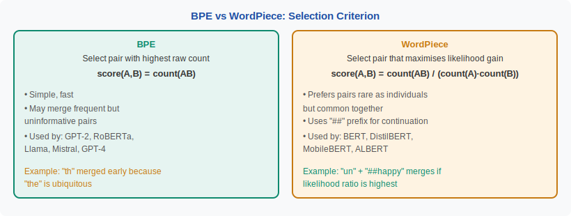
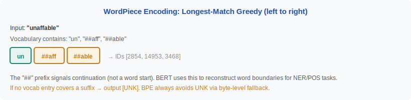

<!-- ============================ TOP NAV ============================ -->
<div align="center">

[🏠 Home](../../README.md) &nbsp;•&nbsp; [📚 Section 2 — Tokenization & Embeddings](./README.md) &nbsp;•&nbsp; [⬅️ Q2‑02 — BPE](./q02-bpe.md) &nbsp;•&nbsp; [Q2‑04 — Unigram LM ➡️](./q04-unigram-lm.md)

</div>

---

# Q2‑03 · How does WordPiece differ from BPE? What objective does it optimise and where is it used?

<div align="center">


</div>

> [!IMPORTANT]
> **The 20‑second answer.** WordPiece and BPE are both bottom-up merge algorithms, but they differ in **how they score pairs**. BPE merges the pair with the highest **raw count**. WordPiece merges the pair that maximises the **likelihood gain** — formally $\text{score}(A,B) = \frac{\text{count}(AB)}{\text{count}(A) \cdot \text{count}(B)}$. This ratio prefers pairs that are "surprising together" (rarely seen apart, often seen together), producing more linguistically meaningful merges. WordPiece also uses a `##` prefix for continuation pieces and can emit `[UNK]` when a sequence cannot be segmented — unlike byte-level BPE which is OOV-free. It is the tokenizer behind BERT and most encoder-only models.

---

## Table of contents

1. [First principles](#1--first-principles)
2. [The problem, told as a story](#2--the-problem-told-as-a-story)
3. [The selection criterion, precisely](#3--the-selection-criterion-precisely)
4. [The `##` continuation convention](#4--the--continuation-convention)
5. [Comparison table: BPE vs WordPiece](#5--comparison-table-bpe-vs-wordpiece)
6. [The encoding algorithm](#6--the-encoding-algorithm)
7. [Algorithm & pseudocode](#7--algorithm--pseudocode)
8. [Reference implementation](#8--reference-implementation)
9. [Worked example](#9--worked-example)
10. [Where it's used — and where it breaks](#10--where-its-used--and-where-it-breaks)
11. [Cousins & alternatives](#11--cousins--alternatives)
12. [Interview drill](#12--interview-drill)
13. [Common misconceptions](#13--common-misconceptions)
14. [One‑screen summary](#14--one-screen-summary)
15. [References](#15--references)

---

## 1 · First principles

Both BPE and WordPiece are **greedy bottom-up** algorithms: start with characters, merge pairs, stop when vocabulary reaches target size $V$. The difference is the **merge selection criterion**:

$$\text{BPE score}(A,B) = \text{count}(AB)$$

$$\text{WordPiece score}(A,B) = \frac{\text{count}(AB)}{\text{count}(A) \cdot \text{count}(B)} = \frac{P(AB)}{P(A)\,P(B)}$$

The WordPiece ratio is a **pointwise mutual information (PMI)**-like measure (with counts rather than probabilities in the denominator). High score means: A and B appear together **much more than expected if they were independent**. This selects pairs that form genuinely useful units, not just pairs that are common because their components are common.

> [!NOTE]
> **Plain-English version.** BPE: "merge the pair I see most often." WordPiece: "merge the pair that surprises me most when they appear together — the pair that is much more likely side-by-side than apart." The letter "t" is common and "h" is common, but "th" appears together far more than chance predicts — WordPiece would merge this early. "e" and "a" are both common but "ea" is not disproportionately frequent — WordPiece would defer this merge.

---

## 2 · The problem, told as a story

BPE's raw-count criterion has a subtle flaw: it can merge pairs simply because both components are very common, even if their combination carries no special meaning. For example, "e" and "s" are both frequent English characters, so BPE might merge them early even though "es" appears in many different morphological contexts ("tables", "loves", "buses").

WordPiece was designed to address this for **BERT's masked-language-modelling (MLM) objective**. In MLM, the model predicts masked tokens from context — it benefits from having tokens that carry coherent, recoverable meaning. A merge that pairs "un" (negation prefix) with "##happy" is genuinely informative: the model can learn the negation pattern. A merge that pairs "e" with "##d" (past tense) because both are frequent is noisier.

<div align="center">

<br><sub><b>Figure 1.</b> The only algorithmic difference between BPE and WordPiece is the merge score. Everything else — bottom-up, greedy, stop at V — is the same.</sub>
</div>

---

## 3 · The selection criterion, precisely

The WordPiece score is related to the **increase in training set log-likelihood** if we add the merged token:

$$\Delta\mathcal{L}(A,B) \approx \log P(AB) - \log P(A) - \log P(B) = \log \frac{P(AB)}{P(A)\,P(B)}$$

In practice, with count-based estimates $P(x) \approx \frac{\text{count}(x)}{N}$:

$$\text{score}(A,B) = \frac{\text{count}(AB)}{\text{count}(A) \cdot \text{count}(B)}$$

This is precisely the **likelihood gain** per merge — the merge that improves the unigram language model the most. Note that this is different from full EM (Unigram LM tokenizer), which optimizes the objective globally; WordPiece is still greedy.

---

## 4 · The `##` continuation convention

WordPiece marks all pieces that do **not** start a word with the prefix `##`:

| Surface word | WordPiece tokens |
|---|---|
| "tokenization" | `["token", "##ization"]` |
| "unhappiness" | `["un", "##happy", "##ness"]` |
| "playing" | `["play", "##ing"]` |

This prefix serves two purposes:
1. **Reconstruction** — strip `##` and concatenate to get back the original word.
2. **Task signals** — NER, POS, and span-extraction tasks need to know which tokens are word-initial vs continuation. The `##` prefix makes this trivial.

BERT's tokenizer always word-tokenizes first (split on whitespace and punctuation), then applies WordPiece within each word. The `##` is not present in BPE-based tokenizers (GPT-2 etc.) because BPE uses a leading space marker (`Ġ`) to signal word boundaries instead.

<div align="center">

<br><sub><b>Figure 2.</b> Encoding is longest-match-first (a form of greedy DP), left to right within each pre-tokenized word. The ## prefix marks all non-initial pieces.</sub>
</div>

---

## 5 · Comparison table: BPE vs WordPiece

| Property | BPE | WordPiece |
|---|---|---|
| **Merge score** | $\text{count}(AB)$ | $\frac{\text{count}(AB)}{\text{count}(A)\cdot\text{count}(B)}$ |
| **Objective** | Implicit (compression) | Explicit (log-likelihood gain) |
| **Base vocabulary** | Characters or bytes | Characters (Unicode) |
| **OOV handling** | Byte-level: never; char-level: rare | `[UNK]` possible |
| **Continuation marker** | Leading `Ġ` (word start) | `##` (continuation) |
| **Encoding algorithm** | Apply merge rules in order | Longest-match greedy DP |
| **Main users** | GPT-2/3/4, Llama, Mistral | BERT, DistilBERT, ALBERT, MobileBERT |
| **Vocab size** | 32K–128K | 30K (BERT) |
| **Training objective** | Causal LM (decoder-only) | MLM (encoder-only) |

---

## 6 · The encoding algorithm

WordPiece encoding at inference is **different from BPE encoding**. It uses a **longest-match-first greedy left-to-right scan** (equivalent to Viterbi on a unigram model):

1. Pre-tokenize: split on whitespace and punctuation.
2. For each word:
   a. Try to match the longest prefix that exists in vocabulary.
   b. Record that token (no `##` for the first piece, `##` for subsequent).
   c. Continue from the remainder.
   d. If no prefix matches → emit `[UNK]` for the entire word.
3. Return the token sequence.

This is $O(|w|^2)$ per word in the naive implementation but in practice $O(|w|)$ with trie-based lookup.

---

## 7 · Algorithm & pseudocode

```text
===== WORDPIECE TRAINING =====
INPUT : corpus (list of pre-tokenized words with counts), target vocab size V
OUTPUT: vocabulary, merge_scores

1.  vocab ← {char: count for char in all words}   # base character vocab
2.  WHILE |vocab| < V:
    a.  FOR each adjacent pair (A, B) in current word segmentations:
            score(A,B) ← count(AB) / (count(A) * count(B))
    b.  best_pair ← argmax score
    c.  new_token ← A + B  (drop ## if B starts with ##)
    d.  vocab.add(new_token)
    e.  update word segmentations: replace best_pair with new_token
3.  RETURN vocab

===== WORDPIECE ENCODING =====
INPUT : word string, vocabulary (set of valid tokens)
OUTPUT: list of token strings (with ## markers)

1.  tokens ← []
2.  i ← 0
3.  WHILE i < len(word):
    a.  j ← len(word)          # try longest suffix first
    b.  WHILE j > i:
            substr ← word[i:j]
            IF i > 0: substr ← "##" + substr
            IF substr IN vocab:
                tokens.append(substr)
                i ← j
                BREAK
            j ← j - 1
    c.  IF j == i:              # no prefix found at all
            RETURN ["[UNK]"]
4.  RETURN tokens
```

---

## 8 · Reference implementation

```python
from transformers import BertTokenizer

tok = BertTokenizer.from_pretrained("bert-base-uncased")

text = "Tokenization matters for every downstream task."
tokens = tok.tokenize(text)          # list of strings with ## markers
ids    = tok.encode(text)            # list of ints (includes [CLS], [SEP])
back   = tok.decode(ids)

print(tokens)
# ['token', '##ization', 'matters', 'for', 'every', 'downstream', 'task', '.']

# Inspect the ## convention
word = "antidisestablishmentarianism"
print(tok.tokenize(word))
# ['anti', '##dis', '##establishment', '##arian', '##ism']
```

> [!NOTE]
> BERT's tokenizer also lowercases text (for `bert-base-uncased`) and strips accents. The WordPiece algorithm itself is case-sensitive; lowercasing is a pre-processing choice, not part of WordPiece.

---

## 9 · Worked example

**Corpus** (toy, pre-tokenized by word):

```
"un" + "##happy"  freq 40
"un" + "##known"  freq 30
"happy"           freq 90
"##happy"         freq 40   (from compound words)
"##ness"          freq 50
"happiness"  →    "happy" + "##ness"  freq 20
```

BPE would merge `("happy", "##ness")` if `count("happy##ness") = 20` is the global maximum.

WordPiece computes:
- $\text{score}(\text{happy}, \text{\#\#ness}) = \frac{20}{90 \times 50} = 0.0044$
- $\text{score}(\text{un}, \text{\#\#happy}) = \frac{40}{70 \times 40} = 0.0143$

WordPiece **prefers** `(un, ##happy)` because "un" and "##happy" are rarely seen apart relative to how often they appear together. This correctly captures the prefix "un-" as a productive morphological unit.

---

## 10 · Where it's used — and where it breaks

**Adopted in:** BERT (Devlin et al., 2019), DistilBERT, ALBERT, MobileBERT, and essentially all encoder-only Transformer models.

**Where it breaks:**
- **Can emit `[UNK]`** — if a word contains a Unicode character not in the base vocabulary, the whole word becomes `[UNK]`. Byte-level BPE avoids this entirely.
- **Punctuation and special characters** — BERT's tokenizer aggressively splits punctuation, which can fragment code, math, and URLs.
- **Decoder-only models** — the `##` continuation convention is not used by GPT-style models; mixing BERT tokens with GPT tokens is not possible.
- **Long words with no known prefixes** — if even individual characters are absent from vocabulary, `[UNK]` is emitted.

---

## 11 · Cousins & alternatives

| Method | Score | Encoding | Users |
|---|---|---|---|
| **BPE** | count(AB) | Apply rules in order | GPT-*, Llama |
| **WordPiece** | count(AB)/(count(A)·count(B)) | Longest match DP | BERT family |
| **Unigram LM** | EM on corpus log-likelihood | Viterbi MAP | T5, mBART |
| **SentencePiece** | Wrapper; supports BPE + Unigram | Language-agnostic | T5, Llama, mT5 |

---

## 12 · Interview drill

<details>
<summary><b>Q: What is the exact formula and why does it relate to likelihood?</b></summary>

$\text{score}(A,B) = \frac{\text{count}(AB)}{\text{count}(A) \cdot \text{count}(B)}$. Under a unigram language model where $P(x) \propto \text{count}(x)$, this is proportional to $\frac{P(AB)}{P(A)P(B)}$ — the ratio of the joint probability to the product of marginals. Adding token $AB$ to the vocabulary increases the corpus log-likelihood by approximately $\text{count}(AB) \cdot \log\frac{P(AB)}{P(A)P(B)}$. The score is thus a proxy for the per-occurrence likelihood gain.
</details>

<details>
<summary><b>Q: Why does BERT use WordPiece instead of BPE?</b></summary>

BERT's original authors (Schuster & Nakamura 2012, then Devlin et al. 2019) inherited WordPiece from Google's internal NMT system where it was developed. The likelihood-based objective was seen as more principled for producing linguistically meaningful units, which matters for BERT's MLM pretraining — predicting masked tokens benefits from coherent piece boundaries.
</details>

<details>
<summary><b>Q: Can WordPiece produce UNK? When exactly?</b></summary>

Yes. If the encoding step reaches a suffix that has no prefix in the vocabulary at all (not even a single character), it returns `[UNK]` for the **entire input word** (not just the suffix). This happens for Unicode characters absent from the base vocabulary — e.g., rare CJK extensions, emoji composed from sequences, or novel script characters. Byte-level BPE avoids this because all 256 bytes are always in vocabulary.
</details>

<details>
<summary><b>Q: Does WordPiece guarantee the same tokenization as BPE for common English text?</b></summary>

Not in general. The two algorithms use different scoring, so their merge rule lists diverge. In practice, both produce similar tokenizations for common English words (frequent morphemes get merged by both), but differ for rare words, numbers, code, and non-English text.
</details>

---

## 13 · Common misconceptions

| ❌ Misconception | ✅ Reality |
|---|---|
| "WordPiece is just BPE with a different name." | They differ in selection criterion (count vs likelihood ratio) and encoding algorithm (rule-order vs longest-match). |
| "The `##` marker is part of the token's meaning." | It's a bookkeeping convention for word-boundary reconstruction — it carries no semantic information. |
| "WordPiece can't produce UNK." | It can — any Unicode char absent from base vocabulary causes UNK for that word. |
| "BERT uses the same tokenizer as GPT." | Completely different: WordPiece (encoder-only, `##`-prefixed, lowercased) vs byte-level BPE (decoder-only, `Ġ`-prefixed). |
| "WordPiece optimises a global objective." | It's still greedy — it picks the locally best merge at each step, not the globally optimal vocabulary. |

---

## 14 · One‑screen summary

> **What:** WordPiece is a bottom-up greedy subword tokenizer that merges the pair maximising $\frac{\text{count}(AB)}{\text{count}(A)\cdot\text{count}(B)}$ — a likelihood-ratio criterion — rather than BPE's raw count.
>
> **Problem solved:** Produces more linguistically coherent subword units than BPE by preferring pairs that are "surprisingly frequent" together, not just individually common.
>
> **Why it works:** The score approximates the log-likelihood gain from adding the merged token to a unigram LM — each merge is the one that most improves the model of the training corpus.
>
> **Caveats:** Can emit `[UNK]` (not byte-level safe), uses `##` continuation convention (encoder-only models), not used in GPT-style decoders.

---

## 15 · References

1. Schuster, M., Nakamura, K. — **Japanese and Korean Voice Search**. *ICASSP 2012.* — original WordPiece algorithm; designed for speech recognition.
2. Devlin, J., Chang, M.-W., Lee, K., Toutanova, K. — **BERT: Pre-training of Deep Bidirectional Transformers for Language Understanding**. *NAACL 2019 / arXiv:1810.04805.* — popularized WordPiece for NLP; 30K vocab, cased and uncased variants.
3. Sennrich, R., Haddow, B., Birch, A. — **Neural Machine Translation of Rare Words with Subword Units** (BPE). *ACL 2016 / arXiv:1508.07909.* — baseline for comparison.
4. Kudo, T., Richardson, J. — **SentencePiece**. *EMNLP 2018.* — unified framework; also supports WordPiece variant.
5. Rust, P. et al. — **How Good is Your Tokenizer?** *ACL 2021.* — evaluates BERT's WordPiece across 99 languages; exposes fertility disparities.
6. HuggingFace Tokenizers docs — `BertTokenizer` source — canonical WordPiece implementation.

---

<!-- ============================ BOTTOM NAV ============================ -->
<div align="center">

[⬅️ Q2‑02 — BPE](./q02-bpe.md) &nbsp;|&nbsp; [📚 Back to Section 2](./README.md) &nbsp;|&nbsp; [🏠 Home](../../README.md) &nbsp;|&nbsp; [Q2‑04 — Unigram LM ➡️](./q04-unigram-lm.md)

<sub>Found an error or have a sharper intuition? See <a href="../../CONTRIBUTING.md">CONTRIBUTING</a> — answers follow the <a href="../../_TEMPLATE.md">answer template</a>.</sub>

</div>
