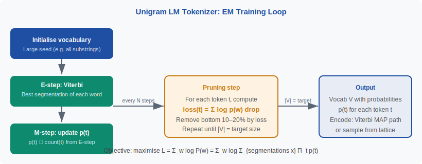

<!-- ============================ TOP NAV ============================ -->
<div align="center">

[🏠 Home](../../README.md) &nbsp;•&nbsp; [📚 Section 2 — Tokenization & Embeddings](./README.md) &nbsp;•&nbsp; [⬅️ Q2‑03 — WordPiece](./q03-wordpiece.md) &nbsp;•&nbsp; [Q2‑05 — Byte-level BPE ➡️](./q05-byte-level-bpe.md)

</div>

---

# Q2‑04 · What is the Unigram Language Model tokenizer, and how does it differ from BPE in the way it selects the vocabulary?

<div align="center">


</div>

> [!IMPORTANT]
> **The 20‑second answer.** The Unigram Language Model (ULM) tokenizer takes the **opposite direction from BPE**: it **starts with a large vocabulary** (all substrings up to length $L$) and **iteratively prunes** tokens whose removal reduces corpus log-likelihood the least. Encoding at inference uses **Viterbi search** to find the most probable segmentation under the learned unigram probabilities. The result is a globally-optimal vocabulary (EM-based, not greedy) that supports **stochastic segmentation** for data augmentation — unlike BPE, encoding is not deterministic. Used by T5, mBART, and XLNet via SentencePiece.

---

## Table of contents

1. [First principles](#1--first-principles)
2. [The problem, told as a story](#2--the-problem-told-as-a-story)
3. [The training algorithm: EM + pruning](#3--the-training-algorithm-em--pruning)
4. [The encoding algorithm: Viterbi](#4--the-encoding-algorithm-viterbi)
5. [BPE vs Unigram LM — side-by-side](#5--bpe-vs-unigram-lm--side-by-side)
6. [The stochastic encoding trick](#6--the-stochastic-encoding-trick)
7. [Algorithm & pseudocode](#7--algorithm--pseudocode)
8. [Reference implementation](#8--reference-implementation)
9. [Worked example](#9--worked-example)
10. [Where it's used — and where it breaks](#10--where-its-used--and-where-it-breaks)
11. [Cousins & alternatives](#11--cousins--alternatives)
12. [Interview drill](#12--interview-drill)
13. [Common misconceptions](#13--common-misconceptions)
14. [One‑screen summary](#14--one-screen-summary)
15. [References](#15--references)

---

## 1 · First principles

All tokenization algorithms must choose a vocabulary $\mathcal{V}$ from an enormous space of possible subword sets. The fundamental question is: **what criterion?**

- BPE: greedy, local — merge the most frequent pair at each step.
- WordPiece: greedy, local — merge the pair with the highest likelihood gain.
- **Unigram LM**: global — find the vocabulary $\mathcal{V}$ that **maximises the likelihood of the training corpus** under a unigram language model over tokens.

The unigram LM assigns probability to a segmentation $\mathbf{x} = (x_1, x_2, \ldots, x_m)$ of word $w$ as:

$$P(\mathbf{x}) = \prod_{i=1}^{m} p(x_i)$$

The corpus log-likelihood is:

$$\mathcal{L}(\mathcal{V}) = \sum_{w \in \text{corpus}} \log \sum_{\mathbf{x} \in \text{seg}(w)} P(\mathbf{x})$$

The vocabulary is chosen to maximise $\mathcal{L}$. This is an **EM problem** because the segmentation $\mathbf{x}$ is a latent variable.

> [!NOTE]
> **Plain-English version.** BPE asks "which pair should I glue together next?" Unigram LM asks a fundamentally different question: "given a vocabulary, how probable is the training text? Now find the vocabulary that makes the text most probable." This global criterion often finds better segmentations for morphologically rich languages.

---

## 2 · The problem, told as a story

BPE's greedy construction can be trapped by early bad decisions. If "th" is merged early (because "the" is frequent), the algorithm has committed — "th" is now a permanent token even if a different segmentation would produce higher overall likelihood.

Unigram LM avoids this by **not committing to a bottom-up order**. Instead, it considers the full space of segmentations via a probabilistic model, and uses EM to find probabilities that best explain the corpus. The EM loop naturally handles the "which segmentation?" question as a latent-variable problem: the E-step finds expected segmentation counts, the M-step updates token probabilities.

<div align="center">

<br><sub><b>Figure 1.</b> The Unigram LM training loop. EM handles the segmentation-probability chicken-and-egg; pruning shrinks the vocabulary to the target size.</sub>
</div>

---

## 3 · The training algorithm: EM + pruning

**Initialisation:** Seed vocabulary = all substrings of training words up to length $L$ (e.g. $L=16$). This gives a vocabulary of millions of candidates. Initialise uniform or frequency-based $p(t)$.

**E-step (Viterbi):** For each word, find the most probable segmentation:

$$\mathbf{x}^* = \arg\max_{\mathbf{x}} \prod_{i} p(x_i)$$

This is a shortest-path problem on a trellis and runs in $O(|w|^2)$ per word.

**M-step (reestimate):** Update token probabilities proportional to usage counts from the E-step:

$$p(t) \leftarrow \frac{\text{count}(t) + \alpha}{\sum_{t'} \text{count}(t') + \alpha}$$

**Pruning:** After every $K$ EM iterations, compute for each token $t$ the corpus log-likelihood loss from removing $t$ (i.e., how much does $\mathcal{L}$ drop if we force re-segmentation without $t$?). Remove the bottom $\eta$ % (typically 10–20%) of tokens by this loss measure.

**Stopping:** Repeat until $|\mathcal{V}| = V_{\text{target}}$.

---

## 4 · The encoding algorithm: Viterbi

At inference, encoding is also **Viterbi**: find the segmentation of maximum probability.

Define $\alpha[i]$ = max log-probability of a segmentation of $w[0:i]$:

$$\alpha[0] = 0$$
$$\alpha[j] = \max_{i < j,\; w[i:j] \in \mathcal{V}} \left(\alpha[i] + \log p(w[i:j])\right)$$

The segmentation is read by backtracking from $\alpha[|w|]$.

This is more powerful than BPE's rule-order greedy: it finds the **globally optimal** segmentation under the learned probabilities. Two words with the same characters can be tokenized differently if one appears in a context where a different segmentation is more probable.

---

## 5 · BPE vs Unigram LM — side-by-side

| Property | BPE | Unigram LM |
|---|---|---|
| **Direction** | Bottom-up (merge) | Top-down (prune) |
| **Selection** | Greedy, local (pair count) | EM-based, global (log-likelihood) |
| **Encoding** | Rule-order greedy | Viterbi MAP |
| **Determinism** | Yes (same text → same tokens) | Yes for MAP; No for sampled variant |
| **Stochastic training** | BPE-dropout (add-on) | Built-in (sample from lattice) |
| **Objective** | Compression (implicit) | Corpus log-likelihood (explicit) |
| **Implementation** | HuggingFace tokenizers, tiktoken | SentencePiece |
| **Main users** | GPT series, Llama | T5, mBART, XLNet, Llama (via SentencePiece BPE) |
| **OOV** | Byte-level: never | Very rare; fallback to character |

---

## 6 · The stochastic encoding trick

One of Unigram LM's advantages is **stochastic segmentation** (Kudo, 2018): instead of taking the Viterbi (MAP) segmentation, sample from the full distribution over segmentations:

$$P(\mathbf{x} | w) = \frac{P(\mathbf{x})}{\sum_{\mathbf{x}'} P(\mathbf{x}')}$$

This can be computed efficiently via the forward algorithm on the segmentation lattice. At training time, each word is randomly segmented differently on each epoch — a form of **subword regularization**. This:

- Makes the model robust to alternative segmentations of the same word.
- Improves low-resource NMT by 1–2 BLEU.
- Is analogous to dropout but applied to the tokenization layer.

BPE-dropout (Provilkov et al., 2020) provides a similar benefit for BPE, but it's an add-on; for Unigram LM it is native to the probabilistic framework.

---

## 7 · Algorithm & pseudocode

```text
===== UNIGRAM LM TRAINING =====
INPUT : corpus (words with frequencies), target vocab size V, prune rate η
OUTPUT: vocabulary V, probabilities p(t)

1.  vocab ← all substrings of training words up to length L
    p(t) ← uniform over vocab

2.  REPEAT until |vocab| = V:
    # E-step
    FOR each word w:
        x* ← Viterbi(w, vocab, p)    # best segmentation
        counts[t] += frequency(w) for each t in x*

    # M-step
    p(t) ← counts[t] / sum(counts)
    counts ← {}

    # Pruning (every K iterations)
    FOR each token t:
        loss(t) ← ΔL from removing t (re-segment corpus without t)
    REMOVE bottom η% of tokens by loss(t)

3.  RETURN vocab, p

===== UNIGRAM LM ENCODING (Viterbi) =====
INPUT : word w, vocab, p
OUTPUT: token sequence

1.  alpha[0] = 0
2.  FOR j = 1 to len(w):
        alpha[j] = -inf
        FOR i = 0 to j-1:
            IF w[i:j] IN vocab:
                score = alpha[i] + log(p(w[i:j]))
                IF score > alpha[j]:
                    alpha[j] = score
                    back[j] = i
3.  Backtrack from j = len(w) using back[] to recover token sequence
    RETURN tokens
```

---

## 8 · Reference implementation

```python
import sentencepiece as spm

# Training
spm.SentencePieceTrainer.train(
    input='corpus.txt',
    model_prefix='tokenizer',
    vocab_size=32000,
    model_type='unigram',   # <-- Unigram LM
    character_coverage=0.9995,
    pad_id=0, unk_id=1, bos_id=2, eos_id=3,
)

# Encoding
sp = spm.SentencePieceProcessor(model_file='tokenizer.model')

text = "unhappiness is complex"
ids  = sp.encode(text)                     # MAP (Viterbi) segmentation
pieces = sp.encode(text, out_type=str)     # string pieces

print(pieces)  # ['▁un', 'happiness', '▁is', '▁complex']
print(ids)     # [1037, 15231, 320, 4647]

# Stochastic sampling (for training data augmentation)
for _ in range(3):
    print(sp.sample_encode_as_pieces(text, nbest_size=-1, alpha=0.1))
# May produce: ['▁unhappiness', '▁is', '▁complex']
#              ['▁un', 'ha', 'ppi', 'ness', ...]
```

> [!NOTE]
> SentencePiece uses `▁` (U+2581) as a word-start marker (equivalent to BPE's `Ġ`). This is different from BERT's `##` continuation marker — it marks the **beginning** of a word-initial piece, not the continuation.

---

## 9 · Worked example

**Corpus:** `"low", "lower", "lowest", "new", "newer", "newest"` (with frequencies).

Suppose after EM the learned probabilities are (in log-space):
- $\log p(\text{"low"}) = -1.2$, $\log p(\text{"er"}) = -2.1$, $\log p(\text{"est"}) = -2.3$
- $\log p(\text{"e"}) = -3.5$, $\log p(\text{"r"}) = -4.0$

**Viterbi for "lower":**

| $j$ | Best segmentation of "lower"[0:j] | log-prob |
|---|---|---|
| 1 | "l" | −4.8 |
| 2 | "lo" | −3.9 |
| 3 | "low" | −1.2 |
| 4 | "low"+"e" | −4.7 |
| 5 | "low"+"er" | −3.3 ✓ |

Result: `["low", "er"]` — same as what BPE might produce, but arrived at via global optimisation rather than greedy merge history.

---

## 10 · Where it's used — and where it breaks

**Adopted by:** T5 (Raffel et al., 2020), mBART, XLNet, NLLB, and most Google production models via SentencePiece.

**Where it breaks:**
- **Computationally heavier training** — initializing from all substrings and running EM is slower than BPE for very large corpora.
- **Less predictable tokenization** — the same string can be tokenized differently in MAP vs sampled mode, which can surprise engineers debugging issues.
- **Integration complexity** — SentencePiece is a separate C++ library; HuggingFace tokenizers wraps it but not all models use it natively.

---

## 11 · Cousins & alternatives

| Method | Key distinction |
|---|---|
| **BPE** | Bottom-up, greedy, deterministic |
| **WordPiece** | Bottom-up, greedy, likelihood ratio |
| **Unigram LM** | Top-down, EM, global, stochastic |
| **Character** | No training needed; OOV-free; long sequences |
| **Byte-level** | Always OOV-free; sequences in bytes |

---

## 12 · Interview drill

<details>
<summary><b>Q: Why is the E-step called Viterbi? Isn't Viterbi for HMMs?</b></summary>

Viterbi is a general dynamic programming algorithm for finding the MAP path in any probabilistic graphical model with a lattice structure. The segmentation lattice (each node is a character position, each edge is a token $w[i:j]$) is structurally identical to an HMM trellis. The forward-backward algorithm can also be run to compute the full marginal distribution, enabling the stochastic sampling variant.
</details>

<details>
<summary><b>Q: What is the "loss" computed in the pruning step?</b></summary>

For each token $t$, the pruning loss is the decrease in corpus log-likelihood if we remove $t$ from the vocabulary and re-segment all words without it. Tokens with low loss are redundant — the corpus can be described almost as well without them. In practice, this requires re-running the Viterbi over all words for each candidate removal, so it is approximated or batched for efficiency.
</details>

<details>
<summary><b>Q: When would you prefer Unigram LM over BPE?</b></summary>

For **morphologically rich or agglutinative languages** (Finnish, Turkish, Swahili), for **multilingual models** where fair cross-lingual coverage matters, and for **training-time data augmentation** via stochastic segmentation. BPE is preferred for pure speed/simplicity or when working with existing BPE-trained models.
</details>

<details>
<summary><b>Q: Is Unigram LM always better than BPE?</b></summary>

Not always. On English-dominated benchmarks, the two are often comparable. Unigram LM tends to win on low-resource and morphologically rich languages. BPE is simpler to implement, faster to train, and the default choice in most production LLMs today.
</details>

---

## 13 · Common misconceptions

| ❌ Misconception | ✅ Reality |
|---|---|
| "Unigram LM is a type of language model, not a tokenizer." | It uses a unigram LM as its **scoring function**, but the output is a vocabulary — it is a tokenizer training algorithm. |
| "Unigram LM encoding is non-deterministic." | MAP (Viterbi) encoding is deterministic. Only the sampled variant (for data augmentation) is stochastic. |
| "SentencePiece = Unigram LM." | SentencePiece is an implementation that supports **both** BPE and Unigram LM; you choose via `model_type`. |
| "Unigram LM starts from scratch like BPE." | It starts with the **largest possible** seed vocabulary and prunes down — the opposite direction from BPE. |
| "The `▁` marker in SentencePiece is the same as `##` in BERT." | Opposite convention: `▁` marks a **word start**, `##` marks a **continuation**. |

---

## 14 · One‑screen summary

> **What:** Unigram LM tokenizer starts with all possible substrings and iteratively prunes to target vocabulary size $V$, using EM to fit token probabilities that maximise corpus log-likelihood.
>
> **Problem solved:** BPE's greedy merges make irrevocable local decisions. Unigram LM searches globally for the vocabulary that best explains the corpus, often producing better segmentations for morphologically complex languages.
>
> **Why it works:** The EM loop handles the chicken-and-egg of "which segmentation?" and "which probabilities?" simultaneously; pruning removes tokens whose absence changes likelihood the least.
>
> **Caveats:** Computationally heavier than BPE; stochastic encoding can surprise engineers; less commonly used than BPE in current open-source LLMs despite often being theoretically superior.

---

## 15 · References

1. Kudo, T. — **Subword Regularization: Improving Neural Network Translation Models with Multiple Subword Candidates**. *ACL 2018 / arXiv:1804.10959.* — original Unigram LM tokenizer paper; introduces stochastic sampling.
2. Kudo, T., Richardson, J. — **SentencePiece: A simple and language independent subword tokenizer and detokenizer for Neural Text Processing**. *EMNLP 2018 / arXiv:1808.06226.* — implementation paper; supports both BPE and Unigram LM.
3. Raffel, C. et al. — **Exploring the Limits of Transfer Learning with a Unified Text-to-Text Transformer (T5)**. *JMLR 2020 / arXiv:1910.10683.* — T5 uses SentencePiece Unigram LM with 32K vocab.
4. Liu, Y. et al. — **Multilingual Denoising Pre-training for Neural Machine Translation (mBART)**. *TACL 2020 / arXiv:2001.08210.* — mBART uses SentencePiece Unigram LM across 25 languages.
5. Provilkov, I., Emelianenko, D., Voita, E. — **BPE-Dropout**. *ACL 2020.* — adds stochastic segmentation to BPE, motivated by Unigram LM's native sampling.
6. Bostrom, K., Durrett, G. — **Byte Pair Encoding is Suboptimal for Language Model Pretraining**. *EMNLP Findings 2020.* — Unigram LM outperforms BPE for low-resource and morphologically rich languages.

---

<!-- ============================ BOTTOM NAV ============================ -->
<div align="center">

[⬅️ Q2‑03 — WordPiece](./q03-wordpiece.md) &nbsp;|&nbsp; [📚 Back to Section 2](./README.md) &nbsp;|&nbsp; [🏠 Home](../../README.md) &nbsp;|&nbsp; [Q2‑05 — Byte-level BPE ➡️](./q05-byte-level-bpe.md)

<sub>Found an error or have a sharper intuition? See <a href="../../CONTRIBUTING.md">CONTRIBUTING</a> — answers follow the <a href="../../_TEMPLATE.md">answer template</a>.</sub>

</div>
