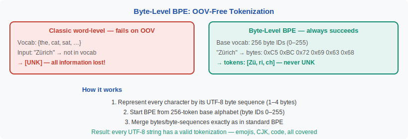

<!-- ============================ TOP NAV ============================ -->
<div align="center">

[🏠 Home](../../README.md) &nbsp;•&nbsp; [📚 Section 2 — Tokenization & Embeddings](./README.md) &nbsp;•&nbsp; [⬅️ Q2‑04 — Unigram LM](./q04-unigram-lm.md) &nbsp;•&nbsp; [Q2‑06 — Embedding Layer ➡️](./q06-embedding-layer.md)

</div>

---

# Q2‑05 · What is byte-level tokenization, and why do GPT-2 and Llama use it instead of character or word tokenization?

<div align="center">


</div>

> [!IMPORTANT]
> **The 20‑second answer.** Byte-level tokenization represents every character by its **UTF-8 byte sequence** (1–4 bytes), then applies BPE merges starting from those 256 base symbols. The key guarantee: every possible string — in any language, script, or encoding — can be represented without ever producing an `[UNK]` token, because every byte 0–255 is always in the vocabulary. GPT-2 and Llama use byte-level BPE to support arbitrary Unicode (emoji, CJK, code, math, non-Latin scripts) with a fixed vocabulary of 32K–128K entries, avoiding the OOV problem that plagued earlier word-level and even char-level models.

---

## Table of contents

1. [First principles](#1--first-principles)
2. [The problem, told as a story](#2--the-problem-told-as-a-story)
3. [The byte-level BPE mechanism](#3--the-byte-level-bpe-mechanism)
4. [UTF-8 and why 256 bytes are sufficient](#4--utf-8-and-why-256-bytes-are-sufficient)
5. [Comparison: char-level vs byte-level vs word-level](#5--comparison-char-level-vs-byte-level-vs-word-level)
6. [Vocabulary design in GPT-2 vs Llama 3](#6--vocabulary-design-in-gpt-2-vs-llama-3)
7. [Algorithm & pseudocode](#7--algorithm--pseudocode)
8. [Reference implementation](#8--reference-implementation)
9. [Worked example](#9--worked-example)
10. [Where it's used — and where it breaks](#10--where-its-used--and-where-it-breaks)
11. [Cousins & alternatives](#11--cousins--alternatives)
12. [Interview drill](#12--interview-drill)
13. [Common misconceptions](#13--common-misconceptions)
14. [One‑screen summary](#14--one-screen-summary)
15. [References](#15--references)

---

## 1 · First principles

Every character in any human language is encoded in UTF-8 as a sequence of 1–4 **bytes**. A byte is a value in $\{0, 1, \ldots, 255\}$. This means:

$$\text{Every string} = \text{sequence of bytes} \in \{0,\ldots,255\}^*$$

If we put all 256 byte values into our base vocabulary, **every string in existence is trivially representable** as a sequence of base tokens — even strings containing characters the tokenizer has never seen.

Byte-level BPE then runs standard BPE merge rules on top of this byte representation, building up longer, more efficient tokens for common byte sequences (e.g., the ASCII range used by English text merges into familiar words and subwords), while rare Unicode sequences stay as multi-byte sequences.

> [!NOTE]
> **Plain-English version.** Imagine a universal alphabet with only 256 symbols (the building blocks of every language's encoding). Any text in English, Chinese, Arabic, emoji, code, or Klingon can be expressed in these 256 symbols. Now apply BPE merges: common combinations get their own shorthand. You end up with a compact vocabulary where common English words are 1 token, but you can *always* represent anything — you're never stuck saying "I don't know this character."

---

## 2 · The problem, told as a story

GPT-2's predecessor models used character-level or word-level vocabularies. Character-level has a fatal problem: the vocabulary must enumerate all Unicode characters. Unicode has **149,000+** code points — and new emoji, scripts, and CJK extensions are added every year. A character-level model needs to explicitly list every character it can handle.

More importantly, what happens when the model encounters a character not in its training vocabulary? It must emit `[UNK]` — losing all information. A model trained on English Wikipedia has never seen "🫂" (people hugging, added to Unicode in 2020) and cannot handle it.

<div align="center">

<br><sub><b>Figure 1.</b> Byte-level BPE is guaranteed to tokenize any string. The UTF-8 byte representation is the universal fallback that makes OOV impossible.</sub>
</div>

---

## 3 · The byte-level BPE mechanism

**Step 1 — Unicode to UTF-8 bytes.** Every character maps to 1–4 bytes. For example:

| Character | Unicode | UTF-8 bytes (hex) |
|---|---|---|
| 'A' | U+0041 | 0x41 |
| 'é' | U+00E9 | 0xC3 0xA9 |
| '中' | U+4E2D | 0xE4 0xB8 0xAD |
| '🤖' | U+1F916 | 0xF0 0x9F 0xA4 0x96 |

**Step 2 — Base vocabulary = 256 byte IDs** (0–255, plus special tokens like `<|endoftext|>`).

**Step 3 — BPE merges on byte sequences.** The training corpus is represented as byte sequences, and BPE merges are applied exactly as in standard BPE. Common byte sequences (e.g., the bytes of "the", "ing", "tion") merge into single tokens.

**Result:** The final vocabulary has the 256 base bytes plus all merged tokens. Common English subwords get single tokens (efficient); rare Unicode characters stay as multi-byte sequences (correct but slightly less efficient).

---

## 4 · UTF-8 and why 256 bytes are sufficient

UTF-8 is a **variable-width** encoding:
- 1 byte: ASCII (U+0000–U+007F) — all English letters, digits, punctuation
- 2 bytes: Latin extended, Greek, Cyrillic, Arabic, Hebrew (U+0080–U+07FF)
- 3 bytes: most of CJK, emoji base (U+0800–U+FFFF)
- 4 bytes: emoji combinations, historic scripts (U+10000–U+10FFFF)

Because every byte value 0–255 is in the base vocabulary, any UTF-8 string can always be encoded — even characters added to Unicode after the tokenizer was trained. This is the key advantage over character-level tokenization.

GPT-2 uses a technical trick: it maps the 256 bytes to **printable Unicode characters** for display purposes (so the vocabulary shows `Ġ`, `Ċ`, etc. rather than raw byte values), but conceptually these are just byte IDs 0–255.

---

## 5 · Comparison: char-level vs byte-level vs word-level

| Property | Character-level | **Byte-level BPE** | Word-level |
|---|---|---|---|
| Base vocab | All Unicode chars (149K+) | **256 bytes** | All words (500K+) |
| OOV | Yes (new chars) | **Never** | Frequent |
| Sequence length | 5–6× vs word | **1× (baseline)** | 0.7–0.8× |
| Multi-script | Requires all char IDs | **Universal** | Language-specific |
| Emoji / new chars | Fails on post-training additions | **Always works** | Fails |
| Implementation | Simple | **Moderate** (byte mapping) | Simple |

---

## 6 · Vocabulary design in GPT-2 vs Llama 3

| Model | Vocab size | Tokenizer | Base |
|---|---|---|---|
| GPT-2 | 50,257 | Byte-level BPE | 256 bytes + merges |
| GPT-3 | 50,257 | Same as GPT-2 | 256 bytes + merges |
| GPT-4 (cl100k) | 100,256 | tiktoken BPE | 256 bytes + merges |
| GPT-4o (o200k) | 200,019 | tiktoken BPE | 256 bytes + merges |
| Llama 1/2 | 32,000 | SentencePiece BPE | Byte-level |
| Llama 3 | 128,000 | tiktoken BPE | Byte-level |

The trend is clear: vocabulary sizes are growing (32K → 128K → 200K) to give non-English languages more single-token coverage, reducing fertility penalties.

---

## 7 · Algorithm & pseudocode

```text
===== BYTE-LEVEL BPE TRAINING =====
INPUT : raw text corpus, target vocab size V
OUTPUT: merge_rules, vocab

1.  # Pre-tokenize with regex (split on whitespace/punctuation boundaries)
    words ← regex_split(corpus)

2.  # Represent each word as a sequence of byte IDs
    FOR each word w:
        byte_seq(w) ← utf8_bytes(w)   # list of ints in 0..255

3.  # Base vocabulary: 256 byte symbols
    vocab ← {byte_i: i for i in 0..255}

4.  # Standard BPE on byte sequences
    WHILE |vocab| < V:
        pair_counts ← count all adjacent byte pairs in corpus
        best_pair ← argmax pair_counts
        new_token ← concat(best_pair)
        vocab.add(new_token)
        merge_rules.append(best_pair)
        update all byte_seq(w) to merge best_pair

5.  RETURN merge_rules, vocab

===== ENCODING =====
INPUT : text string, merge_rules
OUTPUT: list of token IDs

1.  words ← regex_pre_tokenize(text)
2.  FOR each word w:
    a.  tokens ← list(utf8_bytes(w))    # bytes as base tokens
    b.  FOR rule (a, b) IN merge_rules IN ORDER:
            apply: wherever tokens[i]==a and tokens[i+1]==b, merge
    c.  output.extend(tokens)
3.  RETURN [vocab_id[t] for t in output]
```

---

## 8 · Reference implementation

```python
import tiktoken

# GPT-4 tokenizer (byte-level BPE via tiktoken)
enc = tiktoken.get_encoding("cl100k_base")

# English — efficient
text_en = "Hello, world! The quick brown fox."
ids_en = enc.encode(text_en)
print(f"English: {len(ids_en)} tokens for {len(text_en)} chars")

# Emoji — handled perfectly
text_emoji = "I love 🤖 and 🧠 and 🎉"
ids_emoji = enc.encode(text_emoji)
print(f"Emoji: {len(ids_emoji)} tokens for {len(text_emoji)} chars")
for tok in ids_emoji:
    print(f"  {tok:6d}  {enc.decode([tok])!r}")

# Chinese — works but higher fertility than English
text_zh = "今天天气很好"
ids_zh = enc.encode(text_zh)
print(f"Chinese: {len(ids_zh)} tokens for {len(text_zh)} chars")

# Demonstrate OOV-free: post-training Unicode
text_new = "Hello \U0001FAE8"    # 🫨 (shaking face, Unicode 14.0, 2021)
ids_new = enc.encode(text_new)
print(f"New emoji: {ids_new}")   # tokenizes as bytes — no UNK
```

> [!WARNING]
> The regex pre-tokenization pattern matters. GPT-4o changed the pattern from GPT-4's `cl100k_base`, adding support for merging across whitespace-adjacent number sequences differently. Using the wrong tokenizer for a model produces slightly different token counts — important for context-length and cost calculations.

---

## 9 · Worked example

**Word: "Zürich"** (Swiss city — contains non-ASCII 'ü')

**UTF-8 bytes:**
- 'Z' → `0x5A` (byte 90)
- 'ü' → `0xC3 0xBC` (bytes 195, 188)
- 'r' → `0x72` (byte 114)
- 'i' → `0x69` (byte 105)
- 'c' → `0x63` (byte 99)
- 'h' → `0x68` (byte 104)

**Byte sequence:** `[90, 195, 188, 114, 105, 99, 104]` — 7 base tokens.

**After BPE merges** (example rules in GPT-2 tokenizer):
1. `(195, 188)` → merged as `ü` (because 'ü' appears frequently in training)
2. `(90, ü-merged)` → possibly merged as `Zü`
3. `(114, 105)` → merged as `ri` (frequent in many languages)
4. `(99, 104)` → merged as `ch` (very frequent in English)

**Final tokens:** `["Zü", "ri", "ch"]` → 3 tokens. No `[UNK]`.

A character-level BERT tokenizer trained on English-only data would produce: `["Z", "[UNK]", "r", "i", "c", "h"]` — 'ü' becomes UNK, losing the umlaut entirely.

---

## 10 · Where it's used — and where it breaks

**Standard for all major open-weight LLMs:** GPT-2, GPT-3, GPT-4, Llama 1/2/3, Mistral, Falcon, Qwen, Gemma.

**Where byte-level BPE struggles:**
- **High fertility for rare scripts** — a rare character outside frequent ranges (e.g., Tibetan, Burmese) stays as multi-byte sequences (3–4 tokens per character), making those languages extremely expensive in context.
- **Emoji sequences** — complex emoji (family compositions, skin tones) are ZWJ sequences that can tokenize into dozens of byte tokens.
- **Sorting/comparison** — byte representations of characters do not sort alphabetically, so byte-level tokenizers do not support lexicographic ordering over tokens.

---

## 11 · Cousins & alternatives

| Method | OOV-free? | Mechanism | Users |
|---|---|---|---|
| **Byte-level BPE** | Yes (256 bytes always present) | BPE from byte base | GPT-2/4, Llama |
| **ByT5 / raw bytes** | Yes | Each byte is 1 token; no merging | ByT5, CANINE |
| **SentencePiece BPE** | Nearly (character fallback) | BPE + language-agnostic pre-tokenization | Llama 1/2, T5 |
| **Character-level** | No (new chars = UNK) | 1 token per Unicode codepoint | CANINE encoder |

---

## 12 · Interview drill

<details>
<summary><b>Q: If every byte is in the vocabulary, why is the sequence longer than character-level for Chinese text?</b></summary>

Because Chinese characters are 3 bytes each in UTF-8. If the tokenizer hasn't seen enough Chinese text to merge those 3-byte sequences into single tokens, a Chinese character stays as 3 base tokens. An English character is 1 byte = 1 base token, and common pairs merge further. The fertility disparity comes from the training data distribution, not from byte-level tokenization per se.
</details>

<details>
<summary><b>Q: What is the Ġ symbol in GPT-2's vocabulary?</b></summary>

GPT-2 maps the 256 raw byte values to printable Unicode characters for display. Byte 0x20 (space) is displayed as `Ġ` (a Unicode character that happens to be visually distinct). This is purely cosmetic — internally, `Ġ` represents the space byte. The GPT-2 paper calls this "byte-level BPE with a reversible vocabulary representation."
</details>

<details>
<summary><b>Q: Does byte-level BPE guarantee lossless round-trip (encode → decode = original)?</b></summary>

Yes — this is a design requirement. Every token maps to a unique byte sequence, and the union of byte sequences for all tokens in a tokenization equals the original UTF-8 encoding. Concatenating the decoded strings gives back the original text exactly. This losslessness is not guaranteed by character-level tokenizers that may normalize Unicode or strip diacritics.
</details>

<details>
<summary><b>Q: Why did Llama 3 jump from 32K to 128K vocabulary?</b></summary>

To improve multilingual efficiency. With 32K vocab, many non-Latin script characters tokenize as 3–4 bytes each, inflating sequence lengths 3–5× compared to English. A 128K vocabulary (tiktoken-based) has enough room to give common Chinese, Japanese, Korean, Arabic, and Hindi subwords their own merged tokens, reducing average fertility for those languages and making the 128K context window meaningfully longer in effective content for non-English users.
</details>

---

## 13 · Common misconceptions

| ❌ Misconception | ✅ Reality |
|---|---|
| "Byte-level BPE produces one token per byte." | Only for sequences where no merge rule fires. Common byte sequences are merged into single tokens. |
| "Character-level is the same as byte-level for ASCII text." | For pure ASCII, yes — each ASCII char is exactly 1 byte. For non-ASCII, they diverge immediately. |
| "Byte-level BPE supports all Unicode automatically." | It handles any byte sequence, but efficiency (fertility) for non-English varies with training data distribution. |
| "GPT-2 and BERT use the same tokenizer." | Completely different — GPT-2 uses byte-level BPE; BERT uses WordPiece, a character-level algorithm with UNK. |
| "Byte-level tokenization is slower." | The pre-tokenization (UTF-8 encoding) is O(n) and fast; encoding itself is similar speed to character-level BPE. |

---

## 14 · One‑screen summary

> **What:** Byte-level BPE represents every character as its UTF-8 bytes, then applies BPE merges starting from 256 base byte symbols.
>
> **Problem solved:** OOV (`[UNK]`) tokens — any string in any language or script is representable without modification or vocabulary extension.
>
> **Why it works:** UTF-8 decomposes all Unicode into 256 byte values; every possible string is a sequence of those values; BPE merges build up efficient multi-byte tokens for common patterns while the base bytes handle everything else.
>
> **Caveats:** Higher fertility (tokens per character) for scripts whose byte sequences are rare in training data; complex emoji tokenize as many byte tokens; vocabulary table grows with $V$.

---

## 15 · References

1. Radford, A., Wu, J., Child, R., Luan, D., Amodei, D., Sutskever, I. — **Language Models are Unsupervised Multitask Learners** (GPT-2). *OpenAI Technical Report, 2019.* — introduces byte-level BPE; Section 2.2 explains the byte vocabulary and reversible encoding.
2. Brown, T. et al. — **Language Models are Few-Shot Learners** (GPT-3). *NeurIPS 2020 / arXiv:2005.14165.* — continues byte-level BPE at 50K vocab.
3. Dubey, A. et al. — **The Llama 3 Herd of Models**. *arXiv:2407.21783.* — jumps to 128K tiktoken vocabulary; discusses multilingual fertility improvements.
4. Xue, L. et al. — **ByT5: Towards a Token-Free Future with Pre-trained Byte-to-Byte Models**. *TACL 2022 / arXiv:2105.13626.* — pushes byte-level to the extreme: no merges, raw bytes only; robustness benefits.
5. tiktoken GitHub — `cl100k_base` and `o200k_base` vocabulary files — byte-level BPE as used in GPT-4 and GPT-4o.
6. Unicode Consortium — **The Unicode Standard** — authoritative reference for UTF-8 encoding and code point assignments.

---

<!-- ============================ BOTTOM NAV ============================ -->
<div align="center">

[⬅️ Q2‑04 — Unigram LM](./q04-unigram-lm.md) &nbsp;|&nbsp; [📚 Back to Section 2](./README.md) &nbsp;|&nbsp; [🏠 Home](../../README.md) &nbsp;|&nbsp; [Q2‑06 — Embedding Layer ➡️](./q06-embedding-layer.md)

<sub>Found an error or have a sharper intuition? See <a href="../../CONTRIBUTING.md">CONTRIBUTING</a> — answers follow the <a href="../../_TEMPLATE.md">answer template</a>.</sub>

</div>
