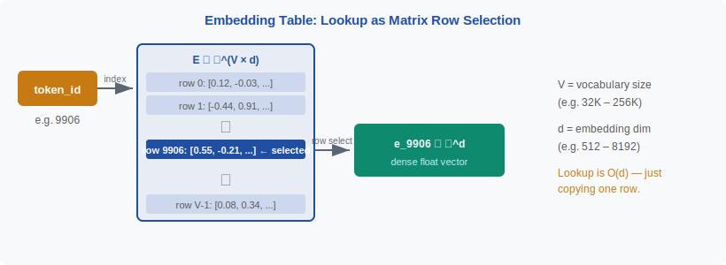

<!-- ============================ TOP NAV ============================ -->
<div align="center">

[🏠 Home](../../README.md) &nbsp;•&nbsp; [📚 Section 2 — Tokenization & Embeddings](./README.md) &nbsp;•&nbsp; [⬅️ Q2‑05 — Byte-level BPE](./q05-byte-level-bpe.md) &nbsp;•&nbsp; [Q2‑07 — Token Fertility ➡️](./q07-token-fertility.md)

</div>

---

# Q2‑06 · What is an embedding layer, and what is the relationship between vocabulary size, embedding dimension, and the first weight matrix of a Transformer?

<div align="center">


</div>

> [!IMPORTANT]
> **The 20‑second answer.** The embedding layer is a **trainable lookup table** $E \in \mathbb{R}^{V \times d}$ where $V$ is vocabulary size and $d$ is the model dimension. Given a token ID (an integer), the forward pass selects the corresponding row — a $d$-dimensional float vector. This is identical to multiplying a one-hot vector by $E$: $e_t = \mathbf{1}_t^\top E$. No matrix multiply happens at runtime — it's just a memory read. The same matrix (transposed) is often reused as the **output un-embedding** layer (weight tying), and its size $V \times d$ makes it the **single largest weight tensor** in small-vocabulary models.

---

## Table of contents

1. [First principles](#1--first-principles)
2. [The problem, told as a story](#2--the-problem-told-as-a-story)
3. [The mechanism, precisely](#3--the-mechanism-precisely)
4. [Memory and compute cost](#4--memory-and-compute-cost)
5. [The embedding–vocabulary–dimension relationship](#5--the-embeddingvocabularydimension-relationship)
6. [Weight tying](#6--weight-tying)
7. [Algorithm & pseudocode](#7--algorithm--pseudocode)
8. [Reference implementation](#8--reference-implementation)
9. [Worked example](#9--worked-example)
10. [Where it matters in practice](#10--where-it-matters-in-practice)
11. [Cousins & alternatives](#11--cousins--alternatives)
12. [Interview drill](#12--interview-drill)
13. [Common misconceptions](#13--common-misconceptions)
14. [One‑screen summary](#14--one-screen-summary)
15. [References](#15--references)

---

## 1 · First principles

Language models operate on **continuous vectors**, but text is **discrete tokens** (integers in $\{0, \ldots, V-1\}$). The embedding layer is the bridge: a function $f: \mathbb{Z} \to \mathbb{R}^d$ that maps each integer token ID to a dense float vector.

The natural way to define such a function is a lookup table (matrix):

$$E \in \mathbb{R}^{V \times d}, \qquad e_t = E[t, :] = E^\top \mathbf{1}_t$$

where $\mathbf{1}_t$ is the one-hot indicator for token $t$. This is the **embedding layer**.

> [!NOTE]
> **Plain-English version.** Think of the vocabulary as a dictionary with $V$ entries. Each word in the dictionary has a page of $d$ numbers describing what it "means" to the model. When you look up a word, you pull out its page. That's the embedding lookup — just a page-pull, not a calculation.

---

## 2 · The problem, told as a story

Early models used **one-hot encodings** to represent tokens: a vector of length $V$ with a 1 in position $t$ and 0s elsewhere. This has two fatal problems:

1. **Sparsity** — one-hot vectors are 99.997% zeros. Feeding them to a dense layer wastes computation.
2. **No semantic structure** — every pair of one-hot vectors has the same Euclidean distance ($\sqrt{2}$) and the same cosine similarity (0). The model cannot represent the fact that "cat" and "kitten" are semantically closer than "cat" and "airplane".

The embedding layer solves both: it maps discrete tokens into a **dense, continuous** space where **geometric relationships can encode semantic similarity** — learned end-to-end from training data.

<div align="center">

<br><sub><b>Figure 1.</b> The embedding lookup: token ID → row selection from E. The operation is $O(d)$ — a memory copy, not an arithmetic computation.</sub>
</div>

---

## 3 · The mechanism, precisely

**Forward pass** of an embedding layer for a sequence of $T$ tokens $[t_1, t_2, \ldots, t_T]$:

$$\text{Embed}(t_1, \ldots, t_T) = [E[t_1], E[t_2], \ldots, E[t_T]] \in \mathbb{R}^{T \times d}$$

Each $E[t_i]$ is a single row of $E$. This is implemented as a **strided memory gather** — no floating-point multiplications at all in the lookup phase.

**Backward pass** for a token $t$: only the $t$-th row of $E$ receives a gradient update. All other rows are unaffected. This is why embedding layers have **sparse gradients** — they require special optimizers (Adam with sparse updates, or embedding-specific techniques like Adafactor).

**Positional encoding** is added after the embedding lookup:

$$h_i = E[t_i] + \text{pos\_enc}(i) \in \mathbb{R}^d$$

For RoPE and ALiBi, the position information is injected at the attention layer rather than added to embeddings, but the lookup $E[t_i]$ is identical.

---

## 4 · Memory and compute cost

The embedding table has $V \times d$ parameters. For typical modern LLMs:

| Model | V | d | Embedding params | Memory (fp16) |
|---|---|---|---|---|
| BERT-base | 30,522 | 768 | 23M | 47 MB |
| GPT-2 medium | 50,257 | 1,024 | 51M | 103 MB |
| Llama 3 8B | 128,000 | 4,096 | 524M | 1,048 MB ≈ 1 GB |
| GPT-4 (est.) | 100,256 | 12,288 | 1,232M ≈ 1.2B | 2.5 GB |

For Llama 3 8B, the embedding table alone is **1 GB** — significant relative to the total model size of ~16 GB in fp16. This is why vocabulary size is a real cost axis, not just a quality knob.

**Compute:** The embedding lookup itself is $O(T \cdot d)$ — one row-copy per token. The output projection (un-embedding, $d \to V$) at each generation step is a full matrix-vector multiply: $O(V \cdot d)$ — this is the expensive output side.

---

## 5 · The embedding–vocabulary–dimension relationship

Three parameters are tightly coupled:

$$\underbrace{V}_{\text{vocabulary}} \times \underbrace{d}_{\text{model dim}} = \underbrace{N_{\text{emb}}}_{\text{embedding params}}$$

Scaling $V$ increases **breadth** (more distinct tokens, lower fertility, OOV protection) but increases memory linearly.

Scaling $d$ increases **depth** (richer representations per token) but also increases every attention weight matrix, every FFN layer, and every projection — the cost propagates through the whole model.

For a fixed parameter budget, there is an optimal $(V, d)$ tradeoff. Empirically, most LLMs use:

$$d \approx 64 \cdot \text{n\_heads}, \qquad V \approx 32\text{K} \text{ to } 128\text{K}$$

with the embedding table representing 5–15% of total parameters.

> [!NOTE]
> **Factored embeddings:** ALBERT (Lan et al., 2020) uses **factored embeddings**: project from a small embedding dim $e \ll d$ to the model dim $d$ via a low-rank matrix, reducing embedding parameters from $V \times d$ to $V \times e + e \times d$. This decouples vocabulary coverage from model width.

---

## 6 · Weight tying

In many LLMs the **output un-embedding matrix** $W_U \in \mathbb{R}^{d \times V}$ (which projects the final hidden state to logits over the vocabulary) is set equal to $E^\top$:

$$\text{logits} = h \cdot E^\top \in \mathbb{R}^V$$

This is called **weight tying** (Press & Wolf, 2017). Benefits:

- **Halves the embedding parameter count** — the largest weight matrix appears once instead of twice.
- **Semantic consistency** — the same geometry that distinguishes tokens as inputs also distinguishes them as outputs.

Tradeoffs: the embedding dimension and the model's last hidden dimension must match exactly. BERT, GPT-2, and Llama all use weight tying. (See also Q2‑12 for a deeper treatment.)

---

## 7 · Algorithm & pseudocode

```text
INPUT : token_ids  [T]           # integer list, each in 0..V-1
        E          [V, d]        # embedding matrix (learned)
        pos_enc    function or matrix
OUTPUT: hidden_states [T, d]

===== FORWARD =====
1.  FOR i = 0 to T-1:
        embeddings[i] = E[token_ids[i]]     # row lookup: O(d)
2.  hidden_states = embeddings + pos_enc(0..T-1)
    RETURN hidden_states

===== BACKWARD =====
1.  gradient flows through hidden_states → embeddings
2.  FOR i = 0 to T-1:
        grad_E[token_ids[i]] += grad_embeddings[i]  # sparse accumulate
3.  Only touched rows of E receive gradient updates

===== OUTPUT PROJECTION (un-embedding) =====
1.  logits = hidden_state_last @ E.T    # [d] @ [d, V] = [V]
    (if weight-tied; else logits = hidden_state_last @ W_U)
2.  probabilities = softmax(logits)
```

---

## 8 · Reference implementation

```python
import torch
import torch.nn as nn

class EmbeddingLayer(nn.Module):
    def __init__(self, vocab_size: int, d_model: int, pad_id: int = 0):
        super().__init__()
        self.embed = nn.Embedding(vocab_size, d_model, padding_idx=pad_id)
        # initialisation: std = 1/sqrt(d_model) is a common choice
        nn.init.normal_(self.embed.weight, mean=0.0, std=d_model ** -0.5)
        # zero out the pad embedding so padding tokens contribute nothing
        self.embed.weight.data[pad_id].zero_()

    def forward(self, token_ids: torch.Tensor) -> torch.Tensor:
        # token_ids: [batch, seq_len]  →  output: [batch, seq_len, d_model]
        return self.embed(token_ids)


# Weight tying: share the embedding matrix with the output projection
class SimpleTransformerLM(nn.Module):
    def __init__(self, vocab_size, d_model, n_layers):
        super().__init__()
        self.embed = nn.Embedding(vocab_size, d_model)
        self.transformer = nn.TransformerEncoder(
            nn.TransformerEncoderLayer(d_model, nhead=8, batch_first=True),
            num_layers=n_layers,
        )
        # Weight tying: output projection reuses the embedding weights
        self.lm_head = lambda h: h @ self.embed.weight.T  # [B, T, V]

    def forward(self, token_ids):
        h = self.embed(token_ids)
        h = self.transformer(h)
        return self.lm_head(h)   # logits over vocab
```

> [!WARNING]
> `nn.Embedding` by default initialises with `Normal(0, 1)`. For large $d$ this can cause the initial logits (which are dot products of embedding vectors) to be $O(\sqrt{d})$ — too large for the first few training steps. A safer init is `Normal(0, 1/sqrt(d))` or the GPT-2 convention `Normal(0, 0.02)` regardless of $d$.

---

## 9 · Worked example

**Setup:** $V = 50{,}000$, $d = 512$. Token ID for "hello" = 15496.

**Embedding table size:** $50{,}000 \times 512 = 25{,}600{,}000$ parameters = 25.6M.

**Memory in fp32:** $25.6\text{M} \times 4 \text{ bytes} = 102.4 \text{ MB}$.

**Forward pass:** `E[15496]` = a vector of 512 floats. This is a **single cache-line read** (for small $d$) or a short DMA transfer. No multiplications.

**Backward pass:** Only row 15496 gets a gradient. In a batch of 512 tokens from vocabulary of 50K, roughly 512 rows receive gradients — only 1% of the table, hence the "sparse gradient" characterization.

**After training:** Visualizing the embedding space via t-SNE often shows semantic clusters: months cluster together, numbers cluster, countries cluster, etc. — geometry emerges purely from predicting next tokens.

---

## 10 · Where it matters in practice

- **Memory budget** — the embedding table is often the largest or second-largest tensor; for 128K vocab and $d=8192$ (Llama 3 70B) it's $\sim$2 GB in fp16.
- **Vocabulary expansion** — adding new tokens (domain vocabulary, new language) requires extending $E$ with new rows, which must be initialized carefully (see Q2‑29).
- **Distributed training** — the embedding table is often **tensor-parallelized** across GPUs (each GPU holds a slice of rows), requiring all-gather on the backward pass.
- **Quantization** — embeddings can be quantized to int8 or fp8, saving memory with minimal quality loss (unlike attention weights which are more sensitive).

---

## 11 · Cousins & alternatives

| Approach | Mechanism | When used |
|---|---|---|
| **One-hot** | Sparse $V$-dim vector | Never in production — too large |
| **Learned embedding (standard)** | Dense lookup table $V \times d$ | All modern LLMs |
| **Factored embedding (ALBERT)** | Low-rank: $V \times e$, $e \times d$ | When $V \gg d$ and parameter budget is tight |
| **Char CNN embeddings** | CNN over character IDs → token embedding | ELMo, old NMT; not in modern LLMs |
| **Hash embedding** | Multiple hash functions → sum | Memory-efficient but collisions |
| **Byte embedding (ByT5)** | 256-dim lookup for each byte | Byte-level models |

---

## 12 · Interview drill

<details>
<summary><b>Q: Why is the embedding lookup not a matrix multiply?</b></summary>

Mathematically it is: $e_t = \mathbf{1}_t^\top E$ where $\mathbf{1}_t$ is one-hot. But a one-hot vector has exactly one non-zero entry, so the multiply reduces to selecting one row of $E$ — no floating-point operations needed. Frameworks implement this as a gather/index operation, which is fundamentally a memory access pattern, not arithmetic.
</details>

<details>
<summary><b>Q: Why do embedding gradients need special handling in optimizers?</b></summary>

In a typical batch, only a small fraction of the $V$ vocabulary rows receive gradient updates. Standard Adam maintains per-parameter moment estimates for all $V \times d$ parameters, updating them every step even for rows that received zero gradient. This wastes memory and compute. Solutions: (1) **sparse Adam** updates only the touched rows, (2) **Adafactor** uses factored second moments, (3) **gradient accumulation** or **BF16** reduce the memory pressure.
</details>

<details>
<summary><b>Q: What is the embedding dimension and how do you choose it?</b></summary>

The embedding dimension $d$ is the model's hidden size — the width of the residual stream that flows through all layers. It is chosen based on total parameter budget and target model capability. Larger $d$ allows richer token representations but scales $O(d^2)$ in attention (the $W_Q, W_K, W_V, W_O$ projections are each $d \times d$). Typical values: 768 (BERT-base), 1024 (GPT-2 medium), 4096 (Llama 2 7B), 8192 (Llama 3 70B).
</details>

<details>
<summary><b>Q: What happens geometrically after training — what does the embedding space look like?</b></summary>

Training by next-token prediction (or MLM) pushes tokens that appear in similar contexts to have similar embeddings. This produces the famous semantic geometry: "king" − "man" + "woman" ≈ "queen" (Mikolov et al., 2013). Synonyms cluster, antonyms are nearby but offset, months form a ring, numbers form a roughly linear sequence. This structure is not designed — it emerges from the distributional hypothesis: tokens that appear in similar contexts share meaning.
</details>

---

## 13 · Common misconceptions

| ❌ Misconception | ✅ Reality |
|---|---|
| "The embedding lookup is a matrix multiply." | It reduces to a row selection — no FLOPs for the forward pass, only memory bandwidth. |
| "All embedding rows are updated every step." | Only rows corresponding to tokens in the current batch receive gradient updates — sparse gradients. |
| "Larger $d$ always gives better embeddings." | Bigger $d$ expands the model everywhere (not just embeddings) and hits diminishing returns; optimal $d$ depends on data size and task. |
| "The embedding layer is separate from the model." | It's the model's first weight matrix; its rows are learned jointly with everything else during pretraining. |
| "You can freely change $d$ without retraining." | Changing $d$ changes the shape of every weight matrix in the model — requires full retraining from scratch. |

---

## 14 · One‑screen summary

> **What:** The embedding layer is a trainable lookup table $E \in \mathbb{R}^{V \times d}$ mapping discrete token IDs to dense float vectors.
>
> **Problem solved:** Bridging discrete tokens and continuous neural network computation; enabling geometric semantic relationships to be learned from co-occurrence statistics.
>
> **Why it works:** Row selection is $O(d)$ — efficient; the dense continuous space allows gradient-based learning of semantic geometry; weight tying reuses the same matrix for output projection.
>
> **Key relationships:** $N_{\text{emb}} = V \times d$; memory scales linearly with both $V$ and $d$; the embedding table is often the largest single tensor for models with large vocabularies.

---

## 15 · References

1. Mikolov, T. et al. — **Distributed Representations of Words and Phrases** (word2vec). *NeurIPS 2013 / arXiv:1310.4546.* — demonstrates that embedding geometry captures semantic relationships; "king − man + woman ≈ queen."
2. Devlin, J. et al. — **BERT**. *NAACL 2019.* — 30K WordPiece vocab, $d=768$, embedding + position embedding design.
3. Press, O., Wolf, L. — **Using the Output Embedding to Improve Language Models** (weight tying). *EACL 2017 / arXiv:1608.05859.* — shows weight tying reduces parameters and improves perplexity.
4. Lan, Z. et al. — **ALBERT: A Lite BERT for Self-supervised Learning of Language Representations**. *ICLR 2020 / arXiv:1909.11942.* — factored embeddings to decouple vocabulary coverage from model width.
5. Radford, A. et al. — **GPT-2** (2019) — embedding init convention `Normal(0, 0.02)` and architecture details.
6. Vaswani, A. et al. — **Attention Is All You Need**. *NeurIPS 2017 / arXiv:1706.03762.* — original Transformer; Section 3.4 describes embedding scaling by $\sqrt{d_{\text{model}}}$.

---

<!-- ============================ BOTTOM NAV ============================ -->
<div align="center">

[⬅️ Q2‑05 — Byte-level BPE](./q05-byte-level-bpe.md) &nbsp;|&nbsp; [📚 Back to Section 2](./README.md) &nbsp;|&nbsp; [🏠 Home](../../README.md) &nbsp;|&nbsp; [Q2‑07 — Token Fertility ➡️](./q07-token-fertility.md)

<sub>Found an error or have a sharper intuition? See <a href="../../CONTRIBUTING.md">CONTRIBUTING</a> — answers follow the <a href="../../_TEMPLATE.md">answer template</a>.</sub>

</div>
