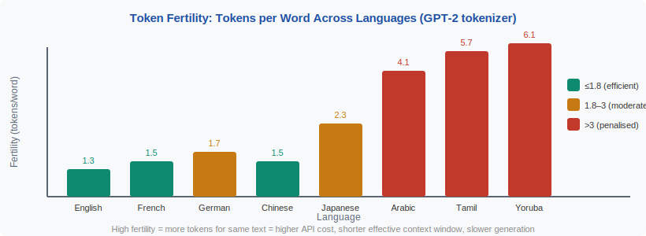

<!-- ============================ TOP NAV ============================ -->
<div align="center">

[🏠 Home](../../README.md) &nbsp;•&nbsp; [📚 Section 2 — Tokenization & Embeddings](./README.md) &nbsp;•&nbsp; [⬅️ Q2‑06 — Embedding Layer](./q06-embedding-layer.md) &nbsp;•&nbsp; [📚 Back to Section 2 ➡️](./README.md)

</div>

---

# Q2‑07 · What is token fertility, and why does it matter for multilingual models, cost estimation, and cross-lingual fairness?

<div align="center">


</div>

> [!IMPORTANT]
> **The 20‑second answer.** **Token fertility** is the number of tokens produced per word (or per character) by a tokenizer. A tokenizer trained predominantly on English assigns low fertility (≈1.3 tokens/word) to English text but high fertility (4–8 tokens/word) to low-resource languages like Tamil or Yoruba. This matters in three ways: (1) **cost** — APIs charge per token, so users of high-fertility languages pay more for the same amount of content; (2) **effective context** — a 128K-token window fits far fewer words for high-fertility languages; (3) **quality** — models see fewer "training examples" per character for high-fertility languages, implicitly biasing pretraining data toward English.

---

## Table of contents

1. [First principles](#1--first-principles)
2. [The problem, told as a story](#2--the-problem-told-as-a-story)
3. [Why fertility varies across languages](#3--why-fertility-varies-across-languages)
4. [Fertility and the training data imbalance](#4--fertility-and-the-training-data-imbalance)
5. [Cost and context window implications](#5--cost-and-context-window-implications)
6. [Comparison across tokenizers](#6--comparison-across-tokenizers)
7. [Algorithm & pseudocode](#7--algorithm--pseudocode)
8. [Reference implementation](#8--reference-implementation)
9. [Worked example](#9--worked-example)
10. [Where it matters in practice](#10--where-it-matters-in-practice)
11. [Cousins & alternatives](#11--cousins--alternatives)
12. [Interview drill](#12--interview-drill)
13. [Common misconceptions](#13--common-misconceptions)
14. [One‑screen summary](#14--one-screen-summary)
15. [References](#15--references)

---

## 1 · First principles

Token fertility is defined as:

$$\text{fertility}(w) = \frac{\text{number of tokens}(w)}{\text{number of words in } w}$$

or equivalently (at character granularity):

$$\text{fertility\_char}(w) = \frac{\text{number of tokens}(w)}{\text{number of characters in } w}$$

A fertility of 1.0 means every word is exactly one token (perfect for the tokenizer's training language). Higher fertility means more tokens per word — the tokenizer is less efficient for that language.

Fertility is not a property of a language in isolation — it is a property of the **pair (language, tokenizer)**. A tokenizer trained on Finnish text would have low fertility for Finnish and high fertility for English (relatively).

> [!NOTE]
> **Plain-English version.** Imagine a shorthand system invented by an English speaker. English words get compact shorthands: "the" = one symbol. But a Chinese sentence has to be spelled out symbol by symbol because the shorthand inventor never bothered to create compact forms for Chinese. Token fertility measures exactly how much this "it was designed for someone else" penalty costs you.

---

## 2 · The problem, told as a story

OpenAI's GPT-2 tokenizer was trained almost exclusively on English web text. When GPT-3 became available via API, researchers (Ahia et al., 2023) measured a striking disparity:

> Sending the same *content* (same information, same word count) in Yoruba costs **7.8×** more tokens — and therefore **7.8×** more API cost — than sending it in English.

For a Yoruba-speaking journalist using a GPT API to summarize news, every API call costs nearly 8× more than for an English speaker doing the same task. This is not a pricing choice — it follows directly from the tokenizer's training data distribution.

<div align="center">

<br><sub><b>Figure 1.</b> Token fertility across languages with the GPT-2 tokenizer. Languages underrepresented in the training corpus tokenize far less efficiently — every token is money and context.</sub>
</div>

---

## 3 · Why fertility varies across languages

The root cause is the **BPE merge priority**. BPE merges the most frequent byte/character pairs first. A tokenizer trained on 90% English web text performs thousands of merges on English subwords before it learns anything about Arabic or Tamil.

Three linguistic factors amplify fertility for certain languages:

**Factor 1 — Script type.** Latin-script languages use the same 26 base characters as English, so merges naturally cross language boundaries. Arabic, Tamil, Devanagari, and CJK have entirely separate character ranges — each requires separate merges to build efficient subwords.

**Factor 2 — Morphology.** Agglutinative languages (Turkish, Finnish, Tamil) build long words from stacked morphemes. A word like Turkish "kitaplarınızdaki" (literally "in your books") is one word but 20+ characters. Without enough training data to merge all the common morpheme combinations, it stays fragmented.

**Factor 3 — Byte vs character encoding.** CJK characters are 3 bytes each in UTF-8. Byte-level BPE must first merge bytes before building character-level representations — requiring 3× the merges per character compared to ASCII.

---

## 4 · Fertility and the training data imbalance

High fertility creates a **stealth training data imbalance**. Suppose a corpus has 1T tokens across 100 languages, allocated proportionally to web data (English ~40%, rest ~60%). But now consider that a language with 4× the fertility needs 4× as many tokens to represent the same amount of content.

Equivalently: for the same number of tokens, English gets 4× as many words, 4× as many semantic units, 4× as many training signal events.

This means that even if token counts are balanced across languages, **information density per token** is far lower for high-fertility languages. Models trained this way systematically underperform on those languages — not from intent, but from the arithmetic of tokenization.

---

## 5 · Cost and context window implications

**API cost:** Most LLM APIs charge per input + output token. Higher fertility = more tokens for the same content = higher cost.

$$\text{cost ratio}(L_1, L_2) = \frac{\text{fertility}(L_1)}{\text{fertility}(L_2)}$$

For Tamil vs English with GPT-2's tokenizer: $5.7 / 1.3 \approx 4.4\times$ more expensive per word.

**Context window:** A 128K-token context window with fertility 1.3 (English) holds approximately:
$$\frac{128{,}000}{1.3} \approx 98{,}000 \text{ words}$$

The same 128K tokens for Tamil (fertility 5.7):
$$\frac{128{,}000}{5.7} \approx 22{,}500 \text{ words}$$

The effective context window for Tamil is **4.4× shorter** in word count. For applications like long-document summarization, this is a significant capability disparity.

---

## 6 · Comparison across tokenizers

| Language | GPT-2 (50K) | cl100k / GPT-4 (100K) | Llama 3 (128K) |
|---|---|---|---|
| English | ~1.3 | ~1.3 | ~1.2 |
| French | ~1.8 | ~1.6 | ~1.5 |
| German | ~2.0 | ~1.7 | ~1.5 |
| Chinese | ~1.5 | ~1.3 | ~1.2 |
| Arabic | ~4.1 | ~2.5 | ~2.0 |
| Tamil | ~5.7 | ~4.0 | ~3.2 |
| Yoruba | ~6.1 | ~4.5 | ~3.8 |

Larger vocabularies consistently reduce fertility for under-represented languages by giving their frequent subwords their own tokens. Llama 3's jump from 32K to 128K was explicitly motivated by this — the team measured fertility improvements across dozens of languages before committing to the larger vocabulary.

---

## 7 · Algorithm & pseudocode

```text
===== COMPUTE FERTILITY =====
INPUT : text in language L
        tokenizer T
OUTPUT: fertility score (tokens per word)

1.  words ← whitespace_split(text)        # simple word count
2.  tokens ← T.encode(text)              # tokenizer output
3.  fertility ← len(tokens) / len(words)
    RETURN fertility

===== COMPARE TOKENIZERS =====
INPUT : text corpus C (same content in N languages)
        tokenizer T
OUTPUT: fertility_report dict

1.  FOR each language L in languages:
        fertility_report[L] = compute_fertility(C[L], T)
2.  reference = fertility_report["en"]    # English baseline
3.  FOR each language L:
        relative_cost[L] = fertility_report[L] / reference
4.  RETURN fertility_report, relative_cost
```

---

## 8 · Reference implementation

```python
from transformers import AutoTokenizer

def compute_fertility(text: str, model_name: str) -> dict:
    """Compute token fertility (tokens per word) for a given text."""
    tok = AutoTokenizer.from_pretrained(model_name)
    words = text.split()                        # simple whitespace split
    tokens = tok.encode(text, add_special_tokens=False)
    chars = len(text.replace(" ", ""))
    return {
        "words": len(words),
        "tokens": len(tokens),
        "chars": chars,
        "tokens_per_word": len(tokens) / max(len(words), 1),
        "tokens_per_char": len(tokens) / max(chars, 1),
    }

# Demonstrate disparity
samples = {
    "English": "The quick brown fox jumps over the lazy dog",
    "Tamil":   "விரைவான பழுப்பு நிற நரி சோம்பேறி நாயின் மீது குதிக்கிறது",
    "Arabic":  "الثعلب البني السريع يقفز فوق الكلب الكسول",
    "Yoruba":  "Kọnkọnkọn brown fox fo lori aja ọlẹ",
}

for lang, text in samples.items():
    result = compute_fertility(text, "gpt2")
    print(f"{lang:10s}: {result['tokens_per_word']:.1f} tokens/word")

# Expected (approximate):
# English   : 1.3 tokens/word
# Tamil     : 5.7 tokens/word
# Arabic    : 4.1 tokens/word
# Yoruba    : 6.1 tokens/word
```

> [!NOTE]
> The exact fertility depends on the specific text — technical text and colloquial text in the same language can have different fertility. Use a representative corpus (at least 10K words) for meaningful comparisons.

---

## 9 · Worked example

**Same content in two languages** (approximate parallel translations):

*"The agreement was signed in the capital city on Monday."*

| Language | Text (approx) | Words | Tokens (GPT-2) | Fertility |
|---|---|---|---|---|
| English | "The agreement was signed..." | 10 | 13 | **1.3** |
| Arabic | "وقّعت الاتفاقية في العاصمة يوم الاثنين" | 7 | 29 | **4.1** |
| Tamil | "திங்கட்கிழமை தலைநகரில் ஒப்பந்தம் கையெழுத்திடப்பட்டது" | 4 | 23 | **5.8** |

The Arabic and Tamil expressions are more concise in word count — but tokenize into far more tokens. The API sees the Tamil as 1.8× more expensive than Arabic, and 4.5× more expensive than English, for semantically equivalent content.

---

## 10 · Where it matters in practice

- **API pricing equity** — users of high-fertility languages pay more for equal service; some providers now offer language-adjusted pricing.
- **RAG chunking** — if chunks are sized by token count, high-fertility languages get shorter chunks in words, potentially cutting off important context.
- **Fine-tuning data budgets** — a 1M-token fine-tuning budget buys far fewer linguistic examples for Tamil than English.
- **Streaming latency** — with higher fertility, more model steps are needed per word, increasing time-to-first-word for high-fertility languages.
- **Tokenizer selection for multilingual products** — always measure fertility across your target languages before choosing a tokenizer; a 128K vocab may be necessary for fair multilingual coverage.

---

## 11 · Cousins & alternatives

| Metric | What it measures | Related to fertility |
|---|---|---|
| **Fertility** (tokens/word) | Tokenizer efficiency per word | Direct |
| **Bits per token** | Information density per token | Inverse relationship with fertility |
| **BLEU/chrF** | Translation quality | Affected by fertility via sequence length |
| **Character-level fertility** | Tokens per character | More language-agnostic baseline |
| **Vocabulary coverage** | % of text covered by top-N tokens | Alternative efficiency proxy |

---

## 12 · Interview drill

<details>
<summary><b>Q: How does high fertility affect model quality, not just cost?</b></summary>

High fertility reduces the effective amount of training signal per word. With a fixed token budget, a model trained on Arabic text (fertility 4×) sees 4× fewer Arabic words than English words. The model develops weaker representations for high-fertility languages — not from a design decision, but from the arithmetic of how tokenization allocates the training signal. Rust et al. (2021) showed empirically that fertility is strongly predictive of downstream monolingual task performance for each language.
</details>

<details>
<summary><b>Q: How can you fix high fertility without retraining the full model?</b></summary>

Three approaches: (1) **Expand the vocabulary** — add language-specific tokens and fine-tune the embedding and output layers; (2) **Use a language-specific tokenizer** — a separate model per language with its own optimized tokenizer; (3) **Vocabulary transfer** — initialize new token embeddings from character compositions and fine-tune. None of these is free — all require at least embedding-layer retraining and ideally continued pretraining on the target language. See Q2‑29 for details on vocabulary expansion.
</details>

<details>
<summary><b>Q: Is character-level fertility (tokens/char) a better metric than word-level fertility?</b></summary>

Yes for cross-linguistic comparison, because the definition of "word" varies by language (Chinese has no spaces; German has very long compound words). Characters are a more uniform unit. However, tokens-per-word is more intuitive for API cost estimation since most users think in words.
</details>

<details>
<summary><b>Q: Does fertility affect encoder-only models (like BERT) the same way as decoder-only models?</b></summary>

The cost structure differs. For encoder-only models (e.g., BERT for classification), sequence length affects compute quadratically (attention is O(n²)), so high fertility is expensive at inference. For decoder-only (autoregressive) generation, high fertility means more generation steps (each step involves a full forward pass), making generation slower and more expensive. Both are penalized — just through different mechanisms.
</details>

---

## 13 · Common misconceptions

| ❌ Misconception | ✅ Reality |
|---|---|
| "Fertility is fixed per language." | Fertility is a property of the (language, tokenizer) pair — the same language has different fertility with different tokenizers. |
| "A bigger vocabulary always reduces fertility." | Larger vocab helps only if the new merge rules cover the high-fertility language's common patterns — it depends on training data composition. |
| "CJK languages have high fertility because they're complex." | CJK has relatively low fertility with byte-level BPE because each character is a discrete, frequently-occurring unit that gets merged early. The problem is primarily for morphologically complex low-resource languages. |
| "Fertility only matters for cost." | Fertility affects quality (training signal density), context length (effective window), and latency (generation steps) in addition to cost. |
| "English fertility is always 1.0." | English fertility with most tokenizers is ~1.3–1.5 tokens/word — common words like "the", "is" are 1 token, but longer or less common words split. |

---

## 14 · One‑screen summary

> **What:** Token fertility = tokens per word. A tokenizer trained on English-heavy corpora assigns low fertility to English (~1.3) but high fertility to underrepresented languages (up to 6+).
>
> **Problem solved (measuring it):** Quantifies the implicit cost and quality penalty paid by users of underrepresented languages — in API cost, context window, training data efficiency, and generation latency.
>
> **Why it matters:** High fertility is a direct proxy for tokenizer bias: the model has seen fewer linguistic examples per word for high-fertility languages, systematically weakening their representations.
>
> **Mitigations:** Larger vocabularies (128K+), language-specific tokenizer training, vocabulary expansion for specific domains/languages.

---

## 15 · References

1. Ahia, O. et al. — **Do All Languages Cost the Same? Tokenization in the Era of Commercial Language Models**. *EMNLP 2023 / arXiv:2305.13707.* — systematic fertility and cost disparity study across 164 languages; quantifies the 7.8× Yoruba vs English cost gap.
2. Rust, P. et al. — **How Good is Your Tokenizer? On the Monolingual Performance of Multilingual Language Models**. *ACL 2021 / arXiv:2012.15613.* — fertility strongly predicts downstream monolingual task performance.
3. Petrov, A. et al. — **Language Model Tokenizers Introduce Unfairness Between Languages**. *arXiv:2305.15425 (2023).* — cross-tokenizer fertility fairness analysis.
4. Dubey, A. et al. — **The Llama 3 Herd of Models**. *arXiv:2407.21783.* — explicitly discusses 128K vocabulary choice motivated by multilingual fertility improvements.
5. Bender, E.M. et al. — **On the Dangers of Stochastic Parrots**. *FAccT 2021.* — broader framing of language representation inequity in LLMs.
6. Kudo, T. — **Subword Regularization** (SentencePiece Unigram). *ACL 2018.* — character coverage parameter as a fertility control knob.

---

<!-- ============================ BOTTOM NAV ============================ -->
<div align="center">

[⬅️ Q2‑06 — Embedding Layer](./q06-embedding-layer.md) &nbsp;|&nbsp; [📚 Back to Section 2](./README.md) &nbsp;|&nbsp; [🏠 Home](../../README.md)

<sub>Found an error or have a sharper intuition? See <a href="../../CONTRIBUTING.md">CONTRIBUTING</a> — answers follow the <a href="../../_TEMPLATE.md">answer template</a>.</sub>

</div>
