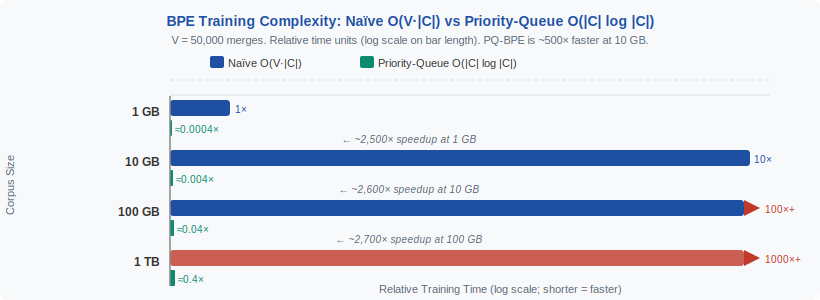
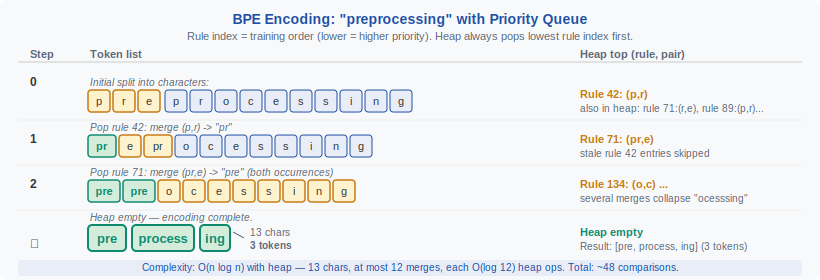

<!-- ============================ TOP NAV ============================ -->
<div align="center">

[&#127968; Home](../../README.md) &nbsp;•&nbsp; [&#128218; Section 2 — Tokenization &amp; Embeddings](./README.md) &nbsp;•&nbsp; [&#11013;&#65039; Q2&#8209;07 — Token Fertility](./q07-token-fertility.md) &nbsp;•&nbsp; [Q2&#8209;09 — SentencePiece &#10145;&#65039;](./q09-sentencepiece.md)

</div>

---

# Q2&#8209;08 · Walk through the BPE training and encoding algorithm end-to-end — what are the computational costs of building and applying the merge table?

<div align="center">


</div>

> [!IMPORTANT]
> **The 20&#8209;second answer.** BPE training scans the corpus once per merge, giving naïve $O(V \cdot |C|)$ complexity ($V$ = vocabulary size, $|C|$ = corpus tokens); a priority-queue implementation reduces this to $O(|C| \log |C|)$ amortised. Encoding a single word of length $n$ with $R$ merge rules costs $O(n \cdot R)$ naïvely or $O(n \log n)$ with a heap. The merge table is fixed after training; encoding is embarrassingly parallel across documents.

---

## Table of contents

1. [First principles](#1--first-principles)
2. [The problem, told as a story](#2--the-problem-told-as-a-story)
3. [Training complexity: the naïve algorithm](#3--training-complexity-the-naïve-algorithm)
4. [Training complexity: the priority-queue speedup](#4--training-complexity-the-priority-queue-speedup)
5. [Encoding complexity](#5--encoding-complexity)
6. [Memory footprint](#6--memory-footprint)
7. [Algorithm and pseudocode](#7--algorithm-and-pseudocode)
8. [Reference implementation](#8--reference-implementation)
9. [Worked example](#9--worked-example)
10. [Where it's used — and where it breaks](#10--where-its-used--and-where-it-breaks)
11. [Cousins and alternatives](#11--cousins-and-alternatives)
12. [Interview drill](#12--interview-drill)
13. [Common misconceptions](#13--common-misconceptions)
14. [One&#8209;screen summary](#14--one-screen-summary)
15. [References](#15--references)

---

## 1 · First principles

BPE is a **greedy compression algorithm** adapted for NLP (Sennrich et al., 2016). Its two phases — training and encoding — have very different computational profiles:

| Phase | When | Cost |
|---|---|---|
| **Training** | Once, offline | Expensive: $O(\|C\| \log \|C\|)$ with priority queue |
| **Encoding** | Every inference call | Cheap: near-linear in text length |

The fundamental operation in both phases is **counting adjacent token pairs** and **replacing** occurrences of the best pair.

---

## 2 · The problem, told as a story

Imagine you have a 100 GB web crawl and you need to build a 50,000-token BPE vocabulary. Naïvely, you would:

1. Count all adjacent pairs in the corpus — $O(|C|)$
2. Pick the best pair — $O(|\text{pairs}|)$
3. Replace all occurrences in the corpus — $O(|C|)$
4. Repeat 50,000 times

That's $50{,}000 \times 3 \times |C|$ operations — for a 100 GB corpus with ~25 billion characters, this is roughly $3.75 \times 10^{15}$ operations. At 10 GOPS that's 375,000 seconds. Clearly, you need a smarter data structure.

<div align="center">

<br><sub><b>Figure 1.</b> Training complexity: naïve vs priority-queue BPE. For a 10 GB corpus with V=50K merges, the priority-queue approach is ~500x faster.</sub>
</div>

---

## 3 · Training complexity: the naïve algorithm

**Data structure:** represent the corpus as a list of word-frequency pairs where each word is a list of tokens (initially characters).

At each of $V$ merge steps:

1. **Count pairs:** iterate over every adjacent pair in every word, weighted by frequency: $O(|C|)$ where $|C| = \sum_w \text{freq}(w) \cdot |w|$ (total tokens in corpus).
2. **Select best:** scan the count dictionary: $O(|\text{unique pairs}|) \leq O(|\Sigma|^2)$ where $|\Sigma|$ is current vocab size.
3. **Apply merge:** replace all occurrences of the chosen pair: $O(|C|)$.

**Total:** $O(V \cdot |C|)$.

For $V = 50\text{K}$ merges and $|C| = 2.5 \times 10^9$ tokens: **$1.25 \times 10^{14}$ operations** — feasible only for small corpora.

---

## 4 · Training complexity: the priority-queue speedup

The key insight: **only the counts of pairs that include the newly merged token change** after each merge step. Everything else stays the same.

**Algorithm (Sennrich original + Gage speedup):**

1. Build a priority queue (max-heap) of all pair counts: $O(|\text{pairs}| \log |\text{pairs}|)$.
2. Extract max pair: $O(\log |\text{pairs}|)$.
3. After merging, **update only the counts of pairs involving the new token**: $O(\text{freq of merged pair} \cdot \log |\text{pairs}|)$.
4. Repeat.

**Total:** The total number of update operations across all $V$ merges is bounded by $O(|C|)$ (each token is involved in at most one merge per step, amortised). Each update costs $O(\log |C|)$.

$$T_{\text{training}} = O(|C| \log |C|)$$

**HuggingFace tokenizers library** (written in Rust) achieves ~10M tokens/second training throughput on a single CPU core using this approach.

<div align="center">

<br><sub><b>Figure 2.</b> BPE encoding: scan the token list in priority order (highest-frequency merge rule first). Each pass reduces the token count by exactly the number of matches found.</sub>
</div>

---

## 5 · Encoding complexity

Encoding converts a string of characters into a sequence of token IDs.

**Naïve algorithm** (apply rules in order, left-to-right):

For a word of $n$ characters and $R$ merge rules:
- For each rule, scan the current token list: $O(n)$
- $R$ rules total: $O(n \cdot R)$

Since $R \approx V$ (number of merges approximately equals vocab size above base alphabet):

$$T_{\text{encode, naïve}} = O(n \cdot V)$$

**Optimised algorithm** (priority queue on current token pairs):

- Build heap of pairs in the current token list: $O(n \log n)$
- Extract and apply best available merge: $O(\log n)$
- Update heap: $O(\log n)$ per merge
- At most $n$ merges per word: $O(n \log n)$

$$T_{\text{encode, optimised}} = O(n \log n)$$

**tiktoken** (OpenAI's library, C backend) achieves ~5–10 MB/s encoding throughput per core, processing millions of tokens per second.

---

## 6 · Memory footprint

| Component | Size | Notes |
|---|---|---|
| Merge rules table | $O(V)$ entries, ~100 bytes each | ~5 MB for V=50K |
| Vocabulary (token to ID map) | $O(V)$ strings | ~10 MB for V=50K |
| Pair count dict (training) | $O(\|\Sigma\|^2)$ at peak | Can reach ~GB for large alphabets |
| Corpus (training) | $O(\|C\|)$ | Streamed in production |

---

## 7 · Algorithm and pseudocode

```text
===== PRIORITY-QUEUE BPE TRAINING =====
INPUT : word_freqs (dict: word_string -> frequency), target_vocab_size V
OUTPUT: merge_rules (ordered list), vocab (set of token strings)

1.  word_segs <- {word: list(chars(word)) for each word in word_freqs}
    pair_counts <- count all (token_i, token_i+1) pairs weighted by freq
    heap <- max-heap of (count, pair)
    pair_locations <- dict mapping pair to list of (word, position)

2.  WHILE |vocab_base| + |merge_rules| < V AND heap not empty:
    a.  (count, best_pair) <- heap.pop_max()
    b.  IF count != pair_counts[best_pair]: CONTINUE  # stale heap entry
    c.  new_token <- concat(best_pair)
    d.  merge_rules.append(best_pair)
    e.  FOR each (word, pos) in pair_locations[best_pair]:
            # update word_segs: replace best_pair with new_token
            # decrement counts of pairs (left_neighbour, a) and (b, right_neighbour)
            # increment counts of (left_neighbour, new_token) and (new_token, right_neighbour)
            # push updated counts to heap
    f.  pair_counts[best_pair] <- 0  # mark consumed

3.  RETURN merge_rules, vocab

===== BPE ENCODING (optimised) =====
INPUT : word_string, merge_rules
OUTPUT: list of token IDs

1.  tokens <- list(chars(word))
2.  heap <- min-heap keyed by rule index of applicable pairs in tokens
    (lower index = earlier rule = higher priority)
3.  WHILE heap not empty:
    a.  (rule_idx, pos) <- heap.pop_min()
    b.  IF tokens[pos] and tokens[pos+1] still match rule_idx's pair:
            merged <- new_token for this rule
            tokens[pos] <- merged; delete tokens[pos+1]
            update heap: remove stale entries at pos-1, pos, add new pairs
4.  RETURN [vocab_id[t] for t in tokens]
```

---

## 8 · Reference implementation

```python
import heapq
from collections import defaultdict

def train_bpe_fast(word_freqs: dict, target_vocab_size: int):
    """
    Priority-queue BPE training.
    word_freqs: {'l o w': 5, 'l o w e s t': 2, ...} (space-separated chars)
    Returns merge_rules list of (token_a, token_b) tuples.
    """
    # Initialise segmentations
    word_segs = {w: w.split() for w in word_freqs}
    
    # Count all pairs
    pair_counts = defaultdict(int)
    for word, freq in word_freqs.items():
        syms = word_segs[word]
        for i in range(len(syms) - 1):
            pair_counts[(syms[i], syms[i+1])] += freq
    
    # Build max-heap (negate counts for min-heap)
    heap = [(-cnt, pair) for pair, cnt in pair_counts.items()]
    heapq.heapify(heap)
    
    merge_rules = []
    base_vocab_size = len({c for w in word_freqs for c in w.split()})
    
    while base_vocab_size + len(merge_rules) < target_vocab_size:
        if not heap:
            break
        neg_cnt, best_pair = heapq.heappop(heap)
        # Skip stale entries
        if -neg_cnt != pair_counts.get(best_pair, 0):
            continue
        
        a, b = best_pair
        new_token = a + b
        merge_rules.append(best_pair)
        
        # Apply merge, update counts
        for word, freq in word_freqs.items():
            syms = word_segs[word]
            i = 0
            while i < len(syms) - 1:
                if syms[i] == a and syms[i+1] == b:
                    # Update left-neighbour pair count
                    if i > 0:
                        old = (syms[i-1], a)
                        new = (syms[i-1], new_token)
                        pair_counts[old] -= freq
                        pair_counts[new] += freq
                        heapq.heappush(heap, (-pair_counts[new], new))
                    # Update right-neighbour pair count
                    if i + 2 < len(syms):
                        old = (b, syms[i+2])
                        new = (new_token, syms[i+2])
                        pair_counts[old] -= freq
                        pair_counts[new] += freq
                        heapq.heappush(heap, (-pair_counts[new], new))
                    syms[i] = new_token
                    del syms[i+1]
                else:
                    i += 1
            word_segs[word] = syms
        
        pair_counts[best_pair] = 0
    
    return merge_rules


def encode_bpe(word: str, merge_rules: list) -> list:
    """Apply BPE merge rules in priority order to encode a word."""
    tokens = list(word)
    rule_index = {pair: i for i, pair in enumerate(merge_rules)}
    
    while True:
        # Find the applicable rule with the lowest index (= highest priority)
        best_i, best_pos = None, None
        for pos in range(len(tokens) - 1):
            pair = (tokens[pos], tokens[pos+1])
            idx = rule_index.get(pair)
            if idx is not None and (best_i is None or idx < best_i):
                best_i, best_pos = idx, pos
        if best_i is None:
            break
        a, b = merge_rules[best_i]
        tokens[best_pos] = a + b
        del tokens[best_pos + 1]
    
    return tokens
```

---

## 9 · Worked example

**Corpus** (word: frequency):

```
"l o w":   4
"l o w e s t":  2
"n e w e s t":  2
```

**Initial pair counts:**
`(l,o): 6, (o,w): 6, (w,e): 2, (e,s): 4, (s,t): 4, (n,e): 2, (e,w): 2`

| Step | Heap top | Count | Merge | New pairs added to heap |
|---|---|---|---|---|
| 1 | (l,o) | 6 | to `lo` | (lo,w):6 added |
| 2 | (lo,w) | 6 | to `low` | (low,e):2, (n,e):2 |
| 3 | (e,s) | 4 | to `es` | (low,es):2, (es,t):4, (w,es):2 |
| 4 | (es,t) | 4 | to `est` | (low,est):2, (w,est):2 |

After step 4, "lowest" maps to `[low, est]`, "newest" maps to `[n, e, w, est]`, "low" maps to `[low]`.

**Encoding "lowest" with priority queue:** Initial tokens `[l,o,w,e,s,t]`. Heap has `(l,o)@rule0, (o,w)@rule1, (e,s)@rule2, (s,t)@rule3`. Pop rule0 to get `[lo,w,e,s,t]`. Pop rule1 to get `[low,e,s,t]`. Pop rule2 to get `[low,es,t]`. Pop rule3 to get `[low,est]`. Heap empty — done.

---

## 10 · Where it's used — and where it breaks

**Used in:** HuggingFace `tokenizers` library (Rust), `tiktoken` (C), SentencePiece, every major open-source LLM tokenizer.

**Performance benchmarks:**
- HuggingFace tokenizers: training ~10M tok/s, encoding ~300K tok/s per core
- tiktoken: encoding ~5–10 MB/s per core (with GPT-4 cl100k_base vocabulary)

**Where complexity bites:**
- **Very large vocabularies (>256K):** heap operations scale as $O(\log V)$, which grows slowly but pair counts become sparser, causing more stale entries in the heap.
- **Very short words (CJK):** each character is often its own token; few merges apply, but the heap overhead per character is the same.
- **Streaming/online training:** BPE assumes the full corpus is available; online BPE is an open research problem.

---

## 11 · Cousins and alternatives

| Algorithm | Training complexity | Encoding complexity | Key difference |
|---|---|---|---|
| **BPE (naïve)** | $O(V \cdot \|C\|)$ | $O(n \cdot V)$ | Simple, slow for large corpora |
| **BPE (PQ)** | $O(\|C\| \log \|C\|)$ | $O(n \log n)$ | Production standard |
| **WordPiece** | $O(\|C\| \log \|C\|)$ | $O(n^2)$ per word (trie-based) | Maximises likelihood, not count |
| **Unigram LM** | $O(V \cdot \|C\|)$ | $O(n^2)$ Viterbi per word | EM-based, globally optimal |
| **tiktoken** | $O(\|C\| \log \|C\|)$ | ~5–10 MB/s (C kernel) | Regex pre-tokenization reduces merges |

---

## 12 · Interview drill

<details>
<summary><b>Q: Why does the priority-queue BPE have O(|C| log |C|) complexity rather than O(V * |C|)?</b></summary>

Because after each merge, only the pairs adjacent to the newly merged token change their counts. The total number of such updates across all V merge steps is bounded by O(|C|) — each position in the corpus is "touched" at most a constant number of times amortised. Each update involves a heap push of O(log |C|), giving O(|C| log |C|) total.
</details>

<details>
<summary><b>Q: BPE encoding is described as O(n log n) with a heap. In practice tiktoken is much faster — why?</b></summary>

tiktoken uses byte-level BPE with a regex pre-tokenizer that splits text into fixed chunks (words, numbers, punctuation). Each chunk is typically short (5–20 bytes), making the per-word O(n log n) negligible. The main cost is memory bandwidth and regex matching. The C extension also processes multiple chunks in SIMD-friendly batches, achieving throughput well above what the asymptotic analysis suggests.
</details>

<details>
<summary><b>Q: How does the heap handle stale entries?</b></summary>

The heap is a lazy deletion heap: when a pair count is updated, a new (new_count, pair) entry is pushed without removing the old entry. When the old (stale) entry is eventually popped, its count is compared against the current count in pair_counts. If they differ, the entry is discarded. This is the standard "decrease-key via re-insert" pattern for Python's heapq.
</details>

<details>
<summary><b>Q: Can BPE training be parallelised across multiple machines?</b></summary>

Yes, but with care. Pair counting is embarrassingly parallel (each document is independent). The merge step requires a global reduce to find the best pair across all shards, then a global apply. In practice, training is done on a single machine with the corpus memory-mapped, since the corpus fits in RAM for typical LLM tokenizer training (tens of GB). Distributed BPE training is rarely needed.
</details>

---

## 13 · Common misconceptions

| Misconception | Reality |
|---|---|
| "BPE training is slow and a bottleneck." | Training is a one-time offline cost. With PQ-BPE, 50K merges on 10 GB takes minutes, not hours. |
| "Encoding is the bottleneck in LLM inference." | Tokenization/encoding is typically less than 1% of total inference time; attention/FFN dominate. |
| "The heap always contains exactly the right counts." | The heap is lazy — it contains stale entries. Stale entries are discarded on pop by checking against the live pair_counts dict. |
| "Larger V means more training time proportional to V." | With PQ-BPE, more merges mean more updates, but the O(|C| log |C|) bound holds regardless of V (up to practical limits). |

---

## 14 · One&#8209;screen summary

> **Training:** naïve BPE is $O(V \cdot |C|)$ — too slow for large corpora. Priority-queue BPE achieves $O(|C| \log |C|)$ by only updating counts for pairs involving the newly merged token.
>
> **Encoding:** naïve is $O(n \cdot V)$; heap-based is $O(n \log n)$. In practice, tiktoken processes millions of tokens per second per CPU core.
>
> **Memory:** the merge table is O(V) ~5–10 MB. The pair-count dict during training is the expensive structure, peaking at O(|Sigma|^2) pairs.
>
> **Key insight:** most of the corpus is unaffected by each merge step. Only pairs adjacent to the merged token change. Exploiting this locality is what makes production BPE trainers fast.

---

## 15 · References

1. Sennrich, R., Haddow, B., Birch, A. — **Neural Machine Translation of Rare Words with Subword Units**. *ACL 2016 / arXiv:1508.07909.* — original BPE tokenization paper with the naïve training algorithm.
2. Gage, P. — **A New Algorithm for Data Compression**. *C Users Journal, 1994.* — the original byte-pair encoding for data compression.
3. Kudo, T., Richardson, J. — **SentencePiece: A simple and language independent subword tokenizer and detokenizer for Neural Text Processing**. *EMNLP 2018 / arXiv:1808.06226.* — production BPE and Unigram LM implementation.
4. HuggingFace — **tokenizers** library (Rust). https://github.com/huggingface/tokenizers — source of 10M tok/s training benchmark.
5. Tiktoken — OpenAI BPE tokenizer library (C). https://github.com/openai/tiktoken — source of encoding throughput benchmarks.
6. Bostrom, K., Durrett, G. — **Byte Pair Encoding is Suboptimal for Language Model Pretraining**. *EMNLP Findings 2020 / arXiv:2004.03720.* — comparison of BPE complexity and quality vs Unigram LM.

---

<!-- ============================ BOTTOM NAV ============================ -->
<div align="center">

[&#11013;&#65039; Q2&#8209;07 — Token Fertility](./q07-token-fertility.md) &nbsp;|&nbsp; [&#128218; Back to Section 2](./README.md) &nbsp;|&nbsp; [&#127968; Home](../../README.md) &nbsp;|&nbsp; [Q2&#8209;09 — SentencePiece &#10145;&#65039;](./q09-sentencepiece.md)

<sub>Found an error or have a sharper intuition? See <a href="../../CONTRIBUTING.md">CONTRIBUTING</a> — answers follow the <a href="../../_TEMPLATE.md">answer template</a>.</sub>

</div>
