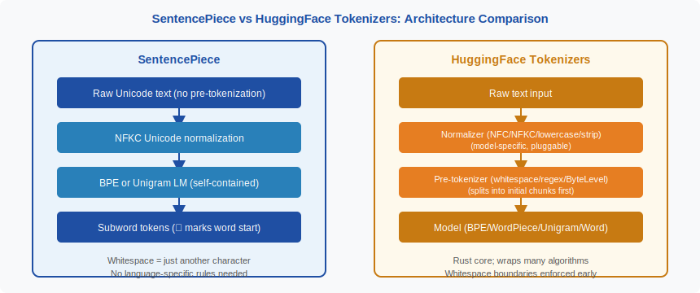
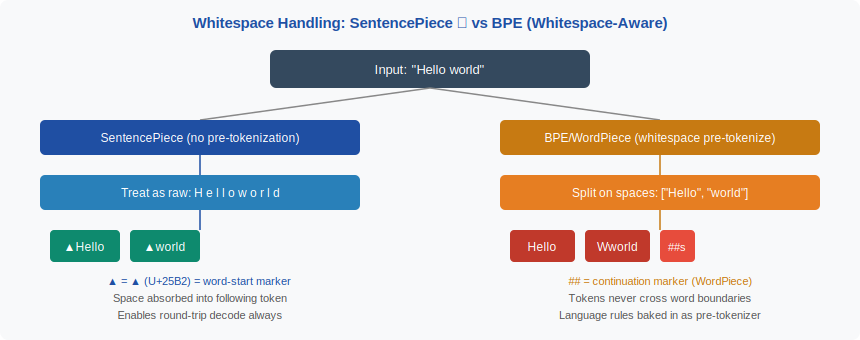

<!-- ============================ TOP NAV ============================ -->
<div align="center">

[🏠 Home](../../README.md) &nbsp;•&nbsp; [📚 Section 2 — Tokenization & Embeddings](./README.md) &nbsp;•&nbsp; [⬅️ Q2‑08 — BPE Algorithm](./q08-bpe-algorithm.md) &nbsp;•&nbsp; [Q2‑10 — Vocabulary Size ➡️](./q10-vocab-size-tradeoff.md)

</div>

---

# Q2‑09 · How does SentencePiece differ from Hugging Face tokenizers? What does language-independent tokenization mean in practice?

<div align="center">


</div>

> [!IMPORTANT]
> **The 20-second answer.** SentencePiece (Kudo & Richardson, EMNLP 2018) treats the entire input as a raw Unicode byte stream and encodes whitespace as a special character (▁), so it never requires language-specific pre-tokenization rules. HuggingFace Tokenizers is a Rust-based library that wraps multiple algorithms (BPE, WordPiece, Unigram, Word) and adds a configurable normalizer/pre-tokenizer stage that typically splits on whitespace before applying the core algorithm. The practical consequence is that SentencePiece works correctly out-of-the-box for scripts with no whitespace (Chinese, Japanese, Thai) or unusual whitespace conventions, while HuggingFace tokenizers require explicit pre-tokenizer configuration to handle such scripts well.

---

## Table of contents
1. [First principles](#1--first-principles)
2. [The problem, told as a story](#2--the-problem-told-as-a-story)
3. [The mechanism, precisely](#3--the-mechanism-precisely)
4. [Geometric / intuitive view](#4--geometric--intuitive-view)
5. [Key equations / complexity](#5--key-equations--complexity)
6. [Normalization: NFC vs NFKC and why it matters](#6--normalization-nfc-vs-nfkc-and-why-it-matters)
7. [Algorithm & pseudocode](#7--algorithm--pseudocode)
8. [Reference implementation](#8--reference-implementation)
9. [Worked example](#9--worked-example)
10. [Where it's used — and where it breaks](#10--where-its-used--and-where-it-breaks)
11. [Cousins & alternatives](#11--cousins--alternatives)
12. [Interview drill](#12--interview-drill)
13. [Common misconceptions](#13--common-misconceptions)
14. [One-screen summary](#14--one-screen-summary)
15. [References](#15--references)

---

## 1 · First principles

A tokenizer maps a raw string $s$ to a sequence of integer IDs:

$$\text{tokenize}: s \in \Sigma^* \longrightarrow (t_1, t_2, \ldots, t_n) \in \mathcal{V}^n$$

and must support a lossless inverse (detokenization) for most practical uses:

$$\text{detokenize}(\text{tokenize}(s)) = s$$

Two design choices determine almost everything else:

**Choice 1 — What counts as a token boundary?**  
Whitespace-aware tokenizers treat spaces as separators; they split the string into words first and then subword-segment each word independently. This is efficient for European languages but breaks for scripts that do not use spaces between words (Thai, Chinese, Japanese).

SentencePiece makes a different choice: **spaces are just another Unicode character**. The string `"Hello world"` is treated as the 11-character sequence `H e l l o ` ` w o r l d`. The space character U+0020 gets encoded into the vocabulary like any other character — specifically it is replaced by a visually distinct marker ▁ (U+2581 LOWER ONE EIGHTH BLOCK) so that the token `▁world` means "word-starting world" and round-trip decoding is unambiguous.

**Choice 2 — What normalization is applied?**  
Unicode allows the same visual character to be encoded in multiple ways (e.g., `é` can be a single codepoint U+00E9 or a combining sequence e + U+0301). Inconsistent normalization causes the same surface form to tokenize differently, corrupting model inputs. SentencePiece applies **NFKC normalization** by default; HuggingFace models vary (BERT uses NFC; T5-via-SentencePiece uses NFKC).

---

## 2 · The problem, told as a story

Imagine you are building a multilingual model that must handle English, Japanese, and Thai. You start with a standard whitespace-split BPE tokenizer. Your pre-tokenizer splits on spaces, producing word-level chunks that BPE then segments. This works fine for English.

Then you feed it Japanese: `"東京は大きい都市です"` (Tokyo is a large city). There are no spaces. Your pre-tokenizer sees one giant token — the entire sentence — and BPE is forced to learn whole-sentence patterns rather than reusable subword units. The same thing happens with Thai.

Your first fix is to add language-specific rules: use a Japanese morphological analyzer (MeCab) to split Japanese, a Thai segmenter for Thai, and so on. This works but requires:
- One dependency per language
- Language identification at inference time
- Maintenance as rules change

SentencePiece sidesteps this entirely. By treating the input as a character stream and learning which character sequences co-occur frequently — regardless of where spaces are or are not — it discovers useful subwords in all scripts simultaneously from a single pass over the training data.

<div align="center">

<br><sub><b>Figure 1.</b> SentencePiece eliminates the pre-tokenization stage entirely by encoding whitespace as a regular character. HuggingFace Tokenizers exposes each stage (Normalizer, Pre-tokenizer, Model, Post-processor) as a configurable component.</sub>
</div>

---

## 3 · The mechanism, precisely

### SentencePiece training (BPE variant)

1. **Normalization.** Apply NFKC (or configurable) normalization to the entire corpus.
2. **Whitespace replacement.** Replace every whitespace character (U+0020, U+00A0, etc.) with ▁ (U+2581). For word-initial positions, prepend ▁ before the first character of each whitespace-separated region. Result: every "word boundary" is now a visible token character.
3. **Character seeding.** Initialize the vocabulary with all single characters that appear in the training corpus plus a special `<unk>` token.
4. **BPE or Unigram training.** Run BPE merge rules (or Unigram expectation-maximization) on the character-level corpus. Because ▁ is just another character, merges like `(▁, w) → ▁w` and `(▁w, o) → ▁wo` happen naturally when whitespace-preceded sequences are frequent.
5. **Serialization.** Save the entire model (vocabulary + merge rules or unigram probabilities + normalization spec) as a single `.model` file (protocol buffer format).

### HuggingFace Tokenizers pipeline

HuggingFace Tokenizers decomposes the process into four separable components:

| Stage | Interface | Examples |
|---|---|---|
| **Normalizer** | Pluggable | NFC, NFKC, Lowercase, StripAccents, BertNormalizer |
| **Pre-tokenizer** | Pluggable | Whitespace, ByteLevel, Digits, Punctuation, metaspace |
| **Model** | Core algorithm | BPE, WordPiece, Unigram, Word |
| **Post-processor** | Token manipulation | Adding [CLS]/[SEP], BOS/EOS tokens |

The critical difference: the **Pre-tokenizer** runs **before** the model and typically splits on whitespace, meaning the BPE/WordPiece model is trained and applied on individual words (or byte-level chunks), never crossing space boundaries.

To emulate SentencePiece behavior in HuggingFace, you use the `Metaspace` pre-tokenizer, which replaces spaces with ▁ and then allows the model to learn cross-word merges — but this is an explicit choice, not the default.

<div align="center">

<br><sub><b>Figure 2.</b> Whitespace handling is the core architectural divergence. SentencePiece absorbs the space into the following token (▁world), enabling lossless round-trip decode and cross-script consistency. Standard BPE-with-whitespace discards space information implicitly, requiring the decoder to reinsert spaces heuristically.</sub>
</div>

---

## 4 · Geometric / intuitive view

Think of the tokenizer's vocabulary as a **tile set** used to cover a string. Whitespace-aware tokenizers have tiles that only fit inside word boundaries — they cannot span across a space. SentencePiece's tile set includes tiles that start with ▁, allowing them to "anchor" at word starts while potentially spanning any characters.

```
Whitespace-aware BPE:
|  Hello  |  world  |     ← word boundaries enforced
|He|llo|  |  wo|rld|     ← tiles fit inside boxes only

SentencePiece:
▁Hello▁world              ← flat character stream
|▁Hello|▁world|           ← tiles freely span the stream
```

For Chinese (`东京都市`), there are no spaces. Whitespace-aware tokenizers see one box; SentencePiece sees a flat stream and tiles it character by character or in learned multi-character subwords:

```
Whitespace-aware: [东京都市]          ← one "word", one chunk
SentencePiece:    [▁东京][都市]       ← learned subword segments
```

The ▁ prefix also means round-trip decoding is deterministic: to reconstruct the original string, replace every ▁ with a space character.

---

## 5 · Key equations / complexity

### Unigram language model (SentencePiece's second algorithm)

Given a sentence $\mathbf{x} = (x_1, \ldots, x_n)$, the Unigram LM tokenizer finds the segmentation $\mathbf{s}^*$ that maximizes the product of unigram token probabilities:

$$\mathbf{s}^* = \arg\max_{\mathbf{s} \in \mathcal{S}(\mathbf{x})} \prod_{i} p(x_i)$$

where $\mathcal{S}(\mathbf{x})$ is the set of all valid segmentations of $\mathbf{x}$ and $p(x_i)$ is the unigram probability of subword $x_i$ in the vocabulary.

Taking log-probabilities:

$$\mathbf{s}^* = \arg\max_{\mathbf{s}} \sum_{i} \log p(x_i)$$

This is solved via the Viterbi algorithm in $O(|x| \cdot K)$ time, where $K$ is the maximum subword length considered.

### Vocabulary optimization (EM)

The Unigram vocabulary is trained by expectation-maximization:

- **E-step:** Given current probabilities $p(x_i)$, compute expected token counts across all segmentations using the forward-backward algorithm.
- **M-step:** Re-estimate $p(x_i) \propto \text{expected count}(x_i)$.
- **Pruning:** After convergence, remove the bottom $\rho$ fraction of tokens by log-likelihood contribution. Repeat until vocabulary size $V$ is reached.

### Encode complexity

| Algorithm | Training | Encoding per sentence |
|---|---|---|
| BPE (SentencePiece) | $O(\|C\| \log \|C\|)$ with priority queue | $O(\|s\| \cdot R)$ where $R$ = merge rules |
| Unigram LM | $O(|V| \cdot |C|)$ per EM iteration | $O(\|s\| \cdot K)$ Viterbi |
| HF BPE (Rust) | Same as BPE | Same, faster constant |

---

## 6 · Normalization: NFC vs NFKC and why it matters

Unicode defines four normalization forms. The two used in tokenization are:

**NFC (Canonical Decomposition, Canonical Composition)**
- Decomposes characters into combining sequences then re-composes canonically.
- Preserves visual distinctions; `fi` (U+FB01, ligature fi) remains `fi`.
- BERT uses NFC.

**NFKC (Compatibility Decomposition, Canonical Composition)**
- Additionally applies compatibility decompositions: `fi` → `fi`, `½` → `1/2`, fullwidth `Ａ` → `A`, superscript `²` → `2`.
- Reduces vocabulary size by collapsing visually similar but encoding-different characters.
- SentencePiece (T5, mT5, LLaMA 1/2) uses NFKC by default.

**Why this matters in practice:**

1. **Vocabulary coverage.** Without NFKC, fullwidth Latin characters (common in Japanese/Chinese documents) would be out-of-vocabulary. NFKC maps them to their ASCII equivalents first.
2. **Cross-document consistency.** OCR output often uses compatibility characters; NFKC normalization prevents the same word from tokenizing differently depending on its source.
3. **Fingerprinting attacks.** An adversary can insert invisible Unicode characters (zero-width joiners, variation selectors) to alter tokenization. NFKC strips most of these.
4. **Mathematical expressions.** Superscripts and subscripts get mapped to ordinary digits under NFKC, which can break math-aware applications. A math-focused model might prefer NFC.

The normalization rule is saved inside the `.model` file in SentencePiece, so the same normalization is always applied at inference — this is why the serialized model file is self-contained.

---

## 7 · Algorithm & pseudocode

```text
===== SENTENCEPIECE ENCODE (BPE VARIANT) =====
INPUT : raw string s, trained SP model M
        (vocabulary V, merge rules R = [(a,b) -> ab], normalizer spec N)
OUTPUT: list of token strings

1.  s_norm  <- normalize(s, spec=N)               # NFKC by default
2.  s_space <- replace_spaces_with_underscore(s_norm)
              # " hello world" -> "▁hello▁world"
3.  chars   <- list(s_space)                      # character list
4.  tokens  <- chars[:]                           # working sequence
5.  FOR each (pair_a, pair_b) in R (in trained order):
        i <- 0
        WHILE i < len(tokens) - 1:
            IF tokens[i] == pair_a AND tokens[i+1] == pair_b:
                tokens[i] <- pair_a + pair_b      # merge
                DELETE tokens[i+1]
            ELSE:
                i <- i + 1
6.  RETURN tokens

===== SENTENCEPIECE DECODE =====
INPUT : list of token strings T
OUTPUT: original string

1.  joined <- concat(T)                           # e.g. "▁Hello▁world"
2.  RETURN replace("▁", " ", joined).strip()      # restore spaces

===== HF TOKENIZERS PIPELINE =====
INPUT : raw string s, HF tokenizer config C
OUTPUT: list of token IDs

1.  s_norm  <- C.normalizer.normalize(s)
2.  pretoks <- C.pre_tokenizer.pre_tokenize(s_norm)
              # returns [(word_str, offsets), ...]
3.  ids     <- []
4.  FOR each (word, offset_pair) in pretoks:
        word_tokens <- C.model.tokenize(word)    # BPE/WordPiece/etc.
        ids.extend(C.vocab[t] for t in word_tokens)
5.  ids <- C.post_processor.process(ids)         # add BOS/EOS etc.
6.  RETURN ids
```

---

## 8 · Reference implementation

```python
import sentencepiece as spm
from tokenizers import Tokenizer, models, pre_tokenizers, normalizers, trainers

# ── Part 1: SentencePiece BPE ──────────────────────────────────────────────

def train_sentencepiece(corpus_file: str, model_prefix: str, vocab_size: int = 8000):
    """Train a SentencePiece BPE model — no pre-tokenization step."""
    spm.SentencePieceTrainer.train(
        input=corpus_file,
        model_prefix=model_prefix,
        vocab_size=vocab_size,
        model_type="bpe",              # or "unigram"
        character_coverage=0.9995,     # fraction of chars covered; <1 => <unk> for rare chars
        normalization_rule_name="nfkc",
        pad_id=0, unk_id=1, bos_id=2, eos_id=3,
    )

def encode_with_sentencepiece(text: str, model_path: str) -> list:
    """Encode text; whitespace is encoded as ▁ automatically."""
    sp = spm.SentencePieceProcessor()
    sp.load(model_path)
    tokens = sp.encode_as_pieces(text)
    ids    = sp.encode_as_ids(text)
    return {"tokens": tokens, "ids": ids}

def roundtrip_sentencepiece(text: str, model_path: str) -> str:
    """Demonstrate lossless round-trip decode."""
    sp = spm.SentencePieceProcessor()
    sp.load(model_path)
    ids = sp.encode(text)
    return sp.decode(ids)

# ── Part 2: HuggingFace Tokenizers BPE (whitespace-aware, default) ─────────

def train_hf_bpe(corpus_files: list, vocab_size: int = 8000) -> Tokenizer:
    """Train HF BPE with default whitespace pre-tokenizer."""
    tok = Tokenizer(models.BPE(unk_token="<unk>"))
    tok.normalizer = normalizers.NFKC()
    tok.pre_tokenizer = pre_tokenizers.Whitespace()   # splits on whitespace first
    trainer = trainers.BpeTrainer(
        vocab_size=vocab_size,
        special_tokens=["<unk>", "<pad>", "<bos>", "<eos>"],
    )
    tok.train(corpus_files, trainer)
    return tok

def train_hf_bpe_metaspace(corpus_files: list, vocab_size: int = 8000) -> Tokenizer:
    """Train HF BPE with Metaspace pre-tokenizer (SentencePiece-style)."""
    tok = Tokenizer(models.BPE(unk_token="<unk>"))
    tok.normalizer = normalizers.NFKC()
    tok.pre_tokenizer = pre_tokenizers.Metaspace(
        replacement="▁", add_prefix_space=True
    )
    trainer = trainers.BpeTrainer(
        vocab_size=vocab_size,
        special_tokens=["<unk>", "<pad>", "<bos>", "<eos>"],
    )
    tok.train(corpus_files, trainer)
    return tok

# ── Part 3: Comparison demo ────────────────────────────────────────────────

def compare_whitespace_handling():
    """Show how the two systems handle the same input differently."""
    # Using a pre-trained T5 tokenizer (SentencePiece under the hood)
    from transformers import T5Tokenizer, AutoTokenizer

    sp_tok  = T5Tokenizer.from_pretrained("t5-small")
    hf_tok  = AutoTokenizer.from_pretrained("bert-base-uncased")  # WordPiece + whitespace

    texts = [
        "Hello world",
        "東京は大きい都市です",  # Japanese, no spaces
        "สวัสดีครับ",            # Thai, no spaces
    ]
    for text in texts:
        sp_pieces  = sp_tok.tokenize(text)
        hf_pieces  = hf_tok.tokenize(text)
        print(f"Text   : {text!r}")
        print(f"  SP   : {sp_pieces}")
        print(f"  HF   : {hf_pieces}")
        print()
```

---

## 9 · Worked example

**Input string:** `"New York"`

### SentencePiece encoding (with a T5-style vocabulary)

Step 1 — NFKC normalization: `"New York"` → `"New York"` (no change; already normalized).

Step 2 — Whitespace replacement: `"New York"` → `"▁New▁York"` (prepend ▁ before N; replace space before Y with ▁).

Step 3 — BPE merges on the character stream:

```
Initial: [▁, N, e, w, ▁, Y, o, r, k]
After merge (▁, N) → ▁N:  [▁N, e, w, ▁, Y, o, r, k]
After merge (▁N, e) → ▁Ne: [▁Ne, w, ▁, Y, o, r, k]
After merge (▁, Y) → ▁Y:  [▁Ne, w, ▁Y, o, r, k]
...
Final tokens: [▁New, ▁York]
```

Decode: `"▁New▁York"` → replace ▁ with space → `" New York"` → strip → `"New York"`. Lossless.

### HuggingFace BPE (whitespace pre-tokenizer) encoding

Step 1 — Whitespace split: `["New", "York"]`.

Step 2 — BPE on `"New"`: already a whole token → `["New"]`.

Step 3 — BPE on `"York"`: already a whole token → `["York"]`.

Final tokens: `["New", "York"]`.

Decode: join with space → `"New York"`. Also lossless here — but only because we know tokens are space-separated.

**Key difference for `"NewYork"` (no space, e.g., a hashtag):**

| System | Input | Tokens |
|---|---|---|
| SentencePiece | `"NewYork"` | `[▁NewYork]` or `[▁New, York]` (learned) |
| Whitespace BPE | `"NewYork"` | `[New, ##Y, ##ork]` (WordPiece) or `[New</w>, York</w>]` |

SentencePiece handles the no-space case identically to the spaced case; whitespace BPE must decide whether `NewYork` is one "word" or two based on the pre-tokenizer's rules.

---

## 10 · Where it's used — and where it breaks

### Models that use SentencePiece

| Model | SP algorithm | Vocab size | Notes |
|---|---|---|---|
| T5, mT5 (Google) | Unigram LM | 32,000 | Multilingual; NFKC; 101 languages |
| mBART, mBERT (Meta/Google) | BPE | 250,000 | Character coverage 0.9999 |
| LLaMA 1, LLaMA 2 (Meta) | BPE | 32,000 | SP BPE; byte fallback for rare chars |
| XLM-RoBERTa (Meta) | BPE | 250,002 | Trained on 100 languages |
| Gemma (Google) | Unigram LM | 256,000 | Extended vocabulary for code |
| PaLM (Google) | SentencePiece BPE | 256,000 | Large vocab for multilingual coverage |

### Models that use HuggingFace / other tokenizers

| Model | Tokenizer | Vocab size |
|---|---|---|
| GPT-2, GPT-3 | Byte-level BPE (tiktoken) | 50,257 |
| GPT-4 (cl100k) | Byte-level BPE + regex | 100,277 |
| BERT | WordPiece | 30,522 |
| LLaMA 3 | tiktoken (BPE) | 128,256 |
| Mistral 7B | SentencePiece BPE | 32,000 |

### Where SentencePiece breaks

1. **Very small vocabularies with morphologically rich languages.** The character coverage parameter drops rare characters to `<unk>` — setting it too low causes legitimate characters in the target language to be unknown.
2. **Mixed-script code** (e.g., Python with Japanese variable names). The NFKC normalization can alter fullwidth operators that look like Python syntax.
3. **Inference-time normalization mismatch.** If the application normalizes text to NFC before calling a NFKC-trained SentencePiece model, the model still re-normalizes — this is fine — but if text is passed pre-tokenized, normalization differences cause subtle divergences.
4. **Streaming tokenization.** The ▁-prefix approach requires knowing where word boundaries start; for streaming character-by-character input, the tokenizer cannot emit a token until it knows whether the next character continues the current word.
5. **Very long sentences.** The Viterbi decode in Unigram LM is $O(|s| \cdot K)$; for sentences of 10,000+ characters (e.g., code files), this can be slow compared to BPE.

---

## 11 · Cousins & alternatives

| Method | Key difference from SentencePiece | When to use |
|---|---|---|
| **tiktoken (OpenAI)** | Byte-level BPE with regex pre-tokenizer (no ▁); Rust/C++ speed | GPT-4-family models; need OpenAI-compatible tokenization |
| **WordPiece (BERT)** | Whitespace pre-tokenize; continuation marker `##`; likelihood-based merging | BERT-family encoder models; English-heavy tasks |
| **Byte-level BPE** | Uses raw UTF-8 bytes as base; no `<unk>` possible | Models that must handle arbitrary byte sequences, code |
| **HF Metaspace BPE** | HF Tokenizers with `Metaspace` pre-tokenizer; approximates SentencePiece | Migrating SP model to HF ecosystem while keeping ▁ conventions |
| **Character-level** | Every Unicode code point is one token; vocabulary = all chars | Rare; used in character-level language models, probing studies |
| **Morfessor** | Probabilistic morphological segmentation; linguistically motivated | Under-resourced morphologically complex languages; research |
| **BBPE + regex (tiktoken)** | Regex splits digits/whitespace/punctuation before BPE; no ▁ | When reproducible, fast tokenization with exact GPT-4 vocab needed |

---

## 12 · Interview drill

<details>
<summary><b>Q: If SentencePiece and HuggingFace BPE both implement BPE, why do they produce different tokenizations for the same text?</b></summary>

Two reasons. First, SentencePiece replaces whitespace with ▁ before training and encoding — so the effective alphabet includes characters like `▁h` that never appear in a whitespace-split vocabulary. The merge rules learned are fundamentally different because the training input is different. Second, HuggingFace BPE (with the default Whitespace pre-tokenizer) never generates merges that cross word boundaries, so a token like `▁hello` is impossible unless the Metaspace pre-tokenizer is used. Even if you used identical training data and the same number of merges, the vocabularies diverge because one system sees `▁hello` as a learnable unit and the other never encounters it.
</details>

<details>
<summary><b>Q: Why does SentencePiece use ▁ (U+2581) rather than a space to mark word starts?</b></summary>

Two reasons. First, spaces are often stripped or modified during text processing pipelines (HTML rendering, logging, etc.), while ▁ is a stable non-space character unlikely to appear in natural text. Second, using ▁ as a distinct token character makes round-trip decode deterministic: you can always identify word boundaries exactly by looking for ▁ in the token sequence, with no ambiguity about whether a space was between two tokens or came from within one. If the original space were used, joining tokens with spaces would reintroduce spaces that did not exist in the original string for scripts like Japanese.
</details>

<details>
<summary><b>Q: What is the character_coverage parameter in SentencePiece, and what happens if you set it too low?</b></summary>

`character_coverage` (default 0.9995 for languages with large character sets; 1.0 for small scripts) is the fraction of the training corpus's unique characters that must be covered by the vocabulary. Characters outside this threshold are mapped to `<unk>` at inference time. Setting it too low (e.g., 0.99 for Japanese) drops rare kanji, causing legitimate Japanese characters in test data to become unknown tokens — this silently corrupts predictions without raising an exception. Setting it to 1.0 for CJK can bloat the vocabulary with thousands of rare characters, wasting vocabulary slots that would be better used for common subwords.
</details>

<details>
<summary><b>Q: How does LLaMA 2 use SentencePiece, and how is LLaMA 3 different?</b></summary>

LLaMA 2 uses SentencePiece BPE with a vocabulary of 32,000 tokens. It applies byte fallback: any character not in the vocabulary is encoded as a sequence of `<0xXX>` byte tokens (256 possible values), ensuring no `<unk>` is ever emitted. LLaMA 3 switched to tiktoken (OpenAI's byte-level BPE library) with a much larger vocabulary of 128,256 tokens. The motivation was multilingual fertility improvement — with 128K tokens, common subwords in many languages get dedicated tokens, reducing the average token count per word for non-English languages. LLaMA 3 does not use the ▁ convention; instead it uses tiktoken's byte-level representation.
</details>

<details>
<summary><b>Q: Can you use a SentencePiece model inside the HuggingFace ecosystem?</b></summary>

Yes. HuggingFace Transformers wraps SentencePiece models in `PreTrainedTokenizerFast` using the `tokenizers` library's `SentencePieceUnigramTokenizer` or `SentencePieceBPETokenizer` backends. The `from_pretrained("t5-small")` call, for example, loads the `.model` file (SentencePiece protocol buffer) and wraps it in HuggingFace's tokenizer interface so `AutoTokenizer` works transparently. The underlying normalization and ▁ convention are preserved exactly because the `.model` file embeds the normalization spec.
</details>

<details>
<summary><b>Q: What does "language-independent" tokenization actually mean — is SentencePiece truly language-agnostic?</b></summary>

"Language-independent" means SentencePiece requires no language identification, no morphological analyzer, and no language-specific rules as part of its architecture. Given a multilingual corpus, it discovers subwords that are useful across all scripts purely from co-occurrence statistics. However, the tokenizer is not indifferent to the training data distribution. If the training corpus is 95% English, the vocabulary will be dominated by English subwords and non-English text will have high fertility — the familiar bias problem. "Language-independent" describes the algorithm's architecture, not its fairness properties. True multilingual fairness requires a training corpus balanced (or up-sampled) across target languages.
</details>

---

## 13 · Common misconceptions

| ❌ Misconception | ✅ Reality |
|---|---|
| "SentencePiece and HF tokenizers are interchangeable if both use BPE." | They produce different vocabularies and tokenizations because SentencePiece trains on a ▁-augmented stream while HF BPE (with whitespace pre-tokenizer) trains word-by-word. The merge rules are fundamentally different. |
| "SentencePiece requires no vocabulary decisions — it's fully automatic." | You must choose vocab_size, model_type (BPE vs Unigram), character_coverage, and normalization. These are consequential choices that affect multilingual fairness and downstream quality. |
| "NFKC normalization is always better than NFC." | NFKC loses some distinctions that may be meaningful (e.g., math superscripts, Greek letters that look like Latin). For general NLP it is usually better; for math or specialized domains NFC or no normalization may be preferable. |
| "The ▁ marker is just cosmetic." | ▁ is what makes lossless round-trip decoding possible. Without it, joining tokens back with spaces would reinsert spaces in scripts like Japanese that have none, corrupting the output. |
| "HuggingFace tokenizers cannot do SentencePiece-style tokenization." | HF Tokenizers supports the `Metaspace` pre-tokenizer and can load `.model` files directly. Modern HF models backed by SentencePiece use the HF wrapper transparently. |
| "SentencePiece is always slower than HF tokenizers." | SentencePiece's C++ core is fast. HF Tokenizers' Rust core is faster for BPE specifically. For Unigram LM, SentencePiece's Viterbi can be slower on very long inputs. |

---

## 14 · One-screen summary

> **What:** SentencePiece treats raw Unicode text as a flat character stream, replacing spaces with ▁, and learns subword vocabularies (BPE or Unigram LM) without any language-specific pre-tokenization. HuggingFace Tokenizers is a configurable Rust library that pipelines Normalizer → Pre-tokenizer → Model → Post-processor, with the pre-tokenizer typically splitting on whitespace before BPE/WordPiece applies.
>
> **Problem solved:** Multilingual tokenization without per-language rules. SentencePiece handles Japanese, Thai, Arabic, and English in one model trained on a mixed corpus, because whitespace absence is irrelevant to its algorithm.
>
> **Why it works:** By encoding ▁ as just another character, word-boundary information is preserved in the token stream itself. Learned merges like `▁w o r l d → ▁world` capture the same information as "this is a word-initial position" without relying on a rule-based splitter.
>
> **Caveats:** Language-independent architecture does not imply language-fair output — fertility imbalances persist if the training corpus is English-dominated. NFKC normalization can lose meaningful distinctions in math/specialized text. The serialized `.model` file must be versioned carefully, as normalization settings affect tokenization deterministically.

---

## 15 · References

1. Kudo, T. & Richardson, J. — **SentencePiece: A simple and language independent subword tokenizer and detokenizer for Neural Text Processing**. *EMNLP 2018 (System Demonstrations) / arXiv:1808.06226.* — the original SentencePiece paper; defines ▁ encoding, normalization spec serialization, and the self-contained `.model` format.
2. Kudo, T. — **Subword Regularization: Improving Neural Network Translation Models with Multiple Subword Candidates**. *ACL 2018 / arXiv:1804.10959.* — introduces the Unigram LM tokenizer algorithm with EM training and Viterbi decoding used in SentencePiece.
3. Sennrich, R., Haddow, B. & Birch, A. — **Neural Machine Translation of Rare Words with Subword Units**. *ACL 2016 / arXiv:1508.07909.* — BPE applied to NMT; the original BPE tokenizer paper that SentencePiece's BPE variant builds on.
4. Schuster, M. & Nakamura, K. — **Japanese and Korean Voice Search**. *ICASSP 2012.* — describes WordPiece; the algorithm used in BERT and other encoder models.
5. HuggingFace — **Tokenizers: Fast State-of-the-Art Tokenizers optimized for Research and Production**. *GitHub: huggingface/tokenizers, 2019–present.* — Rust implementation reference; documents the Normalizer/Pre-tokenizer/Model/Post-processor pipeline.
6. Touvron, H. et al. — **LLaMA 2: Open Foundation and Fine-Tuned Chat Models**. *arXiv:2307.09288 (2023).* — uses SentencePiece BPE (32K vocab) with byte fallback; Section 2.1 describes the tokenizer.
7. Dubey, A. et al. — **The Llama 3 Herd of Models**. *arXiv:2407.21783 (2024).* — switch from SentencePiece to tiktoken (128K vocab) motivated by multilingual fertility improvement.
8. Raffel, C. et al. — **Exploring the Limits of Transfer Learning with a Unified Text-to-Text Transformer (T5)**. *JMLR 2020 / arXiv:1910.10683.* — T5 uses SentencePiece Unigram LM with 32K vocab; appendix describes tokenizer choices.
9. Xue, L. et al. — **mT5: A massively multilingual pre-trained text-to-text transformer**. *NAACL 2021 / arXiv:2010.11934.* — extends T5 tokenizer to 101 languages; discusses character_coverage and multilingual vocabulary allocation.
10. Unicode Consortium — **Unicode Standard Annex #15: Unicode Normalization Forms**. *unicode.org/reports/tr15/.* — authoritative specification of NFC and NFKC normalization used in SentencePiece.

---

<!-- ============================ BOTTOM NAV ============================ -->
<div align="center">

[⬅️ Q2‑08 — BPE Algorithm](./q08-bpe-algorithm.md) &nbsp;|&nbsp; [📚 Back to Section 2](./README.md) &nbsp;|&nbsp; [🏠 Home](../../README.md) &nbsp;|&nbsp; [Q2‑10 — Vocabulary Size ➡️](./q10-vocab-size-tradeoff.md)

<sub>Found an error or have a sharper intuition? See <a href="../../CONTRIBUTING.md">CONTRIBUTING</a> — answers follow the <a href="../../_TEMPLATE.md">answer template</a>.</sub>

</div>
