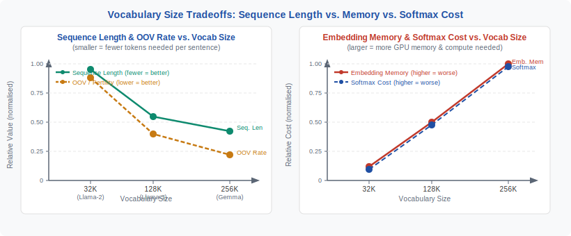
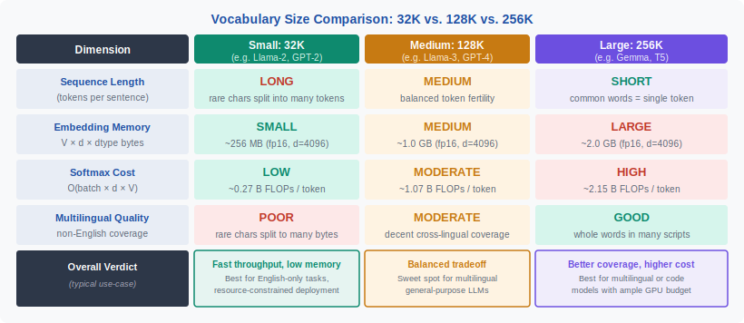

<!-- ============================ TOP NAV ============================ -->
<div align="center">

[🏠 Home](../../README.md) &nbsp;•&nbsp; [📚 Section 2 — Tokenization & Embeddings](./README.md) &nbsp;•&nbsp; [⬅️ Q2‑09 — SentencePiece](./q09-sentencepiece.md) &nbsp;•&nbsp; [Q2‑11 — Embedding Init ➡️](./q11-embedding-init.md)

</div>

---

# Q2‑10 · What are the tradeoffs between a small vocabulary (e.g. 32K) and a large vocabulary (e.g. 256K)?

<div align="center">


</div>

---

## 1 · The 30-second answer

> **Vocabulary size is a dial that trades memory and softmax cost against sequence length and OOV coverage.** Small vocabularies (32K) produce longer sequences and cheaper embedding tables; large vocabularies (256K) produce shorter sequences, heavier embedding tables, and sparser gradients on rare tokens. There is no universal optimum — the right size depends on language coverage, model size, and throughput constraints.

---

## 2 · Why this question matters

Every modern LLM ships with a vocabulary size baked in. GPT-2 used 50,257. LLaMA-1 used 32,000. LLaMA-3 jumped to 128,256. GPT-4o reports roughly 200K. These are not arbitrary choices — they reflect deliberate engineering tradeoffs:

- **Memory budget**: the embedding table is `V × d` floats. At V=256K, d=4096, fp16, this is 2 GB just for embeddings.
- **Sequence length**: fewer tokens per word means the model's fixed context window encodes more semantic content.
- **Output softmax**: the final projection is `hidden → V`, costing O(V × d) FLOPs per generated token.
- **Training data efficiency**: rare tokens in a large vocab see fewer gradient updates — their embeddings may not converge.

---

## 3 · The fundamental tension

```
Small V (32K)                     Large V (256K)
─────────────────────────────     ─────────────────────────────
+ Light embedding table            + Shorter sequences
+ Cheap output softmax             + Better multilingual coverage
+ Dense gradients (tokens seen     + Fewer byte-fallback tokens
  frequently)                      + Better number/code handling
- Long sequences (less context)    - Heavy embedding table
- Poor multilingual coverage       - Expensive output softmax
- Inefficient number encoding      - Sparse gradients on rare tokens
```

---

## 4 · The embedding table cost

The input embedding matrix **E** ∈ ℝ^(V × d) and the output unembedding matrix **U** ∈ ℝ^(d × V) together account for:

```
Parameters = 2 × V × d   (without weight tying)
           =     V × d   (with weight tying — see Q2-12)
```

| V | d | fp16 bytes (no tying) | fp16 bytes (tied) |
|---|---|-----------------------|-------------------|
| 32K | 4096 | 512 MB | 256 MB |
| 128K | 4096 | 2.0 GB | 1.0 GB |
| 256K | 8192 | 8.0 GB | 4.0 GB |

For a 7B parameter model, untied 256K × 8192 embeddings alone consume more than the rest of the model's weights.

---

## 5 · Sequence length and context utilisation

Given a fixed context window of T tokens, the number of words the model can "see" scales inversely with fertility:

```
Effective words = T / fertility(V, language)
```

For English text, fertility decreases as V grows:

| V | Approx. fertility | Effective words in 4K context |
|---|-------------------|-------------------------------|
| 8K | ~1.8 tokens/word | ~2,200 |
| 32K | ~1.3 tokens/word | ~3,100 |
| 128K | ~1.1 tokens/word | ~3,600 |
| 256K | ~1.05 tokens/word | ~3,800 |

The marginal gain flattens above 64K for English. The benefit of going from 32K to 256K is larger in multilingual settings where low-resource languages have high fertility under small vocabularies.

---

## 6 · Figure 1 — vocabulary size tradeoffs

<div align="center">



</div>

---

## 7 · Output softmax cost

At generation time the model computes:

```python
logits = hidden_state @ U     # shape: (d,) × (d, V) → (V,)
probs  = softmax(logits)
```

This is a `d × V` matrix-vector product on every generated token. Doubling V doubles this cost.

**Approximate throughput penalty** (A100, bf16, d=4096):

| V | Softmax FLOPs/token | Relative to 32K |
|---|---------------------|-----------------|
| 32K | 267M | 1× |
| 128K | 1.07B | 4× |
| 256K | 2.15B | 8× |

In practice the overhead is partially offset because longer sequences at small V require more transformer-layer passes per document.

---

## 8 · Gradient sparsity on rare tokens

BPE training favours frequent substrings. In a 256K vocabulary, the bottom 50–100K tokens may each appear only thousands of times in a trillion-token corpus:

- Adam's second-moment estimates for rare tokens never converge — curvature is unreliable.
- Embedding rows can stay near initialisation or drift to semantically meaningless positions (the **dead embedding problem**).

Mitigation strategies:
1. **Vocabulary pruning** after initial training — drop tokens that never appear in the training corpus.
2. **Tied embeddings** — rare output tokens lean on the shared embedding row (Q2-12).
3. **Subword regularisation** (SentencePiece) — multiple segmentations per sentence give rare tokens more gradient signal.

---

## 9 · Figure 2 — three vocabulary regimes compared

<div align="center">



</div>

---

## 10 · Multilingual considerations

For multilingual models, vocabulary size is the primary knob for fertility equity across languages. A 32K GPT-2-style vocabulary assigns ~90% of its merge budget to English subwords; Arabic and Tamil see fertility above 4 tokens/word.

**Rules of thumb:**
- **Monolingual English models**: 32K–64K is sufficient.
- **Multilingual models (10+ languages)**: 128K+ is necessary for acceptable fertility on non-Latin scripts.
- **Code + natural language**: 128K–256K; identifiers and operators need dedicated tokens.

LLaMA-3's jump from 32K to 128K was driven primarily by multilingual and code coverage, not English performance.

---

## 11 · Worked example — memory calculation

```python
V, d = 128_000, 8_192
bytes_per_param = 2          # bf16
embed_params   = V * d
unembed_params = V * d       # untied
total_gb = (embed_params + unembed_params) * bytes_per_param / 1e9
print(f"Embedding table: {total_gb:.1f} GB")   # → 4.2 GB

total_params = 70e9
fraction = (embed_params + unembed_params) / total_params
print(f"Fraction of 70B model: {fraction:.1%}")  # → 3.0%
```

With weight tying the 4.2 GB halves to 2.1 GB.

---

## 12 · Design decision matrix

| Scenario | Recommended V | Rationale |
|----------|--------------|-----------|
| English-only chat assistant | 32K–64K | Low fertility, cheap softmax |
| Multilingual (10+ languages) | 128K | Acceptable fertility, manageable memory |
| Code-focused model | 64K–128K | Identifiers need dedicated tokens |
| Long-context (>100K tokens) | 32K | Shorter sequences preserve context budget |
| Product LLM with cost SLAs | 64K | Balance throughput vs. fertility |

---

## 13 · Common interview follow-ups

**Q: Does a larger vocabulary always give better perplexity?**
Not necessarily. If vocabulary grows faster than training data, rare tokens underfit and held-out perplexity can worsen.

**Q: Why did LLaMA-3 quadruple vocabulary size from LLaMA-1?**
Multilingual coverage, code coverage, and individual-digit tokenisation to reduce arithmetic errors (see Q2-13).

**Q: Can you train with one vocabulary and serve with another?**
No. The embedding table is tied to model weights. Changing vocabulary requires retraining or re-initialising and fine-tuning embedding layers.

---

## 14 · Key equations

**Embedding table memory (bytes):**

$$M = k \cdot V \cdot d \cdot b$$

where $k=2$ (untied), $k=1$ (tied), $b$ is bytes per parameter.

**Output projection FLOPs per generated token:**

$$F_{\text{softmax}} = 2 \cdot d \cdot V$$

**Fertility:**

$$\text{fertility}(V) \approx \frac{|T_V(\mathcal{D})|}{|\mathcal{W}(\mathcal{D})|}$$

---

## 15 · References

| Source | What to read |
|--------|-------------|
| Sennrich et al. (2016) *Neural Machine Translation of Rare Words with Subword Units* | Original BPE; vocabulary size analysis §5 |
| Kudo & Richardson (2018) *SentencePiece* | Unigram model; multilingual fertility |
| Touvron et al. (2023) *LLaMA 2* | 32K vocabulary design rationale |
| Meta AI (2024) *LLaMA 3 Tech Report* | 128K vocabulary; multilingual fertility gains |
| Press & Wolf (2017) *Using the Output Embedding to Improve Language Models* (arXiv:1608.05859) | Weight tying motivation |

---

<div align="center">

[⬅️ Q2‑09 — SentencePiece](./q09-sentencepiece.md) &nbsp;•&nbsp; [📚 Section 2 README](./README.md) &nbsp;•&nbsp; [Q2‑11 — Embedding Init ➡️](./q11-embedding-init.md)

</div>
