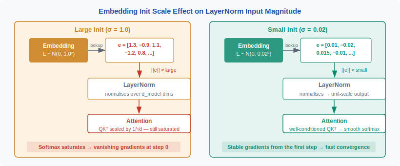
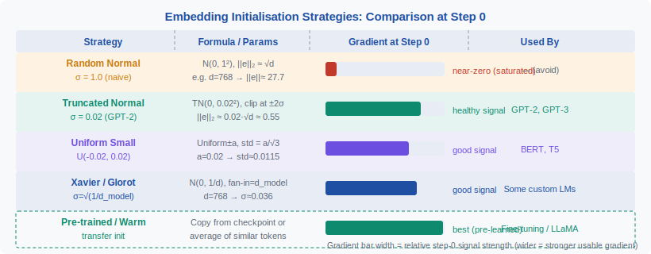

<!-- ============================ TOP NAV ============================ -->
<div align="center">

[🏠 Home](../../README.md) &nbsp;•&nbsp; [📚 Section 2 — Tokenization & Embeddings](./README.md) &nbsp;•&nbsp; [⬅️ Q2‑10 — Vocabulary Size](./q10-vocab-size-tradeoff.md) &nbsp;•&nbsp; [Q2‑12 — Weight Tying ➡️](./q12-weight-tying-embeddings.md)

</div>

---

# Q2‑11 · How is the embedding table initialised, and why is initialisation scale important for training stability?

<div align="center">


</div>

---

## 1 · The 30-second answer

> **The embedding table is usually initialised with small-variance random values — typically N(0, 1/√d) or the GPT-2 convention N(0, 0.02²) — because too-large initial embeddings amplify LayerNorm input magnitudes, destabilise the first few training steps, and cause gradient explosions in the output softmax.** The scale must be matched to the rest of the network's initialisation scheme.

---

## 2 · Why initialisation scale matters

The embedding lookup is the very first operation in a Transformer. Its output feeds directly into the first layer's residual stream:

```
x₀ = E[token_id]        # embedding lookup
x₁ = x₀ + pos_enc       # add positional encoding
x₂ = LayerNorm(x₁) ...  # first attention layer
```

If ‖E[token_id]‖ is large, then:
1. **LayerNorm** receives large activations — it re-centres them, but the residual additions in deeper layers accumulate.
2. The **output softmax** weights U (or E^T if tied) are also initialised to the same scale; large values in both E and U amplify logits, producing an overconfident initial distribution that is slow to move.
3. **Adam's second-moment** estimate is distorted early in training — the effective learning rate for embedding rows is suppressed.

---

## 3 · Standard initialisation schemes

### 3.1 · Xavier / Glorot uniform (MLP convention)

$$W \sim U\!\left(-\frac{\sqrt{6}}{\sqrt{n_{\text{in}} + n_{\text{out}}}},\ \frac{\sqrt{6}}{\sqrt{n_{\text{in}} + n_{\text{out}}}}\right)$$

For an embedding table, there is no clear `n_in` (each token is a one-hot lookup), so this does not apply directly. Many practitioners use `n_in = 1` (one-hot) and `n_out = d`, giving `U(-√(6/d), √(6/d))` ≈ N(0, 2/d).

### 3.2 · Normal N(0, σ²)

The most common choice in modern LLMs:

| Model | σ | Comment |
|-------|---|---------|
| GPT-2 | 0.02 | Fixed constant regardless of d |
| BERT | 0.02 | Same GPT-2 convention |
| LLaMA | 0.02 | Follows GPT-2 |
| PaLM | 1/√d | Scale-invariant to model size |
| T5 | 1.0 | Relatively large; compensated by input LayerNorm |

The GPT-2 value 0.02 corresponds roughly to 1/√d for d=2500, so it is implicitly scale-matched to medium-sized models. For very large d (8192), 0.02 > 1/√d ≈ 0.011 — the initialisation is slightly large, which is one reason large models benefit from a warm-up phase.

### 3.3 · Truncated normal

Used to prevent outlier-valued embedding rows that would dominate early attention patterns:

```python
torch.nn.init.trunc_normal_(embedding.weight, mean=0, std=0.02, a=-2*std, b=2*std)
```

Clipping at ±2σ removes the tail that causes early instability without changing the distribution significantly.

---

## 4 · Figure 1 — effect of initialisation scale on LayerNorm input magnitude

<div align="center">



</div>

---

## 5 · Sparse gradients — the rare token problem

The embedding table has `V` rows but only the rows for tokens in the current batch receive gradients. For a typical batch size of 2048 tokens drawn from a 50K vocabulary, only ~4% of embedding rows are updated per step.

**Consequence**: common tokens (the top 1K by frequency) receive thousands of gradient updates before rare tokens (the bottom 10K) see their first. The Adam second-moment estimate for rare tokens is near zero until they first appear — causing an initial large effective learning rate spike.

**Common mitigations**:
- **Learning rate warm-up**: the first few hundred steps use a low LR, dampening the impact of the first update on rare-token rows.
- **Weight decay**: a small `λ‖w‖²` term regularises rarely-updated rows toward zero, preventing them from drifting.
- **Embedding dropout**: randomly zeroing embedding vectors during training forces other rows to carry the load, indirectly training nearby token representations.

---

## 6 · Figure 2 — initialisation strategies compared

<div align="center">



</div>

---

## 7 · Position encoding initialisation

Learnable position embeddings (GPT-2, BERT) are initialised the same way as the token embedding table — typically N(0, 0.02²). Sinusoidal position encodings (original Transformer, T5 relative biases) are fixed at initialisation and never trained. RoPE (LLaMA, Mistral) and ALiBi (MPT) have no learnable position parameters at all.

---

## 8 · Output embedding (unembedding) initialisation

When the output projection is **not tied** (separate matrix U ∈ ℝ^(d × V)):

- **Normal practice**: initialise U the same as E, i.e., N(0, 0.02²).
- Some practitioners initialise U to **all zeros** (the output is then initially random via the bias), letting the network learn U from scratch — this can speed early training by ensuring output probabilities are initially uniform.

When **weight tying** is used (E = U^T), the output projection initialisation is inherited from the embedding table — the same σ applies to both.

---

## 9 · The residual stream perspective

In modern Transformers, each layer adds a residual `δ` to the stream:

```
xₗ₊₁ = xₗ + δₗ(xₗ)
```

The embedding is `x₀`. For training stability, the residual contributions `δₗ` should be small at initialisation so that the gradient signal flows back to the embedding table cleanly. GPT-2 achieves this by multiplying the residual projection weights by 1/√(2L) (where L is depth), ensuring that the total variance of `xL` stays O(1) regardless of depth.

The embedding initialisation and the residual-scaling scheme must be co-designed — choosing σ=0.02 for embeddings without the 1/√(2L) residual scaling leads to variance accumulation across layers.

---

## 10 · Practical initialisation code

```python
import torch
import torch.nn as nn
import math

class TokenEmbedding(nn.Module):
    def __init__(self, vocab_size: int, d_model: int, std: float = 0.02):
        super().__init__()
        self.embed = nn.Embedding(vocab_size, d_model)
        nn.init.trunc_normal_(self.embed.weight, mean=0.0, std=std,
                               a=-2 * std, b=2 * std)

    def forward(self, token_ids):
        return self.embed(token_ids)

# Scale-invariant alternative: std = 1 / sqrt(d_model)
d = 4096
embed = TokenEmbedding(vocab_size=128_000, d_model=d,
                       std=1.0 / math.sqrt(d))  # std ≈ 0.0156
```

---

## 11 · Diagnosis — spotting bad initialisation

**Symptoms of too-large σ:**
- Initial training loss is very high (near log V) and does not decrease in the first few hundred steps.
- Gradient norms spike in the first step then collapse (explosion then vanishing).
- LayerNorm statistics show large input magnitudes early.

**Symptoms of too-small σ:**
- Loss decreases very slowly; the model is effectively learning from noise.
- Embedding row norms cluster near zero; the network ignores token identity early in training.

**Diagnostic check:**

```python
# After initialisation, before any training:
norms = embedding.weight.norm(dim=1)  # per-token L2 norm
print(norms.mean(), norms.std())      # should be ~0.02 * sqrt(d)
```

For d=4096, σ=0.02: expected per-token norm ≈ 0.02 × √4096 ≈ 1.28.

---

## 12 · Common interview follow-ups

**Q: Why does BERT use the same σ=0.02 as GPT-2 even though BERT is bidirectional?**
The initialisation scheme is independent of attention directionality — both models have the same LayerNorm + residual structure that the σ=0.02 was tuned for.

**Q: Does the embedding initialisation matter for fine-tuning?**
For full fine-tuning of a pretrained model, the embedding table already has meaningful values — initialisation is irrelevant. For **vocabulary extension** (adding new tokens), initialising new rows to the **mean of existing embeddings** rather than random noise often gives faster convergence.

**Q: What about word2vec-style initialisation — using pretrained embeddings?**
This can speed convergence for small models and small datasets but offers minimal benefit for large models trained on trillions of tokens — the model will overwrite the pretrained values within the first few thousand steps.

---

## 13 · Key equations

**Per-token L2 norm at initialisation** (for rows of dimension d sampled from N(0, σ²)):

$$\mathbb{E}\left[\|e_i\|\right] = \sigma\sqrt{d}$$

**GPT-2 residual scaling** (applied to weights of residual projections, not embeddings):

$$W_{\text{proj}} \sim N\!\left(0,\; \frac{0.02^2}{2L}\right)$$

**Scale-invariant embedding standard deviation:**

$$\sigma = \frac{1}{\sqrt{d}}$$

---

## 14 · Summary table

| Scheme | σ expression | Scale-invariant? | Used by |
|--------|-------------|-----------------|---------|
| GPT-2 / BERT constant | 0.02 | No | GPT-2, BERT, LLaMA |
| Scale-invariant | 1/√d | Yes | PaLM, some research |
| Glorot-like | √(2/d) | Yes | Less common |
| Truncated normal | 0.02, clipped ±2σ | No | Robust variant |

---

## 15 · References

| Source | What to read |
|--------|-------------|
| Radford et al. (2019) *Language Models are Unsupervised Multitask Learners* (GPT-2) | σ=0.02 initialisation; 1/√(2L) residual scaling |
| Glorot & Bengio (2010) *Understanding the difficulty of training deep feedforward networks* | Xavier initialisation derivation |
| He et al. (2015) *Delving Deep into Rectifiers* | He initialisation (relu networks) — contrast with embedding case |
| Zhang et al. (2022) *Scaling Language Models* (PaLM) | Scale-invariant σ=1/√d choice |
| Shoeybi et al. (2019) *Megatron-LM* | Practical initialisation for large-scale Transformer training |

---

<div align="center">

[⬅️ Q2‑10 — Vocabulary Size](./q10-vocab-size-tradeoff.md) &nbsp;•&nbsp; [📚 Section 2 README](./README.md) &nbsp;•&nbsp; [Q2‑12 — Weight Tying ➡️](./q12-weight-tying-embeddings.md)

</div>
