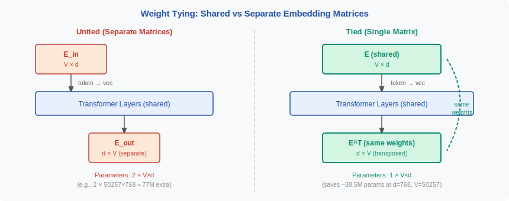
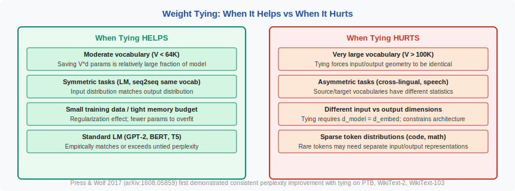

<!-- ============================ TOP NAV ============================ -->
<div align="center">

[🏠 Home](../../README.md) &nbsp;•&nbsp; [📚 Section 2 — Tokenization & Embeddings](./README.md) &nbsp;•&nbsp; [⬅️ Q2‑11 — Embedding Init](./q11-embedding-init.md) &nbsp;•&nbsp; [Q2‑13 — Numbers & Arithmetic ➡️](./q13-tokenization-numbers.md)

</div>

---

# Q2‑12 · What is weight tying between the input embedding and the output (un-embedding) matrix? When does it help and when does it hurt?

<div align="center">


</div>

---

## 1 · The 30-second answer

> **Weight tying shares the input embedding matrix E with the output (un-embedding) projection U = E^T, saving V × d parameters and forcing the model to learn a single representation where each token's input vector is also used to score the output probability of that token.** It helps in language modelling by regularising the output space, but hurts when input and output roles genuinely differ — such as in encoder-decoder models with domain shift between source and target.

Reference: Press & Wolf (2017) *Using the Output Embedding to Improve Language Models* (arXiv:1608.05859).

---

## 2 · The setup without tying

A standard language model has two separate matrices:

```
E  ∈ ℝ^(V × d)   — input embedding: token_id → d-vector
U  ∈ ℝ^(d × V)   — output projection: d-vector → V logits
```

Total embedding parameters: `2 × V × d`.

The forward pass:

```
token_ids  →  E[token_ids]  →  [Transformer layers]  →  h
logits     =  h @ U                                      # (batch, d) × (d, V)
probs      =  softmax(logits)
```

---

## 3 · Weight tying defined

With tying:

$$U = E^{\top}$$

The output logit for token $v$ given hidden state $h$ is:

$$\ell_v = h \cdot e_v$$

where $e_v$ is the v-th row of E (the input embedding of token $v$). This is a **dot-product similarity** between the hidden state and the token's input embedding. The highest-probability token is the one whose input embedding is most similar to the current hidden state.

Saving: `V × d` parameters. For V=128K, d=4096, bf16: **1 GB** of parameter memory.

---

## 4 · Figure 1 — weight tying overview

<div align="center">



</div>

---

## 5 · Why it works — the linguistic intuition

The dot-product interpretation gives a geometric explanation:

- The hidden state $h$ is a point in the embedding space after processing context.
- The model assigns high probability to token $v$ if $e_v$ points in the same direction as $h$.
- This forces the model to learn embeddings where **tokens that appear in similar contexts** (and thus have similar $h$ values) **also score each other highly as predictions**.

This is exactly the distributional hypothesis: words that appear in similar contexts have similar meanings. Weight tying encodes this hypothesis as a hard constraint.

**Press & Wolf (2017)** showed empirically that on Penn Treebank and WikiText-103, a tied LSTM language model outperformed an untied one by 2–3 perplexity points with no increase in parameters.

---

## 6 · Parameter count analysis

| Model | V | d | Untied params | Tied params | Saving |
|-------|---|---|---------------|-------------|--------|
| GPT-2 small | 50K | 768 | 76.8M | 38.4M | 38.4M |
| LLaMA-1 7B | 32K | 4096 | 262M | 131M | 131M |
| LLaMA-3 8B | 128K | 4096 | 1.05B | 525M | 525M |

For LLaMA-3 8B with 8B total parameters, tying saves ~6.5% of the parameter budget while maintaining the same effective capacity in the Transformer layers.

---

## 7 · When tying helps

1. **Decoder-only language models** (GPT family, LLaMA, Mistral): the input and output vocabularies are identical; the intuition that "tokens that appear in similar contexts also predict each other" holds strongly.

2. **Small models**: the parameter saving is proportionally larger and the regularisation prevents the output matrix from overfitting on high-frequency tokens.

3. **Long-tail vocabulary**: rare tokens share gradient signals between their input and output embedding rows, partially addressing the sparse-gradient problem (Q2-11).

4. **Memory-constrained deployment**: 1 GB saving at LLaMA-3 scale is significant on consumer GPUs.

---

## 8 · When tying hurts (or is inapplicable)

1. **Encoder-decoder models with different source/target languages** (e.g., cross-lingual machine translation): the optimal input representation for a token in language A may differ from the optimal output representation for the corresponding token in language B.

2. **Autoregressive models with large vocabulary (>256K)**: the constraint that input and output share the same space can limit the model's expressiveness when the output distribution is very peaked and the input representation needs to encode nuanced positional and syntactic information.

3. **Models where the hidden state dimension ≠ vocabulary embedding dimension** (e.g., some efficient architectures with a bottleneck): the shapes must match for tying to be valid.

4. **Models fine-tuned for classification or extraction**: if the final-layer hidden state is used for a non-generation task, the output head is task-specific and should not share weights with the input embedding.

---

## 9 · Figure 2 — when tying helps vs. hurts

<div align="center">



</div>

---

## 10 · Implementation in PyTorch

```python
import torch
import torch.nn as nn

class TiedLanguageModel(nn.Module):
    def __init__(self, vocab_size: int, d_model: int):
        super().__init__()
        self.embed = nn.Embedding(vocab_size, d_model)
        self.transformer = ...  # Transformer layers
        # No separate output projection — use embed.weight.T

    def forward(self, token_ids):
        x = self.embed(token_ids)           # (B, T, d)
        h = self.transformer(x)             # (B, T, d)
        logits = h @ self.embed.weight.T    # (B, T, V)
        return logits
```

The key line is `h @ self.embed.weight.T` — the same `embed.weight` matrix used for lookup is transposed for the output projection.

**Gradient flow**: during backpropagation, gradients from both the embedding lookup (input side) and the output projection (output side) are summed into `embed.weight`. This is the mechanism by which rare tokens get more gradient signal.

---

## 11 · Models that use weight tying

| Model | Tied? | Notes |
|-------|-------|-------|
| GPT-2 | Yes | Explicit in original code |
| GPT-3 | Yes | Not stated in paper; confirmed in API |
| LLaMA-1, 2 | Yes | `model.embed_tokens.weight = model.lm_head.weight` |
| LLaMA-3 | Yes | Stated in tech report |
| BERT | No | Classification model; output head is task-specific |
| T5 | Yes (encoder/decoder tied separately) | Encoder and decoder each tie their own embeddings |
| GPT-J / EleutherAI | Yes | |
| Mistral 7B | Yes | |

---

## 12 · Common interview follow-ups

**Q: Does weight tying affect the gradient magnitude for the embedding?**
Yes. Each token now receives gradients from both the embedding lookup (forward pass input) and the output projection (loss signal). The effective gradient for a token row is the sum of both sources, which generally increases gradient magnitude for all tokens and particularly for rare ones.

**Q: Can you tie weights after training has started?**
Yes, but it requires re-synchronising the two matrices (copy one to the other) and may cause an initial loss spike as the output distribution changes. It is best done at initialisation.

**Q: Does tying work with quantisation?**
Yes. During inference in 4-bit or 8-bit quantisation, the same quantised matrix is used for both input lookup and output projection — saving memory and quantisation overhead.

---

## 13 · Key equations

**Untied output logits:**

$$\ell = h W_U, \quad W_U \in \mathbb{R}^{d \times V}$$

**Tied output logits:**

$$\ell_v = h \cdot e_v, \quad e_v = E[v,:]$$

$$\ell = h E^{\top}$$

**Parameter saving:**

$$\Delta = V \cdot d \cdot b \text{ bytes}$$

where $b$ is bytes per parameter.

---

## 14 · References

| Source | What to read |
|--------|-------------|
| Press & Wolf (2017) *Using the Output Embedding to Improve Language Models* (arXiv:1608.05859) | Original proposal and perplexity results |
| Radford et al. (2019) *GPT-2* | Implementation of tying in a large-scale LM |
| Inan et al. (2017) *Tying Word Vectors and Word Classifiers* | Independent concurrent work on tying |
| Touvron et al. (2023) *LLaMA* | Weight tying in modern open-source LLMs |
| HuggingFace transformers source — `modeling_llama.py` | `self.lm_head.weight = self.model.embed_tokens.weight` |

---

<div align="center">

[⬅️ Q2‑11 — Embedding Init](./q11-embedding-init.md) &nbsp;•&nbsp; [📚 Section 2 README](./README.md) &nbsp;•&nbsp; [Q2‑13 — Numbers & Arithmetic ➡️](./q13-tokenization-numbers.md)

</div>
