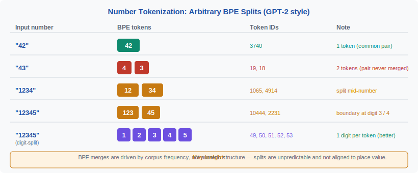
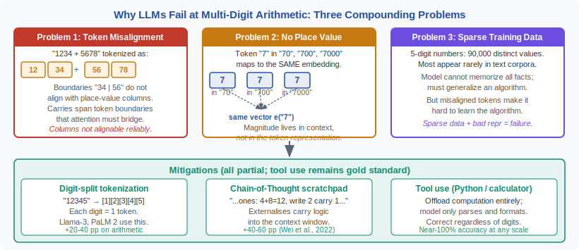

<!-- ============================ TOP NAV ============================ -->
<div align="center">

[🏠 Home](../../README.md) &nbsp;•&nbsp; [📚 Section 2 — Tokenization & Embeddings](./README.md) &nbsp;•&nbsp; [⬅️ Q2‑12 — Weight Tying](./q12-weight-tying-embeddings.md) &nbsp;•&nbsp; [Q2‑14 — Token Healing ➡️](./q14-token-healing.md)

</div>

---

# Q2‑13 · How does tokenization interact with numbers and arithmetic? Why do LLMs struggle with multi-digit arithmetic?

<div align="center">


</div>

---

## 1 · The 30-second answer

> **BPE tokenises numbers based on their frequency in training text, not their mathematical structure. This causes arbitrary multi-digit splits (e.g., "1234" → ["12", "34"] or ["1", "234"]) that are inconsistent across numbers, making positional alignment of digits impossible. Combined with no carry mechanism in the attention architecture, this is the primary reason LLMs fail at multi-digit arithmetic.**

---

## 2 · The root cause: BPE is frequency-based, not semantic

BPE learns merge rules by counting co-occurrence frequencies in training text. For numbers:

- "10", "11", "12", ..., "99" are very common in natural language — these get their own tokens.
- Three-digit numbers split based on which 2-digit substrings appear frequently as prefixes: "100" → "1" + "00", "200" → "200" (common enough), "347" → "34" + "7".
- The splitting pattern **varies across numbers** with no systematic relationship to place value.

**Example (GPT-2 cl50k tokeniser):**

```
>>> tokenize("1234 + 5678")
['12', '34', ' +', ' 56', '78']

>>> tokenize("9999 + 1")
['99', '99', ' +', ' 1']

>>> tokenize("2048")
['20', '48']
```

The digit "2" in "2048" has positional value 2000, but the model sees the token "20" — a completely different numerical concept.

---

## 3 · Figure 1 — arbitrary BPE splits on numbers

<div align="center">



</div>

---

## 4 · Three compounding problems

### 4.1 · Positional misalignment

For a human performing addition:
```
  1 2 3 4
+ 5 6 7 8
---------
```
Carry propagates from right to left, always aligning ones, tens, hundreds, thousands.

For an LLM with BPE tokens:
```
[12][34] + [56][78]
```
The model sees "12" and "56" as token pairs — there is no alignment on the ones or tens column. To add correctly, it must learn to decompose "12" into "1" and "2", which requires operations not present in the attention mechanism.

### 4.2 · No carry mechanism

The attention mechanism computes weighted sums over token representations. There is no data structure analogous to a carry register. The model must encode the carry implicitly in the hidden state, which requires the sequence to be processed in a specific right-to-left order — contradictory to standard left-to-right autoregressive generation.

### 4.3 · Token boundary inconsistency

Adding two numbers where the split points differ is even harder:

```
"999" → ["999"]        (single token)
"1000" → ["1000"]      (single token)
"999 + 1" → ["999", " +", " 1"]
result "1000" is a completely different token from the inputs
```

The model has seen many "999 + 1 = 1000" examples in training, so it can memorise this. But "99999 + 1 = 100000" has different token structure and the model must generalise — which it often cannot.

---

## 5 · Figure 2 — why LLMs fail at multi-digit arithmetic

<div align="center">



</div>

---

## 6 · Empirical evidence

**Benchmark: Nogueira et al. (2021)** *Investigating the Limitations of Transformers with Simple Arithmetic Tasks*:

- GPT-3 175B achieves ~99% accuracy on 2-digit addition, ~87% on 3-digit, ~56% on 4-digit.
- Accuracy drops sharply at the tokenisation boundary: numbers where the split point changes between operands are harder.
- A model trained with **individual-digit tokenisation** achieves >95% on 5-digit addition with the same model size.

**Brown et al. (2020)** (GPT-3): "The model can handle 2-digit arithmetic with high accuracy but struggles with 3-digit operations."

---

## 7 · Tokenisation fixes that help

### 7.1 · Individual digit tokenisation (LLaMA-3, GPT-4)

Use a pre-tokenizer regex that splits every digit individually:

```python
# tiktoken GPT-4 pattern includes:
# (?<=\d)(?=\d)  — split between consecutive digits
"1234" → ["1", "2", "3", "4"]
```

This allows the model to learn column alignment, though it still lacks a carry mechanism. LLaMA-3's 128K vocabulary was designed with individual digit tokens.

### 7.2 · Reverse digit order

Andrej Karpathy and others have noted that outputting numbers in reverse order (ones first) aligns generation order with carry propagation. Used in some training data augmentation setups.

### 7.3 · Scratchpad / chain-of-thought

Wei et al. (2022) *Chain-of-Thought Prompting* shows that decomposing arithmetic into step-by-step intermediate results dramatically improves accuracy — the model offloads the carry tracking to the token stream:

```
1 2 3 4
+ 5 6 7 8
= (4+8=12, write 2 carry 1), (3+7+1=11, write 1 carry 1), ...
= 6 9 1 2   ← read backwards
```

### 7.4 · Tool use / code execution

Modern systems (ChatGPT Code Interpreter, Claude with tool use) bypass the arithmetic limitation entirely by generating and executing code. The LLM produces `print(1234 + 5678)` and the Python interpreter evaluates it correctly.

---

## 8 · Worked tokenisation examples

```python
import tiktoken
enc = tiktoken.get_encoding("cl100k_base")  # GPT-4 tokeniser

for s in ["123", "1234", "12345", "99999", "1000000"]:
    tokens = enc.encode(s)
    decoded = [enc.decode([t]) for t in tokens]
    print(f"{s:>10} → {decoded}")
```

Typical output:
```
       123 → ['123']
      1234 → ['1234']
     12345 → ['123', '45']
     99999 → ['999', '99']
   1000000 → ['1000000']
```

Note: cl100k has many full number strings as tokens because they were frequent in training data (dates, years, prices). But the coverage is not systematic — gaps appear for less-common number patterns.

---

## 9 · The decimal point problem

Floating point numbers introduce an additional complication:

```
"3.14159" → ["3", ".", "14", "159"]   or   ["3.14", "159"]
"2.718"   → ["2", ".", "718"]
```

The decimal point changes the semantic meaning of every digit's position, but the tokeniser has no way to encode this — the token "14" has the same representation whether it appears in "3.14" (meaning 0.14) or "314" (meaning 314).

---

## 10 · Code model implications

In code, numbers appear as integer literals, float literals, and hexadecimal. BPE splits these inconsistently:

```python
"0xFF" → ["0x", "FF"]          # fine
"0x1A2B3C" → ["0x1", "A2", "B3C"]  # inconsistent
"1_000_000" → ["1", "_", "000", "_", "000"]  # Python underscore separator
```

This is why code models sometimes produce syntactically valid but numerically incorrect constants — the token representing "1A2B" has no semantic connection to its hexadecimal value.

---

## 11 · Mitigation summary

| Approach | How it helps | Cost |
|----------|-------------|------|
| Individual digit tokens | Column alignment possible | Longer sequences, +memory |
| Chain-of-thought | Offloads carry to token stream | 3–5× more tokens |
| Tool use (code execution) | Correct by construction | Latency of execution |
| Reverse-digit training | Aligns generation with carry propagation | Dataset modification needed |
| Fine-tuning on arithmetic scratchpads | Learns carry patterns implicitly | Requires curated data |

---

## 12 · Common interview follow-ups

**Q: Why can LLMs answer "what is 2+2" correctly but fail at "1234567+9876543"?**
Small sums are memorised from training data. Large sums require generalisation across tokenisation boundaries that the model has not seen in training.

**Q: Does more training data help with arithmetic?**
Marginally. The bottleneck is the tokenisation and architectural mismatch, not data quantity. Individual-digit tokenisation + chain-of-thought + code execution address the root causes; more data does not.

**Q: How does Wolfram Alpha or a calculator avoid this?**
They parse the number string into a machine integer and apply hardware arithmetic. LLMs process tokenized strings through attention layers — fundamentally different computation.

---

## 13 · Key equations

**BPE merge frequency** (why certain multi-digit tokens exist):

$$\text{score}(t_1, t_2) = \frac{f(t_1 t_2)}{f(t_1) \cdot f(t_2)}$$

High-frequency bigrams like "19" (years), "20" (years), "00" (dates) become tokens; arbitrary digit pairs do not.

**Positional misalignment error rate** (empirical, Nogueira et al. 2021):

$$P(\text{error}) \approx 1 - 0.99^{n-2} \quad \text{(n = number of digits)}$$

Falls from ~1% at n=2 to ~44% at n=5 for standard BPE models.

---

## 14 · References

| Source | What to read |
|--------|-------------|
| Nogueira et al. (2021) *Investigating the Limitations of Transformers with Simple Arithmetic Tasks* | Core empirical study; digit-level vs. BPE comparison |
| Brown et al. (2020) *Language Models are Few-Shot Learners* (GPT-3) | Arithmetic benchmarks in Appendix H |
| Wei et al. (2022) *Chain-of-Thought Prompting Elicits Reasoning in Large Language Models* | CoT as mitigation |
| Muffo et al. (2022) *Evaluating Transformer Language Models on Arithmetic Operations* | Systematic tokenisation analysis |
| LLaMA-3 Tech Report (Meta AI, 2024) | Individual-digit tokenisation design decision |

---

<div align="center">

[⬅️ Q2‑12 — Weight Tying](./q12-weight-tying-embeddings.md) &nbsp;•&nbsp; [📚 Section 2 README](./README.md) &nbsp;•&nbsp; [Q2‑14 — Token Healing ➡️](./q14-token-healing.md)

</div>
