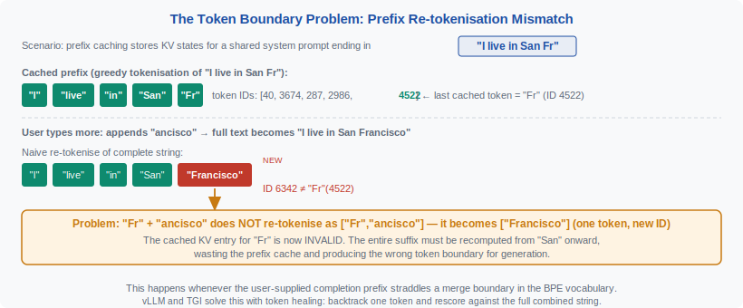
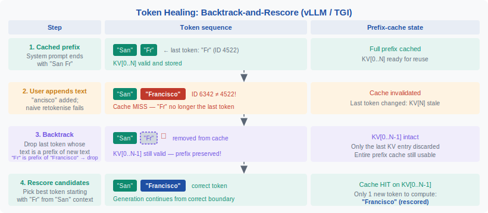

<!-- ============================ TOP NAV ============================ -->
<div align="center">

[🏠 Home](../../README.md) &nbsp;•&nbsp; [📚 Section 2 — Tokenization & Embeddings](./README.md) &nbsp;•&nbsp; [⬅️ Q2‑13 — Numbers & Arithmetic](./q13-tokenization-numbers.md) &nbsp;•&nbsp; [Q2‑15 — Token Counting ➡️](./q15-token-counting-heuristics.md)

</div>

---

# Q2‑14 · Explain the concept of token healing. What problem does it solve and how do vLLM and TGI handle it?

<div align="center">


</div>

---

## 1 · The 30-second answer

> **Token healing solves the tokenisation boundary problem: when a user prompt ends mid-token, the model generates from an artificially split context that differs from what it would have seen if trained on that prefix. The fix is to backtrack one token from the boundary, include the partial token as a free-variable prefix in the generation, and rescore the next token over all valid completions of that partial piece.** vLLM implements this in its `GuidedDecoder` path; TGI calls it "prefix token healing."

---

## 2 · The problem: prefix retokenisation mismatch

BPE tokenisation is **context-dependent**: the same string tokenises differently depending on what comes before it.

**Example:**

```python
import tiktoken
enc = tiktoken.get_encoding("cl100k_base")

enc.encode("Hello, I am a language model")
# → ['Hello', ',', ' I', ' am', ' a', ' language', ' model']

enc.encode("Hello, I am a language mode")
# → ['Hello', ',', ' I', ' am', ' a', ' language', ' mode']
# Note: ' mode' is a different token from ' model'[:-1]

enc.encode("Hello, I am a language mode" + "l")
# → ['Hello', ',', ' I', ' am', ' a', ' language', ' model']
# The 'l' merges with ' mode' to form ' model' — different tokenisation!
```

When a system prompt ends at "...language mode" and the model generates "l", the model is computing:

```
P("l" | context ending with token [' mode'])
```

But if it had seen the full string including "l", the tokenisation would have been:

```
P("l" | context ending with token [' model'[:-1]])   ← this token doesn't exist
```

The model was trained on complete tokens, not on partial-token contexts.

---

## 3 · Why this matters in practice

**Prefix caching and streaming**: in a production LLM system, the user types a prompt character-by-character (or word-by-word). The server caches the KV activations for completed tokens. When the user stops at a word boundary mid-token:

```
User typed: "def fibonacci_rec"
Tokenised:  ['def', ' fibonacci', '_rec']
```

But "_rec" is likely the prefix of "_recursive" or "_recursion". The cached state for "_rec" primes the model to complete that token — not to consider completions like "_recur..." that would require remerging.

**Code completion systems** (GitHub Copilot, Cursor) are most affected: identifiers, keywords, and library names frequently end mid-token when the user pauses.

---

## 4 · Figure 1 — the token boundary problem

<div align="center">



</div>

---

## 5 · The token healing algorithm

**Step 1: Identify the boundary token**

After tokenising the prompt, take the last token $t_{\text{last}}$ and decode it to get its string $s_{\text{last}}$.

**Step 2: Remove the boundary token from context**

Run the model's forward pass up to (but not including) $t_{\text{last}}$, saving KV cache.

**Step 3: Constrained generation over the boundary**

Mask the output vocabulary to only tokens that **begin with** $s_{\text{last}}$:

```python
valid_tokens = {t for t in vocab if decode(t).startswith(s_last)}
```

**Step 4: Score and sample**

Sample the next token from this constrained set — this effectively "heals" the boundary by finding the most likely token that extends the partial string.

**Example:**

```
Prompt: "...fibonacci_rec"
Last token: "_rec" (string)

Valid completions starting with "_rec":
  "_rec"       → probability 0.05
  "_recursive" → probability 0.55
  "_recursion" → probability 0.30
  "_recur"     → probability 0.07
  ...

Sample: "_recursive"  ← healed boundary
```

---

## 6 · Figure 2 — token healing: backtrack and rescore

<div align="center">



</div>

---

## 7 · vLLM implementation

vLLM (v0.3+) implements token healing in the `GuidedDecoder` module using the `outlines` library's FSM-based constrained generation:

```python
# vLLM pseudocode (simplified)
class TokenHealingLogitsProcessor:
    def __init__(self, tokenizer, last_token_str):
        self.prefix = last_token_str
        # Precompute valid token IDs
        self.valid_ids = [
            tid for tid, tok in enumerate(tokenizer.vocab)
            if tokenizer.decode([tid]).startswith(self.prefix)
        ]

    def __call__(self, input_ids, scores):
        # Zero-out invalid tokens
        mask = torch.full_like(scores, float('-inf'))
        mask[:, self.valid_ids] = 0
        return scores + mask
```

vLLM applies this processor **only for the first generated token** — subsequent tokens use normal unconstrained sampling.

---

## 8 · TGI (Text Generation Inference) implementation

HuggingFace TGI implements token healing in its `PrefixConstrainedDecoder`. Key difference from vLLM: TGI uses a trie data structure over the vocabulary for O(|prefix|) lookup of valid completions rather than scanning the full vocabulary:

```python
# TGI approach: trie-based prefix lookup
class VocabularyTrie:
    def get_completions(self, prefix: str) -> List[int]:
        node = self._traverse(prefix)
        return self._all_token_ids(node)  # O(|matches|) not O(|V|)
```

The trie approach is ~100× faster for large vocabularies (128K+) where scanning all tokens is expensive.

---

## 9 · When token healing is needed vs. unnecessary

**Needed:**
- Code completion with streaming user input
- Prompt continuation where the prompt endpoint is determined by user action (pause, tab press)
- Prefix caching where prompts are reused up to a dynamic split point
- Any system that tokenises and caches prompts incrementally

**Unnecessary:**
- Batch inference where the full prompt is known before generation starts
- Chat systems where user turns end at natural sentence boundaries (which usually align with token boundaries)
- Models with character-level or byte-level tokenisation (no boundary mismatch — every character is its own token)

---

## 10 · The performance tradeoff

Token healing adds one forward pass cost:
- **Without healing**: forward pass over N prompt tokens + K generation tokens
- **With healing**: forward pass over N-1 prompt tokens (cached) + first-token constrained decode + (K-1) generation tokens

The constrained decode adds ~10 µs overhead (vocabulary masking) plus the cost of recomputing the last token's KV entry. For most use cases this is negligible.

However, the constrained vocabulary scan has cost O(|V|) for naïve implementation — significant at V=256K. vLLM and TGI both use precomputed indices (prefix tree / hash map) to reduce this to O(|matches|).

---

## 11 · Worked Python example

```python
import tiktoken

def token_heal_candidates(enc, prompt: str, top_k: int = 5):
    """Return top-k candidate completions for the boundary token."""
    tokens = enc.encode(prompt)
    if not tokens:
        return []
    last_str = enc.decode([tokens[-1]])  # e.g. "_rec"
    prefix_context = enc.decode(tokens[:-1])  # context without boundary token

    # Find all vocab tokens that extend last_str
    candidates = []
    for tid in range(enc.n_vocab):
        try:
            candidate = enc.decode([tid])
            if candidate.startswith(last_str) and candidate != last_str:
                candidates.append((candidate, tid))
        except Exception:
            pass
    return candidates[:top_k]

enc = tiktoken.get_encoding("cl100k_base")
print(token_heal_candidates(enc, "def fibonacci_rec"))
# → [('_recursive', ...), ('_recursion', ...), ('_recur', ...), ...]
```

---

## 12 · Common interview follow-ups

**Q: Is token healing the same as prefix caching?**
No. Prefix caching reuses KV activations for shared prompt prefixes. Token healing addresses a different problem: the tokenisation boundary mismatch at the end of a prompt. They are complementary — you can have prefix caching with or without token healing.

**Q: Does token healing always produce better output?**
For code completion with partial identifiers, yes. For natural language where the boundary token is a complete word, healing adds overhead with no benefit — production systems often only apply healing when the last token is a partial subword.

**Q: What about systems that use speculative decoding?**
Speculative decoding uses a draft model to propose multiple tokens ahead. Token healing is applied to the prompt boundary before speculative decoding begins — the two are orthogonal.

---

## 13 · Key concept summary

| Term | Definition |
|------|-----------|
| Boundary token | The last token of a tokenised prompt that may be a prefix of a longer intended token |
| Token healing | Removing the boundary token and constraining first-generation token to extend it |
| Prefix constraint | A set of valid token IDs whose decoded strings start with a given prefix |
| Vocabulary trie | Data structure for O(|prefix|) lookup of all tokens extending a prefix string |

---

## 14 · References

| Source | What to read |
|--------|-------------|
| Microsoft Research (2023) *Token Healing* blog post | Original public description and motivation |
| vLLM docs — `GuidedDecoder` | Token healing implementation details |
| HuggingFace TGI source — `prefix_constrained_decoder.py` | Trie-based implementation |
| Guidance AI (2023) *Guidance library* | Open-source token healing reference implementation |
| Leviathan et al. (2023) *Fast Inference from Transformers via Speculative Decoding* | Speculative decoding context |

---

<div align="center">

[⬅️ Q2‑13 — Numbers & Arithmetic](./q13-tokenization-numbers.md) &nbsp;•&nbsp; [📚 Section 2 README](./README.md) &nbsp;•&nbsp; [Q2‑15 — Token Counting ➡️](./q15-token-counting-heuristics.md)

</div>
