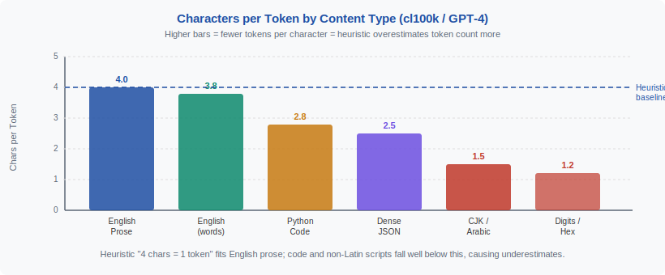
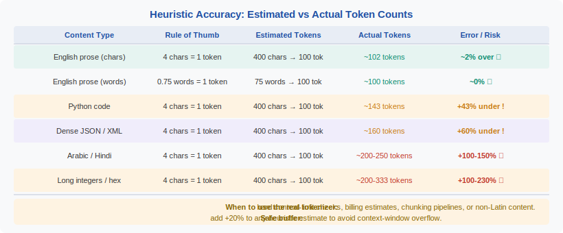

<!-- ============================ TOP NAV ============================ -->
<div align="center">

[🏠 Home](../../README.md) &nbsp;•&nbsp; [📚 Section 2 — Tokenization & Embeddings](./README.md) &nbsp;•&nbsp; [⬅️ Q2‑14 — Token Healing](./q14-token-healing.md) &nbsp;•&nbsp; [Q2‑16 — Special Tokens ➡️](./q16-special-tokens.md)

</div>

---

# Q2‑15 · How do you estimate the number of tokens in a document without running the tokenizer?

<div align="center">


</div>

---

## 1 · The 30-second answer

> **The most reliable rule of thumb for English prose is ~4 characters per token (or ~0.75 tokens per word) under GPT-4's cl100k tokeniser. Code is denser at ~3.5 chars/token; Chinese/Japanese compress to ~1.5–2 chars/token; Arabic and Tamil expand to 5+ chars/token. These heuristics break on heavily formatted text, source code with long identifiers, and non-Latin scripts.** Always verify against tiktoken for cost-critical applications.

---

## 2 · Why estimate without running the tokenizer?

Three production scenarios:

1. **Rate limiting and cost pre-checks**: before sending a request to an API with per-token pricing, estimate the cost to decide whether to truncate or summarise the input.
2. **Chunking documents for RAG**: split a document into ~512-token chunks without tokenising every character.
3. **Context window gating**: quickly decide whether a document fits in a 4K, 32K, or 128K context without paying the tokenisation overhead.

Running tiktoken is fast (~1 µs/token), but in a hot path serving millions of requests per day, even microseconds add up. For coarse gating (does this fit in context?), a character count check is 100× faster.

---

## 3 · The character-per-token heuristic

For English prose under cl100k (GPT-4 tokeniser):

```
tokens ≈ len(text) / 4
```

**Where this comes from**: A typical English word is 4–6 characters. Most common English words (the, a, in, of, is, it) are single tokens. Subword splits happen for longer words (~15% of words in English text). Averaging across all these cases gives ~4 characters per token.

**Quick mental math**:
- A 1,000-word email (avg 5 chars/word = 5,000 chars) ≈ 1,250 tokens
- A 10-page research paper (~5,000 words, 25,000 chars) ≈ 6,250 tokens
- A typical context window usage check: if `len(text) < 4 * context_limit`, it probably fits

---

## 4 · Content-type table

| Content type | Chars/token | Tokens/word | Notes |
|-------------|-------------|-------------|-------|
| English prose | ~4.0 | ~0.75 | Most reliable estimate |
| English code (Python/JS) | ~3.5 | ~1.0–1.5 | Identifiers split; operators have own tokens |
| Markdown (with formatting) | ~3.8 | — | Headers, bullets add overhead |
| JSON / structured data | ~3.2 | — | Braces, quotes, colons each a token |
| Chinese / Japanese | ~1.8 | N/A | Characters ≈ tokens under BPE; no word separator |
| Arabic | ~2.5 | ~4.5 | Right-to-left; many diacritics → byte fallback |
| Tamil / Devanagari | ~1.5 | ~6.0 | High fertility; byte-level fallback common |
| Base64 / hex strings | ~4.0 | — | Looks like English to BPE |
| Python docstrings | ~3.5–4.0 | — | Similar to prose |

---

## 5 · Figure 1 — characters per token by content type

<div align="center">



</div>

---

## 6 · Word-based heuristic

An alternative to character counting:

```
tokens ≈ word_count × 1.33   (for English prose)
tokens ≈ word_count × 1.5    (for code / technical text)
```

The ~1.33 multiplier accounts for subword splits on longer words and the fact that punctuation and whitespace each consume additional tokens.

```python
def estimate_tokens_by_words(text: str, content_type: str = "prose") -> int:
    words = len(text.split())
    multipliers = {"prose": 1.33, "code": 1.5, "json": 2.0}
    return int(words * multipliers.get(content_type, 1.33))
```

---

## 7 · Figure 2 — heuristic accuracy vs. actual token count

<div align="center">



</div>

---

## 8 · Common failure modes

### 8.1 · Long identifiers in code

```python
# Python: 'very_long_function_name_that_exceeds_normal_length'
# Tokenises to: ['very', '_long', '_function', '_name', '_that',
#                '_exceeds', '_normal', '_length']
# 8 tokens for 50 chars = 6.25 chars/token — heuristic overestimates tokens
```

The char/4 heuristic predicts 50/4 = 12.5 tokens; actual is 8 — off by 56%.

### 8.2 · Mixed scripts

A document mixing English and Chinese has neither the English nor Chinese token rate:

```
"OpenAI发布了GPT-4" → ['Open', 'AI', '发布', '了', 'GPT', '-', '4']
# 7 tokens for 11 characters = 1.57 chars/token
# char/4 predicts 2.75 tokens — 75% underestimate
```

### 8.3 · Code with dense punctuation

```python
# Python comprehension:
# [f(x) for x in range(n) if g(x)]
# Tokenises to ~16 tokens for 32 chars = 2 chars/token
```

### 8.4 · Repeated whitespace / indentation

Four-space indentation becomes 4 separate tokens (or sometimes 1 "    " token depending on vocabulary). Deep nesting in JSON/Python can inflate token counts significantly.

---

## 9 · Practical Python estimator

```python
import re

def estimate_tokens(text: str) -> dict:
    """Quick token count estimates with confidence flags."""
    char_count = len(text)
    word_count = len(text.split())

    # Detect content type
    code_indicators = ['{', '}', 'def ', 'function ', '()', '=>', '->']
    is_code = any(ind in text for ind in code_indicators)

    # Detect script
    cjk_chars = sum(1 for c in text if '一' <= c <= '鿿')
    arabic_chars = sum(1 for c in text if '؀' <= c <= 'ۿ')
    cjk_fraction = cjk_chars / max(char_count, 1)
    arabic_fraction = arabic_chars / max(char_count, 1)

    if cjk_fraction > 0.3:
        estimate = char_count / 1.8
        confidence = "medium"
    elif arabic_fraction > 0.3:
        estimate = char_count / 2.5
        confidence = "low"
    elif is_code:
        estimate = char_count / 3.5
        confidence = "medium"
    else:
        estimate = char_count / 4.0
        confidence = "high"

    return {
        "estimate": int(estimate),
        "confidence": confidence,
        "char_count": char_count,
        "word_count": word_count,
    }

print(estimate_tokens("The quick brown fox jumps over the lazy dog."))
# → {'estimate': 11, 'confidence': 'high', 'char_count': 44, 'word_count': 9}
```

---

## 10 · When to use the actual tokenizer

Use tiktoken directly when:
- **Cost billing**: never estimate when actual cost matters — off-by-20% estimates compound across millions of requests.
- **Context window enforcement**: a 4K context window has hard limits; estimation errors cause truncation failures or wasted context.
- **Non-English content**: fertility variation is 3× across scripts; heuristics are unreliable.
- **Latency is not critical**: batch preprocessing, offline indexing.

```python
import tiktoken

enc = tiktoken.get_encoding("cl100k_base")  # GPT-4 / GPT-3.5-turbo

def exact_token_count(text: str) -> int:
    return len(enc.encode(text))
```

Performance: tiktoken processes ~1M tokens/second in Python, so a 10,000-token document takes ~10 ms — fast enough for most server-side use cases.

---

## 11 · Chunking strategy using heuristics

For RAG document chunking targeting 512 tokens per chunk:

```python
def chunk_document(text: str, target_tokens: int = 512,
                   chars_per_token: float = 4.0) -> list[str]:
    target_chars = int(target_tokens * chars_per_token)
    # Split on paragraph boundaries near the target size
    paragraphs = text.split('\n\n')
    chunks, current = [], []
    current_chars = 0
    for para in paragraphs:
        if current_chars + len(para) > target_chars and current:
            chunks.append('\n\n'.join(current))
            current, current_chars = [], 0
        current.append(para)
        current_chars += len(para)
    if current:
        chunks.append('\n\n'.join(current))
    return chunks
```

This gives ~10% variance from the true token count — acceptable for chunking, where exact boundaries are less important than semantic coherence.

---

## 12 · Common interview follow-ups

**Q: How accurate is the 4 chars/token rule?**
For English prose, within ±15% for documents over 500 characters. For shorter texts, special tokens (BOS, EOS) and the overhead of common words dominate.

**Q: Why is code denser (fewer chars/token) than prose?**
Many code keywords (if, for, in, def, return) are single tokens despite being short. Long identifiers split into many tokens. Net effect: more tokens per character than English prose.

**Q: How do you estimate tokens for an API response when you don't have the text yet?**
You cannot — response token counts require actual generation. For cost budgeting, most APIs report `usage.completion_tokens` after the call. For pre-call budgeting, historical averages per request type are used.

---

## 13 · Key heuristics (summary)

| Rule | Application |
|------|------------|
| `tokens ≈ chars / 4` | English prose, quick gating |
| `tokens ≈ chars / 3.5` | Code / technical text |
| `tokens ≈ chars / 1.8` | Chinese / Japanese |
| `tokens ≈ words × 1.33` | English, word-count available |
| `tokens ≈ words × 1.5` | Code / mixed content |

---

## 14 · References

| Source | What to read |
|--------|-------------|
| OpenAI Tokenizer documentation | Official chars/token guidance; `tiktoken` library |
| tiktoken GitHub (openai/tiktoken) | Source for cl100k_base and o200k_base patterns |
| Petrov et al. (2023) *Language Model Tokenizers Introduce Unfairness Between Languages* | Empirical fertility across 1,000+ languages |
| Ahia et al. (2023) *Do All Languages Cost the Same? Tokenization in the Era of Commercial Language Models* | API cost disparities from fertility gaps |

---

<div align="center">

[⬅️ Q2‑14 — Token Healing](./q14-token-healing.md) &nbsp;•&nbsp; [📚 Section 2 README](./README.md) &nbsp;•&nbsp; [Q2‑16 — Special Tokens ➡️](./q16-special-tokens.md)

</div>
