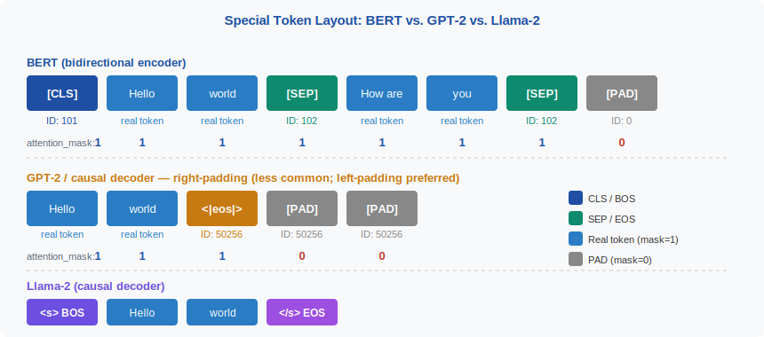
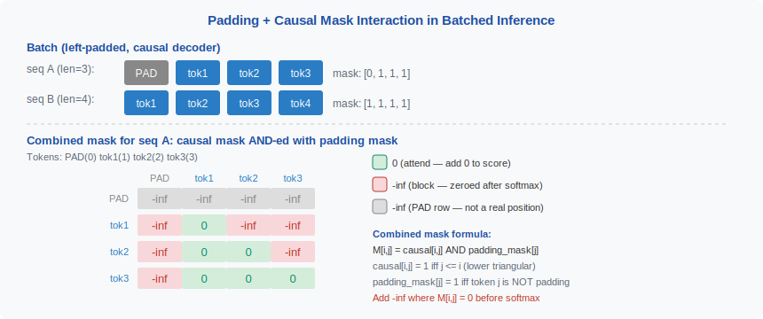

<!-- ============================ TOP NAV ============================ -->
<div align="center">

[🏠 Home](../../README.md) &nbsp;•&nbsp; [📚 Section 2 — Tokenization & Embeddings](./README.md) &nbsp;•&nbsp; [⬅️ Q2‑15 — Token Counting](./q15-token-counting-heuristics.md) &nbsp;•&nbsp; [Q2‑17 — Glitch Tokens ➡️](./q17-glitch-tokens.md)

</div>

---

# Q2‑16 · What is the special token protocol and how do different model families handle padding and attention masking for batched inference?

<div align="center">


</div>

---

## 1 · The 30-second answer

> **Special tokens (BOS, EOS, PAD, MASK, SEP, CLS) are reserved vocabulary entries that signal structural boundaries to the model. BERT uses [CLS] and [SEP] to bracket segments and [MASK] for MLM training. GPT-style models use BOS/EOS at sequence boundaries and PAD for batching. For batched inference, decoder-only models use right-padding to keep generated content left-aligned, and the attention mask zeros out PAD positions to prevent attending to meaningless tokens.**

---

## 2 · The special token vocabulary

| Token | Name | BERT ID | GPT-2 | LLaMA-2 | Purpose |
|-------|------|---------|-------|---------|---------|
| [CLS] / \<s\> | Classification / BOS | 101 | — | 1 | Marks start of sequence; aggregates representation in BERT |
| [SEP] / \</s\> | Separator / EOS | 102 | 50256 | 2 | Marks end of segment or full sequence |
| [PAD] | Padding | 0 | — | 0 | Fills short sequences in a batch |
| [MASK] | Mask | 103 | — | — | Replaced token in MLM training |
| [UNK] | Unknown | 100 | — | — | Fallback for OOV tokens |
| \<|endoftext|\> | End of text | — | 50256 | — | GPT-2 sequence separator |

---

## 3 · BERT's special token protocol

BERT uses a **classification token [CLS]** prepended to every input and a **separator token [SEP]** at segment boundaries and at the end. For sentence-pair tasks:

```
Input:  [CLS] sentence_A [SEP] sentence_B [SEP]
IDs:    101  ... 102     ...   102
```

The [CLS] token's final hidden state is used as the sequence-level representation for classification tasks — because [CLS] attends to all positions through bidirectional attention, its representation aggregates the full sequence.

**[MASK]** is used only during pre-training (Masked Language Modelling). 15% of tokens are randomly selected; 80% are replaced with [MASK], 10% with a random token, 10% are unchanged. This prevents the model from relying on the identity of [MASK] as a prediction signal.

---

## 4 · GPT-2 and decoder-only protocol

GPT-2 uses a single special token: **\<|endoftext|\>** (ID 50256) to separate documents during training. It serves as both BOS and EOS.

```
Training stream:  doc_1_tokens <|endoftext|> doc_2_tokens <|endoftext|> ...
```

At inference:
- The BOS role is played by the start of the prompt (no explicit [CLS]).
- The model generates until it produces \<|endoftext|\> (EOS) or hits max_new_tokens.
- There is no [PAD] during single-sequence inference — padding is only needed for batching.

**LLaMA-2 refinement:**
- `<s>` (BOS, ID=1) is prepended to every input.
- `</s>` (EOS, ID=2) is appended to signal the end of an assistant turn.
- `[INST]` and `[/INST]` are added as formatting tokens for instruction-following mode.

---

## 5 · Figure 1 — special token layout: BERT vs. GPT-2 vs. LLaMA-2

<div align="center">



</div>

---

## 6 · Batched inference: the padding problem

Neural networks require fixed-size tensors. When batching sequences of different lengths:

```
Batch:
  seq_0: [1, 423, 78, 1022, 2]              (length 5)
  seq_1: [1, 56, 9901, 334, 1108, 77, 2]    (length 7)
  seq_2: [1, 200, 2]                         (length 3)
```

Must be padded to a common length (max in batch = 7):

```
  seq_0: [1, 423, 78, 1022, 2,    0,    0]   (2 padding tokens added)
  seq_1: [1, 56, 9901, 334, 1108, 77,   2]   (no padding)
  seq_2: [1, 200, 2,    0,    0,  0,    0]   (4 padding tokens added)
```

---

## 7 · Attention masking for padding

Without masking, the model would attend to PAD tokens and corrupt its hidden states. The **attention mask** is a binary tensor:

```python
attention_mask = torch.tensor([
    [1, 1, 1, 1, 1, 0, 0],   # seq_0: 5 real, 2 padding
    [1, 1, 1, 1, 1, 1, 1],   # seq_1: all real
    [1, 1, 1, 0, 0, 0, 0],   # seq_2: 3 real, 4 padding
])
```

In scaled dot-product attention, this is applied as:

```python
scores = (Q @ K.T) / sqrt(d_k)          # (B, H, T, T)
scores += (1 - mask) * (-1e9)            # zero-out PAD positions
weights = softmax(scores, dim=-1)
output = weights @ V
```

PAD positions receive a score of -1e9 before softmax, which maps to ≈0 attention weight — effectively invisible to the model.

---

## 8 · Right-padding vs. left-padding for decoder-only models

**For encoder models (BERT):** padding position does not matter because all positions attend to all others.

**For decoder-only autoregressive models:** the choice matters significantly.

### Right-padding (preferred for batch generation)

```
seq_0: [BOS] tok₁ tok₂ tok₃ [EOS] [PAD] [PAD]
seq_1: [BOS] tok₁ tok₂ tok₃ tok₄ tok₅ [EOS]
```

Generated tokens are appended at the same relative position for all sequences in the batch. This allows **continuous KV caches** — all sequences have their KV states aligned from position 0.

### Left-padding (preferred for single-step batch scoring)

```
seq_0: [PAD] [PAD] [BOS] tok₁ tok₂ tok₃ [EOS]
seq_1: [BOS] tok₁ tok₂ tok₃ tok₄ tok₅ [EOS]
```

The last non-padding token is at position -1 for all sequences — convenient for extracting the final hidden state for classification.

---

## 9 · Figure 2 — padding + causal mask interaction

<div align="center">



</div>

---

## 10 · Combining causal mask and padding mask

For decoder-only batched generation:

```python
def make_attention_mask(seq_len, pad_mask):
    """
    seq_len: int
    pad_mask: (B, T) binary, 1=real 0=pad
    Returns: (B, 1, T, T) additive mask
    """
    # Causal mask: lower triangular
    causal = torch.tril(torch.ones(seq_len, seq_len))  # (T, T)
    # Pad mask: broadcast over target positions
    pad = pad_mask.unsqueeze(1).unsqueeze(2)  # (B, 1, 1, T)
    combined = (causal.unsqueeze(0) * pad)    # (B, 1, T, T)
    # Convert to additive: 0 → -inf, 1 → 0
    return (1 - combined) * -1e9
```

The combined mask ensures:
1. No position attends to future positions (causal constraint).
2. No position attends to PAD tokens (padding constraint).

---

## 11 · Positional encodings and padding

RoPE (Rotary Position Embedding) encodes position implicitly via the query-key dot product. **PAD tokens should be assigned their actual position in the sequence** (not a special "pad position"), because:
- The causal mask already prevents non-PAD tokens from attending to PAD tokens.
- Assigning position 0 to all PAD tokens can cause RoPE to mis-compute phase angles for the real tokens around them.

ALiBi (Attention with Linear Biases) adds a linear penalty `-m × distance` to attention scores. For PAD tokens, the large negative combined mask (-1e9) dominates over the small ALiBi bias, so padding handling is the same.

---

## 12 · The [MASK] token in fine-tuning vs. inference

BERT's [MASK] token is a training artifact. At inference, [MASK] is used only when:
1. **Fill-mask tasks**: the user explicitly provides a sentence with [MASK] and asks the model to predict the missing word.
2. **BERT-based NER/classification**: the model is fine-tuned with real tokens (no [MASK]) — the [MASK] token from pre-training is simply part of the vocabulary but rarely appears.

**Do not confuse [MASK] with [PAD]**: [MASK] means "predict this position's original token"; [PAD] means "this position does not exist".

---

## 13 · Special tokens in the training loss

During language model training, loss is typically computed only over **real** tokens, not special tokens:

```python
# HuggingFace convention: -100 in labels → ignored by CrossEntropyLoss
labels = input_ids.clone()
labels[labels == tokenizer.pad_token_id] = -100  # ignore PAD in loss
labels[:, :num_prompt_tokens] = -100              # ignore prompt in loss
loss = criterion(logits, labels)
```

This prevents the model from learning to "predict PAD" and ensures gradient signal flows only from meaningful token predictions.

---

## 14 · Common interview follow-ups

**Q: What happens if you forget the attention mask during batched inference?**
The model attends to PAD tokens. For encoders, this inflates the hidden state norms unpredictably. For decoders, PAD positions may appear in the context and cause the model to generate tokens conditioned on meaningless positions — typically manifests as truncated or repetitive outputs.

**Q: Why does LLaMA-2 chat use [INST] / [/INST] tags rather than single special tokens?**
LLaMA-2's base vocabulary was designed for text continuation. The instruction tags were added as multi-character special tokens in the fine-tuning phase because adding new single token IDs would require expanding the embedding table.

**Q: Can you use the same PAD token ID as a real vocabulary token?**
Technically yes, but it breaks loss masking — you cannot distinguish real occurrences of that token from padding. Models like GPT-2 (which has no dedicated PAD token) use EOS as PAD during batching, which can cause the model to learn to predict EOS in PAD positions.

---

## 15 · References

| Source | What to read |
|--------|-------------|
| Devlin et al. (2019) *BERT: Pre-training of Deep Bidirectional Transformers* | [CLS], [SEP], [MASK] protocol design |
| Radford et al. (2019) *GPT-2* | Single \<|endoftext|\> token design |
| Touvron et al. (2023) *LLaMA 2* | BOS/EOS IDs 1/2; chat special tokens |
| HuggingFace Transformers — `modeling_llama.py` | Attention mask + RoPE implementation |
| Su et al. (2021) *RoFormer: Enhanced Transformer with Rotary Position Embedding* | RoPE and its interaction with position IDs |

---

<div align="center">

[⬅️ Q2‑15 — Token Counting](./q15-token-counting-heuristics.md) &nbsp;•&nbsp; [📚 Section 2 README](./README.md) &nbsp;•&nbsp; [Q2‑17 — Glitch Tokens ➡️](./q17-glitch-tokens.md)

</div>
